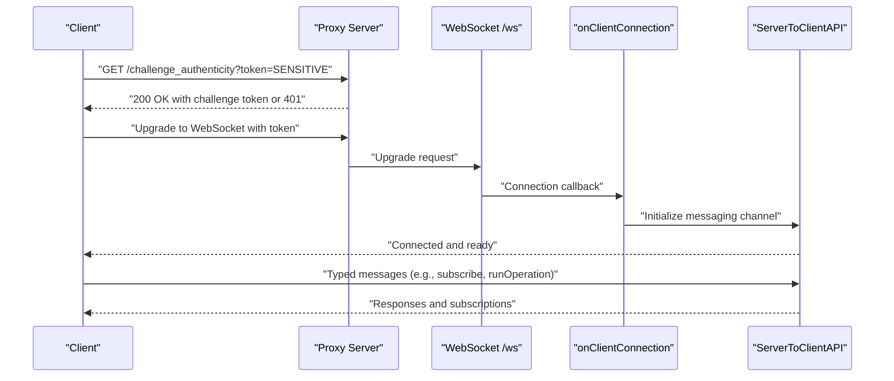
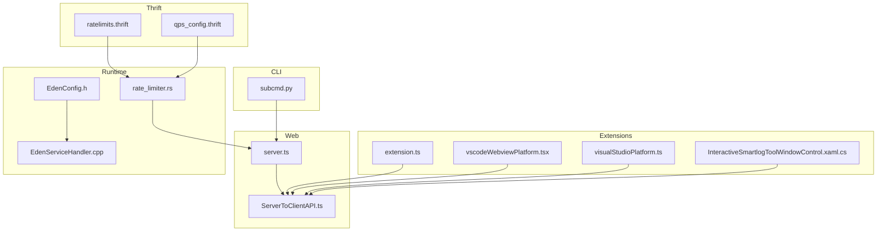

# API Reference

<cite>
**Referenced Files in This Document**
- [subcmd.py](file://eden/fs/cli/subcmd.py)
- [server.ts](file://addons/isl-server/proxy/server.ts)
- [ServerToClientAPI.ts](file://addons/isl-server/src/ServerToClientAPI.ts)
- [vscodeApi.ts](file://addons/vscode/webview/vscodeApi.ts)
- [vscodeWebviewPlatform.tsx](file://addons/vscode/webview/vscodeWebviewPlatform.tsx)
- [visualStudioPlatform.ts](file://addons/isl/src/platform/visualStudioPlatform.ts)
- [InteractiveSmartlogToolWindowControl.xaml.cs](file://addons/vs/InteractiveSmartlogVSExtension/InteractiveSmartlogVSExtension/ToolWindows/InteractiveSmartlogToolWindowControl.xaml.cs)
- [extension.ts](file://addons/vscode/extension/extension.ts)
- [ratelimits.thrift](file://configerator/structs/scm/mononoke/ratelimiting/ratelimits.thrift)
- [qps_config.thrift](file://configerator/structs/scm/mononoke/qps/qps_config.thrift)
- [rate_limiter.rs](file://eden/mononoke/servers/slapi/slapi_service/src/middleware/rate_limiter.rs)
- [EdenServiceHandler.cpp](file://eden/fs/service/EdenServiceHandler.cpp)
- [EdenConfig.h](file://eden/fs/config/EdenConfig.h)
- [ACR_wire_protocol_compat.md](file://eden/.llms/rules/ACR_wire_protocol_compat.md)
- [lib.rs](file://eden/scm/lib/version/src/lib.rs)
- [verlink.rs](file://eden/scm/lib/dag/src/verlink.rs)
</cite>

## Table of Contents
1. [Introduction](#introduction)
2. [Project Structure](#project-structure)
3. [Core Components](#core-components)
4. [Architecture Overview](#architecture-overview)
5. [Detailed Component Analysis](#detailed-component-analysis)
6. [Dependency Analysis](#dependency-analysis)
7. [Performance Considerations](#performance-considerations)
8. [Troubleshooting Guide](#troubleshooting-guide)
9. [Conclusion](#conclusion)
10. [Appendices](#appendices)

## Introduction
This document provides a comprehensive API reference for SAPLING SCM across CLI, Web API, Extension APIs, and Thrift-based server-client protocols. It covers:
- CLI API: command specifications, exit codes, and error handling
- Web API: REST endpoints and WebSocket protocol with authentication
- Extension API: VS Code and Visual Studio integrations
- Thrift protocols: request/response schemas and service definitions
- Practical usage examples, client implementation guidelines, and integration patterns
- Authentication, rate limiting, versioning, and backwards compatibility considerations

## Project Structure
The SAPLING SCM codebase organizes APIs across multiple subsystems:
- CLI command framework and subcommands
- Web server proxy and WebSocket transport
- Server-to-client messaging protocol
- VS Code and Visual Studio extension integrations
- Thrift-based rate limiting and QPS configuration
- Rate limiting middleware and server configuration
- Versioning and compatibility utilities

```mermaid
graph TB
subgraph "CLI"
CLI["subcmd.py"]
end
subgraph "Web API"
Proxy["server.ts"]
WS["WebSocket /ws"]
REST["REST endpoints"]
end
subgraph "Messaging"
STC["ServerToClientAPI.ts"]
end
subgraph "Extensions"
VSCode["extension.ts"]
VSCodeWebview["vscodeWebviewPlatform.tsx"]
VS["visualStudioPlatform.ts"]
VSXaml["InteractiveSmartlogToolWindowControl.xaml.cs"]
end
subgraph "Thrift"
RL["ratelimits.thrift"]
QPS["qps_config.thrift"]
end
subgraph "Runtime"
RLmw["rate_limiter.rs"]
EC["EdenConfig.h"]
EH["EdenServiceHandler.cpp"]
end
CLI --> REST
REST --> STC
Proxy --> WS
WS --> STC
VSCode --> STC
VSCodeWebview --> STC
VS --> STC
VSXaml --> STC
RLmw --> REST
RL --> RLmw
QPS --> RLmw
EC --> EH
```

**Diagram sources**
- [subcmd.py:1-236](file://eden/fs/cli/subcmd.py#L1-L236)
- [server.ts:1-331](file://addons/isl-server/proxy/server.ts#L1-L331)
- [ServerToClientAPI.ts:1-800](file://addons/isl-server/src/ServerToClientAPI.ts#L1-L800)
- [extension.ts:1-133](file://addons/vscode/extension/extension.ts#L1-L133)
- [vscodeWebviewPlatform.tsx:1-73](file://addons/vscode/webview/vscodeWebviewPlatform.tsx#L1-L73)
- [visualStudioPlatform.ts:1-74](file://addons/isl/src/platform/visualStudioPlatform.ts#L1-L74)
- [InteractiveSmartlogToolWindowControl.xaml.cs:300-389](file://addons/vs/InteractiveSmartlogVSExtension/InteractiveSmartlogVSExtension/ToolWindows/InteractiveSmartlogToolWindowControl.xaml.cs#L300-L389)
- [ratelimits.thrift:1-184](file://configerator/structs/scm/mononoke/ratelimiting/ratelimits.thrift#L1-L184)
- [qps_config.thrift:1-28](file://configerator/structs/scm/mononoke/qps/qps_config.thrift#L1-L28)
- [rate_limiter.rs:1-116](file://eden/mononoke/servers/slapi/slapi_service/src/middleware/rate_limiter.rs#L1-L116)
- [EdenConfig.h:345-394](file://eden/fs/config/EdenConfig.h#L345-L394)
- [EdenServiceHandler.cpp:704-728](file://eden/fs/service/EdenServiceHandler.cpp#L704-L728)

**Section sources**
- [subcmd.py:1-236](file://eden/fs/cli/subcmd.py#L1-L236)
- [server.ts:1-331](file://addons/isl-server/proxy/server.ts#L1-L331)
- [ServerToClientAPI.ts:1-800](file://addons/isl-server/src/ServerToClientAPI.ts#L1-L800)
- [extension.ts:1-133](file://addons/vscode/extension/extension.ts#L1-L133)
- [vscodeWebviewPlatform.tsx:1-73](file://addons/vscode/webview/vscodeWebviewPlatform.tsx#L1-L73)
- [visualStudioPlatform.ts:1-74](file://addons/isl/src/platform/visualStudioPlatform.ts#L1-L74)
- [InteractiveSmartlogToolWindowControl.xaml.cs:300-389](file://addons/vs/InteractiveSmartlogVSExtension/InteractiveSmartlogVSExtension/ToolWindows/InteractiveSmartlogToolWindowControl.xaml.cs#L300-L389)
- [ratelimits.thrift:1-184](file://configerator/structs/scm/mononoke/ratelimiting/ratelimits.thrift#L1-L184)
- [qps_config.thrift:1-28](file://configerator/structs/scm/mononoke/qps/qps_config.thrift#L1-L28)
- [rate_limiter.rs:1-116](file://eden/mononoke/servers/slapi/slapi_service/src/middleware/rate_limiter.rs#L1-L116)
- [EdenConfig.h:345-394](file://eden/fs/config/EdenConfig.h#L345-L394)
- [EdenServiceHandler.cpp:704-728](file://eden/fs/service/EdenServiceHandler.cpp#L704-L728)

## Core Components
- CLI command framework: defines command decorators, parsers, and help handling
- Web API server: serves static assets, validates tokens, upgrades HTTP to WebSocket, and routes platform-specific connections
- Messaging protocol: typed message bus between server and client for repository operations, subscriptions, and platform actions
- Extension APIs: VS Code extension activation, platform bridges, and webview message handling
- Thrift configurations: rate limiting and QPS counters definitions
- Runtime middleware and server configuration: rate limiting enforcement and Thrift server tuning

**Section sources**
- [subcmd.py:102-138](file://eden/fs/cli/subcmd.py#L102-L138)
- [server.ts:51-63](file://addons/isl-server/proxy/server.ts#L51-L63)
- [ServerToClientAPI.ts:71-116](file://addons/isl-server/src/ServerToClientAPI.ts#L71-L116)
- [extension.ts:31-109](file://addons/vscode/extension/extension.ts#L31-L109)
- [ratelimits.thrift:175-184](file://configerator/structs/scm/mononoke/ratelimiting/ratelimits.thrift#L175-L184)
- [rate_limiter.rs:42-116](file://eden/mononoke/servers/slapi/slapi_service/src/middleware/rate_limiter.rs#L42-L116)
- [EdenConfig.h:352-394](file://eden/fs/config/EdenConfig.h#L352-L394)

## Architecture Overview
The system comprises:
- CLI commands registered via decorators and parsed by argparse
- A proxy server that serves UI assets and upgrades HTTP to WebSocket
- A WebSocket endpoint secured by token validation
- A typed message bus for repository operations and subscriptions
- Extension platforms for VS Code and Visual Studio bridging UI and IDE actions
- Thrift-backed rate limiting and QPS configuration with runtime enforcement



**Diagram sources**
- [server.ts:115-158](file://addons/isl-server/proxy/server.ts#L115-L158)
- [server.ts:172-263](file://addons/isl-server/proxy/server.ts#L172-L263)
- [ServerToClientAPI.ts:225-262](file://addons/isl-server/src/ServerToClientAPI.ts#L225-L262)

**Section sources**
- [server.ts:115-158](file://addons/isl-server/proxy/server.ts#L115-L158)
- [server.ts:172-263](file://addons/isl-server/proxy/server.ts#L172-L263)
- [ServerToClientAPI.ts:225-262](file://addons/isl-server/src/ServerToClientAPI.ts#L225-L262)

## Detailed Component Analysis

### CLI API
- Command definition: decorator registers commands with names, help text, and aliases
- Parser construction: subparsers are created and sorted alphabetically
- Help system: supports nested help for subcommands and returns appropriate exit codes
- Error handling: prints errors to stderr and returns non-zero exit codes on invalid commands

Exit codes
- 0: success
- 2: invalid command or subcommand

Example usage
- Use the help command to display usage for a specific command or all commands

**Section sources**
- [subcmd.py:102-138](file://eden/fs/cli/subcmd.py#L102-L138)
- [subcmd.py:160-177](file://eden/fs/cli/subcmd.py#L160-L177)
- [subcmd.py:200-226](file://eden/fs/cli/subcmd.py#L200-L226)

### Web API (REST and WebSocket)
- REST endpoints
  - Asset serving: serves built assets and grammars from the server root
  - Challenge endpoint: validates sensitive token and returns a challenge token
- WebSocket protocol
  - Upgrade path: HTTP upgrade to WebSocket at /ws
  - Authentication: requires token as URL search parameter
  - Platform routing: selects platform implementation based on URL parameter
  - Lifecycle: manages connection lifecycle, session IDs, and repository cache cleanup

Authentication
- Token validation occurs during WebSocket handshake
- Challenge endpoint allows obtaining a challenge token using the sensitive token

Error handling
- Port binding errors mapped to user-friendly messages
- 401 Unauthorized for invalid tokens
- 404 Not Found for unknown routes

**Section sources**
- [server.ts:115-158](file://addons/isl-server/proxy/server.ts#L115-L158)
- [server.ts:172-263](file://addons/isl-server/proxy/server.ts#L172-L263)
- [server.ts:283-287](file://addons/isl-server/proxy/server.ts#L283-L287)

### Messaging Protocol (Server-to-Client)
- Typed message bus: deserializes incoming messages and routes to handlers
- Repository lifecycle: sets active repository for a given working directory, queues messages until repository is ready
- Subscriptions: supports subscriptions for uncommitted changes, smartlog commits, merge conflicts, submodules, and full repo branches
- Operations: runs operations with progress reporting and abort support
- Platform messages: delegates platform-specific actions to the selected platform implementation

Message categories
- General: heartbeat, stress, changeCwd, requestRepoInfo, requestApplicationInfo, fileBugReport, track, clientReady
- With repository: subscribe/unsubscribe, runOperation, abortRunningOperation, getConfig/setConfig, requestComparison, refresh, pageVisibility, uploadFile, fetchCommitMessageTemplate, fetchShelvedChanges, fetchLatestCommit, fetchSignificantLinesOfCode, fetchCommitChangedFiles
- Platform-specific: platform actions routed to the platform implementation

**Section sources**
- [ServerToClientAPI.ts:71-116](file://addons/isl-server/src/ServerToClientAPI.ts#L71-L116)
- [ServerToClientAPI.ts:225-262](file://addons/isl-server/src/ServerToClientAPI.ts#L225-L262)
- [ServerToClientAPI.ts:354-800](file://addons/isl-server/src/ServerToClientAPI.ts#L354-L800)

### Extension API: VS Code
- Activation: initializes logger, platform, repository list, and registers commands and providers
- Platform bridge: posts messages to VS Code webview and handles confirmations and file opening
- Webview API: communicates with the webview via a typed API acquired from the extension host

Integration pattern
- Use the extension API to expose repository operations and UI integration within VS Code

**Section sources**
- [extension.ts:31-109](file://addons/vscode/extension/extension.ts#L31-L109)
- [vscodeWebviewPlatform.tsx:36-73](file://addons/vscode/webview/vscodeWebviewPlatform.tsx#L36-L73)
- [vscodeApi.ts:1-17](file://addons/vscode/webview/vscodeApi.ts#L1-L17)

### Extension API: Visual Studio
- WebView bridge: injects a JavaScript bridge into the webview to communicate with Visual Studio
- Message handling: parses messages from the webview and invokes IDE actions (open file, show message, open diff)
- Platform integration: exposes platform actions to the ISL UI

Integration pattern
- Use the injected bridge to integrate ISL UI actions with Visual Studio IDE features

**Section sources**
- [InteractiveSmartlogToolWindowControl.xaml.cs:306-389](file://addons/vs/InteractiveSmartlogVSExtension/InteractiveSmartlogVSExtension/ToolWindows/InteractiveSmartlogToolWindowControl.xaml.cs#L306-L389)
- [visualStudioPlatform.ts:23-74](file://addons/isl/src/platform/visualStudioPlatform.ts#L23-L74)

### Thrift-based Protocols
- Rate limiting configuration
  - Targets: static slices, main client IDs, identities, and Atlas targets
  - Metrics: EdenApiQps, EgressBytes, and others
  - Limits: status (disabled/tracked/enforced), thresholds, and scopes
- QPS configuration
  - Counters configuration with category, prefix, and top-level tier
  - Multiple configs supported

Backwards compatibility
- Add new fields as optional
- Deprecate variants instead of removing them
- Ensure consumers handle unknown variants gracefully

**Section sources**
- [ratelimits.thrift:17-184](file://configerator/structs/scm/mononoke/ratelimiting/ratelimits.thrift#L17-L184)
- [qps_config.thrift:13-28](file://configerator/structs/scm/mononoke/qps/qps_config.thrift#L13-L28)
- [ACR_wire_protocol_compat.md:56-77](file://eden/.llms/rules/ACR_wire_protocol_compat.md#L56-L77)

### Rate Limiting and QPS
- Middleware enforcement: checks rate limits at request ingress, compares metrics against thresholds, and returns 429 on violations
- Configuration: dynamic updates via cached config handles; supports multiple limits with different targets and metrics
- QPS counters: Facebook-specific implementation uses region mappings and config handles; OSS implementation is a no-op

**Section sources**
- [rate_limiter.rs:42-116](file://eden/mononoke/servers/slapi/slapi_service/src/middleware/rate_limiter.rs#L42-L116)
- [qps_config.thrift:24-27](file://configerator/structs/scm/mononoke/qps/qps_config.thrift#L24-L27)

### Thrift Server Configuration and Instrumentation
- Server tuning: worker threads, max requests, queue timeout, resource pools, and serial execution options
- Instrumentation: macros for tracing Thrift calls with cancellation support and statistics

**Section sources**
- [EdenConfig.h:352-394](file://eden/fs/config/EdenConfig.h#L352-L394)
- [EdenServiceHandler.cpp:704-728](file://eden/fs/service/EdenServiceHandler.cpp#L704-L728)

## Dependency Analysis
The following diagram shows key dependencies among components:



**Diagram sources**
- [subcmd.py:102-138](file://eden/fs/cli/subcmd.py#L102-L138)
- [server.ts:51-63](file://addons/isl-server/proxy/server.ts#L51-L63)
- [ServerToClientAPI.ts:71-116](file://addons/isl-server/src/ServerToClientAPI.ts#L71-L116)
- [extension.ts:31-109](file://addons/vscode/extension/extension.ts#L31-L109)
- [vscodeWebviewPlatform.tsx:36-73](file://addons/vscode/webview/vscodeWebviewPlatform.tsx#L36-L73)
- [visualStudioPlatform.ts:23-74](file://addons/isl/src/platform/visualStudioPlatform.ts#L23-L74)
- [InteractiveSmartlogToolWindowControl.xaml.cs:306-389](file://addons/vs/InteractiveSmartlogVSExtension/InteractiveSmartlogVSExtension/ToolWindows/InteractiveSmartlogToolWindowControl.xaml.cs#L306-L389)
- [ratelimits.thrift:175-184](file://configerator/structs/scm/mononoke/ratelimiting/ratelimits.thrift#L175-L184)
- [qps_config.thrift:24-27](file://configerator/structs/scm/mononoke/qps/qps_config.thrift#L24-L27)
- [rate_limiter.rs:42-116](file://eden/mononoke/servers/slapi/slapi_service/src/middleware/rate_limiter.rs#L42-L116)
- [EdenConfig.h:352-394](file://eden/fs/config/EdenConfig.h#L352-L394)
- [EdenServiceHandler.cpp:704-728](file://eden/fs/service/EdenServiceHandler.cpp#L704-L728)

**Section sources**
- [subcmd.py:102-138](file://eden/fs/cli/subcmd.py#L102-L138)
- [server.ts:51-63](file://addons/isl-server/proxy/server.ts#L51-L63)
- [ServerToClientAPI.ts:71-116](file://addons/isl-server/src/ServerToClientAPI.ts#L71-L116)
- [extension.ts:31-109](file://addons/vscode/extension/extension.ts#L31-L109)
- [vscodeWebviewPlatform.tsx:36-73](file://addons/vscode/webview/vscodeWebviewPlatform.tsx#L36-L73)
- [visualStudioPlatform.ts:23-74](file://addons/isl/src/platform/visualStudioPlatform.ts#L23-L74)
- [InteractiveSmartlogToolWindowControl.xaml.cs:306-389](file://addons/vs/InteractiveSmartlogVSExtension/InteractiveSmartlogVSExtension/ToolWindows/InteractiveSmartlogToolWindowControl.xaml.cs#L306-L389)
- [ratelimits.thrift:175-184](file://configerator/structs/scm/mononoke/ratelimiting/ratelimits.thrift#L175-L184)
- [qps_config.thrift:24-27](file://configerator/structs/scm/mononoke/qps/qps_config.thrift#L24-L27)
- [rate_limiter.rs:42-116](file://eden/mononoke/servers/slapi/slapi_service/src/middleware/rate_limiter.rs#L42-L116)
- [EdenConfig.h:352-394](file://eden/fs/config/EdenConfig.h#L352-L394)
- [EdenServiceHandler.cpp:704-728](file://eden/fs/service/EdenServiceHandler.cpp#L704-L728)

## Performance Considerations
- WebSocket connection lifecycle: repository cache cleanup is delayed to allow reuse when tabs remain open
- Rate limiting middleware: performs asynchronous checks before expensive operations to minimize server load
- Thrift server configuration: worker thread counts, request queue sizes, and timeouts can be tuned for workload characteristics

[No sources needed since this section provides general guidance]

## Troubleshooting Guide
Common issues and resolutions
- Port binding failures: EACCES indicates insufficient privileges; EADDRINUSE indicates port conflict
- WebSocket authentication failures: missing or invalid token leads to immediate closure with a specific code
- Rate limiting: requests exceeding configured thresholds receive HTTP 429 responses

Operational tips
- Use the challenge endpoint to validate tokens and obtain a challenge token
- Monitor logs from the extension output channel for diagnostics
- Verify platform-specific bridge initialization in Visual Studio and VS Code

**Section sources**
- [server.ts:90-110](file://addons/isl-server/proxy/server.ts#L90-L110)
- [server.ts:189-200](file://addons/isl-server/proxy/server.ts#L189-L200)
- [rate_limiter.rs:104-114](file://eden/mononoke/servers/slapi/slapi_service/src/middleware/rate_limiter.rs#L104-L114)
- [extension.ts:111-132](file://addons/vscode/extension/extension.ts#L111-L132)

## Conclusion
This API reference documents SAPLING SCM’s CLI, Web, Extension, and Thrift interfaces. It provides practical guidance for implementing clients, integrating with IDEs, enforcing rate limits, and maintaining backwards compatibility. Use the provided diagrams and references to align your integration with the documented protocols and patterns.

[No sources needed since this section summarizes without analyzing specific files]

## Appendices

### Versioning and Compatibility
- Version parsing utilities extract date-like components from version strings
- Version linking enforces append-only compatibility semantics and tracks generations for compatibility queries

**Section sources**
- [lib.rs:14-54](file://eden/scm/lib/version/src/lib.rs#L14-L54)
- [verlink.rs:17-73](file://eden/scm/lib/dag/src/verlink.rs#L17-L73)