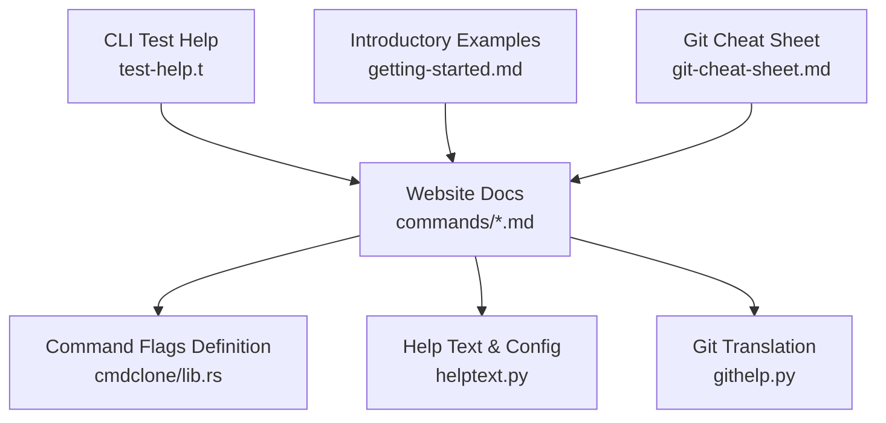
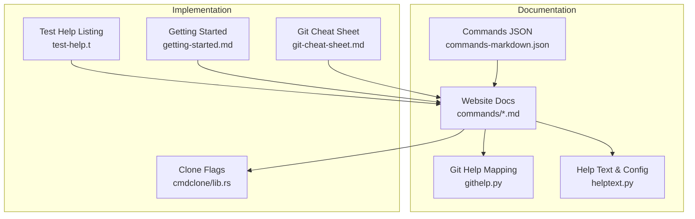
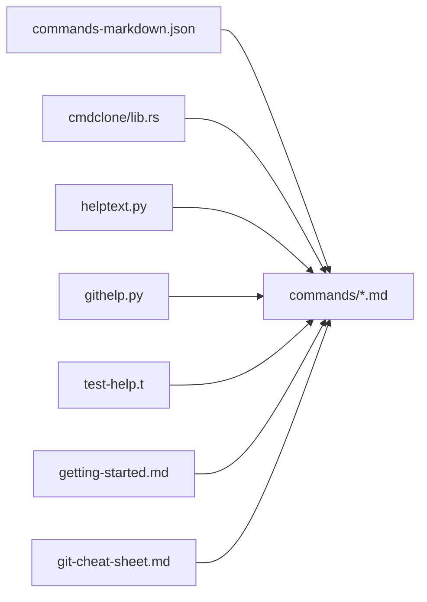

# Basic Commands

<cite>
**Referenced Files in This Document**
- [init.md](file://website/docs/commands/init.md)
- [clone.md](file://website/docs/commands/clone.md)
- [status.md](file://website/docs/commands/status.md)
- [add.md](file://website/docs/commands/add.md)
- [commit.md](file://website/docs/commands/commit.md)
- [remove.md](file://website/docs/commands/remove.md)
- [rm.md](file://website/docs/commands/rm.md)
- [commands-markdown.json](file://website/docs/commands/commands-markdown.json)
- [githelp.py](file://eden/scm/sapling/ext/githelp.py)
- [helptext.py](file://eden/scm/sapling/helptext.py)
- [lib.rs](file://eden/scm/lib/commands/commands/cmdclone/src/lib.rs)
- [test-help.t](file://eden/scm/tests/test-help.t)
- [getting-started.md](file://website/docs/introduction/getting-started.md)
- [git-cheat-sheet.md](file://website/docs/introduction/git-cheat-sheet.md)
</cite>

## Table of Contents
1. [Introduction](#introduction)
2. [Project Structure](#project-structure)
3. [Core Components](#core-components)
4. [Architecture Overview](#architecture-overview)
5. [Detailed Component Analysis](#detailed-component-analysis)
6. [Dependency Analysis](#dependency-analysis)
7. [Performance Considerations](#performance-considerations)
8. [Troubleshooting Guide](#troubleshooting-guide)
9. [Conclusion](#conclusion)

## Introduction
This document describes the SAPLING SCM basic commands for initializing repositories and managing them: init, clone, status, add, commit, and remove/rm. It consolidates syntax, options, parameters, return codes, usage patterns, error conditions, troubleshooting tips, and configuration/environment interactions as documented in the repository’s official documentation and command definitions.

## Project Structure
The documentation for these commands is maintained alongside the SAPLING SCM source in the website documentation and command definition modules. The primary sources include:
- Website command pages for each command
- Command flag and option definitions
- Help text and configuration references
- Example usage in introductory documentation

**Diagram sources**
- [init.md](file://website/docs/commands/init.md)
- [clone.md](file://website/docs/commands/clone.md)
- [status.md](file://website/docs/commands/status.md)
- [add.md](file://website/docs/commands/add.md)
- [commit.md](file://website/docs/commands/commit.md)
- [remove.md](file://website/docs/commands/remove.md)
- [rm.md](file://website/docs/commands/rm.md)
- [lib.rs](file://eden/scm/lib/commands/commands/cmdclone/src/lib.rs)
- [helptext.py](file://eden/scm/sapling/helptext.py)
- [githelp.py](file://eden/scm/sapling/ext/githelp.py)
- [test-help.t](file://eden/scm/tests/test-help.t)
- [getting-started.md](file://website/docs/introduction/getting-started.md)
- [git-cheat-sheet.md](file://website/docs/introduction/git-cheat-sheet.md)

**Section sources**
- [init.md](file://website/docs/commands/init.md)
- [clone.md](file://website/docs/commands/clone.md)
- [status.md](file://website/docs/commands/status.md)
- [add.md](file://website/docs/commands/add.md)
- [commit.md](file://website/docs/commands/commit.md)
- [remove.md](file://website/docs/commands/remove.md)
- [rm.md](file://website/docs/commands/rm.md)
- [lib.rs](file://eden/scm/lib/commands/commands/cmdclone/src/lib.rs)
- [helptext.py](file://eden/scm/sapling/helptext.py)
- [githelp.py](file://eden/scm/sapling/ext/githelp.py)
- [test-help.t](file://eden/scm/tests/test-help.t)
- [getting-started.md](file://website/docs/introduction/getting-started.md)
- [git-cheat-sheet.md](file://website/docs/introduction/git-cheat-sheet.md)

## Core Components
- init: Creates a new repository in a given directory (creating the directory if needed; defaulting to the current directory if none is provided). Returns 0 on success.
- clone: Creates a copy of an existing repository in a new directory. Supports URL schemes, optional Git interpretation, sparse profiles, and checkout options. Returns 0 on success.
- status: Lists files with pending changes in the working directory.
- add: Starts tracking specified files for inclusion in the next commit.
- commit: Saves pending changes or specified files into a new commit.
- remove/rm: Deletes tracked files from the repository and working directory.

**Section sources**
- [init.md](file://website/docs/commands/init.md)
- [clone.md](file://website/docs/commands/clone.md)
- [status.md](file://website/docs/commands/status.md)
- [add.md](file://website/docs/commands/add.md)
- [commit.md](file://website/docs/commands/commit.md)
- [remove.md](file://website/docs/commands/remove.md)
- [rm.md](file://website/docs/commands/rm.md)
- [test-help.t](file://eden/scm/tests/test-help.t)

## Architecture Overview
The command documentation and definitions are organized as follows:
- Website docs define command summaries, arguments, and examples.
- Command flag definitions specify supported options and types.
- Help text and configuration entries describe behavior and tunables.
- Tests and introductory docs provide usage patterns and expectations.

**Diagram sources**
- [commands-markdown.json](file://website/docs/commands/commands-markdown.json)
- [githelp.py](file://eden/scm/sapling/ext/githelp.py)
- [helptext.py](file://eden/scm/sapling/helptext.py)
- [lib.rs](file://eden/scm/lib/commands/commands/cmdclone/src/lib.rs)
- [test-help.t](file://eden/scm/tests/test-help.t)
- [getting-started.md](file://website/docs/introduction/getting-started.md)
- [git-cheat-sheet.md](file://website/docs/introduction/git-cheat-sheet.md)

## Detailed Component Analysis

### init
- Purpose: Initialize a new repository in the given directory. Creates the directory if it does not exist; defaults to the current directory if none is provided.
- Return code: 0 on success.
- Arguments: None explicitly listed in the command page; the synopsis indicates optional directory argument.
- Practical examples: See introductory documentation for typical usage patterns.

Common usage patterns
- Initialize a new repository in the current directory.
- Initialize a new repository in a newly created directory.

Error conditions and troubleshooting
- Directory creation failures (permissions, invalid path).
- Pre-existing repository detection and guidance.

Configuration interactions
- No explicit configuration flags documented for init in the referenced page.

**Section sources**
- [init.md](file://website/docs/commands/init.md)
- [getting-started.md](file://website/docs/introduction/getting-started.md)

### clone
- Purpose: Create a copy of an existing repository in a new directory.
- Return code: 0 on success.
- Syntax and options (selected):
  - -U, --noupdate: Clone an empty working directory.
  - -u, --updaterev: Revision or branch to check out.
  - --enable-profile: Enable a sparse profile.
  - --git: Force interpreting the source as a Git repository.
  - Positional arguments: SOURCE [DEST].
- URL handling:
  - Recognizes Git schemes and converts scp-like URLs to SSH.
  - Non-Git schemes point to an SaplingRemoteAPI-capable repository.
- Sparse profiles: Optional filtering of working copy contents via a named sparse profile.
- Experimental bookmark persistence: Source URL fragment may be persisted as the repository’s main bookmark.
- Practical examples: See command page and introductory documentation.

Common usage patterns
- Clone a remote repository to a new directory.
- Clone with a specific destination directory.
- Clone without checking out a working copy (-U).
- Clone a specific revision or branch (--updaterev).
- Force Git repository interpretation (--git).
- Enable a sparse profile (--enable-profile).

Error conditions and troubleshooting
- Invalid or inaccessible source URL.
- Insufficient permissions for destination directory.
- Failure to apply advertised clone bundles (when applicable) depending on configuration.

Configuration interactions
- Clone bundle behavior controlled by configuration keys (e.g., enabling and fallback preferences).
- Environment variables: Not explicitly listed in the referenced pages; rely on standard shell environment.

**Section sources**
- [clone.md](file://website/docs/commands/clone.md)
- [lib.rs](file://eden/scm/lib/commands/commands/cmdclone/src/lib.rs)
- [helptext.py](file://eden/scm/sapling/helptext.py)
- [getting-started.md](file://website/docs/introduction/getting-started.md)

### status
- Purpose: List files with pending changes in the working directory.
- Return code: 0 on success.
- Arguments: Not explicitly listed in the command page; typical status options are available in the broader commands set.

Common usage patterns
- Check current working directory state before staging or committing.
- Combine with other commands to review changes.

Error conditions and troubleshooting
- Repository not initialized or missing metadata.
- Permission issues preventing file status enumeration.

Configuration interactions
- No explicit configuration flags documented for status in the referenced page.

**Section sources**
- [status.md](file://website/docs/commands/status.md)
- [test-help.t](file://eden/scm/tests/test-help.t)

### add
- Purpose: Start tracking the specified files for inclusion in the next commit.
- Return code: 0 on success.
- Arguments: Not explicitly listed in the command page; typical add options are available in the broader commands set.

Common usage patterns
- Stage all changes in the working directory.
- Stage specific files or globs.

Error conditions and troubleshooting
- Attempting to add non-existent paths.
- Path already tracked or ignored by configuration.

Configuration interactions
- No explicit configuration flags documented for add in the referenced page.

**Section sources**
- [add.md](file://website/docs/commands/add.md)
- [test-help.t](file://eden/scm/tests/test-help.t)

### commit
- Purpose: Save pending changes or specified files into a new commit.
- Return code: 0 on success.
- Arguments: Not explicitly listed in the command page; typical commit options are available in the broader commands set.

Common usage patterns
- Commit staged changes with a message.
- Amend previous commit when appropriate.

Error conditions and troubleshooting
- No changes to commit.
- Commit message requirements or editor issues.

Configuration interactions
- No explicit configuration flags documented for commit in the referenced page.

**Section sources**
- [commit.md](file://website/docs/commands/commit.md)
- [test-help.t](file://eden/scm/tests/test-help.t)
- [getting-started.md](file://website/docs/introduction/getting-started.md)

### remove/rm
- Purpose: Delete the specified tracked files from the repository and working directory.
- Aliases: rm is an alias for remove.
- Return code: 0 on success.
- Arguments: Not explicitly listed in the command page; typical remove/rm options are available in the broader commands set.

Common usage patterns
- Remove tracked files from the repository.
- Combine with status to confirm removal effects.

Error conditions and troubleshooting
- Attempting to remove untracked or unknown files.
- Permission issues preventing file deletion.

Configuration interactions
- No explicit configuration flags documented for remove/rm in the referenced page.

**Section sources**
- [remove.md](file://website/docs/commands/remove.md)
- [rm.md](file://website/docs/commands/rm.md)
- [test-help.t](file://eden/scm/tests/test-help.t)

## Dependency Analysis
The command documentation and definitions are interconnected:
- Website docs reference command flags and options.
- Command flag definitions provide precise option sets.
- Help text and configuration entries clarify behavior and tunables.
- Tests and introductory docs provide usage patterns.

**Diagram sources**
- [commands-markdown.json](file://website/docs/commands/commands-markdown.json)
- [lib.rs](file://eden/scm/lib/commands/commands/cmdclone/src/lib.rs)
- [helptext.py](file://eden/scm/sapling/helptext.py)
- [githelp.py](file://eden/scm/sapling/ext/githelp.py)
- [test-help.t](file://eden/scm/tests/test-help.t)
- [getting-started.md](file://website/docs/introduction/getting-started.md)
- [git-cheat-sheet.md](file://website/docs/introduction/git-cheat-sheet.md)

**Section sources**
- [commands-markdown.json](file://website/docs/commands/commands-markdown.json)
- [lib.rs](file://eden/scm/lib/commands/commands/cmdclone/src/lib.rs)
- [helptext.py](file://eden/scm/sapling/helptext.py)
- [githelp.py](file://eden/scm/sapling/ext/githelp.py)
- [test-help.t](file://eden/scm/tests/test-help.t)
- [getting-started.md](file://website/docs/introduction/getting-started.md)
- [git-cheat-sheet.md](file://website/docs/introduction/git-cheat-sheet.md)

## Performance Considerations
- Clone bundle behavior: Configuration controls whether advertised bundles are used and whether to fall back to a regular clone, impacting speed and reliability during clone operations.
- Sparse profiles: Enabling a sparse profile reduces working copy size and can improve clone and pull performance by limiting materialized content.

**Section sources**
- [helptext.py](file://eden/scm/sapling/helptext.py)

## Troubleshooting Guide
- Clone failures:
  - Verify source URL scheme and accessibility.
  - Consider forcing Git interpretation (--git) when appropriate.
  - Review clone bundle configuration and fallback behavior.
- Working directory state:
  - Use status to identify pending changes.
  - Use add to stage desired changes before commit.
- Removal issues:
  - Ensure files are tracked before attempting removal.
  - Confirm permissions and path correctness.

**Section sources**
- [helptext.py](file://eden/scm/sapling/helptext.py)
- [test-help.t](file://eden/scm/tests/test-help.t)
- [getting-started.md](file://website/docs/introduction/getting-started.md)

## Conclusion
The SAPLING SCM basic commands provide a streamlined workflow for repository initialization, cloning, reviewing changes, staging, committing, and removing files. The referenced documentation pages and command definitions offer comprehensive coverage of syntax, options, return codes, and usage patterns, along with configuration and troubleshooting guidance.