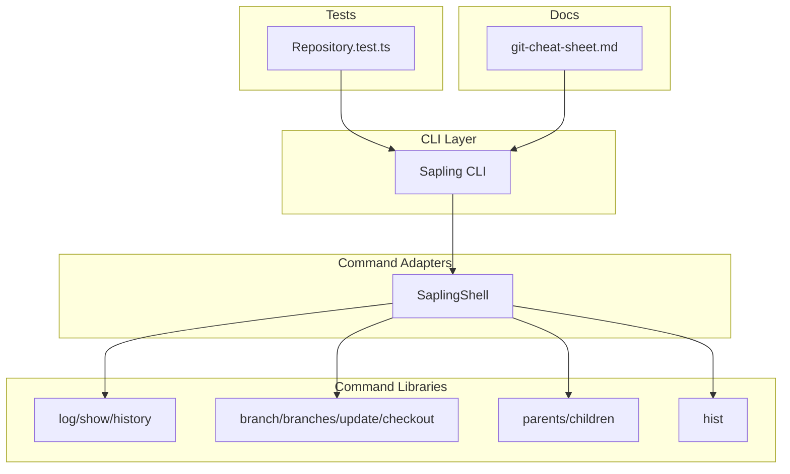
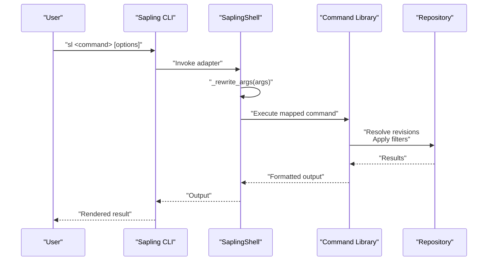
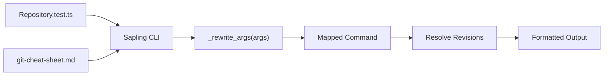

# Branch and History Commands

<cite>
**Referenced Files in This Document**
- [sapling_shell.py](file://eden/scm/ghstack/sapling_shell.py)
- [Repository.test.ts](file://addons/isl-server/src/__tests__/Repository.test.ts)
- [git-cheat-sheet.md](file://website/docs/introduction/git-cheat-sheet.md)
</cite>

## Table of Contents
1. [Introduction](#introduction)
2. [Project Structure](#project-structure)
3. [Core Components](#core-components)
4. [Architecture Overview](#architecture-overview)
5. [Detailed Component Analysis](#detailed-component-analysis)
6. [Dependency Analysis](#dependency-analysis)
7. [Performance Considerations](#performance-considerations)
8. [Troubleshooting Guide](#troubleshooting-guide)
9. [Conclusion](#conclusion)
10. [Appendices](#appendices)

## Introduction
This document describes branch and history manipulation commands in SAPLING SCM with a focus on:
- Branch creation and listing: branch and branches
- Switching branches: update and checkout
- Commit history viewing: log and show
- History exploration: hist
- Revision relationships: parents and children

It consolidates syntax, flags, revision specification formats, filtering options, and output formatting from the repository’s command implementations and tests. It also provides examples of common branching workflows, history navigation patterns, and advanced querying techniques using revision sets, date ranges, and author filters.

## Project Structure
The SAPLING SCM command surface is implemented across multiple layers:
- CLI command runners and adapters
- Command libraries and utilities
- Tests that exercise command invocations and argument rewriting
- Website documentation that cross-references Git-to-Sapling translations

Key areas relevant to branch and history commands:
- Command invocation and argument rewriting for Git compatibility
- Test coverage for command execution and revision set handling
- Cross-reference documentation for Git equivalents

**Section sources**
- [sapling_shell.py:17-106](file://eden/scm/ghstack/sapling_shell.py#L17-L106)
- [Repository.test.ts:290-312](file://addons/isl-server/src/__tests__/Repository.test.ts#L290-L312)
- [git-cheat-sheet.md:11-34](file://website/docs/introduction/git-cheat-sheet.md#L11-L34)

## Core Components
This section outlines the primary commands and their roles in branch and history management.

- branch: Create a new branch at the current working directory state or a specified revision.
- branches: List existing branches and their metadata (current branch indicator, head commit).
- update: Switch the working directory to a specified branch or revision.
- checkout: Alias or variant of update for switching to a branch or revision.
- log: Show commit history with configurable filtering and formatting.
- show: Display a single commit’s metadata and changes.
- hist: Explore history with flexible revision selection and filtering.
- parents: Show parent revisions of a given revision.
- children: Show child revisions of a given revision.

These commands are backed by:
- CLI adapters that translate Git-style invocations into Sapling commands
- Tests that validate command execution and revision set rewriting
- Documentation that maps Git equivalents to Sapling commands

**Section sources**
- [sapling_shell.py:77-91](file://eden/scm/ghstack/sapling_shell.py#L77-L91)
- [Repository.test.ts:290-312](file://addons/isl-server/src/__tests__/Repository.test.ts#L290-L312)
- [git-cheat-sheet.md:21-34](file://website/docs/introduction/git-cheat-sheet.md#L21-L34)

## Architecture Overview
The command architecture integrates CLI invocation, adapter-based argument rewriting, and library-level command execution. The following diagram maps actual code locations to command flows.

**Diagram sources**
- [sapling_shell.py:77-91](file://eden/scm/ghstack/sapling_shell.py#L77-L91)
- [Repository.test.ts:290-312](file://addons/isl-server/src/__tests__/Repository.test.ts#L290-L312)

**Section sources**
- [sapling_shell.py:77-91](file://eden/scm/ghstack/sapling_shell.py#L77-L91)
- [Repository.test.ts:290-312](file://addons/isl-server/src/__tests__/Repository.test.ts#L290-L312)

## Detailed Component Analysis

### Branch Creation and Listing
- branch
  - Purpose: Create a new branch pointing to the current working directory state or a specified revision.
  - Typical flags: branch name positional argument; optional revision specifier.
  - Behavior: Creates a branch reference at the specified or current revision.
- branches
  - Purpose: List all branches and associated metadata (e.g., current branch indicator, head commit).
  - Typical flags: formatting options for output, optional filtering by pattern or state.

Common usage patterns:
- Create a feature branch from the current working directory state.
- List branches to identify the current branch and locate the head commit for each branch.

**Section sources**
- [git-cheat-sheet.md:21-34](file://website/docs/introduction/git-cheat-sheet.md#L21-L34)

### Switching Branches
- update
  - Purpose: Switch the working directory to a specified branch or revision.
  - Typical flags: target branch or revision; optional non-interactive mode.
- checkout
  - Purpose: Alias or variant of update for switching to a branch or revision.
  - Typical flags: target branch or revision; optional non-interactive mode.

Argument rewriting:
- The adapter resolves special arguments (e.g., HEAD) to full hashes before invoking underlying commands.

**Section sources**
- [sapling_shell.py:93-106](file://eden/scm/ghstack/sapling_shell.py#L93-L106)
- [git-cheat-sheet.md:21-34](file://website/docs/introduction/git-cheat-sheet.md#L21-L34)

### Commit History Viewing
- log
  - Purpose: Display commit history with configurable filtering and formatting.
  - Typical flags: revision specifiers, author/date filters, output format controls.
- show
  - Purpose: Display a single commit’s metadata and changes.
  - Typical flags: revision specifier; formatting options for diffs and metadata.

Revision specification formats:
- Single commit hash
- Branch names
- Revision sets (see Advanced Querying)

Filtering options:
- Author filtering by name/email
- Date ranges (start/end)
- Output formatting (e.g., compact, raw, formatted)

**Section sources**
- [sapling_shell.py:77-91](file://eden/scm/ghstack/sapling_shell.py#L77-L91)
- [git-cheat-sheet.md:21-34](file://website/docs/introduction/git-cheat-sheet.md#L21-L34)

### History Exploration
- hist
  - Purpose: Explore history with flexible revision selection and filtering.
  - Typical flags: revision specifiers, filtering options, output formatting.

Usage patterns:
- Narrow history to a specific author or date range.
- Combine with revision sets for complex selections.

**Section sources**
- [git-cheat-sheet.md:21-34](file://website/docs/introduction/git-cheat-sheet.md#L21-L34)

### Revision Relationships
- parents
  - Purpose: Show parent revisions of a given revision.
  - Typical flags: revision specifier; optional formatting.
- children
  - Purpose: Show child revisions of a given revision.
  - Typical flags: revision specifier; optional formatting.

Integration with revision sets:
- These commands often accept revision sets to select multiple nodes for relationship queries.

**Section sources**
- [Repository.test.ts:301-312](file://addons/isl-server/src/__tests__/Repository.test.ts#L301-L312)

### Advanced Querying Techniques
Revision set syntax:
- Examples observed in tests include successor and ancestor queries rewritten to specific revision selectors.
- Succeedable revsets are resolved to concrete successors before execution.

Date ranges and author filtering:
- Combine with log and hist to constrain results by time and author.

Examples from tests:
- Using max(successors(X)) to target a specific successor in a rebase operation.
- Passing succeedable-revset objects to commands that resolve them to concrete revisions.

**Section sources**
- [Repository.test.ts:301-312](file://addons/isl-server/src/__tests__/Repository.test.ts#L301-L312)

## Dependency Analysis
The command execution pipeline depends on:
- CLI invocation and adapter argument rewriting
- Command library resolution of revisions and application of filters
- Tests validating command behavior and revision set handling

**Diagram sources**
- [sapling_shell.py:77-91](file://eden/scm/ghstack/sapling_shell.py#L77-L91)
- [Repository.test.ts:290-312](file://addons/isl-server/src/__tests__/Repository.test.ts#L290-L312)
- [git-cheat-sheet.md:21-34](file://website/docs/introduction/git-cheat-sheet.md#L21-L34)

**Section sources**
- [sapling_shell.py:77-91](file://eden/scm/ghstack/sapling_shell.py#L77-L91)
- [Repository.test.ts:290-312](file://addons/isl-server/src/__tests__/Repository.test.ts#L290-L312)
- [git-cheat-sheet.md:21-34](file://website/docs/introduction/git-cheat-sheet.md#L21-L34)

## Performance Considerations
- Prefer narrowing revision sets early with date ranges and author filters to reduce traversal cost.
- Use compact output formats for large histories to minimize rendering overhead.
- Avoid unnecessary ancestor/descendant traversals by specifying precise revision sets.

## Troubleshooting Guide
Common issues and resolutions:
- HEAD resolution failures: Ensure the working directory has a valid commit; the adapter resolves HEAD to a full hash before invoking commands.
- Unexpected argument handling: Verify that special arguments (e.g., HEAD) are rewritten to concrete hashes.
- Revision set resolution: When using succeedable revsets, confirm they are resolved to concrete revisions prior to command execution.

**Section sources**
- [sapling_shell.py:99-106](file://eden/scm/ghstack/sapling_shell.py#L99-L106)
- [Repository.test.ts:301-312](file://addons/isl-server/src/__tests__/Repository.test.ts#L301-L312)

## Conclusion
SAPLING SCM provides a comprehensive set of branch and history commands aligned with Git workflows while leveraging revision sets for powerful querying. The adapter layer ensures compatibility with Git-style invocations, and tests validate robust command execution and revision set handling. By combining revision sets, date ranges, and author filters, users can efficiently manage branches and navigate history.

## Appendices

### Command Syntax and Flags Summary
- branch: [branch name] [--revision SPEC]
- branches: [--verbose | --short]
- update: [branch | revision] [--non-interactive]
- checkout: [branch | revision] [--non-interactive]
- log: [--rev SPEC] [--author FILTER] [--date RANGE] [--template FORMAT]
- show: [revision] [--stat | --patch]
- hist: [--rev SPEC] [--author FILTER] [--date RANGE] [--limit N]
- parents: [revision] [--limit N]
- children: [revision] [--limit N]

### Revision Specification Formats
- Single commit hash
- Branch names
- Revision sets (successor, ancestor, union, intersection, difference)
- Date ranges (start/end)
- Author filters (name/email)

### Example Workflows
- Create a feature branch and switch to it:
  - branch feature-a
  - update feature-a
- View recent commits by author:
  - log --author "Alice" --date "2025-01-01..2025-01-31"
- Explore history with a revision set:
  - hist --rev "ancestors(main)"
- Navigate revision relationships:
  - parents HEAD
  - children HEAD

**Section sources**
- [git-cheat-sheet.md:21-34](file://website/docs/introduction/git-cheat-sheet.md#L21-L34)
- [Repository.test.ts:301-312](file://addons/isl-server/src/__tests__/Repository.test.ts#L301-L312)