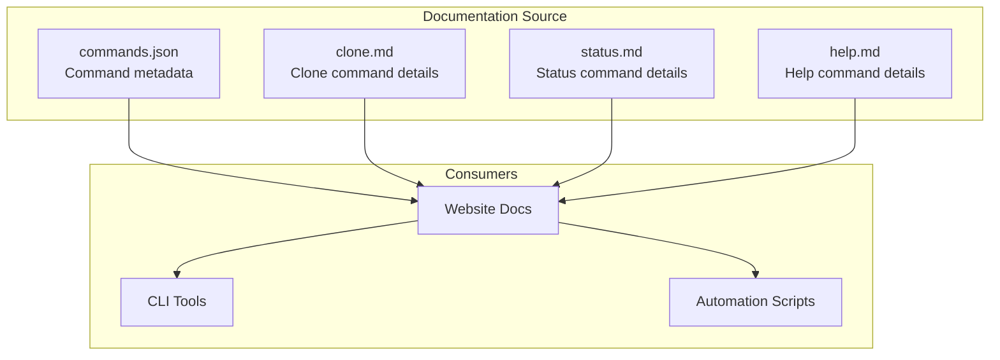
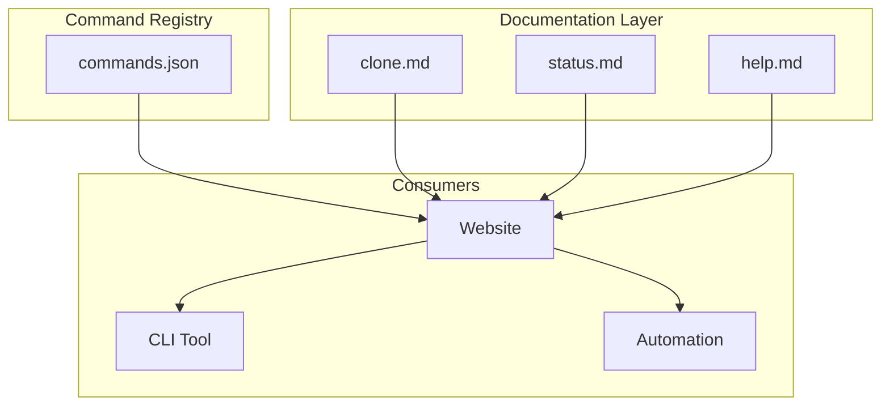
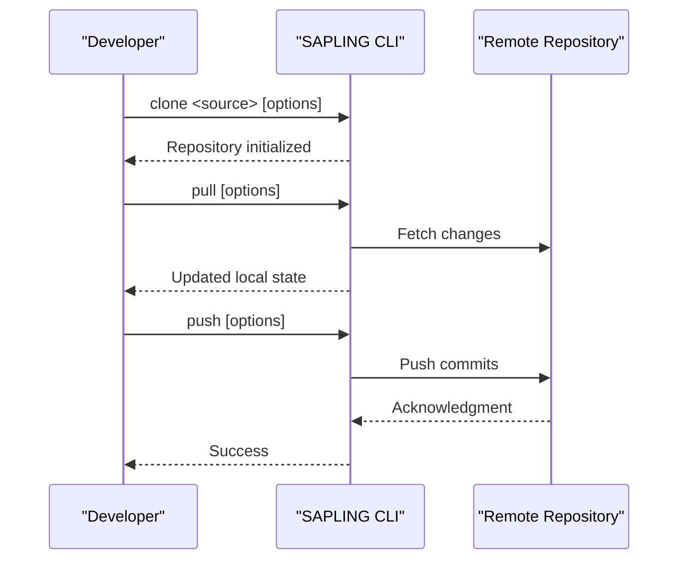
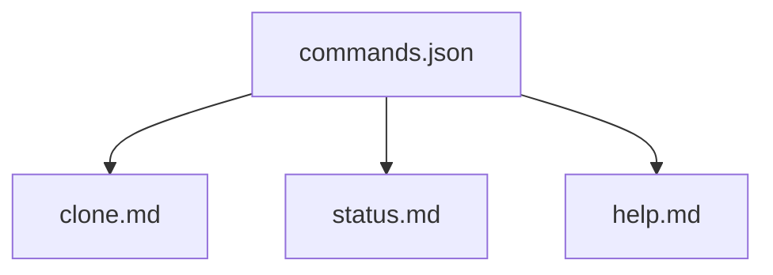

# CLI API

<cite>
**Referenced Files in This Document**
- [commands.json](file://website/docs/commands/commands.json)
- [clone.md](file://website/docs/commands/clone.md)
- [status.md](file://website/docs/commands/status.md)
- [help.md](file://website/docs/commands/help.md)
</cite>

## Table of Contents
1. [Introduction](#introduction)
2. [Project Structure](#project-structure)
3. [Core Components](#core-components)
4. [Architecture Overview](#architecture-overview)
5. [Detailed Component Analysis](#detailed-component-analysis)
6. [Dependency Analysis](#dependency-analysis)
7. [Performance Considerations](#performance-considerations)
8. [Troubleshooting Guide](#troubleshooting-guide)
9. [Conclusion](#conclusion)
10. [Appendices](#appendices)

## Introduction
This document provides comprehensive CLI API documentation for SAPLING SCM commands. It covers repository operations (clone, pull, push, fetch), working directory management (status, add, commit, diff), branch and history operations (branch, log, show, hist), merge and rebase commands (merge, rebase, resolve), and utility commands (help, version, config). For each command, we describe syntax, parameters, flags, examples, exit codes, error handling, environment variables, configuration options, command aliases, and interactive behaviors. Practical usage examples demonstrate common workflows and advanced scenarios.

## Project Structure
The CLI documentation is maintained in the website repository under the docs/commands directory. The authoritative command metadata is defined in a structured JSON file, with individual Markdown files providing detailed descriptions and examples for selected commands.

**Diagram sources**
- [commands.json](file://website/docs/commands/commands.json)
- [clone.md](file://website/docs/commands/clone.md)
- [status.md](file://website/docs/commands/status.md)
- [help.md](file://website/docs/commands/help.md)

**Section sources**
- [commands.json](file://website/docs/commands/commands.json)
- [clone.md](file://website/docs/commands/clone.md)
- [status.md](file://website/docs/commands/status.md)
- [help.md](file://website/docs/commands/help.md)

## Core Components
This section summarizes the command categories and their responsibilities based on the repository’s command metadata.

- Repository operations
  - clone: Create a copy of an existing repository
  - pull: Pull commits from a remote repository
  - push: Push commits to a remote repository
  - fetch: Retrieve changes from a remote repository (see notes)

- Working directory management
  - status: List files with pending changes
  - add: Start tracking specified files
  - commit: Save pending changes in a new commit
  - diff: Show differences between commits

- Branch and history operations
  - branch: Manage bookmarks (Sapling’s equivalent of Git branches)
  - log: Show commit history
  - show: Show commit details
  - hist: Interactive history editing (histedit)

- Merge and rebase commands
  - merge: Combine changes from different histories
  - rebase: Move commits to a different base
  - resolve: Resolve conflicts during merge/rebase

- Utility commands
  - help: Show help for topics or commands
  - version: Show product version
  - config: Show configuration settings

Notes:
- fetch is not explicitly listed in the provided commands.json; however, pull retrieves and updates local state, and push updates remote state. If a dedicated fetch command exists elsewhere, consult the authoritative command metadata.

**Section sources**
- [commands.json](file://website/docs/commands/commands.json)

## Architecture Overview
The CLI architecture is driven by a centralized command registry and a set of Markdown-based documentation. Consumers include the website documentation, CLI tools, and automation scripts.

**Diagram sources**
- [commands.json](file://website/docs/commands/commands.json)
- [clone.md](file://website/docs/commands/clone.md)
- [status.md](file://website/docs/commands/status.md)
- [help.md](file://website/docs/commands/help.md)

## Detailed Component Analysis

### Repository Operations

#### clone
- Purpose: Create a copy of an existing repository in a new directory.
- Aliases: clone
- Key flags and parameters:
  - --noupdate (-U): Clone an empty working directory
  - --updaterev (-u): Revision or branch to check out
  - --enable-profile: Enable a sparse profile
  - --git: Force Git protocol interpretation
  - --eden: Use EdenFS (experimental)
  - --eden-backing-repo: Location of backing repo
  - --aws: Configure repo to run against AWS (experimental)
- Behavior:
  - If no destination directory is specified, defaults to the basename of the source.
  - Adds the source location to the new repository’s config as the default for future pulls.
  - Supports Git URL schemes and SCP-like URLs.
  - Experimental: URL fragments can be persisted as the repo’s main bookmark.
- Exit codes:
  - Returns 0 on success.
- Examples:
  - Clone a remote repository to a new directory named some_repo.
  - Clone with a specific revision checked out.
  - Clone with a sparse profile enabled.

**Section sources**
- [commands.json](file://website/docs/commands/commands.json)
- [clone.md](file://website/docs/commands/clone.md)

#### pull
- Purpose: Pull commits from a remote repository to a local one.
- Aliases: pull
- Key flags and parameters:
  - --update (-u): Update to new branch head if new descendants were pulled
  - --force (-f): Run even when remote repository is unrelated
  - --rev (-r): Remote commit to pull
  - --bookmark (-B): Bookmark to pull
  - --rebase: Rebase current commit or current stack onto master
  - --tool (-t): Specify merge tool for rebase
  - --dest (-d): Destination for rebase or update
- Behavior:
  - Modifies the commit graph without mutating local commits or the working copy.
  - If SOURCE is omitted, uses the default path.
  - Can pull a specific bookmark or default relevant remote names.
- Exit codes:
  - Returns 0 on success; 1 on failure, including if --update was specified but the update had unresolved conflicts.
- Examples:
  - Pull relevant remote bookmarks from default source.
  - Pull a specific bookmark from a named source.

**Section sources**
- [commands.json](file://website/docs/commands/commands.json)

#### push
- Purpose: Push commits from the local repository to a specified destination.
- Aliases: push
- Key flags and parameters:
  - --force (-f): Force push
  - --rev (-r): Commit(s) to push (including ancestors)
  - --bookmark (-B): Bookmark to push (advanced)
  - --to: Server revision to rebase onto
  - --create: Create a new remote bookmark
  - --delete: Delete remote bookmark
  - --pushvars: Variables sent to server (advanced)
  - --non-forward-move: Allow moving a remote bookmark to an arbitrary place (advanced)
- Behavior:
  - Uses the default path if destination is omitted.
  - Supports creating new remote bookmarks and deleting remote bookmarks.
  - Push vars are typically used to override commit hook behavior or enable debugging (not supported for Git repos).
- Exit codes:
  - Returns 0 on success.
- Examples:
  - Push current commit to “main” on the default destination.
  - Force push a specific commit to a remote branch.

**Section sources**
- [commands.json](file://website/docs/commands/commands.json)

#### fetch
- Status: Not explicitly listed in the provided commands.json.
- Behavior (general):
  - Retrieve changes from a remote repository without merging into the working copy.
  - Typically used to update remote-tracking branches before pull.
- Notes:
  - If a dedicated fetch command exists in the CLI, consult the authoritative command metadata.

**Section sources**
- [commands.json](file://website/docs/commands/commands.json)

### Working Directory Management

#### status
- Purpose: List files with pending changes.
- Aliases: status, st
- Key flags and parameters:
  - --all (-A): Show status of all files
  - --modified (-m), --added (-a), --removed (-r), --deleted (-d), --clean (-c), --unknown (-u), --ignored (-i)
  - --no-status (-n): Hide status prefix
  - --copies (-C): Show source of copied files
  - --print0 (-0): End filenames with NUL, for use with xargs
  - --rev: Show difference from revision
  - --change: List changed files of a revision
  - --root-relative: Show status relative to root
  - --include (-I), --exclude (-X): Include/exclude files matching patterns
  - --terse (-t): Abbreviate output by directory when all files share the same status
  - --verbose (-v): Show information when repository is in an unfinished state
- Behavior:
  - Default shows modified, added, removed, deleted, and unknown files.
  - Supports patterns and filesets for filtering.
  - Terse mode abbreviates output for specified statuses.
- Exit codes:
  - Returns 0 on success.
- Examples:
  - Show changes relative to a specific commit.
  - Show changes relative to the current directory.
  - Show all changes including copies in a commit.
  - Get a NUL-separated list of added files for xargs.
  - Show verbose status with abbreviated output.

**Section sources**
- [commands.json](file://website/docs/commands/commands.json)
- [status.md](file://website/docs/commands/status.md)

#### add
- Purpose: Start tracking specified files.
- Aliases: add
- Key flags and parameters:
  - --include (-I), --exclude (-X): Include/exclude files matching patterns
  - --dry-run (-n): Do not perform actions, just print output
  - --sparse (-s): Include directories of added files in sparse config
- Behavior:
  - If no names are given, add all files except those matching .gitignore.
  - Undo with forget before committing; undo with rm after committing.
- Exit codes:
  - Returns 0 if all files are successfully added.
- Examples:
  - Add all files to the repository (except ignored).
  - Add specific files.

**Section sources**
- [commands.json](file://website/docs/commands/commands.json)

#### commit
- Purpose: Save pending changes or specified files in a new commit.
- Aliases: commit, ci
- Key flags and parameters:
  - --addremove (-A): Mark new/missing files as added/removed before committing
  - --edit (-e): Invoke editor on commit messages
  - --interactive (-i): Use interactive mode
  - --reuse-message (-M): Reuse commit message from REV
  - --include (-I), --exclude (-X): Include/exclude files matching patterns
  - --message (-m), --logfile (-l): Use text or read commit message from file
  - --date (-d), --user (-u): Record specified date or user as committer
  - --message-field: Rewrite fields of commit message (experimental)
  - --template (-T): Display with template
- Behavior:
  - By default, commits all pending changes.
  - Use patterns or filesets to limit which changes are committed.
  - If committing a merge result, commit all pending changes without specifying files.
- Exit codes:
  - Returns 0 on success; 1 if nothing changed.
- Examples:
  - Commit all files ending in .py.
  - Commit all non-binary files.

**Section sources**
- [commands.json](file://website/docs/commands/commands.json)

#### diff
- Purpose: Show differences between commits.
- Aliases: diff, d
- Key flags and parameters:
  - --rev (-r): Revision(s)
  - --change (-c): Change made by revision
  - --text (-a): Treat all files as text
  - --git (-g): Use git extended diff format
  - --binary: Generate binary diffs in git mode
  - --nodates, --noprefix: Omit dates or prefixes from filenames
  - --show-function (-p): Show which function each change is in
  - --reverse: Produce a diff that undoes the changes
  - --ignore-all-space (-w), --ignore-space-change (-b), --ignore-blank-lines (-B), --ignore-space-at-eol (-Z)
  - --unified (-U): Number of lines of context to show
  - --stat: Output diffstat-style summary
  - --root: Produce diffs relative to subdirectory
  - --only-files-in-revs: Only show changes for files modified in the requested revisions
  - --include (-I), --exclude (-X): Include/exclude files matching patterns
  - --from-path, --to-path: Re-map paths for directory diffing
  - --per-file-stat-json: Show diff stat per file in JSON
  - --sparse (-s): Only show changes in files in the sparse config
  - --since-last-submit, --since-last-submit-2o: Show changes since last Phabricator submit
- Behavior:
  - Compares two commits; if only one is specified, compares to the working copy; if none, shows pending changes.
  - Skips binary files by default; use --text to include binary files.
  - Supports git extended diff format with --git.
- Exit codes:
  - Returns 0 on success.
- Examples:
  - Compare a file in the current working directory to its parent.
  - Compare two historical versions of a directory with rename info.
  - Get change stats relative to the last change on a specific date.
  - Diff all newly-added files that contain a keyword.
  - Compare a revision and its parents.

**Section sources**
- [commands.json](file://website/docs/commands/commands.json)

### Branch and History Operations

#### branch
- Purpose: Create a new bookmark or list existing bookmarks.
- Aliases: bookmark, bo, book, bookmarks
- Key flags and parameters:
  - --force (-f): Force
  - --rev (-r): Revision for bookmark action
  - --delete (-d): Delete a given bookmark
  - --strip (-D): Like --delete, but also strip changesets
  - --rename (-m): Rename a given bookmark
  - --inactive (-i): Mark a bookmark inactive
  - --template (-T): Display with template (experimental)
  - --track (-t): Track this bookmark or remote name
  - --untrack (-u): Remove tracking for this bookmark
  - --list-remote: List remote bookmarks; supports wildcard patterns
  - --all (-a): Show both remote and local bookmarks
  - --remote: Fetch remote Git refs
  - --remote-path: Remote path from which to fetch bookmarks
  - --list-subscriptions: Show only remote bookmarks that are available locally
- Behavior:
  - Bookmarks are labels on changesets; moving/deleting bookmarks does not affect associated changesets.
  - Active bookmark advances to new commit on commit; plain goto updates active bookmark if possible.
  - Supports Git repos where bookmarks correspond to branches.
- Exit codes:
  - Returns 0 on success.
- Examples:
  - Create an active bookmark for a new line of development.
  - Create an inactive bookmark as a place marker.
  - Rename a bookmark.
  - Move the active bookmark from another branch.
  - List remote branches and tags.

**Section sources**
- [commands.json](file://website/docs/commands/commands.json)

#### log
- Purpose: Show commit history.
- Aliases: log
- Key flags and parameters:
  - --follow (-f): Follow changeset history or file history across copies and renames
  - --date (-d): Show revisions matching date spec
  - --copies (-C): Show copied files
  - --keyword (-k): Case-insensitive search for text
  - --rev (-r): Show the specified revision or revset
  - --line-range (-L): Follow line range of specified file (experimental)
  - --removed: Include revisions where files were removed
  - --only-merges (-M): Show only merges (deprecated)
  - --user (-u): Revisions committed by user
  - --branch: Show changesets within the given named branch (deprecated)
  - --prune (-P): Do not display revision or any of its ancestors
  - --patch (-p): Show patch
  - --git (-g): Use git extended diff format
  - --limit (-l): Limit number of changes displayed
  - --no-merges: Do not show merges
  - --stat: Output diffstat-style summary
  - --graph (-G): Show the revision DAG
  - --style: Display using template map file (deprecated)
  - --template (-T): Display with template
  - --include (-I), --exclude (-X): Include/exclude files matching patterns
  - --all: Show all changesets in the repo
  - --sparse: Limit to changesets affecting the sparse checkout
  - --remote: Show remote names even if hidden
- Behavior:
  - Default shows current commit and all ancestors.
  - File history is shown without following rename/copy history unless --follow is used.
  - Supports ASCII art graph with --graph.
- Exit codes:
  - Returns 0 on success.
- Examples:
  - Commits with full descriptions and file lists.
  - Commits ancestral to the working directory.
  - Last 10 commits on the current branch.
  - All commits that touch a directory with diffs, excluding merges.
  - All revision numbers that match a keyword.
  - Check if a given commit is included in a bookmarked release.
  - Find all commits by a user in a date range.
  - Follow line ranges for specific files with patches.

**Section sources**
- [commands.json](file://website/docs/commands/commands.json)

#### show
- Purpose: Show commit details.
- Aliases: show
- Key flags and parameters:
  - --nodates: Omit dates from diff headers (keeps dates in commit header)
  - --noprefix: Omit a/ and b/ prefixes from filenames
  - --stat: Output diffstat-style summary
  - --git (-g): Use git extended diff format
  - --unified (-U): Number of lines of diff context to show
  - --ignore-all-space (-w), --ignore-space-change (-b), --ignore-blank-lines (-B), --ignore-space-at-eol (-Z)
  - --style: Display using template map file (deprecated)
  - --template (-T): Display with template
  - --include (-I), --exclude (-X): Include/exclude files matching patterns
- Behavior:
  - Similar to log -vp -r REV [OPTION]... [FILE]..., or if called without a REV, log -vp -r . [OPTION]...
- Exit codes:
  - Returns 0 on success.

**Section sources**
- [commands.json](file://website/docs/commands/commands.json)

#### histedit
- Purpose: Interactively reorder, combine, or delete commits.
- Aliases: histedit
- Key flags and parameters:
  - --commands: Read history edits from the specified file
  - --continue (-c): Continue an edit already in progress
  - --edit-plan: Edit remaining actions list
  - --keep (-k): Don’t strip old nodes after edit is complete
  - --abort: Abort an edit in progress
  - --rev (-r): First revision to be edited
  - --template (-T): Display with template (experimental)
  - --retry (-x): Retry exec command that failed and try to continue
  - --show-plan: Show remaining actions list
- Behavior:
  - Edits a linear series of commits up to and including the working copy.
  - Actions include pick, drop, mess, fold, roll, edit, base.
  - Uses histedit.defaultrev config option to select base commit when ANCESTOR is not specified.
- Exit codes:
  - Returns 0 on success; 1 if user intervention is required for edit command or to resolve merge conflicts.

**Section sources**
- [commands.json](file://website/docs/commands/commands.json)

### Merge and Rebase Commands

#### merge
- Purpose: Combine changes from different histories.
- Aliases: merge
- Key flags and parameters:
  - --continue: Continue an interrupted merge
  - --abort: Abort an interrupted merge
  - --tool (-t): Specify merge tool
  - --dry-run (-n): Do not perform actions, just print output
  - --edit (-e): Open editor to specify custom commit message
  - --message (-m), --logfile (-l): Use text or read commit message from file
  - --date (-d), --user (-u): Record specified date or user as committer
  - --include (-I), --exclude (-X): Include/exclude files matching patterns
- Behavior:
  - Resolves conflicts and exits unfinished merge state upon successful commit.
  - Use --abort to discard pending changes and return to clean state.
- Exit codes:
  - Returns 0 on success; 1 if there are unresolved files.

**Section sources**
- [commands.json](file://website/docs/commands/commands.json)

#### rebase
- Purpose: Move commits from one location to another.
- Aliases: rebase
- Key flags and parameters:
  - --source (-s): Rebase the specified commit and descendants
  - --base (-b): Rebase everything from branching point of specified commit
  - --rev (-r): Rebase these revisions
  - --dest (-d): Rebase onto the specified revision
  - --collapse: Collapse the rebased commits
  - --message (-m): Use text as collapse commit message
  - --edit (-e): Invoke editor on commit messages
  - --logfile (-l): Read collapse commit message from file
  - --keep (-k): Keep original commits
  - --tool (-t): Specify merge tool
  - --continue (-c): Continue an interrupted rebase
  - --abort (-a): Abort an interrupted rebase
  - --quit: Quit an interrupted rebase and keep already rebased commits
  - --noconflict: Cancel the rebase if there are conflicts (experimental)
  - --template (-T): Display with template (experimental)
  - --restack: Rebase all changesets in the current stack onto the latest version of their respective parents
  - --interactive (-i): Interactive rebase
- Behavior:
  - Creates new commits at the destination and hides originals.
  - Moves bookmarks onto new versions of commits even if --keep is specified.
  - Public commits cannot be rebased unless --keep is used.
  - Supports collapsing and interactive rebase modes.
- Exit codes:
  - Returns 0 on success (also when nothing to rebase); 1 if there are unresolved conflicts.

**Section sources**
- [commands.json](file://website/docs/commands/commands.json)

#### resolve
- Purpose: Resolve conflicts during merge/rebase.
- Aliases: resolve
- Key flags and parameters:
  - --continue: Continue an interrupted rebase/merge after conflicts are resolved
  - --abort: Abort an interrupted rebase/merge
  - --tool (-t): Specify merge tool
- Behavior:
  - Resolves conflicts and continues the interrupted operation.
- Exit codes:
  - Returns 0 on success; 1 if there are unresolved conflicts.

**Section sources**
- [commands.json](file://website/docs/commands/commands.json)

### Utility Commands

#### help
- Purpose: Show help for a given topic or a help overview.
- Aliases: help
- Key flags and parameters:
  - --extension (-e): Show help for extensions
  - --command (-c): Show help for commands
  - --keyword (-k): Show topics matching keyword
  - --system (-s): Show help for specific platform(s)
- Behavior:
  - With no arguments, prints a list of commands with short help messages.
  - Given a topic, extension, or command name, prints help for that topic.
- Exit codes:
  - Returns 0 if successful.

**Section sources**
- [commands.json](file://website/docs/commands/commands.json)
- [help.md](file://website/docs/commands/help.md)

#### version
- Purpose: Show product version.
- Aliases: version
- Notes:
  - Version information is typically available via the help system or a dedicated version command.
  - Consult the CLI tool’s built-in help for exact usage.

**Section sources**
- [commands.json](file://website/docs/commands/commands.json)

#### config
- Purpose: Show configuration settings.
- Aliases: config, conf
- Key flags and parameters:
  - --edit (-e): Edit config, implying --user if no other flags set (deprecated)
  - --user (-u): Edit user config, opening in editor if no args given
  - --local (-l): Edit repository config, opening in editor if no args given
  - --global (-g): Edit system config, opening in editor if no args given (deprecated)
  - --system (-s): Edit system config, opening in editor if no args given
  - --delete (-d): Delete specified config items
  - --template (-T): Display with template (experimental)
- Behavior:
  - With no arguments, prints names and values of all config items.
  - With one argument of the form section.name, prints just the value.
  - With multiple arguments, prints names and values of all items with matching section names.
  - With --delete, specified config items are deleted from the config file.
  - With --debug, prints source (filename and line number) for each config item.
- Exit codes:
  - Returns 0 on success; 1 if NAME does not exist.

**Section sources**
- [commands.json](file://website/docs/commands/commands.json)

### Conceptual Overview
The following sequence diagram illustrates a typical repository operation workflow involving clone, pull, and push.

[No sources needed since this diagram shows conceptual workflow, not actual code structure]

## Dependency Analysis
The CLI relies on a centralized command registry and documentation files. The following diagram shows the relationships among the primary sources.

**Diagram sources**
- [commands.json](file://website/docs/commands/commands.json)
- [clone.md](file://website/docs/commands/clone.md)
- [status.md](file://website/docs/commands/status.md)
- [help.md](file://website/docs/commands/help.md)

**Section sources**
- [commands.json](file://website/docs/commands/commands.json)
- [clone.md](file://website/docs/commands/clone.md)
- [status.md](file://website/docs/commands/status.md)
- [help.md](file://website/docs/commands/help.md)

## Performance Considerations
- Use --dry-run to preview changes before performing costly operations (e.g., add, commit, rebase).
- Prefer targeted operations with include/exclude patterns to limit scanning scope.
- Use sparse profiles to reduce working copy size and improve responsiveness.
- Avoid unnecessary binary diffs; use --text to include binary files only when needed.

[No sources needed since this section provides general guidance]

## Troubleshooting Guide
- Unresolved conflicts:
  - During merge/rebase, unresolved conflicts require manual resolution followed by --continue or --abort.
  - Use --abort to discard changes and return to clean state.
- Dirty working copy:
  - Some commands require a clean working directory; use --check or --clean to enforce or discard changes.
- Exit codes:
  - Many commands return 0 on success and 1 on failure or unresolved files; consult specific command sections for exact semantics.

**Section sources**
- [commands.json](file://website/docs/commands/commands.json)

## Conclusion
This document consolidates SAPLING SCM CLI command APIs from authoritative sources, providing syntax, parameters, flags, examples, exit codes, and operational guidance. Use the provided references to navigate to detailed command documentation and ensure accurate usage in workflows ranging from basic repository operations to advanced history manipulation.

## Appendices

### Environment Variables
- No explicit environment variables are documented in the provided sources. Consult the CLI tool’s help system for environment-specific behavior.

**Section sources**
- [commands.json](file://website/docs/commands/commands.json)

### Configuration Options
- The config command supports editing user, repository, and system configuration files. Use --delete to remove entries and --debug to inspect sources.
- Specific commands may honor configuration options (e.g., rebase single transaction settings, in-memory rebase, and template customization).

**Section sources**
- [commands.json](file://website/docs/commands/commands.json)

### Interactive Mode Behaviors
- Several commands support interactive modes:
  - commit --interactive
  - histedit --continue, --edit-plan, --show-plan
  - rebase --interactive
  - merge --continue
  - resolve --continue
- Interactive modes often open editors or prompts to guide users through complex operations.

**Section sources**
- [commands.json](file://website/docs/commands/commands.json)