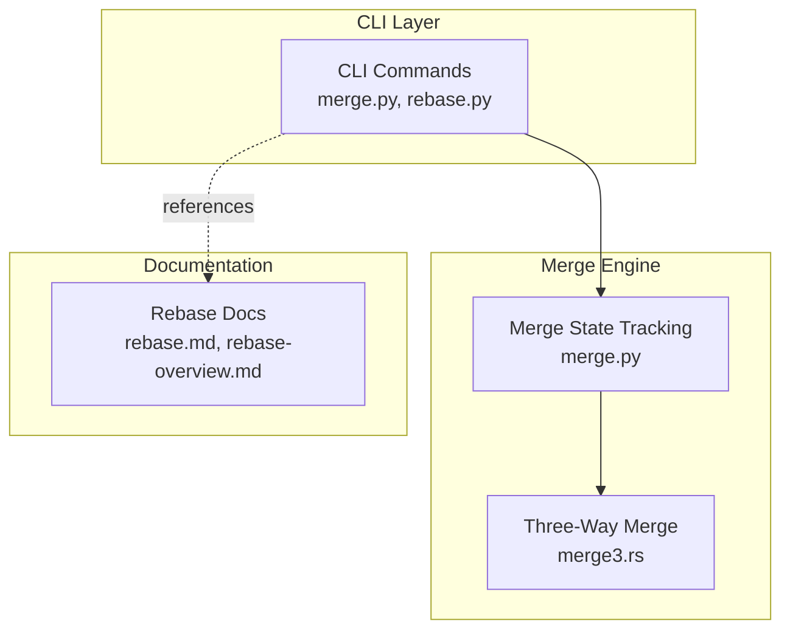
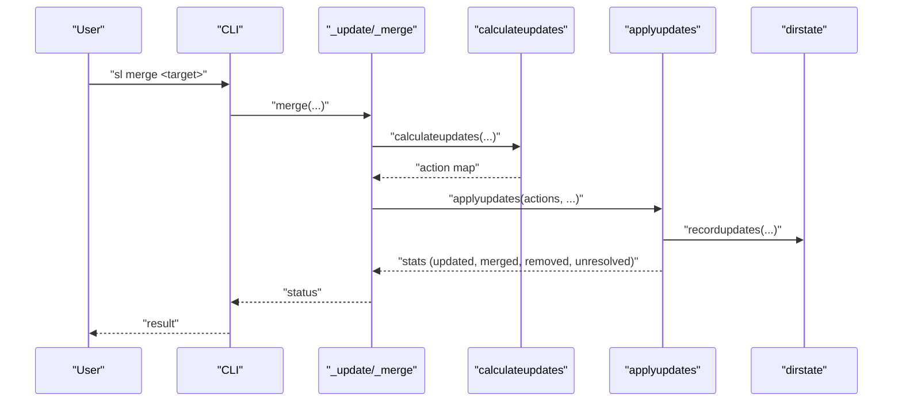
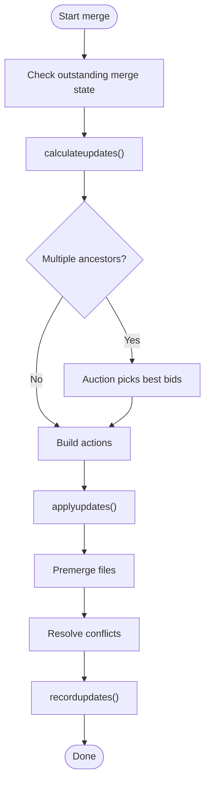
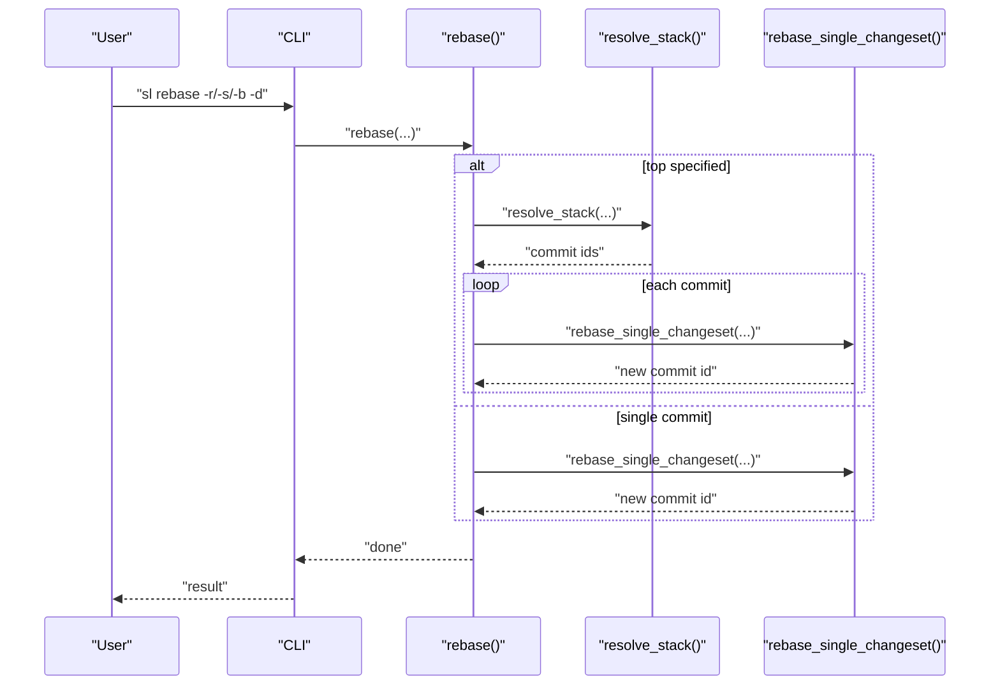
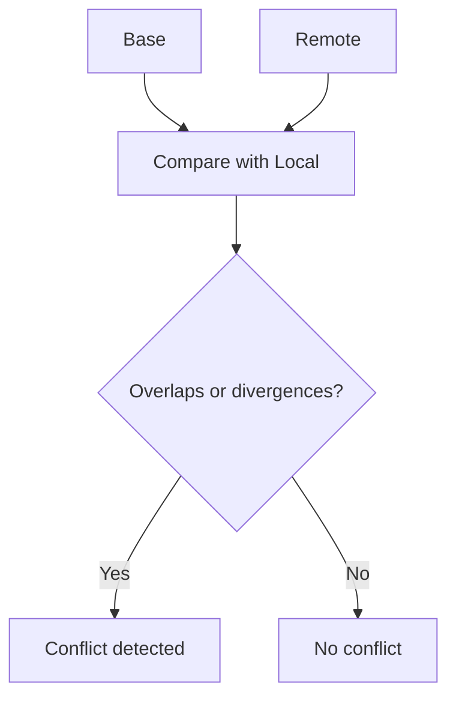
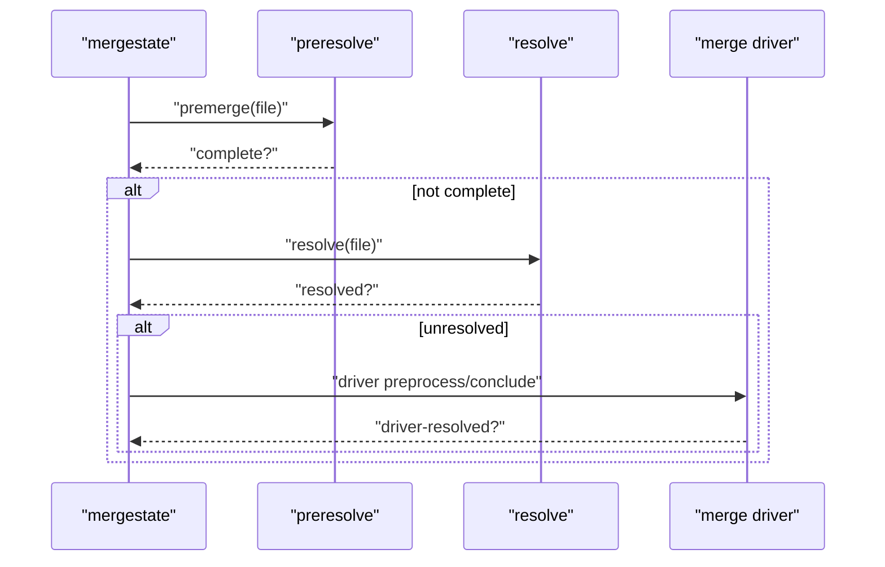
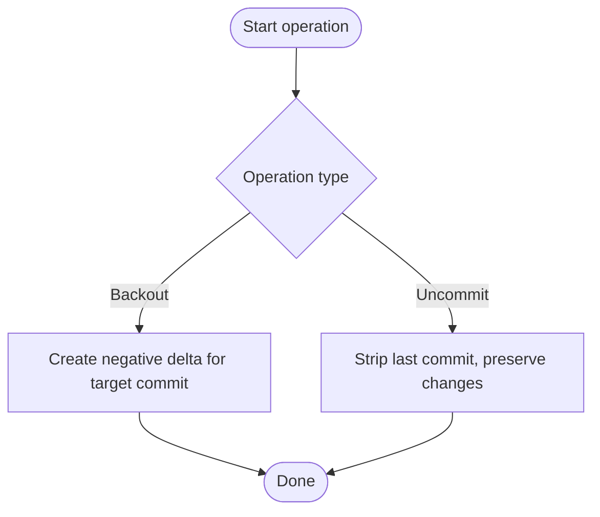
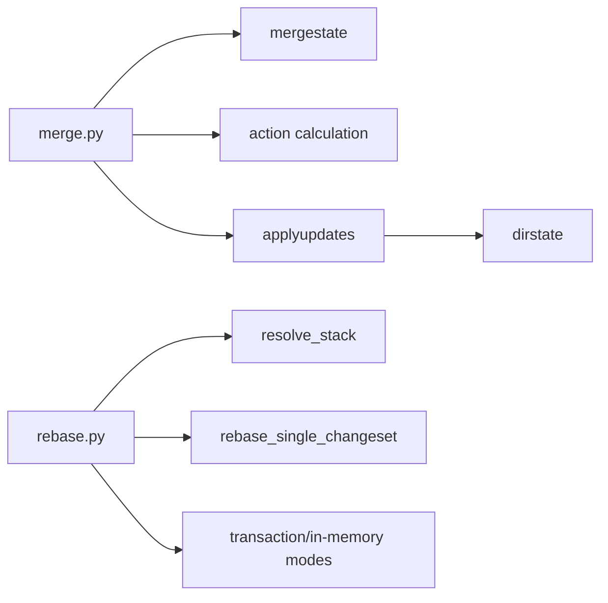

# Merge and Rebase Commands

<cite>
**Referenced Files in This Document**
- [merge.py](file://eden/scm/sapling/merge.py)
- [rebase.py](file://eden/scm/sapling/ext/rebase.py)
- [merge3.rs](file://eden/mononoke/common/three_way_merge/src/merge3.rs)
- [rebase.md](file://website/docs/commands/rebase.md)
- [rebase-overview.md](file://website/docs/overview/rebase.md)
</cite>

## Table of Contents
1. [Introduction](#introduction)
2. [Project Structure](#project-structure)
3. [Core Components](#core-components)
4. [Architecture Overview](#architecture-overview)
5. [Detailed Component Analysis](#detailed-component-analysis)
6. [Dependency Analysis](#dependency-analysis)
7. [Performance Considerations](#performance-considerations)
8. [Troubleshooting Guide](#troubleshooting-guide)
9. [Conclusion](#conclusion)

## Introduction
This document explains SAPLING SCM merge and rebase operations with a focus on practical workflows, syntax, strategies, and safety checks. It covers:
- Merge: combining changes from different branches using three-way merge logic
- Rebase: history rewriting by moving commits onto a new base
- Resolve: conflict resolution after merge or rebase
- Backout: reverting a committed change
- Uncommit: undoing a commit while preserving changes in the working directory

The content is grounded in the repository’s implementation and official documentation, ensuring accuracy and actionable guidance for both new and experienced users.

## Project Structure
The merge and rebase functionality spans Python-based command logic and Rust-based merge engine components:
- Python merge engine and CLI integration: [merge.py](file://eden/scm/sapling/merge.py)
- Python rebase extension: [rebase.py](file://eden/scm/sapling/ext/rebase.py)
- Three-way merge algorithm (Rust): [merge3.rs](file://eden/mononoke/common/three_way_merge/src/merge3.rs)
- Official rebase documentation: [rebase.md](file://website/docs/commands/rebase.md), [rebase-overview.md](file://website/docs/overview/rebase.md)

**Diagram sources**
- [merge.py:2307-2632](file://eden/scm/sapling/merge.py#L2307-L2632)
- [rebase.py:1148-1248](file://eden/scm/sapling/ext/rebase.py#L1148-L1248)
- [merge3.rs:450-565](file://eden/mononoke/common/three_way_merge/src/merge3.rs#L450-L565)
- [rebase.md:1-142](file://website/docs/commands/rebase.md#L1-L142)
- [rebase-overview.md:57-125](file://website/docs/overview/rebase.md#L57-L125)

**Section sources**
- [merge.py:1-200](file://eden/scm/sapling/merge.py#L1-L200)
- [rebase.py:1148-1248](file://eden/scm/sapling/ext/rebase.py#L1148-L1248)
- [merge3.rs:450-565](file://eden/mononoke/common/three_way_merge/src/merge3.rs#L450-L565)
- [rebase.md:1-142](file://website/docs/commands/rebase.md#L1-L142)
- [rebase-overview.md:57-125](file://website/docs/overview/rebase.md#L57-L125)

## Core Components
- Merge engine: orchestrates manifest diff, action calculation, file updates, and merge state management
- Rebase extension: moves commits onto a new base, with options for selection and transaction behavior
- Three-way merge algorithm: resolves textual conflicts between base, local, and remote versions
- Conflict resolution pipeline: supports manual and automated resolution, with merge drivers and path conflict handling

Key responsibilities:
- Merge: compute actions, apply updates, record dirstate, and manage unresolved conflicts
- Rebase: select commits, rebase onto destination, and handle transaction and in-memory modes
- Resolve: mark conflicts as resolved and finalize merge state
- Backout: revert a commit by creating a negative delta
- Uncommit: strip the last commit while preserving working copy changes

**Section sources**
- [merge.py:93-199](file://eden/scm/sapling/merge.py#L93-L199)
- [merge.py:1527-1998](file://eden/scm/sapling/merge.py#L1527-L1998)
- [merge.py:2307-2632](file://eden/scm/sapling/merge.py#L2307-L2632)
- [rebase.py:1148-1248](file://eden/scm/sapling/ext/rebase.py#L1148-L1248)
- [merge3.rs:450-565](file://eden/mononoke/common/three_way_merge/src/merge3.rs#L450-L565)

## Architecture Overview
The merge and rebase subsystems integrate through the working context and dirstate. Merging computes a set of actions per file, applies them to the working directory, and records outcomes in dirstate. Rebase selects commits and replays them onto a new base, optionally using a single transaction for performance.

**Diagram sources**
- [merge.py:2337-2632](file://eden/scm/sapling/merge.py#L2337-L2632)
- [merge.py:1286-1415](file://eden/scm/sapling/merge.py#L1286-L1415)
- [merge.py:1527-1998](file://eden/scm/sapling/merge.py#L1527-L1998)

## Detailed Component Analysis

### Merge Engine
The merge engine performs:
- Manifest diff and action generation
- Unknown file/path conflict checks
- File updates with batching and parallelism
- Merge state initialization and persistence
- Optional merge driver integration

**Diagram sources**
- [merge.py:1286-1415](file://eden/scm/sapling/merge.py#L1286-L1415)
- [merge.py:1527-1998](file://eden/scm/sapling/merge.py#L1527-L1998)
- [merge.py:2337-2632](file://eden/scm/sapling/merge.py#L2337-L2632)

Key behaviors:
- Unknown file handling and warnings
- Path conflict detection and renaming
- In-memory optimizations and cross-repo considerations
- Merge driver lifecycle (preprocess/conclude) and driver-resolved files

**Section sources**
- [merge.py:654-768](file://eden/scm/sapling/merge.py#L654-L768)
- [merge.py:827-937](file://eden/scm/sapling/merge.py#L827-L937)
- [merge.py:1527-1998](file://eden/scm/sapling/merge.py#L1527-L1998)
- [merge.py:2337-2632](file://eden/scm/sapling/merge.py#L2337-L2632)

### Rebase Extension
The rebase extension supports:
- Selecting commits via revision, source subtree, or base
- Moving commits onto a destination
- Single-transaction mode for performance
- In-memory rebase mode for speed and dirty working copy scenarios
- Special names for dynamic destinations

**Diagram sources**
- [rebase.py:45-62](file://eden/scm/sapling/ext/rebase.py#L45-L62)
- [rebase.py:65-87](file://eden/scm/sapling/ext/rebase.py#L65-L87)

Options and behaviors:
- Selection modes: explicit revisions, source subtree, or base
- Destination substitution with special names
- Transaction modes: single-transaction vs per-commit
- In-memory mode configuration and warnings

**Section sources**
- [rebase.py:1148-1248](file://eden/scm/sapling/ext/rebase.py#L1148-L1248)
- [rebase.md:1-142](file://website/docs/commands/rebase.md#L1-L142)
- [rebase-overview.md:57-125](file://website/docs/overview/rebase.md#L57-L125)

### Three-Way Merge Algorithm
The three-way merge compares base, local, and remote content to detect conflicts. It reports conflicts for overlapping edits, deletions vs modifications, and inconsistent additions.

**Diagram sources**
- [merge3.rs:450-565](file://eden/mononoke/common/three_way_merge/src/merge3.rs#L450-L565)

**Section sources**
- [merge3.rs:450-565](file://eden/mononoke/common/three_way_merge/src/merge3.rs#L450-L565)

### Conflict Resolution Pipeline
The merge state tracks unresolved conflicts and supports:
- Automatic premerge to partially resolve trivial conflicts
- Manual resolution with optional merge tools
- Path conflict resolution via renaming
- Merge driver integration for scripted resolution

**Diagram sources**
- [merge.py:377-505](file://eden/scm/sapling/merge.py#L377-L505)
- [merge.py:1891-1956](file://eden/scm/sapling/merge.py#L1891-L1956)

**Section sources**
- [merge.py:69-199](file://eden/scm/sapling/merge.py#L69-L199)
- [merge.py:1891-1956](file://eden/scm/sapling/merge.py#L1891-L1956)

### Backout and Uncommit
Backout reverts a committed change by generating a negative delta. Uncommit strips the last commit while preserving working copy changes. Both operations are designed to be safe and reversible.

[No sources needed since this diagram shows conceptual workflow, not actual code structure]

## Dependency Analysis
- Merge depends on:
  - Manifest diff and action calculation
  - Working context and dirstate recording
  - Optional merge driver and cross-repo handling
- Rebase depends on:
  - Commit selection and stack resolution
  - Transaction and in-memory modes
  - Destination computation and bookmark movement

**Diagram sources**
- [merge.py:1286-1415](file://eden/scm/sapling/merge.py#L1286-L1415)
- [merge.py:1527-1998](file://eden/scm/sapling/merge.py#L1527-L1998)
- [rebase.py:45-62](file://eden/scm/sapling/ext/rebase.py#L45-L62)
- [rebase.py:65-87](file://eden/scm/sapling/ext/rebase.py#L65-L87)

**Section sources**
- [merge.py:1286-1415](file://eden/scm/sapling/merge.py#L1286-L1415)
- [merge.py:1527-1998](file://eden/scm/sapling/merge.py#L1527-L1998)
- [rebase.py:45-62](file://eden/scm/sapling/ext/rebase.py#L45-L62)
- [rebase.py:65-87](file://eden/scm/sapling/ext/rebase.py#L65-L87)

## Performance Considerations
- Sparse matching and diff optimization for large repositories
- Parallel removal and writing for batch operations
- Prefetching file content for merge actions
- Native checkout path for initial clone/update
- In-memory merge optimizations with caveats (merge drivers not supported)

[No sources needed since this section provides general guidance]

## Troubleshooting Guide
Common issues and resolutions:
- Outstanding merge state: complete or abort the current merge before starting a new one
- Unresolved conflicts: resolve or abandon conflicts before committing
- Uncommitted changes: commit, shelve, or discard changes before merging
- Unknown files differing from target revision: address differences or adjust merge.checkunknown behavior
- Large working directory without fsmonitor: enable fsmonitor to improve performance

**Section sources**
- [merge.py:2436-2458](file://eden/scm/sapling/merge.py#L2436-L2458)
- [merge.py:2635-2645](file://eden/scm/sapling/merge.py#L2635-L2645)
- [merge.py:2719-2746](file://eden/scm/sapling/merge.py#L2719-L2746)

## Conclusion
SAPLING SCM provides robust merge and rebase capabilities with strong safety checks, flexible selection mechanisms, and efficient handling of large repositories. The merge engine’s three-way merge logic, combined with explicit conflict resolution and merge driver support, ensures predictable outcomes. The rebase extension offers powerful history manipulation with configurable transaction and in-memory modes. Together, these features support reliable collaboration and development workflows.