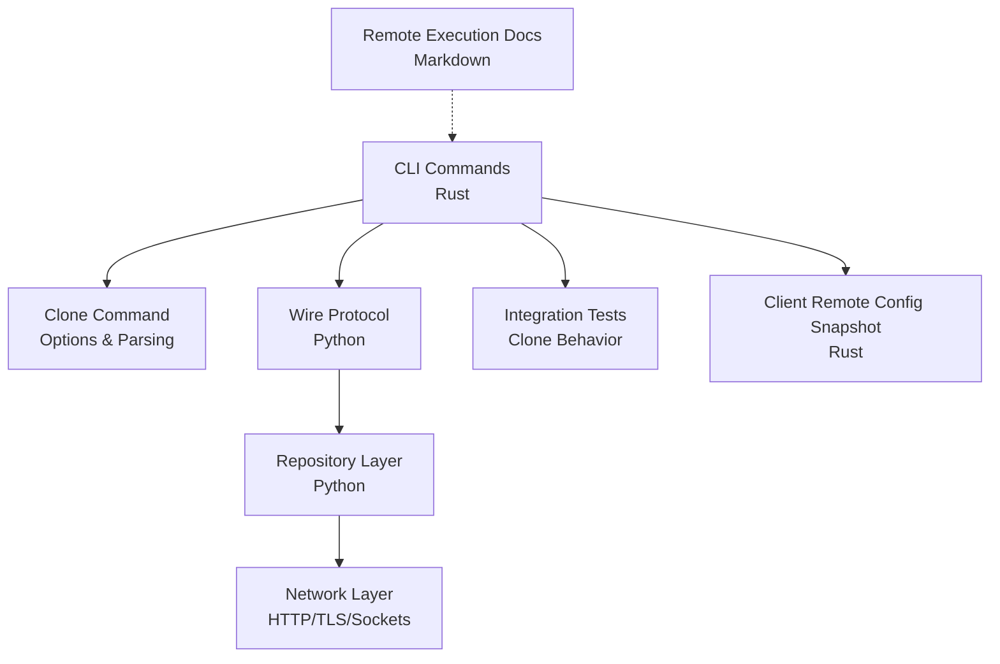
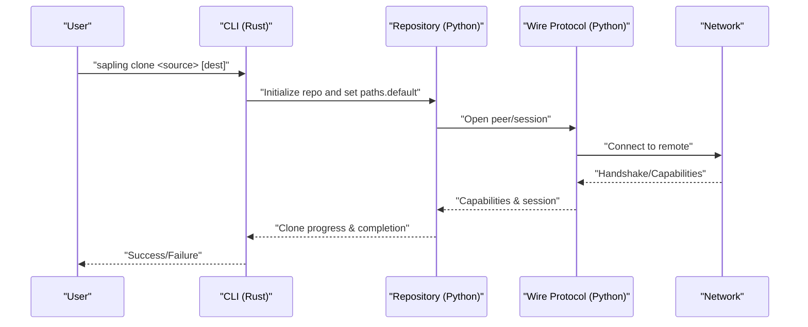
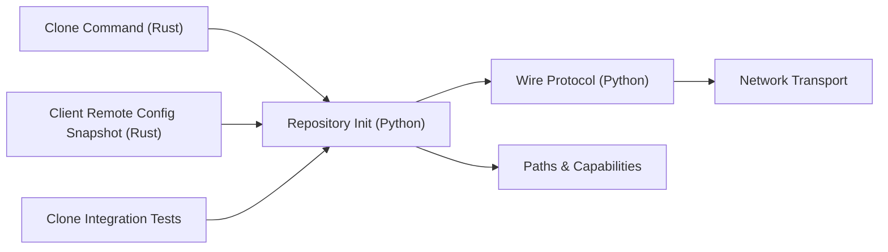

# Remote Operations

<cite>
**Referenced Files in This Document**
- [lib.rs](file://eden/scm/lib/commands/commands/cmdclone/src/lib.rs)
- [wireproto.py](file://eden/scm/sapling/wireproto.py)
- [hg.py](file://eden/scm/sapling/hg.py)
- [clone_test.py](file://eden/integration/clone_test.py)
- [remote_config_snapshot.rs](file://eden/fs/cli_rs/edenfs-client/src/use_case/remote_config_snapshot.rs)
- [remotelog.md](file://eden/docs/Engineering/Repo_Support_On_Remote_Execution/repo_support_on_remote_execution.md)
</cite>

## Table of Contents
1. [Introduction](#introduction)
2. [Project Structure](#project-structure)
3. [Core Components](#core-components)
4. [Architecture Overview](#architecture-overview)
5. [Detailed Component Analysis](#detailed-component-analysis)
6. [Dependency Analysis](#dependency-analysis)
7. [Performance Considerations](#performance-considerations)
8. [Troubleshooting Guide](#troubleshooting-guide)
9. [Conclusion](#conclusion)

## Introduction
This document describes SAPLING SCM remote repository operations with a focus on pull, push, fetch, clone, and remotelog. It explains command syntax, remote specification, authentication, network configuration, protocol options, and common workflows such as initial cloning, regular synchronization, shallow clones, and partial history fetching. It also documents error handling for network failures, authentication issues, and repository state conflicts.

## Project Structure
The remote operations are implemented across Rust and Python layers:
- Rust command definitions and option parsing for clone
- Python wire protocol and repository integration for clone and related behaviors
- Integration tests validating clone behavior
- Client-side remote configuration snapshot utilities
- Documentation for remote execution support

**Diagram sources**
- [lib.rs:48-89](file://eden/scm/lib/commands/commands/cmdclone/src/lib.rs#L48-L89)
- [wireproto.py:346-387](file://eden/scm/sapling/wireproto.py#L346-L387)
- [hg.py:419-462](file://eden/scm/sapling/hg.py#L419-L462)
- [clone_test.py](file://eden/integration/clone_test.py)
- [remote_config_snapshot.rs](file://eden/fs/cli_rs/edenfs-client/src/use_case/remote_config_snapshot.rs)
- [remotelog.md](file://eden/docs/Engineering/Repo_Support_On_Remote_Execution/repo_support_on_remote_execution.md)

**Section sources**
- [lib.rs:48-89](file://eden/scm/lib/commands/commands/cmdclone/src/lib.rs#L48-L89)
- [wireproto.py:346-387](file://eden/scm/sapling/wireproto.py#L346-L387)
- [hg.py:419-462](file://eden/scm/sapling/hg.py#L419-L462)
- [clone_test.py](file://eden/integration/clone_test.py)
- [remote_config_snapshot.rs](file://eden/fs/cli_rs/edenfs-client/src/use_case/remote_config_snapshot.rs)
- [remotelog.md](file://eden/docs/Engineering/Repo_Support_On_Remote_Execution/repo_support_on_remote_execution.md)

## Core Components
- Clone command options and remote URL handling
- Wire protocol for push/pull and remote key operations
- Repository initialization and update behavior
- Integration tests for clone behavior
- Client-side remote configuration snapshot
- Remote execution support documentation

**Section sources**
- [lib.rs:48-89](file://eden/scm/lib/commands/commands/cmdclone/src/lib.rs#L48-L89)
- [wireproto.py:346-387](file://eden/scm/sapling/wireproto.py#L346-L387)
- [hg.py:419-462](file://eden/scm/sapling/hg.py#L419-L462)
- [clone_test.py](file://eden/integration/clone_test.py)
- [remote_config_snapshot.rs](file://eden/fs/cli_rs/edenfs-client/src/use_case/remote_config_snapshot.rs)
- [remotelog.md](file://eden/docs/Engineering/Repo_Support_On_Remote_Execution/repo_support_on_remote_execution.md)

## Architecture Overview
The remote operation flow connects CLI commands to the repository layer via wire protocol, with network transport and optional client-side configuration snapshots.

**Diagram sources**
- [lib.rs:394-405](file://eden/scm/lib/commands/commands/cmdclone/src/lib.rs#L394-L405)
- [wireproto.py:346-387](file://eden/scm/sapling/wireproto.py#L346-L387)
- [hg.py:419-462](file://eden/scm/sapling/hg.py#L419-L462)

## Detailed Component Analysis

### Clone Command
Syntax and options:
- Syntax: sapling clone [options] source [destination]
- Options include:
  - --noupdate (-U): clone an empty working directory
  - --updaterev (-u): revision or branch to check out
  - --shallow: use remotefilelog (deprecated)
  - --git: use git protocol (experimental)
  - --enable-profile: enable a sparse profile
  - --include/--exclude: files to include/exclude in a sparse profile (deprecated)
  - --eden: use EdenFS (experimental)
  - --eden-backing-repo: location of the backing repo to be used or created (experimental)
  - --aws: configure repo to run against AWS (experimental)
  - positional arguments: source (URL or path), destination (optional)

Remote specification:
- Source is parsed as a URL or local path; supported schemes include git, https, ssh, and others depending on configuration.
- The default remote path is stored in the new repository’s configuration under paths.default.

Fallback behavior:
- Certain options force fallback to Python clone implementation if Rust clone cannot handle them.

Checkout behavior:
- After cloning, the system resolves a main bookmark or falls back to tip, then checks out the resolved commit if available.

**Section sources**
- [lib.rs:48-89](file://eden/scm/lib/commands/commands/cmdclone/src/lib.rs#L48-L89)
- [lib.rs:394-405](file://eden/scm/lib/commands/commands/cmdclone/src/lib.rs#L394-L405)
- [lib.rs:407-428](file://eden/scm/lib/commands/commands/cmdclone/src/lib.rs#L407-L428)
- [lib.rs:789-812](file://eden/scm/lib/commands/commands/cmdclone/src/lib.rs#L789-L812)

### Push Command
Overview:
- Push updates bookmarks and heads on the remote.
- Uses wire protocol pushkey operations when supported.

Key behaviors:
- pushkey capability negotiation
- Namespace/key/value payload encoding
- Status output forwarding from remote

**Section sources**
- [wireproto.py:355-378](file://eden/scm/sapling/wireproto.py#L355-L378)

### Pull Command
Overview:
- Pull fetches changes from the configured remote and updates the working directory accordingly.
- Integrates with repository update logic and bookmark resolution.

Notes:
- The repository layer handles update semantics and bookmark resolution during pull.

**Section sources**
- [hg.py:419-462](file://eden/scm/sapling/hg.py#L419-L462)

### Fetch Command
Overview:
- Fetch retrieves changes from the remote without modifying the working directory.
- Works with bookmark and head discovery and selective pull defaults.

Notes:
- Selective pull defaults can influence which branches are fetched.

**Section sources**
- [lib.rs:789-793](file://eden/scm/lib/commands/commands/cmdclone/src/lib.rs#L789-L793)

### Remotelog Command
Overview:
- Remotelog provides logs from the remote repository.
- Useful for diagnostics and audit trails.

Documentation context:
- Remote execution support and related operational guidance is documented separately.

**Section sources**
- [remotelog.md](file://eden/docs/Engineering/Repo_Support_On_Remote_Execution/repo_support_on_remote_execution.md)

## Dependency Analysis
The following diagram shows dependencies among the core components involved in remote operations.

**Diagram sources**
- [lib.rs:394-405](file://eden/scm/lib/commands/commands/cmdclone/src/lib.rs#L394-L405)
- [wireproto.py:346-387](file://eden/scm/sapling/wireproto.py#L346-L387)
- [hg.py:419-462](file://eden/scm/sapling/hg.py#L419-L462)
- [remote_config_snapshot.rs](file://eden/fs/cli_rs/edenfs-client/src/use_case/remote_config_snapshot.rs)
- [clone_test.py](file://eden/integration/clone_test.py)

**Section sources**
- [lib.rs:394-405](file://eden/scm/lib/commands/commands/cmdclone/src/lib.rs#L394-L405)
- [wireproto.py:346-387](file://eden/scm/sapling/wireproto.py#L346-L387)
- [hg.py:419-462](file://eden/scm/sapling/hg.py#L419-L462)
- [remote_config_snapshot.rs](file://eden/fs/cli_rs/edenfs-client/src/use_case/remote_config_snapshot.rs)
- [clone_test.py](file://eden/integration/clone_test.py)

## Performance Considerations
- Shallow clones and selective pull defaults reduce data transfer by limiting history and branches fetched.
- Sparse profiles can limit the number of files materialized locally during clone.
- Using EdenFS can improve performance for large repositories by leveraging filesystem-level features.

[No sources needed since this section provides general guidance]

## Troubleshooting Guide
Common issues and resolutions:
- Network failures:
  - Verify connectivity and proxy settings.
  - Retry after checking remote availability.
- Authentication issues:
  - Ensure credentials are configured for the chosen protocol (HTTPS, SSH).
  - Confirm certificate trust and credential helpers.
- Repository state conflicts:
  - Resolve local divergences before pushing.
  - Use pull to reconcile changes prior to push.
- Clone-specific errors:
  - Destination directory must not exist or must be empty.
  - Some options require fallback to Python clone; adjust options accordingly.

**Section sources**
- [hg.py:447-462](file://eden/scm/sapling/hg.py#L447-L462)
- [lib.rs:394-405](file://eden/scm/lib/commands/commands/cmdclone/src/lib.rs#L394-L405)

## Conclusion
SAPLING SCM provides robust remote operations centered around a clear command surface and wire protocol integration. Clone supports flexible remote specification and checkout behavior, while push, pull, fetch, and remotelog integrate with repository and network layers to support everyday development workflows and advanced scenarios like shallow clones and sparse profiles.