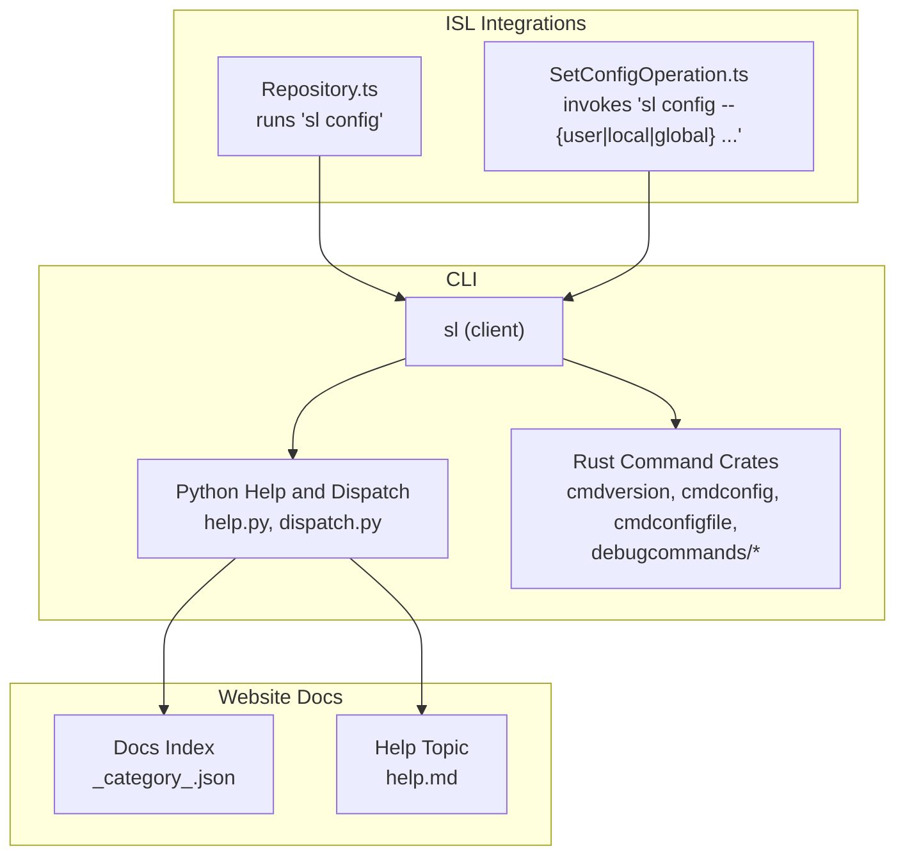
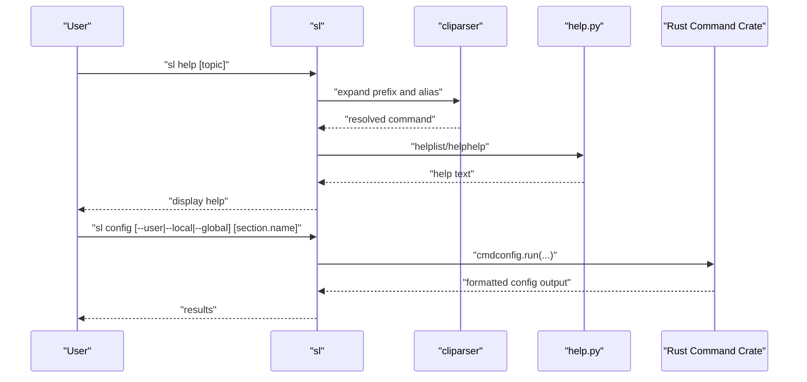
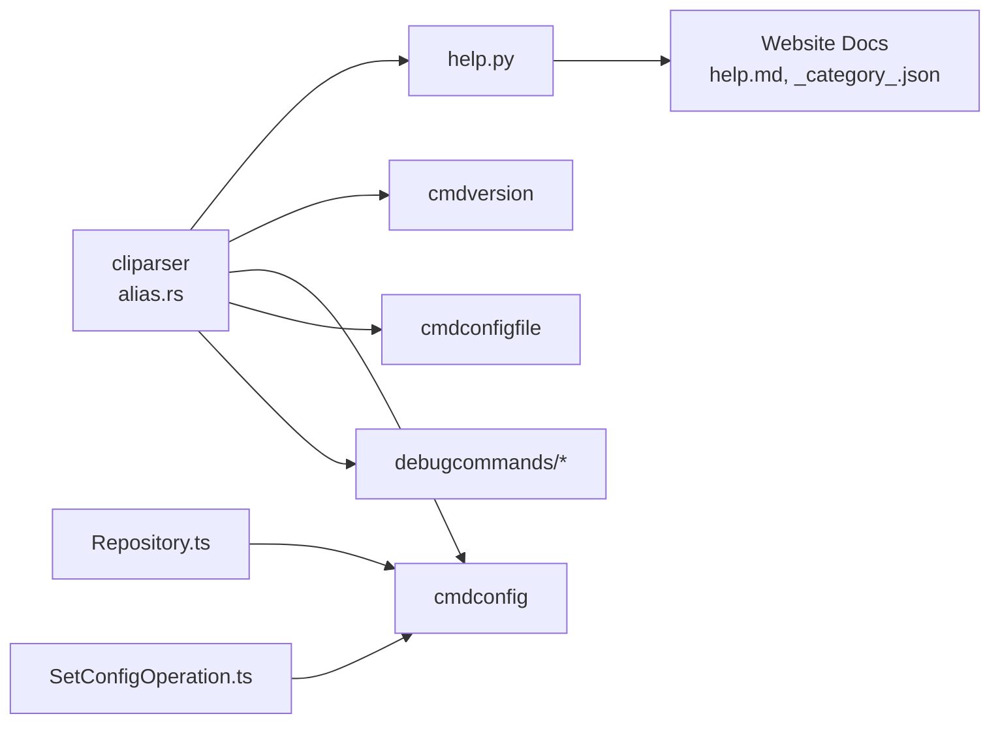

# Utility Commands

<cite>
**Referenced Files in This Document**
- [README.md](file://README.md)
- [help.py](file://eden/scm/sapling/help.py)
- [lib.rs (cmdversion)](file://eden/scm/lib/commands/commands/cmdversion/src/lib.rs)
- [lib.rs (cmdconfig)](file://eden/scm/lib/commands/commands/cmdconfig/src/lib.rs)
- [lib.rs (cmdconfigfile)](file://eden/scm/lib/commands/commands/cmdconfigfile/src/lib.rs)
- [lib.rs (cmddebugcurrentexe)](file://eden/scm/lib/commands/debugcommands/cmddebugcurrentexe/src/lib.rs)
- [lib.rs (cmddebugargs)](file://eden/scm/lib/commands/debugcommands/cmddebugargs/src/lib.rs)
- [alias.rs](file://eden/scm/lib/cliparser/src/alias.rs)
- [Repository.ts](file://addons/isl-server/src/Repository.ts)
- [SetConfigOperation.ts](file://addons/isl/src/operations/SetConfigOperation.ts)
- [_category_.json](file://website/docs/commands/_category_.json)
- [help.md](file://website/docs/commands/help.md)
</cite>

## Table of Contents
1. [Introduction](#introduction)
2. [Project Structure](#project-structure)
3. [Core Components](#core-components)
4. [Architecture Overview](#architecture-overview)
5. [Detailed Component Analysis](#detailed-component-analysis)
6. [Dependency Analysis](#dependency-analysis)
7. [Performance Considerations](#performance-considerations)
8. [Troubleshooting Guide](#troubleshooting-guide)
9. [Conclusion](#conclusion)
10. [Appendices](#appendices)

## Introduction
This document describes the SAPLING SCM utility commands and administrative capabilities exposed via the client. It focuses on:
- help: command and topic discovery
- version: product and build information
- config: configuration inspection and management
- debug: diagnostic utilities
- locate: configuration file location resolution
- paths: repository path discovery
- id: object identification

It consolidates syntax, configuration file locations, environment variable usage, debugging options, examples, and operational guidance for administrators and developers.

## Project Structure
The SAPLING client is organized primarily under the eden/scm directory. Commands are implemented as Rust crates under lib/commands, with Python-based help and dispatch logic. Web UI integrations (ISL) invoke sl config and related commands programmatically.

**Diagram sources**
- [help.py:417-663](file://eden/scm/sapling/help.py#L417-L663)
- [lib.rs (cmdversion):1-41](file://eden/scm/lib/commands/commands/cmdversion/src/lib.rs#L1-L41)
- [lib.rs (cmdconfig):259-303](file://eden/scm/lib/commands/commands/cmdconfig/src/lib.rs#L259-L303)
- [lib.rs (cmdconfigfile):1-49](file://eden/scm/lib/commands/commands/cmdconfigfile/src/lib.rs#L1-L49)
- [Repository.ts:1670-1690](file://addons/isl-server/src/Repository.ts#L1670-L1690)
- [SetConfigOperation.ts:1-26](file://addons/isl/src/operations/SetConfigOperation.ts#L1-L26)
- [_category_.json:1-8](file://website/docs/commands/_category_.json#L1-L8)
- [help.md:1-28](file://website/docs/commands/help.md#L1-L28)

**Section sources**
- [README.md:30-48](file://README.md#L30-L48)
- [_category_.json:1-8](file://website/docs/commands/_category_.json#L1-L8)

## Core Components
- help: Lists commands, topics, and keywords; supports filtering by extension, command, keyword, and platform.
- version: Prints product name and version; includes optional copyright notice and Facebook-specific text when enabled.
- config: Reads configuration items and sections; supports scopes (user, local, global) and debug modes.
- debug: Diagnostic commands such as printing the current executable path and received arguments.
- locate: Resolves configuration file paths for user, local, and system scopes.
- paths: Repository path discovery (via help and dispatch).
- id: Object identification (alias for identify); prefix expansion logic treats id and identify as equivalent.

**Section sources**
- [help.py:417-663](file://eden/scm/sapling/help.py#L417-L663)
- [lib.rs (cmdversion):15-41](file://eden/scm/lib/commands/commands/cmdversion/src/lib.rs#L15-L41)
- [lib.rs (cmdconfig):259-303](file://eden/scm/lib/commands/commands/cmdconfig/src/lib.rs#L259-L303)
- [lib.rs (cmdconfigfile):33-49](file://eden/scm/lib/commands/commands/cmdconfigfile/src/lib.rs#L33-L49)
- [alias.rs:250-287](file://eden/scm/lib/cliparser/src/alias.rs#L250-L287)

## Architecture Overview
The client resolves commands, expands aliases, and routes to either Python help/CLI dispatch or Rust command crates. ISL integrations call sl config to read and update configuration.

**Diagram sources**
- [alias.rs:250-287](file://eden/scm/lib/cliparser/src/alias.rs#L250-L287)
- [help.py:417-663](file://eden/scm/sapling/help.py#L417-L663)
- [lib.rs (cmdconfig):259-303](file://eden/scm/lib/commands/commands/cmdconfig/src/lib.rs#L259-L303)

## Detailed Component Analysis

### help
- Purpose: Provide command and topic help, including keyword search and platform-specific guidance.
- Syntax
  - sl help
  - sl help --command
  - sl help --extension
  - sl help --keyword KEYWORD
  - sl help --system
- Behavior
  - Without arguments, lists commands with short help.
  - With a topic, prints help for that topic.
  - Supports verbose and quiet modes via global options.
- Related files
  - Python help and command listing logic
  - Website category and help topic pages

**Section sources**
- [help.py:417-663](file://eden/scm/sapling/help.py#L417-L663)
- [help.md:1-28](file://website/docs/commands/help.md#L1-L28)
- [_category_.json:1-8](file://website/docs/commands/_category_.json#L1-L8)

### version
- Purpose: Print product name and version; optionally include copyright and vendor-specific notices.
- Syntax
  - sl version
- Behavior
  - Writes product name and version to stdout.
  - Writes additional informational text to stderr unless quiet.
  - Aliases include version, vers, versi, versio.

**Section sources**
- [lib.rs (cmdversion):15-41](file://eden/scm/lib/commands/commands/cmdversion/src/lib.rs#L15-L41)

### config
- Purpose: Inspect and manage configuration across user, local, and global scopes.
- Syntax
  - sl config [section.name]
  - sl config [--user|--local|--global] [section.name]
  - sl config --debug [section.name]
- Behavior
  - If no arguments, prints all applicable configuration items.
  - With section.name, prints the value for that item.
  - With --user/--local/--global, restricts scope to the named level.
  - With --debug, includes built-in/built-in-like items.
  - Returns non-zero exit code when nothing is printed in plain format.
- Notes
  - Aliases include config, showconfig, debugconfig, conf, confi.
  - ISL integrations call sl config to read configuration values.

**Section sources**
- [lib.rs (cmdconfig):259-303](file://eden/scm/lib/commands/commands/cmdconfig/src/lib.rs#L259-L303)
- [Repository.ts:1670-1690](file://addons/isl-server/src/Repository.ts#L1670-L1690)
- [SetConfigOperation.ts:1-26](file://addons/isl/src/operations/SetConfigOperation.ts#L1-L26)

### debug
- Purpose: Provide diagnostics for troubleshooting.
- Subcommands
  - sl debugcurrentexe: Print the absolute path to the running executable.
  - sl debug-args: Print the parsed arguments received by the command.
- Behavior
  - Outputs to stdout and exits with success status; non-zero on write errors.

**Section sources**
- [lib.rs (cmddebugcurrentexe):12-29](file://eden/scm/lib/commands/debugcommands/cmddebugcurrentexe/src/lib.rs#L12-L29)
- [lib.rs (cmddebugargs):19-36](file://eden/scm/lib/commands/debugcommands/cmddebugargs/src/lib.rs#L19-L36)

### locate
- Purpose: Resolve configuration file locations for user, local, and system scopes.
- Syntax
  - sl debugconfiglocation
  - sl debugconfiglocation --user
  - sl debugconfiglocation --local
  - sl debugconfiglocation --system
- Behavior
  - Validates that at most one of --user, --local, or --system is specified.
  - Prints the resolved path(s) to stdout.
  - When none are specified, prints all applicable paths.

**Section sources**
- [lib.rs (cmdconfigfile):33-49](file://eden/scm/lib/commands/commands/cmdconfigfile/src/lib.rs#L33-L49)

### paths
- Purpose: Discover repository and related paths via help and dispatch mechanisms.
- Behavior
  - Use sl help to discover repository-related commands and topics.
  - Use sl help --keyword paths to filter for path-related topics.
  - Use sl help --command to focus on specific commands that may expose path information.

**Section sources**
- [help.py:417-663](file://eden/scm/sapling/help.py#L417-L663)

### id
- Purpose: Identify objects (alias for identify).
- Behavior
  - Prefix expansion treats id and identify as equivalent.
  - Ambiguity resolution prefers non-debug matches when available.

**Section sources**
- [alias.rs:250-287](file://eden/scm/lib/cliparser/src/alias.rs#L250-L287)

## Dependency Analysis
- Command resolution depends on cliparser prefix expansion and alias expansion.
- help.py provides command listings and topic help.
- Rust command crates implement core functionality and are invoked by the CLI.
- ISL integrations rely on sl config for configuration reads and updates.

**Diagram sources**
- [alias.rs:250-287](file://eden/scm/lib/cliparser/src/alias.rs#L250-L287)
- [help.py:417-663](file://eden/scm/sapling/help.py#L417-L663)
- [lib.rs (cmdversion):15-41](file://eden/scm/lib/commands/commands/cmdversion/src/lib.rs#L15-L41)
- [lib.rs (cmdconfig):259-303](file://eden/scm/lib/commands/commands/cmdconfig/src/lib.rs#L259-L303)
- [lib.rs (cmdconfigfile):33-49](file://eden/scm/lib/commands/commands/cmdconfigfile/src/lib.rs#L33-L49)
- [Repository.ts:1670-1690](file://addons/isl-server/src/Repository.ts#L1670-L1690)
- [SetConfigOperation.ts:1-26](file://addons/isl/src/operations/SetConfigOperation.ts#L1-L26)
- [help.md:1-28](file://website/docs/commands/help.md#L1-L28)
- [_category_.json:1-8](file://website/docs/commands/_category_.json#L1-L8)

**Section sources**
- [alias.rs:250-287](file://eden/scm/lib/cliparser/src/alias.rs#L250-L287)
- [help.py:417-663](file://eden/scm/sapling/help.py#L417-L663)

## Performance Considerations
- Use sl config with explicit scope (--user/--local/--global) to limit scanning to relevant configuration files.
- Use sl help --keyword to quickly narrow down relevant commands and topics.
- Avoid excessive verbosity when scripting; prefer concise output formats where available.

## Troubleshooting Guide
- Command not found or ambiguous
  - Use sl help to list commands and sl help --keyword to search topics.
  - For id/identify ambiguity, note that both resolve to the same handler.
- Configuration not applied
  - Verify scope: --user, --local, or --global.
  - Use sl debugconfiglocation to confirm the path of the relevant config file.
- Diagnosing invocation issues
  - Use sl debugcurrentexe to confirm which binary is running.
  - Use sl debug-args to inspect parsed arguments passed to the command.

**Section sources**
- [help.py:417-663](file://eden/scm/sapling/help.py#L417-L663)
- [alias.rs:250-287](file://eden/scm/lib/cliparser/src/alias.rs#L250-L287)
- [lib.rs (cmdconfigfile):33-49](file://eden/scm/lib/commands/commands/cmdconfigfile/src/lib.rs#L33-L49)
- [lib.rs (cmddebugcurrentexe):12-29](file://eden/scm/lib/commands/debugcommands/cmddebugcurrentexe/src/lib.rs#L12-L29)
- [lib.rs (cmddebugargs):19-36](file://eden/scm/lib/commands/debugcommands/cmddebugargs/src/lib.rs#L19-L36)

## Conclusion
The SAPLING SCM client provides a robust set of utility commands for administration and diagnostics. Use help to discover commands, version for product information, config for inspection and management, debug for diagnostics, locate for configuration paths, paths for repository discovery, and id for object identification. These tools integrate with both the CLI and ISL to support efficient workflows and troubleshooting.

## Appendices

### Configuration File Locations
- User configuration path: Resolved by identity defaults.
- Local repository configuration: Within the repository’s configuration area.
- System configuration: Located in the system configuration directory.

**Section sources**
- [lib.rs (cmdconfigfile):33-49](file://eden/scm/lib/commands/commands/cmdconfigfile/src/lib.rs#L33-L49)

### Environment Variables
- Not explicitly documented in the referenced files. Use standard shell environment mechanisms to influence process execution and PATH-based discovery.

### Examples

- Show help overview
  - sl help
- Search for commands related to paths
  - sl help --keyword paths
- Show version
  - sl version
- List all configuration
  - sl config
- Read a specific configuration item
  - sl config ui.interactive
- Set a configuration item (ISL integration)
  - sl config --user ui.interactive true
- Locate configuration files
  - sl debugconfiglocation --user
  - sl debugconfiglocation --local
  - sl debugconfiglocation --system
- Diagnose runtime
  - sl debugcurrentexe
  - sl debug-args

**Section sources**
- [help.py:417-663](file://eden/scm/sapling/help.py#L417-L663)
- [lib.rs (cmdversion):15-41](file://eden/scm/lib/commands/commands/cmdversion/src/lib.rs#L15-L41)
- [lib.rs (cmdconfig):259-303](file://eden/scm/lib/commands/commands/cmdconfig/src/lib.rs#L259-L303)
- [lib.rs (cmdconfigfile):33-49](file://eden/scm/lib/commands/commands/cmdconfigfile/src/lib.rs#L33-L49)
- [lib.rs (cmddebugcurrentexe):12-29](file://eden/scm/lib/commands/debugcommands/cmddebugcurrentexe/src/lib.rs#L12-L29)
- [lib.rs (cmddebugargs):19-36](file://eden/scm/lib/commands/debugcommands/cmddebugargs/src/lib.rs#L19-L36)
- [Repository.ts:1670-1690](file://addons/isl-server/src/Repository.ts#L1670-L1690)
- [SetConfigOperation.ts:1-26](file://addons/isl/src/operations/SetConfigOperation.ts#L1-L26)