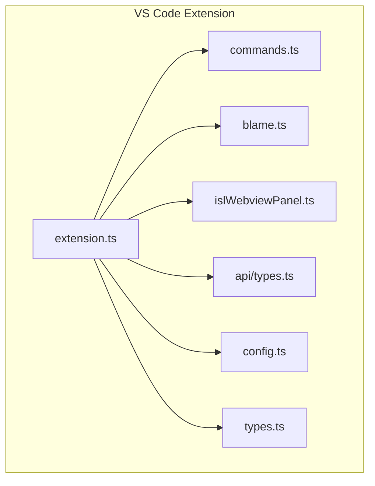
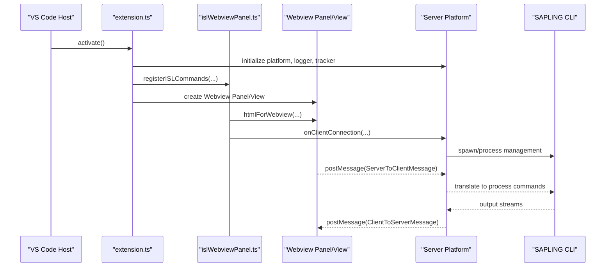
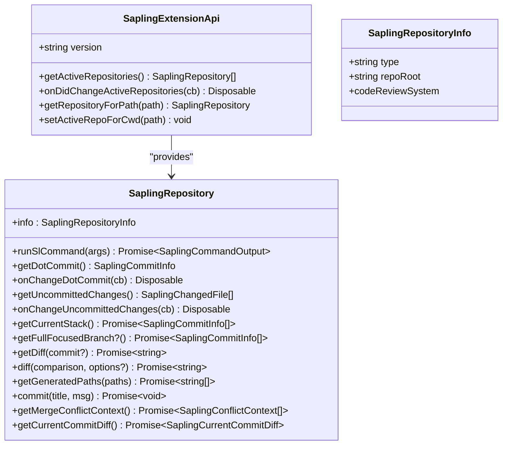
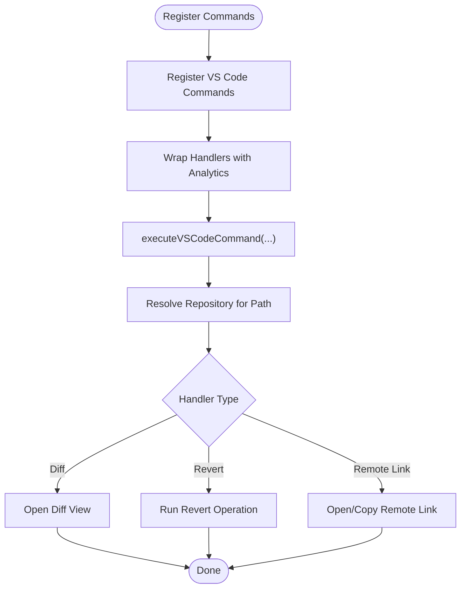
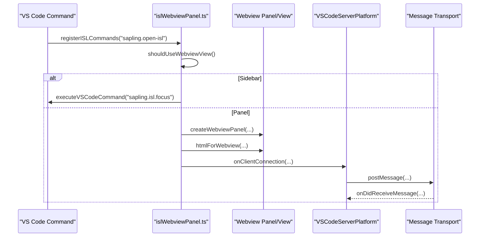
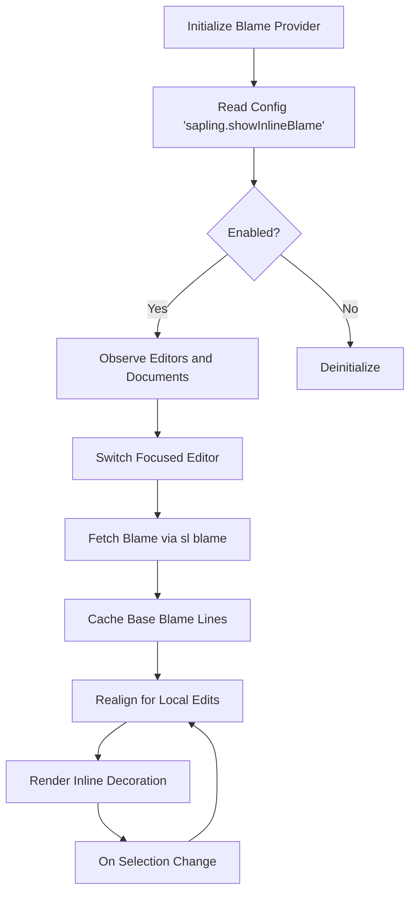
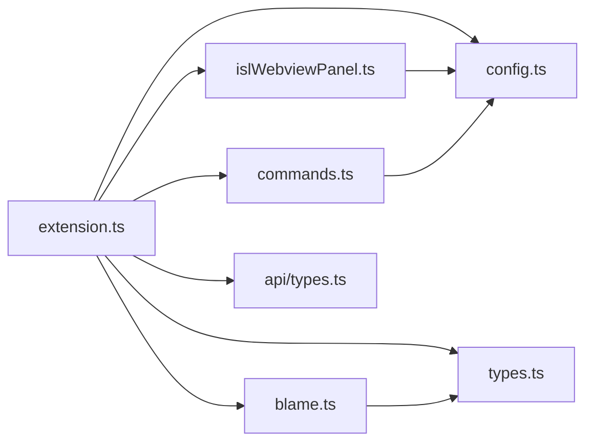

# Extension API

<cite>
**Referenced Files in This Document**
- [package.json](file://addons/vscode/package.json)
- [extension.ts](file://addons/vscode/extension/extension.ts)
- [commands.ts](file://addons/vscode/extension/commands.ts)
- [types.ts](file://addons/vscode/extension/types.ts)
- [config.ts](file://addons/vscode/extension/config.ts)
- [api/types.ts](file://addons/vscode/extension/api/types.ts)
- [blame.ts](file://addons/vscode/extension/blame/blame.ts)
- [islWebviewPanel.ts](file://addons/vscode/extension/islWebviewPanel.ts)
- [README.md](file://addons/vs/README.md)
</cite>

## Table of Contents
1. [Introduction](#introduction)
2. [Project Structure](#project-structure)
3. [Core Components](#core-components)
4. [Architecture Overview](#architecture-overview)
5. [Detailed Component Analysis](#detailed-component-analysis)
6. [Dependency Analysis](#dependency-analysis)
7. [Performance Considerations](#performance-considerations)
8. [Troubleshooting Guide](#troubleshooting-guide)
9. [Conclusion](#conclusion)
10. [Appendices](#appendices)

## Introduction
This document describes the Extension API for the SAPLING SCM VS Code integration and outlines how the extension integrates with the main SAPLING process. It covers command registration, webview panel management, inline comment functionality, blame integration, configuration options, lifecycle management, and communication protocols. It also highlights differences between the VS Code and Visual Studio integrations.

## Project Structure
The VS Code extension is organized into several modules:
- Activation and lifecycle: extension bootstrap, platform setup, and analytics
- Commands: VS Code command registration and handlers
- Webview: ISL webview panel and sidebar view providers
- Blame: inline blame decoration provider
- API: public extension API surface for other extensions
- Config: configuration accessors and persistence helpers
- Types: feature flags and action trigger types

**Diagram sources**
- [extension.ts:31-109](file://addons/vscode/extension/extension.ts#L31-L109)
- [commands.ts:149-164](file://addons/vscode/extension/commands.ts#L149-L164)
- [blame.ts:71-197](file://addons/vscode/extension/blame/blame.ts#L71-L197)
- [islWebviewPanel.ts:217-369](file://addons/vscode/extension/islWebviewPanel.ts#L217-L369)
- [api/types.ts:31-47](file://addons/vscode/extension/api/types.ts#L31-L47)
- [config.ts:18-29](file://addons/vscode/extension/config.ts#L18-L29)
- [types.ts:14-29](file://addons/vscode/extension/types.ts#L14-L29)

**Section sources**
- [package.json:14-306](file://addons/vscode/package.json#L14-L306)
- [extension.ts:31-109](file://addons/vscode/extension/extension.ts#L31-L109)

## Core Components
- Extension activation and API export
  - Initializes platform, logger, analytics, and registers commands and providers
  - Exposes a public API for other extensions to query repositories and run commands
- Command registration
  - Registers VS Code commands for diff views, revert, remote links, and ISL controls
  - Provides typed wrappers for programmatic execution
- Webview panel management
  - Creates and manages ISL webview panels and sidebar views
  - Handles serialization/deserialization, persistence, and cross-process messaging
- Inline comment and blame
  - Inline blame provider with caching, realignment, and hover support
  - Optional inline comments provider integration
- Configuration and customization
  - Extensive configuration options for UI behavior, diff modes, and open location preferences
- Lifecycle management
  - Feature gating via EnabledSCMApiFeature flags
  - Proper disposal of subscriptions and providers

**Section sources**
- [extension.ts:31-109](file://addons/vscode/extension/extension.ts#L31-L109)
- [commands.ts:36-72](file://addons/vscode/extension/commands.ts#L36-L72)
- [islWebviewPanel.ts:217-369](file://addons/vscode/extension/islWebviewPanel.ts#L217-L369)
- [blame.ts:71-197](file://addons/vscode/extension/blame/blame.ts#L71-L197)
- [api/types.ts:31-148](file://addons/vscode/extension/api/types.ts#L31-L148)
- [config.ts:18-29](file://addons/vscode/extension/config.ts#L18-L29)
- [types.ts:14-29](file://addons/vscode/extension/types.ts#L14-L29)

## Architecture Overview
The extension orchestrates VS Code UI (commands, webviews, decorations) and communicates with the SAPLING process via a server-side platform abstraction. The ISL webview runs a separate client that exchanges messages with the extension through a transport layer.

**Diagram sources**
- [extension.ts:31-109](file://addons/vscode/extension/extension.ts#L31-L109)
- [islWebviewPanel.ts:433-503](file://addons/vscode/extension/islWebviewPanel.ts#L433-L503)

## Detailed Component Analysis

### Public Extension API
The extension exports a typed API for other extensions to interact with SAPLING repositories.

**Diagram sources**
- [api/types.ts:31-148](file://addons/vscode/extension/api/types.ts#L31-L148)

Key behaviors:
- Repository discovery and change events
- Command execution with progress and queueing
- Diff retrieval and conflict context
- Commit and stack introspection

**Section sources**
- [api/types.ts:31-148](file://addons/vscode/extension/api/types.ts#L31-L148)

### Command Registration and Handlers
The extension registers VS Code commands and wraps handlers to provide consistent error tracking and context binding.

**Diagram sources**
- [commands.ts:149-164](file://addons/vscode/extension/commands.ts#L149-L164)
- [commands.ts:173-202](file://addons/vscode/extension/commands.ts#L173-L202)
- [commands.ts:214-257](file://addons/vscode/extension/commands.ts#L214-L257)

Highlights:
- Typed command registry with programmatic execution helper
- Diff view creation with left/right URIs encoded via custom schemes
- Remote link generation for supported code review providers
- Operation queuing and progress reporting

**Section sources**
- [commands.ts:36-72](file://addons/vscode/extension/commands.ts#L36-L72)
- [commands.ts:149-164](file://addons/vscode/extension/commands.ts#L149-L164)
- [commands.ts:173-202](file://addons/vscode/extension/commands.ts#L173-L202)
- [commands.ts:214-257](file://addons/vscode/extension/commands.ts#L214-L257)

### Webview Panel Management
The extension creates and manages an ISL webview panel or a sidebar view depending on configuration. It handles persistence, readiness signaling, and message routing.

**Diagram sources**
- [islWebviewPanel.ts:217-369](file://addons/vscode/extension/islWebviewPanel.ts#L217-L369)
- [islWebviewPanel.ts:433-503](file://addons/vscode/extension/islWebviewPanel.ts#L433-L503)

Key features:
- Toggle between panel and sidebar view
- Persist state via extension global storage with per-key migration
- Ready signal for programmatic control
- Orphaned window detection and replacement on extension host restart

**Section sources**
- [islWebviewPanel.ts:93-134](file://addons/vscode/extension/islWebviewPanel.ts#L93-L134)
- [islWebviewPanel.ts:166-172](file://addons/vscode/extension/islWebviewPanel.ts#L166-L172)
- [islWebviewPanel.ts:181-215](file://addons/vscode/extension/islWebviewPanel.ts#L181-L215)
- [islWebviewPanel.ts:354-369](file://addons/vscode/extension/islWebviewPanel.ts#L354-L369)
- [islWebviewPanel.ts:547-634](file://addons/vscode/extension/islWebviewPanel.ts#L547-L634)

### Inline Blame Provider
The inline blame provider renders blame annotations next to the cursor and updates them as the user edits the file.

**Diagram sources**
- [blame.ts:108-181](file://addons/vscode/extension/blame/blame.ts#L108-L181)
- [blame.ts:218-291](file://addons/vscode/extension/blame/blame.ts#L218-L291)
- [blame.ts:306-325](file://addons/vscode/extension/blame/blame.ts#L306-L325)

Behavior:
- Debounced editor and selection handling
- LRU cache per repository for blame lines
- Realignment of blame lines against current document text
- Head commit change invalidates caches

**Section sources**
- [blame.ts:71-197](file://addons/vscode/extension/blame/blame.ts#L71-L197)
- [blame.ts:218-291](file://addons/vscode/extension/blame/blame.ts#L218-L291)
- [blame.ts:306-325](file://addons/vscode/extension/blame/blame.ts#L306-L325)

### Configuration Options and Customization
The extension contributes numerous configuration keys affecting UI behavior, diff presentation, and open locations.

Examples of contributed settings:
- sapling.commandPath: override the SAPLING CLI command
- sapling.showInlineBlame: toggle inline blame
- sapling.showDiffComments: toggle inline comments
- sapling.inlineCommentDiffViewMode: Unified or Split
- sapling.markConflictingFilesResolvedOnSave: auto-mark resolved conflicts
- sapling.comparisonPanelMode: Auto or Always Separate Panel
- sapling.isl.openBeside: open comparisons beside current editor
- sapling.isl.showInSidebar: show ISL in sidebar instead of a panel
- sapling.isl.showOpenOrFocusButtonOnEditorTitle: show ISL button in editor title

These are defined in the extension manifest and surfaced through VS Code settings UI.

**Section sources**
- [package.json:40-98](file://addons/vscode/package.json#L40-L98)
- [config.ts:18-29](file://addons/vscode/extension/config.ts#L18-L29)

### Extension Lifecycle Management
- Activation events: onStartupFinished, onCommand, onWebviewPanel, onView
- Feature flags: EnabledSCMApiFeature controls availability of blame, sidebar, diffview, comments, and new inline comments
- Analytics: server-side tracker records activation and command errors
- Resource cleanup: all disposables are managed via extension subscriptions

**Section sources**
- [package.json:14-19](file://addons/vscode/package.json#L14-L19)
- [types.ts:14-19](file://addons/vscode/extension/types.ts#L14-L19)
- [extension.ts:31-109](file://addons/vscode/extension/extension.ts#L31-L109)

### Communication Protocols with the Main SAPLING Process
- CLI command resolution: configurable via sapling.commandPath with OS-specific defaults
- Webview messaging: serialized messages exchanged between webview client and extension
- Persistence: initial state injected into webview HTML; subsequent updates stored per-key in global storage
- URI handling: custom schemes for diff content and deleted files

**Section sources**
- [config.ts:18-24](file://addons/vscode/extension/config.ts#L18-L24)
- [islWebviewPanel.ts:473-490](file://addons/vscode/extension/islWebviewPanel.ts#L473-L490)
- [islWebviewPanel.ts:547-634](file://addons/vscode/extension/islWebviewPanel.ts#L547-L634)

### Practical Usage Examples
- Programmatic activation and repository queries:
  - Activate extension and retrieve repository for a path
  - Get current commit and subscribe to changes
  - Run read-only commands and diff operations
- Opening ISL:
  - Use the "Open Interactive Smartlog" command or the sidebar view
  - Optionally pass commit message to prefill draft commit
- Opening comparison views:
  - Use commands for uncommitted/head/stack comparisons
  - Configure whether to open beside the active editor

Note: These examples reference code paths rather than reproducing code.

**Section sources**
- [api/types.ts:31-47](file://addons/vscode/extension/api/types.ts#L31-L47)
- [api/types.ts:74-148](file://addons/vscode/extension/api/types.ts#L74-L148)
- [islWebviewPanel.ts:235-246](file://addons/vscode/extension/islWebviewPanel.ts#L235-L246)
- [islWebviewPanel.ts:248-279](file://addons/vscode/extension/islWebviewPanel.ts#L248-L279)
- [commands.ts:36-45](file://addons/vscode/extension/commands.ts#L36-L45)
- [config.ts:27-29](file://addons/vscode/extension/config.ts#L27-L29)

### Visual Studio Extension Limitations and Differences
- The Visual Studio extension README indicates a webview-based Interactive Smartlog UI similar to the CLI’s web command, but it does not include the SAPLING SCM binary itself—users must install SAPLING separately.
- The VS Code extension provides a broader API surface (commands, webview, inline blame, comments), while the Visual Studio counterpart appears to focus on launching the ISL UI and linking to remote code review systems.

**Section sources**
- [README.md:1-16](file://addons/vs/README.md#L1-L16)

## Dependency Analysis
The extension composes multiple subsystems with clear separation of concerns.

**Diagram sources**
- [extension.ts:31-109](file://addons/vscode/extension/extension.ts#L31-L109)
- [commands.ts:149-164](file://addons/vscode/extension/commands.ts#L149-L164)
- [blame.ts:71-197](file://addons/vscode/extension/blame/blame.ts#L71-L197)
- [islWebviewPanel.ts:217-369](file://addons/vscode/extension/islWebviewPanel.ts#L217-L369)
- [api/types.ts:31-47](file://addons/vscode/extension/api/types.ts#L31-L47)
- [config.ts:18-29](file://addons/vscode/extension/config.ts#L18-L29)
- [types.ts:14-19](file://addons/vscode/extension/types.ts#L14-L19)

Observations:
- Loose coupling via interfaces and typed APIs
- Centralized configuration accessors
- Clear disposal boundaries for providers and listeners

**Section sources**
- [extension.ts:31-109](file://addons/vscode/extension/extension.ts#L31-L109)
- [islWebviewPanel.ts:217-369](file://addons/vscode/extension/islWebviewPanel.ts#L217-L369)

## Performance Considerations
- Debouncing and throttling:
  - Editor switching and selection changes are debounced to avoid excessive processing
  - Document change handling uses a debounce to minimize realignment computations
- Caching:
  - LRU cache for blame lines per repository
  - Head commit change invalidates caches to prevent stale blame
- Serialization and persistence:
  - Per-key global storage reduces payload sizes and improves responsiveness
- Webview lifecycle:
  - Retain context when hidden for sidebar view
  - Replace orphaned panels on extension host restart to avoid broken connections

**Section sources**
- [blame.ts:116-132](file://addons/vscode/extension/blame/blame.ts#L116-L132)
- [blame.ts:158-178](file://addons/vscode/extension/blame/blame.ts#L158-L178)
- [blame.ts:404-410](file://addons/vscode/extension/blame/blame.ts#L404-L410)
- [islWebviewPanel.ts:355-359](file://addons/vscode/extension/islWebviewPanel.ts#L355-L359)
- [islWebviewPanel.ts:181-215](file://addons/vscode/extension/islWebviewPanel.ts#L181-L215)

## Troubleshooting Guide
Common issues and resolutions:
- Extension fails to activate or shows errors:
  - Check the “Sapling ISL” output channel for logs and error traces
  - Verify SAPLING CLI path in settings and ensure the binary is installed
- ISL webview does not appear:
  - Confirm activation events and try toggling between panel and sidebar view
  - On restarts, orphaned tabs are replaced automatically; if not, close and reopen
- Inline blame not showing:
  - Ensure the feature is enabled in settings
  - Verify the file belongs to a recognized repository
  - Confirm the head commit has not changed recently
- Diff view opens incorrectly:
  - Adjust the “open beside” preference in settings
  - For submodule or committed diffs, the right side may be non-editable by design

**Section sources**
- [extension.ts:111-132](file://addons/vscode/extension/extension.ts#L111-L132)
- [config.ts:18-24](file://addons/vscode/extension/config.ts#L18-L24)
- [islWebviewPanel.ts:181-215](file://addons/vscode/extension/islWebviewPanel.ts#L181-L215)
- [blame.ts:90-106](file://addons/vscode/extension/blame/blame.ts#L90-L106)
- [commands.ts:196-202](file://addons/vscode/extension/commands.ts#L196-L202)

## Conclusion
The SAPLING SCM VS Code extension provides a robust API and UI integration for working with SAPLING repositories. It supports command-driven workflows, a powerful ISL webview, inline blame, and optional inline comments. Configuration enables fine-grained control over UI behavior, and lifecycle management ensures reliable operation across sessions. While the Visual Studio extension focuses on launching the ISL UI, the VS Code extension offers a richer API surface for automation and integration.

## Appendices

### Configuration Reference
- sapling.commandPath: string (default: empty; falls back to OS-specific CLI name)
- sapling.showInlineBlame: boolean (default: true)
- sapling.showDiffComments: boolean (default: true)
- sapling.inlineCommentDiffViewMode: string enum "Unified" | "Split"
- sapling.markConflictingFilesResolvedOnSave: boolean (default: true)
- sapling.comparisonPanelMode: string enum "Auto" | "Always Separate Panel"
- sapling.isl.openBeside: boolean (default: false)
- sapling.isl.showInSidebar: boolean (default: false)
- sapling.isl.showOpenOrFocusButtonOnEditorTitle: boolean (default: true)

**Section sources**
- [package.json:40-98](file://addons/vscode/package.json#L40-L98)