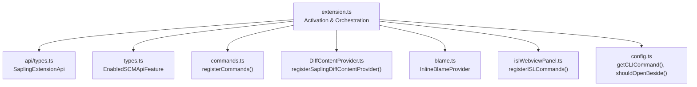
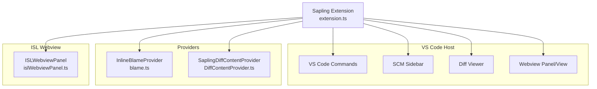
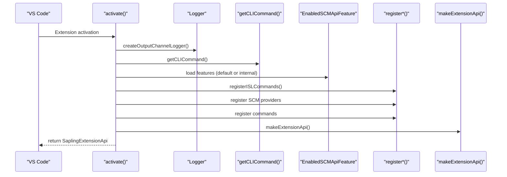
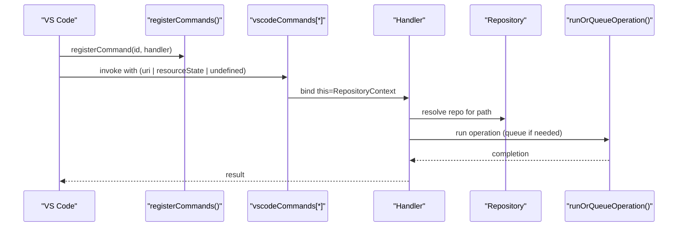
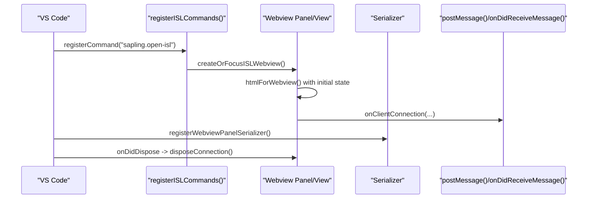
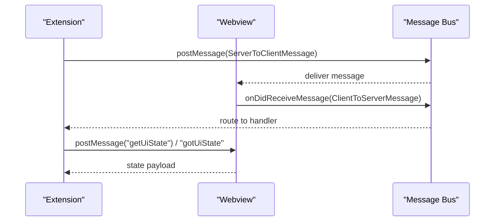
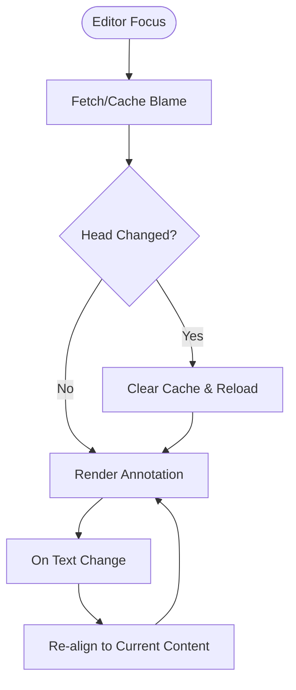
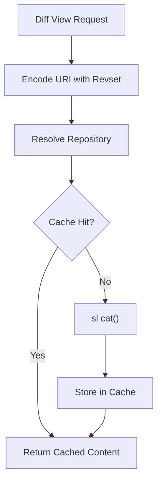
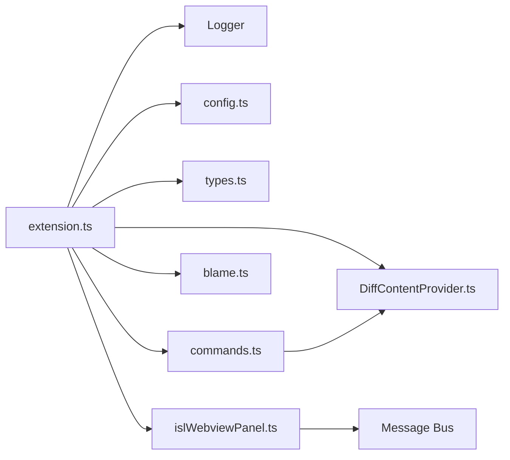

# VS Code Extension API

<cite>
**Referenced Files in This Document**
- [extension.ts](file://addons/vscode/extension/extension.ts)
- [types.ts](file://addons/vscode/extension/types.ts)
- [api/types.ts](file://addons/vscode/extension/api/types.ts)
- [commands.ts](file://addons/vscode/extension/commands.ts)
- [DiffContentProvider.ts](file://addons/vscode/extension/DiffContentProvider.ts)
- [blame.ts](file://addons/vscode/extension/blame/blame.ts)
- [islWebviewPanel.ts](file://addons/vscode/extension/islWebviewPanel.ts)
- [config.ts](file://addons/vscode/extension/config.ts)
</cite>

## Table of Contents
1. [Introduction](#introduction)
2. [Project Structure](#project-structure)
3. [Core Components](#core-components)
4. [Architecture Overview](#architecture-overview)
5. [Detailed Component Analysis](#detailed-component-analysis)
6. [Dependency Analysis](#dependency-analysis)
7. [Performance Considerations](#performance-considerations)
8. [Troubleshooting Guide](#troubleshooting-guide)
9. [Conclusion](#conclusion)
10. [Appendices](#appendices)

## Introduction
This document describes the SAPLING SCM VS Code Extension API surface and runtime behavior. It covers extension activation, command registration, webview panel management, and the TypeScript interfaces that define the public API. It also explains the lifecycle from activation to deactivation, resource management, webview communication protocol, URI handler registration, configuration options, internationalization support, and debugging techniques. Practical examples illustrate how to implement commands, integrate inline comments, set up a blame provider, and register a diff content provider.

## Project Structure
The VS Code extension is implemented under addons/vscode/extension. Key areas:
- Activation and orchestration: extension.ts
- Public API types: api/types.ts
- Feature flags: types.ts
- Command registration and handlers: commands.ts
- Diff content provider: DiffContentProvider.ts
- Inline blame provider: blame/blame.ts
- ISL webview panel and messaging: islWebviewPanel.ts
- Configuration: config.ts

**Diagram sources**
- [extension.ts:31-109](file://addons/vscode/extension/extension.ts#L31-L109)
- [api/types.ts:31-47](file://addons/vscode/extension/api/types.ts#L31-L47)
- [types.ts:14-19](file://addons/vscode/extension/types.ts#L14-L19)
- [commands.ts:149-164](file://addons/vscode/extension/commands.ts#L149-L164)
- [DiffContentProvider.ts:176-181](file://addons/vscode/extension/DiffContentProvider.ts#L176-L181)
- [blame.ts:71-197](file://addons/vscode/extension/blame/blame.ts#L71-L197)
- [islWebviewPanel.ts:217-369](file://addons/vscode/extension/islWebviewPanel.ts#L217-L369)
- [config.ts:18-29](file://addons/vscode/extension/config.ts#L18-L29)

**Section sources**
- [extension.ts:31-109](file://addons/vscode/extension/extension.ts#L31-L109)

## Core Components
- SaplingExtensionApi: Public API exposed by the extension, enabling callers to discover repositories, subscribe to changes, and run read-only commands.
- RepositoryContext: Runtime context passed to commands and providers, containing CLI command, working directory, logger, and analytics tracker.
- EnabledSCMApiFeature: Feature flags controlling availability of blame, sidebar, comments, new inline comments, and AI-first-pass code review.

Key responsibilities:
- Activation initializes logging, platform, analytics, and registers SCM-related providers and commands.
- Deactivation relies on VS Code disposal of subscriptions; providers and disposables are managed automatically.

**Section sources**
- [api/types.ts:31-47](file://addons/vscode/extension/api/types.ts#L31-L47)
- [extension.ts:43-48](file://addons/vscode/extension/extension.ts#L43-L48)
- [types.ts:14-19](file://addons/vscode/extension/types.ts#L14-L19)

## Architecture Overview
The extension integrates with VS Code’s SCM, diff, and webview systems. Providers supply blame and diff content; commands expose UI actions; the ISL webview communicates with a server-side process via a message bus.

**Diagram sources**
- [extension.ts:57-95](file://addons/vscode/extension/extension.ts#L57-L95)
- [blame.ts:71-197](file://addons/vscode/extension/blame/blame.ts#L71-L197)
- [DiffContentProvider.ts:26-181](file://addons/vscode/extension/DiffContentProvider.ts#L26-L181)
- [islWebviewPanel.ts:103-134](file://addons/vscode/extension/islWebviewPanel.ts#L103-L134)

## Detailed Component Analysis

### Extension Activation and Lifecycle
- Activation creates an output channel and a logger wrapper, builds a RepositoryContext, loads translations, determines enabled SCM features, registers ISL commands, SCM providers (blame, diff, deleted file), optional inline comments provider, and a URI handler if available.
- Disposal is automatic via VS Code subscriptions; providers implement dispose to clean up listeners and caches.

**Diagram sources**
- [extension.ts:31-109](file://addons/vscode/extension/extension.ts#L31-L109)
- [config.ts:18-24](file://addons/vscode/extension/config.ts#L18-L24)

**Section sources**
- [extension.ts:31-109](file://addons/vscode/extension/extension.ts#L31-L109)
- [config.ts:18-29](file://addons/vscode/extension/config.ts#L18-L29)

### Command Registration System
- Commands are defined in a registry and registered with VS Code. Each command handler receives a bound RepositoryContext for analytics and execution.
- Handlers support invocation from command palette, SCM sidebar, or programmatic calls by accepting a URI or SourceControlResourceState.

**Diagram sources**
- [commands.ts:149-164](file://addons/vscode/extension/commands.ts#L149-L164)
- [commands.ts:36-72](file://addons/vscode/extension/commands.ts#L36-L72)
- [commands.ts:265-297](file://addons/vscode/extension/commands.ts#L265-L297)

**Section sources**
- [commands.ts:36-72](file://addons/vscode/extension/commands.ts#L36-L72)
- [commands.ts:149-164](file://addons/vscode/extension/commands.ts#L149-L164)
- [commands.ts:265-297](file://addons/vscode/extension/commands.ts#L265-L297)

### Webview Panel Management
- The extension supports both a floating panel and a sidebar Webview View. It manages creation, focus, serialization/deserialization, and disposal.
- The webview is populated with HTML that injects initial persisted state and language mode. Messages are exchanged using a binary-capable postMessage/onDidReceiveMessage bridge.

**Diagram sources**
- [islWebviewPanel.ts:217-369](file://addons/vscode/extension/islWebviewPanel.ts#L217-L369)
- [islWebviewPanel.ts:433-503](file://addons/vscode/extension/islWebviewPanel.ts#L433-L503)
- [islWebviewPanel.ts:371-391](file://addons/vscode/extension/islWebviewPanel.ts#L371-L391)

**Section sources**
- [islWebviewPanel.ts:103-134](file://addons/vscode/extension/islWebviewPanel.ts#L103-L134)
- [islWebviewPanel.ts:217-369](file://addons/vscode/extension/islWebviewPanel.ts#L217-L369)
- [islWebviewPanel.ts:433-503](file://addons/vscode/extension/islWebviewPanel.ts#L433-L503)

### Webview Communication Protocol
- The extension uses a typed message bus to exchange JSON-encoded messages between the webview and the extension. Binary messages are supported.
- The extension posts messages to the webview and listens for state queries and readiness signals.

**Diagram sources**
- [islWebviewPanel.ts:473-490](file://addons/vscode/extension/islWebviewPanel.ts#L473-L490)
- [islWebviewPanel.ts:509-539](file://addons/vscode/extension/islWebviewPanel.ts#L509-L539)

**Section sources**
- [islWebviewPanel.ts:473-490](file://addons/vscode/extension/islWebviewPanel.ts#L473-L490)
- [islWebviewPanel.ts:509-539](file://addons/vscode/extension/islWebviewPanel.ts#L509-L539)

### URI Handler Registration
- If an internal URI handler is provided, the extension registers a VS Code UriHandler to process external links and route them to the ISL webview or related features.

**Section sources**
- [extension.ts:87-93](file://addons/vscode/extension/extension.ts#L87-L93)

### Inline Blame Provider Setup
- The provider renders blame annotations alongside the cursor and updates on selection changes and document edits. It caches blame per file and invalidates on head changes.

**Diagram sources**
- [blame.ts:218-291](file://addons/vscode/extension/blame/blame.ts#L218-L291)
- [blame.ts:412-437](file://addons/vscode/extension/blame/blame.ts#L412-L437)

**Section sources**
- [blame.ts:71-197](file://addons/vscode/extension/blame/blame.ts#L71-L197)
- [blame.ts:218-291](file://addons/vscode/extension/blame/blame.ts#L218-L291)

### Diff Content Provider Registration
- The provider supplies “before” content for VS Code diff views using a custom scheme. It caches content and invalidates on head changes.

**Diagram sources**
- [DiffContentProvider.ts:128-168](file://addons/vscode/extension/DiffContentProvider.ts#L128-L168)
- [DiffContentProvider.ts:199-224](file://addons/vscode/extension/DiffContentProvider.ts#L199-L224)

**Section sources**
- [DiffContentProvider.ts:26-181](file://addons/vscode/extension/DiffContentProvider.ts#L26-L181)
- [DiffContentProvider.ts:128-168](file://addons/vscode/extension/DiffContentProvider.ts#L128-L168)

### Practical Examples

- Command implementation pattern
  - Use the command registry to register handlers that accept a URI or SourceControlResourceState and resolve the repository to run operations.
  - Reference: [commands.ts:36-72](file://addons/vscode/extension/commands.ts#L36-L72), [commands.ts:149-164](file://addons/vscode/extension/commands.ts#L149-L164)

- Inline comment integration
  - Conditional registration of inline comments provider based on enabled features and internal provider availability.
  - Reference: [extension.ts:66-86](file://addons/vscode/extension/extension.ts#L66-L86)

- Blame provider setup
  - Initialize and configure the provider based on user configuration and repository events.
  - Reference: [blame.ts:83-106](file://addons/vscode/extension/blame/blame.ts#L83-L106), [blame.ts:412-437](file://addons/vscode/extension/blame/blame.ts#L412-L437)

- Diff content provider registration
  - Register a content provider for a custom scheme and encode URIs with revsets.
  - Reference: [DiffContentProvider.ts:176-181](file://addons/vscode/extension/DiffContentProvider.ts#L176-L181), [DiffContentProvider.ts:199-224](file://addons/vscode/extension/DiffContentProvider.ts#L199-L224)

- Webview panel management
  - Open, focus, and manage the ISL webview panel or sidebar view; handle serialization and orphaned windows.
  - Reference: [islWebviewPanel.ts:103-134](file://addons/vscode/extension/islWebviewPanel.ts#L103-L134), [islWebviewPanel.ts:217-369](file://addons/vscode/extension/islWebviewPanel.ts#L217-L369)

### Configuration Options
- sapling.commandPath: Override the CLI command path; defaults vary by OS.
- sapling.isl.openBeside: Open diffs/comparisons beside the active editor.
- sapling.showInlineBlame: Enable/disable inline blame rendering.
- sapling.isl.showInSidebar: Toggle between panel and sidebar view.

**Section sources**
- [config.ts:18-29](file://addons/vscode/extension/config.ts#L18-L29)
- [islWebviewPanel.ts:166-168](file://addons/vscode/extension/islWebviewPanel.ts#L166-L168)
- [blame.ts:90-105](file://addons/vscode/extension/blame/blame.ts#L90-L105)

### Internationalization Support
- Translations are loaded during activation and used for UI labels and messages.
- The webview receives the current locale via a script injection.

**Section sources**
- [extension.ts:51-55](file://addons/vscode/extension/extension.ts#L51-L55)
- [islWebviewPanel.ts:463-469](file://addons/vscode/extension/islWebviewPanel.ts#L463-L469)

### Extension Debugging Techniques
- Use the “Sapling ISL” output channel to inspect logs.
- Inspect persisted state keys and migration behavior in global storage.
- Verify command execution via analytics tracking and error reporting.

**Section sources**
- [extension.ts:111-132](file://addons/vscode/extension/extension.ts#L111-L132)
- [islWebviewPanel.ts:547-634](file://addons/vscode/extension/islWebviewPanel.ts#L547-L634)

## Dependency Analysis
The extension composes several subsystems:
- Activation depends on platform, logger, and analytics initialization.
- Providers depend on repository resolution and caching utilities.
- Commands depend on operation queues and VS Code APIs.
- Webview depends on message serialization and persisted state.

**Diagram sources**
- [extension.ts:31-109](file://addons/vscode/extension/extension.ts#L31-L109)
- [config.ts:18-29](file://addons/vscode/extension/config.ts#L18-L29)
- [types.ts:14-19](file://addons/vscode/extension/types.ts#L14-L19)
- [commands.ts:149-164](file://addons/vscode/extension/commands.ts#L149-L164)
- [DiffContentProvider.ts:176-181](file://addons/vscode/extension/DiffContentProvider.ts#L176-L181)
- [blame.ts:71-197](file://addons/vscode/extension/blame/blame.ts#L71-L197)
- [islWebviewPanel.ts:217-369](file://addons/vscode/extension/islWebviewPanel.ts#L217-L369)

**Section sources**
- [extension.ts:31-109](file://addons/vscode/extension/extension.ts#L31-L109)

## Performance Considerations
- Debounce expensive operations (e.g., blame updates on selection and text changes).
- Cache file content and blame results to minimize repeated calls to the CLI.
- Invalidate caches conservatively on head changes to maintain correctness.
- Avoid unnecessary subscriptions and dispose them on extension deactivation.

[No sources needed since this section provides general guidance]

## Troubleshooting Guide
- If the ISL panel becomes unresponsive after an extension host restart, orphaned tabs are replaced automatically; ensure the sidebar view is closed if switching modes.
- If diff content appears outdated, verify head commit changes trigger cache invalidation.
- If inline blame does not appear, confirm the feature flag and configuration are enabled and that the current file belongs to a recognized repository.

**Section sources**
- [islWebviewPanel.ts:181-215](file://addons/vscode/extension/islWebviewPanel.ts#L181-L215)
- [DiffContentProvider.ts:76-99](file://addons/vscode/extension/DiffContentProvider.ts#L76-L99)
- [blame.ts:90-106](file://addons/vscode/extension/blame/blame.ts#L90-L106)

## Conclusion
The SAPLING SCM VS Code Extension exposes a cohesive API and integrates tightly with VS Code’s SCM, diff, and webview systems. Its activation flow initializes providers and commands, while robust message handling and configuration options enable flexible usage. Proper disposal and caching ensure a responsive user experience.

[No sources needed since this section summarizes without analyzing specific files]

## Appendices

### TypeScript Interfaces Overview
- SaplingExtensionApi: Repository discovery, subscription, and read-only command execution.
- SaplingRepository: Dot commit, uncommitted changes, stack retrieval, diff generation, and conflict context.
- EnabledSCMApiFeature: Feature flags controlling blame, sidebar, comments, new inline comments, and AI-first-pass code review.

**Section sources**
- [api/types.ts:31-47](file://addons/vscode/extension/api/types.ts#L31-L47)
- [api/types.ts:74-148](file://addons/vscode/extension/api/types.ts#L74-L148)
- [types.ts:14-19](file://addons/vscode/extension/types.ts#L14-L19)