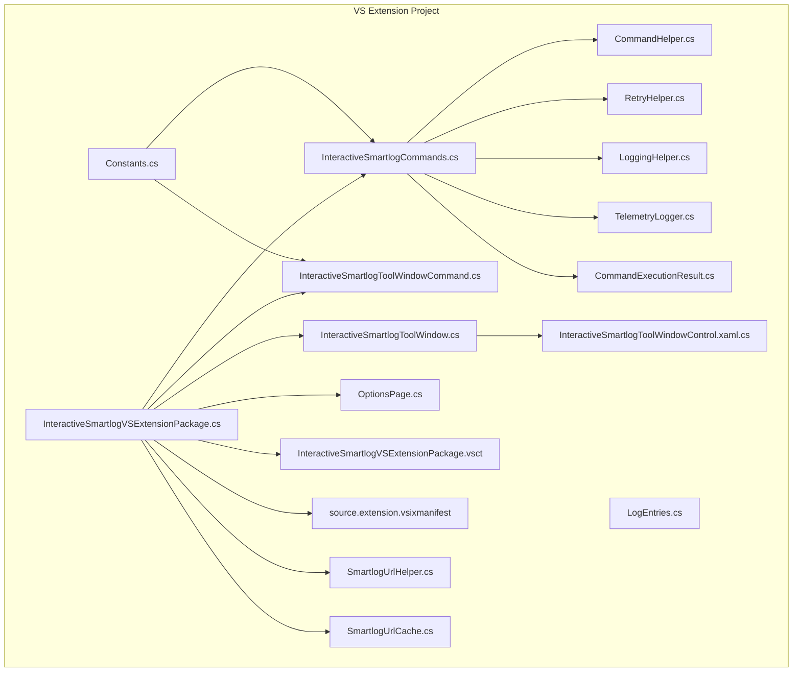
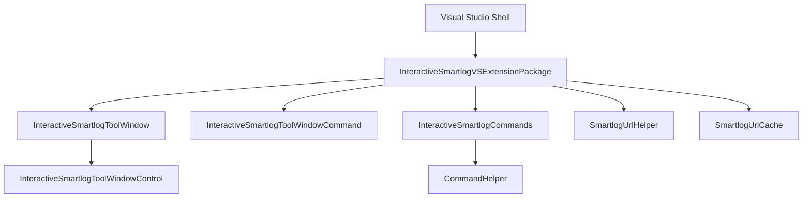
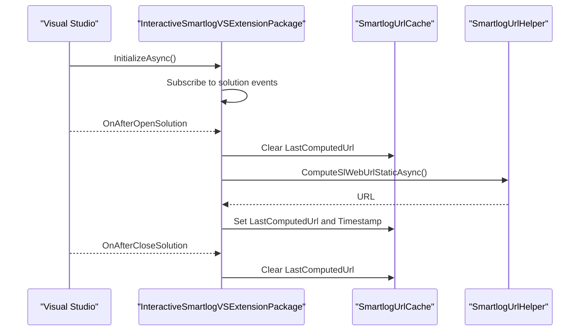
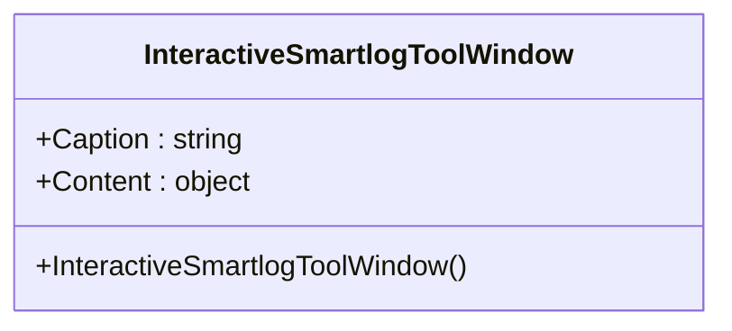
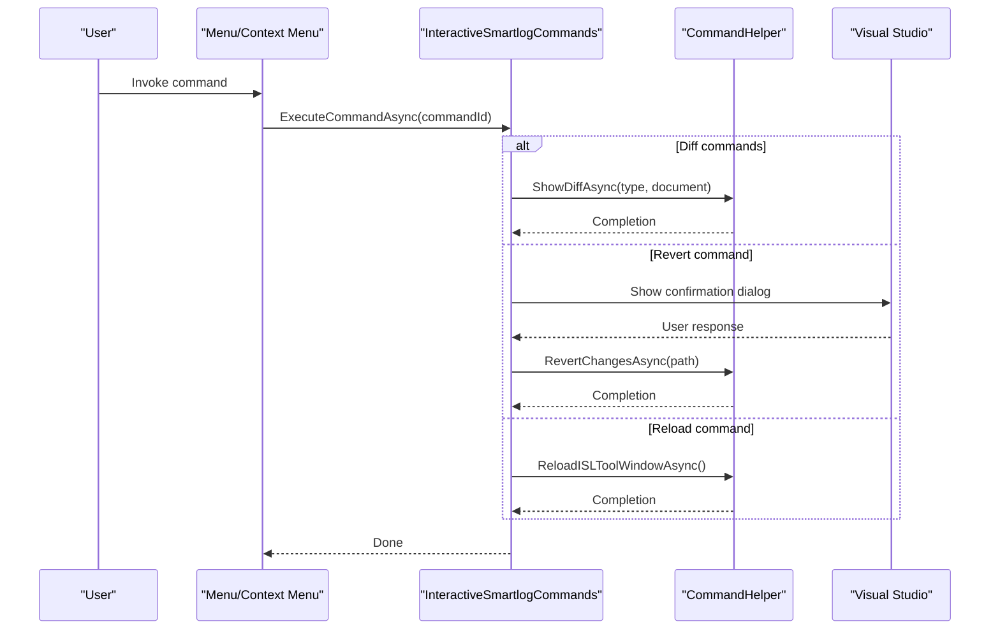
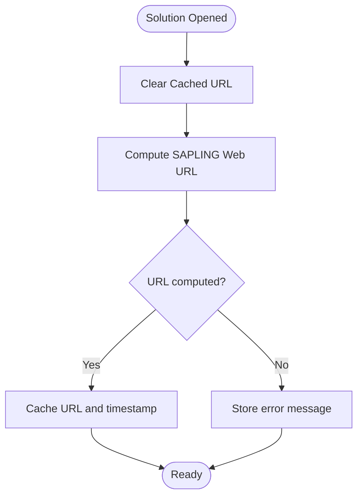
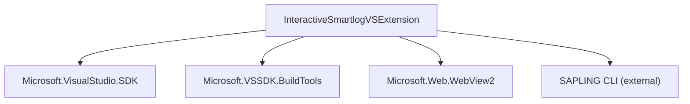

# Visual Studio Extension API

<cite>
**Referenced Files in This Document**
- [README.md](file://addons/vs/README.md)
- [InteractiveSmartlogVSExtension.sln](file://addons/vs/InteractiveSmartlogVSExtension/InteractiveSmartlogVSExtension.sln)
- [InteractiveSmartlogVSExtension.csproj](file://addons/vs/InteractiveSmartlogVSExtension/InteractiveSmartlogVSExtension/InteractiveSmartlogVSExtension.csproj)
- [InteractiveSmartlogVSExtensionPackage.cs](file://addons/vs/InteractiveSmartlogVSExtension/InteractiveSmartlogVSExtension/InteractiveSmartlogVSExtensionPackage.cs)
- [InteractiveSmartlogToolWindow.cs](file://addons/vs/InteractiveSmartlogVSExtension/InteractiveSmartlogVSExtension/ToolWindows/InteractiveSmartlogToolWindow.cs)
- [InteractiveSmartlogToolWindowCommand.cs](file://addons/vs/InteractiveSmartlogVSExtension/InteractiveSmartlogVSExtension/Commands/InteractiveSmartlogToolWindowCommand.cs)
- [InteractiveSmartlogCommands.cs](file://addons/vs/InteractiveSmartlogVSExtension/InteractiveSmartlogVSExtension/Commands/InteractiveSmartlogCommands.cs)
- [CommandHelper.cs](file://addons/vs/InteractiveSmartlogVSExtension/InteractiveSmartlogVSExtension/Helpers/CommandHelper.cs)
- [SmartlogUrlHelper.cs](file://addons/vs/InteractiveSmartlogVSExtension/InteractiveSmartlogVSExtension/Helpers/SmartlogUrlHelper.cs)
- [SmartlogUrlCache.cs](file://addons/vs/InteractiveSmartlogVSExtension/InteractiveSmartlogVSExtension/Models/SmartlogUrlCache.cs)
- [OptionsPage.cs](file://addons/vs/InteractiveSmartlogVSExtension/InteractiveSmartlogVSExtension/Options/OptionsPage.cs)
- [Constants.cs](file://addons/vs/InteractiveSmartlogVSExtension/InteractiveSmartlogVSExtension/Constants/Constants.cs)
- [RetryHelper.cs](file://addons/vs/InteractiveSmartlogVSExtension/InteractiveSmartlogVSExtension/Helpers/RetryHelper.cs)
- [LoggingHelper.cs](file://addons/vs/InteractiveSmartlogVSExtension/InteractiveSmartlogVSExtension/Helpers/LoggingHelper.cs)
- [TelemetryLogger.cs](file://addons/vs/InteractiveSmartlogVSExtension/InteractiveSmartlogVSExtension/Telemetry/TelemetryLogger.cs)
- [LogEntries.cs](file://addons/vs/InteractiveSmartlogVSExtension/InteractiveSmartlogVSExtension/Telemetry/LogEntries.cs)
- [CommandExecutionResult.cs](file://addons/vs/InteractiveSmartlogVSExtension/InteractiveSmartlogVSExtension/Models/CommandExecutionResult.cs)
- [InteractiveSmartlogToolWindowControl.xaml.cs](file://addons/vs/InteractiveSmartlogVSExtension/InteractiveSmartlogVSExtension/ToolWindows/InteractiveSmartlogToolWindowControl.xaml.cs)
- [InteractiveSmartlogVSExtensionPackage.vsct](file://addons/vs/InteractiveSmartlogVSExtension/InteractiveSmartlogVSExtension/InteractiveSmartlogVSExtensionPackage.vsct)
- [source.extension.vsixmanifest](file://addons/vs/InteractiveSmartlogVSExtension/InteractiveSmartlogVSExtension/source.extension.vsixmanifest)
</cite>

## Table of Contents
1. [Introduction](#introduction)
2. [Project Structure](#project-structure)
3. [Core Components](#core-components)
4. [Architecture Overview](#architecture-overview)
5. [Detailed Component Analysis](#detailed-component-analysis)
6. [Dependency Analysis](#dependency-analysis)
7. [Performance Considerations](#performance-considerations)
8. [Troubleshooting Guide](#troubleshooting-guide)
9. [Conclusion](#conclusion)
10. [Appendices](#appendices)

## Introduction
This document describes the Visual Studio Extension API for SAPLING SCM, focusing on the Interactive Smartlog tool window, integration with Visual Studio's UI, and the extension's relationship with the SAPLING CLI and server components. It also covers installation, configuration, commands, menu items, and limitations compared to the VS Code version.

Key facts:
- The extension provides a Visual Studio tool window that hosts an embedded web-based Interactive Smartlog experience.
- It integrates with Visual Studio's solution lifecycle and exposes commands via menus and context menus.
- The extension depends on the SAPLING CLI being installed and available on PATH for core operations.
- The extension does not include the SAPLING SCM binaries themselves; users must install SAPLING separately.

**Section sources**
- [README.md:1-16](file://addons/vs/README.md#L1-L16)

## Project Structure
The Visual Studio extension is organized as a VSIX project targeting Visual Studio 2022 (version 17.x). The project includes:
- Package and tool window infrastructure
- Commands for menu and context menu integration
- Helpers for command execution and URL computation
- Options page for configuration
- Telemetry and logging utilities
- WebView-based tool window control

**Diagram sources**
- [InteractiveSmartlogVSExtension.csproj:47-151](file://addons/vs/InteractiveSmartlogVSExtension/InteractiveSmartlogVSExtension/InteractiveSmartlogVSExtension.csproj#L47-L151)
- [InteractiveSmartlogVSExtensionPackage.cs:40-108](file://addons/vs/InteractiveSmartlogVSExtension/InteractiveSmartlogVSExtension/InteractiveSmartlogVSExtensionPackage.cs#L40-L108)
- [InteractiveSmartlogToolWindow.cs:25-40](file://addons/vs/InteractiveSmartlogVSExtension/InteractiveSmartlogVSExtension/ToolWindows/InteractiveSmartlogToolWindow.cs#L25-L40)
- [InteractiveSmartlogToolWindowCommand.cs:41-96](file://addons/vs/InteractiveSmartlogVSExtension/InteractiveSmartlogVSExtension/Commands/InteractiveSmartlogToolWindowCommand.cs#L41-L96)
- [InteractiveSmartlogCommands.cs:42-178](file://addons/vs/InteractiveSmartlogVSExtension/InteractiveSmartlogVSExtension/Commands/InteractiveSmartlogCommands.cs#L42-L178)
- [CommandHelper.cs](file://addons/vs/InteractiveSmartlogVSExtension/InteractiveSmartlogVSExtension/Helpers/CommandHelper.cs)
- [SmartlogUrlHelper.cs](file://addons/vs/InteractiveSmartlogVSExtension/InteractiveSmartlogVSExtension/Helpers/SmartlogUrlHelper.cs)
- [SmartlogUrlCache.cs](file://addons/vs/InteractiveSmartlogVSExtension/InteractiveSmartlogVSExtension/Models/SmartlogUrlCache.cs)
- [OptionsPage.cs](file://addons/vs/InteractiveSmartlogVSExtension/InteractiveSmartlogVSExtension/Options/OptionsPage.cs)
- [Constants.cs](file://addons/vs/InteractiveSmartlogVSExtension/InteractiveSmartlogVSExtension/Constants/Constants.cs)
- [RetryHelper.cs](file://addons/vs/InteractiveSmartlogVSExtension/InteractiveSmartlogVSExtension/Helpers/RetryHelper.cs)
- [LoggingHelper.cs](file://addons/vs/InteractiveSmartlogVSExtension/InteractiveSmartlogVSExtension/Helpers/LoggingHelper.cs)
- [TelemetryLogger.cs](file://addons/vs/InteractiveSmartlogVSExtension/InteractiveSmartlogVSExtension/Telemetry/TelemetryLogger.cs)
- [LogEntries.cs](file://addons/vs/InteractiveSmartlogVSExtension/InteractiveSmartlogVSExtension/Telemetry/LogEntries.cs)
- [CommandExecutionResult.cs](file://addons/vs/InteractiveSmartlogVSExtension/InteractiveSmartlogVSExtension/Models/CommandExecutionResult.cs)
- [InteractiveSmartlogToolWindowControl.xaml.cs](file://addons/vs/InteractiveSmartlogVSExtension/InteractiveSmartlogVSExtension/ToolWindows/InteractiveSmartlogToolWindowControl.xaml.cs)
- [InteractiveSmartlogVSExtensionPackage.vsct](file://addons/vs/InteractiveSmartlogVSExtension/InteractiveSmartlogVSExtension/InteractiveSmartlogVSExtensionPackage.vsct)
- [source.extension.vsixmanifest](file://addons/vs/InteractiveSmartlogVSExtension/InteractiveSmartlogVSExtension/source.extension.vsixmanifest)

**Section sources**
- [InteractiveSmartlogVSExtension.sln:1-48](file://addons/vs/InteractiveSmartlogVSExtension/InteractiveSmartlogVSExtension.sln#L1-L48)
- [InteractiveSmartlogVSExtension.csproj:1-151](file://addons/vs/InteractiveSmartlogVSExtension/InteractiveSmartlogVSExtension/InteractiveSmartlogVSExtension.csproj#L1-L151)

## Core Components
- Package and lifecycle: Registers the tool window, menu integration, and option page; subscribes to solution events to compute and cache the SAPLING web URL.
- Tool window: Hosts the Interactive Smartlog UI and manages its caption and content.
- Commands: Expose menu and context menu actions for reloading the UI and performing diffs/reverts.
- Helpers: Encapsulate command execution, URL computation, retries, and logging.
- Options: Provides configuration for diff tool selection and arguments.
- Telemetry and logging: Capture operational events and errors.

**Section sources**
- [InteractiveSmartlogVSExtensionPackage.cs:40-108](file://addons/vs/InteractiveSmartlogVSExtension/InteractiveSmartlogVSExtension/InteractiveSmartlogVSExtensionPackage.cs#L40-L108)
- [InteractiveSmartlogToolWindow.cs:25-40](file://addons/vs/InteractiveSmartlogVSExtension/InteractiveSmartlogVSExtension/ToolWindows/InteractiveSmartlogToolWindow.cs#L25-L40)
- [InteractiveSmartlogToolWindowCommand.cs:41-96](file://addons/vs/InteractiveSmartlogVSExtension/InteractiveSmartlogVSExtension/Commands/InteractiveSmartlogToolWindowCommand.cs#L41-L96)
- [InteractiveSmartlogCommands.cs:42-178](file://addons/vs/InteractiveSmartlogVSExtension/InteractiveSmartlogVSExtension/Commands/InteractiveSmartlogCommands.cs#L42-L178)
- [OptionsPage.cs](file://addons/vs/InteractiveSmartlogVSExtension/InteractiveSmartlogVSExtension/Options/OptionsPage.cs)
- [TelemetryLogger.cs](file://addons/vs/InteractiveSmartlogVSExtension/InteractiveSmartlogVSExtension/Telemetry/TelemetryLogger.cs)
- [LoggingHelper.cs](file://addons/vs/InteractiveSmartlogVSExtension/InteractiveSmartlogVSExtension/Helpers/LoggingHelper.cs)

## Architecture Overview
The extension follows a standard Visual Studio extension pattern:
- The package initializes on VS startup, registers tool windows and menus, and subscribes to solution events.
- The tool window hosts a user control that displays the Interactive Smartlog UI.
- Commands are wired to menu and context menu entries and dispatch to helper routines for execution.
- The package computes and caches the SAPLING web URL when a solution opens.

**Diagram sources**
- [InteractiveSmartlogVSExtensionPackage.cs:40-108](file://addons/vs/InteractiveSmartlogVSExtension/InteractiveSmartlogVSExtension/InteractiveSmartlogVSExtensionPackage.cs#L40-L108)
- [InteractiveSmartlogToolWindow.cs:25-40](file://addons/vs/InteractiveSmartlogVSExtension/InteractiveSmartlogVSExtension/ToolWindows/InteractiveSmartlogToolWindow.cs#L25-L40)
- [InteractiveSmartlogToolWindowCommand.cs:41-96](file://addons/vs/InteractiveSmartlogVSExtension/InteractiveSmartlogVSExtension/Commands/InteractiveSmartlogToolWindowCommand.cs#L41-L96)
- [InteractiveSmartlogCommands.cs:42-178](file://addons/vs/InteractiveSmartlogVSExtension/InteractiveSmartlogVSExtension/Commands/InteractiveSmartlogCommands.cs#L42-L178)
- [SmartlogUrlHelper.cs](file://addons/vs/InteractiveSmartlogVSExtension/InteractiveSmartlogVSExtension/Helpers/SmartlogUrlHelper.cs)
- [SmartlogUrlCache.cs](file://addons/vs/InteractiveSmartlogVSExtension/InteractiveSmartlogVSExtension/Models/SmartlogUrlCache.cs)

## Detailed Component Analysis

### Package and Lifecycle Management
- Auto-load behavior: Loads in background when a solution exists or when no solution is present.
- Menu integration: Resources are registered via VSCT.
- Option page: Exposes configuration for diff tool preferences.
- Tool window registration: Right-side tool window docked in Solution Explorer.
- Solution events: Computes and caches the SAPLING web URL on solution open; clears cache on close.

**Diagram sources**
- [InteractiveSmartlogVSExtensionPackage.cs:70-106](file://addons/vs/InteractiveSmartlogVSExtension/InteractiveSmartlogVSExtension/InteractiveSmartlogVSExtensionPackage.cs#L70-L106)
- [SmartlogUrlHelper.cs](file://addons/vs/InteractiveSmartlogVSExtension/InteractiveSmartlogVSExtension/Helpers/SmartlogUrlHelper.cs)
- [SmartlogUrlCache.cs](file://addons/vs/InteractiveSmartlogVSExtension/InteractiveSmartlogVSExtension/Models/SmartlogUrlCache.cs)

**Section sources**
- [InteractiveSmartlogVSExtensionPackage.cs:40-108](file://addons/vs/InteractiveSmartlogVSExtension/InteractiveSmartlogVSExtension/InteractiveSmartlogVSExtensionPackage.cs#L40-L108)

### Tool Window Implementation
- Caption: "Interactive Smartlog"
- Content: A user control hosting the web-based UI.
- Single-instance behavior: Creating the tool window ensures a single pane.

**Diagram sources**
- [InteractiveSmartlogToolWindow.cs:25-40](file://addons/vs/InteractiveSmartlogVSExtension/InteractiveSmartlogVSExtension/ToolWindows/InteractiveSmartlogToolWindow.cs#L25-L40)

**Section sources**
- [InteractiveSmartlogToolWindow.cs:25-40](file://addons/vs/InteractiveSmartlogVSExtension/InteractiveSmartlogVSExtension/ToolWindows/InteractiveSmartlogToolWindow.cs#L25-L40)

### Menu and Context Menu Commands
- Tool window command: Adds a menu item to show the tool window.
- Context menu commands: Provide actions for diffing uncommitted/stack/head changes and reverting uncommitted changes.
- Command routing: Uses command IDs from constants and delegates to helper routines.

**Diagram sources**
- [InteractiveSmartlogCommands.cs:131-178](file://addons/vs/InteractiveSmartlogVSExtension/InteractiveSmartlogVSExtension/Commands/InteractiveSmartlogCommands.cs#L131-L178)
- [CommandHelper.cs](file://addons/vs/InteractiveSmartlogVSExtension/InteractiveSmartlogVSExtension/Helpers/CommandHelper.cs)

**Section sources**
- [InteractiveSmartlogToolWindowCommand.cs:41-96](file://addons/vs/InteractiveSmartlogVSExtension/InteractiveSmartlogVSExtension/Commands/InteractiveSmartlogToolWindowCommand.cs#L41-L96)
- [InteractiveSmartlogCommands.cs:42-178](file://addons/vs/InteractiveSmartlogVSExtension/InteractiveSmartlogVSExtension/Commands/InteractiveSmartlogCommands.cs#L42-L178)
- [Constants.cs](file://addons/vs/InteractiveSmartlogVSExtension/InteractiveSmartlogVSExtension/Constants/Constants.cs)

### Configuration and Options
- Options page: Registered under "InteractiveSmartLog" category with "Options" subcategory.
- Diff tool configuration: Stores selected diff tool and custom executable/arguments.
- Accessible via Tools > Options > InteractiveSmartLog > Options.

**Section sources**
- [InteractiveSmartlogVSExtensionPackage.cs:45-59](file://addons/vs/InteractiveSmartlogVSExtension/InteractiveSmartlogVSExtension/InteractiveSmartlogVSExtensionPackage.cs#L45-L59)
- [OptionsPage.cs](file://addons/vs/InteractiveSmartlogVSExtension/InteractiveSmartlogVSExtension/Options/OptionsPage.cs)

### URL Computation and Caching
- On solution open, the package computes the SAPLING web URL and caches it with a timestamp.
- On solution close, the cache is cleared.
- The helper encapsulates URL computation logic.

**Diagram sources**
- [InteractiveSmartlogVSExtensionPackage.cs:84-106](file://addons/vs/InteractiveSmartlogVSExtension/InteractiveSmartlogVSExtension/InteractiveSmartlogVSExtensionPackage.cs#L84-L106)
- [SmartlogUrlHelper.cs](file://addons/vs/InteractiveSmartlogVSExtension/InteractiveSmartlogVSExtension/Helpers/SmartlogUrlHelper.cs)
- [SmartlogUrlCache.cs](file://addons/vs/InteractiveSmartlogVSExtension/InteractiveSmartlogVSExtension/Models/SmartlogUrlCache.cs)

**Section sources**
- [InteractiveSmartlogVSExtensionPackage.cs:84-106](file://addons/vs/InteractiveSmartlogVSExtension/InteractiveSmartlogVSExtension/InteractiveSmartlogVSExtensionPackage.cs#L84-L106)

### Telemetry and Logging
- Telemetry logger captures structured log entries for operational insights.
- Logging helper centralizes logging patterns.
- Retry helper supports robust command execution.

**Section sources**
- [TelemetryLogger.cs](file://addons/vs/InteractiveSmartlogVSExtension/InteractiveSmartlogVSExtension/Telemetry/TelemetryLogger.cs)
- [LogEntries.cs](file://addons/vs/InteractiveSmartlogVSExtension/InteractiveSmartlogVSExtension/Telemetry/LogEntries.cs)
- [LoggingHelper.cs](file://addons/vs/InteractiveSmartlogVSExtension/InteractiveSmartlogVSExtension/Helpers/LoggingHelper.cs)
- [RetryHelper.cs](file://addons/vs/InteractiveSmartlogVSExtension/InteractiveSmartlogVSExtension/Helpers/RetryHelper.cs)

## Dependency Analysis
External dependencies and integration points:
- Visual Studio SDK: Targets Microsoft.VisualStudio.SDK and build tools.
- WebView2: Used for hosting the web-based UI.
- SAPLING CLI: Required for backend operations; must be installed and available on PATH.
- Visual Studio Services: Uses DTE, menu command service, and shell utilities.

**Diagram sources**
- [InteractiveSmartlogVSExtension.csproj:107-128](file://addons/vs/InteractiveSmartlogVSExtension/InteractiveSmartlogVSExtension/InteractiveSmartlogVSExtension.csproj#L107-L128)

**Section sources**
- [InteractiveSmartlogVSExtension.csproj:107-128](file://addons/vs/InteractiveSmartlogVSExtension/InteractiveSmartlogVSExtension/InteractiveSmartlogVSExtension.csproj#L107-L128)

## Performance Considerations
- Background loading: Package auto-loads in background to minimize startup impact.
- UI thread usage: Commands switch to the UI thread before interacting with Visual Studio services.
- Caching: URL computation is cached per solution session to avoid repeated overhead.
- WebView2: Rendering occurs in a dedicated control; keep the UI responsive by avoiding blocking operations.

[No sources needed since this section provides general guidance]

## Troubleshooting Guide
Common issues and resolutions:
- SAPLING CLI not found
  - Symptom: Commands fail with errors indicating the SAPLING CLI cannot be executed.
  - Resolution: Install SAPLING SCM and ensure it is available on PATH.
- Tool window fails to show
  - Symptom: Menu command appears but tool window does not open.
  - Resolution: Verify the tool window registration and that the package initializes successfully.
- Diff tool configuration errors
  - Symptom: Custom diff tool not launching or arguments not applied.
  - Resolution: Check Tools > Options > InteractiveSmartLog > Options for correct executable and arguments.
- Solution events not updating URL
  - Symptom: URL remains stale after opening a new solution.
  - Resolution: Close and reopen the solution to trigger recomputation; check logs for errors.

**Section sources**
- [README.md:14-16](file://addons/vs/README.md#L14-L16)
- [InteractiveSmartlogVSExtensionPackage.cs:84-106](file://addons/vs/InteractiveSmartlogVSExtension/InteractiveSmartlogVSExtension/InteractiveSmartlogVSExtensionPackage.cs#L84-L106)
- [OptionsPage.cs](file://addons/vs/InteractiveSmartlogVSExtension/InteractiveSmartlogVSExtension/Options/OptionsPage.cs)

## Conclusion
The SAPLING SCM Visual Studio Extension integrates a web-based Interactive Smartlog UI into Visual Studio through a tool window, exposing commands for diffing and reverting changes. It relies on the SAPLING CLI for backend operations and provides configuration options for diff tool preferences. While it mirrors the core functionality of the VS Code extension, differences in UI paradigms and tool window integration define its distinct behavior within Visual Studio.

[No sources needed since this section summarizes without analyzing specific files]

## Appendices

### Installation and Setup
- Install SAPLING SCM separately as documented on the SAPLING website.
- Build or acquire the VSIX package for this extension.
- Install the extension in Visual Studio and restart the IDE.
- Open a solution to enable the extension’s features.

**Section sources**
- [README.md:14-16](file://addons/vs/README.md#L14-L16)
- [InteractiveSmartlogVSExtension.sln:1-48](file://addons/vs/InteractiveSmartlogVSExtension/InteractiveSmartlogVSExtension.sln#L1-L48)

### Commands, Menus, and Tooltips
- View menu: "Other Windows" > "Interactive Smartlog" (keyboard shortcut may be available as described in the extension readme).
- Context menu: Commands for diffing uncommitted/stack/head changes and reverting uncommitted changes.
- Toolbar: Not explicitly defined in the analyzed files; primary access is via menus.

**Section sources**
- [README.md:7-12](file://addons/vs/README.md#L7-L12)
- [InteractiveSmartlogToolWindowCommand.cs:41-96](file://addons/vs/InteractiveSmartlogVSExtension/InteractiveSmartlogVSExtension/Commands/InteractiveSmartlogToolWindowCommand.cs#L41-L96)
- [InteractiveSmartlogCommands.cs:42-61](file://addons/vs/InteractiveSmartlogVSExtension/InteractiveSmartlogVSExtension/Commands/InteractiveSmartlogCommands.cs#L42-L61)

### Configuration Options
- Category: "InteractiveSmartLog"
- Page: "Options"
- Settings: Diff tool selection and custom executable/arguments.

**Section sources**
- [InteractiveSmartlogVSExtensionPackage.cs:45-59](file://addons/vs/InteractiveSmartlogVSExtension/InteractiveSmartlogVSExtension/InteractiveSmartlogVSExtensionPackage.cs#L45-L59)
- [OptionsPage.cs](file://addons/vs/InteractiveSmartlogVSExtension/InteractiveSmartlogVSExtension/Options/OptionsPage.cs)

### Limitations Compared to VS Code
- The extension readme indicates the presence of an Interactive Smartlog UI similar to the web command; however, the VS Code extension offers broader feature coverage. Specific limitations observed in this repository include:
  - No explicit support for advanced VS Code-specific features such as inline commenting panels or specialized Git-like workflows.
  - The extension focuses on integrating the web-based Interactive Smartlog UI and basic diff/revert actions within Visual Studio’s context.
- Users should consult the VS Code extension documentation for a complete feature comparison.

**Section sources**
- [README.md:5-12](file://addons/vs/README.md#L5-L12)

### Compatibility and Requirements
- Visual Studio version: Minimum Visual Studio version is defined in the project properties; targets Visual Studio 2022 (version 17.x).
- Target framework: .NET Framework 4.7.2.
- WebView2 runtime: Required for hosting the web UI.

**Section sources**
- [InteractiveSmartlogVSExtension.csproj:3-18](file://addons/vs/InteractiveSmartlogVSExtension/InteractiveSmartlogVSExtension/InteractiveSmartlogVSExtension.csproj#L3-L18)
- [InteractiveSmartlogVSExtension.csproj:122-124](file://addons/vs/InteractiveSmartlogVSExtension/InteractiveSmartlogVSExtension/InteractiveSmartlogVSExtension.csproj#L122-L124)