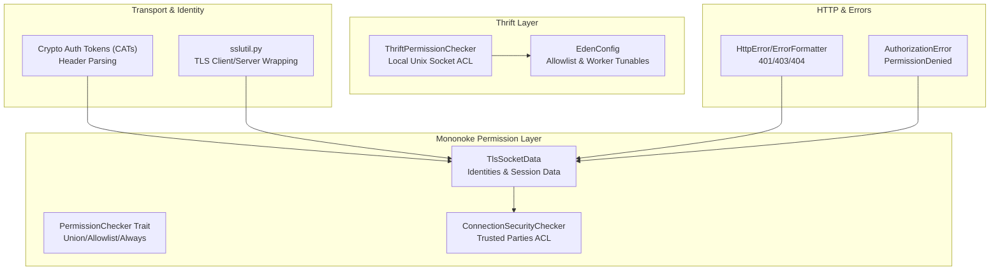
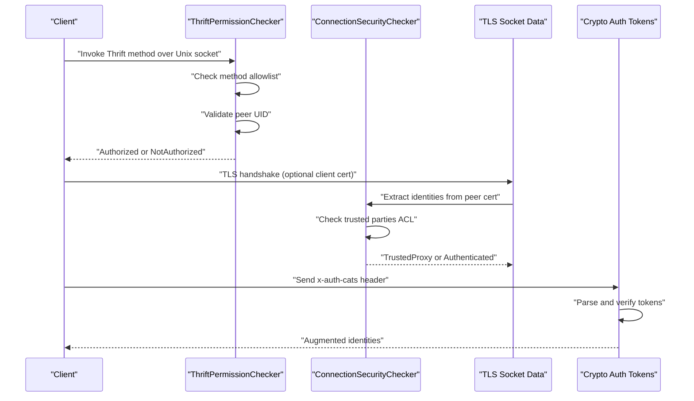
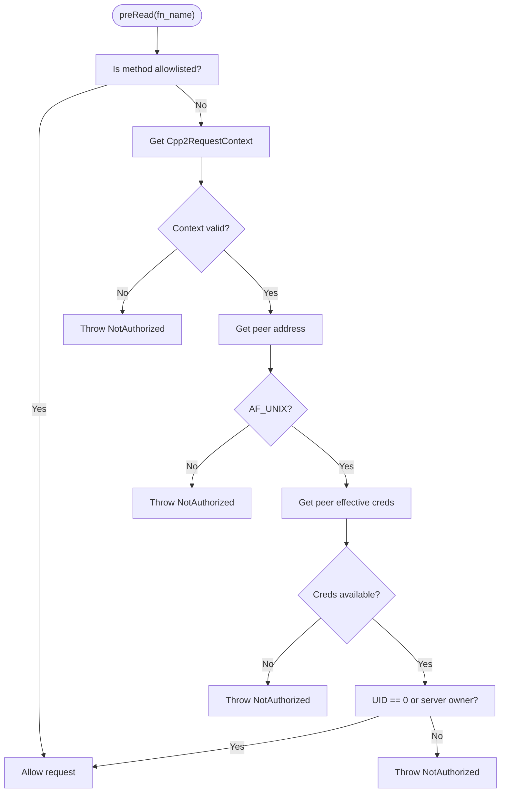
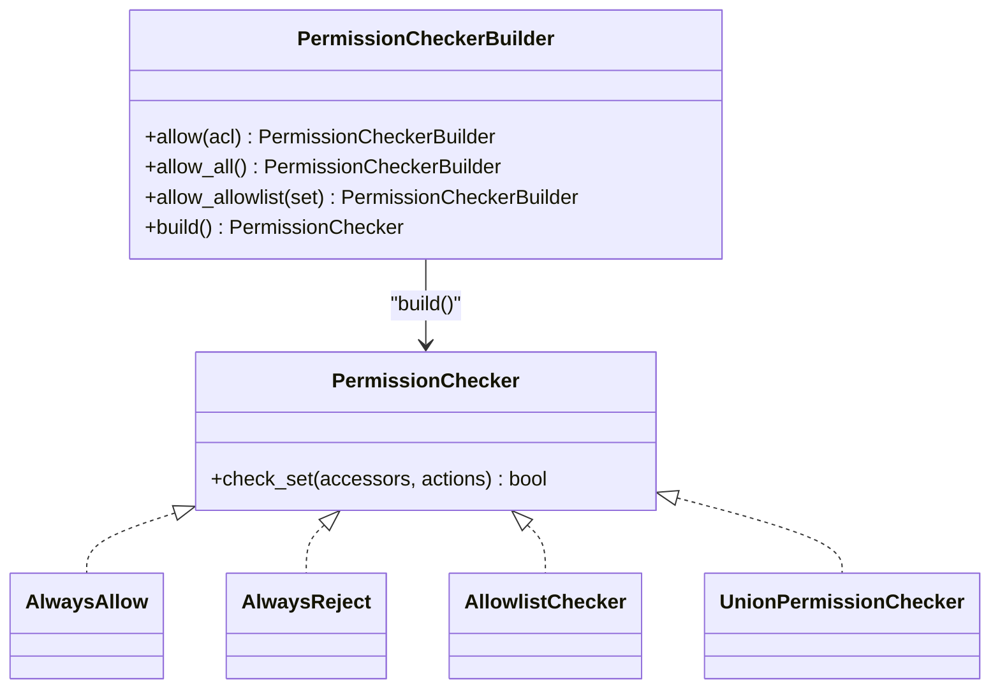
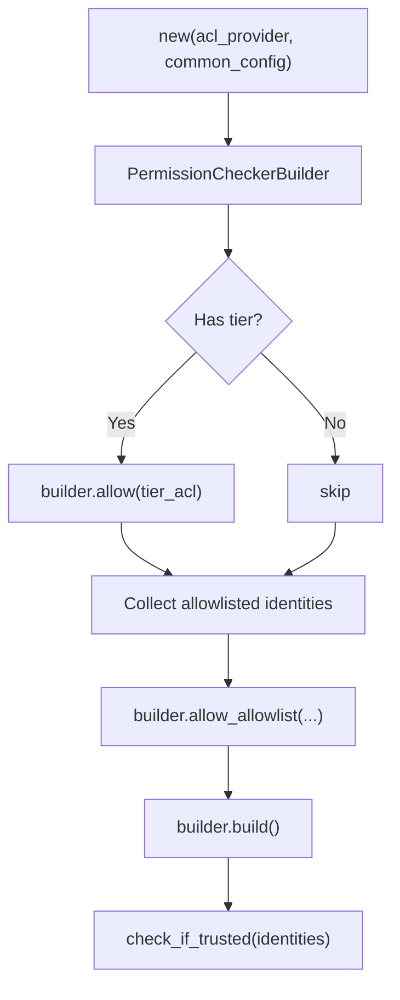
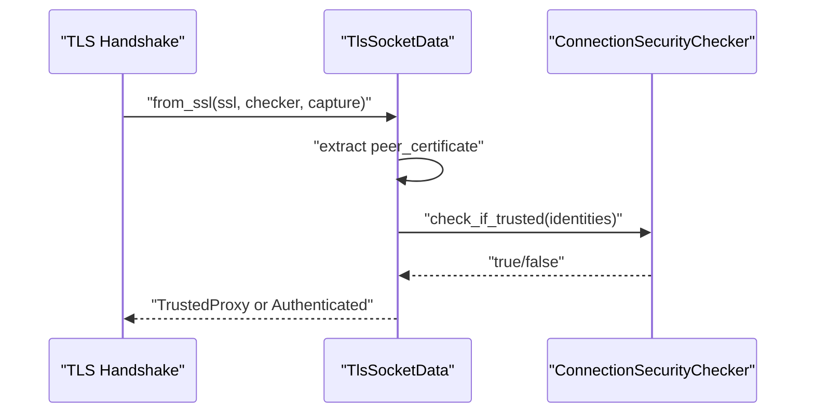
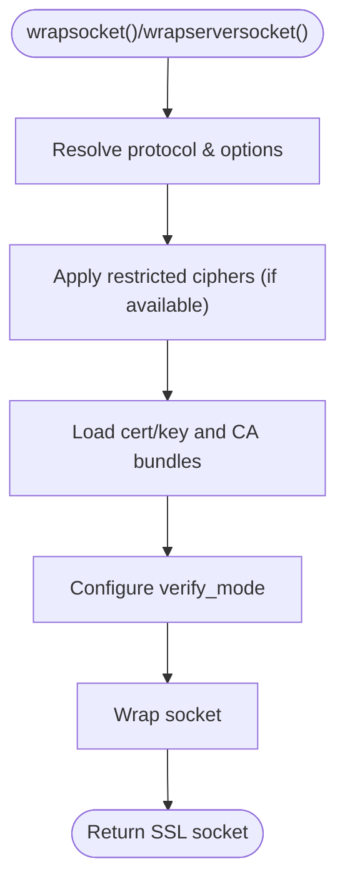
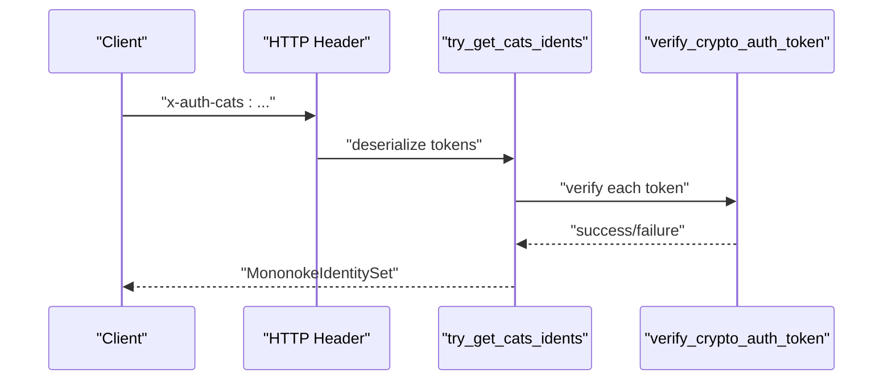
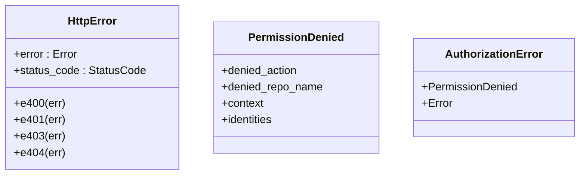
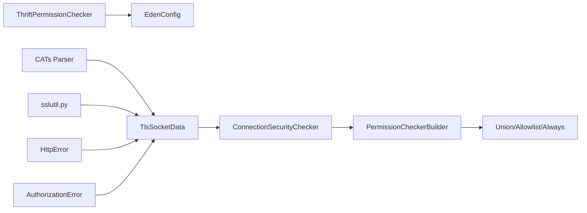

# Authentication and Security

<cite>
**Referenced Files in This Document**
- [ThriftPermissionChecker.cpp](file://eden/fs/service/ThriftPermissionChecker.cpp)
- [EdenConfig.h](file://eden/fs/config/EdenConfig.h)
- [checker.rs](file://eden/mononoke/common/permission_checker/src/checker.rs)
- [connection_security_checker/lib.rs](file://eden/mononoke/common/connection_security_checker/src/lib.rs)
- [socket_data.rs](file://eden/mononoke/common/gotham_ext/src/socket_data.rs)
- [tls_session_data.rs](file://eden/mononoke/common/gotham_ext/src/middleware/tls_session_data.rs)
- [sslutil.py](file://eden/scm/sapling/sslutil.py)
- [error.rs](file://eden/mononoke/common/gotham_ext/src/error.rs)
- [error.rs](file://eden/mononoke/repo_authorization/src/error.rs)
- [lib.rs](file://eden/scm/lib/auth/src/lib.rs)
- [lib.rs](file://eden/mononoke/common/cats/src/lib.rs)
</cite>

## Table of Contents
1. [Introduction](#introduction)
2. [Project Structure](#project-structure)
3. [Core Components](#core-components)
4. [Architecture Overview](#architecture-overview)
5. [Detailed Component Analysis](#detailed-component-analysis)
6. [Dependency Analysis](#dependency-analysis)
7. [Performance Considerations](#performance-considerations)
8. [Troubleshooting Guide](#troubleshooting-guide)
9. [Conclusion](#conclusion)

## Introduction
This document describes the authentication and security mechanisms implemented in the SAPLING SCM Thrift APIs and related services. It covers:
- Authentication protocols and identity extraction
- Token management and cryptographic authentication tokens (CATs)
- Authorization patterns and permission models
- Secure transport options and TLS configuration
- Audit logging and security event tracking
- Role-based and trust-based access control
- Practical guidance for secure client connections and handling authentication failures

## Project Structure
Security-related functionality spans multiple layers:
- Thrift server-side permission enforcement for local IPC
- Mononoke permission checker framework and trust-based identity classification
- TLS session and certificate identity extraction
- Cryptographic authentication tokens (CATs) header parsing and verification
- TLS configuration utilities for clients and servers
- HTTP error formatting and authorization error modeling

**Diagram sources**
- [ThriftPermissionChecker.cpp:1-112](file://eden/fs/service/ThriftPermissionChecker.cpp#L1-L112)
- [EdenConfig.h:345-394](file://eden/fs/config/EdenConfig.h#L345-L394)
- [checker.rs:1-118](file://eden/mononoke/common/permission_checker/src/checker.rs#L1-L118)
- [connection_security_checker/lib.rs:1-61](file://eden/mononoke/common/connection_security_checker/src/lib.rs#L1-L61)
- [socket_data.rs:1-122](file://eden/mononoke/common/gotham_ext/src/socket_data.rs#L1-L122)
- [sslutil.py:1-800](file://eden/scm/sapling/sslutil.py#L1-L800)
- [lib.rs](file://eden/mononoke/common/cats/src/lib.rs)
- [error.rs:1-53](file://eden/mononoke/common/gotham_ext/src/error.rs#L1-L53)
- [error.rs:70-109](file://eden/mononoke/repo_authorization/src/error.rs#L70-L109)

**Section sources**
- [ThriftPermissionChecker.cpp:1-112](file://eden/fs/service/ThriftPermissionChecker.cpp#L1-L112)
- [EdenConfig.h:345-394](file://eden/fs/config/EdenConfig.h#L345-L394)
- [checker.rs:1-118](file://eden/mononoke/common/permission_checker/src/checker.rs#L1-L118)
- [connection_security_checker/lib.rs:1-61](file://eden/mononoke/common/connection_security_checker/src/lib.rs#L1-L61)
- [socket_data.rs:1-122](file://eden/mononoke/common/gotham_ext/src/socket_data.rs#L1-L122)
- [sslutil.py:1-800](file://eden/scm/sapling/sslutil.py#L1-L800)
- [lib.rs](file://eden/mononoke/common/cats/src/lib.rs)
- [error.rs:1-53](file://eden/mononoke/common/gotham_ext/src/error.rs#L1-L53)
- [error.rs:70-109](file://eden/mononoke/repo_authorization/src/error.rs#L70-L109)

## Core Components
- Local Thrift permission enforcement: Validates callers via Unix domain socket peer credentials and an allowlist.
- Permission checker framework: Composable allowlists, union checks, and always-allow/reject policies.
- Connection security checker: Builds trust policy from tiers and allowlisted identities.
- TLS socket data: Extracts identities from client certificates and optionally captures TLS session data.
- TLS utilities: Robust client and server TLS wrapping with protocol selection, cipher restrictions, and certificate verification.
- Crypto Auth Tokens (CATs): Parses and verifies tokens from HTTP headers for cross-service trust.
- HTTP error formatting and authorization errors: Standardized HTTP status codes and structured authorization failure reporting.

**Section sources**
- [ThriftPermissionChecker.cpp:56-109](file://eden/fs/service/ThriftPermissionChecker.cpp#L56-L109)
- [checker.rs:20-117](file://eden/mononoke/common/permission_checker/src/checker.rs#L20-L117)
- [connection_security_checker/lib.rs:32-60](file://eden/mononoke/common/connection_security_checker/src/lib.rs#L32-L60)
- [socket_data.rs:16-122](file://eden/mononoke/common/gotham_ext/src/socket_data.rs#L16-L122)
- [sslutil.py:298-554](file://eden/scm/sapling/sslutil.py#L298-L554)
- [lib.rs](file://eden/mononoke/common/cats/src/lib.rs)
- [error.rs:15-53](file://eden/mononoke/common/gotham_ext/src/error.rs#L15-L53)
- [error.rs:70-109](file://eden/mononoke/repo_authorization/src/error.rs#L70-L109)

## Architecture Overview
The system enforces authentication and authorization across three primary planes:
- Local IPC: Unix socket peer credentials validated against an allowlist.
- Transport layer: TLS client/server negotiation with configurable protocols and ciphers; optional client certificate requirement.
- Identity and trust: Certificate-based identities extracted and classified as “trusted proxy” or “authenticated”; optional CATs header-based identity augmentation.

**Diagram sources**
- [ThriftPermissionChecker.cpp:56-109](file://eden/fs/service/ThriftPermissionChecker.cpp#L56-L109)
- [connection_security_checker/lib.rs:32-60](file://eden/mononoke/common/connection_security_checker/src/lib.rs#L32-L60)
- [socket_data.rs:105-122](file://eden/mononoke/common/gotham_ext/src/socket_data.rs#L105-L122)
- [lib.rs](file://eden/mononoke/common/cats/src/lib.rs)

## Detailed Component Analysis

### Local Thrift Permission Enforcement
- Purpose: Restrict invocation of Thrift methods to trusted local processes via Unix domain sockets.
- Mechanism:
  - Methods are allowed if present in the allowlist.
  - Otherwise, peer credentials are retrieved from the connection context.
  - Only AF_UNIX sockets are supported; non-Unix sockets are rejected.
  - On Unix, the effective UID must be root or the server process owner to pass.
- Configuration:
  - Allowlist is configurable via server configuration.
  - Worker thread count, max requests, queue timeouts, and resource pool toggles are tunable.

**Diagram sources**
- [ThriftPermissionChecker.cpp:56-109](file://eden/fs/service/ThriftPermissionChecker.cpp#L56-L109)
- [EdenConfig.h:352-359](file://eden/fs/config/EdenConfig.h#L352-L359)

**Section sources**
- [ThriftPermissionChecker.cpp:56-109](file://eden/fs/service/ThriftPermissionChecker.cpp#L56-L109)
- [EdenConfig.h:352-359](file://eden/fs/config/EdenConfig.h#L352-L359)

### Permission Checker Framework (Mononoke)
- Purpose: Composable authorization checks across multiple providers.
- Mechanism:
  - Trait defines asynchronous check_set(accessors, actions) returning boolean.
  - Builders support allowlist, union of checkers, always-allow, and always-reject.
  - Union checks short-circuit on first positive result; parallel evaluation reduces latency.
- Usage:
  - Constructed from ACL providers and configuration-driven allowlists.

**Diagram sources**
- [checker.rs:20-117](file://eden/mononoke/common/permission_checker/src/checker.rs#L20-L117)

**Section sources**
- [checker.rs:20-117](file://eden/mononoke/common/permission_checker/src/checker.rs#L20-L117)

### Connection Security Checker (Trusted Parties)
- Purpose: Determine if a caller identity set is trusted to act as a proxy.
- Mechanism:
  - Build a composite checker from tier ACL and allowlisted identities.
  - Evaluate “trusted_parties” action against the composed policy.
- Integration:
  - Used to classify TLS identities as TrustedProxy vs Authenticated.

**Diagram sources**
- [connection_security_checker/lib.rs:32-60](file://eden/mononoke/common/connection_security_checker/src/lib.rs#L32-L60)

**Section sources**
- [connection_security_checker/lib.rs:32-60](file://eden/mononoke/common/connection_security_checker/src/lib.rs#L32-L60)

### TLS Socket Data and Identity Classification
- Purpose: Extract identities from TLS peer certificates and optionally capture TLS session data.
- Mechanism:
  - Derive identities from X.509 peer certificate.
  - Classify as TrustedProxy if trusted by security checker; otherwise Authenticated.
  - Optionally persist TLS session data (client random/master key) to a log file.

**Diagram sources**
- [socket_data.rs:23-40](file://eden/mononoke/common/gotham_ext/src/socket_data.rs#L23-L40)
- [socket_data.rs:105-122](file://eden/mononoke/common/gotham_ext/src/socket_data.rs#L105-L122)
- [connection_security_checker/lib.rs:53-59](file://eden/mononoke/common/connection_security_checker/src/lib.rs#L53-L59)

**Section sources**
- [socket_data.rs:16-122](file://eden/mononoke/common/gotham_ext/src/socket_data.rs#L16-L122)
- [tls_session_data.rs:28-69](file://eden/mononoke/common/gotham_ext/src/middleware/tls_session_data.rs#L28-L69)

### TLS Configuration Utilities (Client and Server)
- Purpose: Provide robust TLS configuration for both client and server sockets.
- Features:
  - Protocol selection with modern defaults and explicit opt-out for legacy environments.
  - Cipher restrictions and compression disabling.
  - Certificate verification with fingerprint overrides and system/default CA bundle detection.
  - Client certificate requirement for servers.
- Guidance:
  - Prefer TLS 1.2+ where supported; disable compression; restrict ciphers.
  - Explicitly configure CA bundles to avoid implicit system trust.

**Diagram sources**
- [sslutil.py:298-554](file://eden/scm/sapling/sslutil.py#L298-L554)
- [sslutil.py:556-627](file://eden/scm/sapling/sslutil.py#L556-L627)

**Section sources**
- [sslutil.py:298-554](file://eden/scm/sapling/sslutil.py#L298-L554)
- [sslutil.py:556-627](file://eden/scm/sapling/sslutil.py#L556-L627)

### Cryptographic Authentication Tokens (CATs)
- Purpose: Transport identities across services using signed tokens.
- Mechanism:
  - Parse “x-auth-cats” header into token list.
  - Deserialize token data and verify signatures against a verifier identity.
  - Accumulate signer identities into a set for downstream authorization decisions.

**Diagram sources**
- [lib.rs](file://eden/mononoke/common/cats/src/lib.rs)

**Section sources**
- [lib.rs](file://eden/mononoke/common/cats/src/lib.rs)

### HTTP Error Formatting and Authorization Errors
- Purpose: Standardize error responses and authorization failure reporting.
- Mechanism:
  - HttpError maps errors to HTTP status codes (e.g., 401/403/404).
  - PermissionDenied encapsulates denied actions, repository context, and identities for auditing.

**Diagram sources**
- [error.rs:15-53](file://eden/mononoke/common/gotham_ext/src/error.rs#L15-L53)
- [error.rs:70-109](file://eden/mononoke/repo_authorization/src/error.rs#L70-L109)

**Section sources**
- [error.rs:15-53](file://eden/mononoke/common/gotham_ext/src/error.rs#L15-L53)
- [error.rs:70-109](file://eden/mononoke/repo_authorization/src/error.rs#L70-L109)

## Dependency Analysis
- ThriftPermissionChecker depends on server configuration for allowlists and on peer credentials from the connection context.
- PermissionCheckerBuilder composes multiple checkers; UnionPermissionChecker evaluates them concurrently.
- ConnectionSecurityChecker composes tier ACL and allowlisted identities into a single policy.
- TlsSocketData relies on OpenSSL peer certificate extraction and the ConnectionSecurityChecker to classify identities.
- CATs parsing integrates with cryptographic verification to produce identity sets.
- TLS utilities are consumed by both client and server code paths to establish secure channels.

**Diagram sources**
- [ThriftPermissionChecker.cpp:56-109](file://eden/fs/service/ThriftPermissionChecker.cpp#L56-L109)
- [checker.rs:29-62](file://eden/mononoke/common/permission_checker/src/checker.rs#L29-L62)
- [connection_security_checker/lib.rs:32-60](file://eden/mononoke/common/connection_security_checker/src/lib.rs#L32-L60)
- [socket_data.rs:23-40](file://eden/mononoke/common/gotham_ext/src/socket_data.rs#L23-L40)
- [lib.rs](file://eden/mononoke/common/cats/src/lib.rs)
- [sslutil.py:298-554](file://eden/scm/sapling/sslutil.py#L298-L554)
- [error.rs:15-53](file://eden/mononoke/common/gotham_ext/src/error.rs#L15-L53)
- [error.rs:70-109](file://eden/mononoke/repo_authorization/src/error.rs#L70-L109)

**Section sources**
- [ThriftPermissionChecker.cpp:56-109](file://eden/fs/service/ThriftPermissionChecker.cpp#L56-L109)
- [checker.rs:29-62](file://eden/mononoke/common/permission_checker/src/checker.rs#L29-L62)
- [connection_security_checker/lib.rs:32-60](file://eden/mononoke/common/connection_security_checker/src/lib.rs#L32-L60)
- [socket_data.rs:23-40](file://eden/mononoke/common/gotham_ext/src/socket_data.rs#L23-L40)
- [lib.rs](file://eden/mononoke/common/cats/src/lib.rs)
- [sslutil.py:298-554](file://eden/scm/sapling/sslutil.py#L298-L554)
- [error.rs:15-53](file://eden/mononoke/common/gotham_ext/src/error.rs#L15-L53)
- [error.rs:70-109](file://eden/mononoke/repo_authorization/src/error.rs#L70-L109)

## Performance Considerations
- ThriftPermissionChecker performs a small allowlist scan and lightweight peer credential retrieval; overhead is minimal.
- PermissionCheckerBuilder’s UnionPermissionChecker evaluates checkers concurrently using unordered futures, reducing latency for multi-provider policies.
- TLS configuration avoids unnecessary CA loads and applies restricted ciphers only when supported by the runtime.
- Logging TLS session data is optional and guarded by a flag to minimize I/O overhead.

[No sources needed since this section provides general guidance]

## Troubleshooting Guide
- Authentication failures over Unix sockets:
  - Ensure the invoking process UID is root or matches the server owner.
  - Verify the method is included in the allowlist.
- TLS handshake errors:
  - Confirm protocol selection and cipher compatibility.
  - Ensure CA bundles are correctly configured and accessible.
  - Validate server certificate SAN/commonName and hostname matching.
- CATs header issues:
  - Confirm “x-auth-cats” header is present and deserializable.
  - Verify token signatures against the expected verifier identity.
- HTTP 401/403 responses:
  - Inspect PermissionDenied context for repository and identities involved.
  - Review ConnectionSecurityChecker trust policy and allowlisted identities.

**Section sources**
- [ThriftPermissionChecker.cpp:77-108](file://eden/fs/service/ThriftPermissionChecker.cpp#L77-L108)
- [sslutil.py:431-538](file://eden/scm/sapling/sslutil.py#L431-L538)
- [lib.rs](file://eden/mononoke/common/cats/src/lib.rs)
- [error.rs:29-53](file://eden/mononoke/common/gotham_ext/src/error.rs#L29-L53)
- [error.rs:70-109](file://eden/mononoke/repo_authorization/src/error.rs#L70-L109)

## Conclusion
SAPLING SCM employs layered security:
- Local Unix socket enforcement with allowlists and peer UID validation
- Composable permission checks and trust classification via certificate identities
- Robust TLS configuration for secure client and server communication
- CATs-based identity propagation across services
- Structured error handling and authorization modeling for auditability

These mechanisms collectively provide strong defaults while allowing operators to tailor trust, identity, and transport security to their environment.