# Data Types and Structures

<cite>
**Referenced Files in This Document**
- [eden.thrift](file://eden/fs/service/eden.thrift)
- [thrift.thrift](file://thrift/annotation/thrift.thrift)
- [cpp.thrift](file://thrift/annotation/cpp.thrift)
- [rust.thrift](file://thrift/annotation/rust.thrift)
- [attributes.rs](file://eden/fs/cli_rs/edenfs-client/src/attributes.rs)
- [readdir_test.py](file://eden/integration/readdir_test.py)
- [compact_protocol.rs](file://thrift/lib/rust/src/compact_protocol.rs)
- [type_name_type.rs](file://thrift/lib/rust/src/type_name_type.rs)
</cite>

## Table of Contents
1. [Introduction](#introduction)
2. [Project Structure](#project-structure)
3. [Core Components](#core-components)
4. [Architecture Overview](#architecture-overview)
5. [Detailed Component Analysis](#detailed-component-analysis)
6. [Dependency Analysis](#dependency-analysis)
7. [Performance Considerations](#performance-considerations)
8. [Troubleshooting Guide](#troubleshooting-guide)
9. [Conclusion](#conclusion)

## Introduction
This document describes the Thrift data types and structures used across SAPLING SCM APIs, focusing on fundamental types (BinaryHash, PathString, MountId), specialized unions (FileAttributeDataV2, JournalPosition, ScmStatus), and supporting enums and exceptions. It also covers error handling patterns, type conversion rules, serialization formats, cross-language compatibility, Thrift annotations, code generation patterns, and interface evolution strategies. Examples demonstrate usage in service methods, parameter validation, and response processing across languages.

## Project Structure
The SAPLING SCM repository organizes Thrift definitions and annotations under dedicated modules:
- Core service definitions and types are defined in the Eden service Thrift file.
- Thrift annotations for cross-language code generation and compatibility are defined in separate annotation modules.
- Client-side conversions and tests illustrate usage and error handling patterns.

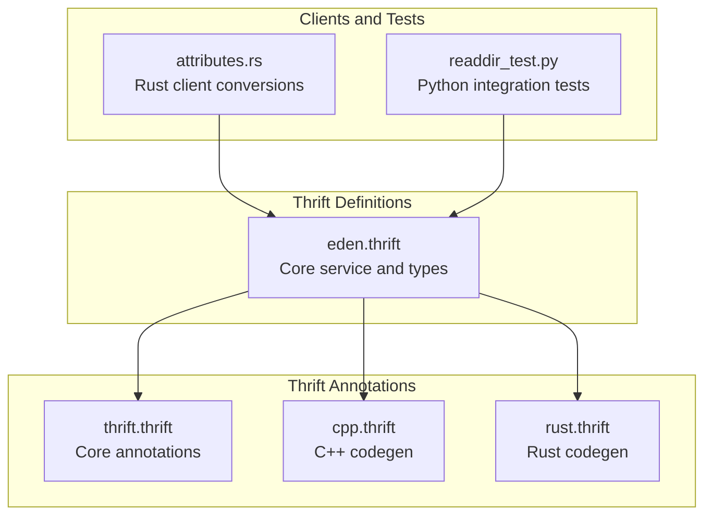

**Diagram sources**
- [eden.thrift](file://eden/fs/service/eden.thrift)
- [thrift.thrift](file://thrift/annotation/thrift.thrift)
- [cpp.thrift](file://thrift/annotation/cpp.thrift)
- [rust.thrift](file://thrift/annotation/rust.thrift)
- [attributes.rs](file://eden/fs/cli_rs/edenfs-client/src/attributes.rs)
- [readdir_test.py](file://eden/integration/readdir_test.py)

**Section sources**
- [eden.thrift](file://eden/fs/service/eden.thrift)
- [thrift.thrift](file://thrift/annotation/thrift.thrift)
- [cpp.thrift](file://thrift/annotation/cpp.thrift)
- [rust.thrift](file://thrift/annotation/rust.thrift)
- [attributes.rs](file://eden/fs/cli_rs/edenfs-client/src/attributes.rs)
- [readdir_test.py](file://eden/integration/readdir_test.py)

## Core Components
This section summarizes the primary data types and structures used in SAPLING SCM APIs.

- Fundamental scalar-like types
  - BinaryHash: A 20-byte binary hash for source control objects; server accepts 40-character hex strings for input and returns binary hashes.
  - PathString: Arbitrary binary path data with platform encoding considerations.
  - MountId: Identifies a mounted repository by its mount point path.
  - unsigned64: 64-bit integer with platform-specific serialization semantics indicated by annotations.
  - ThriftRootId and ThriftObjectId: Backing-store-specific identifiers for roots and objects.

- Specialized unions for attribute retrieval
  - FileAttributeDataV2: Aggregates optional attributes (SHA-1, size, SCM type, object ID, BLAKE3, digest size/hash, mtime, mode).
  - FileAttributeDataOrErrorV2: Wraps FileAttributeDataV2 or an EdenError for a single file.
  - DirListAttributeDataOrError: Maps directory entry names to FileAttributeDataOrErrorV2 or an EdenError for batch operations.
  - Per-attribute unions: Sha1OrError, SizeOrError, SourceControlTypeOrError, ObjectIdOrError, Blake3OrError, DigestSizeOrError, DigestHashOrError, MtimeOrError, ModeOrError.

- Position and status structures
  - JournalPosition: References a point in time within a mount’s journal using mountGeneration, sequenceNumber, and snapshotHash.
  - ScmStatus: Maps paths to ScmFileStatus and collects per-path error messages.

- Enums and exceptions
  - EdenErrorType: Classifies error types (POSIX, Win32, HRESULT, ARGUMENT_ERROR, GENERIC_ERROR, MOUNT_GENERATION_CHANGED, JOURNAL_TRUNCATED, CHECKOUT_IN_PROGRESS, OUT_OF_DATE_PARENT, ATTRIBUTE_UNAVAILABLE, CANCELLATION_ERROR, NETWORK_ERROR).
  - EdenError: Exception carrying message, optional errorCode, and errorType.
  - ScmFileStatus: File change classification (ADDED, MODIFIED, REMOVED, IGNORED).
  - SourceControlType: File type classification (TREE, REGULAR_FILE, EXECUTABLE_FILE, SYMLINK, UNKNOWN).
  - Dtype: System-independent directory entry type enumeration.

- Supporting types
  - TimeSpec: Represents a timestamp with seconds and nanoseconds.
  - DataFetchOrigin and DataFetchOriginSet: Bitmask for controlling data source selection in debug operations.
  - RequestedAttributes and AttributesRequestScope: Controls which attributes to compute and whether to include files, trees, or both.

**Section sources**
- [eden.thrift](file://eden/fs/service/eden.thrift)

## Architecture Overview
The SAPLING SCM APIs use Thrift to define service contracts and data exchange formats. The architecture separates:
- Service definitions and types in a central Thrift file.
- Cross-language annotations for code generation and compatibility.
- Client-side adapters and tests validating behavior and error propagation.

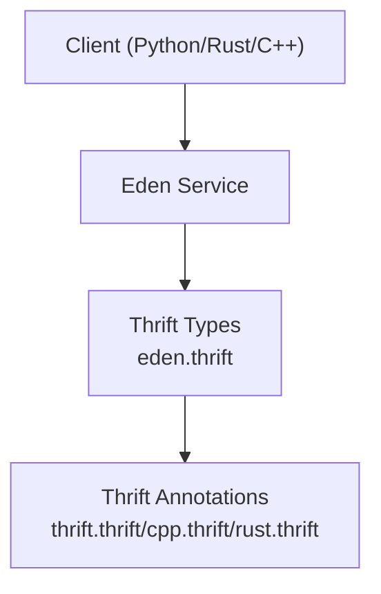

**Diagram sources**
- [eden.thrift](file://eden/fs/service/eden.thrift)
- [thrift.thrift](file://thrift/annotation/thrift.thrift)
- [cpp.thrift](file://thrift/annotation/cpp.thrift)
- [rust.thrift](file://thrift/annotation/rust.thrift)

## Detailed Component Analysis

### Fundamental Types and Conversions
- BinaryHash
  - Definition: binary type representing a 20-byte source control hash.
  - Input flexibility: Server accepts 40-character hex strings for input; returns 20-byte binary.
  - Usage: Used in attribute unions and SCM metadata structures.
- PathString
  - Definition: binary path data; clients must interpret platform-specific encodings.
  - Usage: Mount point identifiers, directory paths, and file names.
- MountId
  - Definition: struct wrapping PathString to identify a mount.
  - Usage: First parameter in many service methods requiring a mount context.
- unsigned64
  - Definition: typedef for i64 with platform-specific serialization semantics.
  - Usage: Sequence numbers and counters requiring 64-bit precision.

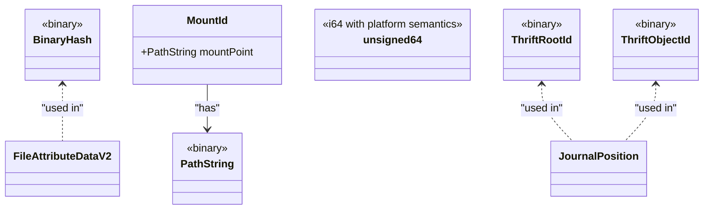

**Diagram sources**
- [eden.thrift](file://eden/fs/service/eden.thrift)

**Section sources**
- [eden.thrift](file://eden/fs/service/eden.thrift)

### Specialized Unions: FileAttributeDataV2
FileAttributeDataV2 aggregates optional attributes for a single file. Each attribute is optional and may resolve to either a value or an error via dedicated unions.

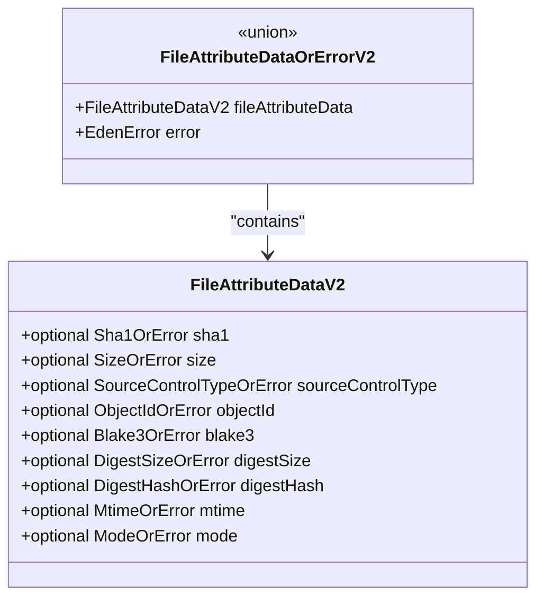

**Diagram sources**
- [eden.thrift](file://eden/fs/service/eden.thrift)

**Section sources**
- [eden.thrift](file://eden/fs/service/eden.thrift)

### Position Reference: JournalPosition
JournalPosition identifies a point in time within a mount’s journal using an opaque mountGeneration, a monotonically increasing sequenceNumber, and a snapshotHash.

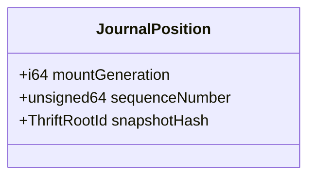

**Diagram sources**
- [eden.thrift](file://eden/fs/service/eden.thrift)

**Section sources**
- [eden.thrift](file://eden/fs/service/eden.thrift)

### Status Representation: ScmStatus
ScmStatus maps paths to ScmFileStatus and collects per-path error messages.

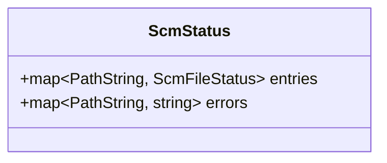

**Diagram sources**
- [eden.thrift](file://eden/fs/service/eden.thrift)

**Section sources**
- [eden.thrift](file://eden/fs/service/eden.thrift)

### Error Handling and Exceptions
EdenError carries a message, optional errorCode, and an errorType drawn from EdenErrorType. Many unions embed EdenError to signal per-attribute failures.

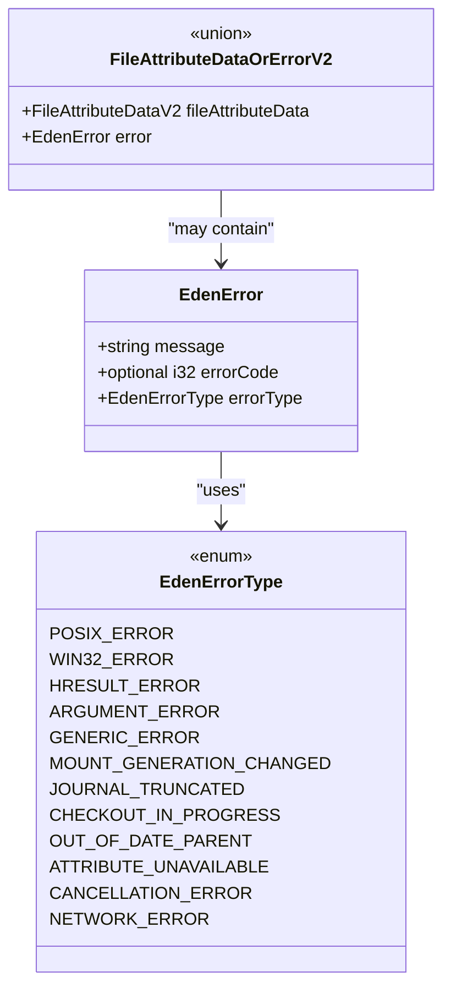

**Diagram sources**
- [eden.thrift](file://eden/fs/service/eden.thrift)

**Section sources**
- [eden.thrift](file://eden/fs/service/eden.thrift)

### Enumerations and Flags
- ScmFileStatus: Classifies file changes.
- SourceControlType: Classifies file types.
- Dtype: System-independent directory entry types.
- DataFetchOrigin and DataFetchOriginSet: Bitmask flags controlling data source selection in debug operations.

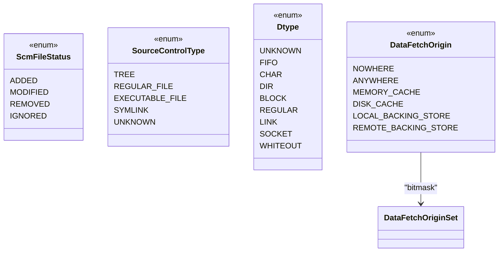

**Diagram sources**
- [eden.thrift](file://eden/fs/service/eden.thrift)

**Section sources**
- [eden.thrift](file://eden/fs/service/eden.thrift)

### Type Conversion Rules and Cross-Language Compatibility
- BinaryHash
  - Input: Accepts 40-character hex strings; output is 20-byte binary.
  - Serialization: binary type; compact protocol maps binary to string for some languages.
- PathString
  - Interpreted as arbitrary binary; clients must decode according to platform encoding.
- unsigned64
  - Serialized as i64; platform-specific semantics noted by annotations.
- Unions
  - Generated unions carry either a value or an error; clients must branch on the union discriminant.
- Enums
  - Generated with explicit wire values; enum compatibility relies on stable numeric assignments.

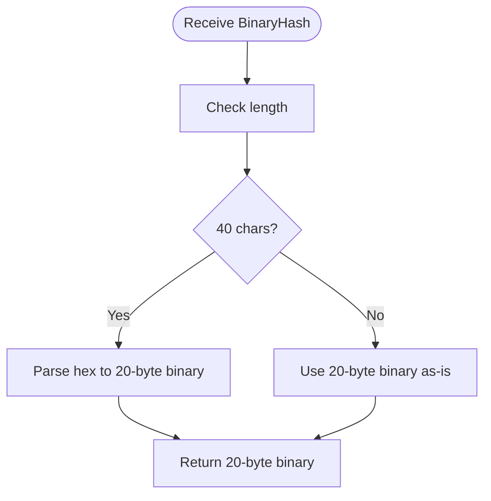

**Diagram sources**
- [eden.thrift](file://eden/fs/service/eden.thrift)

**Section sources**
- [eden.thrift](file://eden/fs/service/eden.thrift)

### Serialization Formats and Protocol Behavior
- Compact protocol mapping
  - Binary fields map to string in compact protocol; Rust codegen reflects this mapping.
- Union serialization
  - Unions serialize the discriminant followed by the selected field; clients must handle UnknownField cases.
- Struct serialization
  - Fields serialized in declaration order unless annotated otherwise; field ordering can be optimized via annotations.

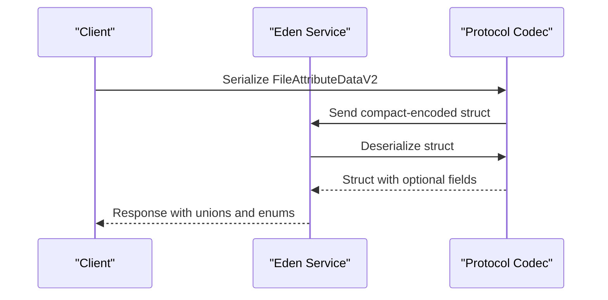

**Diagram sources**
- [compact_protocol.rs](file://thrift/lib/rust/src/compact_protocol.rs)
- [type_name_type.rs](file://thrift/lib/rust/src/type_name_type.rs)
- [eden.thrift](file://eden/fs/service/eden.thrift)

**Section sources**
- [compact_protocol.rs](file://thrift/lib/rust/src/compact_protocol.rs)
- [type_name_type.rs](file://thrift/lib/rust/src/type_name_type.rs)
- [eden.thrift](file://eden/fs/service/eden.thrift)

### Thrift Annotations and Code Generation Patterns
- Core annotations (thrift.thrift)
  - ExceptionMessage: Marks the exception message field.
  - TerseWrite: Enables skipping default values for fields.
  - BitmaskEnum: Generates bitmask operators for enums.
  - AllowLegacyMissingUris: Temporarily permits missing URIs.
- C++ annotations (cpp.thrift)
  - Type: Overrides native C++ type for fields/typedefs.
  - Ref: Allocates fields on the heap.
  - MinimizePadding: Reorders fields to reduce padding.
  - EnumType: Sets underlying enum type.
- Rust annotations (rust.thrift)
  - Type: Overrides generated Rust type for containers and primitives.
  - NewType: Creates a newtype wrapper around typedefs.
  - Adapter: Applies a ThriftTypeAdapter for custom serialization.
  - Serde: Enables/disables serde generation.

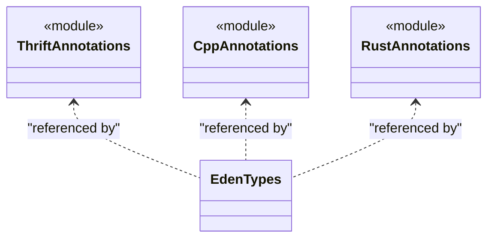

**Diagram sources**
- [thrift.thrift](file://thrift/annotation/thrift.thrift)
- [cpp.thrift](file://thrift/annotation/cpp.thrift)
- [rust.thrift](file://thrift/annotation/rust.thrift)
- [eden.thrift](file://eden/fs/service/eden.thrift)

**Section sources**
- [thrift.thrift](file://thrift/annotation/thrift.thrift)
- [cpp.thrift](file://thrift/annotation/cpp.thrift)
- [rust.thrift](file://thrift/annotation/rust.thrift)
- [eden.thrift](file://eden/fs/service/eden.thrift)

### Interface Evolution Strategies
- Wrapper structs for arguments and responses improve evolvability.
- Using enums with stable numeric assignments and bitmask enums supports additive changes.
- Optional fields and unions enable backward-compatible additions.
- Annotations like AllowLegacyMissingUris and ReserveIds provide controlled evolution paths.

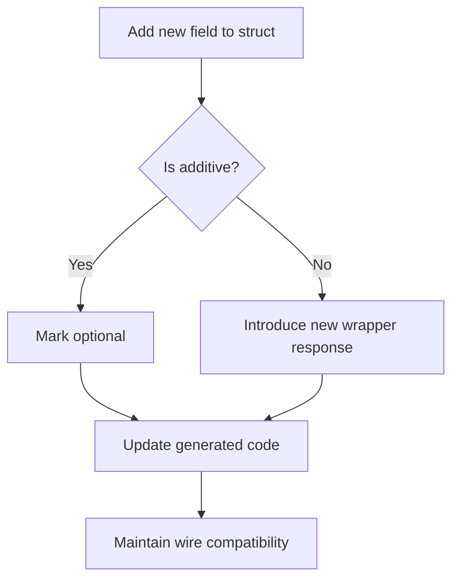

**Diagram sources**
- [eden.thrift](file://eden/fs/service/eden.thrift)
- [thrift.thrift](file://thrift/annotation/thrift.thrift)

**Section sources**
- [eden.thrift](file://eden/fs/service/eden.thrift)
- [thrift.thrift](file://thrift/annotation/thrift.thrift)

### Examples of Type Usage in Service Methods
- Parameter validation
  - AttributesRequestScope controls whether to include files, trees, or both.
  - RequestedAttributes is a bitmask of FileAttributes; clients OR flags together.
- Response processing
  - FileAttributeDataOrErrorV2 wraps either data or an EdenError; clients must branch accordingly.
  - ScmStatus returns a map of paths to statuses and a map of paths to error messages.

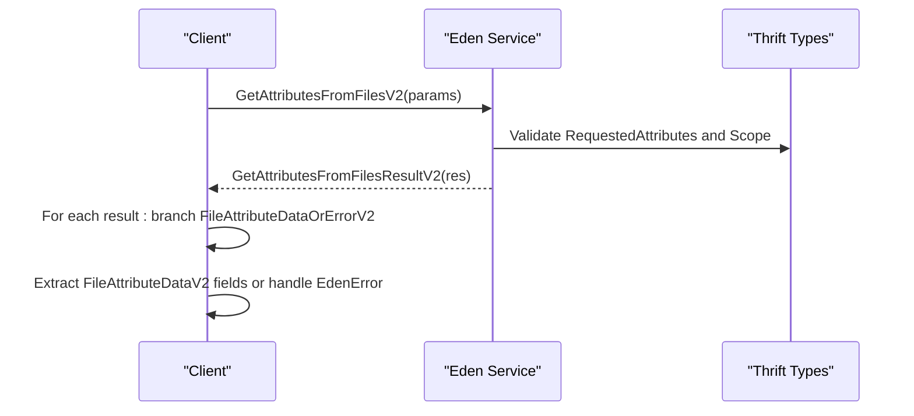

**Diagram sources**
- [eden.thrift](file://eden/fs/service/eden.thrift)

**Section sources**
- [eden.thrift](file://eden/fs/service/eden.thrift)
- [readdir_test.py](file://eden/integration/readdir_test.py)
- [attributes.rs](file://eden/fs/cli_rs/edenfs-client/src/attributes.rs)

## Dependency Analysis
The Eden service types depend on core Thrift annotations for cross-language compatibility and code generation. Client-side conversions translate generated unions into idiomatic language types.

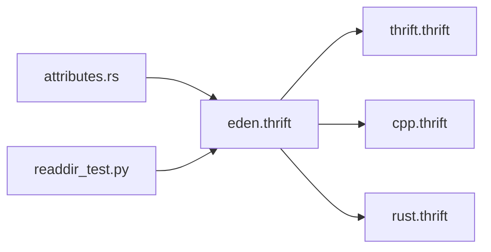

**Diagram sources**
- [eden.thrift](file://eden/fs/service/eden.thrift)
- [thrift.thrift](file://thrift/annotation/thrift.thrift)
- [cpp.thrift](file://thrift/annotation/cpp.thrift)
- [rust.thrift](file://thrift/annotation/rust.thrift)
- [attributes.rs](file://eden/fs/cli_rs/edenfs-client/src/attributes.rs)
- [readdir_test.py](file://eden/integration/readdir_test.py)

**Section sources**
- [eden.thrift](file://eden/fs/service/eden.thrift)
- [thrift.thrift](file://thrift/annotation/thrift.thrift)
- [cpp.thrift](file://thrift/annotation/cpp.thrift)
- [rust.thrift](file://thrift/annotation/rust.thrift)
- [attributes.rs](file://eden/fs/cli_rs/edenfs-client/src/attributes.rs)
- [readdir_test.py](file://eden/integration/readdir_test.py)

## Performance Considerations
- Use unions to avoid serializing absent values; optional fields reduce payload size when unset.
- Prefer compact protocol for efficient transport; ensure binary fields are handled efficiently.
- Minimize padding via annotations for hot structs; reorder fields to align larger types first.
- Use terse serialization for default-value skipping where appropriate.

## Troubleshooting Guide
- BinaryHash input validation
  - Ensure 20-byte binary output; accept 40-character hex input for compatibility.
- PathString decoding
  - Interpret paths according to platform encoding; avoid assuming UTF-8.
- Attribute availability
  - Some attributes are unavailable for non-source-control file types; expect ATTRIBUTE_UNAVAILABLE errors.
- Error propagation
  - Branch on FileAttributeDataOrErrorV2 and per-attribute unions to handle EdenError cases.
- Client conversions
  - Rust client converts unions to enums; verify UnknownField handling.

**Section sources**
- [eden.thrift](file://eden/fs/service/eden.thrift)
- [readdir_test.py](file://eden/integration/readdir_test.py)
- [attributes.rs](file://eden/fs/cli_rs/edenfs-client/src/attributes.rs)

## Conclusion
SAPLING SCM APIs define a robust set of Thrift types centered on BinaryHash, PathString, MountId, and specialized unions for file attributes. Enums and exceptions provide precise error signaling, while annotations enable cross-language compatibility and controlled evolution. Clients should validate inputs, branch on unions, and handle errors consistently across languages.