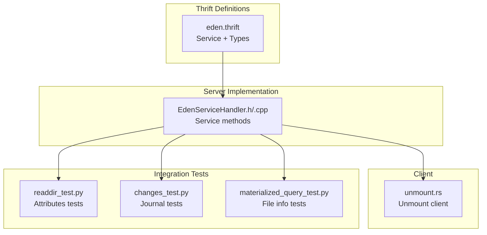
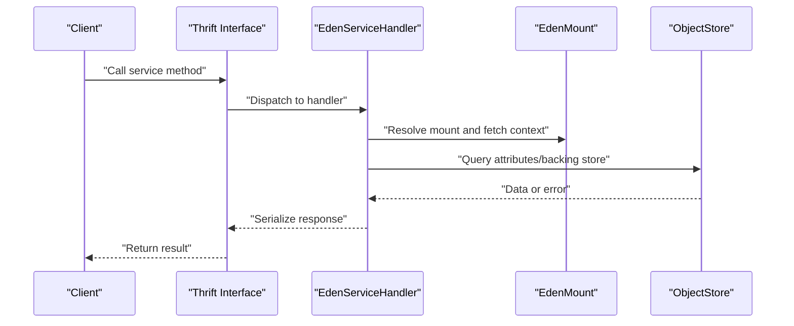
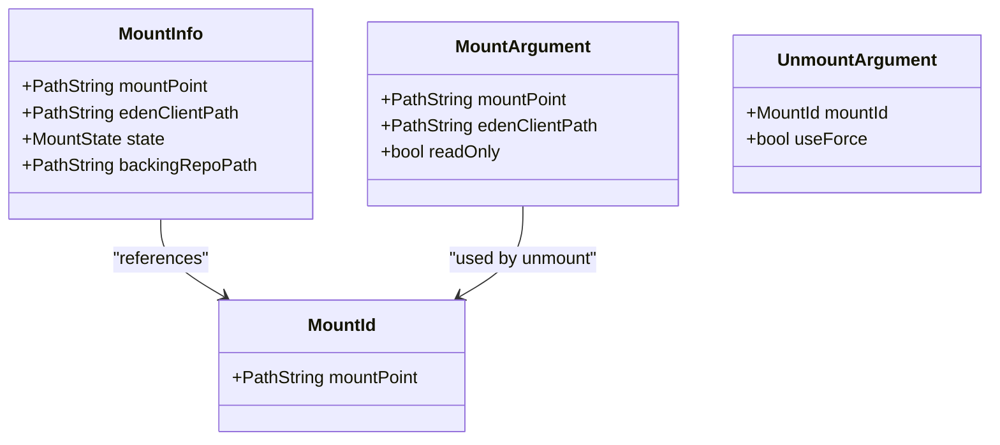
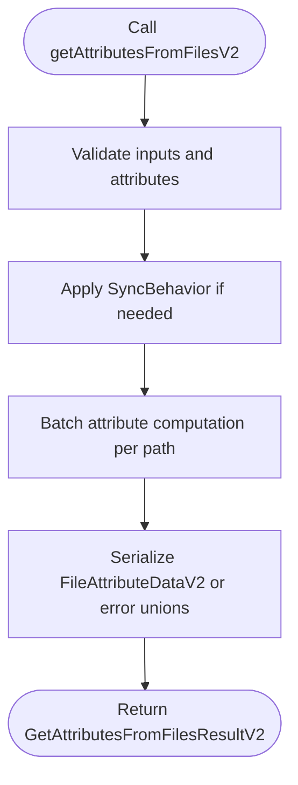
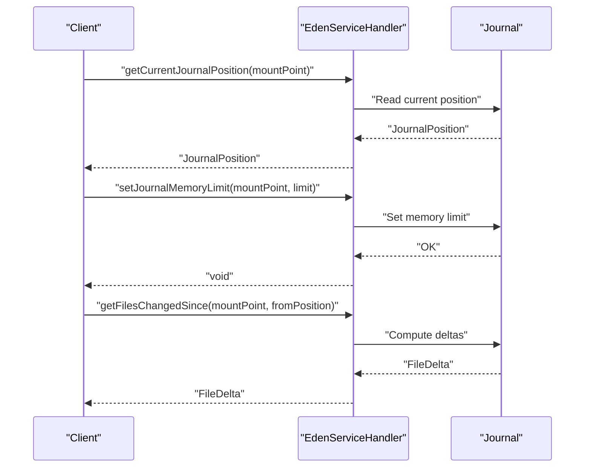
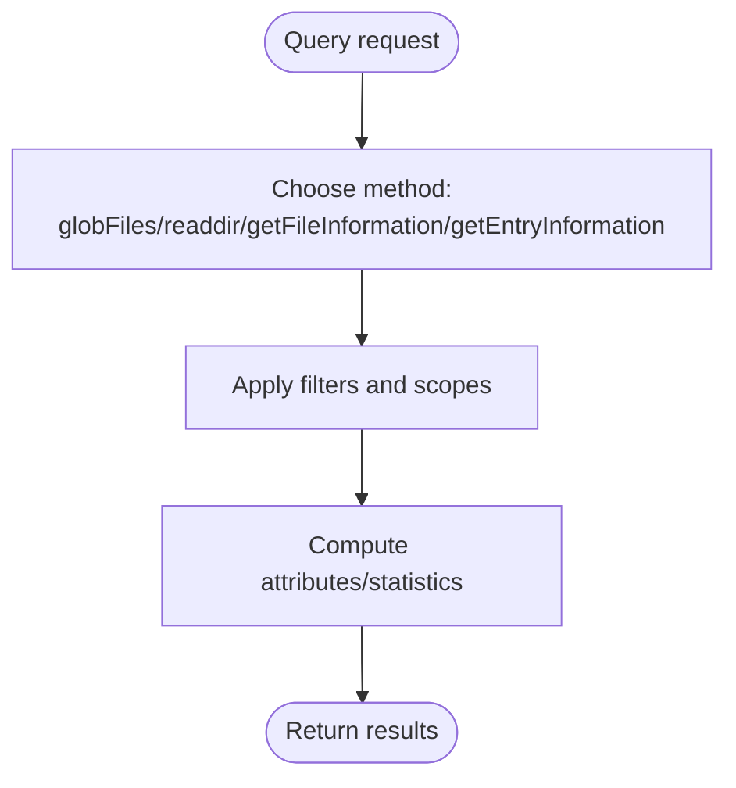
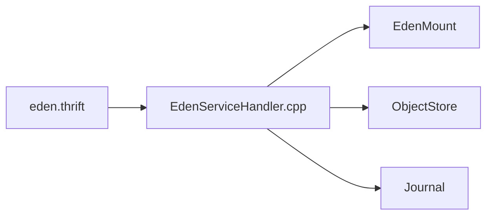

# Eden Service

<cite>
**Referenced Files in This Document**
- [eden.thrift](file://eden/fs/service/eden.thrift)
- [EdenServiceHandler.h](file://eden/fs/service/EdenServiceHandler.h)
- [EdenServiceHandler.cpp](file://eden/fs/service/EdenServiceHandler.cpp)
- [MountInfoTable.cpp](file://eden/fs/privhelper/MountInfoTable.cpp)
- [Statmount.h](file://eden/fs/utils/Statmount.h)
- [Mountd.cpp](file://eden/fs/nfs/Mountd.cpp)
- [unmount.rs](file://eden/fs/cli_rs/edenfs-client/src/unmount.rs)
- [readdir_test.py](file://eden/integration/readdir_test.py)
- [changes_test.py](file://eden/integration/changes_test.py)
- [materialized_query_test.py](file://eden/integration/materialized_query_test.py)
</cite>

## Table of Contents
1. [Introduction](#introduction)
2. [Project Structure](#project-structure)
3. [Core Components](#core-components)
4. [Architecture Overview](#architecture-overview)
5. [Detailed Component Analysis](#detailed-component-analysis)
6. [Dependency Analysis](#dependency-analysis)
7. [Performance Considerations](#performance-considerations)
8. [Troubleshooting Guide](#troubleshooting-guide)
9. [Conclusion](#conclusion)

## Introduction
This document describes the Eden Service Thrift API, focusing on mount/unmount operations, file attribute retrieval, journal operations, and filesystem querying capabilities. It explains the MountId, MountInfo, and MountArgument structures used for mount management, documents the getAttributesFromFilesV2 API and FileAttributes enum, and details attribute unions such as Sha1OrError, Blake3OrError, and SizeOrError. It also covers journal operations, sync behavior, error handling, client-server communication patterns, parameter validation, response processing, and performance considerations for batch operations and streaming responses.

## Project Structure
The Eden Service is defined in a Thrift interface and implemented by a C++ handler. Supporting components include:
- Thrift definitions for service methods, data structures, and unions
- Handler implementation for service methods
- Client-side compatibility for unmount operations
- Integration tests validating behavior

**Diagram sources**
- [eden.thrift:2271-3143](file://eden/fs/service/eden.thrift#L2271-L3143)
- [EdenServiceHandler.h:263-298](file://eden/fs/service/EdenServiceHandler.h#L263-L298)
- [EdenServiceHandler.cpp:3200-3399](file://eden/fs/service/EdenServiceHandler.cpp#L3200-L3399)
- [unmount.rs:1-90](file://eden/fs/cli_rs/edenfs-client/src/unmount.rs#L1-L90)
- [readdir_test.py:403-808](file://eden/integration/readdir_test.py#L403-L808)
- [changes_test.py:730-761](file://eden/integration/changes_test.py#L730-L761)
- [materialized_query_test.py:42-77](file://eden/integration/materialized_query_test.py#L42-L77)

**Section sources**
- [eden.thrift:2271-3143](file://eden/fs/service/eden.thrift#L2271-L3143)
- [EdenServiceHandler.h:263-298](file://eden/fs/service/EdenServiceHandler.h#L263-L298)
- [EdenServiceHandler.cpp:3200-3399](file://eden/fs/service/EdenServiceHandler.cpp#L3200-L3399)
- [unmount.rs:1-90](file://eden/fs/cli_rs/edenfs-client/src/unmount.rs#L1-L90)
- [readdir_test.py:403-808](file://eden/integration/readdir_test.py#L403-L808)
- [changes_test.py:730-761](file://eden/integration/changes_test.py#L730-L761)
- [materialized_query_test.py:42-77](file://eden/integration/materialized_query_test.py#L42-L77)

## Core Components
- Service definition: The service is declared in the Thrift file with methods for mount/unmount, attributes retrieval, globbing/prefetching, SCM status, journal operations, and administrative/debugging APIs.
- Mount structures: MountId, MountInfo, MountArgument, and UnmountArgument define mount identification and lifecycle parameters.
- File attribute API: getAttributesFromFilesV2 supports batching and filtering attributes via FileAttributes bitmask and AttributesRequestScope.
- Journal API: getCurrentJournalPosition, peekCurrentJournalPosition, getFilesChangedSince, set/get/flush journal memory limit, and debugGetRawJournal.
- Streaming and tracing: Streamed journal change notifications and tracing APIs for Thrift, Hg, inode, and request events.

**Section sources**
- [eden.thrift:176-294](file://eden/fs/service/eden.thrift#L176-L294)
- [eden.thrift:353-419](file://eden/fs/service/eden.thrift#L353-L419)
- [eden.thrift:626-641](file://eden/fs/service/eden.thrift#L626-L641)
- [eden.thrift:2452-2504](file://eden/fs/service/eden.thrift#L2452-L2504)
- [EdenServiceHandler.h:280-298](file://eden/fs/service/EdenServiceHandler.h#L280-L298)

## Architecture Overview
The Eden Service exposes a Thrift interface consumed by clients. The server implementation resolves mount handles, coordinates with the EdenMount, and interacts with the backing store and journal. Client compatibility includes fallbacks for legacy unmount endpoints.

**Diagram sources**
- [eden.thrift:2271-3143](file://eden/fs/service/eden.thrift#L2271-L3143)
- [EdenServiceHandler.cpp:3302-3368](file://eden/fs/service/EdenServiceHandler.cpp#L3302-L3368)

## Detailed Component Analysis

### Mount and Unmount Operations
- MountId identifies a mount by mountPoint.
- MountArgument provides mountPoint, edenClientPath, and readOnly flags.
- UnmountArgument includes MountId and useForce flag.
- Legacy unmount fallback is handled by client code, which tries unmountV2 and falls back to unmount if the method is unknown.

**Diagram sources**
- [eden.thrift:176-294](file://eden/fs/service/eden.thrift#L176-L294)

**Section sources**
- [eden.thrift:176-294](file://eden/fs/service/eden.thrift#L176-L294)
- [unmount.rs:42-90](file://eden/fs/cli_rs/edenfs-client/src/unmount.rs#L42-L90)

### File Attribute Retrieval API
- getAttributesFromFilesV2 accepts a list of paths, requested attributes bitmask, SyncBehavior, and optional AttributesRequestScope.
- FileAttributes enum supports SHA1_HASH, FILE_SIZE, SOURCE_CONTROL_TYPE, OBJECT_ID, BLAKE3_HASH, DIGEST_SIZE, DIGEST_HASH, MTIME, MODE.
- Response uses FileAttributeDataV2 with optional fields for each requested attribute; errors are returned via union types (e.g., Sha1OrError, Blake3OrError, SizeOrError).

**Diagram sources**
- [eden.thrift:353-419](file://eden/fs/service/eden.thrift#L353-L419)
- [eden.thrift:559-581](file://eden/fs/service/eden.thrift#L559-L581)
- [EdenServiceHandler.cpp:3446-3505](file://eden/fs/service/EdenServiceHandler.cpp#L3446-L3505)

**Section sources**
- [eden.thrift:626-641](file://eden/fs/service/eden.thrift#L626-L641)
- [eden.thrift:353-419](file://eden/fs/service/eden.thrift#L353-L419)
- [eden.thrift:441-471](file://eden/fs/service/eden.thrift#L441-L471)
- [EdenServiceHandler.cpp:3446-3505](file://eden/fs/service/EdenServiceHandler.cpp#L3446-L3505)
- [readdir_test.py:412-808](file://eden/integration/readdir_test.py#L412-L808)

### Journal Operations and Sync Behavior
- getCurrentJournalPosition and peekCurrentJournalPosition return JournalPosition with mountGeneration, sequenceNumber, and snapshotHash.
- getFilesChangedSince returns FileDelta with changed/created/removed paths and snapshotTransitions.
- setJournalMemoryLimit/getJournalMemoryLimit control journal memory usage; flushJournal forces truncation.
- debugGetRawJournal returns DebugGetRawJournalResponse with DebugJournalDelta entries for auditing.

**Diagram sources**
- [eden.thrift:2452-2494](file://eden/fs/service/eden.thrift#L2452-L2494)
- [eden.thrift:676-731](file://eden/fs/service/eden.thrift#L676-L731)
- [EdenServiceHandler.cpp:3204-3229](file://eden/fs/service/EdenServiceHandler.cpp#L3204-L3229)

**Section sources**
- [eden.thrift:663-674](file://eden/fs/service/eden.thrift#L663-L674)
- [eden.thrift:2452-2494](file://eden/fs/service/eden.thrift#L2452-L2494)
- [EdenServiceHandler.cpp:3204-3229](file://eden/fs/service/EdenServiceHandler.cpp#L3204-L3229)

### Filesystem Querying Capabilities
- globFiles/glob support pattern-based file discovery with optional prefetching and predictive globbing.
- readdir returns attributes for directory entries with optional scope filtering.
- getFileInformation returns instantaneous stat-like data for a list of paths.
- getEntryInformation returns dtype and existence information for paths.

**Diagram sources**
- [eden.thrift:1522-1576](file://eden/fs/service/eden.thrift#L1522-L1576)
- [eden.thrift:643-657](file://eden/fs/service/eden.thrift#L643-L657)
- [eden.thrift:2533-2537](file://eden/fs/service/eden.thrift#L2533-L2537)
- [eden.thrift:2515-2519](file://eden/fs/service/eden.thrift#L2515-L2519)

**Section sources**
- [eden.thrift:1522-1576](file://eden/fs/service/eden.thrift#L1522-L1576)
- [eden.thrift:643-657](file://eden/fs/service/eden.thrift#L643-L657)
- [eden.thrift:2533-2537](file://eden/fs/service/eden.thrift#L2533-L2537)
- [eden.thrift:2515-2519](file://eden/fs/service/eden.thrift#L2515-L2519)
- [EdenServiceHandler.cpp:3302-3368](file://eden/fs/service/EdenServiceHandler.cpp#L3302-L3368)

### Client-Server Communication Patterns
- Methods support explicit synchronization via SyncBehavior to ensure consistent results after pending writes.
- Some methods are implicitly synchronizing; clients can also set a non-zero syncTimeout to synchronize before queries.
- Batch operations (e.g., getAttributesFromFilesV2, globFiles) return ordered lists aligned with input order.

**Section sources**
- [eden.thrift:614-619](file://eden/fs/service/eden.thrift#L614-L619)
- [eden.thrift:2397-2400](file://eden/fs/service/eden.thrift#L2397-L2400)
- [EdenServiceHandler.cpp:3302-3368](file://eden/fs/service/EdenServiceHandler.cpp#L3302-L3368)

### Parameter Validation and Response Processing
- Attribute unions (e.g., Sha1OrError, Blake3OrError, SizeOrError) encapsulate either a value or an EdenError.
- Errors include POSIX_ERROR, ARGUMENT_ERROR, MOUNT_GENERATION_CHANGED, JOURNAL_TRUNCATED, CHECKOUT_IN_PROGRESS, OUT_OF_DATE_PARENT, ATTRIBUTE_UNAVAILABLE, CANCELLATION_ERROR, NETWORK_ERROR.
- Handlers validate inputs and convert exceptions to EdenError with appropriate errorType and errorCode.

**Section sources**
- [eden.thrift:119-163](file://eden/fs/service/eden.thrift#L119-L163)
- [eden.thrift:441-471](file://eden/fs/service/eden.thrift#L441-L471)
- [EdenServiceHandler.cpp:3427-3444](file://eden/fs/service/EdenServiceHandler.cpp#L3427-L3444)

### Practical Examples
- Using getCurrentJournalPosition and getFilesChangedSince to track changes between positions.
- Verifying getFileInformation consistency with VFS materialization.
- Performing attribute queries with specific FileAttributes masks and verifying error handling for non-existent files.

**Section sources**
- [changes_test.py:756-761](file://eden/integration/changes_test.py#L756-L761)
- [materialized_query_test.py:52-77](file://eden/integration/materialized_query_test.py#L52-L77)
- [readdir_test.py:412-808](file://eden/integration/readdir_test.py#L412-L808)

## Dependency Analysis
The service depends on:
- Thrift definitions for types and methods
- Handler implementation for orchestration
- EdenMount for mount resolution and state
- ObjectStore for backing store access
- Journal for change tracking and memory management

**Diagram sources**
- [eden.thrift:2271-3143](file://eden/fs/service/eden.thrift#L2271-L3143)
- [EdenServiceHandler.cpp:3204-3399](file://eden/fs/service/EdenServiceHandler.cpp#L3204-L3399)

**Section sources**
- [eden.thrift:2271-3143](file://eden/fs/service/eden.thrift#L2271-L3143)
- [EdenServiceHandler.cpp:3204-3399](file://eden/fs/service/EdenServiceHandler.cpp#L3204-L3399)

## Performance Considerations
- Batch operations: Use getAttributesFromFilesV2 and globFiles to reduce round trips and leverage server-side batching.
- Streaming responses: Prefer streamed journal APIs for continuous monitoring to avoid polling overhead.
- Memory limits: Tune journal memory limits to balance responsiveness and memory usage.
- Predictive globbing: Use predictiveGlobFiles to prefetch based on access patterns.
- Background operations: Use prefetchFilesV2 with background=true to offload work without blocking.

[No sources needed since this section provides general guidance]

## Troubleshooting Guide
Common issues and resolutions:
- Mount generation mismatch: Occurs when JournalPosition.mountGeneration is outdated; re-fetch current position and retry.
- Journal truncated: When the requested range exceeds journal capacity; recompute baseline using available functions.
- Argument errors: Validate inputs (e.g., non-negative memory limit) and ensure proper bitmask usage for attributes.
- Attribute unavailable: Some attributes are not available for certain file types or states; check unions for error presence.

**Section sources**
- [eden.thrift:2467-2474](file://eden/fs/service/eden.thrift#L2467-L2474)
- [EdenServiceHandler.cpp:3209-3216](file://eden/fs/service/EdenServiceHandler.cpp#L3209-L3216)
- [EdenServiceHandler.cpp:3427-3444](file://eden/fs/service/EdenServiceHandler.cpp#L3427-L3444)

## Conclusion
The Eden Service Thrift API provides a comprehensive interface for mount management, file attribute retrieval, filesystem querying, and journal operations. Its design emphasizes batching, streaming, and robust error handling, enabling efficient client-server interactions. Understanding MountId/MountInfo/MountArgument structures, FileAttributes bitmask usage, and journal semantics is essential for building reliable integrations.