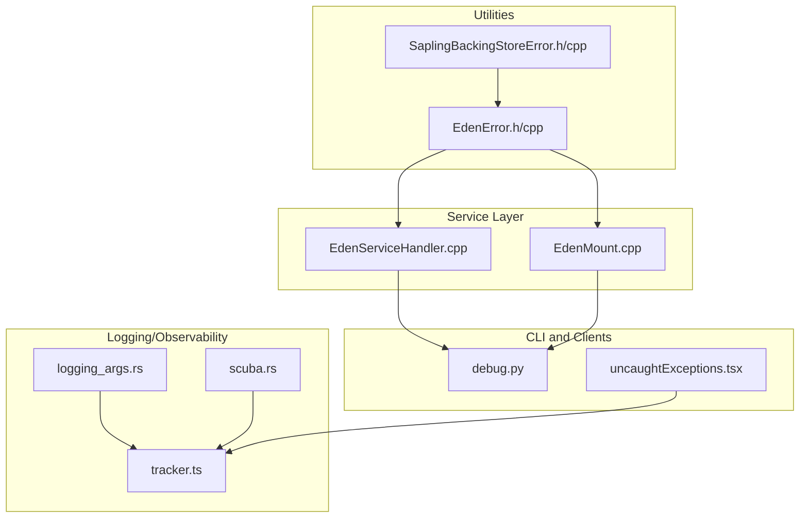
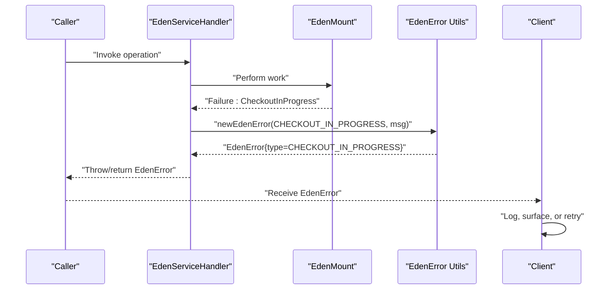
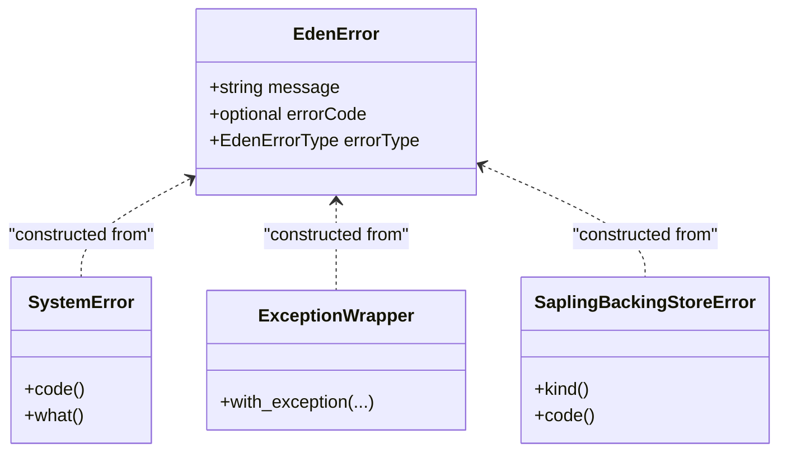
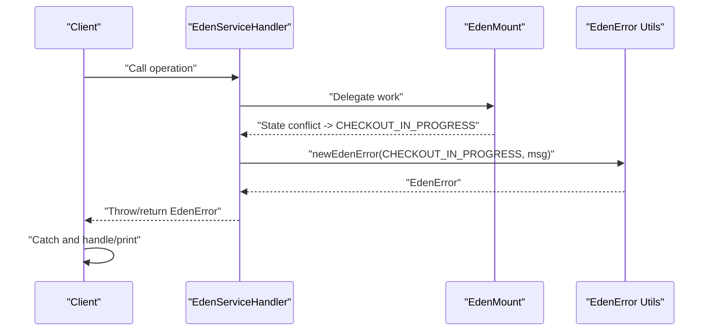
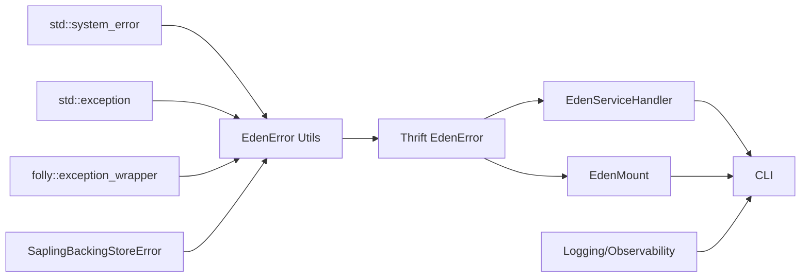

# Error Handling and Diagnostics

<cite>
**Referenced Files in This Document**
- [EdenError.h](file://eden/fs/utils/EdenError.h)
- [EdenError.cpp](file://eden/fs/utils/EdenError.cpp)
- [EdenErrorTest.cpp](file://eden/fs/utils/test/EdenErrorTest.cpp)
- [EdenServiceHandler.cpp](file://eden/fs/service/EdenServiceHandler.cpp)
- [EdenMount.cpp](file://eden/fs/inodes/EdenMount.cpp)
- [SaplingBackingStoreError.h](file://eden/scm/lib/backingstore/include/SaplingBackingStoreError.h)
- [SaplingBackingStoreError.cpp](file://eden/scm/lib/backingstore/src/SaplingBackingStoreError.cpp)
- [logging_args.rs](file://eden/mononoke/cmdlib/logging/logging_args.rs)
- [scuba.rs](file://eden/mononoke/common/observability/src/scuba.rs)
- [debug.py](file://eden/fs/cli/debug.py)
- [cancellation_test.py](file://eden/integration/cancellation_test.py)
- [uncaughtExceptions.tsx](file://addons/vscode/webview/uncaughtExceptions.tsx)
- [tracker.ts](file://addons/isl-server/src/analytics/tracker.ts)
</cite>

## Table of Contents
1. [Introduction](#introduction)
2. [Project Structure](#project-structure)
3. [Core Components](#core-components)
4. [Architecture Overview](#architecture-overview)
5. [Detailed Component Analysis](#detailed-component-analysis)
6. [Dependency Analysis](#dependency-analysis)
7. [Performance Considerations](#performance-considerations)
8. [Troubleshooting Guide](#troubleshooting-guide)
9. [Conclusion](#conclusion)

## Introduction
This document describes the Eden Service error handling framework and diagnostics. It focuses on the EdenError exception structure, the EdenErrorType enumeration, propagation patterns, client-side handling, and debugging techniques. It also covers logging and monitoring integration, performance considerations, and strategies to minimize error occurrences in production.

## Project Structure
The error handling framework spans several layers:
- Utilities for constructing and converting errors
- Thrift-generated error types and service handlers
- Backing store error types bridged into EdenError
- Logging and observability infrastructure
- CLI and client integrations for diagnostics

**Diagram sources**
- [EdenError.h:1-99](file://eden/fs/utils/EdenError.h#L1-L99)
- [EdenError.cpp:1-100](file://eden/fs/utils/EdenError.cpp#L1-L100)
- [SaplingBackingStoreError.h:1-59](file://eden/scm/lib/backingstore/include/SaplingBackingStoreError.h#L1-L59)
- [SaplingBackingStoreError.cpp:1-26](file://eden/scm/lib/backingstore/src/SaplingBackingStoreError.cpp#L1-L26)
- [EdenServiceHandler.cpp:3204-3217](file://eden/fs/service/EdenServiceHandler.cpp#L3204-L3217)
- [EdenMount.cpp:1545-1568](file://eden/fs/inodes/EdenMount.cpp#L1545-L1568)
- [debug.py:1671-1673](file://eden/fs/cli/debug.py#L1671-L1673)
- [logging_args.rs:94-235](file://eden/mononoke/cmdlib/logging/logging_args.rs#L94-L235)
- [scuba.rs:1-41](file://eden/mononoke/common/observability/src/scuba.rs#L1-L41)
- [uncaughtExceptions.tsx:143-162](file://addons/vscode/webview/uncaughtExceptions.tsx#L143-L162)
- [tracker.ts:21-42](file://addons/isl-server/src/analytics/tracker.ts#L21-L42)

**Section sources**
- [EdenError.h:1-99](file://eden/fs/utils/EdenError.h#L1-L99)
- [EdenError.cpp:1-100](file://eden/fs/utils/EdenError.cpp#L1-L100)
- [SaplingBackingStoreError.h:1-59](file://eden/scm/lib/backingstore/include/SaplingBackingStoreError.h#L1-L59)
- [SaplingBackingStoreError.cpp:1-26](file://eden/scm/lib/backingstore/src/SaplingBackingStoreError.cpp#L1-L26)
- [EdenServiceHandler.cpp:3204-3217](file://eden/fs/service/EdenServiceHandler.cpp#L3204-L3217)
- [EdenMount.cpp:1545-1568](file://eden/fs/inodes/EdenMount.cpp#L1545-L1568)
- [debug.py:1671-1673](file://eden/fs/cli/debug.py#L1671-L1673)
- [logging_args.rs:94-235](file://eden/mononoke/cmdlib/logging/logging_args.rs#L94-L235)
- [scuba.rs:1-41](file://eden/mononoke/common/observability/src/scuba.rs#L1-L41)
- [uncaughtExceptions.tsx:143-162](file://addons/vscode/webview/uncaughtExceptions.tsx#L143-L162)
- [tracker.ts:21-42](file://addons/isl-server/src/analytics/tracker.ts#L21-L42)

## Core Components
- EdenError construction and conversion APIs:
  - Overloads for error code + type + message
  - Overloads for type + message (no code)
  - Construction from std::system_error, std::exception, folly::exception_wrapper, and SaplingBackingStoreError
- EdenErrorType enumeration values used by the framework:
  - POSIX_ERROR
  - WIN32_ERROR
  - HRESULT_ERROR
  - ARGUMENT_ERROR
  - GENERIC_ERROR
  - MOUNT_GENERATION_CHANGED
  - JOURNAL_TRUNCATED
  - CHECKOUT_IN_PROGRESS
  - OUT_OF_DATE_PARENT
  - ATTRIBUTE_UNAVAILABLE
  - CANCELLATION_ERROR
  - NETWORK_ERROR
- Backing store error bridging:
  - SaplingBackingStoreError with kinds (Network, DataCorruption, IO, Generic)
  - Automatic mapping to EdenErrorType and optional error codes

Key implementation references:
- [EdenError constructors and overloads:24-97](file://eden/fs/utils/EdenError.h#L24-L97)
- [std::system_error to EdenError mapping:18-35](file://eden/fs/utils/EdenError.cpp#L18-L35)
- [std::exception to EdenError mapping:37-48](file://eden/fs/utils/EdenError.cpp#L37-L48)
- [folly::exception_wrapper to EdenError mapping:50-62](file://eden/fs/utils/EdenError.cpp#L50-L62)
- [SaplingBackingStoreError to EdenError mapping:87-97](file://eden/fs/utils/EdenError.cpp#L87-L97)
- [SaplingBackingStoreError type and fields:17-48](file://eden/scm/lib/backingstore/include/SaplingBackingStoreError.h#L17-L48)
- [SaplingBackingStoreError factory helpers:12-25](file://eden/scm/lib/backingstore/src/SaplingBackingStoreError.cpp#L12-L25)

**Section sources**
- [EdenError.h:24-97](file://eden/fs/utils/EdenError.h#L24-L97)
- [EdenError.cpp:18-97](file://eden/fs/utils/EdenError.cpp#L18-L97)
- [SaplingBackingStoreError.h:17-48](file://eden/scm/lib/backingstore/include/SaplingBackingStoreError.h#L17-L48)
- [SaplingBackingStoreError.cpp:12-25](file://eden/scm/lib/backingstore/src/SaplingBackingStoreError.cpp#L12-L25)

## Architecture Overview
The error handling architecture converts low-level exceptions into a unified EdenError representation with structured metadata (message, errorCode, errorType). Service handlers and mount logic construct EdenError instances directly or via conversion helpers. Clients receive EdenError and can log, surface, or propagate it.

**Diagram sources**
- [EdenServiceHandler.cpp:3204-3217](file://eden/fs/service/EdenServiceHandler.cpp#L3204-L3217)
- [EdenMount.cpp:1545-1568](file://eden/fs/inodes/EdenMount.cpp#L1545-L1568)
- [EdenError.h:24-69](file://eden/fs/utils/EdenError.h#L24-L69)
- [EdenError.cpp:18-35](file://eden/fs/utils/EdenError.cpp#L18-L35)

## Detailed Component Analysis

### EdenError Exception Structure
EdenError encapsulates:
- message: UTF-8 validated error message
- errorCode: optional integer error code
- errorType: typed category of the error

Construction patterns:
- With code and type: [newEdenError(code, type, msg...):29-43](file://eden/fs/utils/EdenError.h#L29-L43)
- Without code: [newEdenError(type, msg...):56-69](file://eden/fs/utils/EdenError.h#L56-L69)
- From std::system_error: [newEdenError(system_error):18-35](file://eden/fs/utils/EdenError.cpp#L18-L35)
- From std::exception: [newEdenError(exception):37-48](file://eden/fs/utils/EdenError.cpp#L37-L48)
- From folly::exception_wrapper: [newEdenError(exception_wrapper):50-62](file://eden/fs/utils/EdenError.cpp#L50-L62)
- From SaplingBackingStoreError: [newEdenError(backingstore_error):87-97](file://eden/fs/utils/EdenError.cpp#L87-L97)

**Diagram sources**
- [EdenError.h:24-97](file://eden/fs/utils/EdenError.h#L24-L97)
- [EdenError.cpp:18-97](file://eden/fs/utils/EdenError.cpp#L18-L97)
- [SaplingBackingStoreError.h:24-48](file://eden/scm/lib/backingstore/include/SaplingBackingStoreError.h#L24-L48)

**Section sources**
- [EdenError.h:24-97](file://eden/fs/utils/EdenError.h#L24-L97)
- [EdenError.cpp:18-97](file://eden/fs/utils/EdenError.cpp#L18-L97)
- [SaplingBackingStoreError.h:24-48](file://eden/scm/lib/backingstore/include/SaplingBackingStoreError.h#L24-L48)

### EdenErrorType Enumeration
The enumeration defines categories used across the system:
- POSIX_ERROR
- WIN32_ERROR
- HRESULT_ERROR
- ARGUMENT_ERROR
- GENERIC_ERROR
- MOUNT_GENERATION_CHANGED
- JOURNAL_TRUNCATED
- CHECKOUT_IN_PROGRESS
- OUT_OF_DATE_PARENT
- ATTRIBUTE_UNAVAILABLE
- CANCELLATION_ERROR
- NETWORK_ERROR

Representative usage sites:
- Argument validation: [ARGUMENT_ERROR for negative memory limit:3209-3214](file://eden/fs/service/EdenServiceHandler.cpp#L3209-L3214)
- Checkout in progress: [CHECKOUT_IN_PROGRESS:1545-1548](file://eden/fs/inodes/EdenMount.cpp#L1545-L1548)
- Journal truncation mapping: [JOURNAL_TRUNCATED:396-397](file://eden/fs/cli_rs/edenfs-client/src/changes_since.rs#L396-L397)
- Network error bridging: [NETWORK_ERROR:16-39](file://eden/fs/utils/test/EdenErrorTest.cpp#L16-L39)
- Cancellation error: [CANCELLATION_ERROR:278-282](file://eden/integration/cancellation_test.py#L278-L282)

**Section sources**
- [EdenServiceHandler.cpp:3209-3214](file://eden/fs/service/EdenServiceHandler.cpp#L3209-L3214)
- [EdenMount.cpp:1545-1548](file://eden/fs/inodes/EdenMount.cpp#L1545-L1548)
- [EdenErrorTest.cpp:16-39](file://eden/fs/utils/test/EdenErrorTest.cpp#L16-L39)
- [cancellation_test.py:278-282](file://eden/integration/cancellation_test.py#L278-L282)

### Error Propagation Patterns
- Service handlers construct EdenError and throw or return it to clients
- Mount logic constructs EdenError for state-specific failures (e.g., checkout in progress)
- CLI catches EdenError and prints to stderr
- Tests validate propagation and client-side handling

**Diagram sources**
- [EdenServiceHandler.cpp:3204-3217](file://eden/fs/service/EdenServiceHandler.cpp#L3204-L3217)
- [EdenMount.cpp:1545-1568](file://eden/fs/inodes/EdenMount.cpp#L1545-L1568)
- [EdenError.h:24-69](file://eden/fs/utils/EdenError.h#L24-L69)
- [EdenError.cpp:18-35](file://eden/fs/utils/EdenError.cpp#L18-L35)
- [debug.py:1671-1673](file://eden/fs/cli/debug.py#L1671-L1673)

**Section sources**
- [EdenServiceHandler.cpp:3204-3217](file://eden/fs/service/EdenServiceHandler.cpp#L3204-L3217)
- [EdenMount.cpp:1545-1568](file://eden/fs/inodes/EdenMount.cpp#L1545-L1568)
- [debug.py:1671-1673](file://eden/fs/cli/debug.py#L1671-L1673)

### Client-Side Error Handling Strategies
- CLI: Catch EdenError and print to stderr; return non-zero exit code
- Webview: Capture unhandled errors and rejections; display structured error UI
- Analytics: Track error events with names and messages for monitoring

References:
- [CLI error handling:1671-1673](file://eden/fs/cli/debug.py#L1671-L1673)
- [Webview uncaught exception handling:143-162](file://addons/vscode/webview/uncaughtExceptions.tsx#L143-L162)
- [Analytics error tracking:31-39](file://addons/isl-server/src/analytics/tracker.ts#L31-L39)

**Section sources**
- [debug.py:1671-1673](file://eden/fs/cli/debug.py#L1671-L1673)
- [uncaughtExceptions.tsx:143-162](file://addons/vscode/webview/uncaughtExceptions.tsx#L143-L162)
- [tracker.ts:31-39](file://addons/isl-server/src/analytics/tracker.ts#L31-L39)

### Debugging Techniques for Common Scenarios
- Checkout in progress: Detect and advise user to wait or inspect ongoing operations
- Out-of-date parent: Suggest running diagnostics to remediate
- Journal truncation: Map to JOURNAL_TRUNCATED and guide recovery steps
- Network errors: Bridge from backing store to NETWORK_ERROR with optional code
- Cancellations: Surface CANCELLATION_ERROR when requests are canceled

References:
- [Checkout in progress error:1545-1568](file://eden/fs/inodes/EdenMount.cpp#L1545-L1568)
- [Out-of-date parent error:2135-2142](file://eden/fs/inodes/EdenMount.cpp#L2135-L2142)
- [Journal truncation mapping:396-397](file://eden/fs/cli_rs/edenfs-client/src/changes_since.rs#L396-L397)
- [Network error bridging tests:16-39](file://eden/fs/utils/test/EdenErrorTest.cpp#L16-L39)
- [Cancellation propagation:278-282](file://eden/integration/cancellation_test.py#L278-L282)

**Section sources**
- [EdenMount.cpp:1545-1568](file://eden/fs/inodes/EdenMount.cpp#L1545-L1568)
- [EdenMount.cpp:2135-2142](file://eden/fs/inodes/EdenMount.cpp#L2135-L2142)
- [EdenErrorTest.cpp:16-39](file://eden/fs/utils/test/EdenErrorTest.cpp#L16-L39)
- [cancellation_test.py:278-282](file://eden/integration/cancellation_test.py#L278-L282)

### Practical Examples of Error Recovery
- Argument validation: Reject invalid inputs early with ARGUMENT_ERROR and clear messages
- Retry on transient network errors: Detect NETWORK_ERROR and retry with backoff
- Graceful degradation: On attribute unavailable, fall back to cached data or skip affected operations
- Journal truncation: Trigger recovery flows and notify user to re-sync

References:
- [ARGUMENT_ERROR usage:3209-3214](file://eden/fs/service/EdenServiceHandler.cpp#L3209-L3214)
- [NETWORK_ERROR bridging:16-39](file://eden/fs/utils/test/EdenErrorTest.cpp#L16-L39)
- [ATTRIBUTE_UNAVAILABLE usage:2135-2142](file://eden/fs/inodes/EdenMount.cpp#L2135-L2142)
- [JOURNAL_TRUNCATED mapping:396-397](file://eden/fs/cli_rs/edenfs-client/src/changes_since.rs#L396-L397)

**Section sources**
- [EdenServiceHandler.cpp:3209-3214](file://eden/fs/service/EdenServiceHandler.cpp#L3209-L3214)
- [EdenErrorTest.cpp:16-39](file://eden/fs/utils/test/EdenErrorTest.cpp#L16-L39)
- [EdenMount.cpp:2135-2142](file://eden/fs/inodes/EdenMount.cpp#L2135-L2142)
- [changes_since.rs:396-397](file://eden/fs/cli_rs/edenfs-client/src/changes_since.rs#L396-L397)

### Logging Best Practices and Monitoring Integration
- Use structured logging to capture errorType, errorCode, and message
- Integrate with observability systems (e.g., Scuba) to filter and alert on verbose values
- Track analytics events with errorName and errorMessage for client-side insights
- Configure global logging and panic handlers for robust error emission

References:
- [Global logging setup and panic handler:94-235](file://eden/mononoke/cmdlib/logging/logging_args.rs#L94-L235)
- [Scuba logging decision fields:16-41](file://eden/mononoke/common/observability/src/scuba.rs#L16-L41)
- [Analytics error tracking:31-39](file://addons/isl-server/src/analytics/tracker.ts#L31-L39)

**Section sources**
- [logging_args.rs:94-235](file://eden/mononoke/cmdlib/logging/logging_args.rs#L94-L235)
- [scuba.rs:16-41](file://eden/mononoke/common/observability/src/scuba.rs#L16-L41)
- [tracker.ts:31-39](file://addons/isl-server/src/analytics/tracker.ts#L31-L39)

## Dependency Analysis
The error handling layer depends on:
- Low-level system errors (std::system_error)
- Backing store error types (SaplingBackingStoreError)
- Thrift-generated error types (EdenError)
- Observability and logging infrastructure

**Diagram sources**
- [EdenError.cpp:18-97](file://eden/fs/utils/EdenError.cpp#L18-L97)
- [SaplingBackingStoreError.h:24-48](file://eden/scm/lib/backingstore/include/SaplingBackingStoreError.h#L24-L48)
- [EdenServiceHandler.cpp:3204-3217](file://eden/fs/service/EdenServiceHandler.cpp#L3204-L3217)
- [EdenMount.cpp:1545-1568](file://eden/fs/inodes/EdenMount.cpp#L1545-L1568)
- [logging_args.rs:94-235](file://eden/mononoke/cmdlib/logging/logging_args.rs#L94-L235)

**Section sources**
- [EdenError.cpp:18-97](file://eden/fs/utils/EdenError.cpp#L18-L97)
- [SaplingBackingStoreError.h:24-48](file://eden/scm/lib/backingstore/include/SaplingBackingStoreError.h#L24-L48)
- [EdenServiceHandler.cpp:3204-3217](file://eden/fs/service/EdenServiceHandler.cpp#L3204-L3217)
- [EdenMount.cpp:1545-1568](file://eden/fs/inodes/EdenMount.cpp#L1545-L1568)
- [logging_args.rs:94-235](file://eden/mononoke/cmdlib/logging/logging_args.rs#L94-L235)

## Performance Considerations
- Prefer early validation to avoid expensive operations on invalid inputs (e.g., ARGUMENT_ERROR)
- Minimize repeated error conversions by propagating EdenError directly when possible
- Use structured logging judiciously; avoid excessive verbosity in hot paths
- For network errors, implement retries with exponential backoff to reduce repeated failures
- Monitor error rates and types to identify hotspots and optimize accordingly

## Troubleshooting Guide
Common scenarios and actions:
- Checkout in progress: Wait for completion or investigate conflicting operations
- Out-of-date parent: Run diagnostics and re-sync to align working copy
- Journal truncation: Trigger recovery and re-fetch changes
- Network errors: Inspect connectivity and retry with backoff
- Cancellations: Verify request lifecycle and handle CANCELLATION_ERROR gracefully

References:
- [Checkout in progress:1545-1568](file://eden/fs/inodes/EdenMount.cpp#L1545-L1568)
- [Out-of-date parent:2135-2142](file://eden/fs/inodes/EdenMount.cpp#L2135-L2142)
- [Journal truncation mapping:396-397](file://eden/fs/cli_rs/edenfs-client/src/changes_since.rs#L396-L397)
- [Network error bridging:16-39](file://eden/fs/utils/test/EdenErrorTest.cpp#L16-L39)
- [Cancellation propagation:278-282](file://eden/integration/cancellation_test.py#L278-L282)

**Section sources**
- [EdenMount.cpp:1545-1568](file://eden/fs/inodes/EdenMount.cpp#L1545-L1568)
- [EdenMount.cpp:2135-2142](file://eden/fs/inodes/EdenMount.cpp#L2135-L2142)
- [changes_since.rs:396-397](file://eden/fs/cli_rs/edenfs-client/src/changes_since.rs#L396-L397)
- [EdenErrorTest.cpp:16-39](file://eden/fs/utils/test/EdenErrorTest.cpp#L16-L39)
- [cancellation_test.py:278-282](file://eden/integration/cancellation_test.py#L278-L282)

## Conclusion
The Eden Service error handling framework provides a consistent, typed, and diagnostic-rich mechanism for representing and propagating errors across layers. By leveraging EdenError and EdenErrorType, clients can reliably detect, log, and recover from common failure modes. Integrating with logging and observability systems ensures visibility and enables proactive mitigation strategies.