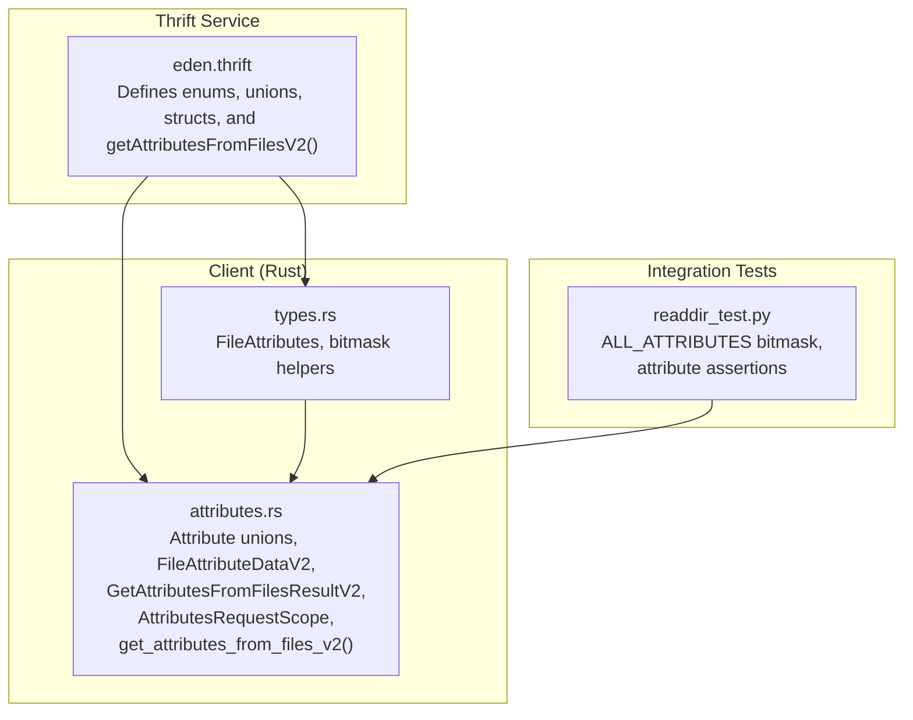
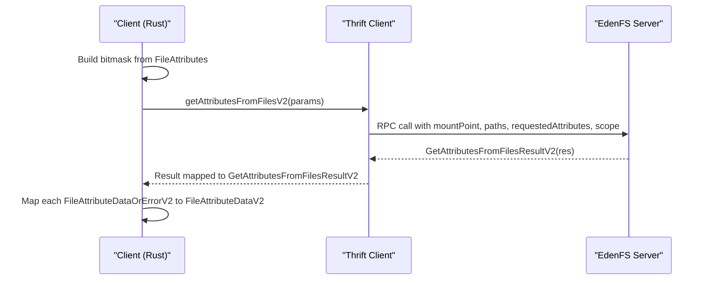
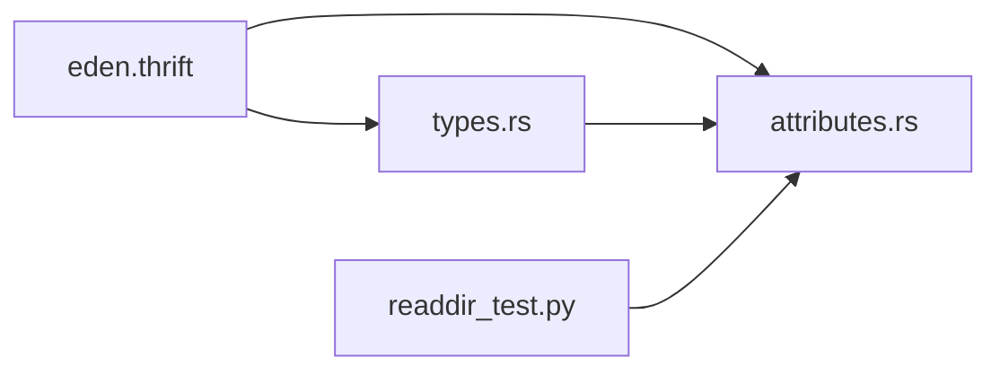

# File Attributes and Queries

<cite>
**Referenced Files in This Document**
- [eden.thrift](file://eden/fs/service/eden.thrift)
- [attributes.rs](file://eden/fs/cli_rs/edenfs-client/src/attributes.rs)
- [types.rs](file://eden/fs/cli_rs/edenfs-client/src/types.rs)
- [readdir_test.py](file://eden/integration/readdir_test.py)
- [sha1_hash.rs](file://eden/mononoke/mononoke_types/src/sha1_hash.rs)
- [hash.rs](file://eden/mononoke/mononoke_types/src/hash.rs)
</cite>

## Table of Contents
1. [Introduction](#introduction)
2. [Project Structure](#project-structure)
3. [Core Components](#core-components)
4. [Architecture Overview](#architecture-overview)
5. [Detailed Component Analysis](#detailed-component-analysis)
6. [Dependency Analysis](#dependency-analysis)
7. [Performance Considerations](#performance-considerations)
8. [Troubleshooting Guide](#troubleshooting-guide)
9. [Conclusion](#conclusion)

## Introduction
This document explains the Eden Service file attribute retrieval system, focusing on:
- The FileAttributes enum and its bitmask semantics
- The getAttributesFromFilesV2() API and FileAttributeDataV2 structure
- Attribute unions and error handling patterns (Sha1OrError, Blake3OrError, SizeOrError, DigestHashOrError, etc.)
- The AttributesRequestScope enum for filtering trees/files
- Practical examples of batch attribute queries
- Performance optimization strategies for large directory listings
- Error handling strategies for unavailable attributes
- The relationship between file attributes and content-addressed storage

## Project Structure
The file attribute system spans Thrift service definitions, client-side Rust types and unions, and integration tests that exercise the API.

**Diagram sources**
- [eden.thrift:353-419](file://eden/fs/service/eden.thrift#L353-L419)
- [types.rs:426-444](file://eden/fs/cli_rs/edenfs-client/src/types.rs#L426-L444)
- [attributes.rs:432-471](file://eden/fs/cli_rs/edenfs-client/src/attributes.rs#L432-L471)
- [readdir_test.py:50-61](file://eden/integration/readdir_test.py#L50-L61)

**Section sources**
- [eden.thrift:353-419](file://eden/fs/service/eden.thrift#L353-L419)
- [types.rs:426-444](file://eden/fs/cli_rs/edenfs-client/src/types.rs#L426-L444)
- [attributes.rs:432-471](file://eden/fs/cli_rs/edenfs-client/src/attributes.rs#L432-L471)
- [readdir_test.py:50-61](file://eden/integration/readdir_test.py#L50-L61)

## Core Components
- FileAttributes (bitmask enum): Defines the set of supported attributes (SHA1_HASH, FILE_SIZE, SOURCE_CONTROL_TYPE, OBJECT_ID, BLAKE3_HASH, DIGEST_SIZE, DIGEST_HASH, MTIME, MODE). Each variant is a distinct power-of-two flag suitable for OR-ing into a bitmask.
- RequestedAttributes: Unsigned 64-bit bitmask passed to getAttributesFromFilesV2().
- AttributesRequestScope: Filters whether to include files, trees (directories), or both in the response.
- FileAttributeDataV2: Aggregates optional fields for each requested attribute; each field is an attribute-or-error union.
- Attribute unions: Sha1OrError, Blake3OrError, SizeOrError, SourceControlTypeOrError, ObjectIdOrError, DigestSizeOrError, DigestHashOrError, MtimeOrError, ModeOrError.
- Client API: get_attributes_from_files_v2() constructs GetAttributesFromFilesParams and returns GetAttributesFromFilesResultV2.

**Section sources**
- [eden.thrift:353-419](file://eden/fs/service/eden.thrift#L353-L419)
- [eden.thrift:427-431](file://eden/fs/service/eden.thrift#L427-L431)
- [eden.thrift:559-569](file://eden/fs/service/eden.thrift#L559-L569)
- [eden.thrift:441-547](file://eden/fs/service/eden.thrift#L441-L547)
- [attributes.rs:432-471](file://eden/fs/cli_rs/edenfs-client/src/attributes.rs#L432-L471)
- [types.rs:478-485](file://eden/fs/cli_rs/edenfs-client/src/types.rs#L478-L485)

## Architecture Overview
The client builds a bitmask of requested attributes and sends a single request to the server. The server responds with a list of FileAttributeDataOrErrorV2 entries, one per input path. Each entry contains optional attribute-or-error unions.

**Diagram sources**
- [attributes.rs:432-471](file://eden/fs/cli_rs/edenfs-client/src/attributes.rs#L432-L471)
- [eden.thrift:626-641](file://eden/fs/service/eden.thrift#L626-L641)

## Detailed Component Analysis

### FileAttributes Enum and Bitmask Semantics
- Each attribute is a power of two: SHA1_HASH=1, FILE_SIZE=2, SOURCE_CONTROL_TYPE=4, OBJECT_ID=8, BLAKE3_HASH=16, DIGEST_SIZE=32, DIGEST_HASH=64, MTIME=128, MODE=256.
- The client validates bitmasks and supports constructing masks from individual attributes or slices.
- ALL_ATTRIBUTES is defined as the OR of all supported attributes in integration tests.

Key behaviors:
- Bitmask validation ensures only supported flags are set.
- Convenience methods provide all-attributes bitmask and iteration over available attributes.

**Section sources**
- [eden.thrift:353-419](file://eden/fs/service/eden.thrift#L353-L419)
- [types.rs:478-485](file://eden/fs/cli_rs/edenfs-client/src/types.rs#L478-L485)
- [types.rs:503-513](file://eden/fs/cli_rs/edenfs-client/src/types.rs#L503-L513)
- [types.rs:545-560](file://eden/fs/cli_rs/edenfs-client/src/types.rs#L545-L560)
- [readdir_test.py:50-61](file://eden/integration/readdir_test.py#L50-L61)

### getAttributesFromFilesV2() Method and Params
- Input parameters include mountPoint, paths, requestedAttributes (bitmask), SyncBehavior, and optional scope (AttributesRequestScope).
- The client maps Rust enums to Thrift enums and constructs the request payload.
- The response is a list aligned to the input paths, each element being FileAttributeDataOrErrorV2.

Implementation highlights:
- The client method converts paths to bytes and sets sync behavior.
- Scope defaults to TreesAndFiles if not specified.

**Section sources**
- [eden.thrift:626-641](file://eden/fs/service/eden.thrift#L626-L641)
- [attributes.rs:432-471](file://eden/fs/cli_rs/edenfs-client/src/attributes.rs#L432-L471)
- [attributes.rs:388-394](file://eden/fs/cli_rs/edenfs-client/src/attributes.rs#L388-L394)

### FileAttributeDataV2 Structure
- Fields are optional to reflect requested vs. not-requested.
- Each field is an attribute-or-error union:
  - sha1: Sha1OrError
  - size: SizeOrError
  - sourceControlType: SourceControlTypeOrError
  - objectId: ObjectIdOrError
  - blake3: Blake3OrError
  - digestSize: DigestSizeOrError
  - digestHash: DigestHashOrError
  - mtime: MtimeOrError
  - mode: ModeOrError

Behavior:
- If an attribute was not requested, the field is None.
- If requested but computation failed, the union carries an error.

**Section sources**
- [eden.thrift:559-569](file://eden/fs/service/eden.thrift#L559-L569)
- [eden.thrift:441-547](file://eden/fs/service/eden.thrift#L441-L547)

### Attribute Unions and Error Handling Patterns
Each union follows a consistent pattern:
- One branch carries the successful value (e.g., BinaryHash for hashes, i64 for size, TimeSpec for mtime, i32 for mode).
- Another branch carries an EdenError with an EdenErrorType.
- Client-side wrappers (e.g., Sha1OrError, SizeOrError, Blake3OrError, DigestHashOrError, DigestSizeOrError) mirror the unions and expose typed constructors and conversions.

Error categories:
- POSIX_ERROR with errno values (e.g., EINVAL, EISDIR, ENOENT)
- ATTRIBUTE_UNAVAILABLE for unavailable attributes (e.g., missing blake3 hashes, digest sizes, digest hashes for certain file types or materialized directories)

Client-side mapping:
- Unions are converted into enums with Error, Value, and UnknownField variants for robustness.

**Section sources**
- [eden.thrift:441-547](file://eden/fs/service/eden.thrift#L441-L547)
- [attributes.rs:35-87](file://eden/fs/cli_rs/edenfs-client/src/attributes.rs#L35-L87)
- [attributes.rs:177-231](file://eden/fs/cli_rs/edenfs-client/src/attributes.rs#L177-L231)

### AttributesRequestScope Filtering
- TREES: include only directories
- FILES: include only files
- TREES_AND_FILES: include both

Defaults to TREES_AND_FILES when unspecified. The client maps between Rust enum and Thrift enum.

**Section sources**
- [eden.thrift:427-431](file://eden/fs/service/eden.thrift#L427-L431)
- [attributes.rs:388-394](file://eden/fs/cli_rs/edenfs-client/src/attributes.rs#L388-L394)
- [attributes.rs:396-415](file://eden/fs/cli_rs/edenfs-client/src/attributes.rs#L396-L415)

### Relationship to Content-Addressed Storage
- DIGEST_SIZE and DIGEST_HASH are designed to identify content in a Content Addressed Store (e.g., RE CAS).
- For files, DIGEST_HASH is the BLAKE3 of the file content.
- For directories, DIGEST_HASH is the BLAKE3 of the directory’s augmented manifest; DIGEST_SIZE is the size of that manifest.
- OBJECT_ID is an opaque identifier that reflects recursive changes; locally modified content yields no object ID.

Implications:
- Use DIGEST_SIZE/DIGEST_HASH to locate content in stores.
- Use OBJECT_ID to detect changes without re-hashing.
- BLAKE3_HASH is available for files; directories can use DIGEST_HASH instead.

**Section sources**
- [eden.thrift:390-407](file://eden/fs/service/eden.thrift#L390-L407)
- [eden.thrift:486-495](file://eden/fs/service/eden.thrift#L486-L495)
- [hash.rs:860-861](file://eden/mononoke/mononoke_types/src/hash.rs#L860-L861)
- [sha1_hash.rs:319-368](file://eden/mononoke/mononoke_types/src/sha1_hash.rs#L319-L368)

### Practical Examples

#### Batch Attribute Queries
- Construct a bitmask from desired attributes (e.g., FILE_SIZE | SHA1_HASH | BLAKE3_HASH).
- Call get_attributes_from_files_v2() with the bitmask and a list of paths.
- Iterate results and check each FileAttributeDataOrErrorV2 for success or error.

Integration test pattern:
- ALL_ATTRIBUTES is computed as the OR of all supported attributes.
- Tests assert results for size-only, type-only, and mixed attribute requests.

**Section sources**
- [types.rs:545-560](file://eden/fs/cli_rs/edenfs-client/src/types.rs#L545-L560)
- [readdir_test.py:50-61](file://eden/integration/readdir_test.py#L50-L61)
- [readdir_test.py:412-477](file://eden/integration/readdir_test.py#L412-L477)
- [readdir_test.py:479-550](file://eden/integration/readdir_test.py#L479-L550)

#### Performance Optimization for Large Directory Listings
- Prefer requesting only necessary attributes via a tailored bitmask to reduce server work and payload size.
- Use AttributesRequestScope to limit results to files or trees when applicable.
- For directory-heavy scans, consider DIGEST_SIZE/DIGEST_HASH to avoid materializing content when content-addressable keys are sufficient.

[No sources needed since this section provides general guidance]

### Error Handling Strategies
Common scenarios:
- Non-existent files: EdenErrorType.POSIX_ERROR with ENOENT.
- Unsupported types (e.g., symlinks, directories, non-regular files) for certain attributes (e.g., SHA1_HASH, BLAKE3_HASH, FILE_SIZE) yield POSIX_ERROR with EINVAL/EISDIR.
- Unavailable attributes (e.g., missing blake3 hashes, digest sizes, digest hashes) yield EdenErrorType.ATTRIBUTE_UNAVAILABLE with ENOENT.
- Materialized directories may lack digest hash/size; expect ATTRIBUTE_UNAVAILABLE.

Client-side handling:
- Inspect FileAttributeDataOrErrorV2 for error vs. data.
- For attribute-specific fields, check the corresponding union for error.

**Section sources**
- [eden.thrift:147-150](file://eden/fs/service/eden.thrift#L147-L150)
- [eden.thrift:434-467](file://eden/fs/service/eden.thrift#L434-L467)
- [eden.thrift:450-458](file://eden/fs/service/eden.thrift#L450-L458)
- [eden.thrift:500-527](file://eden/fs/service/eden.thrift#L500-L527)
- [attributes.rs:51-87](file://eden/fs/cli_rs/edenfs-client/src/attributes.rs#L51-L87)
- [attributes.rs:193-203](file://eden/fs/cli_rs/edenfs-client/src/attributes.rs#L193-L203)
- [attributes.rs:221-231](file://eden/fs/cli_rs/edenfs-client/src/attributes.rs#L221-L231)

## Dependency Analysis
The client-side types and unions depend on the Thrift service definitions. The integration tests validate the combined behavior.

**Diagram sources**
- [eden.thrift:353-419](file://eden/fs/service/eden.thrift#L353-L419)
- [types.rs:426-444](file://eden/fs/cli_rs/edenfs-client/src/types.rs#L426-L444)
- [attributes.rs:432-471](file://eden/fs/cli_rs/edenfs-client/src/attributes.rs#L432-L471)
- [readdir_test.py:50-61](file://eden/integration/readdir_test.py#L50-L61)

**Section sources**
- [eden.thrift:353-419](file://eden/fs/service/eden.thrift#L353-L419)
- [types.rs:426-444](file://eden/fs/cli_rs/edenfs-client/src/types.rs#L426-L444)
- [attributes.rs:432-471](file://eden/fs/cli_rs/edenfs-client/src/attributes.rs#L432-L471)
- [readdir_test.py:50-61](file://eden/integration/readdir_test.py#L50-L61)

## Performance Considerations
- Minimize attribute requests: request only what you need to reduce server-side computation and network overhead.
- Use AttributesRequestScope to exclude irrelevant entries (e.g., files when enumerating directories).
- For large directory trees, rely on DIGEST_SIZE/DIGEST_HASH to identify content without downloading or hashing entire trees.
- Batch requests: group paths into a single call to amortize connection and serialization costs.

[No sources needed since this section provides general guidance]

## Troubleshooting Guide
- Invalid bitmask: The client validates that only supported FileAttributes flags are set. If an invalid combination is supplied, conversion fails with an error listing valid attributes.
- Attribute unavailable: Expect ATTRIBUTE_UNAVAILABLE when requesting BLAKE3_HASH on directories, or DIGEST_SIZE/DIGEST_HASH on non-regular files or materialized directories.
- Non-existent paths: Expect POSIX_ERROR with ENOENT.
- Unsupported attribute types: For SHA1_HASH/BLAKE3_HASH/FILE_SIZE on symlinks or directories, expect POSIX_ERROR with EINVAL/EISDIR.

**Section sources**
- [types.rs:520-537](file://eden/fs/cli_rs/edenfs-client/src/types.rs#L520-L537)
- [eden.thrift:434-467](file://eden/fs/service/eden.thrift#L434-L467)
- [eden.thrift:500-527](file://eden/fs/service/eden.thrift#L500-L527)
- [attributes.rs:51-87](file://eden/fs/cli_rs/edenfs-client/src/attributes.rs#L51-L87)

## Conclusion
The Eden Service file attribute retrieval system provides a flexible, efficient mechanism to query metadata and content identifiers across files and directories. By using bitmasks, scoped requests, and attribute-or-error unions, clients can tailor performance and reliability to their needs. DIGEST_SIZE/DIGEST_HASH and OBJECT_ID integrate naturally with content-addressed storage workflows, enabling fast identification and change detection without unnecessary data transfer.