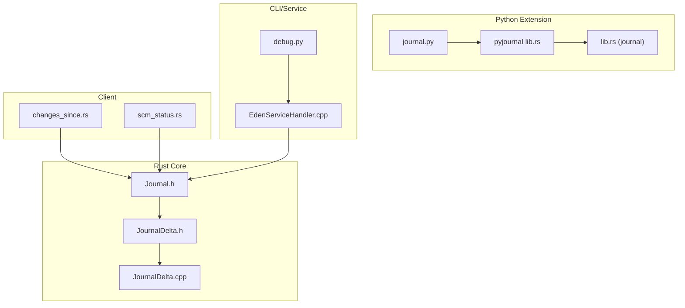
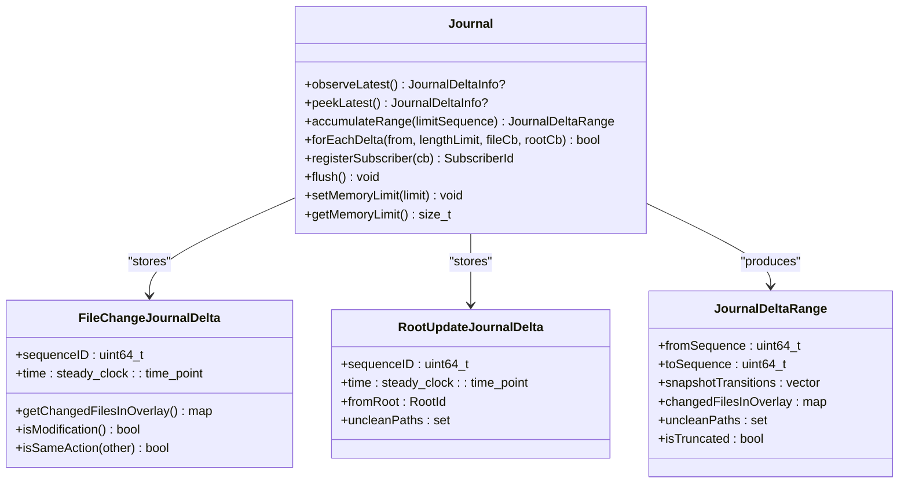
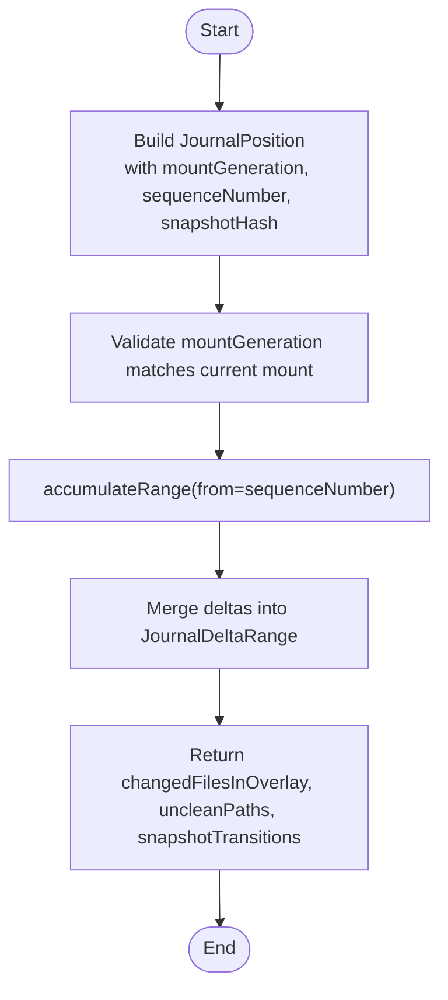
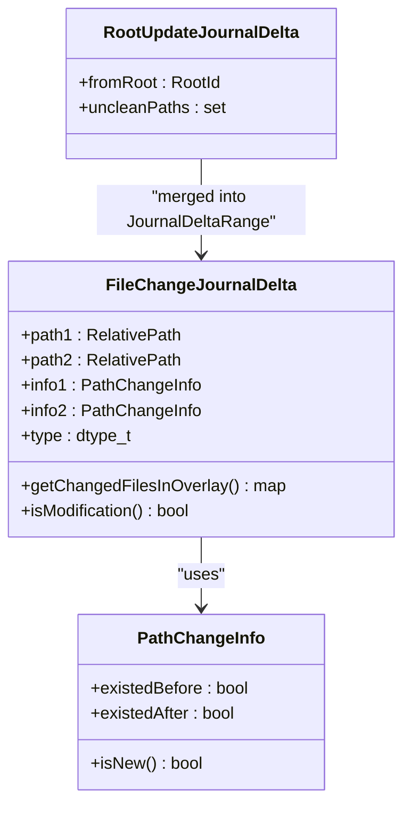
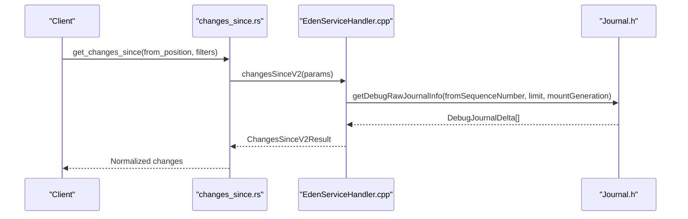
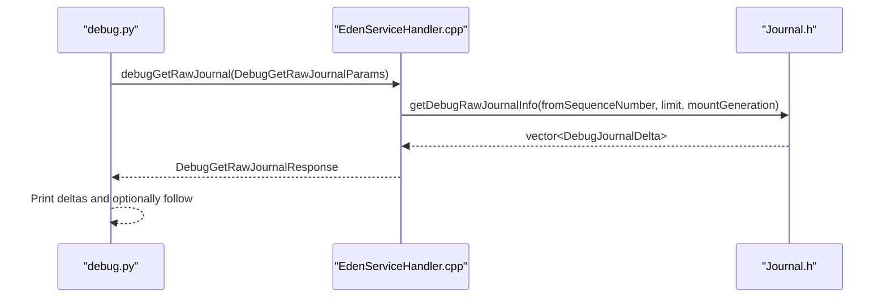
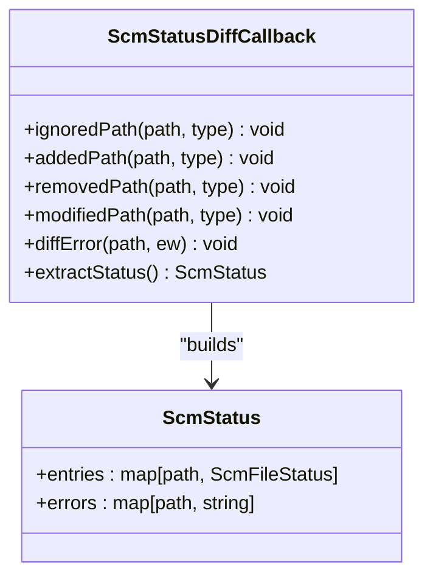
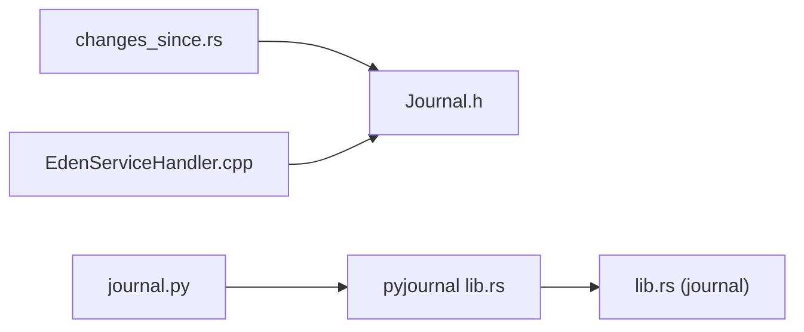

# Journal Operations

<cite>
**Referenced Files in This Document**
- [Journal.h](file://eden/fs/journal/Journal.h)
- [JournalDelta.h](file://eden/fs/journal/JournalDelta.h)
- [JournalDelta.cpp](file://eden/fs/journal/JournalDelta.cpp)
- [scm_status.rs](file://eden/fs/cli_rs/edenfs-client/src/scm_status.rs)
- [ScmStatusDiffCallback.h](file://eden/fs/store/ScmStatusDiffCallback.h)
- [ScmStatusDiffCallback.cpp](file://eden/fs/store/ScmStatusDiffCallback.cpp)
- [debug.py](file://eden/fs/cli/debug.py)
- [EdenServiceHandler.cpp](file://eden/fs/service/EdenServiceHandler.cpp)
- [changes_since.rs](file://eden/fs/cli_rs/edenfs-client/src/changes_since.rs)
- [journal.py](file://eden/scm/sapling/ext/journal.py)
- [lib.rs](file://eden/scm/lib/journal/src/lib.rs)
- [lib.rs (pyjournal)](file://eden/scm/saplingnative/bindings/modules/pyjournal/src/lib.rs)
- [journal_test.py](file://eden/integration/hg/journal_test.py)
</cite>

## Table of Contents
1. [Introduction](#introduction)
2. [Project Structure](#project-structure)
3. [Core Components](#core-components)
4. [Architecture Overview](#architecture-overview)
5. [Detailed Component Analysis](#detailed-component-analysis)
6. [Dependency Analysis](#dependency-analysis)
7. [Performance Considerations](#performance-considerations)
8. [Troubleshooting Guide](#troubleshooting-guide)
9. [Conclusion](#conclusion)

## Introduction
This document explains the Eden Service journal operations and change tracking. It covers:
- JournalPosition and related structures for time-based queries
- FileDelta and ScmStatus for change detection
- getChangesSinceV2 and DebugGetRawJournalParams for debugging
- Practical examples, performance considerations, and integration with external tools like Watchman
- Journal truncation and error recovery strategies

## Project Structure
The journal system spans multiple layers:
- Rust core journal and delta definitions
- Client-side APIs for querying changes and status
- Python extension for Mercurial/Sapling journaling
- CLI and service handlers for debugging and diagnostics

**Diagram sources**
- [Journal.h:62-210](file://eden/fs/journal/Journal.h#L62-L210)
- [JournalDelta.h:54-231](file://eden/fs/journal/JournalDelta.h#L54-L231)
- [JournalDelta.cpp:12-167](file://eden/fs/journal/JournalDelta.cpp#L12-L167)
- [changes_since.rs:732-814](file://eden/fs/cli_rs/edenfs-client/src/changes_since.rs#L732-L814)
- [scm_status.rs:21-44](file://eden/fs/cli_rs/edenfs-client/src/scm_status.rs#L21-L44)
- [journal.py:212-446](file://eden/scm/sapling/ext/journal.py#L212-L446)
- [lib.rs (pyjournal):23-98](file://eden/scm/saplingnative/bindings/modules/pyjournal/src/lib.rs#L23-L98)
- [lib.rs (journal):25-183](file://eden/scm/lib/journal/src/lib.rs#L25-L183)
- [debug.py:1625-1703](file://eden/fs/cli/debug.py#L1625-L1703)
- [EdenServiceHandler.cpp:3231-3250](file://eden/fs/service/EdenServiceHandler.cpp#L3231-L3250)

**Section sources**
- [Journal.h:62-210](file://eden/fs/journal/Journal.h#L62-L210)
- [JournalDelta.h:54-231](file://eden/fs/journal/JournalDelta.h#L54-L231)
- [changes_since.rs:732-814](file://eden/fs/cli_rs/edenfs-client/src/changes_since.rs#L732-L814)
- [scm_status.rs:21-44](file://eden/fs/cli_rs/edenfs-client/src/scm_status.rs#L21-L44)
- [journal.py:212-446](file://eden/scm/sapling/ext/journal.py#L212-L446)
- [lib.rs (journal):25-183](file://eden/scm/lib/journal/src/lib.rs#L25-L183)
- [lib.rs (pyjournal):23-98](file://eden/scm/saplingnative/bindings/modules/pyjournal/src/lib.rs#L23-L98)
- [debug.py:1625-1703](file://eden/fs/cli/debug.py#L1625-L1703)
- [EdenServiceHandler.cpp:3231-3250](file://eden/fs/service/EdenServiceHandler.cpp#L3231-L3250)

## Core Components
- JournalPosition: identifies a position in the journal chain for time-based queries. It includes:
  - mountGeneration: identifies the mount lifecycle to prevent cross-mount comparisons
  - sequenceNumber: monotonic sequence number for ordering deltas
  - snapshotHash: optional snapshot identifier for root transitions
- FileDelta: describes file-level changes between two points in time, including:
  - changedPaths: map of paths to existence info
  - createdPaths: newly created files
  - removedPaths: removed files
  - uncleanPaths: paths with differing status across root updates
- ScmStatus: aggregates per-file SCM statuses and errors:
  - ScmFileStatus enum: ADDED, MODIFIED, REMOVED, IGNORED
  - errors: mapping of paths to error messages

**Section sources**
- [Journal.h:119-144](file://eden/fs/journal/Journal.h#L119-L144)
- [JournalDelta.h:64-155](file://eden/fs/journal/JournalDelta.h#L64-L155)
- [scm_status.rs:21-44](file://eden/fs/cli_rs/edenfs-client/src/scm_status.rs#L21-L44)
- [ScmStatusDiffCallback.h:25-48](file://eden/fs/store/ScmStatusDiffCallback.h#L25-L48)
- [ScmStatusDiffCallback.cpp:18-52](file://eden/fs/store/ScmStatusDiffCallback.cpp#L18-L52)

## Architecture Overview
The journal system records file and root changes, exposes them via sequences, and allows clients to query changes since a given JournalPosition.

**Diagram sources**
- [Journal.h:62-210](file://eden/fs/journal/Journal.h#L62-L210)
- [JournalDelta.h:54-231](file://eden/fs/journal/JournalDelta.h#L54-L231)
- [JournalDelta.cpp:12-167](file://eden/fs/journal/JournalDelta.cpp#L12-L167)

## Detailed Component Analysis

### JournalPosition and Time-Based Queries
- Purpose: Provide a stable anchor for querying changes using mountGeneration, sequenceNumber, and optional snapshotHash.
- Behavior:
  - mountGeneration ensures positions are only compared within the same mount lifecycle.
  - sequenceNumber enables ordered traversal and accumulation.
  - snapshotHash supports root transitions and snapshot-aware queries.

**Diagram sources**
- [Journal.h:119-144](file://eden/fs/journal/Journal.h#L119-L144)
- [Journal.h:142-144](file://eden/fs/journal/Journal.h#L142-L144)

**Section sources**
- [Journal.h:119-144](file://eden/fs/journal/Journal.h#L119-L144)

### FileDelta and Change Detection
- FileChangeJournalDelta captures single or paired path events with existence flags.
- RootUpdateJournalDelta tracks root transitions and unclean paths.
- JournalDeltaRange merges multiple deltas into a single view for efficient consumption.

**Diagram sources**
- [JournalDelta.h:20-155](file://eden/fs/journal/JournalDelta.h#L20-L155)
- [JournalDelta.cpp:14-126](file://eden/fs/journal/JournalDelta.cpp#L14-L126)

**Section sources**
- [JournalDelta.h:64-155](file://eden/fs/journal/JournalDelta.h#L64-L155)
- [JournalDelta.cpp:111-133](file://eden/fs/journal/JournalDelta.cpp#L111-L133)

### getChangesSinceV2 Method
- Purpose: Compute file changes since a given JournalPosition with optional filters.
- Inputs:
  - from_position: JournalPosition (mountGeneration, sequenceNumber, snapshotHash)
  - included/excluded roots and suffixes
  - include_vcs_roots, include_state_changes flags
- Output: ChangesSinceV2Result with normalized paths and change notifications.

**Diagram sources**
- [changes_since.rs:732-814](file://eden/fs/cli_rs/edenfs-client/src/changes_since.rs#L732-L814)
- [EdenServiceHandler.cpp:3231-3250](file://eden/fs/service/EdenServiceHandler.cpp#L3231-L3250)
- [Journal.h:195-199](file://eden/fs/journal/Journal.h#L195-L199)

**Section sources**
- [changes_since.rs:732-814](file://eden/fs/cli_rs/edenfs-client/src/changes_since.rs#L732-L814)
- [EdenServiceHandler.cpp:3231-3250](file://eden/fs/service/EdenServiceHandler.cpp#L3231-L3250)

### DebugGetRawJournalParams and Debugging
- Purpose: Inspect raw journal deltas for debugging.
- Usage:
  - CLI invokes debugGetRawJournal to fetch DebugJournalDelta list.
  - Mount generation is passed to ensure correct mount context.
- Typical workflow: Poll from a sequence number, optionally follow and filter by pattern.

**Diagram sources**
- [debug.py:1625-1703](file://eden/fs/cli/debug.py#L1625-L1703)
- [EdenServiceHandler.cpp:3231-3250](file://eden/fs/service/EdenServiceHandler.cpp#L3231-L3250)
- [Journal.h:195-199](file://eden/fs/journal/Journal.h#L195-L199)

**Section sources**
- [debug.py:1625-1703](file://eden/fs/cli/debug.py#L1625-L1703)
- [EdenServiceHandler.cpp:3231-3250](file://eden/fs/service/EdenServiceHandler.cpp#L3231-L3250)

### ScmStatus and ScmFileStatus
- ScmStatusDiffCallback maps diff events to ScmFileStatus entries and collects errors.
- ScmFileStatus enum: Added, Modified, Removed, Ignored.
- Error reporting: Errors are logged and stored per-path for diagnosis.

**Diagram sources**
- [ScmStatusDiffCallback.h:25-48](file://eden/fs/store/ScmStatusDiffCallback.h#L25-L48)
- [ScmStatusDiffCallback.cpp:18-52](file://eden/fs/store/ScmStatusDiffCallback.cpp#L18-L52)
- [scm_status.rs:21-44](file://eden/fs/cli_rs/edenfs-client/src/scm_status.rs#L21-L44)

**Section sources**
- [ScmStatusDiffCallback.h:25-48](file://eden/fs/store/ScmStatusDiffCallback.h#L25-L48)
- [ScmStatusDiffCallback.cpp:18-52](file://eden/fs/store/ScmStatusDiffCallback.cpp#L18-L52)
- [scm_status.rs:21-44](file://eden/fs/cli_rs/edenfs-client/src/scm_status.rs#L21-L44)

### Journal-Based Change Detection Examples
- Example 1: Detect changes since a previous checkout
  - Build JournalPosition with current mountGeneration and sequenceNumber
  - Call get_changes_since(from_position) to retrieve changedFilesInOverlay
- Example 2: Filter by included roots
  - Provide included_roots to limit results to specific subtrees
- Example 3: Monitor raw journal for debugging
  - Use debugGetRawJournal to inspect DebugJournalDelta list and confirm mountGeneration alignment

**Section sources**
- [changes_since.rs:732-814](file://eden/fs/cli_rs/edenfs-client/src/changes_since.rs#L732-L814)
- [debug.py:1625-1703](file://eden/fs/cli/debug.py#L1625-L1703)
- [journal_test.py:26-56](file://eden/integration/hg/journal_test.py#L26-L56)

### Integration Patterns with External Tools (e.g., Watchman)
- Use get_changes_since with include_vcs_roots and include_state_changes to align with external watchers.
- Apply included/excluded roots/suffixes to reduce noise and focus on relevant paths.
- Periodically poll from the last observed sequenceNumber to keep incremental processing efficient.

[No sources needed since this section provides general guidance]

## Dependency Analysis
- Client-to-Journal: changes_since.rs depends on Journal.h for accumulation and range queries.
- Service-to-Journal: EdenServiceHandler.cpp bridges Thrift calls to Journal.h debug and stats.
- Python extension: journal.py records Mercurial/Sapling events and serializes them via pyjournal bindings to lib.rs.

**Diagram sources**
- [changes_since.rs:732-814](file://eden/fs/cli_rs/edenfs-client/src/changes_since.rs#L732-L814)
- [EdenServiceHandler.cpp:3231-3250](file://eden/fs/service/EdenServiceHandler.cpp#L3231-L3250)
- [journal.py:212-446](file://eden/scm/sapling/ext/journal.py#L212-L446)
- [lib.rs (pyjournal):23-98](file://eden/scm/saplingnative/bindings/modules/pyjournal/src/lib.rs#L23-L98)
- [lib.rs (journal):25-183](file://eden/scm/lib/journal/src/lib.rs#L25-L183)

**Section sources**
- [changes_since.rs:732-814](file://eden/fs/cli_rs/edenfs-client/src/changes_since.rs#L732-L814)
- [EdenServiceHandler.cpp:3231-3250](file://eden/fs/service/EdenServiceHandler.cpp#L3231-L3250)
- [journal.py:212-446](file://eden/scm/sapling/ext/journal.py#L212-L446)
- [lib.rs (pyjournal):23-98](file://eden/scm/saplingnative/bindings/modules/pyjournal/src/lib.rs#L23-L98)
- [lib.rs (journal):25-183](file://eden/scm/lib/journal/src/lib.rs#L25-L183)

## Performance Considerations
- Memory limits: Journal.setMemoryLimit controls retention; exceeding it triggers truncation.
- Accumulation cost: Large ranges increase memory usage; prefer narrower ranges and filters.
- Filtering: Use included/excluded roots and suffixes to reduce payload size.
- Subscriber coalescing: Journal may coalesce updates to minimize notification traffic.

**Section sources**
- [Journal.h:206-210](file://eden/fs/journal/Journal.h#L206-L210)
- [Journal.h:334-341](file://eden/fs/journal/Journal.h#L334-L341)
- [changes_since.rs:732-814](file://eden/fs/cli_rs/edenfs-client/src/changes_since.rs#L732-L814)

## Troubleshooting Guide
- Journal truncation:
  - Symptoms: isTruncated flag in JournalDeltaRange or missing expected deltas.
  - Actions: Increase memory limit, reduce range size, or adjust filters.
- Mount mismatch:
  - Symptoms: Errors when comparing positions across mounts.
  - Actions: Ensure mountGeneration matches the current mount before querying.
- Corrupted entries:
  - Symptoms: Skipped entries or aborts when reading journal files.
  - Actions: Flush journal and re-run operations; verify file versions and locks.
- Error reporting:
  - ScmStatusDiffCallback logs and stores errors per path; inspect errors map for diagnostics.

**Section sources**
- [Journal.h:201-209](file://eden/fs/journal/Journal.h#L201-L209)
- [EdenServiceHandler.cpp:3225-3229](file://eden/fs/service/EdenServiceHandler.cpp#L3225-L3229)
- [ScmStatusDiffCallback.cpp:42-52](file://eden/fs/store/ScmStatusDiffCallback.cpp#L42-L52)
- [journal.py:442-444](file://eden/scm/sapling/ext/journal.py#L442-L444)

## Conclusion
The Eden journal system provides robust, time-based change tracking for file and root transitions. By leveraging JournalPosition, FileDelta, and ScmStatus, applications can efficiently detect and act on repository changes. Use getChangesSinceV2 for production queries, DebugGetRawJournalParams for diagnostics, and adhere to performance and error-handling best practices for reliable operation.