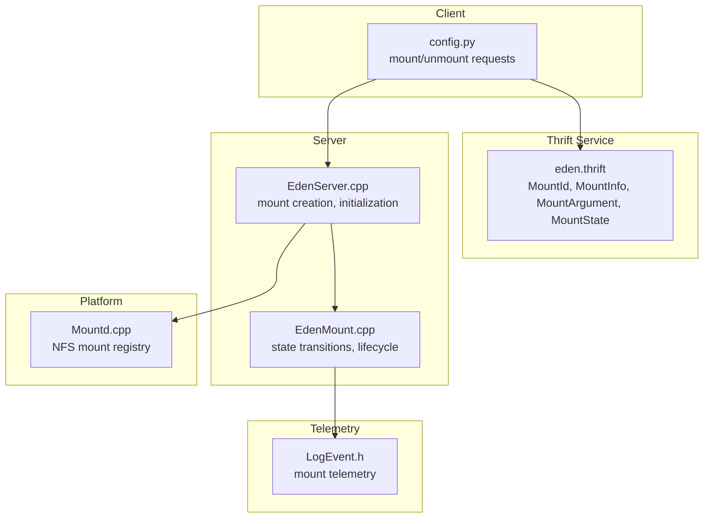
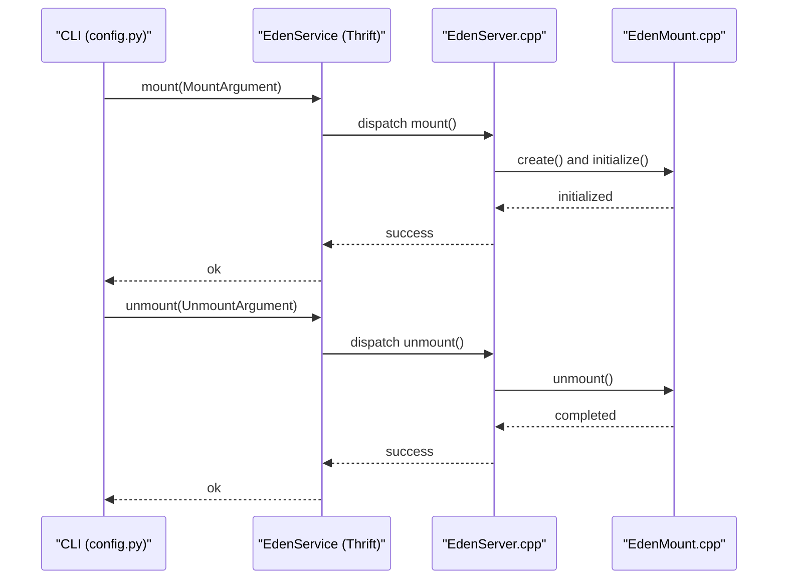
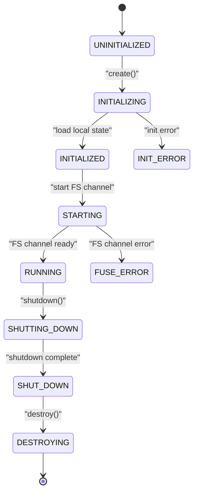
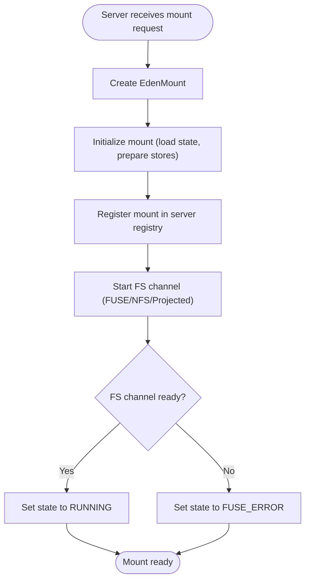
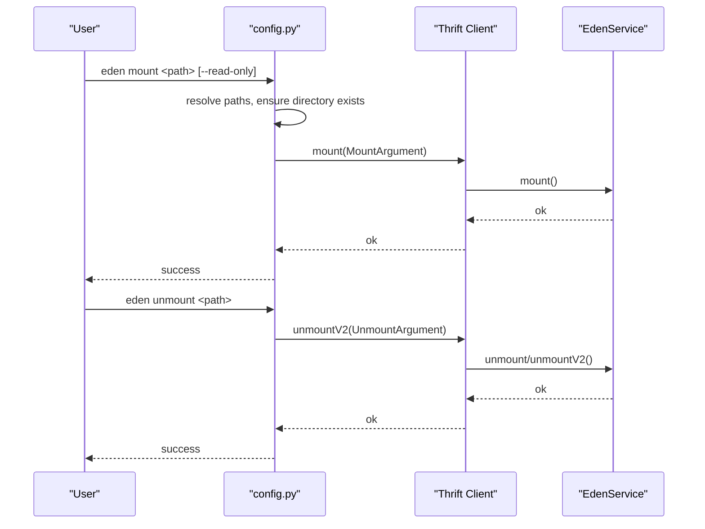
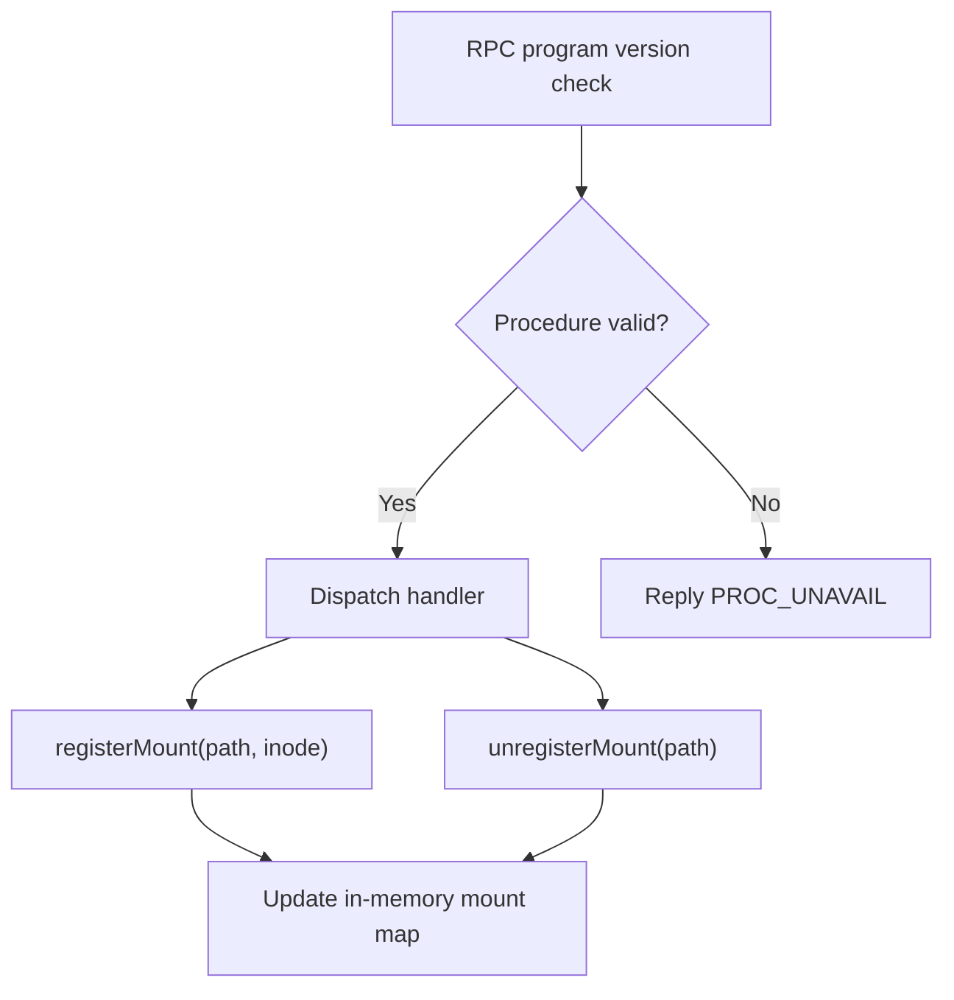
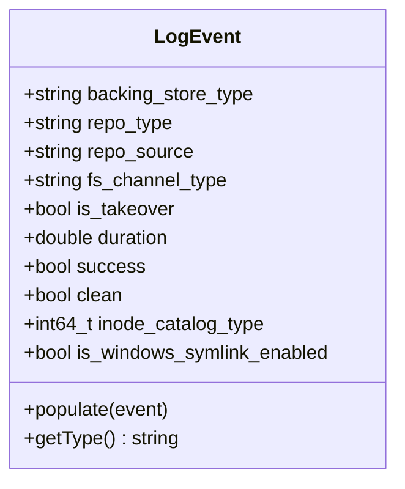
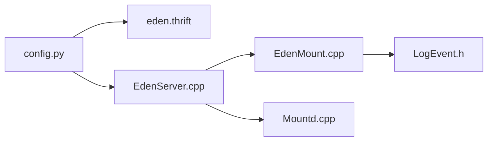

# Mount Management

<cite>
**Referenced Files in This Document**
- [eden.thrift](file://eden/fs/service/eden.thrift)
- [EdenMount.cpp](file://eden/fs/inodes/EdenMount.cpp)
- [EdenServer.cpp](file://eden/fs/service/EdenServer.cpp)
- [config.py](file://eden/fs/cli/config.py)
- [Mountd.cpp](file://eden/fs/nfs/Mountd.cpp)
- [LogEvent.h](file://eden/fs/telemetry/LogEvent.h)
</cite>

## Table of Contents
1. [Introduction](#introduction)
2. [Project Structure](#project-structure)
3. [Core Components](#core-components)
4. [Architecture Overview](#architecture-overview)
5. [Detailed Component Analysis](#detailed-component-analysis)
6. [Dependency Analysis](#dependency-analysis)
7. [Performance Considerations](#performance-considerations)
8. [Troubleshooting Guide](#troubleshooting-guide)
9. [Conclusion](#conclusion)

## Introduction
This document explains the mount management functionality in the Eden Service. It covers the data structures used to represent mounts (MountId, MountInfo, MountArgument), the lifecycle of a mount (MountState), and the relationships among mountPoint, edenClientPath, and backingRepoPath. It also documents mount/unmount operations, error handling, troubleshooting, and performance considerations for managing mounts efficiently.

## Project Structure
The mount management spans several subsystems:
- Thrift service definitions define the mount data structures and states.
- The server orchestrates mount creation, initialization, and lifecycle transitions.
- The client CLI constructs mount requests and invokes the service.
- Platform-specific mount registration (e.g., NFS) maintains mount maps.
- Telemetry records mount events for observability.

**Diagram sources**
- [eden.thrift](file://eden/fs/service/eden.thrift)
- [EdenServer.cpp](file://eden/fs/service/EdenServer.cpp)
- [EdenMount.cpp](file://eden/fs/inodes/EdenMount.cpp)
- [config.py](file://eden/fs/cli/config.py)
- [Mountd.cpp](file://eden/fs/nfs/Mountd.cpp)
- [LogEvent.h](file://eden/fs/telemetry/LogEvent.h)

**Section sources**
- [eden.thrift](file://eden/fs/service/eden.thrift)
- [EdenServer.cpp](file://eden/fs/service/EdenServer.cpp)
- [EdenMount.cpp](file://eden/fs/inodes/EdenMount.cpp)
- [config.py](file://eden/fs/cli/config.py)
- [Mountd.cpp](file://eden/fs/nfs/Mountd.cpp)
- [LogEvent.h](file://eden/fs/telemetry/LogEvent.h)

## Core Components
This section describes the core data structures and their roles in mount management.

- MountId
  - Purpose: Identifies a mount by its mountPoint.
  - Fields: mountPoint (PathString).
  - Usage: Passed as the first argument in mount-related Thrift endpoints to uniquely identify a mount.

- MountInfo
  - Purpose: Describes a running mount’s identity and state.
  - Fields:
    - mountPoint (PathString): The absolute path of the mount point.
    - edenClientPath (PathString): The client-side state directory path associated with the mount.
    - state (MountState): Current lifecycle state of the mount.
    - backingRepoPath (PathString, optional): The path to the backing repository.

- MountArgument
  - Purpose: Parameters supplied to initiate a mount.
  - Fields:
    - mountPoint (PathString): The absolute path of the mount point.
    - edenClientPath (PathString): The client state directory path.
    - readOnly (bool): Whether to mount in read-only mode.

- MountState
  - Purpose: Enumerates the lifecycle states of an EdenMount.
  - States:
    - UNINITIALIZED, INITIALIZING, INITIALIZED, STARTING, RUNNING, FUSE_ERROR, SHUTTING_DOWN, SHUT_DOWN, DESTROYING, INIT_ERROR.

Relationships:
- mountPoint identifies the filesystem mount location.
- edenClientPath identifies the client-side state directory (e.g., .eden/clients/<name>) where metadata and configuration are stored.
- backingRepoPath optionally indicates the physical repository location; it is often derived from the checkout configuration and used by the server to locate the backing store.

**Section sources**
- [eden.thrift](file://eden/fs/service/eden.thrift)

## Architecture Overview
The mount lifecycle is orchestrated by the server and executed by the mount object. The client initiates mount/unmount via Thrift RPCs.

**Diagram sources**
- [config.py](file://eden/fs/cli/config.py)
- [EdenServer.cpp](file://eden/fs/service/EdenServer.cpp)
- [EdenMount.cpp](file://eden/fs/inodes/EdenMount.cpp)
- [eden.thrift](file://eden/fs/service/eden.thrift)

## Detailed Component Analysis

### Mount Lifecycle and States
MountState captures the complete lifecycle of a mount. Transitions are guarded by atomic compare-and-swap checks to ensure thread-safe state changes.

Key behaviors:
- State transitions are validated using compare-and-swap to prevent illegal transitions.
- FUSE_ERROR indicates an error during user-space filesystem initialization (applies to FUSE, NFS, and Projected FS).
- INIT_ERROR indicates an error during the INITIALIZING phase before attempting to start the FS channel.

**Diagram sources**
- [eden.thrift](file://eden/fs/service/eden.thrift)
- [EdenMount.cpp](file://eden/fs/inodes/EdenMount.cpp)

**Section sources**
- [eden.thrift](file://eden/fs/service/eden.thrift)
- [EdenMount.cpp](file://eden/fs/inodes/EdenMount.cpp)

### Mount Creation and Initialization
The server creates and initializes the mount, then begins the mount process.

Operational notes:
- The server constructs the mount object, registers statistics, and starts initialization.
- After initialization, the server proceeds to start the filesystem channel and transitions to RUNNING on success.

**Diagram sources**
- [EdenServer.cpp](file://eden/fs/service/EdenServer.cpp)
- [EdenMount.cpp](file://eden/fs/inodes/EdenMount.cpp)

**Section sources**
- [EdenServer.cpp](file://eden/fs/service/EdenServer.cpp)
- [EdenMount.cpp](file://eden/fs/inodes/EdenMount.cpp)

### Mount Point, Client Path, and Backing Repository Relationship
- mountPoint: The absolute path exposed to the user as the checkout directory.
- edenClientPath: The client-side state directory (e.g., .eden/clients/<name>) containing configuration and metadata.
- backingRepoPath: The path to the backing repository used by the mount; often resolved from the checkout configuration.

These three paths are used together to configure and manage the mount. The server uses them to locate the backing store, initialize the mount, and maintain state.

**Section sources**
- [eden.thrift](file://eden/fs/service/eden.thrift)
- [EdenServer.cpp](file://eden/fs/service/EdenServer.cpp)

### Client CLI Mount/Unmount Operations
The CLI constructs MountArgument and invokes the service to mount. It also handles unmounting and cleanup.

Notes:
- The CLI validates the mount point and detects if it is already mounted.
- It sends MountArgument with mountPoint and edenClientPath and optionally readOnly.
- Unmount supports a fallback to the legacy unmount endpoint if the newer unmountV2 is unavailable.

**Diagram sources**
- [config.py](file://eden/fs/cli/config.py)
- [eden.thrift](file://eden/fs/service/eden.thrift)

**Section sources**
- [config.py](file://eden/fs/cli/config.py)
- [eden.thrift](file://eden/fs/service/eden.thrift)

### NFS Mount Registration
The NFS mount daemon registers and tracks mount points for RPC-based mounts.

This ensures that NFS mounts are tracked consistently alongside other mount types.

**Diagram sources**
- [Mountd.cpp](file://eden/fs/nfs/Mountd.cpp)

**Section sources**
- [Mountd.cpp](file://eden/fs/nfs/Mountd.cpp)

### Telemetry and Observability
Mount events are recorded for operational insights, including success, duration, and flags such as takeover and symlink enablement.

**Diagram sources**
- [LogEvent.h](file://eden/fs/telemetry/LogEvent.h)

**Section sources**
- [LogEvent.h](file://eden/fs/telemetry/LogEvent.h)

## Dependency Analysis
Mount management involves tight coupling between the CLI, server, and mount object, with loose coupling to platform-specific registries.

Observations:
- CLI depends on Thrift types and the server to perform mount operations.
- Server depends on the mount object for lifecycle management.
- NFS mount registry is independent but coordinated with the server for RPC mounts.
- Telemetry is decoupled and augments mount operations with metrics.

**Diagram sources**
- [config.py](file://eden/fs/cli/config.py)
- [eden.thrift](file://eden/fs/service/eden.thrift)
- [EdenServer.cpp](file://eden/fs/service/EdenServer.cpp)
- [EdenMount.cpp](file://eden/fs/inodes/EdenMount.cpp)
- [Mountd.cpp](file://eden/fs/nfs/Mountd.cpp)
- [LogEvent.h](file://eden/fs/telemetry/LogEvent.h)

**Section sources**
- [config.py](file://eden/fs/cli/config.py)
- [eden.thrift](file://eden/fs/service/eden.thrift)
- [EdenServer.cpp](file://eden/fs/service/EdenServer.cpp)
- [EdenMount.cpp](file://eden/fs/inodes/EdenMount.cpp)
- [Mountd.cpp](file://eden/fs/nfs/Mountd.cpp)
- [LogEvent.h](file://eden/fs/telemetry/LogEvent.h)

## Performance Considerations
- Initialization cost: The server loads local state and prepares stores before transitioning to RUNNING. Keep mountPoint directories minimal and avoid heavy I/O during initialization.
- FS channel startup: FUSE/NFS/Projected FS startup costs vary by platform. Prefer read-only mounts when appropriate to reduce write overhead.
- Telemetry overhead: Logging mount events is lightweight but consider batching or sampling in high-frequency scenarios.
- Cleanup: Unmount may wait for inodes to become unreferenced. Use force unmount judiciously and rely on timeouts to avoid hanging operations.

[No sources needed since this section provides general guidance]

## Troubleshooting Guide
Common issues and resolutions:

- Mount fails with “already mounted”
  - Cause: The mount point is already active or symlink verification failed.
  - Resolution: Unmount cleanly or investigate stale mounts. Use the CLI unmount command and verify the mount point is free.

- FUSE_ERROR state
  - Cause: Failure during user-space filesystem initialization (FUSE/NFS/Projected FS).
  - Resolution: Check platform-specific logs, permissions, and resource limits. Retry after resolving prerequisites.

- INIT_ERROR state
  - Cause: Error during INITIALIZING phase before starting the FS channel.
  - Resolution: Review server logs for initialization failures, validate mountPoint and edenClientPath, and ensure repository paths are accessible.

- Long-running unmount
  - Cause: Inodes still referenced by applications.
  - Resolution: Allow the server to complete shutdown gracefully, or use force unmount with caution. Monitor unmount timeouts.

- NFS mount not registered
  - Cause: RPC program mismatch or missing registration.
  - Resolution: Verify RPC program/version compatibility and ensure the mount daemon is running and registered.

**Section sources**
- [config.py](file://eden/fs/cli/config.py)
- [EdenMount.cpp](file://eden/fs/inodes/EdenMount.cpp)
- [Mountd.cpp](file://eden/fs/nfs/Mountd.cpp)

## Conclusion
Mount management in the Eden Service is centered around robust data structures (MountId, MountInfo, MountArgument) and a well-defined lifecycle (MountState). The server coordinates mount creation and initialization, while the CLI provides user-friendly mount/unmount operations. Platform-specific registries (e.g., NFS) complement the overall mount ecosystem. Proper configuration of mountPoint, edenClientPath, and backingRepoPath, combined with careful error handling and performance awareness, ensures reliable and efficient mount operations.