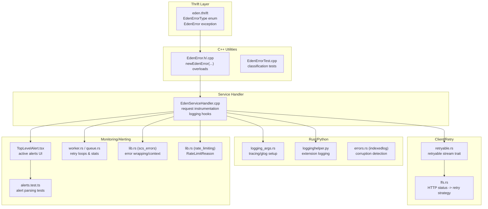
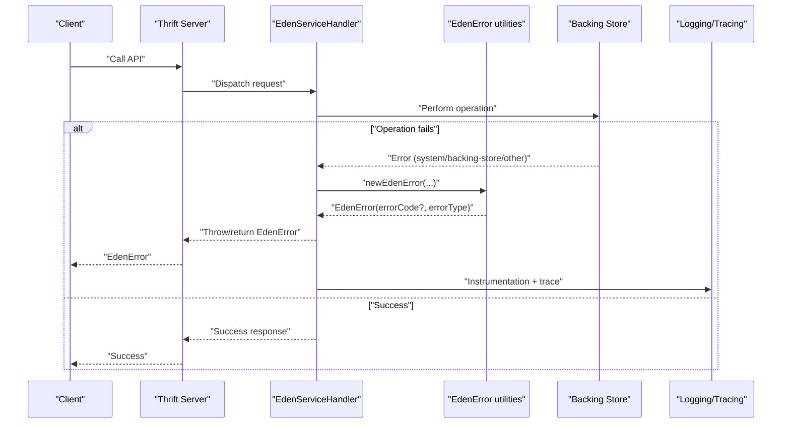
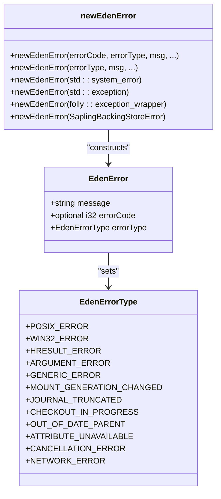
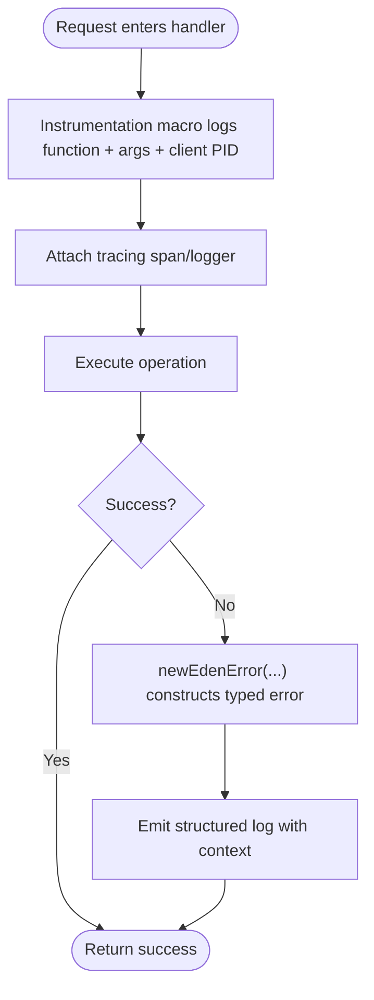
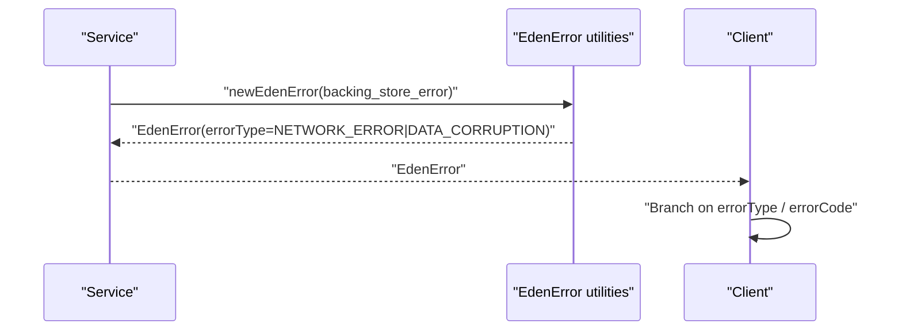
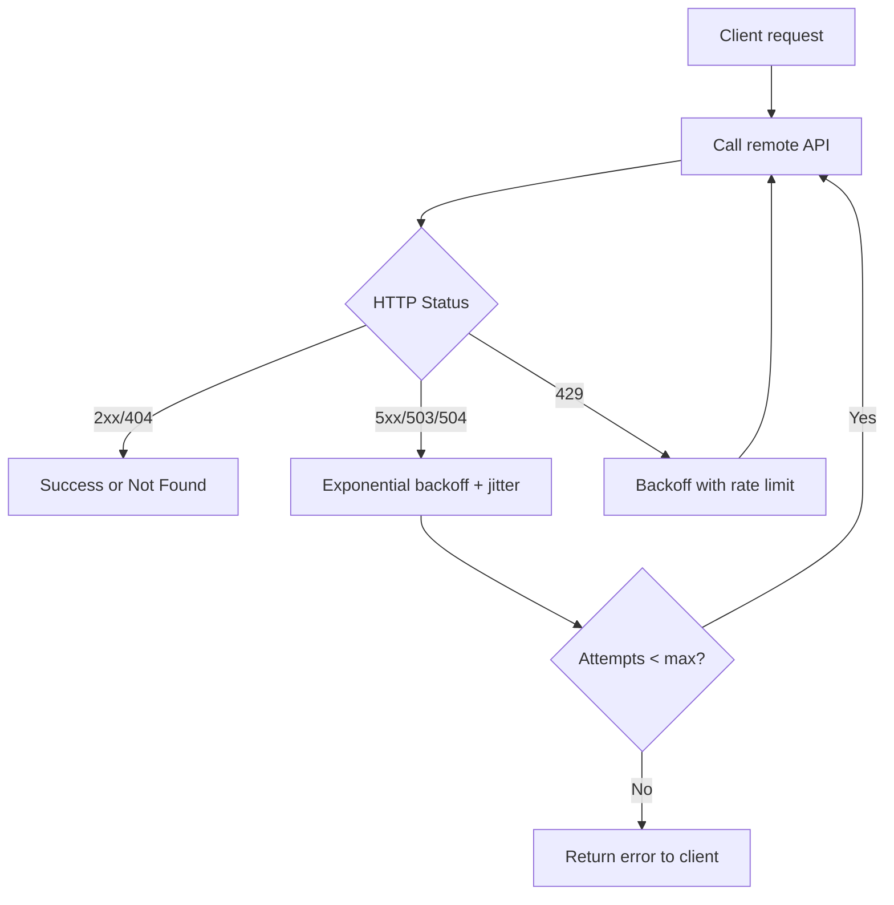
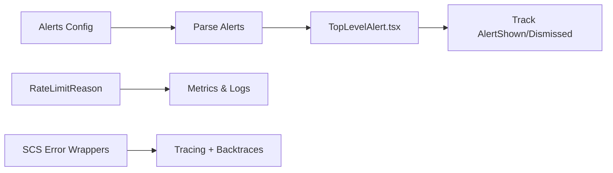
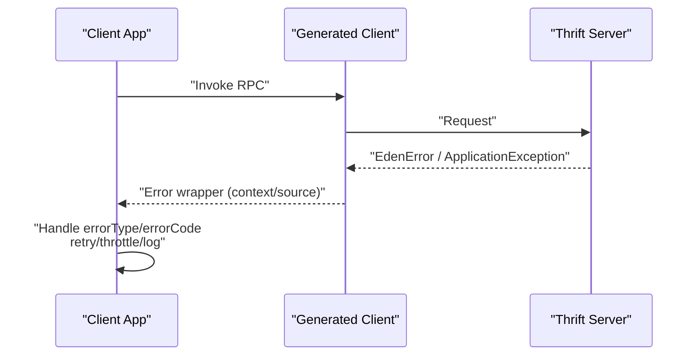
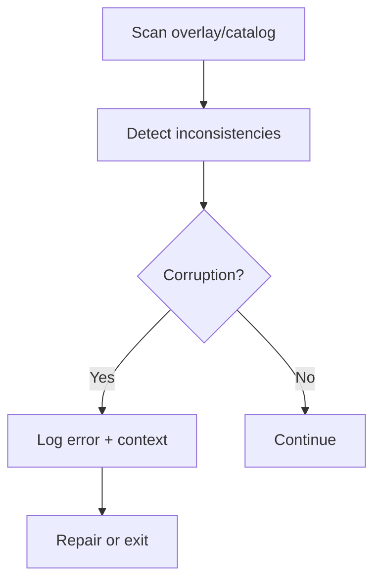
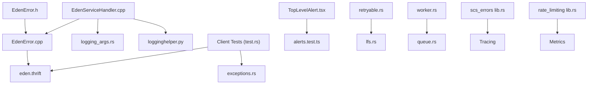

# Error Handling and Diagnostics

<cite>
**Referenced Files in This Document**
- [EdenError.h](file://eden/fs/utils/EdenError.h)
- [EdenError.cpp](file://eden/fs/utils/EdenError.cpp)
- [EdenErrorTest.cpp](file://eden/fs/utils/test/EdenErrorTest.cpp)
- [eden.thrift](file://eden/fs/service/eden.thrift)
- [EdenServiceHandler.cpp](file://eden/fs/service/EdenServiceHandler.cpp)
- [InodeError.cpp](file://eden/fs/inodes/InodeError.cpp)
- [logginghelper.py](file://eden/scm/sapling/ext/logginghelper.py)
- [errors.rs](file://eden/scm/lib/indexedlog/src/errors.rs)
- [test.rs](file://thrift/lib/rust/test/errors/test.rs)
- [exceptions.rs](file://thrift/lib/rust/src/dep_tests/exceptions.rs)
- [logging_args.rs](file://eden/mononoke/cmdlib/logging/logging_args.rs)
- [worker.rs](file://eden/mononoke/features/async_requests/worker/src/worker.rs)
- [queue.rs](file://eden/mononoke/features/async_requests/src/queue.rs)
- [lfs.rs](file://eden/scm/lib/revisionstore/src/lfs.rs)
- [retryable.rs](file://eden/scm/lib/edenapi/src/retryable.rs)
- [eden_fsck.cpp](file://eden/fs/inodes/fscatalog/eden_fsck.cpp)
- [TopLevelAlert.tsx](file://addons/isl/src/TopLevelAlert.tsx)
- [alerts.test.ts](file://addons/isl-server/src/__tests__/alerts.test.ts)
- [lib.rs (scs_errors)](file://eden/mononoke/servers/scs/scs_errors/src/lib.rs)
- [lib.rs (rate_limiting)](file://eden/mononoke/common/rate_limiting/src/lib.rs)
</cite>

## Table of Contents
1. [Introduction](#introduction)
2. [Project Structure](#project-structure)
3. [Core Components](#core-components)
4. [Architecture Overview](#architecture-overview)
5. [Detailed Component Analysis](#detailed-component-analysis)
6. [Dependency Analysis](#dependency-analysis)
7. [Performance Considerations](#performance-considerations)
8. [Troubleshooting Guide](#troubleshooting-guide)
9. [Conclusion](#conclusion)
10. [Appendices](#appendices)

## Introduction
This document describes error handling patterns and diagnostics for SAPLING SCM’s Thrift APIs. It focuses on the EdenError exception hierarchy, error codes, and error type classifications used by the EdenFS service. It also covers diagnostic tools, logging patterns, troubleshooting methodologies, error propagation strategies, retry mechanisms, graceful degradation, performance impact of error conditions, monitoring integration, alerting configurations, and practical client-side recovery strategies.

## Project Structure
The error handling and diagnostics ecosystem spans several layers:
- Thrift service definition and generated types define the EdenError contract and error categories.
- C++ utilities construct and classify errors for transport via Thrift.
- Rust and Python utilities provide cross-language error conversion, logging, and alerting.
- Monitoring and tracing layers capture request metrics and propagate diagnostics.

**Diagram sources**
- [eden.thrift:119-170](file://eden/fs/service/eden.thrift#L119-L170)
- [EdenError.h:24-97](file://eden/fs/utils/EdenError.h#L24-L97)
- [EdenError.cpp:18-97](file://eden/fs/utils/EdenError.cpp#L18-L97)
- [EdenServiceHandler.cpp:682-705](file://eden/fs/service/EdenServiceHandler.cpp#L682-L705)
- [logging_args.rs:200-219](file://eden/mononoke/cmdlib/logging/logging_args.rs#L200-L219)
- [logginghelper.py:25-52](file://eden/scm/sapling/ext/logginghelper.py#L25-L52)
- [errors.rs (indexedlog):172-214](file://eden/scm/lib/indexedlog/src/errors.rs#L172-L214)
- [retryable.rs:156-198](file://eden/scm/lib/edenapi/src/retryable.rs#L156-L198)
- [lfs.rs:3109-3137](file://eden/scm/lib/revisionstore/src/lfs.rs#L3109-L3137)
- [TopLevelAlert.tsx:37-82](file://addons/isl/src/TopLevelAlert.tsx#L37-L82)
- [alerts.test.ts:1-97](file://addons/isl-server/src/__tests__/alerts.test.ts#L1-L97)
- [worker.rs:387-421](file://eden/mononoke/features/async_requests/worker/src/worker.rs#L387-L421)
- [queue.rs:906-942](file://eden/mononoke/features/async_requests/src/queue.rs#L906-L942)
- [lib.rs (scs_errors):87-126](file://eden/mononoke/servers/scs/scs_errors/src/lib.rs#L87-L126)
- [lib.rs (rate_limiting):380-403](file://eden/mononoke/common/rate_limiting/src/lib.rs#L380-L403)

**Section sources**
- [eden.thrift:119-170](file://eden/fs/service/eden.thrift#L119-L170)
- [EdenError.h:24-97](file://eden/fs/utils/EdenError.h#L24-L97)
- [EdenError.cpp:18-97](file://eden/fs/utils/EdenError.cpp#L18-L97)
- [EdenServiceHandler.cpp:682-705](file://eden/fs/service/EdenServiceHandler.cpp#L682-L705)
- [logging_args.rs:200-219](file://eden/mononoke/cmdlib/logging/logging_args.rs#L200-L219)
- [logginghelper.py:25-52](file://eden/scm/sapling/ext/logginghelper.py#L25-L52)
- [errors.rs (indexedlog):172-214](file://eden/scm/lib/indexedlog/src/errors.rs#L172-L214)
- [retryable.rs:156-198](file://eden/scm/lib/edenapi/src/retryable.rs#L156-L198)
- [lfs.rs:3109-3137](file://eden/scm/lib/revisionstore/src/lfs.rs#L3109-L3137)
- [TopLevelAlert.tsx:37-82](file://addons/isl/src/TopLevelAlert.tsx#L37-L82)
- [alerts.test.ts:1-97](file://addons/isl-server/src/__tests__/alerts.test.ts#L1-L97)
- [worker.rs:387-421](file://eden/mononoke/features/async_requests/worker/src/worker.rs#L387-L421)
- [queue.rs:906-942](file://eden/mononoke/features/async_requests/src/queue.rs#L906-L942)
- [lib.rs (scs_errors):87-126](file://eden/mononoke/servers/scs/scs_errors/src/lib.rs#L87-L126)
- [lib.rs (rate_limiting):380-403](file://eden/mononoke/common/rate_limiting/src/lib.rs#L380-L403)

## Core Components
- EdenErrorType enum defines typed error categories (POSIX_ERROR, WIN32_ERROR, HRESULT_ERROR, ARGUMENT_ERROR, GENERIC_ERROR, MOUNT_GENERATION_CHANGED, JOURNAL_TRUNCATED, CHECKOUT_IN_PROGRESS, OUT_OF_DATE_PARENT, ATTRIBUTE_UNAVAILABLE, CANCELLATION_ERROR, NETWORK_ERROR).
- EdenError exception carries message, optional errorCode, and errorType for transport across Thrift boundaries.
- newEdenError(...) overloads construct typed errors from system errors, exceptions, and backing store errors, normalizing to UTF-8 and setting appropriate errorType and errorCode.
- Service handler instrumentation logs request-scoped diagnostics and attaches tracing context.

Key implementation references:
- [EdenErrorType enum:119-163](file://eden/fs/service/eden.thrift#L119-L163)
- [EdenError exception:165-170](file://eden/fs/service/eden.thrift#L165-L170)
- [newEdenError template overloads:29-69](file://eden/fs/utils/EdenError.h#L29-L69)
- [newEdenError conversions:18-97](file://eden/fs/utils/EdenError.cpp#L18-L97)
- [Instrumentation macros:682-705](file://eden/fs/service/EdenServiceHandler.cpp#L682-L705)

**Section sources**
- [eden.thrift:119-170](file://eden/fs/service/eden.thrift#L119-L170)
- [EdenError.h:29-69](file://eden/fs/utils/EdenError.h#L29-L69)
- [EdenError.cpp:18-97](file://eden/fs/utils/EdenError.cpp#L18-L97)
- [EdenServiceHandler.cpp:682-705](file://eden/fs/service/EdenServiceHandler.cpp#L682-L705)

## Architecture Overview
The error architecture integrates typed classification, transport, and diagnostics across languages and subsystems.

**Diagram sources**
- [EdenError.cpp:18-97](file://eden/fs/utils/EdenError.cpp#L18-L97)
- [eden.thrift:165-170](file://eden/fs/service/eden.thrift#L165-L170)
- [EdenServiceHandler.cpp:682-705](file://eden/fs/service/EdenServiceHandler.cpp#L682-L705)

## Detailed Component Analysis

### Exception Hierarchy and Classification
- EdenErrorType enumerates categories for cross-language compatibility and client-side branching:
  - POSIX_ERROR, WIN32_ERROR, HRESULT_ERROR: platform/system error codes.
  - ARGUMENT_ERROR: invalid arguments mapped to EINVAL.
  - GENERIC_ERROR: fallback for unknown or non-system errors.
  - MOUNT_GENERATION_CHANGED: ERANGE semantics for mount regeneration.
  - JOURNAL_TRUNCATED: EDOM semantics for journal truncation.
  - CHECKOUT_IN_PROGRESS: checkout in progress; no errorCode.
  - OUT_OF_DATE_PARENT: parent mismatch; no errorCode.
  - ATTRIBUTE_UNAVAILABLE: ENOENT for unavailable attributes.
  - CANCELLATION_ERROR: errorCode describes cancellation failure.
  - NETWORK_ERROR: errorCode is a network error code; higher bits may disambiguate providers.
- newEdenError(...) overloads:
  - From errorCode + errorType + message.
  - From errorType + message (no errorCode).
  - From std::system_error, folly::exception_wrapper, and SaplingBackingStoreError.
  - Specialized constructors for network errors and data corruption.

**Diagram sources**
- [eden.thrift:119-170](file://eden/fs/service/eden.thrift#L119-L170)
- [EdenError.h:29-97](file://eden/fs/utils/EdenError.h#L29-L97)
- [EdenError.cpp:18-97](file://eden/fs/utils/EdenError.cpp#L18-L97)

**Section sources**
- [eden.thrift:119-170](file://eden/fs/service/eden.thrift#L119-L170)
- [EdenError.h:29-97](file://eden/fs/utils/EdenError.h#L29-L97)
- [EdenError.cpp:18-97](file://eden/fs/utils/EdenError.cpp#L18-L97)
- [EdenErrorTest.cpp:16-88](file://eden/fs/utils/test/EdenErrorTest.cpp#L16-L88)

### Diagnostic Tools and Logging Patterns
- Request instrumentation logs function names, arguments, and client PID, enabling correlation across traces.
- Tracing and structured logging are configured via command-line arguments and environment filters.
- Extension logging helper emits user-configured repository settings for diagnostics.
- Inode-level error types augment diagnostics with computed paths for precise failure attribution.

**Diagram sources**
- [EdenServiceHandler.cpp:682-705](file://eden/fs/service/EdenServiceHandler.cpp#L682-L705)
- [logging_args.rs:200-219](file://eden/mononoke/cmdlib/logging/logging_args.rs#L200-L219)
- [logginghelper.py:25-52](file://eden/scm/sapling/ext/logginghelper.py#L25-L52)
- [InodeError.cpp:28-44](file://eden/fs/inodes/InodeError.cpp#L28-L44)

**Section sources**
- [EdenServiceHandler.cpp:682-705](file://eden/fs/service/EdenServiceHandler.cpp#L682-L705)
- [logging_args.rs:200-219](file://eden/mononoke/cmdlib/logging/logging_args.rs#L200-L219)
- [logginghelper.py:25-52](file://eden/scm/sapling/ext/logginghelper.py#L25-L52)
- [InodeError.cpp:28-44](file://eden/fs/inodes/InodeError.cpp#L28-L44)

### Error Propagation Strategies
- Thrift exceptions carry EdenError across the wire with message, optional errorCode, and errorType.
- Union types (e.g., FileAttributeDataOrErrorV2) embed EdenError alongside successful results, enabling partial success/error reporting.
- Backing store errors are normalized into EdenError with NETWORK_ERROR or DATA_CORRUPTION classification when applicable.

**Diagram sources**
- [EdenError.cpp:87-97](file://eden/fs/utils/EdenError.cpp#L87-L97)
- [eden.thrift:165-170](file://eden/fs/service/eden.thrift#L165-L170)

**Section sources**
- [EdenError.cpp:87-97](file://eden/fs/utils/EdenError.cpp#L87-L97)
- [eden.thrift:165-170](file://eden/fs/service/eden.thrift#L165-L170)

### Retry Mechanisms and Graceful Degradation
- HTTP status-driven retry strategy maps statuses to retry/no-retry/throttle decisions.
- Retryable traits enable streaming requests to recover partial failures.
- Asynchronous request queues enforce retry limits and track progress; retriable errors are logged with statistics.
- Graceful degradation patterns:
  - Return partial results with embedded errors (union types).
  - Use throttling for overload protection (e.g., TOO_MANY_REQUESTS).
  - Surface attribute unavailability errors for unsupported paths.

**Diagram sources**
- [lfs.rs:3109-3137](file://eden/scm/lib/revisionstore/src/lfs.rs#L3109-L3137)
- [retryable.rs:156-198](file://eden/scm/lib/edenapi/src/retryable.rs#L156-L198)
- [worker.rs:387-421](file://eden/mononoke/features/async_requests/worker/src/worker.rs#L387-L421)
- [queue.rs:906-942](file://eden/mononoke/features/async_requests/src/queue.rs#L906-L942)

**Section sources**
- [lfs.rs:3109-3137](file://eden/scm/lib/revisionstore/src/lfs.rs#L3109-L3137)
- [retryable.rs:156-198](file://eden/scm/lib/edenapi/src/retryable.rs#L156-L198)
- [worker.rs:387-421](file://eden/mononoke/features/async_requests/worker/src/worker.rs#L387-L421)
- [queue.rs:906-942](file://eden/mononoke/features/async_requests/src/queue.rs#L906-L942)

### Monitoring Integration and Alerting
- Active alerts are fetched and rendered in the UI; alerts are filtered by version regex and visibility flags.
- Alert parsing validates required fields and ignores incomplete entries.
- Rate limiting reasons differentiate targeted vs. untargeted limits and load shedding scenarios.
- SCS error wrappers attach contextual reason and backtraces to improve observability.

**Diagram sources**
- [TopLevelAlert.tsx:37-82](file://addons/isl/src/TopLevelAlert.tsx#L37-L82)
- [alerts.test.ts:1-97](file://addons/isl-server/src/__tests__/alerts.test.ts#L1-L97)
- [lib.rs (rate_limiting):380-403](file://eden/mononoke/common/rate_limiting/src/lib.rs#L380-L403)
- [lib.rs (scs_errors):87-126](file://eden/mononoke/servers/scs/scs_errors/src/lib.rs#L87-L126)

**Section sources**
- [TopLevelAlert.tsx:37-82](file://addons/isl/src/TopLevelAlert.tsx#L37-L82)
- [alerts.test.ts:1-97](file://addons/isl-server/src/__tests__/alerts.test.ts#L1-L97)
- [lib.rs (rate_limiting):380-403](file://eden/mononoke/common/rate_limiting/src/lib.rs#L380-L403)
- [lib.rs (scs_errors):87-126](file://eden/mononoke/servers/scs/scs_errors/src/lib.rs#L87-L126)

### Client-Side Robustness and Recovery
- Client-side tests demonstrate propagating and formatting Thrift errors, including nested contexts and source chains.
- Application exceptions are captured and surfaced with explicit error codes.
- Backing store errors are normalized to EdenError with NETWORK_ERROR classification for network failures.

**Diagram sources**
- [test.rs:287-339](file://thrift/lib/rust/test/errors/test.rs#L287-L339)
- [exceptions.rs:24-46](file://thrift/lib/rust/src/dep_tests/exceptions.rs#L24-L46)
- [EdenError.cpp:87-97](file://eden/fs/utils/EdenError.cpp#L87-L97)

**Section sources**
- [test.rs:287-339](file://thrift/lib/rust/test/errors/test.rs#L287-L339)
- [exceptions.rs:24-46](file://thrift/lib/rust/src/dep_tests/exceptions.rs#L24-L46)
- [EdenError.cpp:87-97](file://eden/fs/utils/EdenError.cpp#L87-L97)

### Data Corruption and Integrity Checks
- Indexedlog error types support hierarchical display and mark corruption-sensitive errors.
- FSCK scans overlays and logs or repairs discovered inconsistencies; errors are logged with structured contexts.

**Diagram sources**
- [errors.rs (indexedlog):172-214](file://eden/scm/lib/indexedlog/src/errors.rs#L172-L214)
- [eden_fsck.cpp:43-86](file://eden/fs/inodes/fscatalog/eden_fsck.cpp#L43-L86)

**Section sources**
- [errors.rs (indexedlog):172-214](file://eden/scm/lib/indexedlog/src/errors.rs#L172-L214)
- [eden_fsck.cpp:43-86](file://eden/fs/inodes/fscatalog/eden_fsck.cpp#L43-L86)

## Dependency Analysis
- EdenError utilities depend on Thrift-generated types and backing store error types.
- Service handler depends on instrumentation macros, tracing, and logging facilities.
- Client-side tests depend on generated client error types and exception wrappers.
- Monitoring and alerting depend on UI components and configuration parsing.

**Diagram sources**
- [EdenError.h:15-17](file://eden/fs/utils/EdenError.h#L15-L17)
- [EdenError.cpp:8-14](file://eden/fs/utils/EdenError.cpp#L8-L14)
- [eden.thrift:165-170](file://eden/fs/service/eden.thrift#L165-L170)
- [EdenServiceHandler.cpp:1-113](file://eden/fs/service/EdenServiceHandler.cpp#L1-L113)
- [logging_args.rs:200-219](file://eden/mononoke/cmdlib/logging/logging_args.rs#L200-L219)
- [logginghelper.py:25-52](file://eden/scm/sapling/ext/logginghelper.py#L25-L52)
- [test.rs:287-339](file://thrift/lib/rust/test/errors/test.rs#L287-L339)
- [exceptions.rs:24-46](file://thrift/lib/rust/src/dep_tests/exceptions.rs#L24-L46)
- [TopLevelAlert.tsx:37-82](file://addons/isl/src/TopLevelAlert.tsx#L37-L82)
- [alerts.test.ts:1-97](file://addons/isl-server/src/__tests__/alerts.test.ts#L1-L97)
- [retryable.rs:156-198](file://eden/scm/lib/edenapi/src/retryable.rs#L156-L198)
- [lfs.rs:3109-3137](file://eden/scm/lib/revisionstore/src/lfs.rs#L3109-L3137)
- [worker.rs:387-421](file://eden/mononoke/features/async_requests/worker/src/worker.rs#L387-L421)
- [queue.rs:906-942](file://eden/mononoke/features/async_requests/src/queue.rs#L906-L942)
- [lib.rs (scs_errors):87-126](file://eden/mononoke/servers/scs/scs_errors/src/lib.rs#L87-L126)
- [lib.rs (rate_limiting):380-403](file://eden/mononoke/common/rate_limiting/src/lib.rs#L380-L403)

**Section sources**
- [EdenError.h:15-17](file://eden/fs/utils/EdenError.h#L15-L17)
- [EdenError.cpp:8-14](file://eden/fs/utils/EdenError.cpp#L8-L14)
- [eden.thrift:165-170](file://eden/fs/service/eden.thrift#L165-L170)
- [EdenServiceHandler.cpp:1-113](file://eden/fs/service/EdenServiceHandler.cpp#L1-L113)
- [test.rs:287-339](file://thrift/lib/rust/test/errors/test.rs#L287-L339)
- [TopLevelAlert.tsx:37-82](file://addons/isl/src/TopLevelAlert.tsx#L37-L82)

## Performance Considerations
- Logging overhead: request instrumentation adds structured logs; tune verbosity and filters to minimize cost.
- Retry backoff: exponential backoff with jitter reduces thundering herds; configure retry limits to prevent prolonged resource contention.
- Network errors: prefer NETWORK_ERROR classification to enable targeted retry strategies and circuit-breaking.
- Data corruption: corruption detection and repair paths should be gated to reduce unnecessary work on healthy systems.

[No sources needed since this section provides general guidance]

## Troubleshooting Guide
Common scenarios and actions:
- Network failures: inspect errorCode and errorType; apply retry with backoff; throttle on 429/5xx.
- Argument errors: validate inputs; return ARGUMENT_ERROR with EINVAL.
- Mount generation changed: refresh mount state; handle MOUNT_GENERATION_CHANGED with ERANGE.
- Journal truncated: reload journal; handle JOURNAL_TRUNCATED with EDOM.
- Checkout in progress: defer operation; handle CHECKOUT_IN_PROGRESS.
- Out-of-date parent: re-check parent; handle OUT_OF_DATE_PARENT.
- Attribute unavailable: handle ATTRIBUTE_UNAVAILABLE with ENOENT; degrade gracefully.
- Cancellation errors: inspect errorCode for cancellation failure; handle CANCELLATION_ERROR.
- Data corruption: detect via indexedlog errors; use FSCK to repair.

Diagnostic aids:
- Enable structured logging and tracing; correlate by client PID and trace spans.
- Use union types to capture partial successes and errors.
- Inspect alert configurations and UI for active alerts.
- Review rate limiting reasons for targeted vs. untargeted limits.

**Section sources**
- [eden.thrift:119-170](file://eden/fs/service/eden.thrift#L119-L170)
- [EdenError.cpp:18-97](file://eden/fs/utils/EdenError.cpp#L18-L97)
- [logging_args.rs:200-219](file://eden/mononoke/cmdlib/logging/logging_args.rs#L200-L219)
- [TopLevelAlert.tsx:37-82](file://addons/isl/src/TopLevelAlert.tsx#L37-L82)
- [errors.rs (indexedlog):172-214](file://eden/scm/lib/indexedlog/src/errors.rs#L172-L214)
- [eden_fsck.cpp:43-86](file://eden/fs/inodes/fscatalog/eden_fsck.cpp#L43-L86)

## Conclusion
SAPLING SCM’s Thrift APIs employ a robust, typed error model (EdenErrorType/EdenError) with cross-language normalization and transport. The system integrates structured logging, tracing, alerting, and retry strategies to provide resilient operations. Clients should branch on errorType and errorCode, apply appropriate retries and throttling, and leverage diagnostics to troubleshoot complex distributed scenarios.

[No sources needed since this section summarizes without analyzing specific files]

## Appendices

### Error Type Reference
- POSIX_ERROR: errorCode is a POSIX errno.
- WIN32_ERROR: errorCode is a Win32 error.
- HRESULT_ERROR: errorCode is an NT HResult.
- ARGUMENT_ERROR: invalid argument; errorCode is EINVAL.
- GENERIC_ERROR: fallback; no errorCode.
- MOUNT_GENERATION_CHANGED: mount regeneration; errorCode is ERANGE.
- JOURNAL_TRUNCATED: journal truncated; errorCode is EDOM.
- CHECKOUT_IN_PROGRESS: checkout in progress; no errorCode.
- OUT_OF_DATE_PARENT: parent mismatch; no errorCode.
- ATTRIBUTE_UNAVAILABLE: attribute not available; errorCode is ENOENT.
- CANCELLATION_ERROR: cancellation failure; errorCode describes failure.
- NETWORK_ERROR: network error; errorCode is a network code.

**Section sources**
- [eden.thrift:119-163](file://eden/fs/service/eden.thrift#L119-L163)