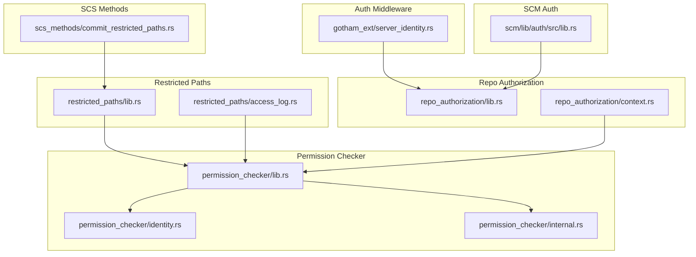
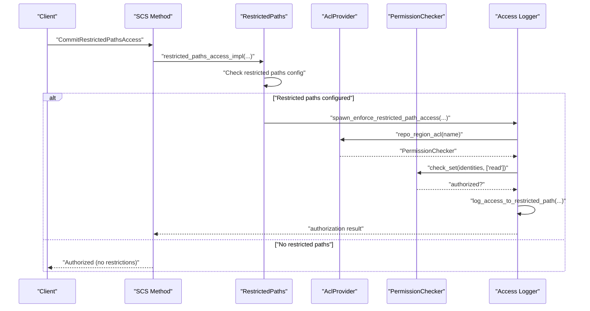
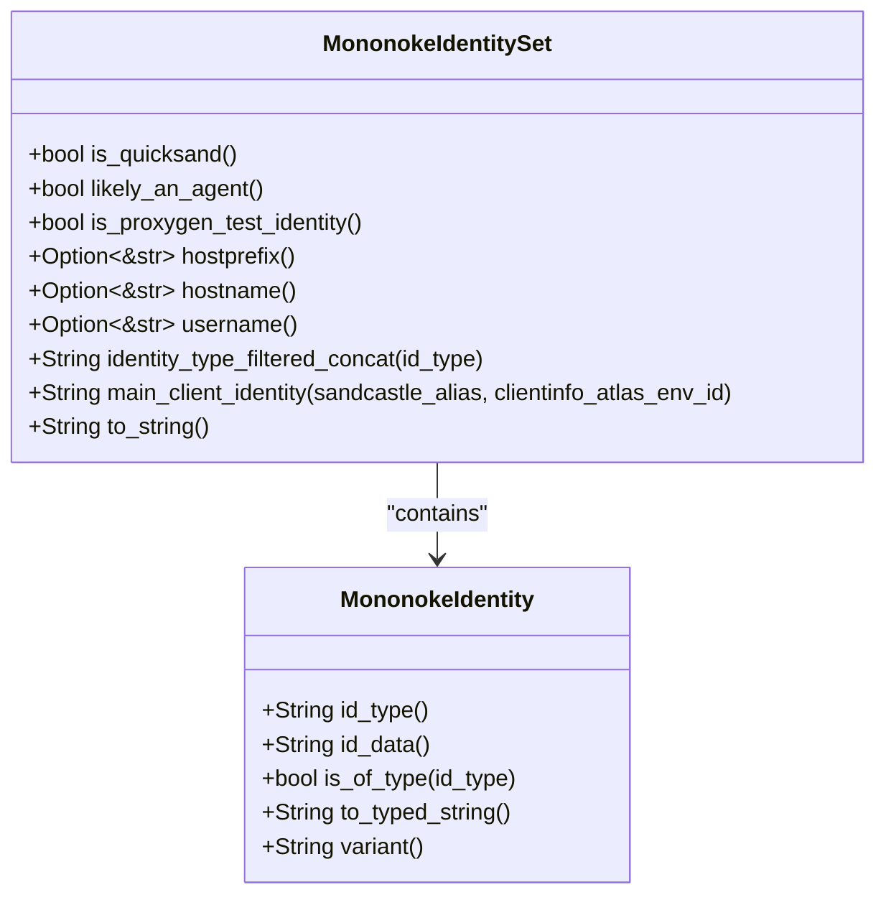
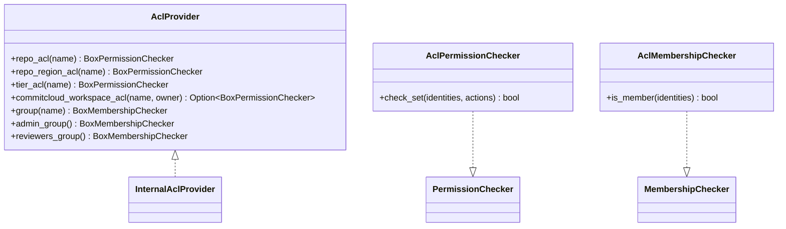
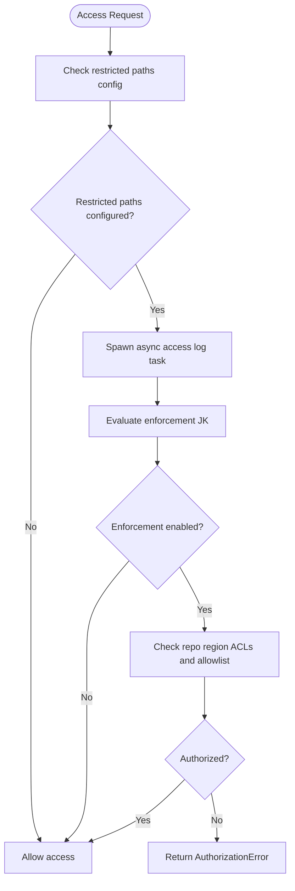
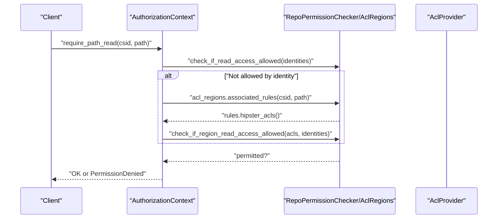
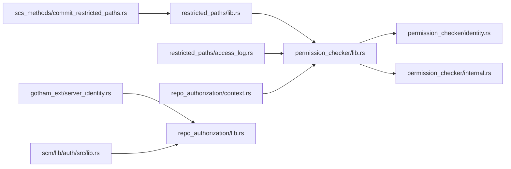

# Authentication and Access Control

<cite>
**Referenced Files in This Document**
- [identity.rs](file://eden/mononoke/common/permission_checker/src/identity.rs)
- [lib.rs](file://eden/mononoke/common/permission_checker/src/lib.rs)
- [internal.rs](file://eden/mononoke/common/permission_checker/src/internal.rs)
- [lib.rs](file://eden/mononoke/repo_attributes/restricted_paths/src/lib.rs)
- [access_log.rs](file://eden/mononoke/repo_attributes/restricted_paths/src/access_log.rs)
- [lib.rs](file://eden/mononoke/repo_authorization/src/lib.rs)
- [context.rs](file://eden/mononoke/repo_authorization/src/context.rs)
- [server_identity.rs](file://eden/mononoke/common/gotham_ext/src/middleware/server_identity.rs)
- [lib.rs](file://eden/scm/lib/auth/src/lib.rs)
- [commit_restricted_paths.rs](file://eden/mononoke/servers/scs/scs_methods/src/methods/commit_restricted_paths.rs)
</cite>

## Table of Contents
1. [Introduction](#introduction)
2. [Project Structure](#project-structure)
3. [Core Components](#core-components)
4. [Architecture Overview](#architecture-overview)
5. [Detailed Component Analysis](#detailed-component-analysis)
6. [Dependency Analysis](#dependency-analysis)
7. [Performance Considerations](#performance-considerations)
8. [Troubleshooting Guide](#troubleshooting-guide)
9. [Conclusion](#conclusion)
10. [Appendices](#appendices)

## Introduction
This document describes Mononoke’s authentication and access control systems. It focuses on how user identity is modeled, how tokens and identities are validated, and how permissions are enforced across repositories and paths. It covers:
- Identity representation and identity sets
- ACL providers and permission checkers
- Role-based and group-based access control
- Repository-level and path-level restrictions
- Audit logging and security monitoring
- Enforcement of restricted paths and commit restrictions
- Integration points for external authentication and SSO

## Project Structure
Mononoke organizes authentication and access control across several crates:
- Permission checker: identity modeling, ACL provider, and permission checking logic
- Restricted paths: repository-level path restrictions, enforcement, and logging
- Repo authorization: high-level authorization contexts and checks for repo-wide operations
- SCS methods: server-side enforcement for restricted path commit operations
- Auth middleware: HTTP server identity propagation and headers
- SCM auth: authentication library for external integrations

**Diagram sources**
- [lib.rs:1-42](file://eden/mononoke/common/permission_checker/src/lib.rs#L1-L42)
- [identity.rs:1-244](file://eden/mononoke/common/permission_checker/src/identity.rs#L1-L244)
- [internal.rs:1-204](file://eden/mononoke/common/permission_checker/src/internal.rs#L1-L204)
- [lib.rs:1-800](file://eden/mononoke/repo_attributes/restricted_paths/src/lib.rs#L1-L800)
- [access_log.rs:1-418](file://eden/mononoke/repo_attributes/restricted_paths/src/access_log.rs#L1-L418)
- [lib.rs:1-16](file://eden/mononoke/repo_authorization/src/lib.rs#L1-L16)
- [context.rs:1-885](file://eden/mononoke/repo_authorization/src/context.rs#L1-L885)
- [commit_restricted_paths.rs:1-42](file://eden/mononoke/servers/scs/scs_methods/src/methods/commit_restricted_paths.rs#L1-L42)
- [server_identity.rs:1-83](file://eden/mononoke/common/gotham_ext/src/middleware/server_identity.rs#L1-L83)
- [lib.rs](file://eden/scm/lib/auth/src/lib.rs)

**Section sources**
- [lib.rs:1-42](file://eden/mononoke/common/permission_checker/src/lib.rs#L1-L42)
- [lib.rs:1-800](file://eden/mononoke/repo_attributes/restricted_paths/src/lib.rs#L1-L800)
- [lib.rs:1-16](file://eden/mononoke/repo_authorization/src/lib.rs#L1-L16)
- [context.rs:1-885](file://eden/mononoke/repo_authorization/src/context.rs#L1-L885)
- [commit_restricted_paths.rs:1-42](file://eden/mononoke/servers/scs/scs_methods/src/methods/commit_restricted_paths.rs#L1-L42)
- [server_identity.rs:1-83](file://eden/mononoke/common/gotham_ext/src/middleware/server_identity.rs#L1-L83)
- [lib.rs](file://eden/scm/lib/auth/src/lib.rs)

## Core Components
- Identity and identity sets: a unified identity model supports both type/data tuples and authenticated identities, with utilities to filter and compose identities.
- ACL provider and permission checker: a pluggable ACL provider exposes permission checkers for repos, repo regions, tiers, and workspaces, plus membership checkers for groups.
- Restricted paths: enforces repository-level and path-level restrictions, logs access, and optionally enforces access based on configurable conditions.
- Repo authorization: constructs authorization contexts from session metadata and enforces repo-wide read/write/draft/bookmark operations.
- SCS methods: server-side enforcement for restricted path commit operations.
- Auth middleware: propagates server identity and task metadata via HTTP headers.

**Section sources**
- [identity.rs:27-126](file://eden/mononoke/common/permission_checker/src/identity.rs#L27-L126)
- [internal.rs:26-144](file://eden/mononoke/common/permission_checker/src/internal.rs#L26-L144)
- [lib.rs:90-162](file://eden/mononoke/repo_attributes/restricted_paths/src/lib.rs#L90-L162)
- [context.rs:35-113](file://eden/mononoke/repo_authorization/src/context.rs#L35-L113)
- [commit_restricted_paths.rs:22-42](file://eden/mononoke/servers/scs/scs_methods/src/methods/commit_restricted_paths.rs#L22-L42)
- [server_identity.rs:21-83](file://eden/mononoke/common/gotham_ext/src/middleware/server_identity.rs#L21-L83)

## Architecture Overview
Mononoke’s access control architecture combines identity modeling, ACL-based permission checks, and enforcement at multiple layers:
- Identity ingestion and enrichment occur via session metadata and optional authenticated identity providers.
- ACL providers supply permission checkers for repositories, regions, tiers, and workspaces, and membership checkers for groups.
- Restricted paths enforce repository-level and path-level restrictions, logging access and optionally enforcing access based on feature switches.
- Repo authorization contexts translate session trust and roles into granular permission checks for reads, drafts, writes, and special operations.
- SCS methods enforce restricted path policies during commit operations.
- Auth middleware enriches HTTP responses with server/task metadata for observability.

**Diagram sources**
- [commit_restricted_paths.rs:22-42](file://eden/mononoke/servers/scs/scs_methods/src/methods/commit_restricted_paths.rs#L22-L42)
- [lib.rs:677-731](file://eden/mononoke/repo_attributes/restricted_paths/src/lib.rs#L677-L731)
- [access_log.rs:39-67](file://eden/mononoke/repo_attributes/restricted_paths/src/access_log.rs#L39-L67)

**Section sources**
- [commit_restricted_paths.rs:22-42](file://eden/mononoke/servers/scs/scs_methods/src/methods/commit_restricted_paths.rs#L22-L42)
- [lib.rs:677-731](file://eden/mononoke/repo_attributes/restricted_paths/src/lib.rs#L677-L731)
- [access_log.rs:39-67](file://eden/mononoke/repo_attributes/restricted_paths/src/access_log.rs#L39-L67)

## Detailed Component Analysis

### Identity and Identity Sets
- Identity variants:
  - TypeData: id_type and id_data tuple
  - Authenticated: authenticated identity with nested identity and optional attributes
- Identity equality and hashing are based on id_type and id_data, enabling efficient set operations.
- Utilities:
  - Filtering by identity type
  - Extracting host/hostname/username
  - Composing a main client identity from multiple identities
  - Serialization and parsing

**Diagram sources**
- [identity.rs:27-126](file://eden/mononoke/common/permission_checker/src/identity.rs#L27-L126)
- [identity.rs:167-187](file://eden/mononoke/common/permission_checker/src/identity.rs#L167-L187)

**Section sources**
- [identity.rs:27-126](file://eden/mononoke/common/permission_checker/src/identity.rs#L27-L126)
- [identity.rs:167-187](file://eden/mononoke/common/permission_checker/src/identity.rs#L167-L187)

### ACL Provider and Permission Checker
- Internal ACL provider:
  - Stores ACLs by repos, repo_regions, tiers, workspaces, and groups
  - Provides permission checkers for actions and membership checkers for groups
- Permission checker:
  - Supports allow-all and allow-list builders
  - Evaluates first matching action and checks intersection with identity set
- Membership checker:
  - Determines group membership via set disjointness

**Diagram sources**
- [internal.rs:26-144](file://eden/mononoke/common/permission_checker/src/internal.rs#L26-L144)
- [lib.rs:19-42](file://eden/mononoke/common/permission_checker/src/lib.rs#L19-L42)

**Section sources**
- [internal.rs:26-144](file://eden/mononoke/common/permission_checker/src/internal.rs#L26-L144)
- [lib.rs:19-42](file://eden/mononoke/common/permission_checker/src/lib.rs#L19-L42)

### Restricted Paths Enforcement and Logging
- Restricted paths configuration:
  - Config-based or ACL manifest-based lookup
  - Exact path restriction and ancestor-aware restriction queries
  - Enforces conditional enforcement via configured ACLs
- Access logging:
  - Reads manifest ID caches or falls back to DB queries
  - Logs access to Scuba and optionally to a schematized logger (fbcode_build)
  - Checks authorization via repo region ACLs and tooling allowlist groups
- Enforcement helpers:
  - Fire-and-forget logging tasks with optional enforcement gating
  - Manifest and path-based access enforcement

**Diagram sources**
- [lib.rs:677-731](file://eden/mononoke/repo_attributes/restricted_paths/src/lib.rs#L677-L731)
- [access_log.rs:290-366](file://eden/mononoke/repo_attributes/restricted_paths/src/access_log.rs#L290-L366)

**Section sources**
- [lib.rs:90-162](file://eden/mononoke/repo_attributes/restricted_paths/src/lib.rs#L90-L162)
- [lib.rs:335-436](file://eden/mononoke/repo_attributes/restricted_paths/src/lib.rs#L335-L436)
- [lib.rs:677-731](file://eden/mononoke/repo_attributes/restricted_paths/src/lib.rs#L677-L731)
- [access_log.rs:39-67](file://eden/mononoke/repo_attributes/restricted_paths/src/access_log.rs#L39-L67)
- [access_log.rs:368-418](file://eden/mononoke/repo_attributes/restricted_paths/src/access_log.rs#L368-L418)

### Repo Authorization Contexts and Operations
- AuthorizationContext:
  - FullAccess, Identity, ReadOnlyIdentity, DraftOnlyIdentity, Service
  - Determined from session metadata (readonly, untrusted, service identity)
- Checks:
  - Full repo read and metadata read (including region read access)
  - Path read using associated ACL rules
  - Full repo draft and repo write with tunable enforcement
  - Any path write and changeset path write
  - Bookmark modification and special operations (git import, mirror upload)
  - Commit cloud workspace operations and mirror upload operations
- Outcomes:
  - AuthorizationCheckOutcome with permitted_or_else for ergonomic error handling

**Diagram sources**
- [context.rs:215-258](file://eden/mononoke/repo_authorization/src/context.rs#L215-L258)

**Section sources**
- [context.rs:35-113](file://eden/mononoke/repo_authorization/src/context.rs#L35-L113)
- [context.rs:140-213](file://eden/mononoke/repo_authorization/src/context.rs#L140-L213)
- [context.rs:215-258](file://eden/mononoke/repo_authorization/src/context.rs#L215-L258)
- [context.rs:300-372](file://eden/mononoke/repo_authorization/src/context.rs#L300-L372)
- [context.rs:374-426](file://eden/mononoke/repo_authorization/src/context.rs#L374-L426)
- [context.rs:428-558](file://eden/mononoke/repo_authorization/src/context.rs#L428-L558)
- [context.rs:560-618](file://eden/mononoke/repo_authorization/src/context.rs#L560-L618)
- [context.rs:620-794](file://eden/mononoke/repo_authorization/src/context.rs#L620-L794)
- [context.rs:846-885](file://eden/mononoke/repo_authorization/src/context.rs#L846-L885)

### SCS Methods for Restricted Path Commit Enforcement
- CommitRestrictedPathsAccessResponse:
  - Indicates whether paths are restricted, whether caller has access, and returns authorized paths when requested
- Implementation:
  - Short-circuits when no restricted paths are configured
  - Otherwise evaluates restrictions and returns coverage and authorized paths

**Section sources**
- [commit_restricted_paths.rs:22-42](file://eden/mononoke/servers/scs/scs_methods/src/methods/commit_restricted_paths.rs#L22-L42)

### Auth Middleware and Server Identity Propagation
- ServerIdentityMiddleware:
  - Adds server identity and task metadata headers to outbound responses
  - Includes TW task, version, and canary identifiers when available
  - Ensures X-Request-ID is propagated

**Section sources**
- [server_identity.rs:21-83](file://eden/mononoke/common/gotham_ext/src/middleware/server_identity.rs#L21-L83)

### External Authentication and SSO Integration
- SCM auth library:
  - Provides authentication primitives and integration points for external systems
- Authenticated identity support:
  - Identity model supports authenticated identities with attributes
- Integration patterns:
  - Session metadata carries identities; ACL checks use identity sets
  - Tooling allowlist groups enable exceptions for automated tools

**Section sources**
- [lib.rs](file://eden/scm/lib/auth/src/lib.rs)
- [identity.rs:22-31](file://eden/mononoke/common/permission_checker/src/identity.rs#L22-L31)
- [access_log.rs:103-116](file://eden/mononoke/repo_attributes/restricted_paths/src/access_log.rs#L103-L116)

## Dependency Analysis
- Permission checker depends on identity and internal ACL provider abstractions
- Restricted paths depends on permission checker and Scuba/Hive logging
- Repo authorization depends on permission checker and repo-specific configuration
- SCS methods depend on restricted paths for commit-time enforcement
- Auth middleware integrates with HTTP pipeline for observability

**Diagram sources**
- [lib.rs:1-42](file://eden/mononoke/common/permission_checker/src/lib.rs#L1-L42)
- [identity.rs:1-244](file://eden/mononoke/common/permission_checker/src/identity.rs#L1-L244)
- [internal.rs:1-204](file://eden/mononoke/common/permission_checker/src/internal.rs#L1-L204)
- [lib.rs:1-800](file://eden/mononoke/repo_attributes/restricted_paths/src/lib.rs#L1-L800)
- [access_log.rs:1-418](file://eden/mononoke/repo_attributes/restricted_paths/src/access_log.rs#L1-L418)
- [lib.rs:1-16](file://eden/mononoke/repo_authorization/src/lib.rs#L1-L16)
- [context.rs:1-885](file://eden/mononoke/repo_authorization/src/context.rs#L1-L885)
- [commit_restricted_paths.rs:1-42](file://eden/mononoke/servers/scs/scs_methods/src/methods/commit_restricted_paths.rs#L1-L42)
- [server_identity.rs:1-83](file://eden/mononoke/common/gotham_ext/src/middleware/server_identity.rs#L1-L83)
- [lib.rs](file://eden/scm/lib/auth/src/lib.rs)

**Section sources**
- [lib.rs:1-42](file://eden/mononoke/common/permission_checker/src/lib.rs#L1-L42)
- [lib.rs:1-800](file://eden/mononoke/repo_attributes/restricted_paths/src/lib.rs#L1-L800)
- [lib.rs:1-16](file://eden/mononoke/repo_authorization/src/lib.rs#L1-L16)
- [context.rs:1-885](file://eden/mononoke/repo_authorization/src/context.rs#L1-L885)
- [commit_restricted_paths.rs:1-42](file://eden/mononoke/servers/scs/scs_methods/src/methods/commit_restricted_paths.rs#L1-L42)
- [server_identity.rs:1-83](file://eden/mononoke/common/gotham_ext/src/middleware/server_identity.rs#L1-L83)
- [lib.rs](file://eden/scm/lib/auth/src/lib.rs)

## Performance Considerations
- Concurrent membership checks: group membership checks are executed concurrently to reduce latency.
- Buffered manifest traversals: ACL manifest lookups use buffered streams to parallelize blobstore operations.
- Feature-gated enforcement: enforcement and logging are controlled by justknobs switches to avoid overhead when disabled.
- Identity filtering: identity sets and filters minimize redundant checks by leveraging identity composition utilities.

[No sources needed since this section provides general guidance]

## Troubleshooting Guide
- Access denied to restricted path:
  - Verify restricted paths configuration and ACL manifest derivation
  - Check enforcement JK and conditional enforcement ACLs
  - Review access logs for authorization decisions and tooling allowlist status
- Permission denied errors:
  - Inspect AuthorizationContext construction and outcomes
  - Validate repo ACLs and region ACLs for the requested operation
- Logging issues:
  - Confirm Scuba sampling and schema logger toggles
  - Ensure manifest ID cache availability or fallback DB queries are functioning

**Section sources**
- [lib.rs:677-731](file://eden/mononoke/repo_attributes/restricted_paths/src/lib.rs#L677-L731)
- [access_log.rs:290-366](file://eden/mononoke/repo_attributes/restricted_paths/src/access_log.rs#L290-L366)
- [context.rs:846-885](file://eden/mononoke/repo_authorization/src/context.rs#L846-L885)

## Conclusion
Mononoke’s authentication and access control system centers on a flexible identity model, pluggable ACL providers, and layered enforcement across repositories and paths. It supports robust audit logging, conditional enforcement, and integration with external authentication systems. The design emphasizes concurrency, configurability, and observability to meet enterprise-grade security and compliance needs.

[No sources needed since this section summarizes without analyzing specific files]

## Appendices

### Example Workflows

#### Restricted Path Access Enforcement
- Evaluate restricted paths configuration
- Spawn asynchronous access logging
- Check enforcement switches and conditional ACLs
- Authorize via repo region ACLs or tooling allowlist
- Log access and return authorization result

**Section sources**
- [lib.rs:677-731](file://eden/mononoke/repo_attributes/restricted_paths/src/lib.rs#L677-L731)
- [access_log.rs:290-366](file://eden/mononoke/repo_attributes/restricted_paths/src/access_log.rs#L290-L366)

#### Repo-Wide Write Authorization
- Construct AuthorizationContext from session metadata
- Check tunable draft and write access
- Validate service write permissions and method allowances
- Return permitted or denied outcome with error details

**Section sources**
- [context.rs:300-372](file://eden/mononoke/repo_authorization/src/context.rs#L300-L372)
- [context.rs:374-426](file://eden/mononoke/repo_authorization/src/context.rs#L374-L426)
- [context.rs:428-558](file://eden/mononoke/repo_authorization/src/context.rs#L428-L558)