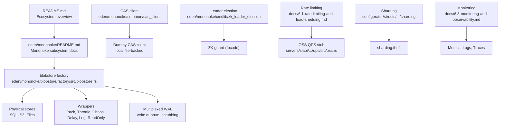
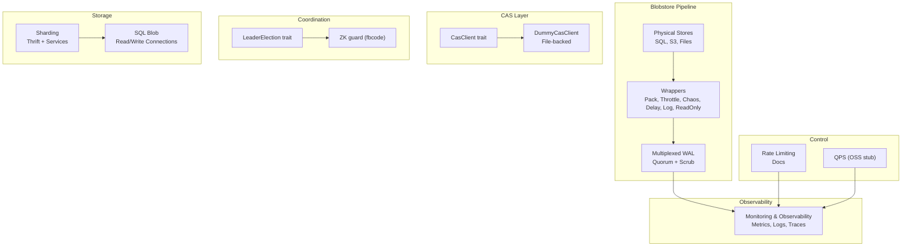
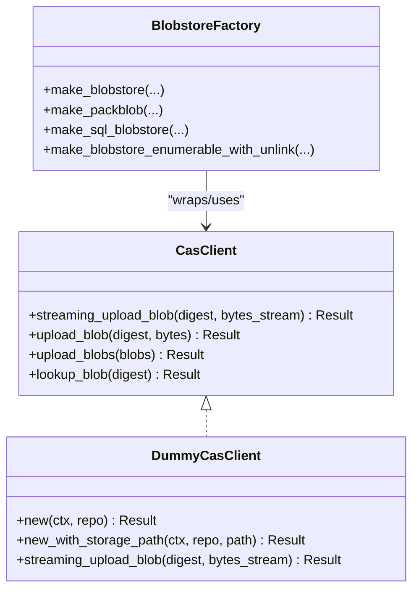
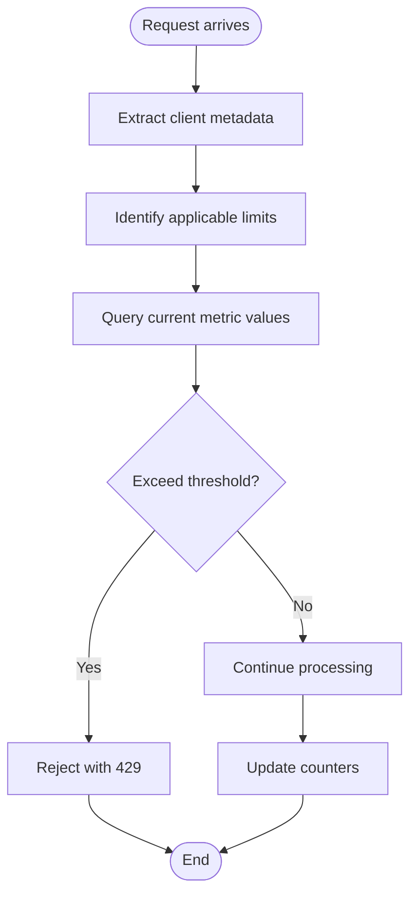
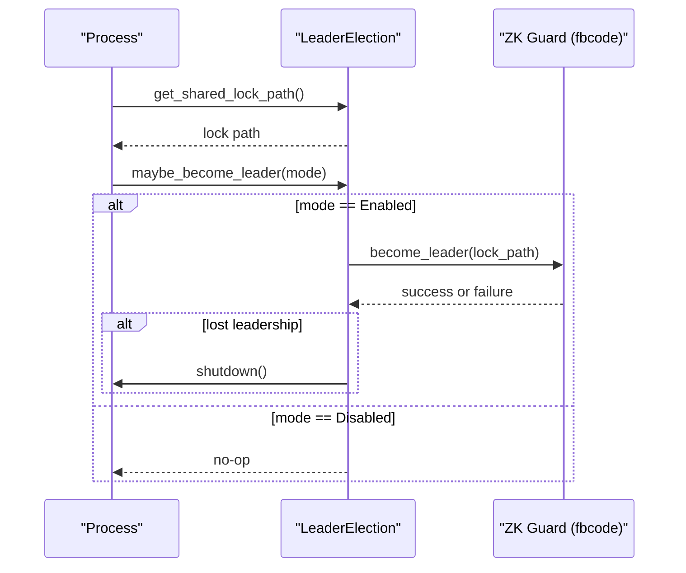
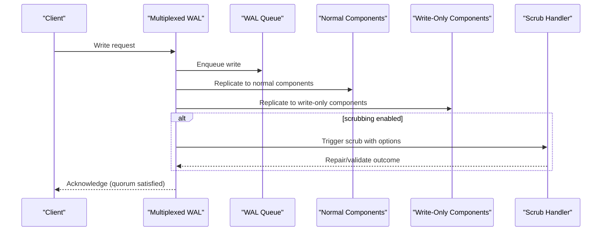
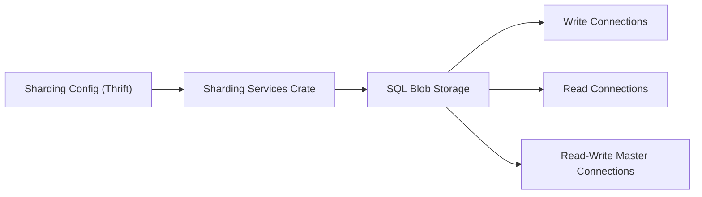
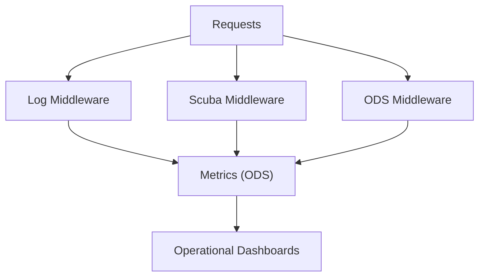
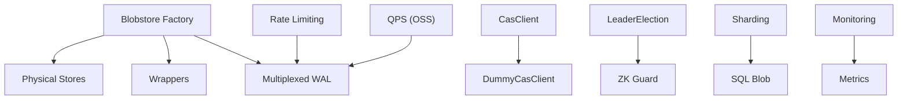

# Distributed Operations

<cite>
**Referenced Files in This Document**
- [README.md](file://README.md)
- [eden/mononoke/README.md](file://eden/mononoke/README.md)
- [eden/mononoke/blobstore/factory/src/blobstore.rs](file://eden/mononoke/blobstore/factory/src/blobstore.rs)
- [eden/mononoke/common/cas_client/client/lib.rs](file://eden/mononoke/common/cas_client/client/lib.rs)
- [eden/mononoke/common/cas_client/client/dummy.rs](file://eden/mononoke/common/cas_client/client/dummy.rs)
- [eden/mononoke/cmdlib/zk_leader_election/src/lib.rs](file://eden/mononoke/cmdlib/zk_leader_election/src/lib.rs)
- [eden/mononoke/docs/6.1-rate-limiting-and-load-shedding.md](file://eden/mononoke/docs/6.1-rate-limiting-and-load-shedding.md)
- [eden/mononoke/servers/slapi/slapi_server/qps/src/oss.rs](file://eden/mononoke/servers/slapi/slapi_server/qps/src/oss.rs)
- [configerator/structs/scm/mononoke/sharding/sharding.thrift](file://configerator/structs/scm/mononoke/sharding/sharding.thrift)
- [configerator/structs/scm/mononoke/sharding/sharding/Cargo.toml](file://configerator/structs/scm/mononoke/sharding/sharding/Cargo.toml)
- [configerator/structs/scm/mononoke/sharding/sharding/services/Cargo.toml](file://configerator/structs/scm/mononoke/sharding/sharding/services/Cargo.toml)
- [eden/mononoke/blobstore/sqlblob/src/lib.rs](file://eden/mononoke/blobstore/sqlblob/src/lib.rs)
- [eden/mononoke/docs/6.3-monitoring-and-observability.md](file://eden/mononoke/docs/6.3-monitoring-and-observability.md)
</cite>

## Table of Contents
1. [Introduction](#introduction)
2. [Project Structure](#project-structure)
3. [Core Components](#core-components)
4. [Architecture Overview](#architecture-overview)
5. [Detailed Component Analysis](#detailed-component-analysis)
6. [Dependency Analysis](#dependency-analysis)
7. [Performance Considerations](#performance-considerations)
8. [Troubleshooting Guide](#troubleshooting-guide)
9. [Conclusion](#conclusion)
10. [Appendices](#appendices)

## Introduction
This document explains Mononoke’s distributed operations and storage systems with a focus on content-addressable storage (CAS), blob management, distributed caching strategies, load balancing and rate control, distributed coordination (leader election), replication and failure recovery, sharding/partitioning, and operational monitoring. It synthesizes the repository’s distributed subsystems into a coherent guide for both technical and non-technical readers.

## Project Structure
Mononoke is the server-side component of the Sapling SCM ecosystem. The repository includes:
- A high-level overview of the ecosystem and Mononoke’s role
- A dedicated Mononoke README describing subsystem documentation pointers
- A blobstore factory that composes physical and wrapper stores (SQL, S3, file-backed, packblob, multiplexed WAL, throttled, chaos, delayed)
- CAS client abstractions and a dummy implementation for local testing
- Leader election utilities (Zookeeper-based in fbcode builds)
- Rate limiting and QPS tracking documentation and OSS stubs
- Sharding configuration structures and service crates
- SQL blob storage with sharding support
- Monitoring and observability documentation

**Diagram sources**
- [README.md:14-58](file://README.md#L14-L58)
- [eden/mononoke/README.md:28-35](file://eden/mononoke/README.md#L28-L35)
- [eden/mononoke/blobstore/factory/src/blobstore.rs:451-627](file://eden/mononoke/blobstore/factory/src/blobstore.rs#L451-L627)
- [eden/mononoke/common/cas_client/client/dummy.rs:30-83](file://eden/mononoke/common/cas_client/client/dummy.rs#L30-L83)
- [eden/mononoke/cmdlib/zk_leader_election/src/lib.rs:21-53](file://eden/mononoke/cmdlib/zk_leader_election/src/lib.rs#L21-L53)
- [eden/mononoke/docs/6.1-rate-limiting-and-load-shedding.md:83-105](file://eden/mononoke/docs/6.1-rate-limiting-and-load-shedding.md#L83-L105)
- [eden/mononoke/servers/slapi/slapi_server/qps/src/oss.rs:11-25](file://eden/mononoke/servers/slapi/slapi_server/qps/src/oss.rs#L11-L25)
- [configerator/structs/scm/mononoke/sharding/sharding.thrift:15-32](file://configerator/structs/scm/mononoke/sharding/sharding.thrift#L15-L32)
- [eden/mononoke/docs/6.3-monitoring-and-observability.md:1-377](file://eden/mononoke/docs/6.3-monitoring-and-observability.md#L1-L377)

**Section sources**
- [README.md:14-58](file://README.md#L14-L58)
- [eden/mononoke/README.md:28-35](file://eden/mononoke/README.md#L28-L35)

## Core Components
- Blobstore factory: Composes physical and wrapper stores, supports sharding, multiplexing, throttling, logging, and scrubbing.
- CAS client: Abstraction for uploading and checking presence of content-addressed blobs; includes a dummy implementation for local testing.
- Leader election: Trait and modes for coordinating a single leader, with ZK guard integration in fbcode builds.
- Rate limiting and QPS: Documentation of request flow and configuration; OSS provides a minimal QPS stub.
- Sharding: Thrift structures and service crates for sharding configuration and runtime behavior.
- SQL blob storage: Supports unsharded and sharded MySQL tiers with separate read/write connections.
- Monitoring: Metrics, logs, tracing, health checks, and operational dashboards.

**Section sources**
- [eden/mononoke/blobstore/factory/src/blobstore.rs:451-627](file://eden/mononoke/blobstore/factory/src/blobstore.rs#L451-L627)
- [eden/mononoke/common/cas_client/client/lib.rs:24-38](file://eden/mononoke/common/cas_client/client/lib.rs#L24-L38)
- [eden/mononoke/common/cas_client/client/dummy.rs:30-83](file://eden/mononoke/common/cas_client/client/dummy.rs#L30-L83)
- [eden/mononoke/cmdlib/zk_leader_election/src/lib.rs:21-53](file://eden/mononoke/cmdlib/zk_leader_election/src/lib.rs#L21-L53)
- [eden/mononoke/docs/6.1-rate-limiting-and-load-shedding.md:83-105](file://eden/mononoke/docs/6.1-rate-limiting-and-load-shedding.md#L83-L105)
- [eden/mononoke/servers/slapi/slapi_server/qps/src/oss.rs:11-25](file://eden/mononoke/servers/slapi/slapi_server/qps/src/oss.rs#L11-L25)
- [configerator/structs/scm/mononoke/sharding/sharding.thrift:15-32](file://configerator/structs/scm/mononoke/sharding/sharding.thrift#L15-L32)
- [eden/mononoke/blobstore/sqlblob/src/lib.rs:163-203](file://eden/mononoke/blobstore/sqlblob/src/lib.rs#L163-L203)
- [eden/mononoke/docs/6.3-monitoring-and-observability.md:1-377](file://eden/mononoke/docs/6.3-monitoring-and-observability.md#L1-L377)

## Architecture Overview
Mononoke’s distributed architecture centers around a configurable blobstore pipeline:
- Physical stores: SQL (SQLite/MySQL), S3, and file-backed stores.
- Wrappers: Packblob (compression), ThrottledBlob (QPS limiting), ChaosBlobstore (fault injection), DelayedBlobstore (latency injection), LogBlob (telemetry), ReadOnlyBlobstore (read-only mode).
- Multiplexed WAL: Distributes writes across multiple blobstores with a write quorum and optional scrubbing.
- CAS client: Provides a uniform interface for CAS uploads and lookups, with a dummy implementation for local testing.
- Coordination: Leader election trait with ZK guard integration in fbcode builds.
- Rate control: Request-level rate limiting and QPS tracking.
- Sharding: Configuration-driven sharding for MySQL blob storage.
- Monitoring: Metrics, logs, tracing, and health checks.

**Diagram sources**
- [eden/mononoke/blobstore/factory/src/blobstore.rs:451-627](file://eden/mononoke/blobstore/factory/src/blobstore.rs#L451-L627)
- [eden/mononoke/common/cas_client/client/lib.rs:24-38](file://eden/mononoke/common/cas_client/client/lib.rs#L24-L38)
- [eden/mononoke/common/cas_client/client/dummy.rs:30-83](file://eden/mononoke/common/cas_client/client/dummy.rs#L30-L83)
- [eden/mononoke/cmdlib/zk_leader_election/src/lib.rs:21-53](file://eden/mononoke/cmdlib/zk_leader_election/src/lib.rs#L21-L53)
- [eden/mononoke/docs/6.1-rate-limiting-and-load-shedding.md:83-105](file://eden/mononoke/docs/6.1-rate-limiting-and-load-shedding.md#L83-L105)
- [eden/mononoke/servers/slapi/slapi_server/qps/src/oss.rs:11-25](file://eden/mononoke/servers/slapi/slapi_server/qps/src/oss.rs#L11-L25)
- [configerator/structs/scm/mononoke/sharding/sharding.thrift:15-32](file://configerator/structs/scm/mononoke/sharding/sharding.thrift#L15-L32)
- [eden/mononoke/blobstore/sqlblob/src/lib.rs:163-203](file://eden/mononoke/blobstore/sqlblob/src/lib.rs#L163-L203)
- [eden/mononoke/docs/6.3-monitoring-and-observability.md:1-377](file://eden/mononoke/docs/6.3-monitoring-and-observability.md#L1-L377)

## Detailed Component Analysis

### Content-Addressable Storage (CAS) and Blob Management
- CAS client abstraction defines upload, batch upload, and lookup operations for blobs addressed by digests.
- Dummy CAS client stores blobs in a local file-backed store under a repository-scoped directory, using an “if absent” put behavior suitable for testing and isolation.
- Blobstore factory composes physical stores (SQL, S3, Files) and wrappers (Pack, Throttle, Chaos, Delay, Log, ReadOnly) to form a robust pipeline supporting compression, rate control, fault injection, and telemetry.

**Diagram sources**
- [eden/mononoke/common/cas_client/client/lib.rs:24-38](file://eden/mononoke/common/cas_client/client/lib.rs#L24-L38)
- [eden/mononoke/common/cas_client/client/dummy.rs:30-83](file://eden/mononoke/common/cas_client/client/dummy.rs#L30-L83)
- [eden/mononoke/blobstore/factory/src/blobstore.rs:451-627](file://eden/mononoke/blobstore/factory/src/blobstore.rs#L451-L627)

**Section sources**
- [eden/mononoke/common/cas_client/client/lib.rs:24-38](file://eden/mononoke/common/cas_client/client/lib.rs#L24-L38)
- [eden/mononoke/common/cas_client/client/dummy.rs:30-83](file://eden/mononoke/common/cas_client/client/dummy.rs#L30-L83)
- [eden/mononoke/blobstore/factory/src/blobstore.rs:451-627](file://eden/mononoke/blobstore/factory/src/blobstore.rs#L451-L627)

### Distributed Caching Strategies
- The blobstore factory supports a configurable cache backend via options, enabling caching strategies at the blobstore layer.
- Wrappers like ThrottledBlob, ChaosBlobstore, DelayedBlobstore, and LogBlob can be layered to tune performance and reliability characteristics.
- PackBlob provides compression for stored blobs, reducing storage footprint and bandwidth.

**Section sources**
- [eden/mononoke/blobstore/factory/src/blobstore.rs:70-181](file://eden/mononoke/blobstore/factory/src/blobstore.rs#L70-L181)
- [eden/mononoke/blobstore/factory/src/blobstore.rs:560-627](file://eden/mononoke/blobstore/factory/src/blobstore.rs#L560-L627)

### Load Balancing Mechanisms, QPS Limiting, and Rate Control
- Rate limiting documentation outlines a middleware-driven request flow: extract client metadata, compute applicable limits, compare against thresholds, accept or reject with HTTP 429, and update counters.
- Configuration is dynamic via cached config handles and supports multiple limits with different targets and metrics.
- An OSS QPS stub exists for environments without full rate limiting infrastructure.

**Diagram sources**
- [eden/mononoke/docs/6.1-rate-limiting-and-load-shedding.md:96-105](file://eden/mononoke/docs/6.1-rate-limiting-and-load-shedding.md#L96-L105)

**Section sources**
- [eden/mononoke/docs/6.1-rate-limiting-and-load-shedding.md:83-105](file://eden/mononoke/docs/6.1-rate-limiting-and-load-shedding.md#L83-L105)
- [eden/mononoke/servers/slapi/slapi_server/qps/src/oss.rs:11-25](file://eden/mononoke/servers/slapi/slapi_server/qps/src/oss.rs#L11-L25)

### Distributed Coordination, Leader Election, and Consensus Protocols
- The LeaderElection trait defines a shared lock path and an asynchronous method to become leader, with modes Enabled and Disabled.
- In fbcode builds, ZK guard integration is used; the code includes a shutdown path to abort the process if leadership is lost to prevent split-brain scenarios.

**Diagram sources**
- [eden/mononoke/cmdlib/zk_leader_election/src/lib.rs:21-53](file://eden/mononoke/cmdlib/zk_leader_election/src/lib.rs#L21-L53)

**Section sources**
- [eden/mononoke/cmdlib/zk_leader_election/src/lib.rs:21-53](file://eden/mononoke/cmdlib/zk_leader_election/src/lib.rs#L21-L53)

### Replication Strategies and Failure Recovery
- Multiplexed WAL blobstore distributes writes across multiple blobstores with a configurable write quorum and optional scrubbing, enabling replication-like durability and repair capabilities.
- Scrubbing can be configured with actions (e.g., repair) and grace periods, and integrates with a scrub handler and sampling components.

**Diagram sources**
- [eden/mononoke/blobstore/factory/src/blobstore.rs:629-698](file://eden/mononoke/blobstore/factory/src/blobstore.rs#L629-L698)

**Section sources**
- [eden/mononoke/blobstore/factory/src/blobstore.rs:629-698](file://eden/mononoke/blobstore/factory/src/blobstore.rs#L629-L698)

### Sharding, Partitioning, and Horizontal Scaling Patterns
- Sharding configuration is defined via Thrift structures and service crates, enabling dynamic configuration and service integration.
- SQL blob storage supports unsharded and sharded MySQL deployments with separate write and read connection pools, enabling horizontal scaling and read replicas.

**Diagram sources**
- [configerator/structs/scm/mononoke/sharding/sharding.thrift:15-32](file://configerator/structs/scm/mononoke/sharding/sharding.thrift#L15-L32)
- [configerator/structs/scm/mononoke/sharding/sharding/Cargo.toml:1-35](file://configerator/structs/scm/mononoke/sharding/sharding/Cargo.toml#L1-L35)
- [configerator/structs/scm/mononoke/sharding/sharding/services/Cargo.toml:1-33](file://configerator/structs/scm/mononoke/sharding/sharding/services/Cargo.toml#L1-L33)
- [eden/mononoke/blobstore/sqlblob/src/lib.rs:163-203](file://eden/mononoke/blobstore/sqlblob/src/lib.rs#L163-L203)

**Section sources**
- [configerator/structs/scm/mononoke/sharding/sharding.thrift:15-32](file://configerator/structs/scm/mononoke/sharding/sharding.thrift#L15-L32)
- [configerator/structs/scm/mononoke/sharding/sharding/Cargo.toml:1-35](file://configerator/structs/scm/mononoke/sharding/sharding/Cargo.toml#L1-L35)
- [configerator/structs/scm/mononoke/sharding/sharding/services/Cargo.toml:1-33](file://configerator/structs/scm/mononoke/sharding/sharding/services/Cargo.toml#L1-L33)
- [eden/mononoke/blobstore/sqlblob/src/lib.rs:163-203](file://eden/mononoke/blobstore/sqlblob/src/lib.rs#L163-L203)

### Monitoring Distributed System Health, Performance Metrics, and Operational Dashboards
- Mononoke exports metrics, logs, and traces; metrics are aggregated and exported to ODS for visualization and alerting.
- Common patterns include request logging, Scuba samples, and ODS middleware for request duration and sizes.
- Operational dashboards cover service health, resource usage, feature-specific metrics, and background job status.

**Diagram sources**
- [eden/mononoke/docs/6.3-monitoring-and-observability.md:329-377](file://eden/mononoke/docs/6.3-monitoring-and-observability.md#L329-L377)

**Section sources**
- [eden/mononoke/docs/6.3-monitoring-and-observability.md:1-377](file://eden/mononoke/docs/6.3-monitoring-and-observability.md#L1-L377)

## Dependency Analysis
- Blobstore factory depends on physical store implementations (SQL, S3, Files), wrapper components (Pack, Throttle, Chaos, Delay, Log, ReadOnly), and multiplexed WAL with scrubbing.
- CAS client abstraction decouples higher-level logic from storage backends, with a dummy implementation for local testing.
- Leader election trait integrates with ZK guard in fbcode builds.
- Rate limiting and QPS tracking integrate with request middleware and configuration systems.
- Sharding configuration and service crates enable dynamic sharding behavior for SQL blob storage.
- Monitoring integrates metrics, logs, and traces across the system.

**Diagram sources**
- [eden/mononoke/blobstore/factory/src/blobstore.rs:451-627](file://eden/mononoke/blobstore/factory/src/blobstore.rs#L451-L627)
- [eden/mononoke/common/cas_client/client/lib.rs:24-38](file://eden/mononoke/common/cas_client/client/lib.rs#L24-L38)
- [eden/mononoke/common/cas_client/client/dummy.rs:30-83](file://eden/mononoke/common/cas_client/client/dummy.rs#L30-L83)
- [eden/mononoke/cmdlib/zk_leader_election/src/lib.rs:21-53](file://eden/mononoke/cmdlib/zk_leader_election/src/lib.rs#L21-L53)
- [eden/mononoke/docs/6.1-rate-limiting-and-load-shedding.md:83-105](file://eden/mononoke/docs/6.1-rate-limiting-and-load-shedding.md#L83-L105)
- [eden/mononoke/servers/slapi/slapi_server/qps/src/oss.rs:11-25](file://eden/mononoke/servers/slapi/slapi_server/qps/src/oss.rs#L11-L25)
- [configerator/structs/scm/mononoke/sharding/sharding.thrift:15-32](file://configerator/structs/scm/mononoke/sharding/sharding.thrift#L15-L32)
- [eden/mononoke/blobstore/sqlblob/src/lib.rs:163-203](file://eden/mononoke/blobstore/sqlblob/src/lib.rs#L163-L203)
- [eden/mononoke/docs/6.3-monitoring-and-observability.md:1-377](file://eden/mononoke/docs/6.3-monitoring-and-observability.md#L1-L377)

**Section sources**
- [eden/mononoke/blobstore/factory/src/blobstore.rs:451-627](file://eden/mononoke/blobstore/factory/src/blobstore.rs#L451-L627)
- [eden/mononoke/common/cas_client/client/lib.rs:24-38](file://eden/mononoke/common/cas_client/client/lib.rs#L24-L38)
- [eden/mononoke/common/cas_client/client/dummy.rs:30-83](file://eden/mononoke/common/cas_client/client/dummy.rs#L30-L83)
- [eden/mononoke/cmdlib/zk_leader_election/src/lib.rs:21-53](file://eden/mononoke/cmdlib/zk_leader_election/src/lib.rs#L21-L53)
- [eden/mononoke/docs/6.1-rate-limiting-and-load-shedding.md:83-105](file://eden/mononoke/docs/6.1-rate-limiting-and-load-shedding.md#L83-L105)
- [eden/mononoke/servers/slapi/slapi_server/qps/src/oss.rs:11-25](file://eden/mononoke/servers/slapi/slapi_server/qps/src/oss.rs#L11-L25)
- [configerator/structs/scm/mononoke/sharding/sharding.thrift:15-32](file://configerator/structs/scm/mononoke/sharding/sharding.thrift#L15-L32)
- [eden/mononoke/blobstore/sqlblob/src/lib.rs:163-203](file://eden/mononoke/blobstore/sqlblob/src/lib.rs#L163-L203)
- [eden/mononoke/docs/6.3-monitoring-and-observability.md:1-377](file://eden/mononoke/docs/6.3-monitoring-and-observability.md#L1-L377)

## Performance Considerations
- Use PackBlob to compress blobs and reduce storage and transfer costs.
- Apply ThrottledBlob to cap QPS and prevent overload during spikes.
- Employ ReadOnlyBlobstore to offload reads and improve throughput.
- Utilize multiplexed WAL with appropriate write quorum to balance durability and latency.
- Separate read/write connections and leverage read replicas for SQL blob storage to scale reads horizontally.
- Monitor histograms and percentiles to detect tail latency and adjust configurations accordingly.

[No sources needed since this section provides general guidance]

## Troubleshooting Guide
- If leadership is lost unexpectedly in fbcode builds, the process terminates to prevent split-brain; investigate ZK connectivity and lock paths.
- Rate limiting rejects requests with HTTP 429 when thresholds are exceeded; verify limit configurations and client metadata extraction.
- For multiplexed WAL, confirm write quorum satisfaction and scrubbing outcomes; inspect scrub handler logs and grace periods.
- Use Scuba samples and ODS metrics to trace request lifecycles and identify bottlenecks.

**Section sources**
- [eden/mononoke/cmdlib/zk_leader_election/src/lib.rs:40-46](file://eden/mononoke/cmdlib/zk_leader_election/src/lib.rs#L40-L46)
- [eden/mononoke/docs/6.1-rate-limiting-and-load-shedding.md:96-105](file://eden/mononoke/docs/6.1-rate-limiting-and-load-shedding.md#L96-L105)
- [eden/mononoke/blobstore/factory/src/blobstore.rs:672-698](file://eden/mononoke/blobstore/factory/src/blobstore.rs#L672-L698)
- [eden/mononoke/docs/6.3-monitoring-and-observability.md:329-377](file://eden/mononoke/docs/6.3-monitoring-and-observability.md#L329-L377)

## Conclusion
Mononoke’s distributed operations combine a flexible blobstore factory, CAS abstractions, leader election, rate control, sharding, and comprehensive monitoring. Together, these components enable scalable, observable, and resilient storage and coordination for large-scale source control workloads.

[No sources needed since this section summarizes without analyzing specific files]

## Appendices
- Additional subsystem documentation pointers are available in the Mononoke README, including integration tests, packblob storage, and graph walker.

**Section sources**
- [eden/mononoke/README.md:28-35](file://eden/mononoke/README.md#L28-L35)