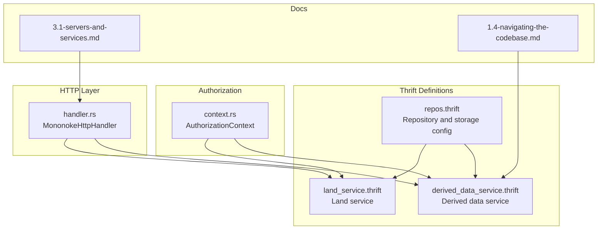
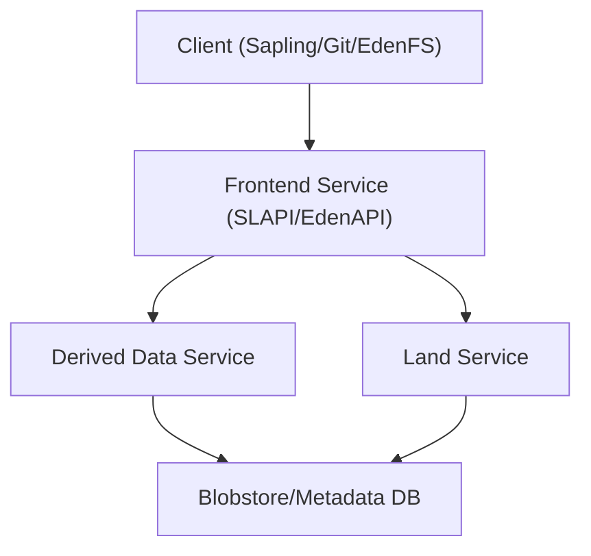
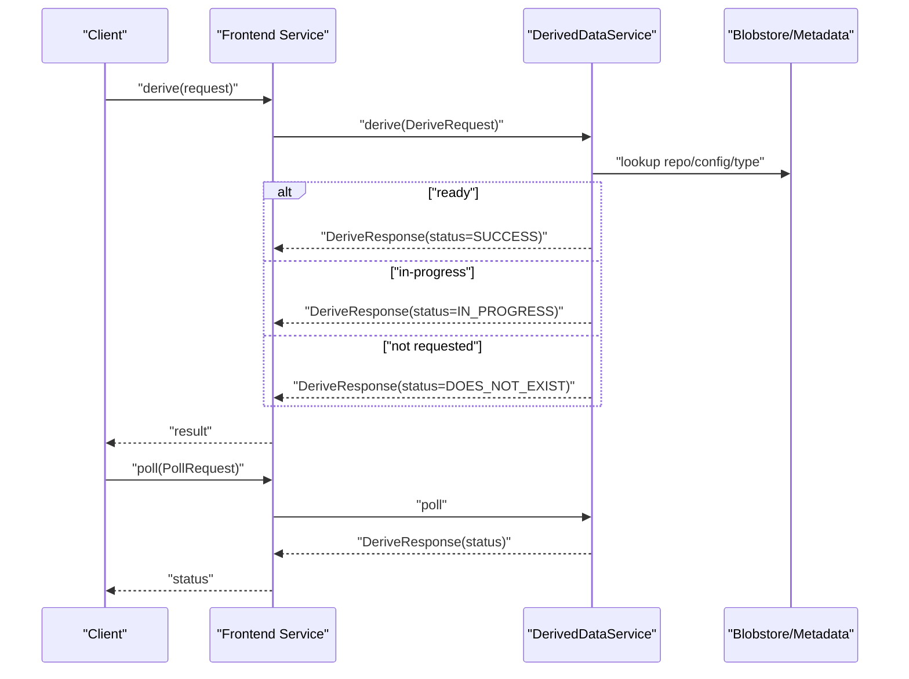
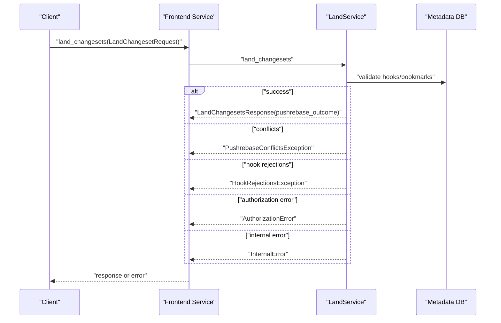
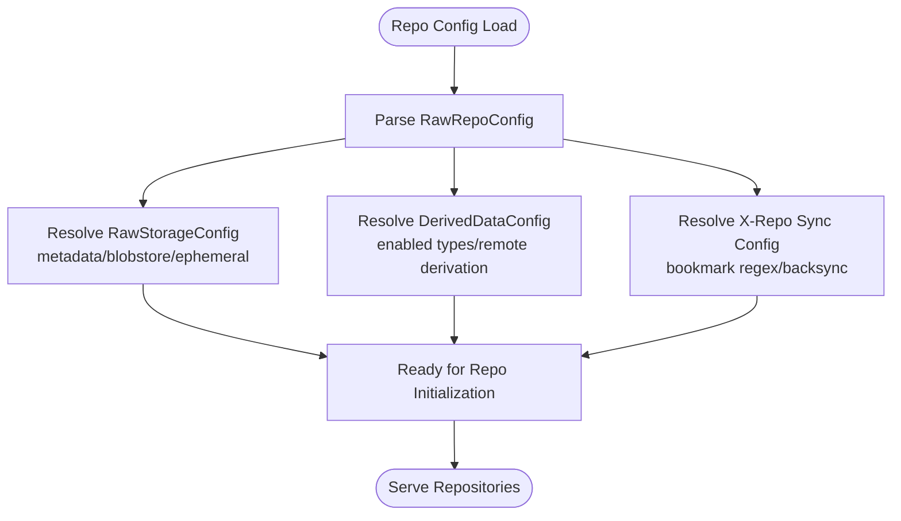
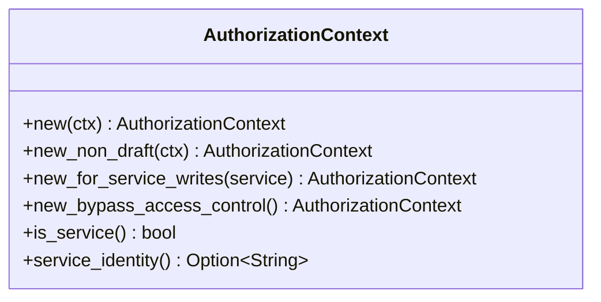
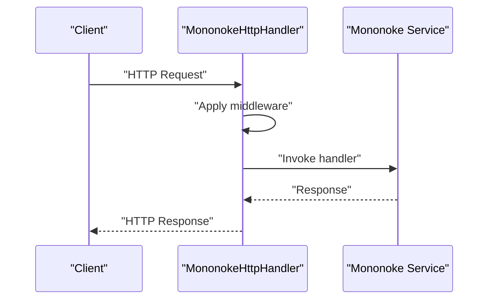
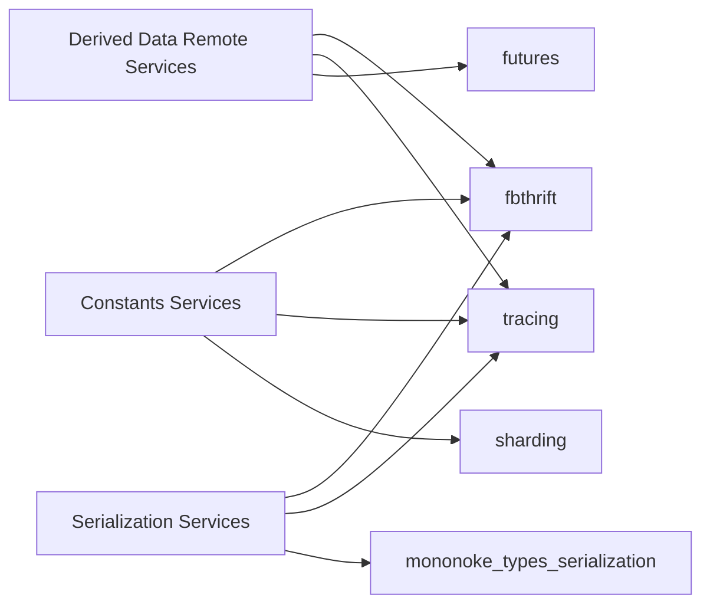

# Mononoke Service

<cite>
**Referenced Files in This Document**
- [repos.thrift](file://configerator/structs/scm/mononoke/repos/repos.thrift)
- [derived_data_service.thrift](file://eden/mononoke/derived_data/remote/if/derived_data_service.thrift)
- [land_service.thrift](file://eden/mononoke/servers/land_service/if/land_service.thrift)
- [context.rs](file://eden/mononoke/repo_authorization/src/context.rs)
- [lib.rs](file://eden/mononoke/mononoke_api/src/lib.rs)
- [handler.rs](file://eden/mononoke/common/gotham_ext/src/handler.rs)
- [3.1-servers-and-services.md](file://eden/mononoke/docs/3.1-servers-and-services.md)
- [1.1-what-is-mononoke.md](file://eden/mononoke/docs/1.1-what-is-mononoke.md)
- [1.4-navigating-the-codebase.md](file://eden/mononoke/docs/1.4-navigating-the-codebase.md)
- [Cargo.toml (derived_data remote services)](file://eden/mononoke/derived_data/remote/if/services/Cargo.toml)
- [Cargo.toml (constants services)](file://configerator/structs/scm/mononoke/constants/services/Cargo.toml)
- [Cargo.toml (mononoke_types serialization services)](file://eden/mononoke/mononoke_types/serialization/services/Cargo.toml)
</cite>

## Table of Contents
1. [Introduction](#introduction)
2. [Project Structure](#project-structure)
3. [Core Components](#core-components)
4. [Architecture Overview](#architecture-overview)
5. [Detailed Component Analysis](#detailed-component-analysis)
6. [Dependency Analysis](#dependency-analysis)
7. [Performance Considerations](#performance-considerations)
8. [Troubleshooting Guide](#troubleshooting-guide)
9. [Conclusion](#conclusion)
10. [Appendices](#appendices)

## Introduction
This document describes the Mononoke Service Thrift API and related distributed interfaces. It focuses on:
- Repository management operations and configuration
- Authentication and access control patterns
- Distributed storage interfaces and derived data management
- Service definitions for repository synchronization and cross-repo operations
- Server configuration options, load balancing, and integration patterns
- Examples of service discovery, connection pooling, and fault tolerance
- Monitoring, logging, and observability aspects

Mononoke is a distributed source control server that separates frontend services from microservices, supports multiple VCS clients, and computes derived data asynchronously.

**Section sources**
- [1.1-what-is-mononoke.md:33-73](file://eden/mononoke/docs/1.1-what-is-mononoke.md#L33-L73)

## Project Structure
The Mononoke service layer is composed of:
- Thrift service definitions for derived data and land operations
- Repository configuration and storage definitions
- Authorization context and access control utilities
- HTTP handler and service wiring for frontend exposure
- Documentation describing servers and services

**Diagram sources**
- [repos.thrift:1-1584](file://configerator/structs/scm/mononoke/repos/repos.thrift#L1-L1584)
- [derived_data_service.thrift:268-283](file://eden/mononoke/derived_data/remote/if/derived_data_service.thrift#L268-L283)
- [land_service.thrift:148-159](file://eden/mononoke/servers/land_service/if/land_service.thrift#L148-L159)
- [context.rs:38-108](file://eden/mononoke/repo_authorization/src/context.rs#L38-L108)
- [handler.rs:146-188](file://eden/mononoke/common/gotham_ext/src/handler.rs#L146-L188)
- [3.1-servers-and-services.md:1-34](file://eden/mononoke/docs/3.1-servers-and-services.md#L1-L34)
- [1.4-navigating-the-codebase.md:186-213](file://eden/mononoke/docs/1.4-navigating-the-codebase.md#L186-L213)

**Section sources**
- [3.1-servers-and-services.md:1-34](file://eden/mononoke/docs/3.1-servers-and-services.md#L1-L34)
- [1.4-navigating-the-codebase.md:186-213](file://eden/mononoke/docs/1.4-navigating-the-codebase.md#L186-L213)

## Core Components
- Repository and storage configuration: Defines repo metadata, blobstores, and derived data settings.
- Derived data service: Provides asynchronous derivation of metadata types for commits.
- Land service: Orchestrates server-side pushrebase and landing of commit stacks.
- Authorization context: Encodes access modes (identity, read-only, draft-only, service) for policy enforcement.
- HTTP handler: Bridges Mononoke services to HTTP for frontend consumption.

Key responsibilities:
- Repository management: storage backends, derived data configuration, cross-repo sync, and metadata caching.
- Authentication and permissions: identity-based access, service identity, and ACL enforcement.
- Distributed interfaces: Thrift services for derived data and land operations.
- Observability: structured logs, Scuba tables, and FB303 base service.

**Section sources**
- [repos.thrift:287-415](file://configerator/structs/scm/mononoke/repos/repos.thrift#L287-L415)
- [derived_data_service.thrift:268-283](file://eden/mononoke/derived_data/remote/if/derived_data_service.thrift#L268-L283)
- [land_service.thrift:148-159](file://eden/mononoke/servers/land_service/if/land_service.thrift#L148-L159)
- [context.rs:38-108](file://eden/mononoke/repo_authorization/src/context.rs#L38-L108)
- [handler.rs:146-188](file://eden/mononoke/common/gotham_ext/src/handler.rs#L146-L188)

## Architecture Overview
Mononoke is deployed as a distributed service architecture:
- Stateless frontend services (e.g., SLAPI/EdenAPI) handle client requests.
- Microservices coordinate expensive operations (e.g., derived data derivation, landing).
- Persistent state is stored externally (blobstore and metadata databases).
- Services are horizontally scalable behind load balancers.

**Diagram sources**
- [3.1-servers-and-services.md:20-34](file://eden/mononoke/docs/3.1-servers-and-services.md#L20-L34)
- [derived_data_service.thrift:268-283](file://eden/mononoke/derived_data/remote/if/derived_data_service.thrift#L268-L283)
- [land_service.thrift:148-159](file://eden/mononoke/servers/land_service/if/land_service.thrift#L148-L159)

**Section sources**
- [3.1-servers-and-services.md:1-34](file://eden/mononoke/docs/3.1-servers-and-services.md#L1-L34)

## Detailed Component Analysis

### Derived Data Service
Purpose:
- Request and poll derivation of metadata for commits across many derived data types.
- Return structured results or request errors with categorized reasons.

Key elements:
- Service definition with derive and poll methods.
- Request envelope includes repo name, changeset, derived data type, config name, derivation type, and priority.
- Responses include derived data payload and status.
- Exceptions distinguish request errors (invalid type, repo not found, disabled derivation) from internal errors.

**Diagram sources**
- [derived_data_service.thrift:268-283](file://eden/mononoke/derived_data/remote/if/derived_data_service.thrift#L268-L283)

**Section sources**
- [derived_data_service.thrift:23-102](file://eden/mononoke/derived_data/remote/if/derived_data_service.thrift#L23-L102)
- [derived_data_service.thrift:268-283](file://eden/mononoke/derived_data/remote/if/derived_data_service.thrift#L268-L283)

### Land Service
Purpose:
- Land a stack of commits onto a target bookmark via server-side pushrebase.
- Enforce hook policies and return outcomes with rebase details and retries.

Key elements:
- Request includes bookmark, changeset stack, pushvars, cross-repo source, and restrictions.
- Outcome includes new head, rebased changesets, pushrebase distance, and retry count.
- Exceptions include pushrebase conflicts, hook rejections, authorization errors, and internal errors.

**Diagram sources**
- [land_service.thrift:148-159](file://eden/mononoke/servers/land_service/if/land_service.thrift#L148-L159)

**Section sources**
- [land_service.thrift:31-91](file://eden/mononoke/servers/land_service/if/land_service.thrift#L31-L91)
- [land_service.thrift:100-131](file://eden/mononoke/servers/land_service/if/land_service.thrift#L100-L131)
- [land_service.thrift:148-159](file://eden/mononoke/servers/land_service/if/land_service.thrift#L148-L159)

### Repository Management and Storage Interfaces
Repository configuration and storage:
- RawRepoConfig aggregates storage backends, derived data settings, push/rebase parameters, hooks, and cross-repo sync.
- RawStorageConfig defines metadata and blobstores, including ephemeral blobstores and multiplexed WAL.
- Derived data configuration supports enabling/disabling types, remote derivation, and batch sizes.

**Diagram sources**
- [repos.thrift:287-415](file://configerator/structs/scm/mononoke/repos/repos.thrift#L287-L415)
- [repos.thrift:616-650](file://configerator/structs/scm/mononoke/repos/repos.thrift#L616-L650)
- [repos.thrift:447-460](file://configerator/structs/scm/mononoke/repos/repos.thrift#L447-L460)

**Section sources**
- [repos.thrift:287-415](file://configerator/structs/scm/mononoke/repos/repos.thrift#L287-L415)
- [repos.thrift:616-650](file://configerator/structs/scm/mononoke/repos/repos.thrift#L616-L650)
- [repos.thrift:447-460](file://configerator/structs/scm/mononoke/repos/repos.thrift#L447-L460)

### Authentication and Access Control Patterns
Authorization context encodes access modes:
- Identity: full access based on caller identity.
- ReadOnlyIdentity: read-only access.
- DraftOnlyIdentity: read and draft operations, no public writes.
- Service: acting as a named service for write operations.
- FullAccess: bypass for internal tools/tests.

**Diagram sources**
- [context.rs:38-108](file://eden/mononoke/repo_authorization/src/context.rs#L38-L108)

**Section sources**
- [context.rs:38-108](file://eden/mononoke/repo_authorization/src/context.rs#L38-L108)

### HTTP Handler and Service Exposure
The HTTP handler bridges Mononoke services to HTTP:
- Builder pattern for middleware composition.
- Stateful wrapper around a handler implementing routing and request processing.
- Integration with Gotham and Hyper for service invocation.

**Diagram sources**
- [handler.rs:146-188](file://eden/mononoke/common/gotham_ext/src/handler.rs#L146-L188)

**Section sources**
- [handler.rs:146-188](file://eden/mononoke/common/gotham_ext/src/handler.rs#L146-L188)

## Dependency Analysis
External dependencies and crates used by service definitions:
- Derived data remote services: fbthrift, tracing, futures, and service crates.
- Constants services: fbthrift, futures, tracing, and sharding crates.
- Serialization services: fbthrift, tracing, futures, and mononoke types serialization.

**Diagram sources**
- [Cargo.toml (derived_data remote services):21-41](file://eden/mononoke/derived_data/remote/if/services/Cargo.toml#L21-L41)
- [Cargo.toml (constants services):21-26](file://configerator/structs/scm/mononoke/constants/services/Cargo.toml#L21-L26)
- [Cargo.toml (mononoke_types serialization services):21-27](file://eden/mononoke/mononoke_types/serialization/services/Cargo.toml#L21-L27)

**Section sources**
- [Cargo.toml (derived_data remote services):17-41](file://eden/mononoke/derived_data/remote/if/services/Cargo.toml#L17-L41)
- [Cargo.toml (constants services):17-29](file://configerator/structs/scm/mononoke/constants/services/Cargo.toml#L17-L29)
- [Cargo.toml (mononoke_types serialization services):17-31](file://eden/mononoke/mononoke_types/serialization/services/Cargo.toml#L17-L31)

## Performance Considerations
- Derived data batching and priorities: derived data configuration supports batch sizes and prioritization to balance throughput and latency.
- Concurrency controls: Git concurrency parameters and channel sizes for modern sync channels.
- Metadata caching: configurable update modes (tail or poll) and cache warmup strategies.
- Asynchronous workers: queue-backed async requests with dedicated blobstore and database.

Recommendations:
- Tune derived data batch sizes and channel sizes per workload.
- Use cache warmup for frequently accessed bookmarks.
- Monitor Scuba tables for bottlenecks and adjust concurrency limits.

**Section sources**
- [repos.thrift:616-650](file://configerator/structs/scm/mononoke/repos/repos.thrift#L616-L650)
- [repos.thrift:541-560](file://configerator/structs/scm/mononoke/repos/repos.thrift#L541-L560)
- [repos.thrift:417-437](file://configerator/structs/scm/mononoke/repos/repos.thrift#L417-L437)
- [repos.thrift:1553-1558](file://configerator/structs/scm/mononoke/repos/repos.thrift#L1553-L1558)

## Troubleshooting Guide
Common error categories and handling:
- Derived data request errors:
  - DerivedDataTypeNotEnabled: derived data type not enabled for repo.
  - CommitNotFound: requested changeset not found.
  - RepoNotFound: repository not found.
  - UnknownDerivedDataConfig: invalid derived data config name.
  - UnknownDerivationType: unsupported derivation type.
  - DisabledDerivation: derivation disabled for type.
  - TypeDisabledForEphemeralBubbles: type disabled for ephemeral bubbles.
- Internal errors: generic server-side failures with optional backtrace and source chain.
- Land service exceptions:
  - PushrebaseConflictsException: conflicts during pushrebase.
  - HookRejectionsException: hook rejections with reasons.
  - AuthorizationError: insufficient permissions.
  - InternalError: unexpected server errors.

Operational tips:
- Inspect Scuba tables for derived data and update logging.
- Verify derived data configuration and enabled types.
- Review hook configurations and bookmark restrictions.
- Check service write restrictions and ACL mappings.

**Section sources**
- [derived_data_service.thrift:247-265](file://eden/mononoke/derived_data/remote/if/derived_data_service.thrift#L247-L265)
- [land_service.thrift:100-139](file://eden/mononoke/servers/land_service/if/land_service.thrift#L100-L139)

## Conclusion
Mononoke’s service layer provides a robust, distributed foundation for repository operations:
- Repository configuration and storage are centralized and versioned.
- Derived data is computed asynchronously with rich configuration and monitoring.
- Land operations are orchestrated server-side with strict policy enforcement.
- Access control is modeled explicitly through authorization contexts.
- The architecture supports horizontal scaling, redundancy, and observability.

[No sources needed since this section summarizes without analyzing specific files]

## Appendices

### Service Discovery, Connection Pooling, and Fault Tolerance
- Service discovery: Use tier-based service discovery and shard manager tiers for derived data and diff services.
- Connection pooling: Thrift clients leverage fbthrift transport pools; tune pool sizes per service and concurrency.
- Fault tolerance: Services are stateless and can be restarted independently; rely on external storage durability.

**Section sources**
- [repos.thrift:705-715](file://configerator/structs/scm/mononoke/repos/repos.thrift#L705-L715)
- [repos.thrift:1095-1138](file://configerator/structs/scm/mononoke/repos/repos.thrift#L1095-L1138)

### Monitoring, Logging, and Observability
- Derived data and update logging destinations configured via RawUpdateLoggingConfig and RawLoggingDestination.
- Scuba tables for derived data, redaction, and metadata operations.
- FB303 BaseService exposed by services for health and metrics.

**Section sources**
- [repos.thrift:1417-1424](file://configerator/structs/scm/mononoke/repos/repos.thrift#L1417-L1424)
- [derived_data_service.thrift:268-283](file://eden/mononoke/derived_data/remote/if/derived_data_service.thrift#L268-L283)