# Repository Management

<cite>
**Referenced Files in This Document**
- [Cargo.toml](file://eden/mononoke/Cargo.toml)
- [README.md](file://eden/mononoke/README.md)
- [1.1-what-is-mononoke.md](file://eden/mononoke/docs/1.1-what-is-mononoke.md)
- [2.2-repository-facets.md](file://eden/mononoke/docs/2.2-repository-facets.md)
- [2.3-derived-data.md](file://eden/mononoke/docs/2.3-derived-data.md)
- [repo_attributes/bookmarks](file://eden/mononoke/repo_attributes/bookmarks)
- [repo_attributes/phases](file://eden/mononoke/repo_attributes/phases)
- [repo_attributes/repo_cross_repo](file://eden/mononoke/repo_attributes/repo_cross_repo)
- [repo_attributes/repo_derived_data](file://eden/mononoke/repo_attributes/repo_derived_data)
- [repo_attributes/repo_identity](file://eden/mononoke/repo_attributes/repo_identity)
- [repo_attributes/repo_lock](file://eden/mononoke/repo_attributes/repo_lock)
- [repo_attributes/repo_metadata_checkpoint](file://eden/mononoke/repo_attributes/repo_metadata_checkpoint)
- [repo_attributes/repo_permission_checker](file://eden/mononoke/repo_attributes/repo_permission_checker)
- [repo_attributes/repo_sparse_profiles](file://eden/mononoke/repo_attributes/repo_sparse_profiles)
- [repo_attributes/restricted_paths](file://eden/mononoke/repo_attributes/restricted_paths)
- [repo_attributes/repo_event_publisher](file://eden/mononoke/repo_attributes/repo_event_publisher)
- [repo_attributes/sql_query_config](file://eden/mononoke/repo_attributes/sql_query_config)
- [repo_attributes/bonsai_git_mapping](file://eden/mononoke/repo_attributes/bonsai_git_mapping)
- [repo_attributes/bonsai_hg_mapping](file://eden/mononoke/repo_attributes/bonsai_hg_mapping)
- [repo_attributes/bonsai_globalrev_mapping](file://eden/mononoke/repo_attributes/bonsai_globalrev_mapping)
- [repo_attributes/bonsai_svnrev_mapping](file://eden/mononoke/repo_attributes/bonsai_svnrev_mapping)
- [repo_attributes/bonsai_blob_mapping](file://eden/mononoke/repo_attributes/bonsai_blob_mapping)
- [repo_attributes/bonsai_tag_mapping](file://eden/mononoke/repo_attributes/bonsai_tag_mapping)
- [repo_attributes/git_symbolic_refs](file://eden/mononoke/repo_attributes/git_symbolic_refs)
- [repo_attributes/git_ref_content_mapping](file://eden/mononoke/repo_attributes/git_ref_content_mapping)
- [repo_attributes/git_source_of_truth](file://eden/mononoke/repo_attributes/git_source_of_truth)
- [repo_attributes/commit_graph](file://eden/mononoke/repo_attributes/commit_graph)
- [repo_attributes/filestore](file://eden/mononoke/repo_attributes/filestore)
- [repo_attributes/mutable_blobstore](file://eden/mononoke/repo_attributes/mutable_blobstore)
- [repo_attributes/filenodes](file://eden/mononoke/repo_attributes/filenodes)
- [repo_attributes/newfilenodes](file://eden/mononoke/repo_attributes/newfilenodes)
- [repo_attributes/mutable_counters](file://eden/mononoke/repo_attributes/mutable_counters)
- [repo_attributes/mutable_renames](file://eden/mononoke/repo_attributes/mutable_renames)
- [repo_attributes/deletion_log](file://eden/mononoke/repo_attributes/deletion_log)
- [repo_attributes/pushrebase_mutation_mapping](file://eden/mononoke/repo_attributes/pushrebase_mutation_mapping)
- [repo_attributes/repo_derivation_queues](file://eden/mononoke/repo_attributes/repo_derivation_queues)
- [repo_attributes/repo_blobstore](file://eden/mononoke/repo_attributes/repo_blobstore)
- [repo_attributes/repo_bookmark_attrs](file://eden/mononoke/repo_attributes/repo_bookmark_attrs)
- [repo_attributes/hook_manager](file://eden/mononoke/repo_attributes/hook_manager)
- [repo_attributes/repo_factory](file://eden/mononoke/repo_factory)
- [repo_attributes/repo_factory/config_only_repo_factory](file://eden/mononoke/repo_factory/config_only_repo_factory)
- [repo_attributes/repo_factory/test_repo_factory](file://eden/mononoke/repo_factory/test_repo_factory)
- [features/pushrebase](file://eden/mononoke/features/pushrebase)
- [features/cross_repo_sync](file://eden/mononoke/features/cross_repo_sync)
- [features/commit_cloud](file://eden/mononoke/features/commit_cloud)
- [features/hooks](file://eden/mononoke/features/hooks)
- [common/mononoke_configs](file://eden/mononoke/common/mononoke_configs)
- [common/permission_checker](file://eden/mononoke/common/permission_checker)
- [common/connection_security_checker](file://eden/mononoke/common/connection_security_checker)
- [common/session_id](file://eden/mononoke/common/session_id)
- [common/observability](file://eden/mononoke/common/observability)
- [common/mononoke_macros](file://eden/mononoke/common/mononoke_macros)
- [common/mononoke_repos](file://eden/mononoke/common/mononoke_repos)
- [common/mononoke_configs/clients](file://eden/mononoke/common/mononoke_configs/clients)
- [common/mononoke_configs/services](file://eden/mononoke/common/mononoke_configs/services)
- [common/mononoke_configs/mocks](file://eden/mononoke/common/mononoke_configs/mocks)
- [common/mononoke_configs/thrift_build.rs](file://eden/mononoke/common/mononoke_configs/thrift_build.rs)
- [common/mononoke_configs/thrift_lib.rs](file://eden/mononoke/common/mononoke_configs/thrift_lib.rs)
- [common/mononoke_configs/constants.thrift](file://eden/mononoke/common/mononoke_configs/constants.thrift)
- [common/mononoke_configs/clients/thrift_build.rs](file://eden/mononoke/common/mononoke_configs/clients/thrift_build.rs)
- [common/mononoke_configs/clients/thrift_lib.rs](file://eden/mononoke/common/mononoke_configs/clients/thrift_lib.rs)
- [common/mononoke_configs/services/thrift_build.rs](file://eden/mononoke/common/mononoke_configs/services/thrift_build.rs)
- [common/mononoke_configs/services/thrift_lib.rs](file://eden/mononoke/common/mononoke_configs/services/thrift_lib.rs)
- [common/mononoke_configs/mocks/thrift_build.rs](file://eden/mononoke/common/mononoke_configs/mocks/thrift_build.rs)
- [common/mononoke_configs/mocks/thrift_lib.rs](file://eden/mononoke/common/mononoke_configs/mocks/thrift_lib.rs)
- [configerator/structs/scm/mononoke/constants](file://configerator/structs/scm/mononoke/constants)
- [configerator/structs/scm/mononoke/constants/constants.thrift](file://configerator/structs/scm/mononoke/constants/constants.thrift)
- [configerator/structs/scm/mononoke/constants/clients](file://configerator/structs/scm/mononoke/constants/clients)
- [configerator/structs/scm/mononoke/constants/services](file://configerator/structs/scm/mononoke/constants/services)
- [configerator/structs/scm/mononoke/constants/mocks](file://configerator/structs/scm/mononoke/constants/mocks)
- [configerator/structs/scm/mononoke/constants/clients/thrift_build.rs](file://configerator/structs/scm/mononoke/constants/clients/thrift_build.rs)
- [configerator/structs/scm/mononoke/constants/clients/thrift_lib.rs](file://configerator/structs/scm/mononoke/constants/clients/thrift_lib.rs)
- [configerator/structs/scm/mononoke/constants/services/thrift_build.rs](file://configerator/structs/scm/mononoke/constants/services/thrift_build.rs)
- [configerator/structs/scm/mononoke/constants/services/thrift_lib.rs](file://configerator/structs/scm/mononoke/constants/services/thrift_lib.rs)
- [configerator/structs/scm/mononoke/constants/mocks/thrift_build.rs](file://configerator/structs/scm/mononoke/constants/mocks/thrift_build.rs)
- [configerator/structs/scm/mononoke/constants/mocks/thrift_lib.rs](file://configerator/structs/scm/mononoke/constants/mocks/thrift_lib.rs)
- [configerator/structs/scm/mononoke/repos](file://configerator/structs/scm/mononoke/repos)
- [configerator/structs/scm/mononoke/repos/commitsync.thrift](file://configerator/structs/scm/mononoke/repos/commitsync.thrift)
- [configerator/structs/scm/mononoke/repos/commitsync](file://configerator/structs/scm/mononoke/repos/commitsync)
- [configerator/structs/scm/mononoke/repos/repos](file://configerator/structs/scm/mononoke/repos/repos)
- [configerator/structs/scm/mononoke/repos/repos/clients](file://configerator/structs/scm/mononoke/repos/repos/clients)
- [configerator/structs/scm/mononoke/repos/repos/services](file://configerator/structs/scm/mononoke/repos/repos/services)
- [configerator/structs/scm/mononoke/repos/repos/mocks](file://configerator/structs/scm/mononoke/repos/repos/mocks)
- [configerator/structs/scm/mononoke/repos/repos/clients/thrift_build.rs](file://configerator/structs/scm/mononoke/repos/repos/clients/thrift_build.rs)
- [configerator/structs/scm/mononoke/repos/repos/clients/thrift_lib.rs](file://configerator/structs/scm/mononoke/repos/repos/clients/thrift_lib.rs)
- [configerator/structs/scm/mononoke/repos/repos/services/thrift_build.rs](file://configerator/structs/scm/mononoke/repos/repos/services/thrift_build.rs)
- [configerator/structs/scm/mononoke/repos/repos/services/thrift_lib.rs](file://configerator/structs/scm/mononoke/repos/repos/services/thrift_lib.rs)
- [configerator/structs/scm/mononoke/repos/repos/mocks/thrift_build.rs](file://configerator/structs/scm/mononoke/repos/repos/mocks/thrift_build.rs)
- [configerator/structs/scm/mononoke/repos/repos/mocks/thrift_lib.rs](file://configerator/structs/scm/mononoke/repos/repos/mocks/thrift_lib.rs)
</cite>

## Table of Contents
1. [Introduction](#introduction)
2. [Project Structure](#project-structure)
3. [Core Components](#core-components)
4. [Architecture Overview](#architecture-overview)
5. [Detailed Component Analysis](#detailed-component-analysis)
6. [Dependency Analysis](#dependency-analysis)
7. [Performance Considerations](#performance-considerations)
8. [Troubleshooting Guide](#troubleshooting-guide)
9. [Conclusion](#conclusion)
10. [Appendices](#appendices)

## Introduction
This document describes Mononoke’s repository management service with a focus on repository creation, configuration, lifecycle operations, and operational patterns. It covers repository attributes such as bookmarks, phases, and metadata management; synchronization mechanisms across repositories; repository mapping patterns; permission and access control; and backup, restore, and maintenance procedures. The content is grounded in the repository’s documentation and module structure.

## Project Structure
Mononoke is a Rust-based server implementing a scalable source control backend. The repository is organized as a Cargo workspace with many crates grouped by functional domains. The most relevant areas for repository management include:
- Faceted repository attributes under repo_attributes/
- Feature implementations under features/
- Configuration and Thrift interfaces under common/ and configerator/structs/scm/mononoke/
- Documentation under docs/

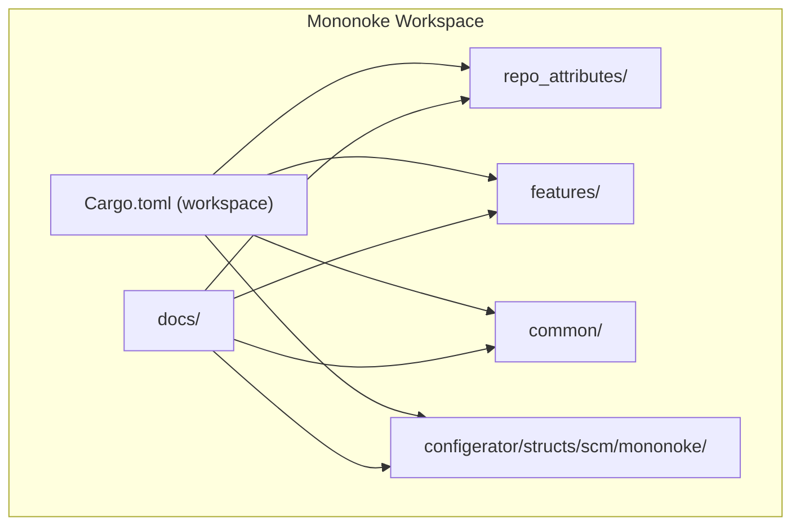

**Diagram sources**
- [Cargo.toml](file://eden/mononoke/Cargo.toml)
- [README.md](file://eden/mononoke/README.md)

**Section sources**
- [Cargo.toml:55-446](file://eden/mononoke/Cargo.toml#L55-L446)
- [README.md:1-35](file://eden/mononoke/README.md#L1-L35)

## Core Components
Mononoke composes repositories from modular facets. Each facet encapsulates a single responsibility (e.g., identity, commit graph, blobstore, bookmarks, phases, derived data, VCS mappings). Features combine facets to implement high-level operations like pushrebase, cross-repo sync, and commit cloud.

Key repository attributes and roles:
- Identity and configuration: RepoIdentity, RepoBookmarkAttrs
- Storage access: RepoBlobstore, Filestore, MutableBlobstore
- Commit graph and history: CommitGraph, Phases
- Derived data: RepoDerivedData, RepoDerivationQueues
- VCS mappings: BonsaiHgMapping, BonsaiGitMapping, BonsaiGlobalrevMapping, BonsaiSvnrevMapping, BonsaiBlobMapping, BonsaiTagMapping
- Bookmarks and references: Bookmarks, GitSymbolicRefs, GitRefContentMapping, GitSourceOfTruth
- Operational controls: RepoPermissionChecker, HookManager, RepoCrossRepo, RepoLock, RepoSparseProfiles, RestrictedPaths
- Metadata and events: RepoMetadataCheckpoint, RepoEventPublisher, SqlQueryConfig
- Specialized: Filenodes, Newfilenodes, MutableCounters, MutableRenames, DeletionLog, PushrebaseMutationMapping

**Section sources**
- [2.2-repository-facets.md:93-253](file://eden/mononoke/docs/2.2-repository-facets.md#L93-L253)

## Architecture Overview
Mononoke’s architecture separates concerns and scales horizontally. Repositories are composed from facets, and features orchestrate operations across facets. Derived data is computed off the write path and cached. The system supports multi-VCS mappings and cross-repository synchronization.

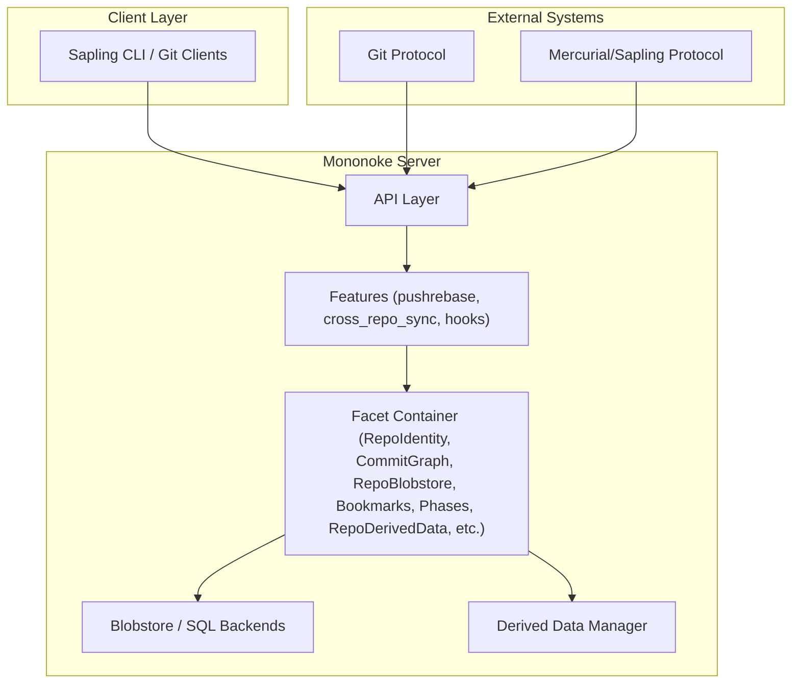

**Diagram sources**
- [1.1-what-is-mononoke.md:49-70](file://eden/mononoke/docs/1.1-what-is-mononoke.md#L49-L70)
- [2.2-repository-facets.md:254-288](file://eden/mononoke/docs/2.2-repository-facets.md#L254-L288)

**Section sources**
- [1.1-what-is-mononoke.md:49-70](file://eden/mononoke/docs/1.1-what-is-mononoke.md#L49-L70)
- [2.2-repository-facets.md:254-288](file://eden/mononoke/docs/2.2-repository-facets.md#L254-L288)

## Detailed Component Analysis

### Repository Creation and Lifecycle
- Repository construction is orchestrated by the repository factory. Factories read configuration, construct storage backends, create facets with dependencies, and assemble them into a facet container. Test factories provide in-memory backends for development and testing.
- Lifecycle operations include initialization, configuration updates, and shutdown. Shutdown behavior is integrated into application lifecycle management.

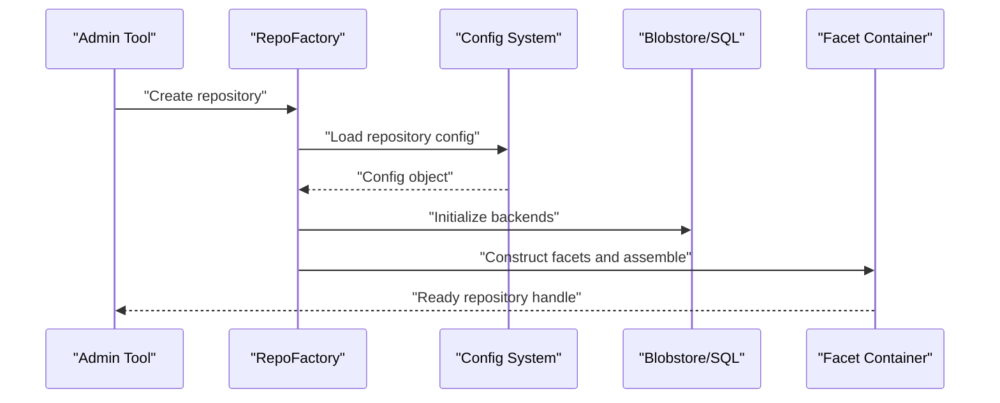

**Diagram sources**
- [2.2-repository-facets.md:256-265](file://eden/mononoke/docs/2.2-repository-facets.md#L256-L265)
- [repo_attributes/repo_factory](file://eden/mononoke/repo_factory)
- [repo_attributes/repo_factory/config_only_repo_factory](file://eden/mononoke/repo_factory/config_only_repo_factory)
- [repo_attributes/repo_factory/test_repo_factory](file://eden/mononoke/repo_factory/test_repo_factory)

**Section sources**
- [2.2-repository-facets.md:256-281](file://eden/mononoke/docs/2.2-repository-facets.md#L256-L281)

### Repository Attributes: Bookmarks
- Bookmarks are branch pointers managed via the Bookmarks facet. They support read/write access, movement logs, and caching. Policies for bookmark operations are defined by RepoBookmarkAttrs. Event publishing and cache warming are available for operational reliability.

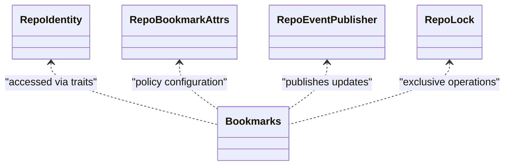

**Diagram sources**
- [repo_attributes/bookmarks](file://eden/mononoke/repo_attributes/bookmarks)
- [repo_attributes/repo_bookmark_attrs](file://eden/mononoke/repo_attributes/repo_bookmark_attrs)
- [repo_attributes/repo_event_publisher](file://eden/mononoke/repo_attributes/repo_event_publisher)
- [repo_attributes/repo_lock](file://eden/mononoke/repo_attributes/repo_lock)

**Section sources**
- [2.2-repository-facets.md:168-190](file://eden/mononoke/docs/2.2-repository-facets.md#L168-L190)

### Repository Attributes: Phases
- Phases track commit states (e.g., draft, public) and are central to Mercurial/Sapling semantics. The Phases facet provides phase-aware operations and integrates with commit graph traversal.

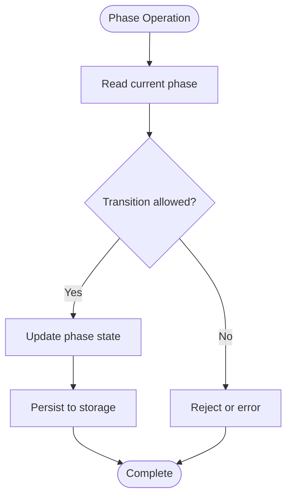

**Diagram sources**
- [repo_attributes/phases](file://eden/mononoke/repo_attributes/phases)
- [repo_attributes/commit_graph](file://eden/mononoke/repo_attributes/commit_graph)

**Section sources**
- [2.2-repository-facets.md:127-129](file://eden/mononoke/docs/2.2-repository-facets.md#L127-L129)

### Metadata Management
- RepoMetadataCheckpoint tracks checkpoints for metadata logging. SqlQueryConfig governs SQL query behavior (timeouts, retries). These components support operational observability and reliability.

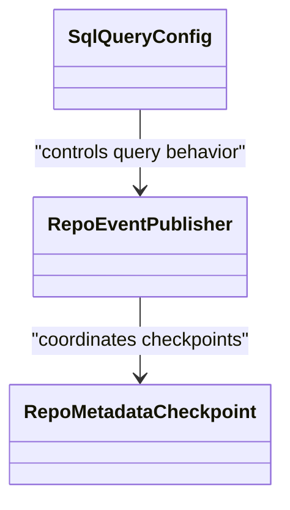

**Diagram sources**
- [repo_attributes/repo_metadata_checkpoint](file://eden/mononoke/repo_attributes/repo_metadata_checkpoint)
- [repo_attributes/sql_query_config](file://eden/mononoke/repo_attributes/sql_query_config)
- [repo_attributes/repo_event_publisher](file://eden/mononoke/repo_attributes/repo_event_publisher)

**Section sources**
- [2.2-repository-facets.md:235-252](file://eden/mononoke/docs/2.2-repository-facets.md#L235-L252)

### Repository Synchronization and Cross-Repo Operations
- Cross-repo synchronization is enabled by RepoCrossRepo and implemented by features such as cross_repo_sync. These features coordinate commit propagation and mapping across repositories, often leveraging derived data and event streams.

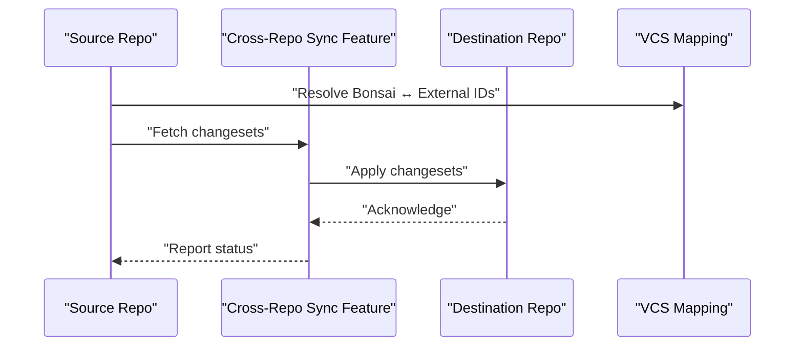

**Diagram sources**
- [repo_attributes/repo_cross_repo](file://eden/mononoke/repo_attributes/repo_cross_repo)
- [features/cross_repo_sync](file://eden/mononoke/features/cross_repo_sync)
- [repo_attributes/bonsai_git_mapping](file://eden/mononoke/repo_attributes/bonsai_git_mapping)
- [repo_attributes/bonsai_hg_mapping](file://eden/mononoke/repo_attributes/bonsai_hg_mapping)

**Section sources**
- [2.2-repository-facets.md:222-224](file://eden/mononoke/docs/2.2-repository-facets.md#L222-L224)

### Repository Mapping Patterns
- Mononoke uses VCS mappings to maintain a canonical Bonsai model while serving Git and Mercurial clients. Mappings include BonsaiGitMapping, BonsaiHgMapping, BonsaiGlobalrevMapping, BonsaiSvnrevMapping, BonsaiBlobMapping, and BonsaiTagMapping. Git-specific facets include GitSymbolicRefs, GitRefContentMapping, and GitSourceOfTruth.

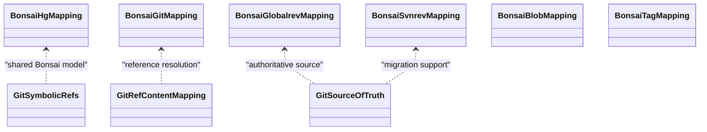

**Diagram sources**
- [repo_attributes/bonsai_hg_mapping](file://eden/mononoke/repo_attributes/bonsai_hg_mapping)
- [repo_attributes/bonsai_git_mapping](file://eden/mononoke/repo_attributes/bonsai_git_mapping)
- [repo_attributes/bonsai_globalrev_mapping](file://eden/mononoke/repo_attributes/bonsai_globalrev_mapping)
- [repo_attributes/bonsai_svnrev_mapping](file://eden/mononoke/repo_attributes/bonsai_svnrev_mapping)
- [repo_attributes/bonsai_blob_mapping](file://eden/mononoke/repo_attributes/bonsai_blob_mapping)
- [repo_attributes/bonsai_tag_mapping](file://eden/mononoke/repo_attributes/bonsai_tag_mapping)
- [repo_attributes/git_symbolic_refs](file://eden/mononoke/repo_attributes/git_symbolic_refs)
- [repo_attributes/git_ref_content_mapping](file://eden/mononoke/repo_attributes/git_ref_content_mapping)
- [repo_attributes/git_source_of_truth](file://eden/mononoke/repo_attributes/git_source_of_truth)

**Section sources**
- [2.2-repository-facets.md:141-167](file://eden/mononoke/docs/2.2-repository-facets.md#L141-L167)

### Attribute Updates and State Management
- Attribute updates leverage facets’ typed interfaces. For example, RepoBookmarkAttrs defines policies for bookmark operations; RepoPermissionChecker enforces access control; RepoLock ensures exclusive operations; and RepoEventPublisher emits change events. Derived data updates are coordinated by RepoDerivedData and RepoDerivationQueues.

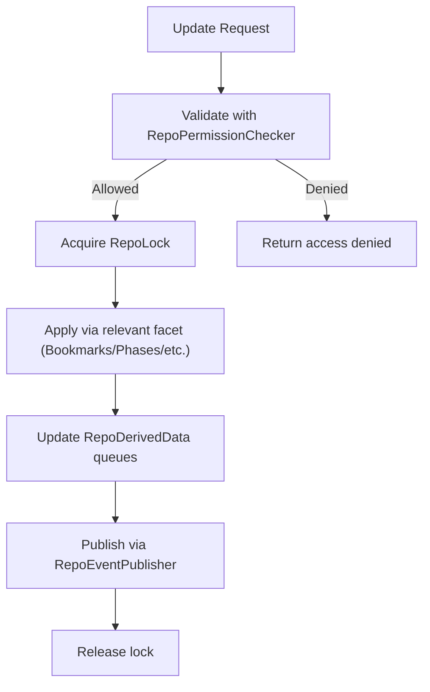

**Diagram sources**
- [repo_attributes/repo_permission_checker](file://eden/mononoke/repo_attributes/repo_permission_checker)
- [repo_attributes/repo_lock](file://eden/mononoke/repo_attributes/repo_lock)
- [repo_attributes/repo_derived_data](file://eden/mononoke/repo_attributes/repo_derived_data)
- [repo_attributes/repo_derivation_queues](file://eden/mononoke/repo_attributes/repo_derivation_queues)
- [repo_attributes/repo_event_publisher](file://eden/mononoke/repo_attributes/repo_event_publisher)

**Section sources**
- [2.2-repository-facets.md:212-248](file://eden/mononoke/docs/2.2-repository-facets.md#L212-L248)

### Permissions, Access Control, and Security
- Access control is enforced by RepoPermissionChecker and related permission utilities. Connection security and session management are handled by connection security checker and session ID utilities. Observability and audit trails are supported by metadata checkpointing and event publishing.

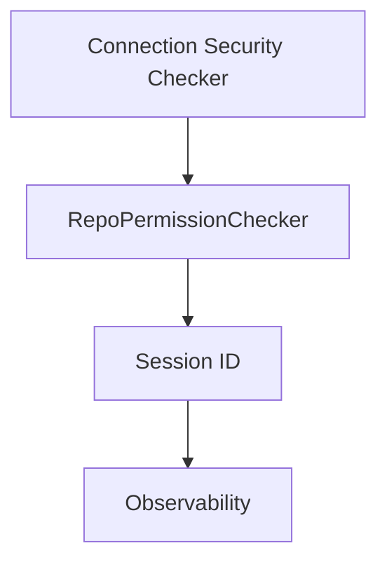

**Diagram sources**
- [repo_attributes/repo_permission_checker](file://eden/mononoke/repo_attributes/repo_permission_checker)
- [common/permission_checker](file://eden/mononoke/common/permission_checker)
- [common/connection_security_checker](file://eden/mononoke/common/connection_security_checker)
- [common/session_id](file://eden/mononoke/common/session_id)
- [common/observability](file://eden/mononoke/common/observability)

**Section sources**
- [2.2-repository-facets.md:214-216](file://eden/mononoke/docs/2.2-repository-facets.md#L214-L216)

### Backup, Restore, and Maintenance
- Backup and restore procedures rely on immutable blob storage (RepoBlobstore) and metadata checkpoints. Maintenance includes derived data recomputation, garbage collection, and storage healing jobs. Derived data management coordinates asynchronous recomputation and caching.

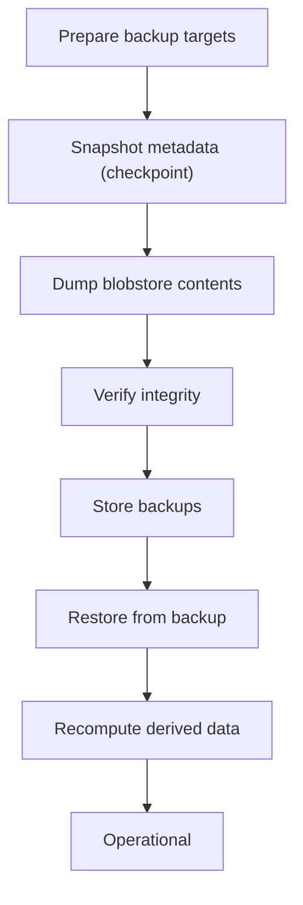

**Diagram sources**
- [repo_attributes/repo_metadata_checkpoint](file://eden/mononoke/repo_attributes/repo_metadata_checkpoint)
- [repo_attributes/repo_derived_data](file://eden/mononoke/repo_attributes/repo_derived_data)
- [repo_attributes/repo_blobstore](file://eden/mononoke/repo_attributes/repo_blobstore)

**Section sources**
- [2.3-derived-data.md](file://eden/mononoke/docs/2.3-derived-data.md)
- [repo_attributes/repo_derived_data](file://eden/mononoke/repo_attributes/repo_derived_data)

## Dependency Analysis
Mononoke’s repository management depends on a layered structure:
- Workspace members define the full set of crates composing Mononoke.
- Facets depend on storage backends (blobstore, SQL) and configuration.
- Features depend on multiple facets to implement operations.
- Thrift configs and clients define external interfaces.

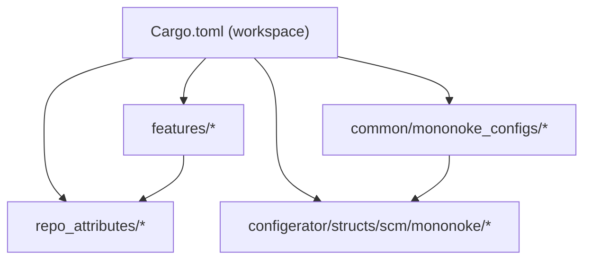

**Diagram sources**
- [Cargo.toml:55-446](file://eden/mononoke/Cargo.toml#L55-L446)

**Section sources**
- [Cargo.toml:55-446](file://eden/mononoke/Cargo.toml#L55-L446)

## Performance Considerations
- Derived data is computed asynchronously to keep write paths fast; use RepoDerivedData and RepoDerivationQueues to manage workload distribution.
- Caching strategies (e.g., BookmarksCache) reduce database load for frequently accessed data.
- Immutable storage and content addressing improve cache hit rates and enable efficient distribution.
- Horizontal scaling is supported by composability and distributed storage backends.

[No sources needed since this section provides general guidance]

## Troubleshooting Guide
Common operational issues and remedies:
- Permission denials: Verify RepoPermissionChecker configuration and session context.
- Lock contention: Use RepoLock to serialize conflicting operations; ensure locks are released promptly.
- Derived data staleness: Trigger recomputation via RepoDerivedData and monitor RepoDerivationQueues.
- Cross-repo sync failures: Inspect RepoCrossRepo logs and VCS mapping correctness.
- Metadata inconsistencies: Use RepoMetadataCheckpoint to roll back to a known good state.

**Section sources**
- [repo_attributes/repo_permission_checker](file://eden/mononoke/repo_attributes/repo_permission_checker)
- [repo_attributes/repo_lock](file://eden/mononoke/repo_attributes/repo_lock)
- [repo_attributes/repo_derived_data](file://eden/mononoke/repo_attributes/repo_derived_data)
- [repo_attributes/repo_metadata_checkpoint](file://eden/mononoke/repo_attributes/repo_metadata_checkpoint)
- [repo_attributes/repo_cross_repo](file://eden/mononoke/repo_attributes/repo_cross_repo)

## Conclusion
Mononoke’s repository management is built around a faceted architecture that cleanly separates concerns, supports multi-VCS mappings, and enables scalable operations. By composing repositories from facets, orchestrating high-level features, and leveraging derived data, Mononoke delivers robust repository lifecycle management, synchronization, and operational controls.

[No sources needed since this section summarizes without analyzing specific files]

## Appendices

### Appendix A: Example Workflows (paths only)
- Initialize repository: [repo_attributes/repo_factory](file://eden/mononoke/repo_factory)
- Configure repository attributes: [repo_attributes/repo_bookmark_attrs](file://eden/mononoke/repo_attributes/repo_bookmark_attrs), [repo_attributes/sql_query_config](file://eden/mononoke/repo_attributes/sql_query_config)
- Update bookmarks: [repo_attributes/bookmarks](file://eden/mononoke/repo_attributes/bookmarks)
- Manage phases: [repo_attributes/phases](file://eden/mononoke/repo_attributes/phases)
- Enforce permissions: [repo_attributes/repo_permission_checker](file://eden/mononoke/repo_attributes/repo_permission_checker)
- Cross-repo sync: [features/cross_repo_sync](file://eden/mononoke/features/cross_repo_sync), [repo_attributes/repo_cross_repo](file://eden/mononoke/repo_attributes/repo_cross_repo)
- Derived data management: [repo_attributes/repo_derived_data](file://eden/mononoke/repo_attributes/repo_derived_data), [repo_attributes/repo_derivation_queues](file://eden/mononoke/repo_attributes/repo_derivation_queues)
- Backup and restore: [repo_attributes/repo_metadata_checkpoint](file://eden/mononoke/repo_attributes/repo_metadata_checkpoint), [repo_attributes/repo_blobstore](file://eden/mononoke/repo_attributes/repo_blobstore)

**Section sources**
- [2.2-repository-facets.md:93-253](file://eden/mononoke/docs/2.2-repository-facets.md#L93-L253)