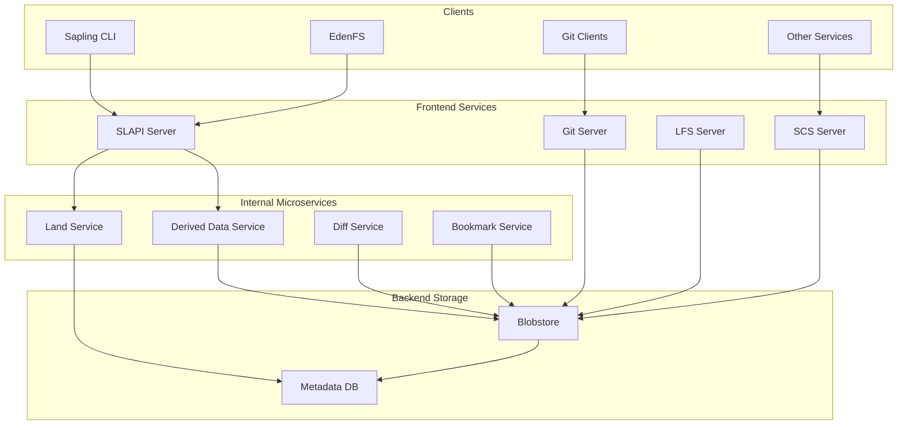
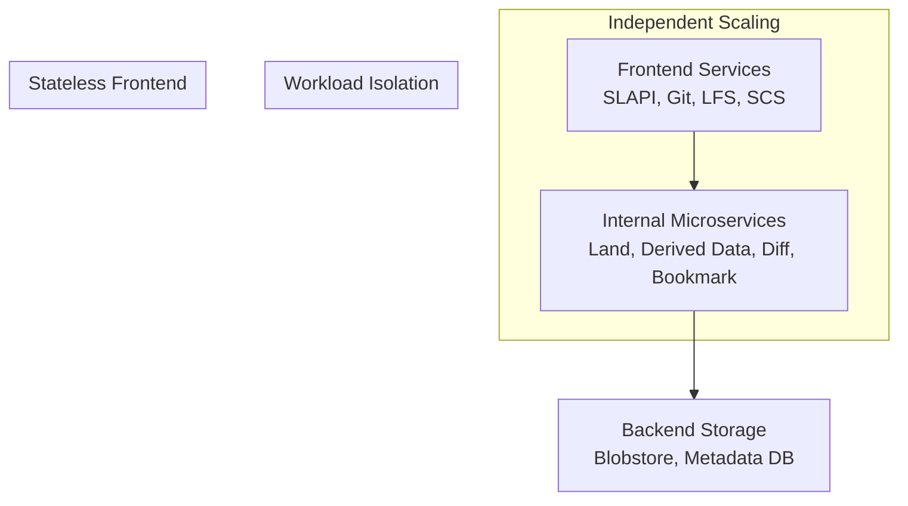
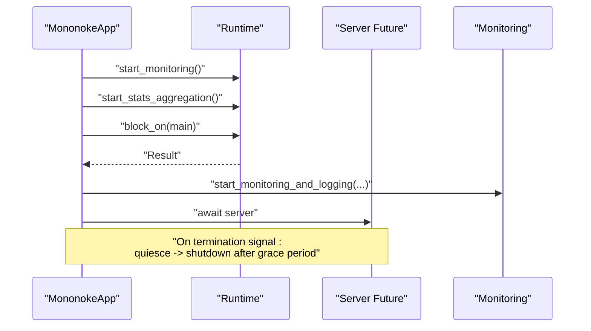
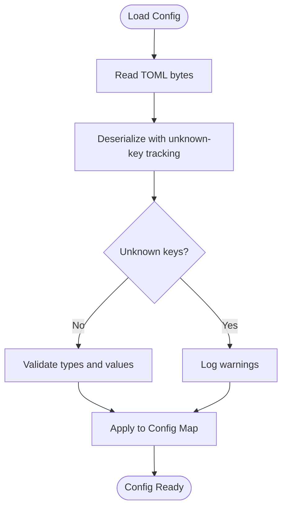
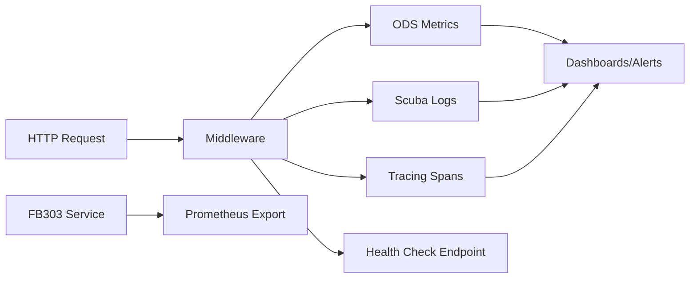
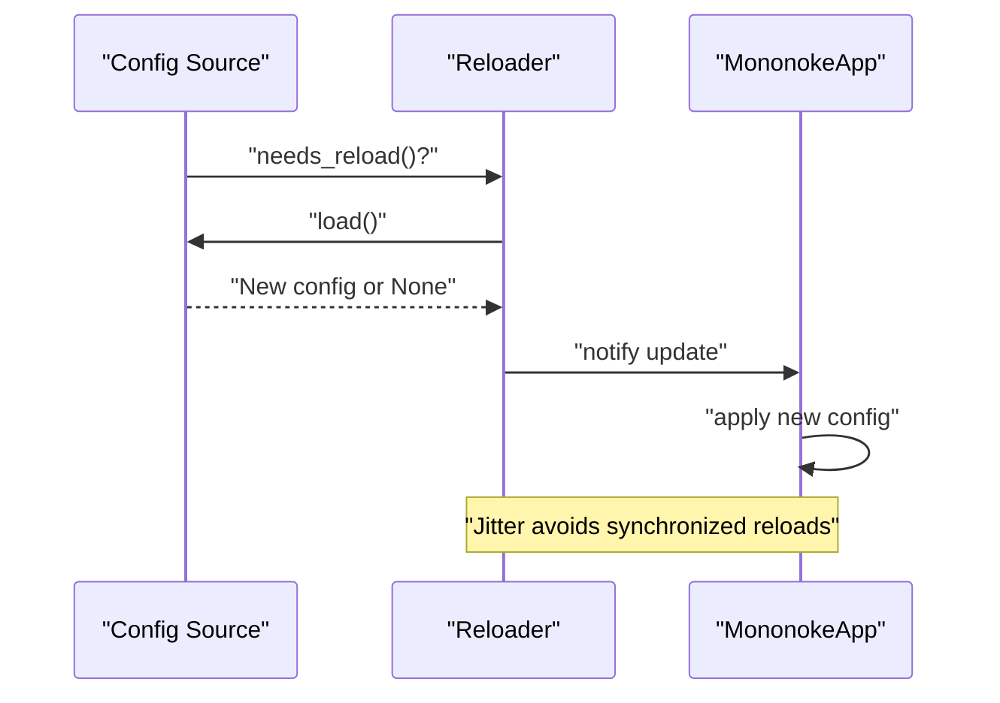
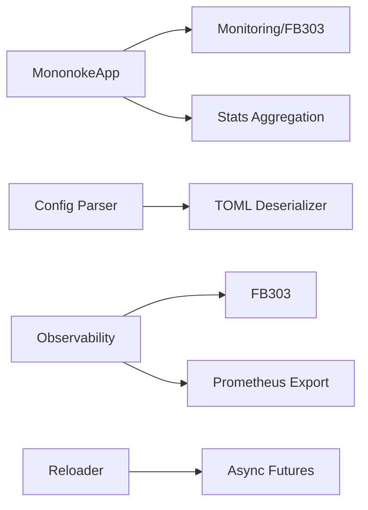
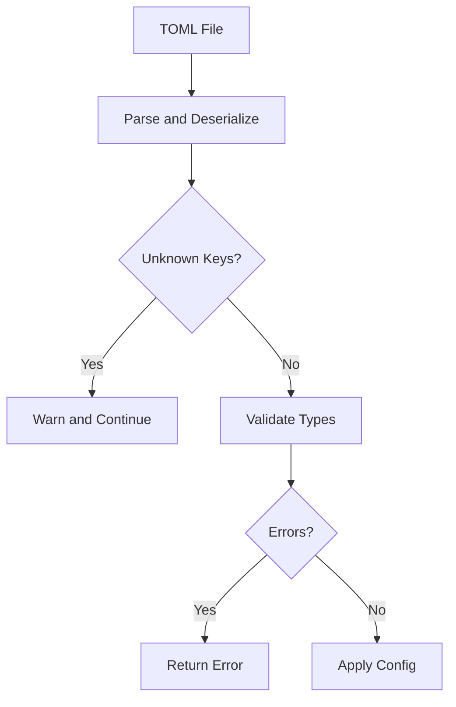

# Service Configuration and Deployment

<cite>
**Referenced Files in This Document**
- [1.3-architecture-overview.md](file://eden/mononoke/docs/1.3-architecture-overview.md)
- [6.3-monitoring-and-observability.md](file://eden/mononoke/docs/6.3-monitoring-and-observability.md)
- [app.rs](file://eden/mononoke/cmdlib/mononoke_app/src/app.rs)
- [runtime.rs](file://eden/mononoke/cmdlib/mononoke_app/src/args/runtime.rs)
- [config_args/lib.rs](file://eden/mononoke/cmdlib/config_args/src/lib.rs)
- [raw.rs](file://eden/mononoke/metaconfig/parser/src/raw.rs)
- [TomlFileConfigSource.cpp](file://eden/fs/config/TomlFileConfigSource.cpp)
- [error.rs](file://eden/scm/lib/config/model/src/error.rs)
- [lib.rs](file://eden/mononoke/common/reloader/src/lib.rs)
- [StartupStatusSubscriber.cpp](file://eden/fs/service/StartupStatusSubscriber.cpp)
- [StartupStatusSubscriberTest.cpp](file://eden/fs/service/test/StartupStatusSubscriberTest.cpp)
- [EdenMain.cpp](file://eden/fs/service/EdenMain.cpp)
- [library.sh](file://eden/mononoke/tests/integration/library.sh)
- [scs_errors/lib.rs](file://eden/mononoke/servers/scs/scs_errors/src/lib.rs)
- [daemon.py](file://eden/fs/cli/daemon.py)
- [monitoring_and_alerts.md](file://eden/docs/Engineering/Repo_Support_On_Remote_Execution/monitoring_and_alerts.md)
</cite>

## Table of Contents
1. [Introduction](#introduction)
2. [Project Structure](#project-structure)
3. [Core Components](#core-components)
4. [Architecture Overview](#architecture-overview)
5. [Detailed Component Analysis](#detailed-component-analysis)
6. [Dependency Analysis](#dependency-analysis)
7. [Performance Considerations](#performance-considerations)
8. [Troubleshooting Guide](#troubleshooting-guide)
9. [Conclusion](#conclusion)
10. [Appendices](#appendices)

## Introduction
This document provides comprehensive guidance for configuring and deploying the Mononoke service. It covers service startup procedures, configuration file formats, runtime parameter tuning, deployment architectures, containerization strategies, infrastructure requirements, service discovery, health checks, auto-scaling, production/staging/development examples, configuration validation and hot-reloading, zero-downtime updates, monitoring/alerting, and operational procedures.

## Project Structure
Mononoke is a distributed system composed of:
- Stateless frontend services (SLAPI, Git, LFS, SCS)
- Internal microservices (Land, Derived Data, Diff, Bookmark)
- Shared backend storage (Blobstore, Metadata DB)
- Observability and monitoring (FB303, Prometheus, Scuba, ODS)
- Configuration and runtime tuning (TOML, CLI args, cached config)

**Diagram sources**
- [1.3-architecture-overview.md:23-93](file://eden/mononoke/docs/1.3-architecture-overview.md#L23-L93)

**Section sources**
- [1.3-architecture-overview.md:19-116](file://eden/mononoke/docs/1.3-architecture-overview.md#L19-L116)

## Core Components
- Application framework and lifecycle: Mononoke applications use a unified framework for startup, monitoring, graceful shutdown, and repository initialization.
- Configuration system: TOML-based configuration with validation, unknown key warnings, and cached reloadable config.
- Observability: Metrics (ODS), structured logs (Scuba), tracing, health checks, and FB303/Prometheus export.
- Reloader: Periodic and forced reload of configuration/state with jitter to avoid thundering herd.
- Startup status signaling: Channel-based startup completion and subscriber notifications.

**Section sources**
- [app.rs:202-237](file://eden/mononoke/cmdlib/mononoke_app/src/app.rs#L202-L237)
- [raw.rs:161-194](file://eden/mononoke/metaconfig/parser/src/raw.rs#L161-L194)
- [TomlFileConfigSource.cpp:84-127](file://eden/fs/config/TomlFileConfigSource.cpp#L84-L127)
- [error.rs:16-53](file://eden/scm/lib/config/model/src/error.rs#L16-L53)
- [lib.rs:1-211](file://eden/mononoke/common/reloader/src/lib.rs#L1-L211)
- [StartupStatusSubscriber.cpp:16-45](file://eden/fs/service/StartupStatusSubscriber.cpp#L16-L45)

## Architecture Overview
Mononoke’s service architecture emphasizes:
- Independent scaling of tiers
- Workload isolation via microservices
- Sequential coordination for operations requiring mutual exclusion
- Stateless frontend services
- Resource allocation tailored per service

**Diagram sources**
- [1.3-architecture-overview.md:95-107](file://eden/mononoke/docs/1.3-architecture-overview.md#L95-L107)

**Section sources**
- [1.3-architecture-overview.md:95-116](file://eden/mononoke/docs/1.3-architecture-overview.md#L95-L116)

## Detailed Component Analysis

### Service Startup and Lifecycle
- The application framework initializes monitoring, stats aggregation, and runs the main server future.
- Graceful shutdown supports quiescing and a shutdown grace period.
- Startup status signaling uses a channel to publish progress and mark completion.

**Diagram sources**
- [app.rs:202-237](file://eden/mononoke/cmdlib/mononoke_app/src/app.rs#L202-L237)

**Section sources**
- [app.rs:202-237](file://eden/mononoke/cmdlib/mononoke_app/src/app.rs#L202-L237)
- [StartupStatusSubscriber.cpp:16-45](file://eden/fs/service/StartupStatusSubscriber.cpp#L16-L45)
- [StartupStatusSubscriberTest.cpp:49-129](file://eden/fs/service/test/StartupStatusSubscriberTest.cpp#L49-L129)
- [EdenMain.cpp:592-623](file://eden/fs/service/EdenMain.cpp#L592-L623)

### Configuration File Formats and Validation
- TOML configuration is parsed with strictness:
  - Unknown keys produce warnings.
  - UTF-8 and type conversion errors are surfaced.
  - Values are normalized (booleans, arrays) for downstream consumption.
- CLI argument-driven configuration supports production vs. development modes and tier selection.

**Diagram sources**
- [raw.rs:161-194](file://eden/mononoke/metaconfig/parser/src/raw.rs#L161-L194)
- [TomlFileConfigSource.cpp:84-127](file://eden/fs/config/TomlFileConfigSource.cpp#L84-L127)
- [error.rs:16-53](file://eden/scm/lib/config/model/src/error.rs#L16-L53)

**Section sources**
- [raw.rs:161-194](file://eden/mononoke/metaconfig/parser/src/raw.rs#L161-L194)
- [TomlFileConfigSource.cpp:84-127](file://eden/fs/config/TomlFileConfigSource.cpp#L84-L127)
- [error.rs:16-53](file://eden/scm/lib/config/model/src/error.rs#L16-L53)
- [config_args/lib.rs:45-87](file://eden/mononoke/cmdlib/config_args/src/lib.rs#L45-L87)

### Runtime Parameter Tuning
- Runtime arguments include thread count and worker thread stack size for the Tokio runtime.
- These tune concurrency and memory footprint for different workloads.

**Section sources**
- [runtime.rs:10-21](file://eden/mononoke/cmdlib/mononoke_app/src/args/runtime.rs#L10-L21)

### Observability and Monitoring
- Metrics: ODS-exported counters, timeseries, histograms.
- Logging: Scuba structured logs with verbosity control and sampling.
- Tracing: Hierarchical spans integrated with request context.
- Health checks: HTTP endpoints and FB303 status reporting.
- Prometheus export: FB303 metrics exposed via Prometheus-compatible port.

**Diagram sources**
- [6.3-monitoring-and-observability.md:17-425](file://eden/mononoke/docs/6.3-monitoring-and-observability.md#L17-L425)

**Section sources**
- [6.3-monitoring-and-observability.md:17-425](file://eden/mononoke/docs/6.3-monitoring-and-observability.md#L17-L425)

### Hot-Reloadable Configuration and Zero-Downtime Updates
- Reloader supports periodic reloads with jitter and forced reload signaling.
- Configuration can be updated without restarting servers; observability config is loaded via cached_config.

**Diagram sources**
- [lib.rs:82-203](file://eden/mononoke/common/reloader/src/lib.rs#L82-L203)

**Section sources**
- [lib.rs:1-211](file://eden/mononoke/common/reloader/src/lib.rs#L1-L211)
- [6.3-monitoring-and-observability.md:386-402](file://eden/mononoke/docs/6.3-monitoring-and-observability.md#L386-L402)

### Health Checks and Auto-Scaling
- HTTP health endpoints return readiness and exit status during shutdown.
- FB303 provides status and counters; optional Prometheus export for autoscaling integrations.
- SCS error classification aids in overload detection.

**Section sources**
- [6.3-monitoring-and-observability.md:284-318](file://eden/mononoke/docs/6.3-monitoring-and-observability.md#L284-L318)
- [scs_errors/lib.rs:47-91](file://eden/mononoke/servers/scs/scs_errors/src/lib.rs#L47-L91)

### Service Discovery and Load Balancing
- Stateless frontend services are horizontally scalable.
- Health checks enable load balancers to route traffic and drain instances gracefully.
- Environment variables influence client behavior and authentication in development-like environments.

**Section sources**
- [1.3-architecture-overview.md:95-107](file://eden/mononoke/docs/1.3-architecture-overview.md#L95-L107)
- [6.3-monitoring-and-observability.md:284-318](file://eden/mononoke/docs/6.3-monitoring-and-observability.md#L284-L318)
- [daemon.py:457-492](file://eden/fs/cli/daemon.py#L457-L492)

### Containerization Strategies
- Stateless services are ideal for containerization; bind ports via CLI flags and expose health endpoints.
- Use environment variables to configure observability and caching modes.
- Mount volumes for logs and caches as needed; keep blobstore and metadata DB external to containers.

[No sources needed since this section provides general guidance]

### Infrastructure Requirements
- CPU, memory, and I/O profiles vary by service tier; provision accordingly.
- Shared backend storage (Blobstore, Metadata DB) must be highly available and performant.
- Caching layers (Cachelib, Memcache) reduce backend load.

**Section sources**
- [1.3-architecture-overview.md:438-437](file://eden/mononoke/docs/1.3-architecture-overview.md#L438-L437)

### Production, Staging, and Development Setups
- Production: Tier-based configuration via configerator; enable FB303 and Prometheus; tuned runtime threads; verbose logging gated by observability config.
- Staging: Similar to production with reduced cache modes and lower verbosity; use development CLI flags.
- Development: Local TOML files; smaller runtime threads; enable detailed tracing and local log output.

**Section sources**
- [config_args/lib.rs:45-87](file://eden/mononoke/cmdlib/config_args/src/lib.rs#L45-L87)
- [6.3-monitoring-and-observability.md:386-402](file://eden/mononoke/docs/6.3-monitoring-and-observability.md#L386-L402)
- [runtime.rs:10-21](file://eden/mononoke/cmdlib/mononoke_app/src/args/runtime.rs#L10-L21)

## Dependency Analysis
- Application framework depends on monitoring and stats crates.
- Configuration parsing depends on TOML deserialization and unknown-key tracking.
- Observability depends on FB303 and Prometheus exporters.
- Reloader depends on async primitives and controlled futures.

**Diagram sources**
- [app.rs:202-237](file://eden/mononoke/cmdlib/mononoke_app/src/app.rs#L202-L237)
- [raw.rs:161-194](file://eden/mononoke/metaconfig/parser/src/raw.rs#L161-L194)
- [lib.rs:82-203](file://eden/mononoke/common/reloader/src/lib.rs#L82-L203)

**Section sources**
- [app.rs:202-237](file://eden/mononoke/cmdlib/mononoke_app/src/app.rs#L202-L237)
- [raw.rs:161-194](file://eden/mononoke/metaconfig/parser/src/raw.rs#L161-L194)
- [lib.rs:1-211](file://eden/mononoke/common/reloader/src/lib.rs#L1-L211)

## Performance Considerations
- Tune runtime threads for CPU-bound workloads; adjust stack size for deep recursion.
- Use cache modes to balance performance and memory usage.
- Monitor histograms and percentiles to detect tail latency increases.
- Use jittered reloads to avoid synchronized reconfiguration spikes.

[No sources needed since this section provides general guidance]

## Troubleshooting Guide
- Use integration helpers to wait for service readiness and capture logs on failure.
- Health check endpoints indicate startup status and exit state.
- SCS error statuses classify request/internal/overload/poll errors for triage.
- Startup status subscribers throw if added after startup completion.

**Section sources**
- [library.sh:333-381](file://eden/mononoke/tests/integration/library.sh#L333-L381)
- [6.3-monitoring-and-observability.md:284-318](file://eden/mononoke/docs/6.3-monitoring-and-observability.md#L284-L318)
- [scs_errors/lib.rs:47-91](file://eden/mononoke/servers/scs/scs_errors/src/lib.rs#L47-L91)
- [StartupStatusSubscriber.cpp:26-34](file://eden/fs/service/StartupStatusSubscriber.cpp#L26-L34)

## Conclusion
Mononoke’s architecture and operational tooling enable robust, scalable deployments. By leveraging TOML configuration, hot-reloadable observability, health checks, and FB303/Prometheus integration, teams can operate reliable production services with predictable scaling and strong observability.

[No sources needed since this section summarizes without analyzing specific files]

## Appendices

### Appendix A: Configuration Validation Flow

**Diagram sources**
- [raw.rs:161-194](file://eden/mononoke/metaconfig/parser/src/raw.rs#L161-L194)
- [TomlFileConfigSource.cpp:84-127](file://eden/fs/config/TomlFileConfigSource.cpp#L84-L127)

### Appendix B: Monitoring and Alerting Procedures
- Configure FB303 and Prometheus ports; set Scuba dataset and cache mode.
- Use observability config to control verbosity and sampling.
- On-call rotation and escalation paths are documented for remote execution support.

**Section sources**
- [6.3-monitoring-and-observability.md:386-402](file://eden/mononoke/docs/6.3-monitoring-and-observability.md#L386-L402)
- [monitoring_and_alerts.md:23-36](file://eden/docs/Engineering/Repo_Support_On_Remote_Execution/monitoring_and_alerts.md#L23-L36)