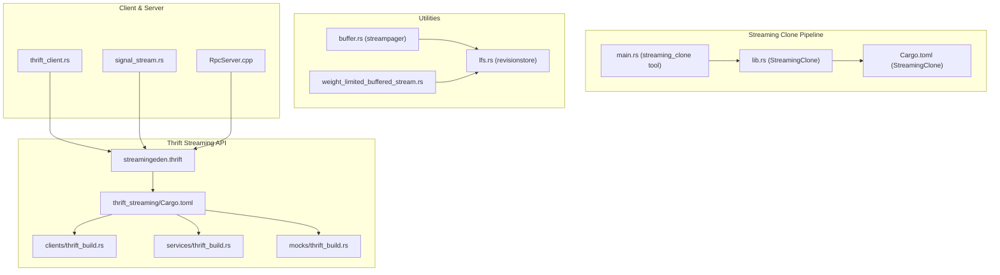
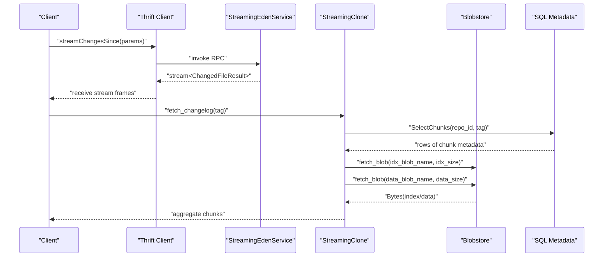
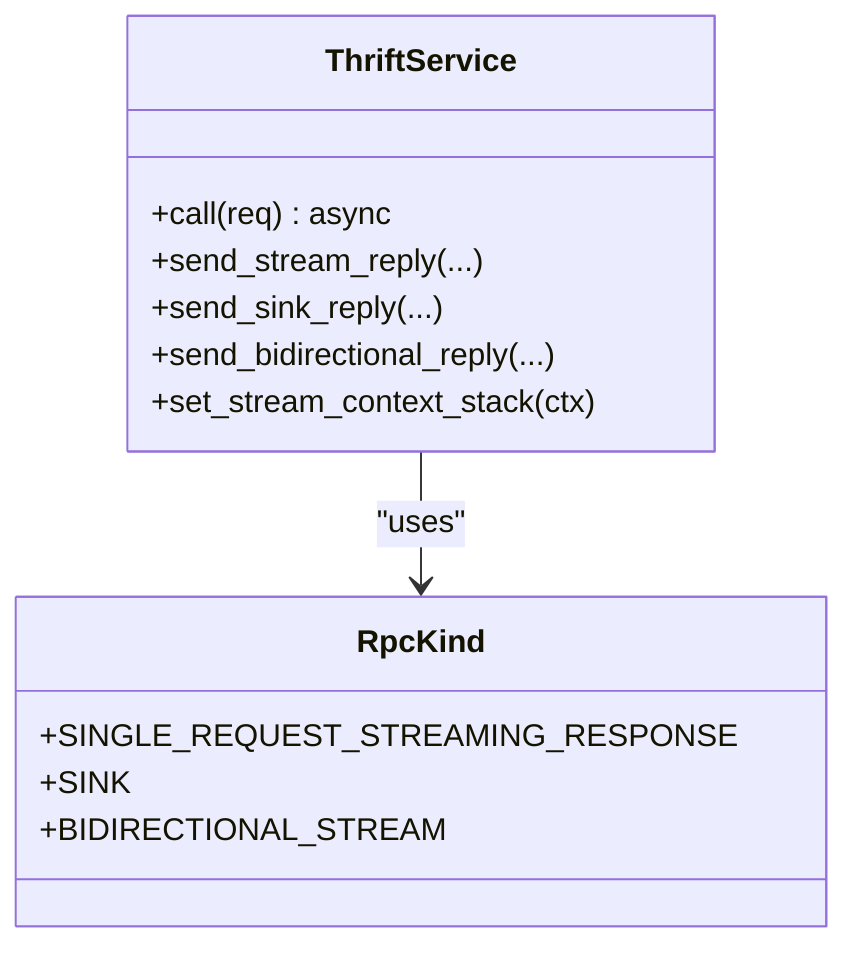
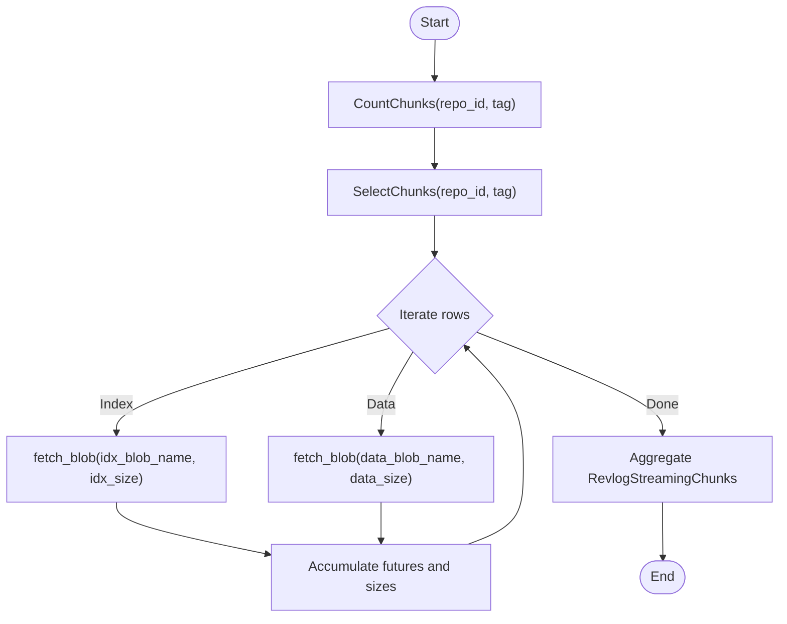
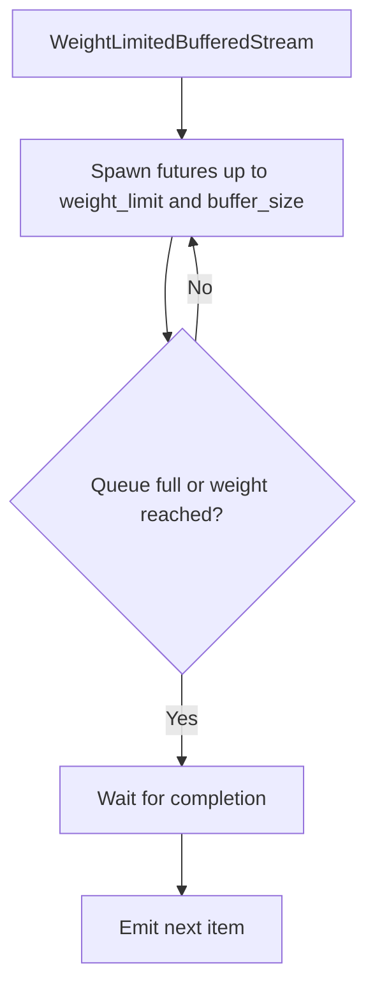
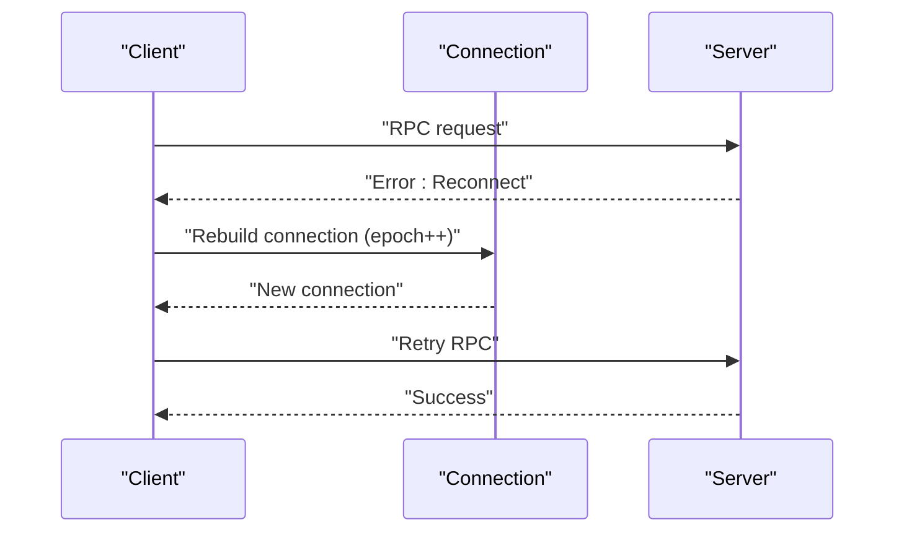
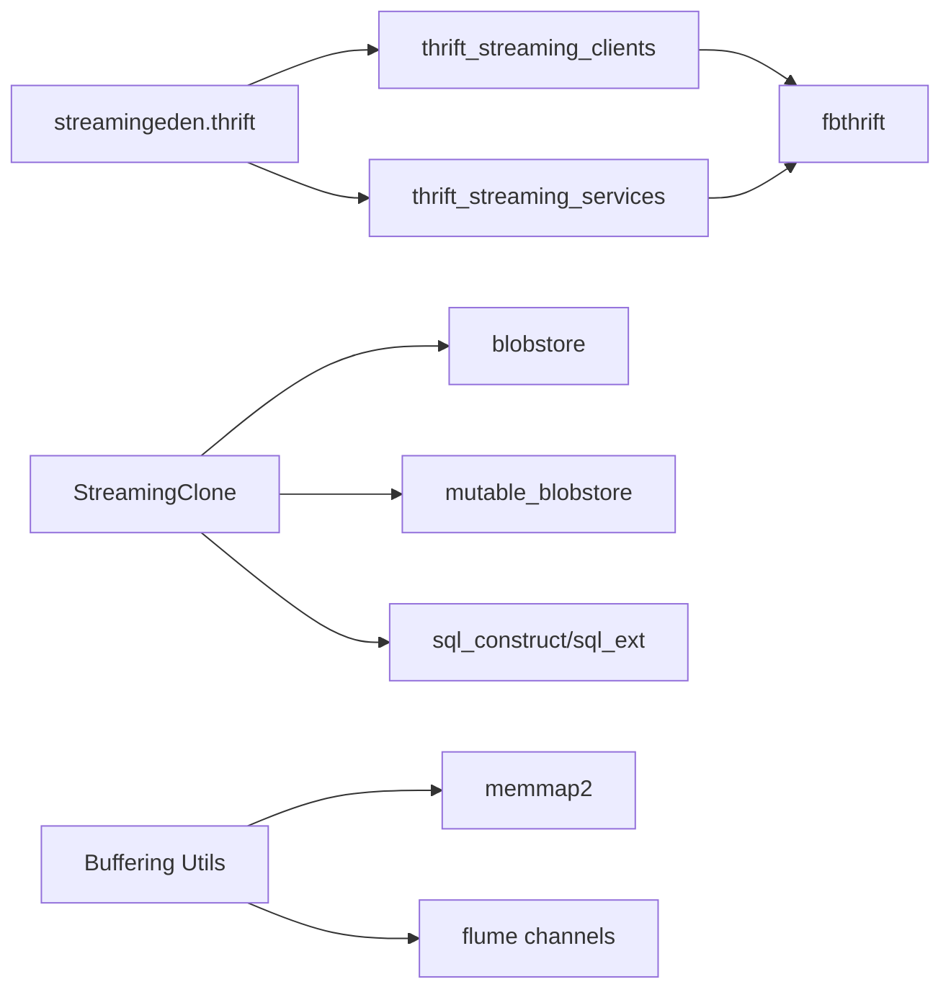

# Streaming Service

<cite>
**Referenced Files in This Document**
- [streamingeden.thrift](file://eden/fs/service/streamingeden.thrift)
- [thrift_streaming/Cargo.toml](file://eden/fs/service/thrift_streaming/Cargo.toml)
- [thrift_streaming/clients/thrift_build.rs](file://eden/fs/service/thrift_streaming/clients/thrift_build.rs)
- [thrift_streaming/clients/thrift_lib.rs](file://eden/fs/service/thrift_streaming/clients/thrift_lib.rs)
- [thrift_streaming/services/thrift_build.rs](file://eden/fs/service/thrift_streaming/services/thrift_build.rs)
- [thrift_streaming/services/thrift_lib.rs](file://eden/fs/service/thrift_streaming/services/thrift_lib.rs)
- [thrift_streaming/mocks/thrift_build.rs](file://eden/fs/service/thrift_streaming/mocks/thrift_build.rs)
- [thrift_streaming/mocks/thrift_lib.rs](file://eden/fs/service/thrift_streaming/mocks/thrift_lib.rs)
- [processor.rs](file://thrift/lib/rust/src/processor.rs)
- [lib.rs (StreamingClone)](file://eden/mononoke/repo_client/streaming_clone/src/lib.rs)
- [Cargo.toml (StreamingClone)](file://eden/mononoke/repo_client/streaming_clone/Cargo.toml)
- [main.rs (streaming_clone tool)](file://eden/mononoke/tools/streaming_clone/src/main.rs)
- [streamclone.py](file://eden/scm/sapling/streamclone.py)
- [buffer.rs (streampager)](file://eden/scm/lib/third-party/streampager/src/buffer.rs)
- [lfs.rs (revisionstore)](file://eden/scm/lib/revisionstore/src/lfs.rs)
- [signal_stream.rs](file://eden/mononoke/common/gotham_ext/src/response/signal_stream.rs)
- [RpcServer.cpp](file://eden/fs/nfs/rpc/RpcServer.cpp)
- [ACR_unbounded_concurrency.md](file://eden/.llms/rules/ACR_unbounded_concurrency.md)
- [weight_limited_buffered_stream.rs](file://common/rust/shed/futures_ext/src/stream/weight_limited_buffered_stream.rs)
- [thrift_client.rs](file://eden/fs/cli_rs/edenfs-client/src/client/thrift_client.rs)
</cite>

## Table of Contents
1. [Introduction](#introduction)
2. [Project Structure](#project-structure)
3. [Core Components](#core-components)
4. [Architecture Overview](#architecture-overview)
5. [Detailed Component Analysis](#detailed-component-analysis)
6. [Dependency Analysis](#dependency-analysis)
7. [Performance Considerations](#performance-considerations)
8. [Troubleshooting Guide](#troubleshooting-guide)
9. [Conclusion](#conclusion)

## Introduction
This document describes the Streaming Service Thrift API used for large data transfers, real-time updates, and continuous data feeds. It covers streaming operation patterns, connection management, data frame formats, performance optimization techniques, buffer management, bandwidth adaptation, error handling strategies for interrupted streams, reconnection logic, and data consistency guarantees. It also includes examples of implementing streaming clients and servers, handling backpressure, and optimizing throughput for large repository operations.

## Project Structure
The Streaming Service spans several areas:
- Thrift service definition for streaming APIs
- Rust crates for clients, services, and mocks
- Streaming clone pipeline for large repository data ingestion
- Buffering and backpressure utilities
- Client-side reconnection and error handling
- Server-side streaming response signaling

**Diagram sources**
- [streamingeden.thrift:139-251](file://eden/fs/service/streamingeden.thrift#L139-L251)
- [thrift_streaming/Cargo.toml:1-32](file://eden/fs/service/thrift_streaming/Cargo.toml#L1-L32)
- [thrift_streaming/clients/thrift_build.rs:1-32](file://eden/fs/service/thrift_streaming/clients/thrift_build.rs#L1-L32)
- [thrift_streaming/services/thrift_build.rs:1-31](file://eden/fs/service/thrift_streaming/services/thrift_build.rs#L1-L31)
- [thrift_streaming/mocks/thrift_build.rs:1-28](file://eden/fs/service/thrift_streaming/mocks/thrift_build.rs#L1-L28)
- [lib.rs (StreamingClone):1-305](file://eden/mononoke/repo_client/streaming_clone/src/lib.rs#L1-L305)
- [Cargo.toml (StreamingClone):1-23](file://eden/mononoke/repo_client/streaming_clone/Cargo.toml#L1-L23)
- [main.rs (streaming_clone tool):45-155](file://eden/mononoke/tools/streaming_clone/src/main.rs#L45-L155)
- [buffer.rs (streampager):1-47](file://eden/scm/lib/third-party/streampager/src/buffer.rs#L1-L47)
- [lfs.rs (revisionstore):2057-2103](file://eden/scm/lib/revisionstore/src/lfs.rs#L2057-L2103)
- [weight_limited_buffered_stream.rs:38-264](file://common/rust/shed/futures_ext/src/stream/weight_limited_buffered_stream.rs#L38-L264)
- [thrift_client.rs:162-189](file://eden/fs/cli_rs/edenfs-client/src/client/thrift_client.rs#L162-L189)
- [signal_stream.rs:43-108](file://eden/mononoke/common/gotham_ext/src/response/signal_stream.rs#L43-L108)
- [RpcServer.cpp:481-511](file://eden/fs/nfs/rpc/RpcServer.cpp#L481-L511)

**Section sources**
- [streamingeden.thrift:139-251](file://eden/fs/service/streamingeden.thrift#L139-L251)
- [thrift_streaming/Cargo.toml:1-32](file://eden/fs/service/thrift_streaming/Cargo.toml#L1-L32)

## Core Components
- StreamingEdenService: Defines streaming endpoints for journal changes, filesystem events, Thrift request events, Mercurial events, inode events, task events, and startup status updates. It extends the base EdenService to separate streaming capabilities from legacy runtimes.
- StreamingClone: Provides streaming clone utilities for large repository data ingestion via chunked blobs and SQL-backed metadata.
- Buffering Utilities: Memory-mapped buffers and limited buffer pools for efficient streaming data handling.
- Backpressure Controls: Weight-limited buffered streams and bounded concurrency patterns to prevent overload.
- Client Reconnection: Robust reconnection logic with epoch-based connection management.
- Server Streaming Signaling: Stream wrapper that reports body metadata and error context upon completion.

**Section sources**
- [streamingeden.thrift:139-251](file://eden/fs/service/streamingeden.thrift#L139-L251)
- [lib.rs (StreamingClone):1-305](file://eden/mononoke/repo_client/streaming_clone/src/lib.rs#L1-L305)
- [buffer.rs (streampager):1-47](file://eden/scm/lib/third-party/streampager/src/buffer.rs#L1-L47)
- [lfs.rs (revisionstore):2057-2103](file://eden/scm/lib/revisionstore/src/lfs.rs#L2057-L2103)
- [weight_limited_buffered_stream.rs:38-264](file://common/rust/shed/futures_ext/src/stream/weight_limited_buffered_stream.rs#L38-L264)
- [thrift_client.rs:162-189](file://eden/fs/cli_rs/edenfs-client/src/client/thrift_client.rs#L162-L189)
- [signal_stream.rs:43-108](file://eden/mononoke/common/gotham_ext/src/response/signal_stream.rs#L43-L108)

## Architecture Overview
The Streaming Service integrates a Thrift-defined streaming API with Rust-generated clients and services. Large repository operations leverage a streaming clone pipeline backed by blob storage and SQL metadata. Buffering and backpressure utilities ensure throughput while preventing resource exhaustion. Clients handle reconnection and error propagation, while servers signal completion and error metadata.

**Diagram sources**
- [streamingeden.thrift:222-237](file://eden/fs/service/streamingeden.thrift#L222-L237)
- [lib.rs (StreamingClone):196-237](file://eden/mononoke/repo_client/streaming_clone/src/lib.rs#L196-L237)
- [Cargo.toml (StreamingClone):1-23](file://eden/mononoke/repo_client/streaming_clone/Cargo.toml#L1-L23)

## Detailed Component Analysis

### StreamingEdenService API
- Methods:
  - streamJournalChanged(mountPoint): Returns a stream of journal position updates.
  - traceFsEvents(mountPoint, eventCategoryMask): Streams filesystem request/response events.
  - traceThriftRequestEvents(): Streams Thrift request lifecycle events.
  - traceHgEvents(mountPoint): Streams Mercurial import events.
  - traceInodeEvents(mountPoint): Streams inode materialization/load events.
  - traceTaskEvents(request): Streams task completion events.
  - streamChangesSince(params): Streams file changes since a position, returning a result with the final position and a stream of ChangedFileResult items.
  - streamSelectedChangesSince(params): Streams filtered file changes by globs.
  - streamStartStatus(): Streams daemon startup status updates.

- Data Frames:
  - ChangedFileResult: Contains path, SCM status, and dtype for each file.
  - ChangesSinceResult: Contains the final JournalPosition to continue subsequent queries.
  - FsEvent: Includes timestamps, monotonic time, request info, and result code or HRESULT.

- Notes:
  - Use the returned JournalPosition from ChangesSinceResult to avoid missing updates.
  - Streams can be large; implement bounding and early termination on the client.

**Section sources**
- [streamingeden.thrift:33-79](file://eden/fs/service/streamingeden.thrift#L33-L79)
- [streamingeden.thrift:99-111](file://eden/fs/service/streamingeden.thrift#L99-L111)
- [streamingeden.thrift:116-127](file://eden/fs/service/streamingeden.thrift#L116-L127)
- [streamingeden.thrift:139-251](file://eden/fs/service/streamingeden.thrift#L139-L251)

### Rust Thrift Streaming Infrastructure
- Processor and RPC kinds:
  - RpcKind enumerates streaming categories including SINGLE_REQUEST_STREAMING_RESPONSE, SINK, and BIDIRECTIONAL_STREAM.
  - set_interaction_processor and set_stream_context_stack enable streaming-specific metrics and context passing to C++ infrastructure.

- Crate composition:
  - thrift_streaming: Core types and generated code.
  - thrift_streaming_clients: Client bindings built from streamingeden.thrift.
  - thrift_streaming_services: Service-side generated code and build configuration.

- Build configuration:
  - clients/thrift_build.rs and services/thrift_build.rs define cratemap and generation options for streamingeden.thrift.

**Diagram sources**
- [processor.rs:78-137](file://thrift/lib/rust/src/processor.rs#L78-L137)

**Section sources**
- [processor.rs:78-137](file://thrift/lib/rust/src/processor.rs#L78-L137)
- [thrift_streaming/Cargo.toml:1-32](file://eden/fs/service/thrift_streaming/Cargo.toml#L1-L32)
- [thrift_streaming/clients/thrift_build.rs:1-32](file://eden/fs/service/thrift_streaming/clients/thrift_build.rs#L1-L32)
- [thrift_streaming/services/thrift_build.rs:1-31](file://eden/fs/service/thrift_streaming/services/thrift_build.rs#L1-L31)
- [thrift_streaming/mocks/thrift_build.rs:1-28](file://eden/fs/service/thrift_streaming/mocks/thrift_build.rs#L1-L28)

### Streaming Clone Pipeline
- Purpose: Efficiently ingest large repository data by splitting changelog into indexed and data chunks, storing metadata in SQL, and fetching blobs asynchronously.
- Key elements:
  - StreamingCloneBuilder: SQL schema creation and metadata database configuration.
  - StreamingClone: Chunk counting, fetching, insertion, and size aggregation.
  - RevlogStreamingChunks: Accumulates futures for index and data blobs with sizes.

**Diagram sources**
- [lib.rs (StreamingClone):64-105](file://eden/mononoke/repo_client/streaming_clone/src/lib.rs#L64-L105)
- [lib.rs (StreamingClone):196-237](file://eden/mononoke/repo_client/streaming_clone/src/lib.rs#L196-L237)

**Section sources**
- [lib.rs (StreamingClone):1-305](file://eden/mononoke/repo_client/streaming_clone/src/lib.rs#L1-L305)
- [Cargo.toml (StreamingClone):1-23](file://eden/mononoke/repo_client/streaming_clone/Cargo.toml#L1-L23)
- [main.rs (streaming_clone tool):45-155](file://eden/mononoke/tools/streaming_clone/src/main.rs#L45-L155)

### Buffering and Backpressure Utilities
- Fillable Buffer (streampager): Memory-mapped buffer supporting simultaneous append writes and read regions, guarded by a mutex for single-writer safety.
- Limited Buffer Pool (revisionstore): Fixed-capacity pool of reusable buffers with garbage collection to reclaim unused buffers.
- Weight-Limited Buffered Stream: Limits concurrent work by weight and buffer size, emitting results in order while controlling resource usage.

**Diagram sources**
- [weight_limited_buffered_stream.rs:38-264](file://common/rust/shed/futures_ext/src/stream/weight_limited_buffered_stream.rs#L38-L264)
- [buffer.rs (streampager):1-47](file://eden/scm/lib/third-party/streampager/src/buffer.rs#L1-L47)
- [lfs.rs (revisionstore):2057-2103](file://eden/scm/lib/revisionstore/src/lfs.rs#L2057-L2103)

**Section sources**
- [buffer.rs (streampager):1-47](file://eden/scm/lib/third-party/streampager/src/buffer.rs#L1-L47)
- [lfs.rs (revisionstore):2057-2103](file://eden/scm/lib/revisionstore/src/lfs.rs#L2057-L2103)
- [weight_limited_buffered_stream.rs:38-264](file://common/rust/shed/futures_ext/src/stream/weight_limited_buffered_stream.rs#L38-L264)

### Client Reconnection and Error Handling
- Reconnection Strategy:
  - On Reconnect error handling, the client tears down and rebuilds the connection, increments the connection epoch, and retries.
- Stream Completion Signaling:
  - SignalStream wraps a stream to report total bytes sent and error metadata upon completion or drop.

**Diagram sources**
- [thrift_client.rs:162-189](file://eden/fs/cli_rs/edenfs-client/src/client/thrift_client.rs#L162-L189)
- [signal_stream.rs:43-108](file://eden/mononoke/common/gotham_ext/src/response/signal_stream.rs#L43-L108)

**Section sources**
- [thrift_client.rs:162-189](file://eden/fs/cli_rs/edenfs-client/src/client/thrift_client.rs#L162-L189)
- [signal_stream.rs:43-108](file://eden/mononoke/common/gotham_ext/src/response/signal_stream.rs#L43-L108)

### Server-Side Streaming Response Handling
- Server writes streaming responses efficiently by offloading computation to a thread pool and ensuring writes occur on the event loop.
- Proper sequencing avoids blocking the event loop and ensures timely completion.

**Section sources**
- [RpcServer.cpp:481-511](file://eden/fs/nfs/rpc/RpcServer.cpp#L481-L511)

## Dependency Analysis
- Thrift Streaming API depends on:
  - eden.thrift for base types and namespaces.
  - thrift annotation packages for cross-language compatibility.
- Rust crates depend on fbthrift and futures for streaming primitives.
- StreamingClone depends on blobstore, mutable blobstore, and SQL constructs for metadata persistence.
- Buffering utilities depend on memory-mapped buffers and channel-based pools.

**Diagram sources**
- [streamingeden.thrift:8-16](file://eden/fs/service/streamingeden.thrift#L8-L16)
- [thrift_streaming/Cargo.toml:17-28](file://eden/fs/service/thrift_streaming/Cargo.toml#L17-L28)
- [Cargo.toml (StreamingClone):10-22](file://eden/mononoke/repo_client/streaming_clone/Cargo.toml#L10-L22)
- [buffer.rs (streampager):9-36](file://eden/scm/lib/third-party/streampager/src/buffer.rs#L9-L36)
- [lfs.rs (revisionstore):2060-2095](file://eden/scm/lib/revisionstore/src/lfs.rs#L2060-L2095)

**Section sources**
- [streamingeden.thrift:8-16](file://eden/fs/service/streamingeden.thrift#L8-L16)
- [thrift_streaming/Cargo.toml:17-28](file://eden/fs/service/thrift_streaming/Cargo.toml#L17-L28)
- [Cargo.toml (StreamingClone):10-22](file://eden/mononoke/repo_client/streaming_clone/Cargo.toml#L10-L22)

## Performance Considerations
- Concurrency and Backpressure:
  - Use buffer_unordered or Semaphores to cap concurrency and avoid backlog stampedes.
  - Prefer WeightLimitedBufferedStream to bound weight and buffer size for streaming tasks.
- Memory Management:
  - Reuse buffers via LimitedBufferPool to reduce allocation overhead.
  - Use fillable buffers for overlapping read/write patterns.
- Throughput Optimization:
  - Batch and coalesce small parts when appropriate.
  - Avoid releasing entire backlogs at once; drain gradually after outages.
- Bandwidth Adaptation:
  - Tune chunk sizes and buffer limits based on downstream capacity.
  - Monitor and adjust based on observed latency and CPU utilization.

**Section sources**
- [ACR_unbounded_concurrency.md:46-87](file://eden/.llms/rules/ACR_unbounded_concurrency.md#L46-L87)
- [weight_limited_buffered_stream.rs:38-264](file://common/rust/shed/futures_ext/src/stream/weight_limited_buffered_stream.rs#L38-L264)
- [lfs.rs (revisionstore):2057-2103](file://eden/scm/lib/revisionstore/src/lfs.rs#L2057-L2103)
- [buffer.rs (streampager):1-47](file://eden/scm/lib/third-party/streampager/src/buffer.rs#L1-L47)

## Troubleshooting Guide
- Stream Interruptions:
  - On Reconnect errors, rebuild the connection and retry. Verify epoch increments to avoid stale connections.
- Data Consistency:
  - Always use the final JournalPosition returned by streamChangesSince to avoid gaps.
  - For streaming clone, ensure chunk sizes match expectations; missing or corrupt blobs will surface as errors.
- Backpressure and Overload:
  - Reduce concurrency or increase buffer limits gradually.
  - Use weight-limited buffering to prevent resource exhaustion.
- Server Write Path:
  - Ensure computations are offloaded to thread pools and writes occur on the event loop to avoid stalls.

**Section sources**
- [thrift_client.rs:162-189](file://eden/fs/cli_rs/edenfs-client/src/client/thrift_client.rs#L162-L189)
- [streamingeden.thrift:222-226](file://eden/fs/service/streamingeden.thrift#L222-L226)
- [lib.rs (StreamingClone):155-178](file://eden/mononoke/repo_client/streaming_clone/src/lib.rs#L155-L178)
- [RpcServer.cpp:481-511](file://eden/fs/nfs/rpc/RpcServer.cpp#L481-L511)

## Conclusion
The Streaming Service Thrift API provides robust streaming capabilities for large data transfers and real-time updates. By combining well-defined streaming endpoints, efficient buffer management, and disciplined backpressure controls, systems can achieve high throughput while maintaining reliability. Client reconnection logic and server-side signaling ensure resilient operation under transient failures. The streaming clone pipeline demonstrates practical patterns for ingesting massive datasets with strong consistency guarantees.