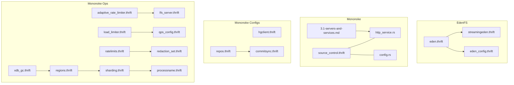
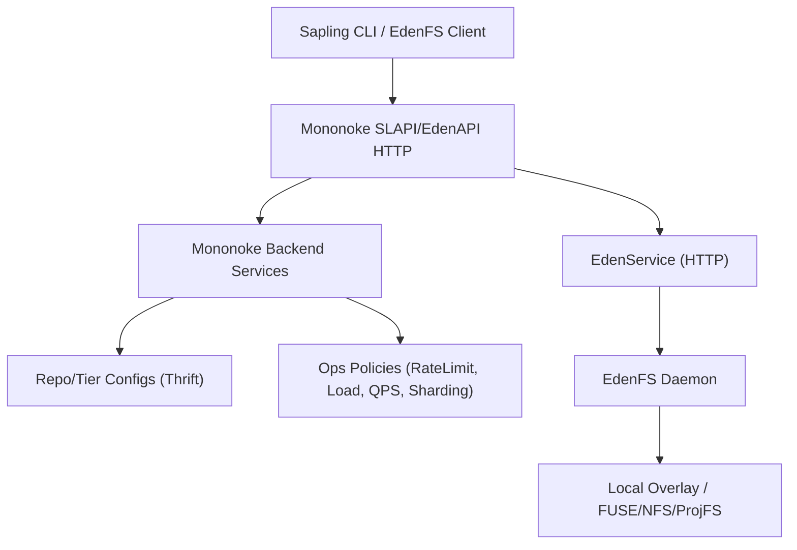
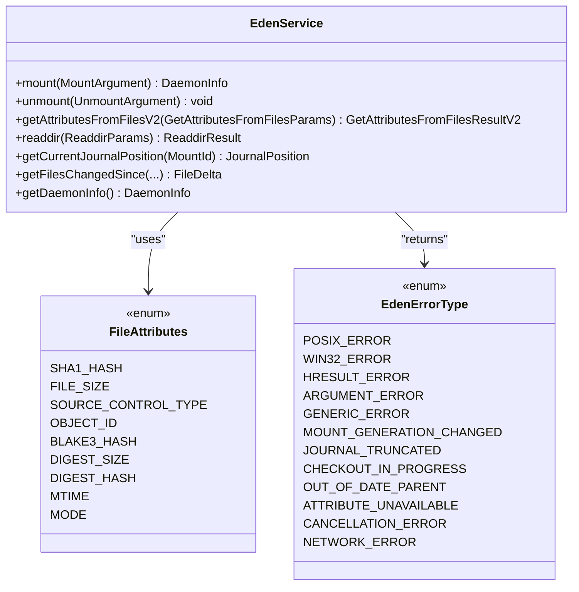
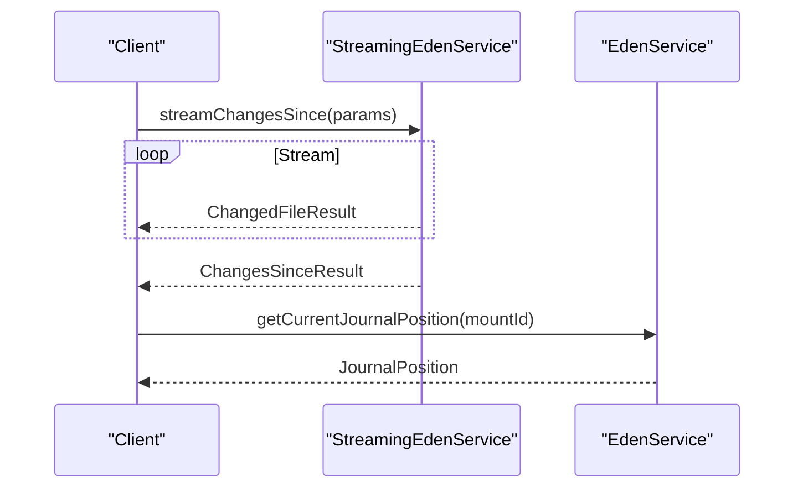
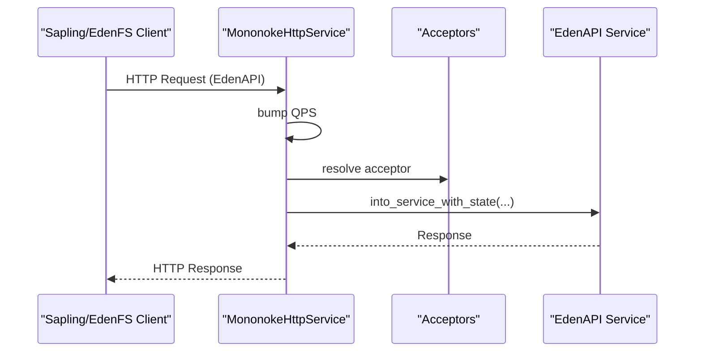
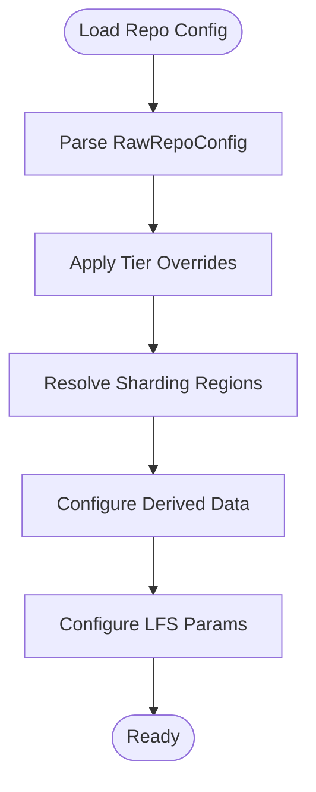
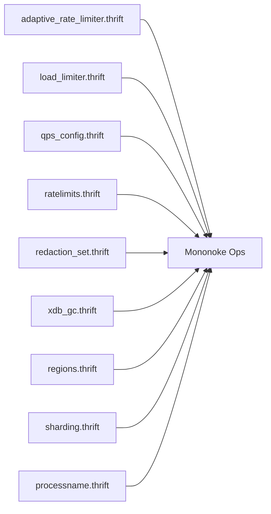
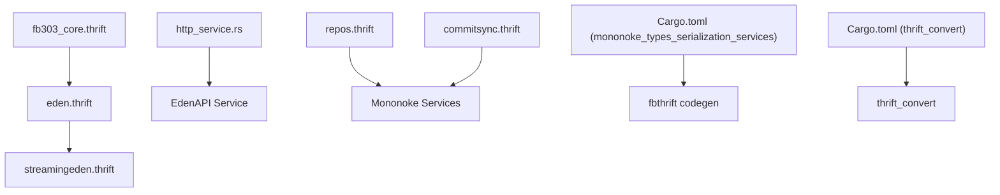

# Thrift API

<cite>
**Referenced Files in This Document**
- [eden.thrift](file://eden/fs/service/eden.thrift)
- [streamingeden.thrift](file://eden/fs/service/streamingeden.thrift)
- [eden_config.thrift](file://eden/fs/config/eden_config.thrift)
- [eden.py](file://eden/scm/sapling/testing/ext/mononoke.py)
- [http_service.rs](file://eden/mononoke/servers/slapi/slapi_server/repo_listener/src/http_service.rs)
- [config.rs](file://eden/mononoke/jobs/modern_sync/src/sender/edenapi/config.rs)
- [3.1-servers-and-services.md](file://eden/mononoke/docs/3.1-servers-and-services.md)
- [source_control.thrift](file://eden/mononoke/scs/if/source_control.thrift)
- [hgclient.thrift](file://configerator/structs/scm/hg/hgclientconf/hgclient.thrift)
- [repos.thrift](file://configerator/structs/scm/mononoke/repos/repos.thrift)
- [commitsync.thrift](file://configerator/structs/scm/mononoke/repos/commitsync.thrift)
- [adaptive_rate_limiter.thrift](file://configerator/structs/scm/mononoke/adaptive_rate_limiter/adaptive_rate_limiter.thrift)
- [lfs_server.thrift](file://configerator/structs/scm/mononoke/lfs_server/lfs_server.thrift)
- [load_limiter.thrift](file://configerator/structs/scm/mononoke/load_limiter/load_limiter.thrift)
- [qps_config.thrift](file://configerator/structs/scm/mononoke/qps/qps_config.thrift)
- [ratelimits.thrift](file://configerator/structs/scm/mononoke/ratelimiting/ratelimits.thrift)
- [redaction_set.thrift](file://configerator/structs/scm/mononoke/redaction/redaction_set.thrift)
- [xdb_gc.thrift](file://configerator/structs/scm/mononoke/xdb_gc/xdb_gc.thrift)
- [regions.thrift](file://configerator/structs/scm/mononoke/sharding/regions.thrift)
- [sharding.thrift](file://configerator/structs/scm/mononoke/sharding/sharding.thrift)
- [processname.thrift](file://configerator/structs/scm/mononoke/sharding/processname.thrift)
- [fb303_core.thrift](file://fb303/thrift/fb303_core.thrift)
- [Cargo.toml (mononoke_types_serialization_services)](file://eden/mononoke/mononoke_types/serialization/services/Cargo.toml)
- [Cargo.toml (thrift_convert)](file://eden/mononoke/common/thrift_convert/Cargo.toml)
</cite>

## Table of Contents
1. [Introduction](#introduction)
2. [Project Structure](#project-structure)
3. [Core Components](#core-components)
4. [Architecture Overview](#architecture-overview)
5. [Detailed Component Analysis](#detailed-component-analysis)
6. [Dependency Analysis](#dependency-analysis)
7. [Performance Considerations](#performance-considerations)
8. [Troubleshooting Guide](#troubleshooting-guide)
9. [Conclusion](#conclusion)
10. [Appendices](#appendices)

## Introduction
This document provides comprehensive Thrift API documentation for SAPLING SCM’s server-client communication protocols. It focuses on the Eden service (EdenFS Thrift APIs) and the Mononoke service (EdenAPI/SLAPI over HTTP), alongside related RPC interfaces and configuration structures used in the broader Mononoke ecosystem. It covers request/response schemas, method signatures, data types, authentication and connection management, error handling, protocol specifics, performance characteristics, backwards compatibility, service discovery and load balancing, and migration guidance for API version changes.

## Project Structure
The Thrift interfaces are organized by functional area:
- EdenFS Thrift service definitions for client–daemon communication
- Streaming variants for real-time event delivery
- Mononoke SLAPI/EdenAPI HTTP service integration
- Mononoke configuration and data model Thrift definitions
- Mononoke infrastructure and operational Thrift definitions (rate limiting, sharding, etc.)

**Diagram sources**
- [eden.thrift:1-800](file://eden/fs/service/eden.thrift#L1-L800)
- [streamingeden.thrift:1-252](file://eden/fs/service/streamingeden.thrift#L1-L252)
- [eden_config.thrift](file://eden/fs/config/eden_config.thrift)
- [source_control.thrift](file://eden/mononoke/scs/if/source_control.thrift)
- [3.1-servers-and-services.md:1-34](file://eden/mononoke/docs/3.1-servers-and-services.md#L1-L34)
- [http_service.rs:409-451](file://eden/mononoke/servers/slapi/slapi_server/repo_listener/src/http_service.rs#L409-L451)
- [config.rs:1-16](file://eden/mononoke/jobs/modern_sync/src/sender/edenapi/config.rs#L1-L16)
- [hgclient.thrift:1-131](file://configerator/structs/scm/hg/hgclientconf/hgclient.thrift#L1-L131)
- [repos.thrift:1-800](file://configerator/structs/scm/mononoke/repos/repos.thrift#L1-L800)
- [commitsync.thrift:1-78](file://configerator/structs/scm/mononoke/repos/commitsync.thrift#L1-L78)
- [adaptive_rate_limiter.thrift](file://configerator/structs/scm/mononoke/adaptive_rate_limiter/adaptive_rate_limiter.thrift)
- [lfs_server.thrift](file://configerator/structs/scm/mononoke/lfs_server/lfs_server.thrift)
- [load_limiter.thrift](file://configerator/structs/scm/mononoke/load_limiter/load_limiter.thrift)
- [qps_config.thrift](file://configerator/structs/scm/mononoke/qps/qps_config.thrift)
- [ratelimits.thrift](file://configerator/structs/scm/mononoke/ratelimiting/ratelimits.thrift)
- [redaction_set.thrift](file://configerator/structs/scm/mononoke/redaction/redaction_set.thrift)
- [xdb_gc.thrift](file://configerator/structs/scm/mononoke/xdb_gc/xdb_gc.thrift)
- [regions.thrift](file://configerator/structs/scm/mononoke/sharding/regions.thrift)
- [sharding.thrift](file://configerator/structs/scm/mononoke/sharding/sharding.thrift)
- [processname.thrift](file://configerator/structs/scm/mononoke/sharding/processname.thrift)

**Section sources**
- [eden.thrift:1-800](file://eden/fs/service/eden.thrift#L1-L800)
- [streamingeden.thrift:1-252](file://eden/fs/service/streamingeden.thrift#L1-L252)
- [3.1-servers-and-services.md:1-34](file://eden/mononoke/docs/3.1-servers-and-services.md#L1-L34)

## Core Components
- Eden Service (EdenFS Thrift APIs)
  - Defines mount lifecycle, file attributes, journaling, and error types used by EdenFS clients.
  - Includes typed unions for attribute retrieval and error propagation.
- StreamingEden Service
  - Extends EdenService with streaming endpoints for journal changes, filesystem events, and tracing.
- Mononoke SLAPI/EdenAPI over HTTP
  - Exposes Mononoke services via HTTP with TLS and QPS accounting.
- Mononoke Configuration and Data Models
  - Repo definitions, commit sync, and tiered configuration structures.
- Infrastructure and Operational Thrift
  - Rate limiting, load limiting, QPS configuration, sharding, and operational policies.

**Section sources**
- [eden.thrift:1-800](file://eden/fs/service/eden.thrift#L1-L800)
- [streamingeden.thrift:1-252](file://eden/fs/service/streamingeden.thrift#L1-L252)
- [http_service.rs:409-451](file://eden/mononoke/servers/slapi/slapi_server/repo_listener/src/http_service.rs#L409-L451)
- [config.rs:1-16](file://eden/mononoke/jobs/modern_sync/src/sender/edenapi/config.rs#L1-L16)
- [repos.thrift:1-800](file://configerator/structs/scm/mononoke/repos/repos.thrift#L1-L800)
- [commitsync.thrift:1-78](file://configerator/structs/scm/mononoke/repos/commitsync.thrift#L1-L78)

## Architecture Overview
The system comprises:
- EdenFS client communicating with the eden daemon via Eden Thrift APIs.
- Mononoke SLAPI/EdenAPI HTTP service handling client requests (Sapling CLI, EdenFS).
- Mononoke backend services implementing repository operations, derived data, and coordination.
- Configuration-driven repo and tier definitions, plus operational policies (rate limiting, sharding).

**Diagram sources**
- [3.1-servers-and-services.md:26-34](file://eden/mononoke/docs/3.1-servers-and-services.md#L26-L34)
- [http_service.rs:409-451](file://eden/mononoke/servers/slapi/slapi_server/repo_listener/src/http_service.rs#L409-L451)
- [eden.thrift:1-800](file://eden/fs/service/eden.thrift#L1-L800)

## Detailed Component Analysis

### Eden Service (EdenFS Thrift APIs)
- Purpose: Provide EdenFS client with mount management, file attribute retrieval, journal operations, and error reporting.
- Key data types:
  - Mount identifiers, states, and info
  - File attributes (SHA-1, BLAKE3, size, mode, mtime, digest size/hash)
  - Journal positions and deltas
  - Error types and exceptions
- Methods (selected):
  - Mount/unmount lifecycle
  - Attribute retrieval for files and directories
  - Journal change detection and diffs
  - Status and daemon info
- Error handling:
  - EdenError with typed error categories (POSIX, Win32, HRESULT, argument, generic, mount generation changed, journal truncated, checkout in progress, out of date parent, attribute unavailable, cancellation, network).

**Diagram sources**
- [eden.thrift:176-800](file://eden/fs/service/eden.thrift#L176-L800)

**Section sources**
- [eden.thrift:1-800](file://eden/fs/service/eden.thrift#L1-L800)

### StreamingEden Service
- Purpose: Provide streaming endpoints for real-time monitoring and diagnostics.
- Streaming endpoints:
  - Journal change notifications
  - Filesystem events (FUSE/NFS/ProjFS)
  - Thrift request traces
  - Mercurial import events
  - Inode materialization/load events
  - Task events
  - ChangesSince streams (filtered and unfiltered)
  - Startup status stream
- Notes:
  - Streams are typed and may throw EdenError for specific failures.
  - Event categories are masked via bit flags.

**Diagram sources**
- [streamingeden.thrift:139-252](file://eden/fs/service/streamingeden.thrift#L139-L252)
- [eden.thrift:614-731](file://eden/fs/service/eden.thrift#L614-L731)

**Section sources**
- [streamingeden.thrift:1-252](file://eden/fs/service/streamingeden.thrift#L1-L252)

### Mononoke SLAPI/EdenAPI over HTTP
- Purpose: Expose Mononoke services to clients over HTTP with TLS and QPS accounting.
- Integration points:
  - HTTP service translates requests and routes to EdenAPI service with TLS socket data.
  - QPS bumping and health checks integrated.
- Configuration:
  - EdenAPI URL, TLS arguments, and proxy settings.

**Diagram sources**
- [http_service.rs:409-451](file://eden/mononoke/servers/slapi/slapi_server/repo_listener/src/http_service.rs#L409-L451)

**Section sources**
- [http_service.rs:409-451](file://eden/mononoke/servers/slapi/slapi_server/repo_listener/src/http_service.rs#L409-L451)
- [config.rs:1-16](file://eden/mononoke/jobs/modern_sync/src/sender/edenapi/config.rs#L1-L16)

### Mononoke Configuration and Data Models
- Repo definitions and tier manifests
- Commit sync configuration across versions
- Git and LFS related parameters
- Derived data and metadata cache configurations
- Storage and blobstore configurations

**Diagram sources**
- [repos.thrift:286-415](file://configerator/structs/scm/mononoke/repos/repos.thrift#L286-L415)
- [commitsync.thrift:50-78](file://configerator/structs/scm/mononoke/repos/commitsync.thrift#L50-L78)

**Section sources**
- [repos.thrift:1-800](file://configerator/structs/scm/mononoke/repos/repos.thrift#L1-L800)
- [commitsync.thrift:1-78](file://configerator/structs/scm/mononoke/repos/commitsync.thrift#L1-L78)

### Infrastructure and Operational Thrift
- Adaptive rate limiter, load limiter, QPS configuration, and rate limits
- Redaction sets and operational GC
- Sharding definitions and process naming

**Diagram sources**
- [adaptive_rate_limiter.thrift](file://configerator/structs/scm/mononoke/adaptive_rate_limiter/adaptive_rate_limiter.thrift)
- [load_limiter.thrift](file://configerator/structs/scm/mononoke/load_limiter/load_limiter.thrift)
- [qps_config.thrift](file://configerator/structs/scm/mononoke/qps/qps_config.thrift)
- [ratelimits.thrift](file://configerator/structs/scm/mononoke/ratelimiting/ratelimits.thrift)
- [redaction_set.thrift](file://configerator/structs/scm/mononoke/redaction/redaction_set.thrift)
- [xdb_gc.thrift](file://configerator/structs/scm/mononoke/xdb_gc/xdb_gc.thrift)
- [regions.thrift](file://configerator/structs/scm/mononoke/sharding/regions.thrift)
- [sharding.thrift](file://configerator/structs/scm/mononoke/sharding/sharding.thrift)
- [processname.thrift](file://configerator/structs/scm/mononoke/sharding/processname.thrift)

**Section sources**
- [adaptive_rate_limiter.thrift](file://configerator/structs/scm/mononoke/adaptive_rate_limiter/adaptive_rate_limiter.thrift)
- [load_limiter.thrift](file://configerator/structs/scm/mononoke/load_limiter/load_limiter.thrift)
- [qps_config.thrift](file://configerator/structs/scm/mononoke/qps/qps_config.thrift)
- [ratelimits.thrift](file://configerator/structs/scm/mononoke/ratelimiting/ratelimits.thrift)
- [redaction_set.thrift](file://configerator/structs/scm/mononoke/redaction/redaction_set.thrift)
- [xdb_gc.thrift](file://configerator/structs/scm/mononoke/xdb_gc/xdb_gc.thrift)
- [regions.thrift](file://configerator/structs/scm/mononoke/sharding/regions.thrift)
- [sharding.thrift](file://configerator/structs/scm/mononoke/sharding/sharding.thrift)
- [processname.thrift](file://configerator/structs/scm/mononoke/sharding/processname.thrift)

## Dependency Analysis
- Eden Thrift depends on fb303 for service status and includes Eden config definitions.
- Mononoke SLAPI integrates with EdenAPI service and HTTP transport.
- Mononoke configuration structures are consumed by backend services for repo/tier orchestration.
- Rust dependencies for Thrift code generation and serialization are declared in Cargo.toml files.

**Diagram sources**
- [fb303_core.thrift](file://fb303/thrift/fb303_core.thrift)
- [eden.thrift:1-800](file://eden/fs/service/eden.thrift#L1-L800)
- [streamingeden.thrift:1-252](file://eden/fs/service/streamingeden.thrift#L1-L252)
- [http_service.rs:409-451](file://eden/mononoke/servers/slapi/slapi_server/repo_listener/src/http_service.rs#L409-L451)
- [repos.thrift:1-800](file://configerator/structs/scm/mononoke/repos/repos.thrift#L1-L800)
- [commitsync.thrift:1-78](file://configerator/structs/scm/mononoke/repos/commitsync.thrift#L1-L78)
- [Cargo.toml (mononoke_types_serialization_services):17-28](file://eden/mononoke/mononoke_types/serialization/services/Cargo.toml#L17-L28)
- [Cargo.toml (thrift_convert):14-23](file://eden/mononoke/common/thrift_convert/Cargo.toml#L14-L23)

**Section sources**
- [eden.thrift:1-800](file://eden/fs/service/eden.thrift#L1-L800)
- [streamingeden.thrift:1-252](file://eden/fs/service/streamingeden.thrift#L1-L252)
- [http_service.rs:409-451](file://eden/mononoke/servers/slapi/slapi_server/repo_listener/src/http_service.rs#L409-L451)
- [repos.thrift:1-800](file://configerator/structs/scm/mononoke/repos/repos.thrift#L1-L800)
- [commitsync.thrift:1-78](file://configerator/structs/scm/mononoke/repos/commitsync.thrift#L1-L78)
- [Cargo.toml (mononoke_types_serialization_services):17-28](file://eden/mononoke/mononoke_types/serialization/services/Cargo.toml#L17-L28)
- [Cargo.toml (thrift_convert):14-23](file://eden/mononoke/common/thrift_convert/Cargo.toml#L14-L23)

## Performance Considerations
- Streaming endpoints can emit large volumes of events; clients should implement bounding and backpressure.
- Attribute retrieval supports batching and selective attribute masks to reduce overhead.
- Journal operations should be paired with position updates to avoid missed notifications.
- HTTP QPS accounting and rate limiting should be configured per deployment tier.
- Derived data and metadata cache configurations impact latency and throughput.

[No sources needed since this section provides general guidance]

## Troubleshooting Guide
- EdenError categories:
  - POSIX/Win32/HRESULT errors for OS-level issues
  - Argument errors for invalid inputs
  - Generic errors for unspecified failures
  - Mount generation changed and journal truncated indicate state inconsistencies
  - Checkout in progress and out-of-date parent indicate concurrent operations
  - Attribute unavailable and cancellation errors signal transient or canceled operations
  - Network errors indicate connectivity or transport issues
- Health checks and readiness:
  - Mononoke service readiness and health checks are integrated into test harnesses and server startup routines.

**Section sources**
- [eden.thrift:119-170](file://eden/fs/service/eden.thrift#L119-L170)
- [eden.thrift:218-275](file://eden/fs/service/eden.thrift#L218-L275)
- [eden.py:196-245](file://eden/scm/sapling/testing/ext/mononoke.py#L196-L245)

## Conclusion
The SAPLING SCM Thrift APIs provide a robust foundation for EdenFS client–daemon communication and Mononoke SLAPI/EdenAPI HTTP integration. The Eden service offers comprehensive file attribute and journaling capabilities, while the streaming service enables real-time monitoring. Mononoke’s configuration and operational Thrift definitions enable scalable, tier-aware deployments with rate limiting, sharding, and derived data management. Proper error handling, performance tuning, and adherence to backwards compatibility practices are essential for reliable integration.

[No sources needed since this section summarizes without analyzing specific files]

## Appendices

### Authentication and Connection Management
- TLS configuration is part of the EdenAPI configuration and HTTP service integration.
- Proxy settings can be supplied for outbound connections.
- Authentication identities are propagated via TLS socket data in trusted/proxy contexts.

**Section sources**
- [config.rs:1-16](file://eden/mononoke/jobs/modern_sync/src/sender/edenapi/config.rs#L1-L16)
- [http_service.rs:421-425](file://eden/mononoke/servers/slapi/slapi_server/repo_listener/src/http_service.rs#L421-L425)

### Backwards Compatibility
- Thrift annotations and generated stubs indicate compatibility constraints and evolution rules.
- Configuration structures emphasize explicit optional fields and serde deserialization behavior to maintain compatibility across versions.

**Section sources**
- [eden.thrift:24-52](file://eden/fs/service/eden.thrift#L24-L52)
- [repos.thrift:27-52](file://configerator/structs/scm/mononoke/repos/repos.thrift#L27-L52)

### Service Discovery and Load Balancing
- Stateless frontend services can be scaled horizontally behind load balancers.
- Service health checks and readiness gates support deployment automation.

**Section sources**
- [3.1-servers-and-services.md:20-24](file://eden/mononoke/docs/3.1-servers-and-services.md#L20-L24)
- [eden.py:235-245](file://eden/scm/sapling/testing/ext/mononoke.py#L235-L245)

### Migration Guides and Best Practices
- Prefer wrapping endpoint arguments and return values in dedicated structs for safe evolution.
- Use typed unions for attribute retrieval to differentiate between success and error outcomes.
- Configure derived data and metadata caches according to repository size and access patterns.
- Align commit sync and tier configuration with sharding and deep sharding modes.

**Section sources**
- [eden.thrift:30-42](file://eden/fs/service/eden.thrift#L30-L42)
- [repos.thrift:286-415](file://configerator/structs/scm/mononoke/repos/repos.thrift#L286-L415)
- [commitsync.thrift:24-58](file://configerator/structs/scm/mononoke/repos/commitsync.thrift#L24-L58)