# Authentication and Security

<cite>
**Referenced Files in This Document**
- [auth.ts](file://addons/shared/github/auth.ts)
- [auth.ts](file://eden/contrib/shared/github/auth.ts)
- [GraphQLGitHubClient.ts](file://eden/contrib/reviewstack/src/github/GraphQLGitHubClient.ts)
- [UnauthorizedErrorHandler.tsx](file://eden/contrib/reviewstack/src/UnauthorizedErrorHandler.tsx)
- [LoginDialog.tsx](file://eden/contrib/reviewstack/src/LoginDialog.tsx)
- [NetlifyLoginDialog.tsx](file://eden/contrib/reviewstack.dev/src/NetlifyLoginDialog.tsx)
- [Username.tsx](file://eden/contrib/reviewstack/src/Username.tsx)
- [atoms.ts](file://eden/contrib/reviewstack/src/jotai/atoms.ts)
- [server.ts](file://addons/isl-server/proxy/server.ts)
- [checker.rs](file://eden/mononoke/common/permission_checker/src/checker.rs)
- [tree.rs](file://eden/mononoke/mononoke_api_hg/src/tree.rs)
- [middleware.rs](file://eden/mononoke/servers/lfs/lfs_server/src/service/middleware.rs)
- [rate_limiter.rs](file://eden/mononoke/servers/slapi/slapi_service/src/middleware/rate_limiter.rs)
- [6.1-rate-limiting-and-load-shedding.md](file://eden/mononoke/docs/6.1-rate-limiting-and-load-shedding.md)
- [tls_session_data.rs](file://eden/mononoke/common/gotham_ext/src/middleware/tls_session_data.rs)
- [islWebviewPanel.ts](file://addons/vscode/extension/islWebviewPanel.ts)
</cite>

## Table of Contents
1. [Introduction](#introduction)
2. [Project Structure](#project-structure)
3. [Core Components](#core-components)
4. [Architecture Overview](#architecture-overview)
5. [Detailed Component Analysis](#detailed-component-analysis)
6. [Dependency Analysis](#dependency-analysis)
7. [Performance Considerations](#performance-considerations)
8. [Troubleshooting Guide](#troubleshooting-guide)
9. [Conclusion](#conclusion)

## Introduction
This document describes authentication and security controls for SAPLING SCM’s Web API surface. It covers token-based authentication, GitHub OAuth integration, session management, credential handling, authorization patterns, and repository-level permissions. It also documents security headers, rate limiting, TLS session logging, and defense-in-depth strategies such as input validation and secure headers in web views.

## Project Structure
The authentication and security surface spans frontend UI components, shared GitHub utilities, a local proxy, and backend permission and throttling middleware. The most relevant areas are:
- Frontend authentication UI and token persistence
- GitHub API client and headers
- Local proxy token gating for sensitive endpoints
- Backend permission checking and rate limiting
- TLS session data logging

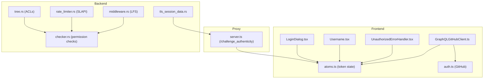

**Diagram sources**
- [LoginDialog.tsx:25-42](file://eden/contrib/reviewstack/src/LoginDialog.tsx#L25-L42)
- [Username.tsx:26-64](file://eden/contrib/reviewstack/src/Username.tsx#L26-L64)
- [UnauthorizedErrorHandler.tsx:21-34](file://eden/contrib/reviewstack/src/UnauthorizedErrorHandler.tsx#L21-L34)
- [GraphQLGitHubClient.ts:82-110](file://eden/contrib/reviewstack/src/github/GraphQLGitHubClient.ts#L82-L110)
- [auth.ts:8-13](file://addons/shared/github/auth.ts#L8-L13)
- [atoms.ts:155-244](file://eden/contrib/reviewstack/src/jotai/atoms.ts#L155-L244)
- [server.ts:139-149](file://addons/isl-server/proxy/server.ts#L139-L149)
- [checker.rs:43-117](file://eden/mononoke/common/permission_checker/src/checker.rs#L43-L117)
- [tree.rs:533-569](file://eden/mononoke/mononoke_api_hg/src/tree.rs#L533-L569)
- [rate_limiter.rs:34-45](file://eden/mononoke/servers/slapi/slapi_service/src/middleware/rate_limiter.rs#L34-L45)
- [middleware.rs:51-81](file://eden/mononoke/servers/lfs/lfs_server/src/service/middleware.rs#L51-L81)
- [tls_session_data.rs:24-48](file://eden/mononoke/common/gotham_ext/src/middleware/tls_session_data.rs#L24-L48)

**Section sources**
- [LoginDialog.tsx:25-42](file://eden/contrib/reviewstack/src/LoginDialog.tsx#L25-L42)
- [Username.tsx:26-64](file://eden/contrib/reviewstack/src/Username.tsx#L26-L64)
- [UnauthorizedErrorHandler.tsx:21-34](file://eden/contrib/reviewstack/src/UnauthorizedErrorHandler.tsx#L21-L34)
- [GraphQLGitHubClient.ts:82-110](file://eden/contrib/reviewstack/src/github/GraphQLGitHubClient.ts#L82-L110)
- [auth.ts:8-13](file://addons/shared/github/auth.ts#L8-L13)
- [atoms.ts:155-244](file://eden/contrib/reviewstack/src/jotai/atoms.ts#L155-L244)
- [server.ts:139-149](file://addons/isl-server/proxy/server.ts#L139-L149)
- [checker.rs:43-117](file://eden/mononoke/common/permission_checker/src/checker.rs#L43-L117)
- [tree.rs:533-569](file://eden/mononoke/mononoke_api_hg/src/tree.rs#L533-L569)
- [rate_limiter.rs:34-45](file://eden/mononoke/servers/slapi/slapi_service/src/middleware/rate_limiter.rs#L34-L45)
- [middleware.rs:51-81](file://eden/mononoke/servers/lfs/lfs_server/src/service/middleware.rs#L51-L81)
- [tls_session_data.rs:24-48](file://eden/mononoke/common/gotham_ext/src/middleware/tls_session_data.rs#L24-L48)

## Core Components
- Token-based authentication with GitHub Personal Access Tokens (PATs) and OAuth
- Session management via local storage and cross-tab synchronization
- Authorization via permission checkers and ACLs
- Rate limiting and load shedding in backend services
- TLS session data logging for diagnostics
- Secure headers and CSP-like protections in web views

Key implementation references:
- Token header creation and usage
  - [createRequestHeaders:8-13](file://addons/shared/github/auth.ts#L8-L13)
  - [GraphQLGitHubClient constructor:101-110](file://eden/contrib/reviewstack/src/github/GraphQLGitHubClient.ts#L101-L110)
- Token persistence and state
  - [gitHubTokenStateAtom:155-158](file://eden/contrib/reviewstack/src/jotai/atoms.ts#L155-L158)
  - [gitHubTokenPersistenceAtom:164-244](file://eden/contrib/reviewstack/src/jotai/atoms.ts#L164-L244)
  - [gitHubHostnameAtom:250-253](file://eden/contrib/reviewstack/src/jotai/atoms.ts#L250-L253)
- Unauthorized handling and logout
  - [UnauthorizedErrorHandler:21-34](file://eden/contrib/reviewstack/src/UnauthorizedErrorHandler.tsx#L21-L34)
  - [Username logout:36-37](file://eden/contrib/reviewstack/src/Username.tsx#L36-L37)
- OAuth flow entry point
  - [NetlifyLoginDialog OAuth call:232-251](file://eden/contrib/reviewstack.dev/src/NetlifyLoginDialog.tsx#L232-L251)
- Proxy-sensitive endpoint gating
  - [/challenge_authenticity:139-149](file://addons/isl-server/proxy/server.ts#L139-L149)
- Authorization and ACLs
  - [PermissionChecker builder and union:43-117](file://eden/mononoke/common/permission_checker/src/checker.rs#L43-L117)
  - [ACL tree example:533-569](file://eden/mononoke/mononoke_api_hg/src/tree.rs#L533-L569)
- Rate limiting and load shedding
  - [SLAPI throttle middleware:34-45](file://eden/mononoke/servers/slapi/slapi_service/src/middleware/rate_limiter.rs#L34-L45)
  - [LFS throttle middleware:51-81](file://eden/mononoke/servers/lfs/lfs_server/src/service/middleware.rs#L51-L81)
  - [Rate limiting docs:83-105](file://eden/mononoke/docs/6.1-rate-limiting-and-load-shedding.md#L83-L105)
- TLS session logging
  - [TlsSessionDataMiddleware:24-48](file://eden/mononoke/common/gotham_ext/src/middleware/tls_session_data.rs#L24-L48)
- Secure headers in web views
  - [Webview nonce usage:620-628](file://addons/vscode/extension/islWebviewPanel.ts#L620-L628)

**Section sources**
- [auth.ts:8-13](file://addons/shared/github/auth.ts#L8-L13)
- [GraphQLGitHubClient.ts:82-110](file://eden/contrib/reviewstack/src/github/GraphQLGitHubClient.ts#L82-L110)
- [atoms.ts:155-244](file://eden/contrib/reviewstack/src/jotai/atoms.ts#L155-L244)
- [UnauthorizedErrorHandler.tsx:21-34](file://eden/contrib/reviewstack/src/UnauthorizedErrorHandler.tsx#L21-L34)
- [Username.tsx:36-37](file://eden/contrib/reviewstack/src/Username.tsx#L36-L37)
- [NetlifyLoginDialog.tsx:232-251](file://eden/contrib/reviewstack.dev/src/NetlifyLoginDialog.tsx#L232-L251)
- [server.ts:139-149](file://addons/isl-server/proxy/server.ts#L139-L149)
- [checker.rs:43-117](file://eden/mononoke/common/permission_checker/src/checker.rs#L43-L117)
- [tree.rs:533-569](file://eden/mononoke/mononoke_api_hg/src/tree.rs#L533-L569)
- [rate_limiter.rs:34-45](file://eden/mononoke/servers/slapi/slapi_service/src/middleware/rate_limiter.rs#L34-L45)
- [middleware.rs:51-81](file://eden/mononoke/servers/lfs/lfs_server/src/service/middleware.rs#L51-L81)
- [6.1-rate-limiting-and-load-shedding.md:83-105](file://eden/mononoke/docs/6.1-rate-limiting-and-load-shedding.md#L83-L105)
- [tls_session_data.rs:24-48](file://eden/mononoke/common/gotham_ext/src/middleware/tls_session_data.rs#L24-L48)
- [islWebviewPanel.ts:620-628](file://addons/vscode/extension/islWebviewPanel.ts#L620-L628)

## Architecture Overview
The authentication and security architecture combines:
- Frontend token management and OAuth flows
- GitHub API client with standardized headers
- Local proxy enforcing token-gated access to sensitive endpoints
- Backend authorization via permission checkers and ACLs
- Rate limiting and load shedding middleware
- TLS session logging for operational visibility

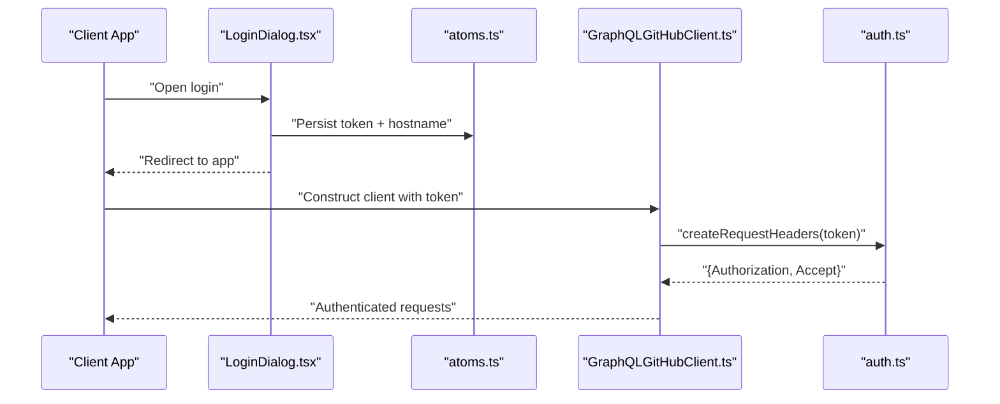

**Diagram sources**
- [LoginDialog.tsx:25-42](file://eden/contrib/reviewstack/src/LoginDialog.tsx#L25-L42)
- [atoms.ts:164-244](file://eden/contrib/reviewstack/src/jotai/atoms.ts#L164-L244)
- [GraphQLGitHubClient.ts:101-110](file://eden/contrib/reviewstack/src/github/GraphQLGitHubClient.ts#L101-L110)
- [auth.ts:8-13](file://addons/shared/github/auth.ts#L8-L13)

## Detailed Component Analysis

### Token-Based Authentication and GitHub Headers
- Token storage and state transitions are managed via atoms, supporting loading, settled, and error states.
- The GitHub client constructs request headers using a shared utility that sets the Authorization header and Accept content type.
- Unauthorized responses trigger a cleanup of the stored token and display of an error message.

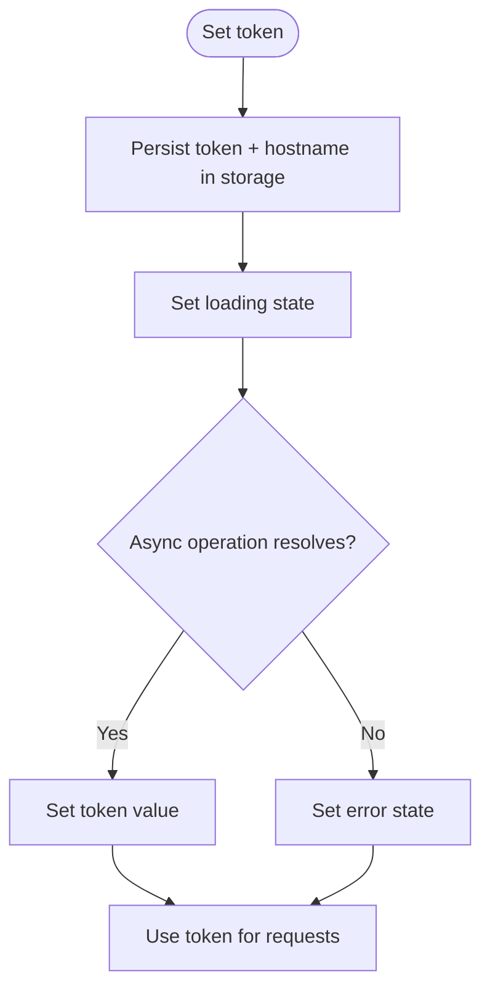

**Diagram sources**
- [atoms.ts:164-244](file://eden/contrib/reviewstack/src/jotai/atoms.ts#L164-L244)

**Section sources**
- [auth.ts:8-13](file://addons/shared/github/auth.ts#L8-L13)
- [GraphQLGitHubClient.ts:82-110](file://eden/contrib/reviewstack/src/github/GraphQLGitHubClient.ts#L82-L110)
- [UnauthorizedErrorHandler.tsx:21-34](file://eden/contrib/reviewstack/src/UnauthorizedErrorHandler.tsx#L21-L34)
- [atoms.ts:155-244](file://eden/contrib/reviewstack/src/jotai/atoms.ts#L155-L244)

### OAuth Integration (GitHub)
- The UI provides an OAuth entry point that invokes an authenticator provider to obtain a token scoped for GitHub.
- On success, the token and hostname are persisted; on failure, an error is surfaced.

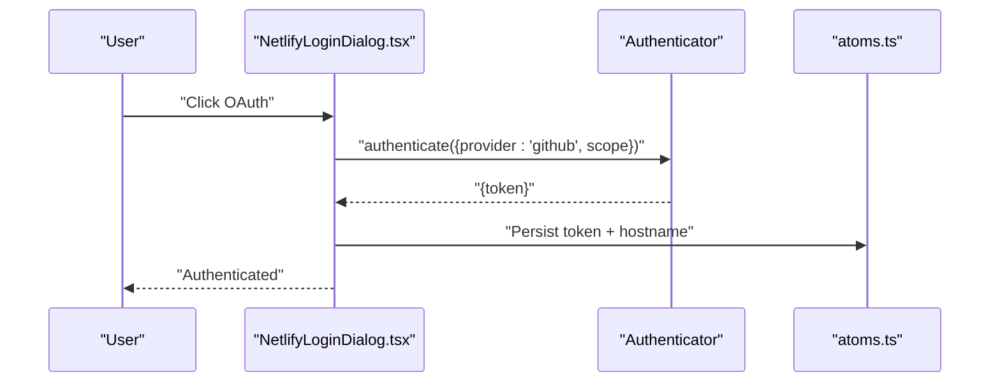

**Diagram sources**
- [NetlifyLoginDialog.tsx:232-251](file://eden/contrib/reviewstack.dev/src/NetlifyLoginDialog.tsx#L232-L251)
- [atoms.ts:164-244](file://eden/contrib/reviewstack/src/jotai/atoms.ts#L164-L244)

**Section sources**
- [NetlifyLoginDialog.tsx:232-251](file://eden/contrib/reviewstack.dev/src/NetlifyLoginDialog.tsx#L232-L251)
- [LoginDialog.tsx:25-42](file://eden/contrib/reviewstack/src/LoginDialog.tsx#L25-L42)

### Session Management and Credential Handling
- Cross-tab logout is supported via a broadcast channel listener that observes storage changes and clears the token state.
- Logout clears the token from persistent storage and resets the UI state.

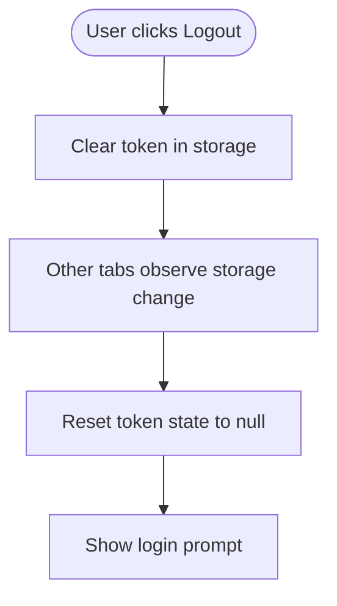

**Diagram sources**
- [Username.tsx:36-37](file://eden/contrib/reviewstack/src/Username.tsx#L36-L37)
- [UnauthorizedErrorHandler.tsx:21-34](file://eden/contrib/reviewstack/src/UnauthorizedErrorHandler.tsx#L21-L34)
- [atoms.ts:164-244](file://eden/contrib/reviewstack/src/jotai/atoms.ts#L164-L244)

**Section sources**
- [Username.tsx:36-37](file://eden/contrib/reviewstack/src/Username.tsx#L36-L37)
- [UnauthorizedErrorHandler.tsx:21-34](file://eden/contrib/reviewstack/src/UnauthorizedErrorHandler.tsx#L21-L34)
- [atoms.ts:164-244](file://eden/contrib/reviewstack/src/jotai/atoms.ts#L164-L244)

### Authorization Patterns and Repository-Level Permissions
- Permission checks are composed using a builder pattern that supports allowlists and union checks, enabling parallel evaluation.
- ACLs demonstrate repository-scoped actions and region-specific overrides.

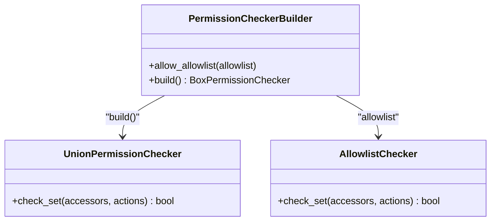

**Diagram sources**
- [checker.rs:43-117](file://eden/mononoke/common/permission_checker/src/checker.rs#L43-L117)

**Section sources**
- [checker.rs:43-117](file://eden/mononoke/common/permission_checker/src/checker.rs#L43-L117)
- [tree.rs:533-569](file://eden/mononoke/mononoke_api_hg/src/tree.rs#L533-L569)

### Rate Limiting and Load Shedding
- SLAPI and LFS services implement middleware that evaluates configured rate limits and load shedding policies before processing requests.
- Requests exceeding thresholds receive HTTP 429 responses; accepted requests update counters for future checks.

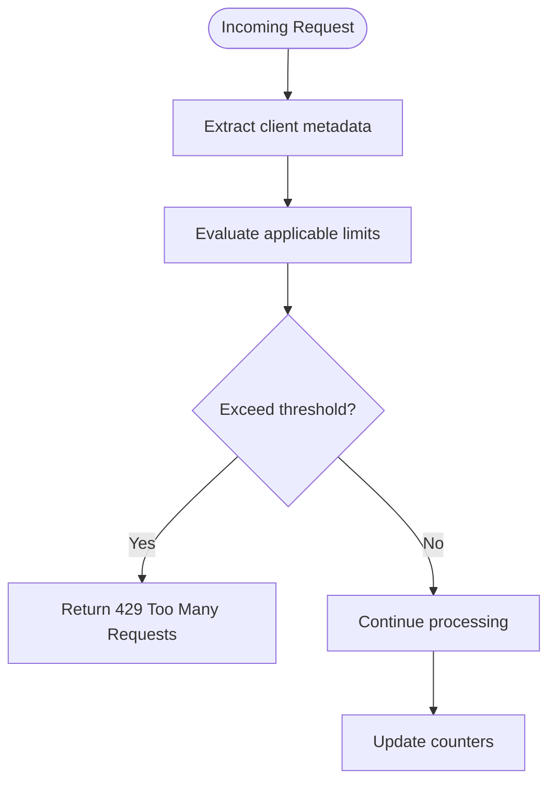

**Diagram sources**
- [rate_limiter.rs:34-45](file://eden/mononoke/servers/slapi/slapi_service/src/middleware/rate_limiter.rs#L34-L45)
- [middleware.rs:51-81](file://eden/mononoke/servers/lfs/lfs_server/src/service/middleware.rs#L51-L81)
- [6.1-rate-limiting-and-load-shedding.md:83-105](file://eden/mononoke/docs/6.1-rate-limiting-and-load-shedding.md#L83-L105)

**Section sources**
- [rate_limiter.rs:34-45](file://eden/mononoke/servers/slapi/slapi_service/src/middleware/rate_limiter.rs#L34-L45)
- [middleware.rs:51-81](file://eden/mononoke/servers/lfs/lfs_server/src/service/middleware.rs#L51-L81)
- [6.1-rate-limiting-and-load-shedding.md:83-105](file://eden/mononoke/docs/6.1-rate-limiting-and-load-shedding.md#L83-L105)

### TLS Session Data Logging
- A middleware component logs TLS session data to a configurable file, enabling operational diagnostics.

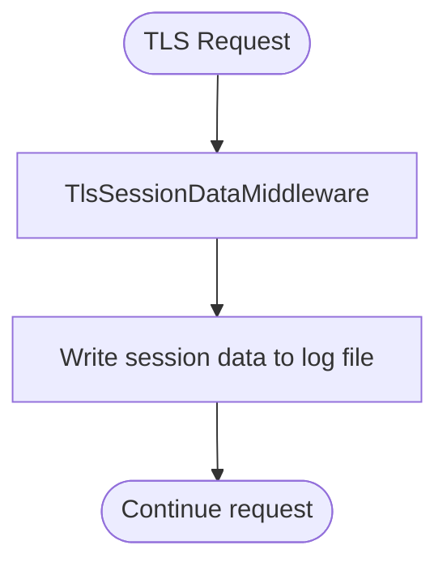

**Diagram sources**
- [tls_session_data.rs:24-48](file://eden/mononoke/common/gotham_ext/src/middleware/tls_session_data.rs#L24-L48)

**Section sources**
- [tls_session_data.rs:24-48](file://eden/mononoke/common/gotham_ext/src/middleware/tls_session_data.rs#L24-L48)

### Secure Communication Protocols and Headers
- GitHub API requests use standardized headers for Authorization and Accept.
- Web views embed a nonce in script tags to mitigate XSS risks.

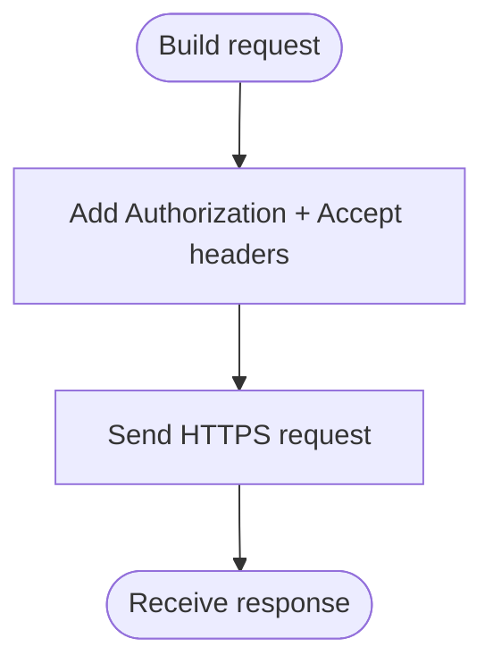

**Diagram sources**
- [auth.ts:8-13](file://addons/shared/github/auth.ts#L8-L13)
- [islWebviewPanel.ts:620-628](file://addons/vscode/extension/islWebviewPanel.ts#L620-L628)

**Section sources**
- [auth.ts:8-13](file://addons/shared/github/auth.ts#L8-L13)
- [islWebviewPanel.ts:620-628](file://addons/vscode/extension/islWebviewPanel.ts#L620-L628)

### Proxy-Sensitive Endpoint Protection
- The proxy exposes a challenge endpoint that returns a challenge token only when presented with a valid sensitive token, protecting privileged operations.

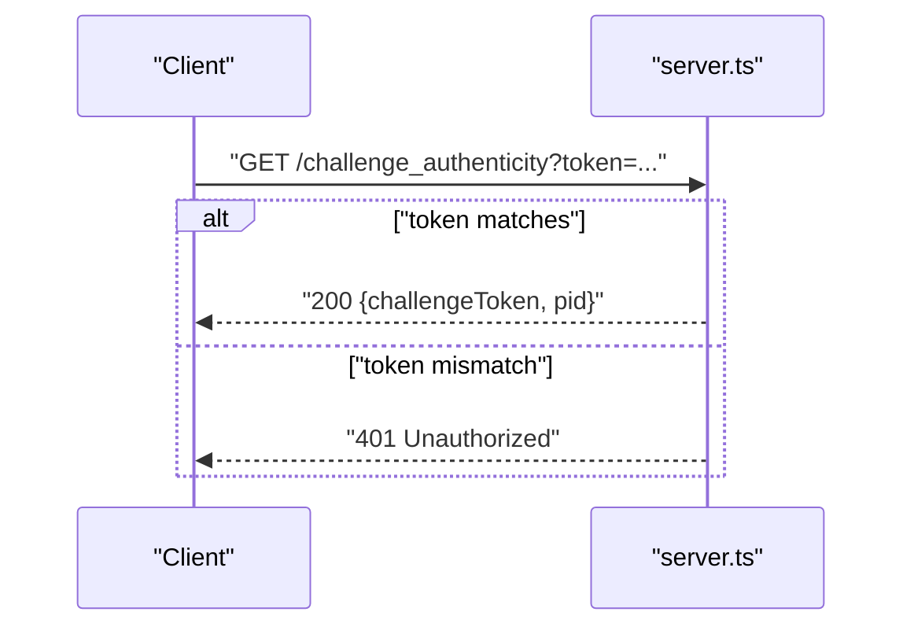

**Diagram sources**
- [server.ts:139-149](file://addons/isl-server/proxy/server.ts#L139-L149)

**Section sources**
- [server.ts:139-149](file://addons/isl-server/proxy/server.ts#L139-L149)

## Dependency Analysis
- Frontend depends on shared GitHub auth utilities for consistent headers.
- Proxy depends on token equality checks to gate sensitive endpoints.
- Backend services depend on permission checkers and ACLs for authorization.
- Rate limiting middleware integrates with permission metadata and counters.

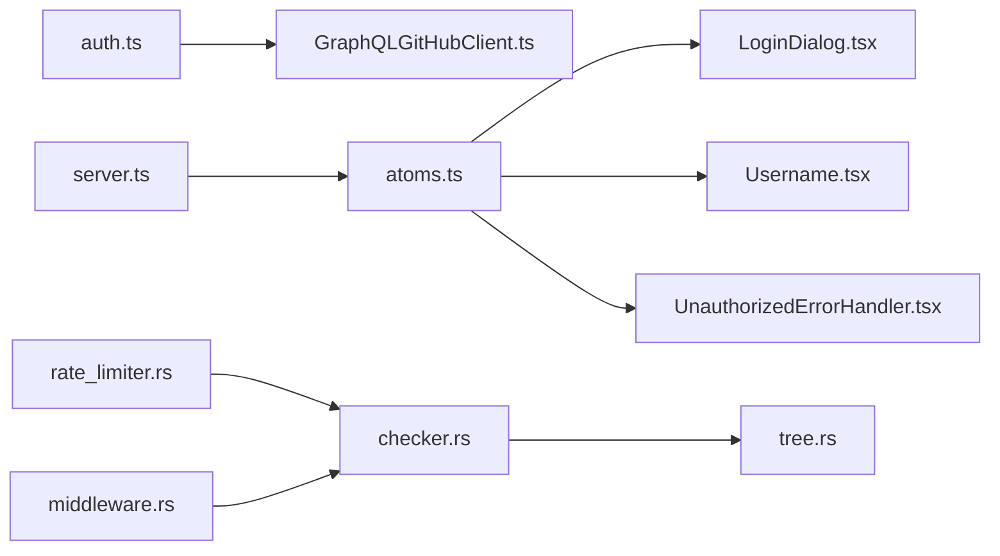

**Diagram sources**
- [auth.ts:8-13](file://addons/shared/github/auth.ts#L8-L13)
- [GraphQLGitHubClient.ts:82-110](file://eden/contrib/reviewstack/src/github/GraphQLGitHubClient.ts#L82-L110)
- [atoms.ts:155-244](file://eden/contrib/reviewstack/src/jotai/atoms.ts#L155-L244)
- [LoginDialog.tsx:25-42](file://eden/contrib/reviewstack/src/LoginDialog.tsx#L25-L42)
- [Username.tsx:26-64](file://eden/contrib/reviewstack/src/Username.tsx#L26-L64)
- [UnauthorizedErrorHandler.tsx:21-34](file://eden/contrib/reviewstack/src/UnauthorizedErrorHandler.tsx#L21-L34)
- [server.ts:139-149](file://addons/isl-server/proxy/server.ts#L139-L149)
- [checker.rs:43-117](file://eden/mononoke/common/permission_checker/src/checker.rs#L43-L117)
- [tree.rs:533-569](file://eden/mononoke/mononoke_api_hg/src/tree.rs#L533-L569)
- [rate_limiter.rs:34-45](file://eden/mononoke/servers/slapi/slapi_service/src/middleware/rate_limiter.rs#L34-L45)
- [middleware.rs:51-81](file://eden/mononoke/servers/lfs/lfs_server/src/service/middleware.rs#L51-L81)

**Section sources**
- [auth.ts:8-13](file://addons/shared/github/auth.ts#L8-L13)
- [GraphQLGitHubClient.ts:82-110](file://eden/contrib/reviewstack/src/github/GraphQLGitHubClient.ts#L82-L110)
- [atoms.ts:155-244](file://eden/contrib/reviewstack/src/jotai/atoms.ts#L155-L244)
- [LoginDialog.tsx:25-42](file://eden/contrib/reviewstack/src/LoginDialog.tsx#L25-L42)
- [Username.tsx:26-64](file://eden/contrib/reviewstack/src/Username.tsx#L26-L64)
- [UnauthorizedErrorHandler.tsx:21-34](file://eden/contrib/reviewstack/src/UnauthorizedErrorHandler.tsx#L21-L34)
- [server.ts:139-149](file://addons/isl-server/proxy/server.ts#L139-L149)
- [checker.rs:43-117](file://eden/mononoke/common/permission_checker/src/checker.rs#L43-L117)
- [tree.rs:533-569](file://eden/mononoke/mononoke_api_hg/src/tree.rs#L533-L569)
- [rate_limiter.rs:34-45](file://eden/mononoke/servers/slapi/slapi_service/src/middleware/rate_limiter.rs#L34-L45)
- [middleware.rs:51-81](file://eden/mononoke/servers/lfs/lfs_server/src/service/middleware.rs#L51-L81)

## Performance Considerations
- Parallel permission checking reduces latency by evaluating multiple checkers concurrently.
- Rate limiting middleware short-circuits expensive operations by rejecting early when thresholds are exceeded.
- TLS session logging is optional and guarded by a file handle to avoid overhead when disabled.

[No sources needed since this section provides general guidance]

## Troubleshooting Guide
- Unauthorized responses: The unauthorized handler clears the token and displays a message; verify token validity and expiration.
- OAuth failures: Ensure the authenticator provider returns a token and scope; inspect error messages emitted during the OAuth call.
- Proxy challenges: Confirm the sensitive token matches the expected value; mismatches return 401.
- Rate limiting: Monitor 429 responses and adjust client-side retry/backoff; review configured limits and scopes.

**Section sources**
- [UnauthorizedErrorHandler.tsx:21-34](file://eden/contrib/reviewstack/src/UnauthorizedErrorHandler.tsx#L21-L34)
- [NetlifyLoginDialog.tsx:232-251](file://eden/contrib/reviewstack.dev/src/NetlifyLoginDialog.tsx#L232-L251)
- [server.ts:139-149](file://addons/isl-server/proxy/server.ts#L139-L149)
- [rate_limiter.rs:34-45](file://eden/mononoke/servers/slapi/slapi_service/src/middleware/rate_limiter.rs#L34-L45)
- [middleware.rs:51-81](file://eden/mononoke/servers/lfs/lfs_server/src/service/middleware.rs#L51-L81)

## Conclusion
SAPLING SCM’s Web API employs a layered security model: token-based authentication with GitHub PAT/OAuth, robust frontend token management, strict proxy gating for sensitive endpoints, backend authorization via permission checkers and ACLs, and comprehensive rate limiting/load shedding. Secure headers and TLS session logging further strengthen the deployment. Together, these controls provide defense-in-depth for protecting repository data and operations.