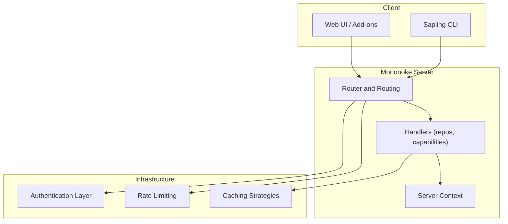
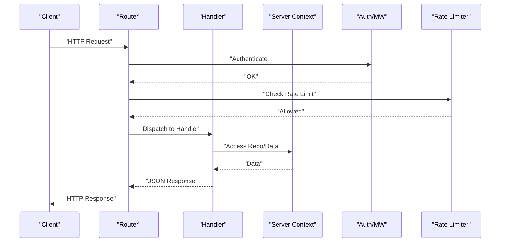
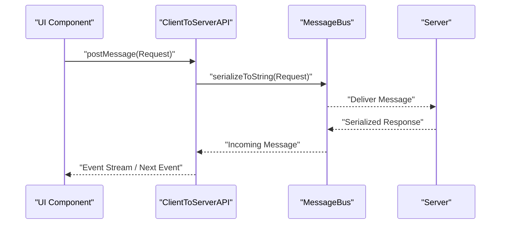
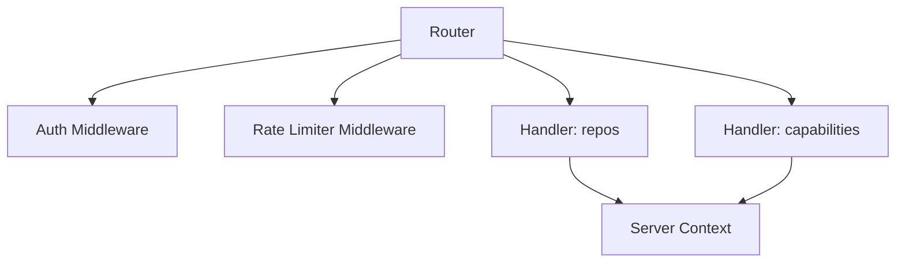

# REST Endpoints

<cite>
**Referenced Files in This Document**
- [server.py](file://eden/scm/sapling/server.py)
- [edenapi.py](file://eden/scm/sapling/edenapi.py)
- [CREATING_ENDPOINTS.md](file://eden/.llms/skills/CREATING_ENDPOINTS.md)
- [handlers.rs (repos)](file://eden/mononoke/servers/slapi/slapi_service/src/handlers/repos.rs)
- [handlers.rs (capabilities)](file://eden/mononoke/servers/slapi/slapi_service/src/handlers/capabilities.rs)
- [slapi_compat.rs](file://eden/mononoke/servers/git/git_server/src/service/slapi_compat.rs)
- [content_type.rs](file://eden/mononoke/servers/git/git_server/src/middleware/response/content_type.rs)
- [ClientToServerAPI.ts](file://addons/isl/src/ClientToServerAPI.ts)
</cite>

## Table of Contents
1. [Introduction](#introduction)
2. [Project Structure](#project-structure)
3. [Core Components](#core-components)
4. [Architecture Overview](#architecture-overview)
5. [Detailed Component Analysis](#detailed-component-analysis)
6. [Dependency Analysis](#dependency-analysis)
7. [Performance Considerations](#performance-considerations)
8. [Troubleshooting Guide](#troubleshooting-guide)
9. [Conclusion](#conclusion)

## Introduction
This document describes the REST API surface used by SAPLING SCM clients to access repository data via the Mononoke server. It focuses on endpoints for repository discovery, capability negotiation, and related repository metadata. The documentation covers HTTP methods, URL patterns, request/response schemas, parameter specifications, authentication, rate limiting, error handling, and practical client integration patterns. It also outlines caching strategies, pagination mechanisms, and performance optimization techniques for REST API consumption.

## Project Structure
The REST API is implemented in Rust using a Gothenburg-based router and handler framework. The server exposes endpoints under a base path that includes the repository name. Client-side integration is handled through a dedicated API module and a message bus abstraction for communication.

**Diagram sources**
- [slapi_compat.rs:1-35](file://eden/mononoke/servers/git/git_server/src/service/slapi_compat.rs#L1-L35)
- [handlers.rs (repos):1-38](file://eden/mononoke/servers/slapi/slapi_service/src/handlers/repos.rs#L1-L38)
- [handlers.rs (capabilities):69-85](file://eden/mononoke/servers/slapi/slapi_service/src/handlers/capabilities.rs#L69-L85)

**Section sources**
- [server.py:120-140](file://eden/scm/sapling/server.py#L120-L140)
- [CREATING_ENDPOINTS.md:10-28](file://eden/.llms/skills/CREATING_ENDPOINTS.md#L10-L28)

## Core Components
- REST-like API surface: Exposed via a Gothenburg-based router and handler framework.
- Endpoint registration: Methods are registered in a central router and mapped to handler functions.
- Request/response model: Handlers accept typed requests and produce typed JSON responses.
- Authentication and rate limiting: Enforced at the router and middleware layers.
- Client integration: Clients use a dedicated API module to communicate with the server.

Key implementation references:
- Endpoint creation guide and registration pattern
- Handler wrapper and error formatting
- Content-type middleware for responses

**Section sources**
- [CREATING_ENDPOINTS.md:10-28](file://eden/.llms/skills/CREATING_ENDPOINTS.md#L10-L28)
- [handlers.rs (repos):25-37](file://eden/mononoke/servers/slapi/slapi_service/src/handlers/repos.rs#L25-L37)
- [handlers.rs (capabilities):69-85](file://eden/mononoke/servers/slapi/slapi_service/src/handlers/capabilities.rs#L69-L85)
- [slapi_compat.rs:1-35](file://eden/mononoke/servers/git/git_server/src/service/slapi_compat.rs#L1-L35)
- [content_type.rs:18-35](file://eden/mononoke/servers/git/git_server/src/middleware/response/content_type.rs#L18-L35)

## Architecture Overview
The server exposes REST-like endpoints under a repository-scoped base path. Requests are routed to handlers that validate the request, enforce authentication and rate limits, and return structured JSON responses. Handlers can also negotiate capabilities for different commit identity schemes.

**Diagram sources**
- [slapi_compat.rs:1-35](file://eden/mononoke/servers/git/git_server/src/service/slapi_compat.rs#L1-L35)
- [handlers.rs (capabilities):69-85](file://eden/mononoke/servers/slapi/slapi_service/src/handlers/capabilities.rs#L69-L85)

## Detailed Component Analysis

### Endpoint Catalog

#### GET /{repo}/repos
- Purpose: List available repositories visible to the caller.
- HTTP Method: GET
- URL Pattern: /{repo}/repos
- Authentication: Required (per server policy)
- Rate Limiting: Enforced (per server policy)
- Request Body: None
- Response Schema:
  - repos: array of strings
- Error Codes:
  - 400: Unsupported flavor or invalid request
  - 500: Serialization or server error
- Notes:
  - The handler collects repository names and serializes them into a JSON response.

**Section sources**
- [handlers.rs (repos):20-37](file://eden/mononoke/servers/slapi/slapi_service/src/handlers/repos.rs#L20-L37)

#### GET /{repo}/capabilities
- Purpose: Retrieve server capabilities for the requested commit identity scheme.
- HTTP Method: GET
- URL Pattern: /{repo}/capabilities
- Authentication: Required (per server policy)
- Rate Limiting: Enforced (per server policy)
- Request Body: None
- Response Schema:
  - Array of capability strings
- Error Codes:
  - 400: Unsupported flavor or invalid request
  - 500: Serialization or server error
- Notes:
  - Supports Hg and Git identity schemes; Git support may require additional configuration.

**Section sources**
- [handlers.rs (capabilities):69-85](file://eden/mononoke/servers/slapi/slapi_service/src/handlers/capabilities.rs#L69-L85)

### Client Integration Patterns

#### Using the Edenscm Client
- The client obtains an edenapi client instance configured with runtime configuration.
- Typical usage involves initializing the client and invoking repository operations.

**Section sources**
- [edenapi.py:10-13](file://eden/scm/sapling/edenapi.py#L10-L13)

#### Message Bus Communication (Add-ons)
- The add-ons layer communicates with the server via a typed message bus.
- The ClientToServerAPI provides typed message posting, event iteration, and connection lifecycle callbacks.

**Diagram sources**
- [ClientToServerAPI.ts:179-207](file://addons/isl/src/ClientToServerAPI.ts#L179-L207)

**Section sources**
- [ClientToServerAPI.ts:1-245](file://addons/isl/src/ClientToServerAPI.ts#L1-L245)

### Request/Response Schemas

- Repositories Listing
  - Request: None
  - Response: { repos: [string] }

- Capabilities
  - Request: None
  - Response: [string]

- Content-Type Responses
  - Responses are tagged with a content type header indicating service and response type.

**Section sources**
- [handlers.rs (repos):20-37](file://eden/mononoke/servers/slapi/slapi_service/src/handlers/repos.rs#L20-L37)
- [handlers.rs (capabilities):69-85](file://eden/mononoke/servers/slapi/slapi_service/src/handlers/capabilities.rs#L69-L85)
- [content_type.rs:23-33](file://eden/mononoke/servers/git/git_server/src/middleware/response/content_type.rs#L23-L33)

### Parameter Specifications
- Path parameters:
  - {repo}: Repository identifier included in the URL path.
- Query parameters:
  - Not used in the referenced handlers; handlers rely on request body for parameters.
- Request body:
  - Parameters are serialized in the request body for handlers that require them.

**Section sources**
- [CREATING_ENDPOINTS.md:31-37](file://eden/.llms/skills/CREATING_ENDPOINTS.md#L31-L37)
- [CREATING_ENDPOINTS.md:132-156](file://eden/.llms/skills/CREATING_ENDPOINTS.md#L132-L156)

### Authentication and Authorization
- Authentication is enforced at the router level before dispatching to handlers.
- Specific schemes and policies are determined by the server configuration and middleware.

**Section sources**
- [slapi_compat.rs:1-35](file://eden/mononoke/servers/git/git_server/src/service/slapi_compat.rs#L1-L35)

### Rate Limiting Policies
- Rate limiting is enforced by the router and middleware prior to handler execution.
- Policy specifics are determined by server configuration.

**Section sources**
- [slapi_compat.rs:1-35](file://eden/mononoke/servers/git/git_server/src/service/slapi_compat.rs#L1-L35)

### Error Response Codes
- 400: Unsupported flavor or invalid request
- 500: Serialization or server error

**Section sources**
- [handlers.rs (repos):31-34](file://eden/mononoke/servers/slapi/slapi_service/src/handlers/repos.rs#L31-L34)
- [handlers.rs (capabilities):76-83](file://eden/mononoke/servers/slapi/slapi_service/src/handlers/capabilities.rs#L76-L83)

### Practical Examples of API Usage
- Discover repositories:
  - Send a GET request to /{repo}/repos and parse the JSON array of repository names.
- Negotiate capabilities:
  - Send a GET request to /{repo}/capabilities and interpret the returned capability strings.

**Section sources**
- [handlers.rs (repos):25-37](file://eden/mononoke/servers/slapi/slapi_service/src/handlers/repos.rs#L25-L37)
- [handlers.rs (capabilities):69-85](file://eden/mononoke/servers/slapi/slapi_service/src/handlers/capabilities.rs#L69-L85)

### Client Implementation Patterns
- Use the edenapi client to initialize and communicate with the server.
- For add-ons, leverage the typed message bus to send requests and receive responses asynchronously.

**Section sources**
- [edenapi.py:10-13](file://eden/scm/sapling/edenapi.py#L10-L13)
- [ClientToServerAPI.ts:179-207](file://addons/isl/src/ClientToServerAPI.ts#L179-L207)

### Integration Guidelines
- Route registration: Add new endpoints by defining types, implementing handlers, and registering routes.
- Flavor support: Prefer Hg-only endpoints unless Git support is explicitly required.

**Section sources**
- [CREATING_ENDPOINTS.md:103-164](file://eden/.llms/skills/CREATING_ENDPOINTS.md#L103-L164)

## Dependency Analysis
The server composes several layers: router, middleware, handlers, and server context. Handlers depend on the server context for repository access and on middleware for authentication and rate limiting.

**Diagram sources**
- [slapi_compat.rs:1-35](file://eden/mononoke/servers/git/git_server/src/service/slapi_compat.rs#L1-L35)
- [handlers.rs (repos):25-37](file://eden/mononoke/servers/slapi/slapi_service/src/handlers/repos.rs#L25-L37)
- [handlers.rs (capabilities):69-85](file://eden/mononoke/servers/slapi/slapi_service/src/handlers/capabilities.rs#L69-L85)

**Section sources**
- [slapi_compat.rs:1-35](file://eden/mononoke/servers/git/git_server/src/service/slapi_compat.rs#L1-L35)
- [handlers.rs (repos):25-37](file://eden/mononoke/servers/slapi/slapi_service/src/handlers/repos.rs#L25-L37)
- [handlers.rs (capabilities):69-85](file://eden/mononoke/servers/slapi/slapi_service/src/handlers/capabilities.rs#L69-L85)

## Performance Considerations
- Caching strategies:
  - Cache repository lists and capabilities responses when appropriate to reduce server load.
  - Use short-lived caches for dynamic data and longer-lived caches for stable metadata.
- Pagination mechanisms:
  - For large datasets, implement pagination in handlers and expose cursor-based or limit/offset parameters in request bodies.
- Content-type tagging:
  - Responses include a content-type header indicating service and response type, aiding client-side parsing and caching.
- Rate limiting:
  - Respect server-side rate limits; implement client-side throttling and exponential backoff on 429 responses.

**Section sources**
- [content_type.rs:23-33](file://eden/mononoke/servers/git/git_server/src/middleware/response/content_type.rs#L23-L33)

## Troubleshooting Guide
- Unsupported flavor:
  - Symptom: 400 error indicating unsupported flavor.
  - Resolution: Ensure the request uses a supported commit identity scheme.
- Serialization failures:
  - Symptom: 500 error during response serialization.
  - Resolution: Verify request/response schemas and ensure proper JSON serialization.
- Authentication failures:
  - Symptom: 401/403 errors.
  - Resolution: Confirm credentials and permissions; check server configuration.

**Section sources**
- [handlers.rs (repos):31-34](file://eden/mononoke/servers/slapi/slapi_service/src/handlers/repos.rs#L31-L34)
- [handlers.rs (capabilities):76-83](file://eden/mononoke/servers/slapi/slapi_service/src/handlers/capabilities.rs#L76-L83)

## Conclusion
The SAPLING SCM REST API provides repository discovery and capability negotiation through a structured, typed handler framework. Clients should integrate using the edenapi client or the add-ons message bus, adhere to authentication and rate-limiting policies, and apply caching and pagination strategies for optimal performance. New endpoints should follow the documented registration pattern and prefer Hg-only support unless Git-specific functionality is required.