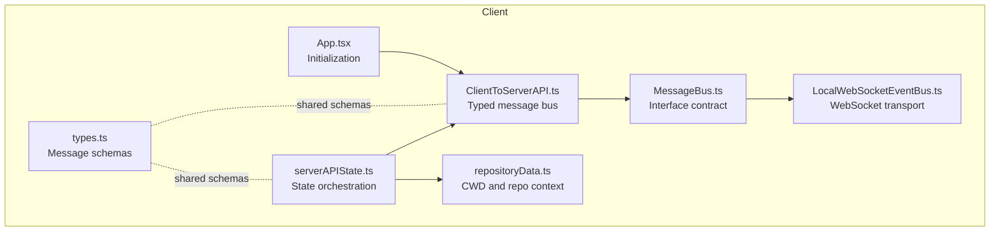
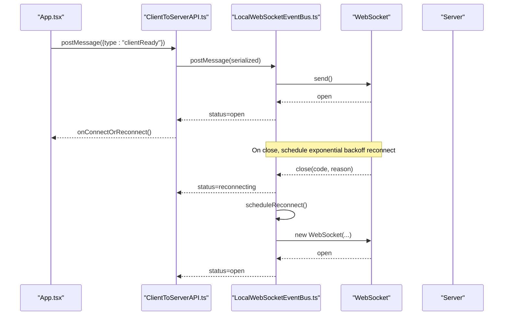
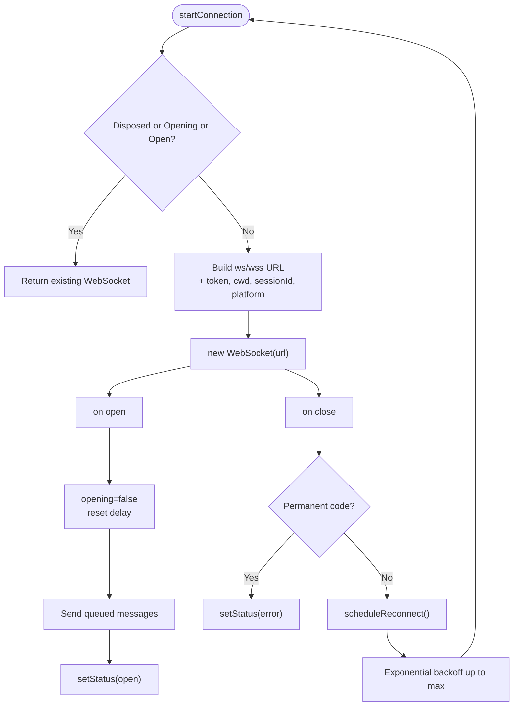
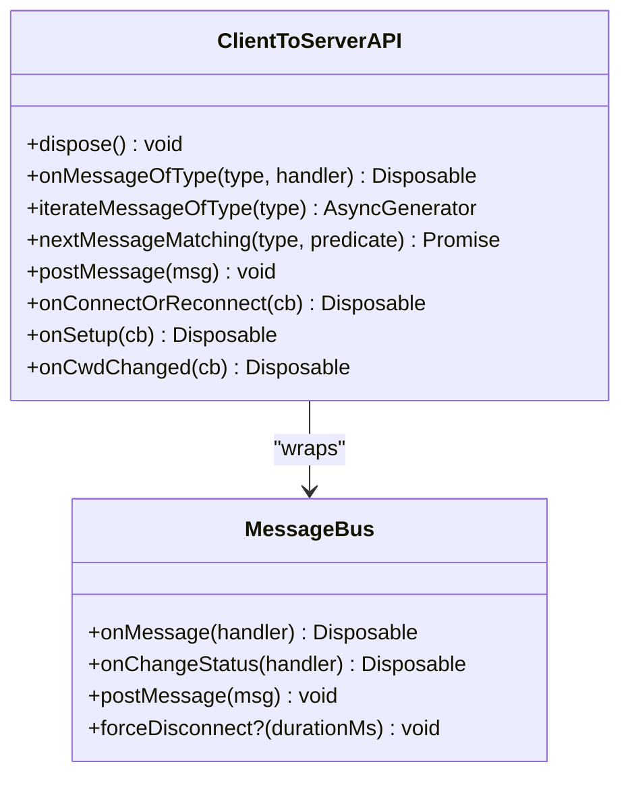
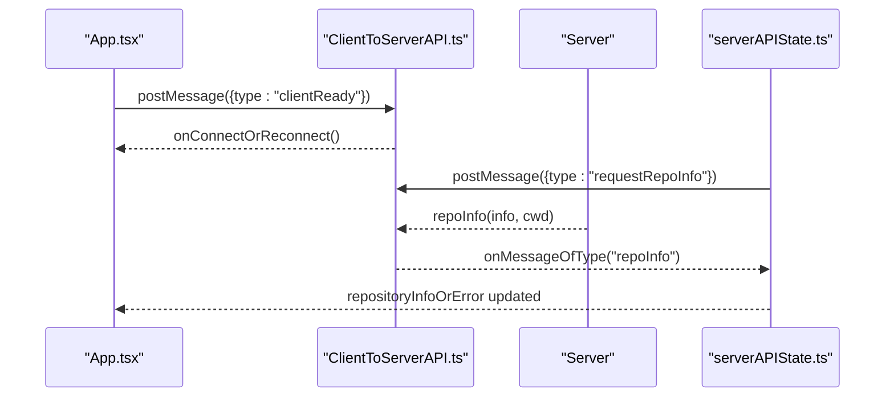
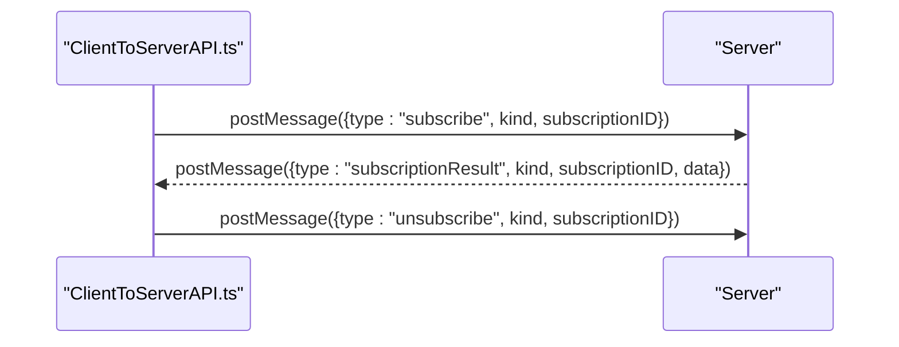
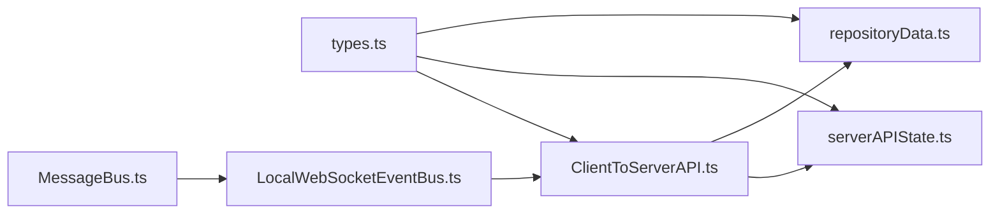

# Web API

<cite>
**Referenced Files in This Document**
- [App.tsx](file://addons/isl/src/App.tsx)
- [ClientToServerAPI.ts](file://addons/isl/src/ClientToServerAPI.ts)
- [LocalWebSocketEventBus.ts](file://addons/isl/src/LocalWebSocketEventBus.ts)
- [MessageBus.ts](file://addons/isl/src/MessageBus.ts)
- [serverAPIState.ts](file://addons/isl/src/serverAPIState.ts)
- [types.ts](file://addons/isl/src/types.ts)
- [repositoryData.ts](file://addons/isl/src/repositoryData.ts)
</cite>

## Table of Contents
1. [Introduction](#introduction)
2. [Project Structure](#project-structure)
3. [Core Components](#core-components)
4. [Architecture Overview](#architecture-overview)
5. [Detailed Component Analysis](#detailed-component-analysis)
6. [Dependency Analysis](#dependency-analysis)
7. [Performance Considerations](#performance-considerations)
8. [Troubleshooting Guide](#troubleshooting-guide)
9. [Conclusion](#conclusion)
10. [Appendices](#appendices)

## Introduction
This document specifies the Web API for SAPLING SCM’s interactive smartlog interface. It covers:
- WebSocket connection establishment and lifecycle
- Real-time messaging protocol between client and server
- REST-like request/response patterns for repository data retrieval
- Authentication and session parameters
- Message schemas, event types, and error handling
- Practical client implementation guidelines and integration patterns

## Project Structure
The interactive smartlog interface is implemented in the “isl” addon. The relevant modules include:
- App bootstrapping and initialization
- Client-to-server API abstraction
- WebSocket transport bus
- Server API state orchestration
- Shared types and schemas
- Repository context and CWD handling

**Diagram sources**
- [App.tsx:50-72](file://addons/isl/src/App.tsx#L50-L72)
- [ClientToServerAPI.ts:35-233](file://addons/isl/src/ClientToServerAPI.ts#L35-L233)
- [LocalWebSocketEventBus.ts:13-177](file://addons/isl/src/LocalWebSocketEventBus.ts#L13-L177)
- [MessageBus.ts:18-25](file://addons/isl/src/MessageBus.ts#L18-L25)
- [serverAPIState.ts:50-65](file://addons/isl/src/serverAPIState.ts#L50-L65)
- [types.ts:734-800](file://addons/isl/src/types.ts#L734-L800)
- [repositoryData.ts:14-34](file://addons/isl/src/repositoryData.ts#L14-L34)

**Section sources**
- [App.tsx:50-72](file://addons/isl/src/App.tsx#L50-L72)
- [ClientToServerAPI.ts:35-233](file://addons/isl/src/ClientToServerAPI.ts#L35-L233)
- [LocalWebSocketEventBus.ts:13-177](file://addons/isl/src/LocalWebSocketEventBus.ts#L13-L177)
- [MessageBus.ts:18-25](file://addons/isl/src/MessageBus.ts#L18-L25)
- [serverAPIState.ts:50-65](file://addons/isl/src/serverAPIState.ts#L50-L65)
- [types.ts:734-800](file://addons/isl/src/types.ts#L734-L800)
- [repositoryData.ts:14-34](file://addons/isl/src/repositoryData.ts#L14-L34)

## Core Components
- App initialization posts a readiness message to establish the client-server session.
- ClientToServerAPI provides a typed message bus with event filtering, iteration, and connection lifecycle callbacks.
- LocalWebSocketEventBus manages WebSocket connection, reconnection, and message queuing.
- serverAPIState orchestrates repository info, subscriptions, and state updates.
- types defines the message schemas and event types exchanged between client and server.
- repositoryData exposes repository and CWD context used by the UI.

Key responsibilities:
- Connection lifecycle: connect, reconnect, close, and status propagation
- Message routing: dispatch typed events to registered listeners
- Subscription management: subscribe/unsubscribe streams of updates
- Repository context: cwd, repo root, and derived paths

**Section sources**
- [App.tsx:50-72](file://addons/isl/src/App.tsx#L50-L72)
- [ClientToServerAPI.ts:35-233](file://addons/isl/src/ClientToServerAPI.ts#L35-L233)
- [LocalWebSocketEventBus.ts:13-177](file://addons/isl/src/LocalWebSocketEventBus.ts#L13-L177)
- [serverAPIState.ts:50-65](file://addons/isl/src/serverAPIState.ts#L50-L65)
- [types.ts:734-800](file://addons/isl/src/types.ts#L734-L800)
- [repositoryData.ts:14-34](file://addons/isl/src/repositoryData.ts#L14-L34)

## Architecture Overview
The client establishes a WebSocket connection to the server and exchanges typed JSON messages. The client subscribes to repository data streams and reacts to live updates. Initialization is performed by posting a readiness message.

**Diagram sources**
- [App.tsx:50-58](file://addons/isl/src/App.tsx#L50-L58)
- [ClientToServerAPI.ts:190-207](file://addons/isl/src/ClientToServerAPI.ts#L190-L207)
- [LocalWebSocketEventBus.ts:56-137](file://addons/isl/src/LocalWebSocketEventBus.ts#L56-L137)

## Detailed Component Analysis

### WebSocket Transport and Connection Lifecycle
- Host and URL construction include optional token, cwd, sessionId, and platform parameters.
- Connection status transitions: initializing → open → reconnecting → open.
- Exponential backoff with a maximum cap for reconnect intervals.
- Queued messages are flushed upon reconnection.
- Permanent closure codes halt retries and surface an error status.

**Diagram sources**
- [LocalWebSocketEventBus.ts:56-137](file://addons/isl/src/LocalWebSocketEventBus.ts#L56-L137)

**Section sources**
- [LocalWebSocketEventBus.ts:39-80](file://addons/isl/src/LocalWebSocketEventBus.ts#L39-L80)
- [LocalWebSocketEventBus.ts:105-137](file://addons/isl/src/LocalWebSocketEventBus.ts#L105-L137)

### Client-to-Server API Abstraction
- Provides typed event listeners keyed by message type.
- Supports async iteration over a specific message type with backpressure handling.
- Offers a convenience method to wait for the next matching message.
- Emits connection/reconnection callbacks and exposes a dispose pattern.
- Tracks cwd change handlers and exposes a combined setup hook.

**Diagram sources**
- [ClientToServerAPI.ts:20-29](file://addons/isl/src/ClientToServerAPI.ts#L20-L29)
- [MessageBus.ts:18-25](file://addons/isl/src/MessageBus.ts#L18-L25)

**Section sources**
- [ClientToServerAPI.ts:35-233](file://addons/isl/src/ClientToServerAPI.ts#L35-L233)
- [MessageBus.ts:18-25](file://addons/isl/src/MessageBus.ts#L18-L25)

### Initialization and Repository Context
- The app posts a readiness message on first render to signal the server.
- Repository info and cwd are tracked and propagated via typed messages.
- Derived atoms compute repo-relative paths and relevance to the current working directory.

**Diagram sources**
- [App.tsx:50-58](file://addons/isl/src/App.tsx#L50-L58)
- [serverAPIState.ts:50-65](file://addons/isl/src/serverAPIState.ts#L50-L65)

**Section sources**
- [App.tsx:50-58](file://addons/isl/src/App.tsx#L50-L58)
- [serverAPIState.ts:50-65](file://addons/isl/src/serverAPIState.ts#L50-L65)
- [repositoryData.ts:14-34](file://addons/isl/src/repositoryData.ts#L14-L34)

### Message Schemas and Event Types
The client and server exchange typed JSON messages. The following categories are defined:

- Client-to-server platform-specific messages
  - Examples include opening files, saving, subscribing to editor state, resolving suggestions, and filling commit messages.

- Server-to-client repository and UI messages
  - Repository info and application info
  - Subscription-driven updates for commits, uncommitted changes, merge conflicts, submodules, and full repo branches
  - Lifecycle events for fetching and UI state requests

- Subscription kinds and results
  - Smartlog commits, uncommitted changes, merge conflicts, submodules, and full repo branches
  - Each subscription carries a unique subscription ID and returns structured data

- Repository and commit data models
  - Repo info, commit metadata, changed files, merge conflict states, and submodule structures

For precise field definitions and shapes, refer to the types module.

**Section sources**
- [types.ts:734-800](file://addons/isl/src/types.ts#L734-L800)
- [types.ts:535-551](file://addons/isl/src/types.ts#L535-L551)
- [types.ts:564-573](file://addons/isl/src/types.ts#L564-L573)
- [types.ts:553-558](file://addons/isl/src/types.ts#L553-L558)
- [types.ts:655-659](file://addons/isl/src/types.ts#L655-L659)
- [types.ts:605-617](file://addons/isl/src/types.ts#L605-L617)
- [types.ts:364-431](file://addons/isl/src/types.ts#L364-L431)

### REST Endpoint Specifications
The client communicates primarily via WebSocket. There is no explicit HTTP REST endpoint documented in the analyzed files. The server is addressed through the WebSocket path and query parameters.

- WebSocket path: /ws
- Query parameters:
  - token (optional)
  - cwd (optional)
  - sessionId (optional)
  - platform (required)

Authentication and session management:
- Token is appended as a query parameter when present.
- Session ID and CWD are included for context.
- Platform name identifies the embedding environment.

**Section sources**
- [LocalWebSocketEventBus.ts:60-79](file://addons/isl/src/LocalWebSocketEventBus.ts#L60-L79)

### Real-Time Interaction Patterns
- Subscriptions: Clients send subscribe messages with a unique subscription ID and receive subscriptionResult events streaming updates.
- Fetch-and-await: For one-off requests, clients send a request message and await a specific response type using nextMessageMatching or iterateMessageOfType.
- Lifecycle events: Events indicate the beginning and completion of data fetches, enabling UI feedback.

**Diagram sources**
- [serverAPIState.ts:177-209](file://addons/isl/src/serverAPIState.ts#L177-L209)

**Section sources**
- [serverAPIState.ts:177-209](file://addons/isl/src/serverAPIState.ts#L177-L209)

### Error Handling Strategies
- Connection errors: The bus emits an error status and stops reconnecting on permanent closure codes.
- Subscription errors: Data payloads carry an error field indicating failures.
- UI-level handling: The app renders empty states and notices based on repository errors.

**Section sources**
- [LocalWebSocketEventBus.ts:105-116](file://addons/isl/src/LocalWebSocketEventBus.ts#L105-L116)
- [serverAPIState.ts:392-405](file://addons/isl/src/serverAPIState.ts#L392-L405)
- [App.tsx:127-282](file://addons/isl/src/App.tsx#L127-L282)

## Dependency Analysis
The client-side modules depend on shared types and schemas. The API state orchestrates subscriptions and repository context, while the transport layer abstracts WebSocket details.

**Diagram sources**
- [types.ts:734-800](file://addons/isl/src/types.ts#L734-L800)
- [ClientToServerAPI.ts:35-233](file://addons/isl/src/ClientToServerAPI.ts#L35-L233)
- [serverAPIState.ts:50-65](file://addons/isl/src/serverAPIState.ts#L50-L65)
- [repositoryData.ts:14-34](file://addons/isl/src/repositoryData.ts#L14-L34)
- [LocalWebSocketEventBus.ts:13-177](file://addons/isl/src/LocalWebSocketEventBus.ts#L13-L177)
- [MessageBus.ts:18-25](file://addons/isl/src/MessageBus.ts#L18-L25)

**Section sources**
- [types.ts:734-800](file://addons/isl/src/types.ts#L734-L800)
- [ClientToServerAPI.ts:35-233](file://addons/isl/src/ClientToServerAPI.ts#L35-L233)
- [serverAPIState.ts:50-65](file://addons/isl/src/serverAPIState.ts#L50-L65)
- [repositoryData.ts:14-34](file://addons/isl/src/repositoryData.ts#L14-L34)
- [LocalWebSocketEventBus.ts:13-177](file://addons/isl/src/LocalWebSocketEventBus.ts#L13-L177)
- [MessageBus.ts:18-25](file://addons/isl/src/MessageBus.ts#L18-L25)

## Performance Considerations
- Subscription deduplication: The client tracks the most recent subscription ID per kind to avoid overlapping streams.
- Efficient updates: Commits are reused with equality checks to minimize React updates.
- Debounced UI feedback: Fetch indicators are toggled based on lifecycle events to reduce flicker.
- Backpressure: The async iterator for message types buffers events and resolves promises as they arrive.

**Section sources**
- [serverAPIState.ts:164-170](file://addons/isl/src/serverAPIState.ts#L164-L170)
- [serverAPIState.ts:269-287](file://addons/isl/src/serverAPIState.ts#L269-L287)
- [ClientToServerAPI.ts:110-158](file://addons/isl/src/ClientToServerAPI.ts#L110-L158)

## Troubleshooting Guide
- Connection not establishing:
  - Verify token, cwd, sessionId, and platform parameters are correctly passed.
  - Check for permanent closure codes that prevent reconnection.
- Messages not received:
  - Ensure listeners are registered before sending requests.
  - Use iterateMessageOfType or nextMessageMatching to await responses.
- Repository context issues:
  - Confirm repoInfo and cwd updates are reflected in repositoryData.
  - Validate that the current working directory is within a valid repository.

**Section sources**
- [LocalWebSocketEventBus.ts:60-79](file://addons/isl/src/LocalWebSocketEventBus.ts#L60-L79)
- [LocalWebSocketEventBus.ts:105-116](file://addons/isl/src/LocalWebSocketEventBus.ts#L105-L116)
- [ClientToServerAPI.ts:163-177](file://addons/isl/src/ClientToServerAPI.ts#L163-L177)
- [serverAPIState.ts:50-65](file://addons/isl/src/serverAPIState.ts#L50-L65)
- [repositoryData.ts:14-34](file://addons/isl/src/repositoryData.ts#L14-L34)

## Conclusion
The interactive smartlog interface uses a typed WebSocket protocol for real-time repository data and a concise initialization handshake. The client API abstracts transport concerns while exposing a clean subscription and request-response model. Adhering to the schemas and lifecycle patterns described here ensures robust integration with the SAPLING SCM server.

## Appendices

### Practical Implementation Guidelines
- Establish transport:
  - Construct WebSocket URL with token, cwd, sessionId, and platform.
  - Listen for status changes and handle reconnecting states.
- Initialize:
  - Post a readiness message after mounting.
  - Request repository info and application info on setup.
- Subscribe:
  - Use unique subscription IDs for each stream kind.
  - Clean up subscriptions on disposal.
- Handle messages:
  - Register listeners for typed events.
  - Await specific responses using iterateMessageOfType or nextMessageMatching.
- Manage context:
  - Track repositoryData for cwd and repo root.
  - Derive repo-relative paths and relevance to the current directory.

**Section sources**
- [LocalWebSocketEventBus.ts:39-80](file://addons/isl/src/LocalWebSocketEventBus.ts#L39-L80)
- [App.tsx:50-58](file://addons/isl/src/App.tsx#L50-L58)
- [serverAPIState.ts:50-65](file://addons/isl/src/serverAPIState.ts#L50-L65)
- [ClientToServerAPI.ts:110-177](file://addons/isl/src/ClientToServerAPI.ts#L110-L177)
- [repositoryData.ts:14-34](file://addons/isl/src/repositoryData.ts#L14-L34)