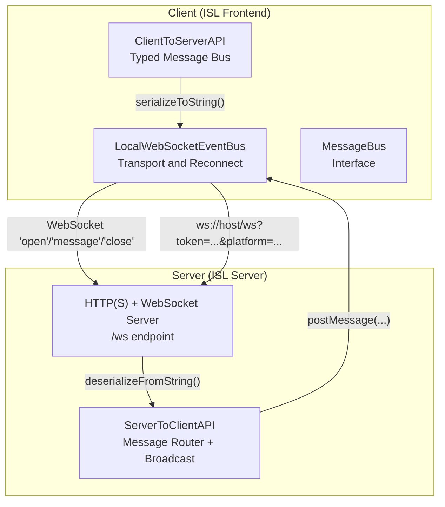
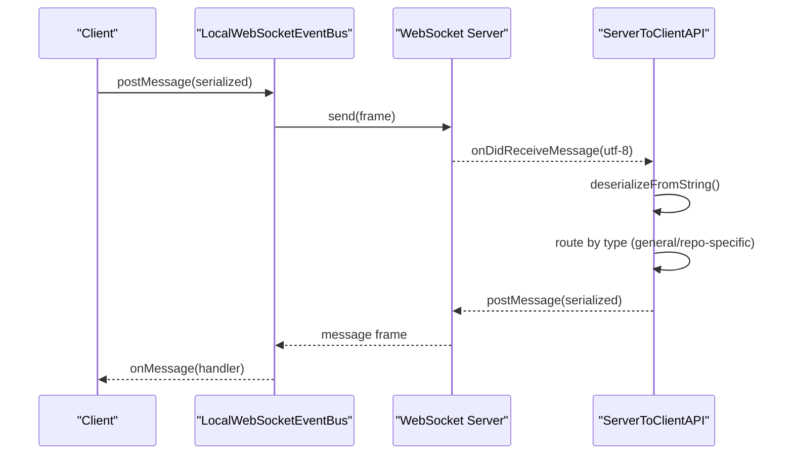
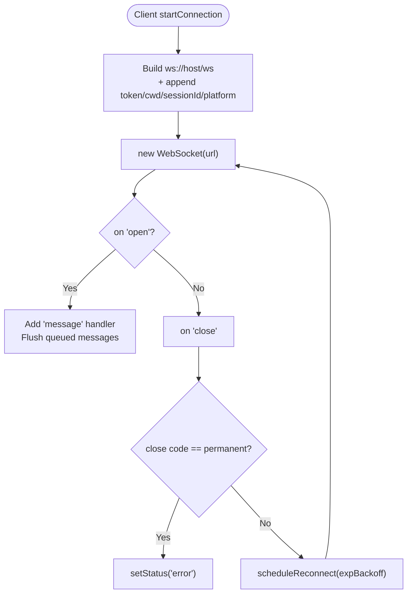
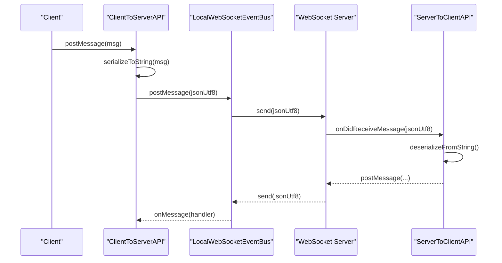
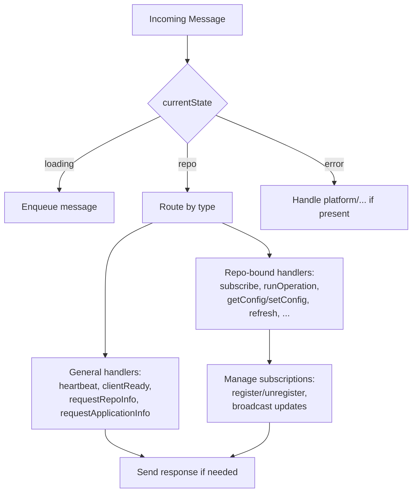
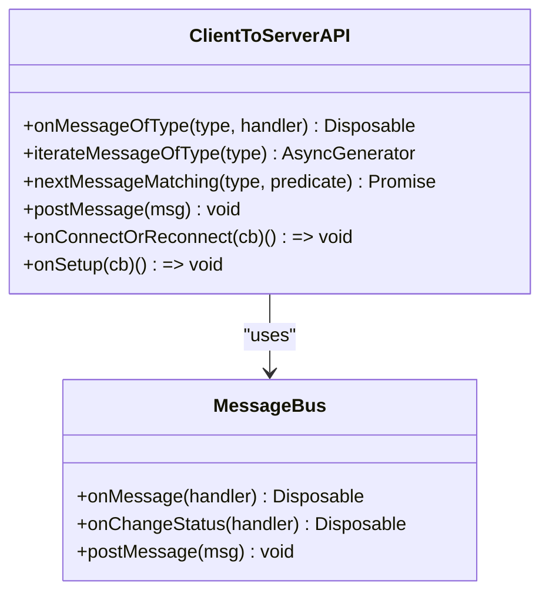
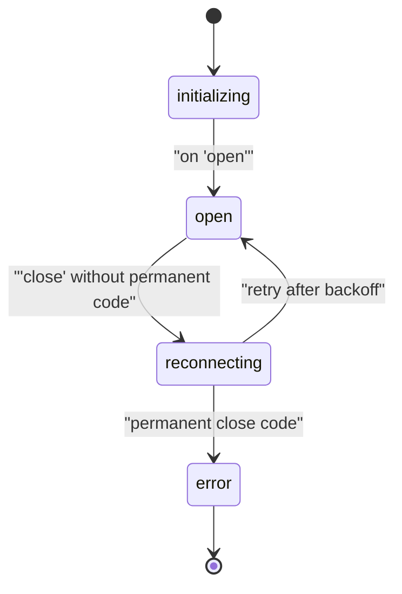
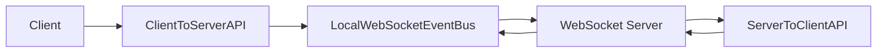

# WebSocket Protocol

<cite>
**Referenced Files in This Document**
- [LocalWebSocketEventBus.ts](file://addons/isl/src/LocalWebSocketEventBus.ts)
- [MessageBus.ts](file://addons/isl/src/MessageBus.ts)
- [ClientToServerAPI.ts](file://addons/isl/src/ClientToServerAPI.ts)
- [ServerToClientAPI.ts](file://addons/isl-server/src/ServerToClientAPI.ts)
- [server.ts](file://addons/isl-server/proxy/server.ts)
- [LocalWebsocketEventBus.test.ts](file://addons/isl/src/__tests__/LocalWebsocketEventBus.test.ts)
</cite>

## Table of Contents
1. [Introduction](#introduction)
2. [Project Structure](#project-structure)
3. [Core Components](#core-components)
4. [Architecture Overview](#architecture-overview)
5. [Detailed Component Analysis](#detailed-component-analysis)
6. [Dependency Analysis](#dependency-analysis)
7. [Performance Considerations](#performance-considerations)
8. [Troubleshooting Guide](#troubleshooting-guide)
9. [Conclusion](#conclusion)

## Introduction
This document specifies the WebSocket protocol used by SAPLING SCM’s Integrated Server Layer (ISL) for real-time bidirectional communication between the client and server. It covers connection establishment, message framing, authentication and session parameters, message routing, event broadcasting, client lifecycle management, and error handling. Practical examples illustrate typical client-server exchanges, connection state transitions, and real-time update patterns.

## Project Structure
The WebSocket protocol spans two primary areas:
- Client-side transport and API binding in the ISL front-end
- Server-side message routing and event broadcasting in the ISL server

**Diagram sources**
- [LocalWebSocketEventBus.ts:56-119](file://addons/isl/src/LocalWebSocketEventBus.ts#L56-L119)
- [ClientToServerAPI.ts:179-185](file://addons/isl/src/ClientToServerAPI.ts#L179-L185)
- [ServerToClientAPI.ts:99-116](file://addons/isl-server/src/ServerToClientAPI.ts#L99-L116)
- [server.ts:172-183](file://addons/isl-server/proxy/server.ts#L172-L183)

**Section sources**
- [LocalWebSocketEventBus.ts:56-119](file://addons/isl/src/LocalWebSocketEventBus.ts#L56-L119)
- [ClientToServerAPI.ts:179-185](file://addons/isl/src/ClientToServerAPI.ts#L179-L185)
- [ServerToClientAPI.ts:99-116](file://addons/isl-server/src/ServerToClientAPI.ts#L99-L116)
- [server.ts:172-183](file://addons/isl-server/proxy/server.ts#L172-L183)

## Core Components
- LocalWebSocketEventBus: Creates and manages the WebSocket connection, appends authentication/search parameters, queues outgoing messages during reconnect, and handles reconnection with exponential backoff.
- ClientToServerAPI: Provides a typed message bus over the underlying MessageBus, enabling registration of per-message-type listeners, async iteration over message streams, and connection/reconnect callbacks.
- ServerToClientAPI: Receives serialized messages from the client, deserializes them, routes them to appropriate handlers, and broadcasts updates to subscribed clients.
- HTTP(S) + WebSocket server: Validates WebSocket upgrade requests via URL parameters and upgrades to the /ws endpoint.

Key responsibilities:
- Transport: Establish WS connection, handle open/message/close, queue/sent message synchronization, and reconnect scheduling.
- Framing: Messages are UTF-8 strings serialized by the client and deserialized by the server.
- Routing: Server dispatches messages based on type and current repository state.
- Lifecycle: Manages connection status, queued messages, and subscription lifetimes.

**Section sources**
- [LocalWebSocketEventBus.ts:13-178](file://addons/isl/src/LocalWebSocketEventBus.ts#L13-L178)
- [MessageBus.ts:18-26](file://addons/isl/src/MessageBus.ts#L18-L26)
- [ClientToServerAPI.ts:20-29](file://addons/isl/src/ClientToServerAPI.ts#L20-L29)
- [ServerToClientAPI.ts:71-224](file://addons/isl-server/src/ServerToClientAPI.ts#L71-L224)
- [server.ts:172-183](file://addons/isl-server/proxy/server.ts#L172-L183)

## Architecture Overview
The protocol uses a simple, typed JSON-like message format transported over WebSocket frames. The client serializes messages to UTF-8 strings and sends them; the server deserializes them and routes based on the message type. Certain messages are queued until a repository context is available.

**Diagram sources**
- [LocalWebSocketEventBus.ts:152-158](file://addons/isl/src/LocalWebSocketEventBus.ts#L152-L158)
- [ClientToServerAPI.ts:179-185](file://addons/isl/src/ClientToServerAPI.ts#L179-L185)
- [ServerToClientAPI.ts:99-116](file://addons/isl-server/src/ServerToClientAPI.ts#L99-L116)

## Detailed Component Analysis

### Connection Establishment and Authentication
- Endpoint: /ws
- Upgrade: HTTP(S) server listens for WebSocket upgrades on /ws.
- Authentication: The client appends a token as a URL search parameter. The server validates the token and upgrades the connection.
- Optional parameters:
  - cwd: Current working directory (decoded and forwarded)
  - sessionId: Session identifier
  - platform: Platform name (e.g., browser, VS Code)
- Protocol: Uses wss:// if the page protocol is https;, otherwise ws://.

**Diagram sources**
- [LocalWebSocketEventBus.ts:56-119](file://addons/isl/src/LocalWebSocketEventBus.ts#L56-L119)
- [server.ts:172-183](file://addons/isl-server/proxy/server.ts#L172-L183)

**Section sources**
- [LocalWebSocketEventBus.ts:60-80](file://addons/isl/src/LocalWebSocketEventBus.ts#L60-L80)
- [server.ts:172-183](file://addons/isl-server/proxy/server.ts#L172-L183)

### Message Framing and Serialization
- Framing: Text frames containing UTF-8 encoded strings.
- Serialization: Client serializes outgoing messages; server deserializes incoming messages.
- Client serialization: ClientToServerAPI.serializeToString(message)
- Server deserialization: ServerToClientAPI.deserializeFromString(message)

**Diagram sources**
- [ClientToServerAPI.ts:179-185](file://addons/isl/src/ClientToServerAPI.ts#L179-L185)
- [ServerToClientAPI.ts:99-116](file://addons/isl-server/src/ServerToClientAPI.ts#L99-L116)

**Section sources**
- [ClientToServerAPI.ts:179-185](file://addons/isl/src/ClientToServerAPI.ts#L179-L185)
- [ServerToClientAPI.ts:99-116](file://addons/isl-server/src/ServerToClientAPI.ts#L99-L116)

### ServerToClientAPI: Message Routing and Broadcasting
- Queuing: While the repository context is loading, incoming messages are queued until a repository is set.
- Routing:
  - General messages: Handled regardless of repository state (e.g., heartbeat, clientReady, requestRepoInfo, requestApplicationInfo).
  - Repository-bound messages: Only handled when a repository is active (e.g., subscribe/unsubscribe, runOperation, refresh).
- Broadcasting: Subscriptions emit updates to clients (e.g., uncommittedChanges, smartlogCommits, mergeConflicts, submodules).
- Lifecycle:
  - Subscriptions are tracked by subscriptionID and disposed on unsubscribe or repository change.
  - Repository changes trigger ref/unref and reprocessing of queued messages.

**Diagram sources**
- [ServerToClientAPI.ts:225-262](file://addons/isl-server/src/ServerToClientAPI.ts#L225-L262)
- [ServerToClientAPI.ts:354-518](file://addons/isl-server/src/ServerToClientAPI.ts#L354-L518)

**Section sources**
- [ServerToClientAPI.ts:85-224](file://addons/isl-server/src/ServerToClientAPI.ts#L85-L224)
- [ServerToClientAPI.ts:225-343](file://addons/isl-server/src/ServerToClientAPI.ts#L225-L343)
- [ServerToClientAPI.ts:354-518](file://addons/isl-server/src/ServerToClientAPI.ts#L354-L518)

### ClientToServerAPI: Typed Messaging and Async Iteration
- Registration: Register listeners per message type; supports multiple handlers per type.
- Async iteration: iterateMessageOfType yields messages of a given type until the connection drops or the consumer exits.
- Next-match: nextMessageMatching waits for the next message matching a predicate.
- Connection callbacks: onConnectOrReconnect fires on initial connect and after reconnection; onSetup additionally reacts to cwd changes.

**Diagram sources**
- [ClientToServerAPI.ts:20-29](file://addons/isl/src/ClientToServerAPI.ts#L20-L29)
- [MessageBus.ts:18-26](file://addons/isl/src/MessageBus.ts#L18-L26)

**Section sources**
- [ClientToServerAPI.ts:35-233](file://addons/isl/src/ClientToServerAPI.ts#L35-L233)

### Connection State Management and Reconnection
- States: initializing, open, reconnecting, error.
- Handlers:
  - onMessage: registered once; receives all incoming messages.
  - onChangeStatus: registered multiple times; receives status transitions.
- Reconnection:
  - Exponential backoff with a cap.
  - Permanent failures (e.g., invalid token) set status to error and prevent reconnect.
  - Queued messages are flushed upon reconnection.

**Diagram sources**
- [LocalWebSocketEventBus.ts:17-28](file://addons/isl/src/LocalWebSocketEventBus.ts#L17-L28)
- [LocalWebSocketEventBus.ts:105-137](file://addons/isl/src/LocalWebSocketEventBus.ts#L105-L137)

**Section sources**
- [LocalWebSocketEventBus.ts:17-28](file://addons/isl/src/LocalWebSocketEventBus.ts#L17-L28)
- [LocalWebSocketEventBus.ts:105-137](file://addons/isl/src/LocalWebSocketEventBus.ts#L105-L137)

## Dependency Analysis
- Client depends on:
  - LocalWebSocketEventBus for transport and reconnection.
  - ClientToServerAPI for typed messaging and async iteration.
- Server depends on:
  - HTTP(S) server to accept WebSocket upgrades.
  - ServerToClientAPI for routing and broadcasting.

**Diagram sources**
- [ClientToServerAPI.ts:35-36](file://addons/isl/src/ClientToServerAPI.ts#L35-L36)
- [LocalWebSocketEventBus.ts:17-18](file://addons/isl/src/LocalWebSocketEventBus.ts#L17-L18)
- [ServerToClientAPI.ts:93-98](file://addons/isl-server/src/ServerToClientAPI.ts#L93-L98)
- [server.ts:172-183](file://addons/isl-server/proxy/server.ts#L172-L183)

**Section sources**
- [ClientToServerAPI.ts:35-36](file://addons/isl/src/ClientToServerAPI.ts#L35-L36)
- [LocalWebSocketEventBus.ts:17-18](file://addons/isl/src/LocalWebSocketEventBus.ts#L17-L18)
- [ServerToClientAPI.ts:93-98](file://addons/isl-server/src/ServerToClientAPI.ts#L93-L98)
- [server.ts:172-183](file://addons/isl-server/proxy/server.ts#L172-L183)

## Performance Considerations
- Message queuing: Client queues outgoing messages during reconnect to avoid data loss; flushes on reconnection.
- Backoff strategy: Exponential backoff with a maximum cap prevents excessive retries.
- Subscription updates: Subscriptions broadcast incremental updates; consider batching where appropriate to reduce traffic.
- Serialization overhead: UTF-8 string serialization is lightweight; avoid excessively large payloads.

[No sources needed since this section provides general guidance]

## Troubleshooting Guide
Common issues and resolutions:
- Invalid token:
  - Symptom: Immediate close with a permanent code; status becomes error.
  - Resolution: Provide a valid token via URL parameter.
- Frequent reconnect loops:
  - Symptom: Rapid reconnection attempts.
  - Resolution: Verify server availability and network stability; exponential backoff will eventually cap.
- Messages not delivered:
  - Symptom: Client appears disconnected or messages are queued.
  - Resolution: Ensure the client is connected; queued messages are flushed on reconnect.
- Subscription not firing:
  - Symptom: No updates after subscribe.
  - Resolution: Confirm repository context is loaded; verify subscriptionID and kind.

**Section sources**
- [LocalWebSocketEventBus.ts:105-116](file://addons/isl/src/LocalWebSocketEventBus.ts#L105-L116)
- [LocalWebSocketEventBus.ts:126-137](file://addons/isl/src/LocalWebSocketEventBus.ts#L126-L137)
- [ServerToClientAPI.ts:214-223](file://addons/isl-server/src/ServerToClientAPI.ts#L214-L223)

## Conclusion
The SAPLING SCM WebSocket protocol provides a robust, typed, and resilient real-time communication channel. It uses a simple UTF-8 string framing, strong authentication via URL parameters, and a clear separation of concerns between transport, typing, and routing. The client and server cooperate to maintain reliable delivery, handle reconnections gracefully, and support subscription-based event broadcasting.