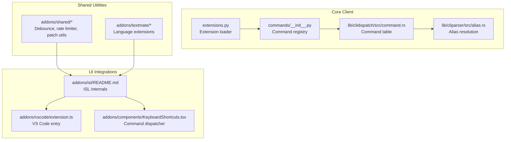
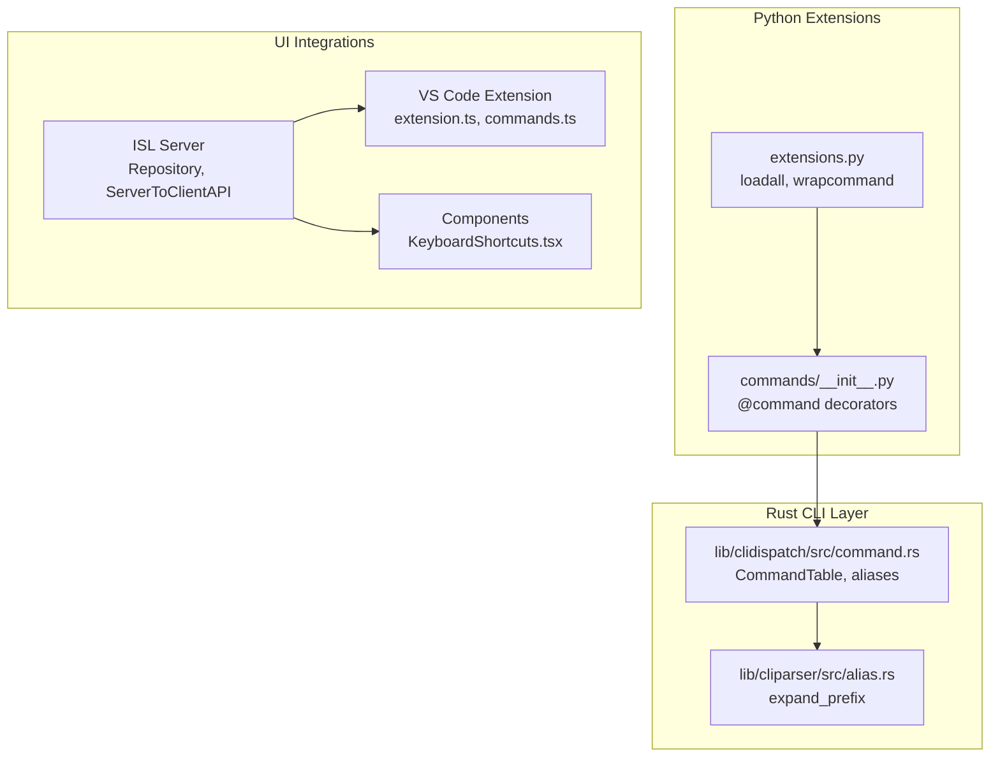
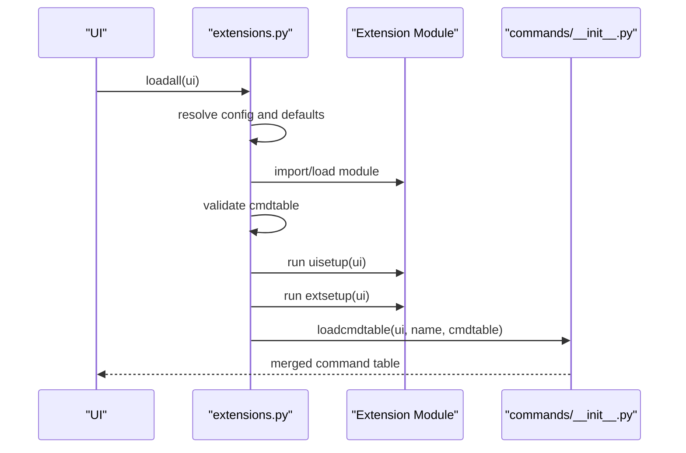
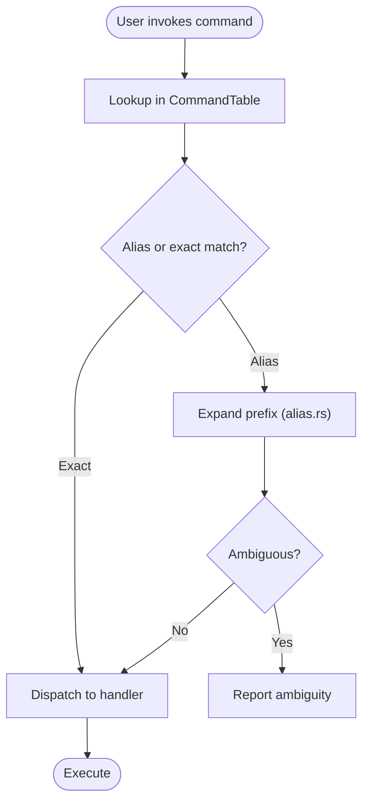
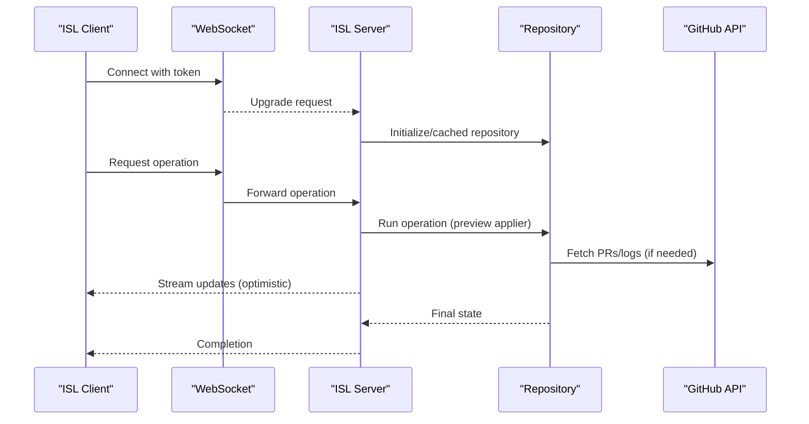
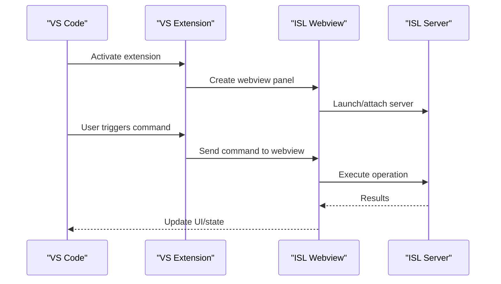
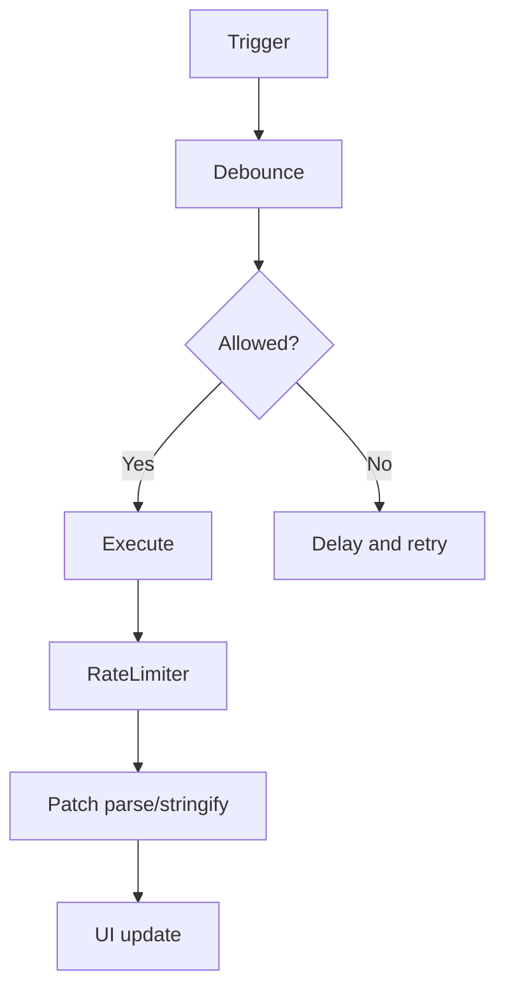
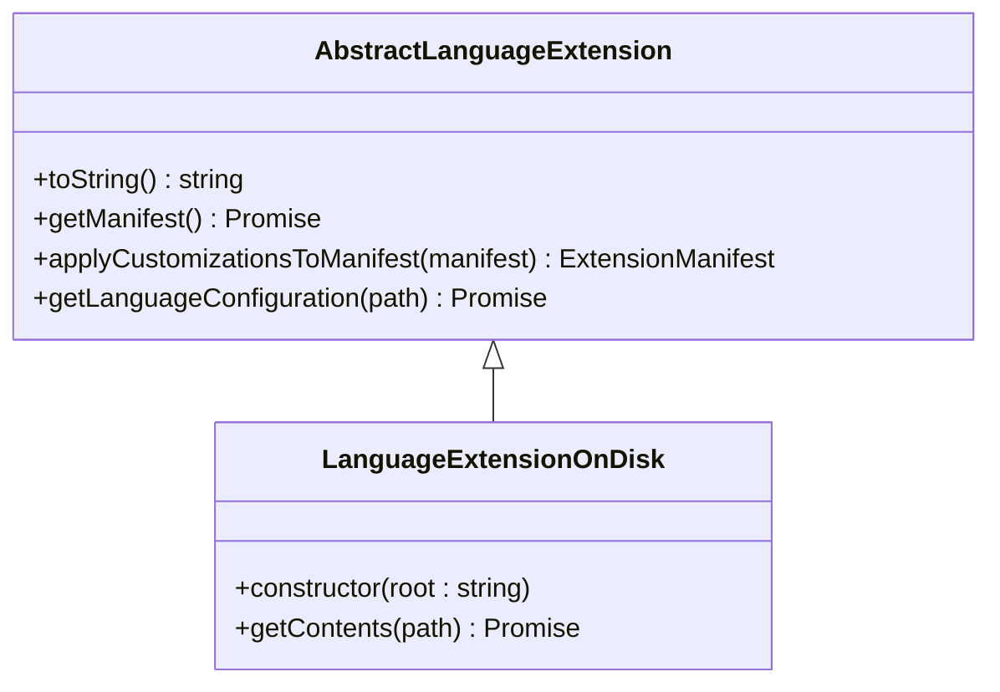
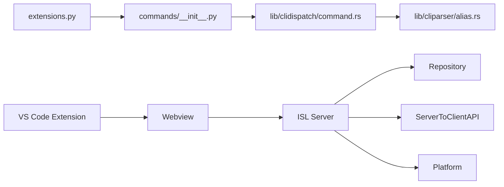

# Advanced Topics and Extensibility

<cite>
**Referenced Files in This Document**
- [README.md](file://README.md)
- [CONTRIBUTING.md](file://CONTRIBUTING.md)
- [extensions.py](file://eden/scm/sapling/extensions.py)
- [commands/__init__.py](file://eden/scm/sapling/commands/__init__.py)
- [extutil.py](file://eden/scm/sapling/ext/extutil.py)
- [KeyboardShortcuts.tsx](file://addons/components/KeyboardShortcuts.tsx)
- [isl/README.md](file://addons/isl/README.md)
- [isl-server/src/commands.ts](file://addons/isl-server/src/commands.ts)
- [isl-server/src/Repository.ts](file://addons/isl-server/src/Repository.ts)
- [isl-server/src/ServerToClientAPI.ts](file://addons/isl-server/src/ServerToClientAPI.ts)
- [isl-server/platform/webviewServerPlatform.ts](file://addons/isl-server/platform/webviewServerPlatform.ts)
- [vscode/extension.ts](file://addons/vscode/extension.ts)
- [vscode/commands.ts](file://addons/vscode/commands.ts)
- [vscode/CONTRIBUTING.md](file://addons/vscode/CONTRIBUTING.md)
- [textmate/AbstractLanguageExtension.ts](file://addons/textmate/src/AbstractLanguageExtension.ts)
- [textmate/LanguageExtensionOnDisk.ts](file://addons/textmate/src/LanguageExtensionOnDisk.ts)
- [shared/ContextMenu.tsx](file://addons/shared/ContextMenu.tsx)
- [shared/debounce.ts](file://addons/shared/debounce.ts)
- [shared/RateLimiter.ts](file://addons/shared/RateLimiter.ts)
- [shared/CancellationToken.ts](file://addons/shared/CancellationToken.ts)
- [shared/testUtils.ts](file://addons/shared/testUtils.ts)
- [shared/utils.ts](file://addons/shared/utils.ts)
- [shared/patch/parse.ts](file://addons/shared/patch/parse.ts)
- [shared/patch/stringify.ts](file://addons/shared/patch/stringify.ts)
- [shared/patch/types.ts](file://addons/shared/patch/types.ts)
- [lib/cliparser/src/alias.rs](file://eden/scm/lib/cliparser/src/alias.rs)
- [lib/clidispatch/src/command.rs](file://eden/scm/lib/clidispatch/src/command.rs)
- [lib/third-party/conch-parser/src/ast/builder.rs](file://eden/scm/lib/third-party/conch-parser/src/ast/builder.rs)
- [lib/third-party/conch-parser/src/ast/builder/default_builder.rs](file://eden/scm/lib/third-party/conch-parser/src/ast/builder/default_builder.rs)
- [eden/scm/tests/dummyext1.py](file://eden/scm/tests/dummyext1.py)
- [eden/scm/tests/dummyext2.py](file://eden/scm/tests/dummyext2.py)
</cite>

## Table of Contents
1. [Introduction](#introduction)
2. [Project Structure](#project-structure)
3. [Core Components](#core-components)
4. [Architecture Overview](#architecture-overview)
5. [Detailed Component Analysis](#detailed-component-analysis)
6. [Dependency Analysis](#dependency-analysis)
7. [Performance Considerations](#performance-considerations)
8. [Troubleshooting Guide](#troubleshooting-guide)
9. [Conclusion](#conclusion)
10. [Appendices](#appendices)

## Introduction
This document focuses on advanced SAPLING SCM extensibility patterns and plugin development frameworks. It explains how to extend the SAPLING client through Python-based extensions, how to create custom commands, and how to integrate with the broader ecosystem (ISL, VS Code, and textmate language extensions). It also covers internal architecture principles, design patterns, advanced configuration, performance tuning, troubleshooting, and contribution guidelines.

## Project Structure
The repository is organized into several major areas:
- eden/scm/sapling: Core client implementation and extension framework
- addons: UI integrations (ISL, VS Code, shared components)
- eden/scm/lib: Rust libraries for CLI parsing and dispatch
- eden/contrib and eden/scm/tests: Supporting libraries and test extensions

**Diagram sources**
- [extensions.py:1-200](file://eden/scm/sapling/extensions.py#L1-L200)
- [commands/__init__.py:1-120](file://eden/scm/sapling/commands/__init__.py#L1-L120)
- [lib/clidispatch/src/command.rs:85-123](file://eden/scm/lib/clidispatch/src/command.rs#L85-L123)
- [lib/cliparser/src/alias.rs:254-399](file://eden/scm/lib/cliparser/src/alias.rs#L254-L399)
- [addons/isl/README.md:143-203](file://addons/isl/README.md#L143-L203)
- [addons/vscode/extension.ts](file://addons/vscode/extension.ts)
- [addons/components/KeyboardShortcuts.tsx:131-159](file://addons/components/KeyboardShortcuts.tsx#L131-L159)
- [addons/shared/debounce.ts](file://addons/shared/debounce.ts)
- [addons/shared/RateLimiter.ts](file://addons/shared/RateLimiter.ts)
- [addons/shared/patch/parse.ts](file://addons/shared/patch/parse.ts)
- [addons/textmate/src/AbstractLanguageExtension.ts:82-118](file://addons/textmate/src/AbstractLanguageExtension.ts#L82-L118)

**Section sources**
- [README.md:1-28](file://README.md#L1-L28)

## Core Components
- Extension framework: dynamic loading, setup callbacks, command wrapping, and ordering
- Command registration and dispatch: Python decorators and Rust command tables
- UI integration points: ISL client/server, VS Code extension, and shared components
- Shared utilities: debouncing, rate limiting, cancellation tokens, and patch utilities
- Textmate language extensions: pluggable language configurations and on-disk extensions

Key implementation references:
- Extension loading and setup: [extensions.py:467-548](file://eden/scm/sapling/extensions.py#L467-L548)
- Command registration decorators: [commands/__init__.py:205-251](file://eden/scm/sapling/commands/__init__.py#L205-L251)
- Command table and aliases: [lib/clidispatch/src/command.rs:85-123](file://eden/scm/lib/clidispatch/src/command.rs#L85-L123)
- Alias resolution: [lib/cliparser/src/alias.rs:254-399](file://eden/scm/lib/cliparser/src/alias.rs#L254-L399)
- ISL architecture and lifecycle: [addons/isl/README.md:143-203](file://addons/isl/README.md#L143-L203)
- VS Code extension entry: [addons/vscode/extension.ts](file://addons/vscode/extension.ts)
- Shared utilities: [addons/shared/debounce.ts](file://addons/shared/debounce.ts), [addons/shared/RateLimiter.ts](file://addons/shared/RateLimiter.ts), [addons/shared/CancellationToken.ts](file://addons/shared/CancellationToken.ts), [addons/shared/patch/parse.ts](file://addons/shared/patch/parse.ts)

**Section sources**
- [extensions.py:467-548](file://eden/scm/sapling/extensions.py#L467-L548)
- [commands/__init__.py:205-251](file://eden/scm/sapling/commands/__init__.py#L205-L251)
- [lib/clidispatch/src/command.rs:85-123](file://eden/scm/lib/clidispatch/src/command.rs#L85-L123)
- [lib/cliparser/src/alias.rs:254-399](file://eden/scm/lib/cliparser/src/alias.rs#L254-L399)
- [addons/isl/README.md:143-203](file://addons/isl/README.md#L143-L203)
- [addons/vscode/extension.ts](file://addons/vscode/extension.ts)
- [addons/shared/debounce.ts](file://addons/shared/debounce.ts)
- [addons/shared/RateLimiter.ts](file://addons/shared/RateLimiter.ts)
- [addons/shared/CancellationToken.ts](file://addons/shared/CancellationToken.ts)
- [addons/shared/patch/parse.ts](file://addons/shared/patch/parse.ts)

## Architecture Overview
SAPLING’s extensibility centers on:
- Python extension modules that contribute commands, predicates, and UI hooks
- A command registry that merges core and extension-provided commands
- A client/server architecture for UI integrations (ISL) with platform abstractions
- Shared utilities for performance and reliability

**Diagram sources**
- [extensions.py:467-548](file://eden/scm/sapling/extensions.py#L467-L548)
- [commands/__init__.py:107-109](file://eden/scm/sapling/commands/__init__.py#L107-L109)
- [lib/clidispatch/src/command.rs:85-123](file://eden/scm/lib/clidispatch/src/command.rs#L85-L123)
- [lib/cliparser/src/alias.rs:254-399](file://eden/scm/lib/cliparser/src/alias.rs#L254-L399)
- [addons/isl-server/src/Repository.ts](file://addons/isl-server/src/Repository.ts)
- [addons/isl-server/src/ServerToClientAPI.ts](file://addons/isl-server/src/ServerToClientAPI.ts)
- [addons/vscode/extension.ts](file://addons/vscode/extension.ts)
- [addons/components/KeyboardShortcuts.tsx:131-159](file://addons/components/KeyboardShortcuts.tsx#L131-L159)

## Detailed Component Analysis

### Extension Framework and Plugin Development
- Loading and activation: extensions are discovered from configuration, pre-imported, validated, and initialized with setup callbacks
- Command wrapping and interception: extensions can wrap commands and inject behavior
- Utility interposition: runtime class replacement and property wrapping enable deep customization

**Diagram sources**
- [extensions.py:467-548](file://eden/scm/sapling/extensions.py#L467-L548)
- [extensions.py:656-705](file://eden/scm/sapling/extensions.py#L656-L705)
- [commands/__init__.py:6325-6332](file://eden/scm/sapling/commands/__init__.py#L6325-L6332)

Implementation highlights:
- Activation and ordering: [extensions.py:467-548](file://eden/scm/sapling/extensions.py#L467-L548)
- Wrapping commands: [extensions.py:656-705](file://eden/scm/sapling/extensions.py#L656-L705)
- Property wrapping: [extensions.py:708-730](file://eden/scm/sapling/extensions.py#L708-L730)
- Runtime class replacement utility: [extutil.py:17-42](file://eden/scm/sapling/ext/extutil.py#L17-L42)

**Section sources**
- [extensions.py:467-548](file://eden/scm/sapling/extensions.py#L467-L548)
- [extensions.py:656-705](file://eden/scm/sapling/extensions.py#L656-L705)
- [extensions.py:708-730](file://eden/scm/sapling/extensions.py#L708-L730)
- [extutil.py:17-42](file://eden/scm/sapling/ext/extutil.py#L17-L42)

### Custom Command Creation
- Python commands: registered via decorators and added to the command table
- Rust command table: supports aliases, flags, and structured flags
- Alias expansion: robust prefix resolution with ambiguity handling

**Diagram sources**
- [lib/clidispatch/src/command.rs:85-123](file://eden/scm/lib/clidispatch/src/command.rs#L85-L123)
- [lib/cliparser/src/alias.rs:254-399](file://eden/scm/lib/cliparser/src/alias.rs#L254-L399)
- [commands/__init__.py:205-251](file://eden/scm/sapling/commands/__init__.py#L205-L251)

**Section sources**
- [lib/clidispatch/src/command.rs:85-123](file://eden/scm/lib/clidispatch/src/command.rs#L85-L123)
- [lib/cliparser/src/alias.rs:254-399](file://eden/scm/lib/cliparser/src/alias.rs#L254-L399)
- [commands/__init__.py:205-251](file://eden/scm/sapling/commands/__init__.py#L205-L251)

### ISL Client/Server Integration Patterns
ISL follows a client/server architecture with:
- Client: React + Jotai for state, communicates via WebSocket
- Server: Repository abstraction, Watchman/GitHub integration, operation queue
- Platform abstractions for embedding contexts (browser, VS Code, Android Studio)
- Operation lifecycle with preview appliers and optimistic updates

**Diagram sources**
- [addons/isl/README.md:143-203](file://addons/isl/README.md#L143-L203)
- [addons/isl-server/src/Repository.ts](file://addons/isl-server/src/Repository.ts)
- [addons/isl-server/src/ServerToClientAPI.ts](file://addons/isl-server/src/ServerToClientAPI.ts)
- [addons/isl-server/platform/webviewServerPlatform.ts](file://addons/isl-server/platform/webviewServerPlatform.ts)

**Section sources**
- [addons/isl/README.md:143-203](file://addons/isl/README.md#L143-L203)
- [addons/isl-server/src/Repository.ts](file://addons/isl-server/src/Repository.ts)
- [addons/isl-server/src/ServerToClientAPI.ts](file://addons/isl-server/src/ServerToClientAPI.ts)
- [addons/isl-server/platform/webviewServerPlatform.ts](file://addons/isl-server/platform/webviewServerPlatform.ts)

### VS Code Extension Integration
The VS Code extension integrates ISL as a webview and exposes commands to the editor.

**Diagram sources**
- [addons/vscode/extension.ts](file://addons/vscode/extension.ts)
- [addons/vscode/commands.ts](file://addons/vscode/commands.ts)
- [addons/isl/README.md:143-203](file://addons/isl/README.md#L143-L203)

**Section sources**
- [addons/vscode/extension.ts](file://addons/vscode/extension.ts)
- [addons/vscode/commands.ts](file://addons/vscode/commands.ts)
- [addons/isl/README.md:143-203](file://addons/isl/README.md#L143-L203)

### Shared Utilities and Patterns
- Debounce and rate limiting: control frequency of operations
- Cancellation tokens: cooperative cancellation for long-running tasks
- Patch utilities: parsing and serializing diffs
- Context menus and UI primitives: reusable components

**Diagram sources**
- [addons/shared/debounce.ts](file://addons/shared/debounce.ts)
- [addons/shared/RateLimiter.ts](file://addons/shared/RateLimiter.ts)
- [addons/shared/patch/parse.ts](file://addons/shared/patch/parse.ts)
- [addons/shared/patch/stringify.ts](file://addons/shared/patch/stringify.ts)
- [addons/shared/ContextMenu.tsx](file://addons/shared/ContextMenu.tsx)

**Section sources**
- [addons/shared/debounce.ts](file://addons/shared/debounce.ts)
- [addons/shared/RateLimiter.ts](file://addons/shared/RateLimiter.ts)
- [addons/shared/patch/parse.ts](file://addons/shared/patch/parse.ts)
- [addons/shared/patch/stringify.ts](file://addons/shared/patch/stringify.ts)
- [addons/shared/ContextMenu.tsx](file://addons/shared/ContextMenu.tsx)

### Textmate Language Extensions
Pluggable language extensions support on-disk and GitHub-hosted configurations, with manifest customization hooks.

**Diagram sources**
- [addons/textmate/src/AbstractLanguageExtension.ts:82-118](file://addons/textmate/src/AbstractLanguageExtension.ts#L82-L118)
- [addons/textmate/src/LanguageExtensionOnDisk.ts:12-25](file://addons/textmate/src/LanguageExtensionOnDisk.ts#L12-L25)

**Section sources**
- [addons/textmate/src/AbstractLanguageExtension.ts:82-118](file://addons/textmate/src/AbstractLanguageExtension.ts#L82-L118)
- [addons/textmate/src/LanguageExtensionOnDisk.ts:12-25](file://addons/textmate/src/LanguageExtensionOnDisk.ts#L12-L25)

## Dependency Analysis
- Python extension modules depend on the extension loader and command table
- Rust command table and alias resolution underpin CLI parsing
- ISL server depends on repository caching and platform abstractions
- VS Code extension depends on webview and ISL server lifecycle

**Diagram sources**
- [extensions.py:467-548](file://eden/scm/sapling/extensions.py#L467-L548)
- [commands/__init__.py:107-109](file://eden/scm/sapling/commands/__init__.py#L107-L109)
- [lib/clidispatch/src/command.rs:85-123](file://eden/scm/lib/clidispatch/src/command.rs#L85-L123)
- [lib/cliparser/src/alias.rs:254-399](file://eden/scm/lib/cliparser/src/alias.rs#L254-L399)
- [addons/isl-server/src/Repository.ts](file://addons/isl-server/src/Repository.ts)
- [addons/isl-server/src/ServerToClientAPI.ts](file://addons/isl-server/src/ServerToClientAPI.ts)
- [addons/vscode/extension.ts](file://addons/vscode/extension.ts)

**Section sources**
- [extensions.py:467-548](file://eden/scm/sapling/extensions.py#L467-L548)
- [commands/__init__.py:107-109](file://eden/scm/sapling/commands/__init__.py#L107-L109)
- [lib/clidispatch/src/command.rs:85-123](file://eden/scm/lib/clidispatch/src/command.rs#L85-L123)
- [lib/cliparser/src/alias.rs:254-399](file://eden/scm/lib/cliparser/src/alias.rs#L254-L399)
- [addons/isl-server/src/Repository.ts](file://addons/isl-server/src/Repository.ts)
- [addons/isl-server/src/ServerToClientAPI.ts](file://addons/isl-server/src/ServerToClientAPI.ts)
- [addons/vscode/extension.ts](file://addons/vscode/extension.ts)

## Performance Considerations
- Debounce and rate limiting: reduce redundant operations in UI and server loops
- Optimistic updates: improve perceived responsiveness during long-running operations
- Repository caching: reuse Repository instances per repo root to minimize startup overhead
- Tokenization and patch parsing: efficient incremental updates and diff computation

Practical guidance:
- Prefer debounced handlers for frequent UI events
- Use rate limiters for network-bound operations
- Leverage optimistic state transitions and preview appliers for smoother UX
- Cache repository instances and invalidate on state changes

**Section sources**
- [addons/shared/debounce.ts](file://addons/shared/debounce.ts)
- [addons/shared/RateLimiter.ts](file://addons/shared/RateLimiter.ts)
- [addons/isl/README.md:251-300](file://addons/isl/README.md#L251-L300)
- [addons/isl-server/src/Repository.ts](file://addons/isl-server/src/Repository.ts)

## Troubleshooting Guide
Common issues and remedies:
- Extension import failures: review warnings and tracebacks during loadall; verify module paths and dependencies
- Command conflicts: wrap commands with caution; ensure proper signatures and aliases
- ISL server reuse and tokens: restart or force server to refresh tokens; use kill/force options
- Stack traces in production: use source maps to recover readable stack traces

References:
- Extension loading and error reporting: [extensions.py:496-518](file://eden/scm/sapling/extensions.py#L496-L518)
- Command wrapping and validation: [extensions.py:656-705](file://eden/scm/sapling/extensions.py#L656-L705)
- ISL debugging and source maps: [addons/isl/README.md:326-382](file://addons/isl/README.md#L326-L382)

**Section sources**
- [extensions.py:496-518](file://eden/scm/sapling/extensions.py#L496-L518)
- [extensions.py:656-705](file://eden/scm/sapling/extensions.py#L656-L705)
- [addons/isl/README.md:326-382](file://addons/isl/README.md#L326-L382)

## Conclusion
SAPLING’s extensibility is built on a robust Python extension framework, a flexible command registration system, and a client/server UI architecture. By leveraging these patterns—extension loading, command wrapping, platform abstractions, and shared utilities—developers can extend the client, integrate with editors, and build advanced UI experiences while maintaining performance and reliability.

## Appendices

### Advanced Configuration Options
- Extension configuration: enable/disable, default sets, and always-on extensions
- Command aliases and legacy aliases: define and resolve command names
- UI integration: platform-specific behaviors and token-based security

References:
- [extensions.py:124-135](file://eden/scm/sapling/extensions.py#L124-L135)
- [lib/clidispatch/src/command.rs:102-116](file://eden/scm/lib/clidispatch/src/command.rs#L102-L116)
- [lib/cliparser/src/alias.rs:254-399](file://eden/scm/lib/cliparser/src/alias.rs#L254-L399)
- [addons/isl/README.md:204-222](file://addons/isl/README.md#L204-L222)

**Section sources**
- [extensions.py:124-135](file://eden/scm/sapling/extensions.py#L124-L135)
- [lib/clidispatch/src/command.rs:102-116](file://eden/scm/lib/clidispatch/src/command.rs#L102-L116)
- [lib/cliparser/src/alias.rs:254-399](file://eden/scm/lib/cliparser/src/alias.rs#L254-L399)
- [addons/isl/README.md:204-222](file://addons/isl/README.md#L204-L222)

### Contributing and Community
- Contribution workflow: fork, branch, tests, lint, CLA
- VS Code extension contribution guide
- Issue reporting and security disclosures

References:
- [CONTRIBUTING.md:1-41](file://CONTRIBUTING.md#L1-L41)
- [addons/vscode/CONTRIBUTING.md](file://addons/vscode/CONTRIBUTING.md)

**Section sources**
- [CONTRIBUTING.md:1-41](file://CONTRIBUTING.md#L1-L41)
- [addons/vscode/CONTRIBUTING.md](file://addons/vscode/CONTRIBUTING.md)

### Experimental Features and Emerging Capabilities
- Annotation enhancements and experimental flags
- Test extensions demonstrating extension hooks
- Parser and AST builder abstractions for shell-like constructs

References:
- [commands/__init__.py:346-347](file://eden/scm/sapling/commands/__init__.py#L346-L347)
- [eden/scm/tests/dummyext1.py:1-6](file://eden/scm/tests/dummyext1.py#L1-L6)
- [eden/scm/tests/dummyext2.py:1-6](file://eden/scm/tests/dummyext2.py#L1-L6)
- [lib/third-party/conch-parser/src/ast/builder.rs:521-560](file://eden/scm/lib/third-party/conch-parser/src/ast/builder.rs#L521-L560)
- [lib/third-party/conch-parser/src/ast/builder/default_builder.rs:134-166](file://eden/scm/lib/third-party/conch-parser/src/ast/builder/default_builder.rs#L134-L166)

**Section sources**
- [commands/__init__.py:346-347](file://eden/scm/sapling/commands/__init__.py#L346-L347)
- [eden/scm/tests/dummyext1.py:1-6](file://eden/scm/tests/dummyext1.py#L1-L6)
- [eden/scm/tests/dummyext2.py:1-6](file://eden/scm/tests/dummyext2.py#L1-L6)
- [lib/third-party/conch-parser/src/ast/builder.rs:521-560](file://eden/scm/lib/third-party/conch-parser/src/ast/builder.rs#L521-L560)
- [lib/third-party/conch-parser/src/ast/builder/default_builder.rs:134-166](file://eden/scm/lib/third-party/conch-parser/src/ast/builder/default_builder.rs#L134-L166)