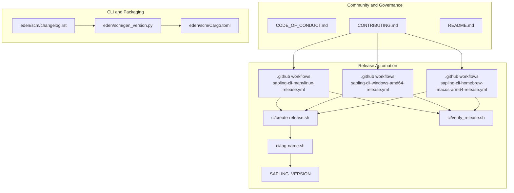
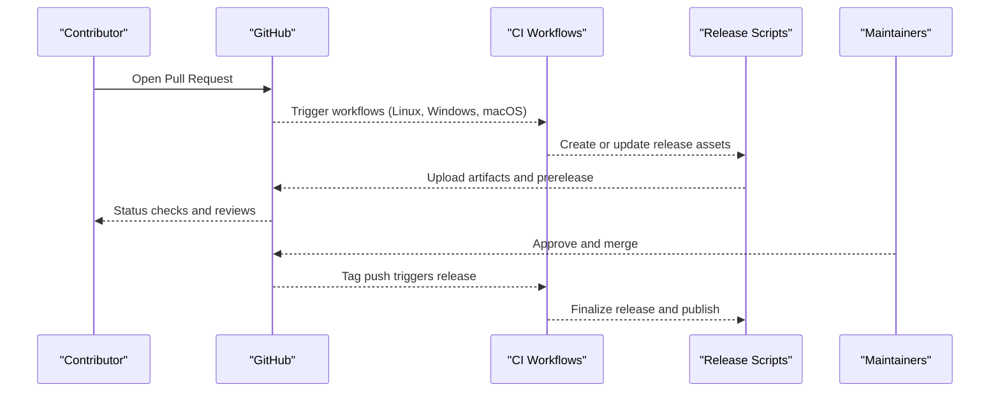
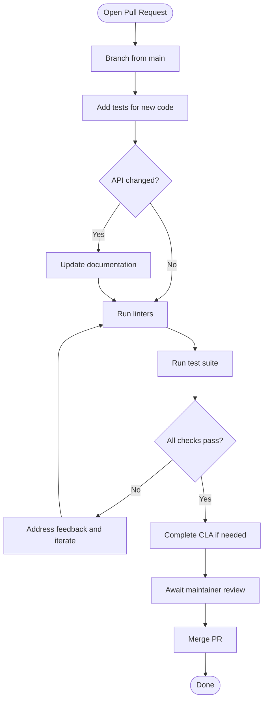
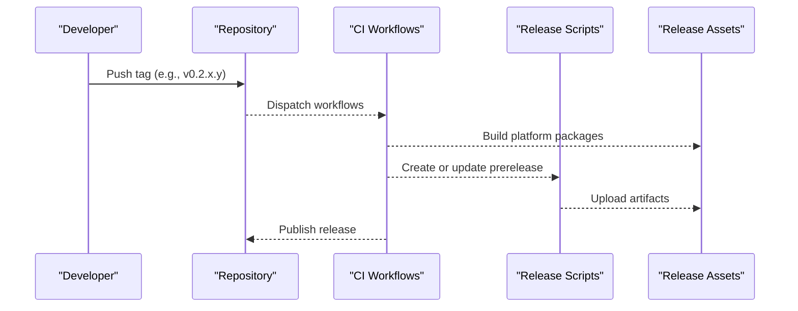
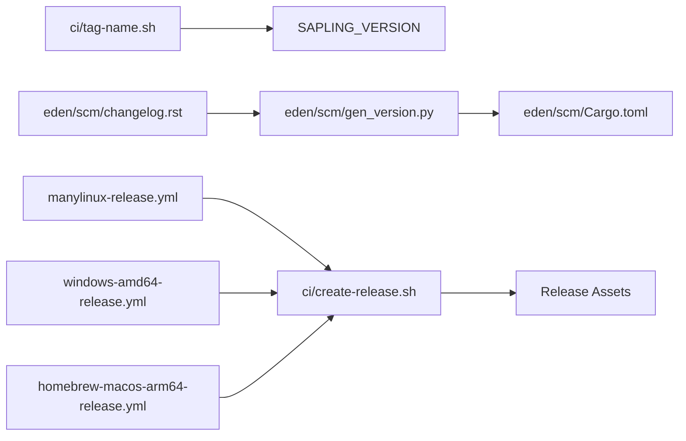

# Community and Contributing

<cite>
**Referenced Files in This Document**
- [CONTRIBUTING.md](file://CONTRIBUTING.md)
- [CODE_OF_CONDUCT.md](file://CODE_OF_CONDUCT.md)
- [README.md](file://README.md)
- [.github workflows: sapling-cli-manylinux-release.yml](file://.github/workflows/sapling-cli-manylinux-release.yml)
- [.github workflows: sapling-cli-windows-amd64-release.yml](file://.github/workflows/sapling-cli-windows-amd64-release.yml)
- [.github workflows: sapling-cli-homebrew-macos-arm64-release.yml](file://.github/workflows/sapling-cli-homebrew-macos-arm64-release.yml)
- [ci/create-release.sh](file://ci/create-release.sh)
- [ci/tag-name.sh](file://ci/tag-name.sh)
- [ci/verify_release.sh](file://ci/verify_release.sh)
- [SAPLING_VERSION](file://SAPLING_VERSION)
- [eden/scm/changelog.rst](file://eden/scm/changelog.rst)
- [eden/scm/gen_version.py](file://eden/scm/gen_version.py)
- [eden/scm/Cargo.toml](file://eden/scm/Cargo.toml)
</cite>

## Table of Contents
1. [Introduction](#introduction)
2. [Project Structure](#project-structure)
3. [Core Components](#core-components)
4. [Architecture Overview](#architecture-overview)
5. [Detailed Component Analysis](#detailed-component-analysis)
6. [Dependency Analysis](#dependency-analysis)
7. [Performance Considerations](#performance-considerations)
8. [Troubleshooting Guide](#troubleshooting-guide)
9. [Conclusion](#conclusion)
10. [Appendices](#appendices)

## Introduction
This document consolidates community participation and contribution guidelines for the SAPLING SCM project. It explains how to contribute code and documentation, how the project is governed and moderated, and how releases and versioning are handled. It also outlines the development workflow, code review expectations, and communication channels for discussions, bug reports, and feature requests.

## Project Structure
The repository is a multi-component ecosystem centered around the Sapling client, with supporting server-side and file system components, plus a web-based UI and VS Code extension. Community-facing contribution and conduct policies are documented at the repository root, while release automation is implemented via GitHub Actions and CI scripts.

**Diagram sources**
- [CONTRIBUTING.md](file://CONTRIBUTING.md)
- [.github workflows: sapling-cli-manylinux-release.yml](file://.github/workflows/sapling-cli-manylinux-release.yml)
- [.github workflows: sapling-cli-windows-amd64-release.yml](file://.github/workflows/sapling-cli-windows-amd64-release.yml)
- [.github workflows: sapling-cli-homebrew-macos-arm64-release.yml](file://.github/workflows/sapling-cli-homebrew-macos-arm64-release.yml)
- [ci/create-release.sh](file://ci/create-release.sh)
- [ci/tag-name.sh](file://ci/tag-name.sh)
- [ci/verify_release.sh](file://ci/verify_release.sh)
- [SAPLING_VERSION](file://SAPLING_VERSION)
- [eden/scm/changelog.rst](file://eden/scm/changelog.rst)
- [eden/scm/gen_version.py](file://eden/scm/gen_version.py)
- [eden/scm/Cargo.toml](file://eden/scm/Cargo.toml)

**Section sources**
- [README.md](file://README.md)
- [CONTRIBUTING.md](file://CONTRIBUTING.md)
- [CODE_OF_CONDUCT.md](file://CODE_OF_CONDUCT.md)

## Core Components
- Contribution process and standards: Pull requests, testing, linting, documentation updates, and CLA requirements.
- Community governance and conduct: Code of Conduct, reporting mechanisms, and enforcement scope.
- Communication channels: GitHub issues for bugs, Discord for discussions.
- Release automation: Platform-specific CI workflows, release creation, and verification scripts.
- Versioning and changelog: Version file, tag naming, changelog maintenance, and generated version metadata.

**Section sources**
- [CONTRIBUTING.md](file://CONTRIBUTING.md)
- [CODE_OF_CONDUCT.md](file://CODE_OF_CONDUCT.md)
- [README.md](file://README.md)
- [ci/create-release.sh](file://ci/create-release.sh)
- [ci/tag-name.sh](file://ci/tag-name.sh)
- [ci/verify_release.sh](file://ci/verify_release.sh)
- [SAPLING_VERSION](file://SAPLING_VERSION)
- [eden/scm/changelog.rst](file://eden/scm/changelog.rst)
- [eden/scm/gen_version.py](file://eden/scm/gen_version.py)

## Architecture Overview
The contribution lifecycle integrates contributor actions with automated release pipelines and governance policies.

**Diagram sources**
- [.github workflows: sapling-cli-manylinux-release.yml](file://.github/workflows/sapling-cli-manylinux-release.yml)
- [.github workflows: sapling-cli-windows-amd64-release.yml](file://.github/workflows/sapling-cli-windows-amd64-release.yml)
- [.github workflows: sapling-cli-homebrew-macos-arm64-release.yml](file://.github/workflows/sapling-cli-homebrew-macos-arm64-release.yml)
- [ci/create-release.sh](file://ci/create-release.sh)

## Detailed Component Analysis

### Contribution Workflow
- Fork and branch from main, add tests for new code, update docs for API changes, ensure tests pass, lint cleanly, and complete CLA.
- Issues are tracked on GitHub; security bugs follow a separate responsible disclosure process.

**Section sources**
- [CONTRIBUTING.md](file://CONTRIBUTING.md)

### Code Review Expectations
- Contributors must ensure tests pass and code lints before requesting review.
- API changes require documentation updates.
- Maintainers review and approve contributions; merging follows CI completion.

**Section sources**
- [CONTRIBUTING.md](file://CONTRIBUTING.md)

### Coding Standards and Style
- Indentation uses 2 spaces; line length constrained to 80 characters.
- Linting and formatting are enforced by repository tooling.

**Section sources**
- [CONTRIBUTING.md](file://CONTRIBUTING.md)

### Contributor License Agreement (CLA)
- A one-time CLA is required to contribute; contributors agree to GPLv2 licensing for their contributions.

**Section sources**
- [CONTRIBUTING.md](file://CONTRIBUTING.md)

### Community Guidelines and Conduct
- The project adheres to a Code of Conduct that defines standards, responsibilities, scope, and enforcement.
- Reports of unacceptable behavior can be submitted privately to the listed contact.

**Section sources**
- [CODE_OF_CONDUCT.md](file://CODE_OF_CONDUCT.md)

### Reporting Bugs and Security Issues
- Public bugs are tracked via GitHub issues with clear reproduction steps.
- Security vulnerabilities must be reported through the designated responsible disclosure process.

**Section sources**
- [CONTRIBUTING.md](file://CONTRIBUTING.md)
- [README.md](file://README.md)

### Feature Requests and Discussions
- Use GitHub issues for feature requests and general discussions.
- Join the Discord community for real-time chat and collaboration.

**Section sources**
- [README.md](file://README.md)

### Writing Documentation and Submitting Patches
- Update relevant documentation when changing APIs.
- Submit patches as pull requests following the development workflow.

**Section sources**
- [CONTRIBUTING.md](file://CONTRIBUTING.md)

### Engaging with Maintainers
- Respond to review feedback promptly and collaborate on improvements.
- Use GitHub issues and discussions to coordinate work.

**Section sources**
- [CONTRIBUTING.md](file://CONTRIBUTING.md)

### Release Process and Versioning
- Releases are triggered by pushing tags and run platform-specific CI jobs.
- Version naming combines a base version with commit metadata.
- Verification scripts validate packaged binaries in isolated environments.
- Changelog entries summarize upcoming features and bug fixes.
- Generated version metadata is produced during build.

**Diagram sources**
- [.github workflows: sapling-cli-manylinux-release.yml](file://.github/workflows/sapling-cli-manylinux-release.yml)
- [.github workflows: sapling-cli-windows-amd64-release.yml](file://.github/workflows/sapling-cli-windows-amd64-release.yml)
- [.github workflows: sapling-cli-homebrew-macos-arm64-release.yml](file://.github/workflows/sapling-cli-homebrew-macos-arm64-release.yml)
- [ci/create-release.sh](file://ci/create-release.sh)
- [ci/tag-name.sh](file://ci/tag-name.sh)
- [ci/verify_release.sh](file://ci/verify_release.sh)

**Section sources**
- [.github workflows: sapling-cli-manylinux-release.yml](file://.github/workflows/sapling-cli-manylinux-release.yml)
- [.github workflows: sapling-cli-windows-amd64-release.yml](file://.github/workflows/sapling-cli-windows-amd64-release.yml)
- [.github workflows: sapling-cli-homebrew-macos-arm64-release.yml](file://.github/workflows/sapling-cli-homebrew-macos-arm64-release.yml)
- [ci/create-release.sh](file://ci/create-release.sh)
- [ci/tag-name.sh](file://ci/tag-name.sh)
- [ci/verify_release.sh](file://ci/verify_release.sh)
- [SAPLING_VERSION](file://SAPLING_VERSION)
- [eden/scm/changelog.rst](file://eden/scm/changelog.rst)
- [eden/scm/gen_version.py](file://eden/scm/gen_version.py)

### Backward Compatibility Commitments
- The repository does not define explicit backward compatibility guarantees in the analyzed files. Contributors should review release notes and changelogs for behavioral changes introduced in new versions.

**Section sources**
- [eden/scm/changelog.rst](file://eden/scm/changelog.rst)

### Governance Model and Decision-Making
- Governance and moderation are guided by the Code of Conduct, which defines standards, responsibilities, and enforcement.
- Maintainers are responsible for clarifying standards and taking corrective action as needed.

**Section sources**
- [CODE_OF_CONDUCT.md](file://CODE_OF_CONDUCT.md)

### Community Resources
- Website and documentation: [https://sapling-scm.com](https://sapling-scm.com)
- Discord: [https://discord.gg/X6baZ94Vzh](https://discord.gg/X6baZ94Vzh)
- GitHub Issues: [Report an Issue](https://github.com/facebook/sapling/issues)

**Section sources**
- [README.md](file://README.md)

## Dependency Analysis
The release pipeline depends on CI workflows, scripts, and version metadata. The changelog and generated version data influence release tagging and asset naming.

**Diagram sources**
- [ci/tag-name.sh](file://ci/tag-name.sh)
- [SAPLING_VERSION](file://SAPLING_VERSION)
- [eden/scm/changelog.rst](file://eden/scm/changelog.rst)
- [eden/scm/gen_version.py](file://eden/scm/gen_version.py)
- [eden/scm/Cargo.toml](file://eden/scm/Cargo.toml)
- [.github workflows: sapling-cli-manylinux-release.yml](file://.github/workflows/sapling-cli-manylinux-release.yml)
- [.github workflows: sapling-cli-windows-amd64-release.yml](file://.github/workflows/sapling-cli-windows-amd64-release.yml)
- [.github workflows: sapling-cli-homebrew-macos-arm64-release.yml](file://.github/workflows/sapling-cli-homebrew-macos-arm64-release.yml)
- [ci/create-release.sh](file://ci/create-release.sh)

**Section sources**
- [ci/tag-name.sh](file://ci/tag-name.sh)
- [SAPLING_VERSION](file://SAPLING_VERSION)
- [eden/scm/changelog.rst](file://eden/scm/changelog.rst)
- [eden/scm/gen_version.py](file://eden/scm/gen_version.py)
- [eden/scm/Cargo.toml](file://eden/scm/Cargo.toml)
- [.github workflows: sapling-cli-manylinux-release.yml](file://.github/workflows/sapling-cli-manylinux-release.yml)
- [.github workflows: sapling-cli-windows-amd64-release.yml](file://.github/workflows/sapling-cli-windows-amd64-release.yml)
- [.github workflows: sapling-cli-homebrew-macos-arm64-release.yml](file://.github/workflows/sapling-cli-homebrew-macos-arm64-release.yml)
- [ci/create-release.sh](file://ci/create-release.sh)

## Performance Considerations
- Release builds are cross-platform and rely on CI containers and packaging scripts. Contributors should ensure their changes do not regress test performance and adhere to linting rules to keep diffs minimal and reviewable.

[No sources needed since this section provides general guidance]

## Troubleshooting Guide
- If a release fails, verify the tag naming script and confirm the version file content.
- Use the verification script to test packaged binaries in a clean environment.
- For CI failures, inspect workflow logs and ensure required environment variables and tools are present.

**Section sources**
- [ci/tag-name.sh](file://ci/tag-name.sh)
- [SAPLING_VERSION](file://SAPLING_VERSION)
- [ci/verify_release.sh](file://ci/verify_release.sh)

## Conclusion
This guide consolidates how to contribute effectively to SAPLING SCM, how the project is governed, and how releases are produced. By following the contribution workflow, adhering to the Code of Conduct, and engaging via GitHub and Discord, contributors help sustain a collaborative and high-quality development process.

[No sources needed since this section summarizes without analyzing specific files]

## Appendices
- Additional resources: CLI documentation, ecosystem overview, and build instructions are linked from the repository README.

**Section sources**
- [README.md](file://README.md)