# Performance Optimization and Tuning

<cite>
**Referenced Files in This Document**
- [lazyInit.ts](file://addons/shared/lazyInit.ts)
- [lazyInit.test.ts](file://addons/shared/__tests__/lazyInit.test.ts)
- [telemetry.py](file://eden/fs/cli/telemetry.py)
- [telemetry_test.py](file://eden/fs/cli/test/telemetry_test.py)
- [vfs.py](file://eden/scm/sapling/vfs.py)
- [util.py](file://eden/scm/sapling/util.py)
- [test-lrucachedict.py](file://eden/scm/tests/test-lrucachedict.py)
- [organizational.md](file://website/docs/scale/organizational.md)
- [adaptive_rate_limiter.thrift](file://configerator/structs/scm/mononoke/adaptive_rate_limiter/adaptive_rate_limiter.thrift)
- [worker.py](file://eden/scm/sapling/worker.py)
- [lib.rs](file://eden/scm/saplingnative/bindings/modules/pyworker/src/lib.rs)
- [measure.rs](file://eden/scm/lib/minibench/src/measure.rs)
- [tests.rs](file://eden/scm/lib/sampling-profiler/src/tests.rs)
- [lib.rs (global-profiler)](file://eden/scm/lib/sampling-profiler/global-profiler/src/lib.rs)
- [fscap.py](file://eden/scm/sapling/fscap.py)
- [traversal.rs](file://eden/fs/cli_rs/edenfs-commands/src/debug/bench/traversal.rs)
</cite>

## Table of Contents
1. [Introduction](#introduction)
2. [Project Structure](#project-structure)
3. [Core Components](#core-components)
4. [Architecture Overview](#architecture-overview)
5. [Detailed Component Analysis](#detailed-component-analysis)
6. [Dependency Analysis](#dependency-analysis)
7. [Performance Considerations](#performance-considerations)
8. [Troubleshooting Guide](#troubleshooting-guide)
9. [Conclusion](#conclusion)
10. [Appendices](#appendices)

## Introduction
This document provides a comprehensive guide to performance optimization and system tuning in SAPLING SCM. It focuses on lazy loading strategies, memory management optimizations, caching mechanisms, performance monitoring and telemetry, filesystem performance, background processing tuning, resource utilization patterns, benchmarking and profiling, bottleneck identification, configuration options for different deployment scenarios, capacity planning, and scaling considerations. Practical examples illustrate measurable improvements and their impact.

## Project Structure
SAPLING SCM integrates performance-critical components across Python, Rust, and CLI utilities:
- Lazy initialization utilities for deferred async initialization
- Telemetry and logging infrastructure for metrics and diagnostics
- Filesystem virtualization and background file closing for I/O optimization
- Property caches and LRU caches for memory-efficient reuse
- Worker orchestration and native worker batching for parallelism
- Benchmarking and sampling profiler libraries for performance measurement
- Adaptive rate limiting for resource-aware operations
- Filesystem capability detection for platform-specific tuning

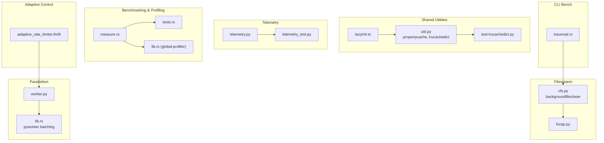

**Diagram sources**
- [lazyInit.ts:1-36](file://addons/shared/lazyInit.ts#L1-L36)
- [util.py:900-1100](file://eden/scm/sapling/util.py#L900-L1100)
- [test-lrucachedict.py:53-78](file://eden/scm/tests/test-lrucachedict.py#L53-L78)
- [telemetry.py:1-380](file://eden/fs/cli/telemetry.py#L1-L380)
- [telemetry_test.py:35-57](file://eden/fs/cli/test/telemetry_test.py#L35-L57)
- [vfs.py:640-725](file://eden/scm/sapling/vfs.py#L640-L725)
- [fscap.py:45-69](file://eden/scm/sapling/fscap.py#L45-L69)
- [worker.py:54-97](file://eden/scm/sapling/worker.py#L54-L97)
- [lib.rs:77-108](file://eden/scm/saplingnative/bindings/modules/pyworker/src/lib.rs#L77-L108)
- [measure.rs:1-50](file://eden/scm/lib/minibench/src/measure.rs#L1-L50)
- [tests.rs:1-42](file://eden/scm/lib/sampling-profiler/src/tests.rs#L1-L42)
- [lib.rs (global-profiler):1-43](file://eden/scm/lib/sampling-profiler/global-profiler/src/lib.rs#L1-L43)
- [adaptive_rate_limiter.thrift:31-62](file://configerator/structs/scm/mononoke/adaptive_rate_limiter/adaptive_rate_limiter.thrift#L31-L62)
- [traversal.rs:660-691](file://eden/fs/cli_rs/edenfs-commands/src/debug/bench/traversal.rs#L660-L691)

**Section sources**
- [lazyInit.ts:1-36](file://addons/shared/lazyInit.ts#L1-L36)
- [util.py:900-1100](file://eden/scm/sapling/util.py#L900-L1100)
- [telemetry.py:1-380](file://eden/fs/cli/telemetry.py#L1-L380)
- [vfs.py:640-725](file://eden/scm/sapling/vfs.py#L640-L725)
- [worker.py:54-97](file://eden/scm/sapling/worker.py#L54-L97)
- [measure.rs:1-50](file://eden/scm/lib/minibench/src/measure.rs#L1-L50)
- [tests.rs:1-42](file://eden/scm/lib/sampling-profiler/src/tests.rs#L1-L42)
- [lib.rs (global-profiler):1-43](file://eden/scm/lib/sampling-profiler/global-profiler/src/lib.rs#L1-L43)
- [adaptive_rate_limiter.thrift:31-62](file://configerator/structs/scm/mononoke/adaptive_rate_limiter/adaptive_rate_limiter.thrift#L31-L62)
- [traversal.rs:660-691](file://eden/fs/cli_rs/edenfs-commands/src/debug/bench/traversal.rs#L660-L691)

## Core Components
- Lazy initialization: Defer expensive async initialization until first use, ensuring idempotent single-execution behavior.
- Caching: Property cache for computed properties and LRU cache for function results and dictionaries to reduce recomputation and memory pressure.
- Background processing: Asynchronous file closing on platforms where file close is expensive, tunable via configuration.
- Telemetry: Structured telemetry with duration, success/error tagging, and environment metadata; supports local file and external process sinks.
- Parallelism: Worker orchestration with startup cost modeling and thread/process selection; native worker batching minimizes contention.
- Benchmarking and profiling: Wall-clock measurement abstractions, sampling profiler with global state, and CLI traversal benchmarks reporting throughput and resource usage.
- Adaptive rate limiting: CPU/memory thresholds and modes for probabilistic or aggressive shedding based on monitored resources.
- Filesystem capability detection: Platform-specific capabilities for symlinks, hardlinks, executable bits, and case sensitivity.

**Section sources**
- [lazyInit.ts:1-36](file://addons/shared/lazyInit.ts#L1-L36)
- [lazyInit.test.ts:1-62](file://addons/shared/__tests__/lazyInit.test.ts#L1-L62)
- [util.py:900-1100](file://eden/scm/sapling/util.py#L900-L1100)
- [test-lrucachedict.py:53-78](file://eden/scm/tests/test-lrucachedict.py#L53-L78)
- [vfs.py:640-725](file://eden/scm/sapling/vfs.py#L640-L725)
- [telemetry.py:1-380](file://eden/fs/cli/telemetry.py#L1-L380)
- [telemetry_test.py:35-57](file://eden/fs/cli/test/telemetry_test.py#L35-L57)
- [worker.py:54-97](file://eden/scm/sapling/worker.py#L54-L97)
- [lib.rs:77-108](file://eden/scm/saplingnative/bindings/modules/pyworker/src/lib.rs#L77-L108)
- [measure.rs:1-50](file://eden/scm/lib/minibench/src/measure.rs#L1-L50)
- [tests.rs:1-42](file://eden/scm/lib/sampling-profiler/src/tests.rs#L1-L42)
- [lib.rs (global-profiler):1-43](file://eden/scm/lib/sampling-profiler/global-profiler/src/lib.rs#L1-L43)
- [adaptive_rate_limiter.thrift:31-62](file://configerator/structs/scm/mononoke/adaptive_rate_limiter/adaptive_rate_limiter.thrift#L31-L62)
- [fscap.py:45-69](file://eden/scm/sapling/fscap.py#L45-L69)

## Architecture Overview
The performance architecture combines lazy initialization, caching, background processing, telemetry, and adaptive control to optimize throughput and resource usage across diverse deployment scenarios.

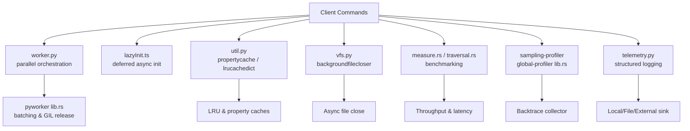

**Diagram sources**
- [worker.py:54-97](file://eden/scm/sapling/worker.py#L54-L97)
- [lib.rs:77-108](file://eden/scm/saplingnative/bindings/modules/pyworker/src/lib.rs#L77-L108)
- [lazyInit.ts:1-36](file://addons/shared/lazyInit.ts#L1-L36)
- [util.py:900-1100](file://eden/scm/sapling/util.py#L900-L1100)
- [vfs.py:640-725](file://eden/scm/sapling/vfs.py#L640-L725)
- [measure.rs:1-50](file://eden/scm/lib/minibench/src/measure.rs#L1-L50)
- [traversal.rs:660-691](file://eden/fs/cli_rs/edenfs-commands/src/debug/bench/traversal.rs#L660-L691)
- [lib.rs (global-profiler):1-43](file://eden/scm/lib/sampling-profiler/global-profiler/src/lib.rs#L1-L43)
- [telemetry.py:1-380](file://eden/fs/cli/telemetry.py#L1-L380)

## Detailed Component Analysis

### Lazy Loading Strategies
Lazy initialization ensures expensive async operations are executed only once and upon first demand, reducing cold-start overhead and avoiding redundant work.

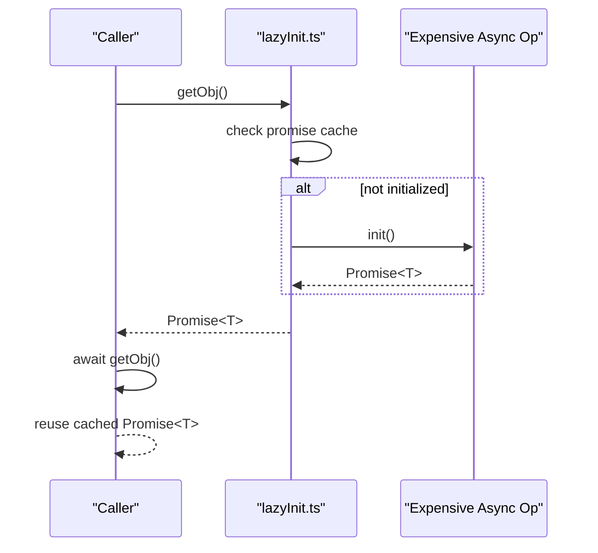

**Diagram sources**
- [lazyInit.ts:1-36](file://addons/shared/lazyInit.ts#L1-L36)

**Section sources**
- [lazyInit.ts:1-36](file://addons/shared/lazyInit.ts#L1-L36)
- [lazyInit.test.ts:1-62](file://addons/shared/__tests__/lazyInit.test.ts#L1-L62)

### Memory Management Optimizations
Two complementary caching mechanisms reduce recomputation and memory footprint:
- Property cache: Memoizes computed properties on objects.
- LRU cache: Limits memory by evicting least-recently-used entries.

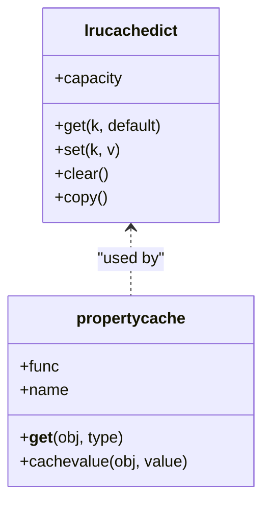

**Diagram sources**
- [util.py:900-1100](file://eden/scm/sapling/util.py#L900-L1100)

**Section sources**
- [util.py:900-1100](file://eden/scm/sapling/util.py#L900-L1100)
- [test-lrucachedict.py:53-78](file://eden/scm/tests/test-lrucachedict.py#L53-L78)

### Caching Mechanisms
- Function-level LRU caching: Wraps pure functions to cache recent results with FIFO eviction.
- Dictionary-based LRU: Maintains a doubly-linked list for O(1) insert/update/remove and ordered iteration.

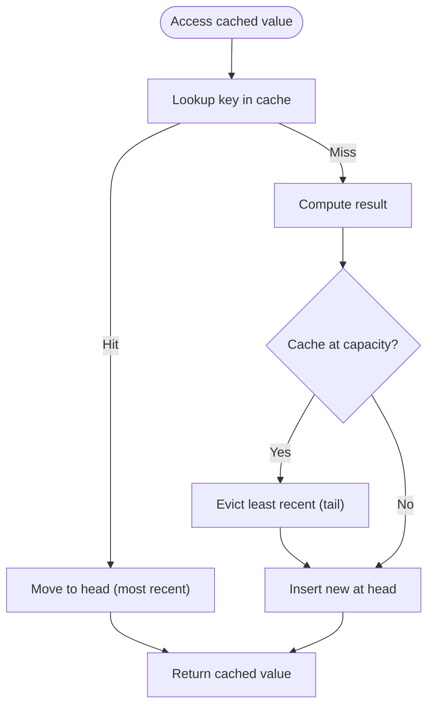

**Diagram sources**
- [util.py:900-1100](file://eden/scm/sapling/util.py#L900-L1100)

**Section sources**
- [util.py:1049-1080](file://eden/scm/sapling/util.py#L1049-L1080)
- [util.py:900-1100](file://eden/scm/sapling/util.py#L900-L1100)

### Background Processing Tuning
Asynchronous file closing reduces latency on platforms where closing files is expensive. Behavior is controlled by configuration and only activated when a minimum file count is exceeded.

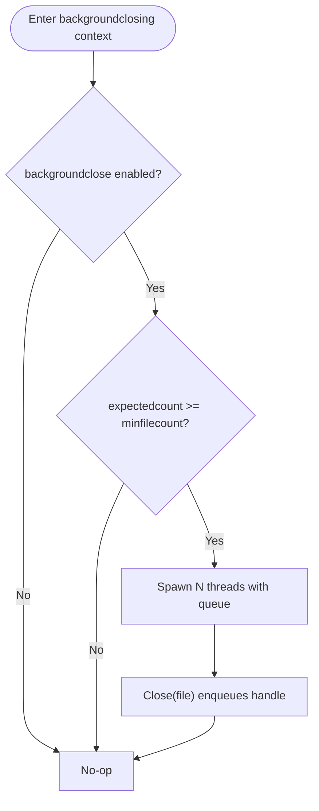

**Diagram sources**
- [vfs.py:640-725](file://eden/scm/sapling/vfs.py#L640-L725)

**Section sources**
- [vfs.py:640-725](file://eden/scm/sapling/vfs.py#L640-L725)

### Performance Monitoring and Telemetry
Structured telemetry captures durations, success/error states, and environment metadata. Samples can be logged locally, externally, or discarded.

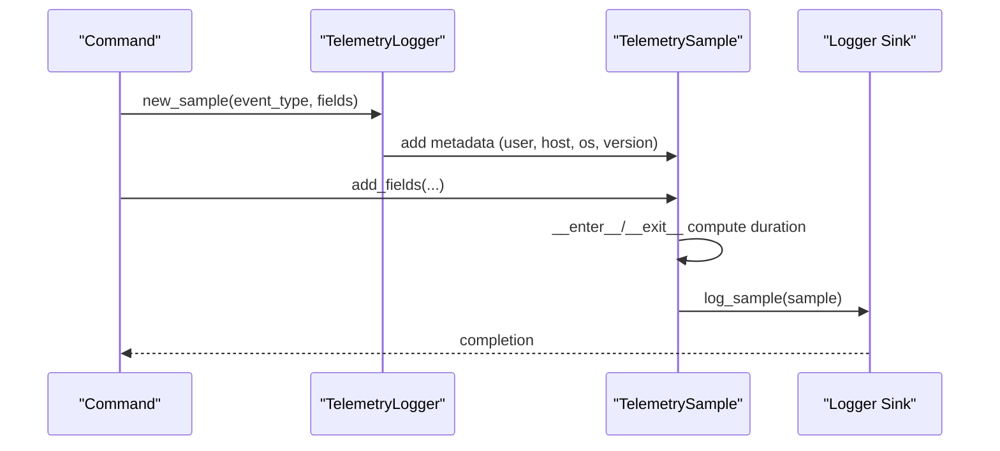

**Diagram sources**
- [telemetry.py:134-208](file://eden/fs/cli/telemetry.py#L134-L208)
- [telemetry.py:211-260](file://eden/fs/cli/telemetry.py#L211-L260)
- [telemetry_test.py:35-57](file://eden/fs/cli/test/telemetry_test.py#L35-L57)

**Section sources**
- [telemetry.py:1-380](file://eden/fs/cli/telemetry.py#L1-L380)
- [telemetry_test.py:35-57](file://eden/fs/cli/test/telemetry_test.py#L35-L57)

### Benchmarking Methodologies
Wall-clock measurement abstractions and CLI traversal benchmarks provide standardized ways to quantify performance.

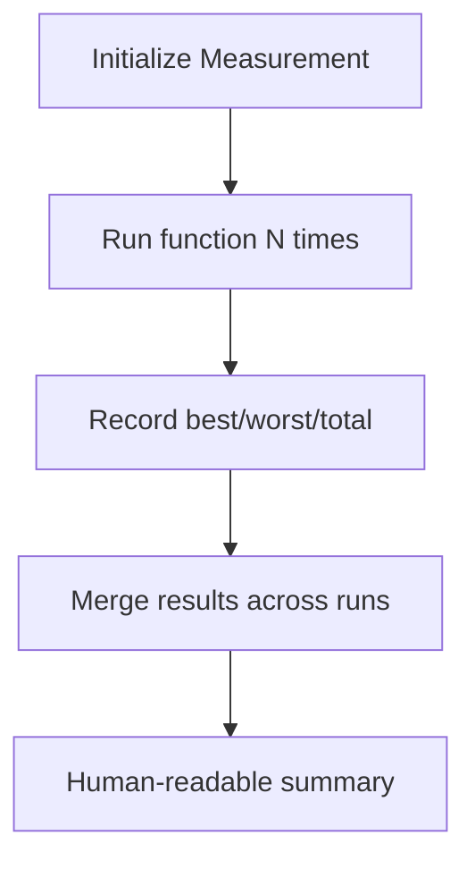

**Diagram sources**
- [measure.rs:1-50](file://eden/scm/lib/minibench/src/measure.rs#L1-L50)
- [traversal.rs:660-691](file://eden/fs/cli_rs/edenfs-commands/src/debug/bench/traversal.rs#L660-L691)

**Section sources**
- [measure.rs:1-50](file://eden/scm/lib/minibench/src/measure.rs#L1-L50)
- [traversal.rs:660-691](file://eden/fs/cli_rs/edenfs-commands/src/debug/bench/traversal.rs#L660-L691)

### Profiling Techniques
Sampling profiler maintains backtraces globally and prints summaries on teardown. Stress tests validate concurrent profilers.

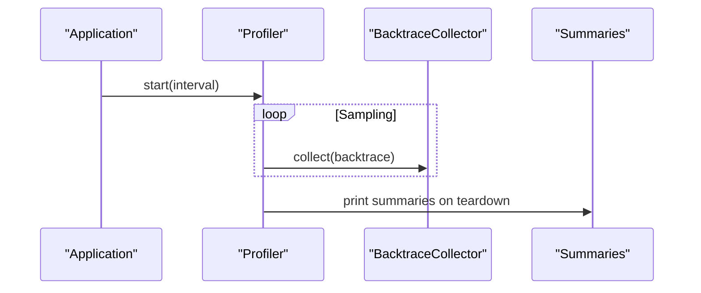

**Diagram sources**
- [lib.rs (global-profiler):1-43](file://eden/scm/lib/sampling-profiler/global-profiler/src/lib.rs#L1-L43)
- [tests.rs:1-42](file://eden/scm/lib/sampling-profiler/src/tests.rs#L1-L42)

**Section sources**
- [lib.rs (global-profiler):1-43](file://eden/scm/lib/sampling-profiler/global-profiler/src/lib.rs#L1-L43)
- [tests.rs:1-42](file://eden/scm/lib/sampling-profiler/src/tests.rs#L1-L42)

### Adaptive Rate Limiting
Resource-aware rate limiting adjusts probabilistic or aggressive shedding based on CPU and memory thresholds and monitoring mode.

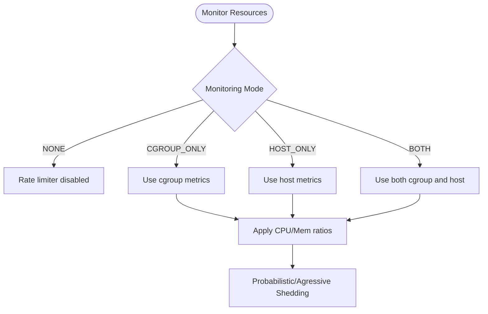

**Diagram sources**
- [adaptive_rate_limiter.thrift:31-62](file://configerator/structs/scm/mononoke/adaptive_rate_limiter/adaptive_rate_limiter.thrift#L31-L62)

**Section sources**
- [adaptive_rate_limiter.thrift:31-62](file://configerator/structs/scm/mononoke/adaptive_rate_limiter/adaptive_rate_limiter.thrift#L31-L62)

### Filesystem Performance Optimization
Detecting filesystem capabilities enables platform-specific optimizations (symlinks, hardlinks, executable bits, case sensitivity).

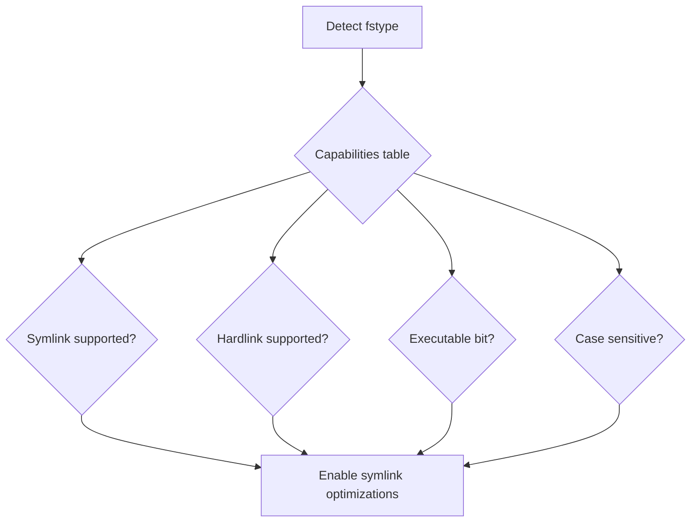

**Diagram sources**
- [fscap.py:45-69](file://eden/scm/sapling/fscap.py#L45-L69)

**Section sources**
- [fscap.py:45-69](file://eden/scm/sapling/fscap.py#L45-L69)

## Dependency Analysis
Key dependencies and coupling:
- Lazy initialization depends on Promise semantics and idempotent initialization.
- Caching relies on property and dictionary abstractions; LRU uses doubly-linked nodes.
- Background file closing couples to threading and queue primitives.
- Telemetry composes environment metadata and delegates logging to sinks.
- Worker orchestration balances startup costs against parallel benefit.
- Profiling depends on global collector state and thread-local profiler instances.

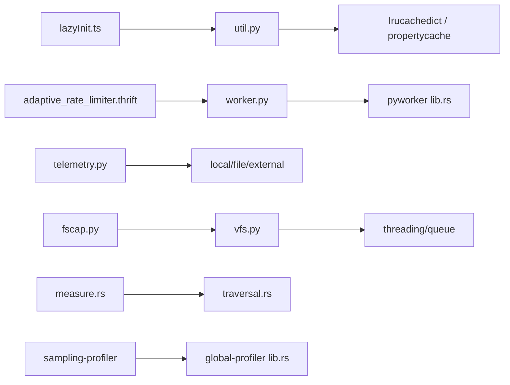

**Diagram sources**
- [lazyInit.ts:1-36](file://addons/shared/lazyInit.ts#L1-L36)
- [util.py:900-1100](file://eden/scm/sapling/util.py#L900-L1100)
- [vfs.py:640-725](file://eden/scm/sapling/vfs.py#L640-L725)
- [telemetry.py:1-380](file://eden/fs/cli/telemetry.py#L1-L380)
- [worker.py:54-97](file://eden/scm/sapling/worker.py#L54-L97)
- [lib.rs:77-108](file://eden/scm/saplingnative/bindings/modules/pyworker/src/lib.rs#L77-L108)
- [measure.rs:1-50](file://eden/scm/lib/minibench/src/measure.rs#L1-L50)
- [traversal.rs:660-691](file://eden/fs/cli_rs/edenfs-commands/src/debug/bench/traversal.rs#L660-L691)
- [lib.rs (global-profiler):1-43](file://eden/scm/lib/sampling-profiler/global-profiler/src/lib.rs#L1-L43)
- [adaptive_rate_limiter.thrift:31-62](file://configerator/structs/scm/mononoke/adaptive_rate_limiter/adaptive_rate_limiter.thrift#L31-L62)
- [fscap.py:45-69](file://eden/scm/sapling/fscap.py#L45-L69)

**Section sources**
- [lazyInit.ts:1-36](file://addons/shared/lazyInit.ts#L1-L36)
- [util.py:900-1100](file://eden/scm/sapling/util.py#L900-L1100)
- [vfs.py:640-725](file://eden/scm/sapling/vfs.py#L640-L725)
- [telemetry.py:1-380](file://eden/fs/cli/telemetry.py#L1-L380)
- [worker.py:54-97](file://eden/scm/sapling/worker.py#L54-L97)
- [lib.rs:77-108](file://eden/scm/saplingnative/bindings/modules/pyworker/src/lib.rs#L77-L108)
- [measure.rs:1-50](file://eden/scm/lib/minibench/src/measure.rs#L1-L50)
- [traversal.rs:660-691](file://eden/fs/cli_rs/edenfs-commands/src/debug/bench/traversal.rs#L660-L691)
- [lib.rs (global-profiler):1-43](file://eden/scm/lib/sampling-profiler/global-profiler/src/lib.rs#L1-L43)
- [adaptive_rate_limiter.thrift:31-62](file://configerator/structs/scm/mononoke/adaptive_rate_limiter/adaptive_rate_limiter.thrift#L31-L62)
- [fscap.py:45-69](file://eden/scm/sapling/fscap.py#L45-L69)

## Performance Considerations
- Lazy initialization reduces cold-start latency and avoids repeated initialization overhead.
- Property and LRU caches minimize recomputation and memory pressure; tune capacities based on workload characteristics.
- Background file closing improves throughput on platforms with expensive file close operations; configure queue sizes and thread counts appropriately.
- Telemetry should capture duration and error signals; ensure sinks are configured for desired environments.
- Worker orchestration balances parallelism against startup costs; prefer threads for lightweight tasks and processes for CPU-bound workloads.
- Benchmarking and profiling provide quantitative insights; use wall-clock measurements and sampling backtraces to identify bottlenecks.
- Adaptive rate limiting protects system resources under load; select monitoring mode and thresholds aligned with deployment constraints.
- Filesystem capability detection enables platform-specific optimizations; validate symlink/hardlink/executable behavior and case sensitivity.

[No sources needed since this section provides general guidance]

## Troubleshooting Guide
- Telemetry failures: Verify sink configuration and permissions; fallback to local file logging for debugging.
- Background file closing anomalies: Check configuration thresholds and queue sizes; confirm main-thread usage and proper context manager lifecycle.
- Worker overhead: Ensure startup cost modeling aligns with workload; prefer threads for small tasks and processes for heavy computation.
- Profiling stability: Validate sampling intervals and global collector state; run stress tests to detect concurrency issues.
- Adaptive rate limiting: Confirm monitoring mode and thresholds; ensure resource metrics are available and accurate.

**Section sources**
- [telemetry.py:271-312](file://eden/fs/cli/telemetry.py#L271-L312)
- [vfs.py:640-725](file://eden/scm/sapling/vfs.py#L640-L725)
- [worker.py:54-97](file://eden/scm/sapling/worker.py#L54-L97)
- [tests.rs:1-42](file://eden/scm/lib/sampling-profiler/src/tests.rs#L1-L42)
- [adaptive_rate_limiter.thrift:31-62](file://configerator/structs/scm/mononoke/adaptive_rate_limiter/adaptive_rate_limiter.thrift#L31-L62)

## Conclusion
SAPLING SCM employs a layered performance strategy: lazy initialization, targeted caching, background processing, robust telemetry, adaptive rate limiting, and platform-aware filesystem optimizations. Combined with benchmarking and profiling, these techniques enable efficient resource utilization, predictable latency, and scalable operation across varied deployment scenarios.

[No sources needed since this section summarizes without analyzing specific files]

## Appendices

### Configuration Options for Deployment Scenarios
- Background file closing
  - Enable/disable: worker.backgroundclose
  - Minimum file count threshold: worker.backgroundcloseminfilecount
  - Queue size: worker.backgroundclosemaxqueue
  - Thread count: worker.backgroundclosethreadcount
- Worker orchestration
  - Enable/disable: worker.enabled
  - Callsite-specific enablement: worker._enabledcallsites
- Adaptive rate limiting
  - Operation mode: DISABLED/DRY_RUN/ENABLED
  - Monitoring mode: NONE/CGROUP_ONLY/HOST_ONLY/BOTH
  - CPU and memory soft/hard limits
  - Load update period

**Section sources**
- [vfs.py:640-725](file://eden/scm/sapling/vfs.py#L640-L725)
- [worker.py:54-97](file://eden/scm/sapling/worker.py#L54-L97)
- [adaptive_rate_limiter.thrift:31-62](file://configerator/structs/scm/mononoke/adaptive_rate_limiter/adaptive_rate_limiter.thrift#L31-L62)

### Capacity Planning and Scaling Guidelines
- Use property and LRU caches to bound memory growth; size caches based on observed access patterns.
- Tune background file closing parameters for high-throughput write workloads.
- Employ adaptive rate limiting to protect systems under load; monitor CPU and memory saturation.
- Leverage worker orchestration to balance parallelism with startup overhead; prefer threads for I/O-bound tasks.
- Collect telemetry and benchmark results to track trends and regressions; use CLI traversal benchmarks for filesystem-heavy operations.

**Section sources**
- [util.py:900-1100](file://eden/scm/sapling/util.py#L900-L1100)
- [vfs.py:640-725](file://eden/scm/sapling/vfs.py#L640-L725)
- [adaptive_rate_limiter.thrift:31-62](file://configerator/structs/scm/mononoke/adaptive_rate_limiter/adaptive_rate_limiter.thrift#L31-L62)
- [traversal.rs:660-691](file://eden/fs/cli_rs/edenfs-commands/src/debug/bench/traversal.rs#L660-L691)

### Practical Examples and Impact Measurement
- Lazy initialization: Reduce cold-start latency by deferring expensive async initialization until first use; validated by tests ensuring single execution.
- Background file closing: Improve throughput on platforms with slow file close; configure queue and thread counts to match workload scale.
- Telemetry: Capture duration and error signals; use structured fields to segment by environment and operation type.
- Benchmarking: Use wall-clock measurement abstractions to compare pre/post changes; report files/sec and throughput metrics.
- Profiling: Collect sampling backtraces to identify hot paths; validate stability under concurrent usage.

**Section sources**
- [lazyInit.test.ts:1-62](file://addons/shared/__tests__/lazyInit.test.ts#L1-L62)
- [vfs.py:640-725](file://eden/scm/sapling/vfs.py#L640-L725)
- [telemetry.py:1-380](file://eden/fs/cli/telemetry.py#L1-L380)
- [measure.rs:1-50](file://eden/scm/lib/minibench/src/measure.rs#L1-L50)
- [tests.rs:1-42](file://eden/scm/lib/sampling-profiler/src/tests.rs#L1-L42)