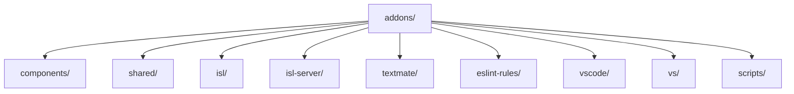
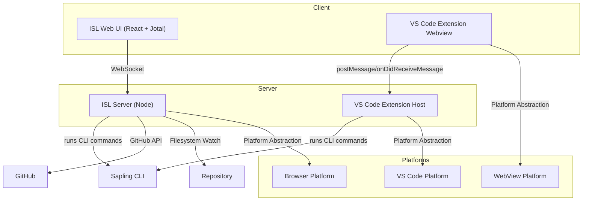
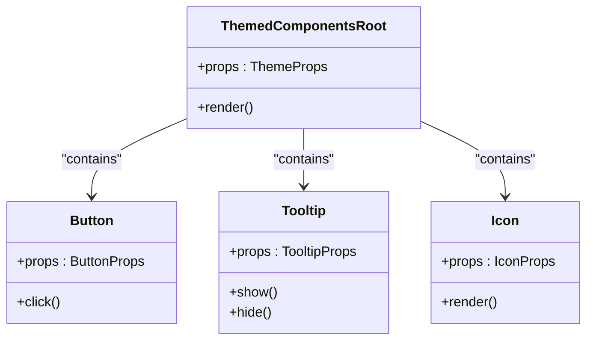
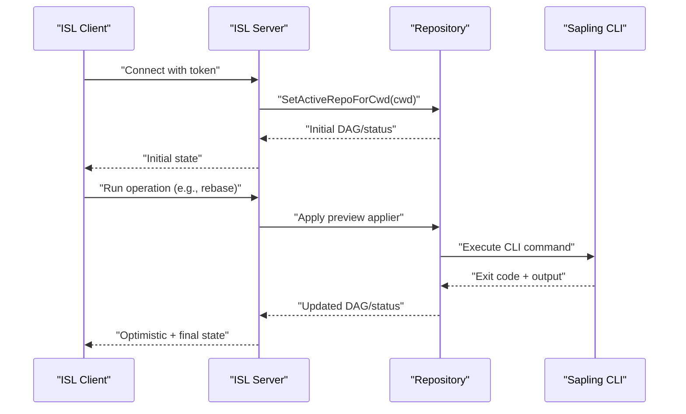
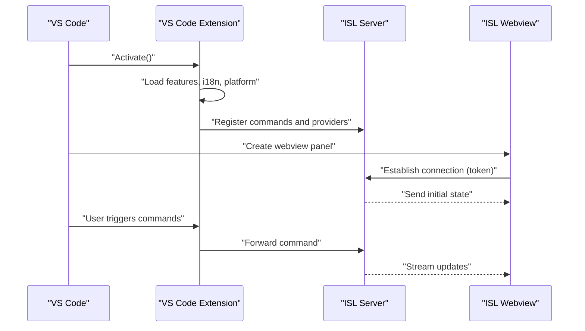
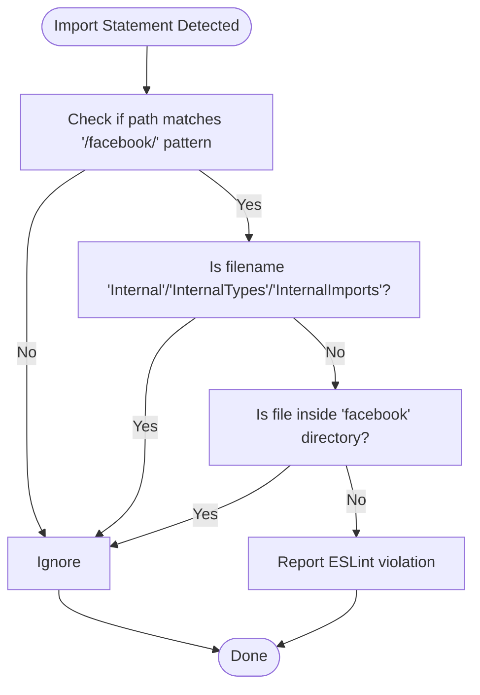
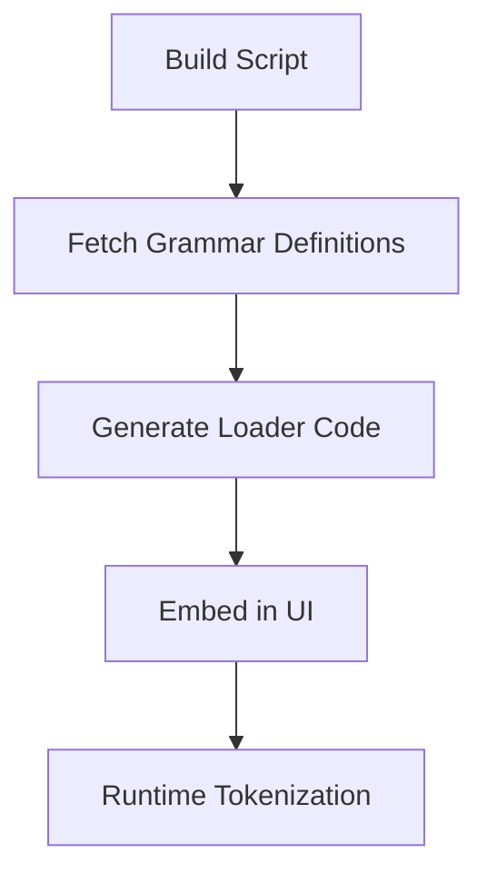
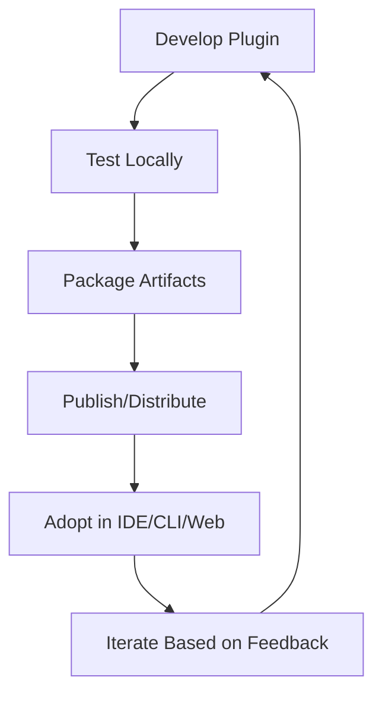
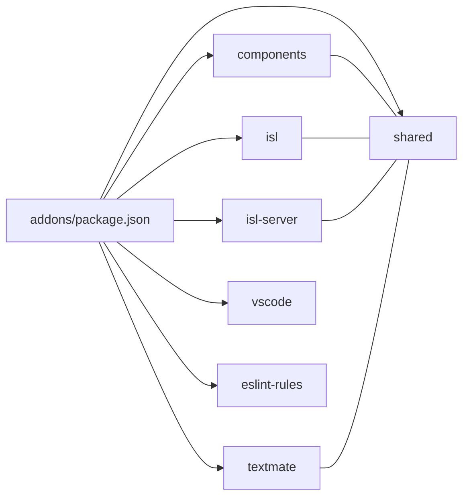

# Plugin Development and Extensions

<cite>
**Referenced Files in This Document**
- [README.md](file://README.md)
- [addons/package.json](file://addons/package.json)
- [addons/components/README.md](file://addons/components/README.md)
- [addons/components/package.json](file://addons/components/package.json)
- [addons/isl/README.md](file://addons/isl/README.md)
- [addons/isl-server/src/index.ts](file://addons/isl-server/src/index.ts)
- [addons/isl-server/platform/webviewServerPlatform.ts](file://addons/isl-server/platform/webviewServerPlatform.ts)
- [addons/shared/package.json](file://addons/shared/package.json)
- [addons/textmate/README.md](file://addons/textmate/README.md)
- [addons/textmate/package.json](file://addons/textmate/package.json)
- [addons/eslint-rules/no-facebook-imports.js](file://addons/eslint-rules/no-facebook-imports.js)
- [addons/vscode/README.md](file://addons/vscode/README.md)
- [addons/vscode/package.json](file://addons/vscode/package.json)
- [addons/vscode/extension/extension.ts](file://addons/vscode/extension/extension.ts)
- [addons/vs/README.md](file://addons/vs/README.md)
</cite>

## Table of Contents
1. [Introduction](#introduction)
2. [Project Structure](#project-structure)
3. [Core Components](#core-components)
4. [Architecture Overview](#architecture-overview)
5. [Detailed Component Analysis](#detailed-component-analysis)
6. [Dependency Analysis](#dependency-analysis)
7. [Performance Considerations](#performance-considerations)
8. [Troubleshooting Guide](#troubleshooting-guide)
9. [Conclusion](#conclusion)
10. [Appendices](#appendices)

## Introduction
This document explains how to develop plugins and extensions for SAPLING SCM across CLI, web, and IDE integrations. It covers the plugin architecture, extension points, development frameworks, and reusable libraries. You will learn how to create custom commands, UI components, server-side extensions, and TextMate grammar integrations. Step-by-step tutorials are provided for building VS Code and Visual Studio extensions, and guidance for creating custom web components. The document also outlines plugin lifecycle, testing strategies, distribution mechanisms, and examples of existing plugins and their implementation patterns.

## Project Structure
The SAPLING SCM ecosystem organizes plugin-related code primarily under the addons/ directory. It includes:
- Shared component library for UI
- Interactive Smartlog (ISL) web UI and server
- ESLint rule development framework
- TextMate grammar integration utilities
- VS Code and Visual Studio extensions
- Scripts and tooling for development and verification

**Diagram sources**
- [addons/package.json:1-38](file://addons/package.json#L1-L38)

**Section sources**
- [README.md:10-16](file://README.md#L10-L16)
- [addons/package.json:1-38](file://addons/package.json#L1-L38)

## Core Components
This section highlights the primary building blocks for plugin development.

- Shared component library
  - Purpose: A React-based UI component library used by ISL and other integrations.
  - Features: Light/dark themes, accessibility-focused components, and a component explorer for development.
  - Usage: Referenced directly within the monorepo; not published to npm.
  - See [addons/components/README.md:1-55](file://addons/components/README.md#L1-L55) and [addons/components/package.json:1-31](file://addons/components/package.json#L1-L31).

- Shared utilities
  - Purpose: Cross-cutting utilities for diffing, tokenization, event emitters, debouncing, and more.
  - See [addons/shared/package.json:1-32](file://addons/shared/package.json#L1-L32).

- ESLint rule development
  - Purpose: Enforce import policies and code quality across the monorepo.
  - Example: A rule disallowing Facebook-only imports in non-Facebook files.
  - See [addons/eslint-rules/no-facebook-imports.js:1-64](file://addons/eslint-rules/no-facebook-imports.js#L1-L64).

- TextMate grammar integration
  - Purpose: Fetch and generate TextMate grammars at build time for syntax highlighting.
  - See [addons/textmate/README.md:1-5](file://addons/textmate/README.md#L1-L5) and [addons/textmate/package.json:1-18](file://addons/textmate/package.json#L1-L18).

- ISL web UI and server
  - Purpose: An embeddable React/Jotai UI with a Node server that communicates with the CLI and GitHub.
  - See [addons/isl/README.md:1-383](file://addons/isl/README.md#L1-L383).

- VS Code extension
  - Purpose: Integrates ISL as a webview, exposes commands, views, and keybindings.
  - See [addons/vscode/README.md:1-16](file://addons/vscode/README.md#L1-L16) and [addons/vscode/package.json:1-342](file://addons/vscode/package.json#L1-L342).

- Visual Studio extension
  - Purpose: Provides an Interactive Smartlog view within Visual Studio.
  - See [addons/vs/README.md:1-16](file://addons/vs/README.md#L1-L16).

**Section sources**
- [addons/components/README.md:1-55](file://addons/components/README.md#L1-L55)
- [addons/components/package.json:1-31](file://addons/components/package.json#L1-L31)
- [addons/shared/package.json:1-32](file://addons/shared/package.json#L1-L32)
- [addons/textmate/README.md:1-5](file://addons/textmate/README.md#L1-L5)
- [addons/textmate/package.json:1-18](file://addons/textmate/package.json#L1-L18)
- [addons/eslint-rules/no-facebook-imports.js:1-64](file://addons/eslint-rules/no-facebook-imports.js#L1-L64)
- [addons/isl/README.md:1-383](file://addons/isl/README.md#L1-L383)
- [addons/vscode/README.md:1-16](file://addons/vscode/README.md#L1-L16)
- [addons/vscode/package.json:1-342](file://addons/vscode/package.json#L1-L342)
- [addons/vs/README.md:1-16](file://addons/vs/README.md#L1-L16)

## Architecture Overview
SAPLING SCM’s plugin architecture centers on an embeddable Client/Server model with IDE-specific platforms.

Key extension points:
- Client-side: React components and webview panels.
- Server-side: WebSocket message handling, repository operations, and platform abstractions.
- Platform abstraction: Encapsulates embedding-specific behaviors (open file, logging, etc.).

**Diagram sources**
- [addons/isl/README.md:143-250](file://addons/isl/README.md#L143-L250)
- [addons/isl-server/src/index.ts:20-83](file://addons/isl-server/src/index.ts#L20-L83)
- [addons/isl-server/platform/webviewServerPlatform.ts:12-16](file://addons/isl-server/platform/webviewServerPlatform.ts#L12-L16)
- [addons/vscode/extension/extension.ts:31-109](file://addons/vscode/extension/extension.ts#L31-L109)

**Section sources**
- [addons/isl/README.md:143-250](file://addons/isl/README.md#L143-L250)
- [addons/isl-server/src/index.ts:20-83](file://addons/isl-server/src/index.ts#L20-L83)
- [addons/isl-server/platform/webviewServerPlatform.ts:12-16](file://addons/isl-server/platform/webviewServerPlatform.ts#L12-L16)
- [addons/vscode/extension/extension.ts:31-109](file://addons/vscode/extension/extension.ts#L31-L109)

## Detailed Component Analysis

### Shared Component Library
The component library provides reusable UI primitives for React-based integrations. It emphasizes theme-awareness, accessibility, and a compact API tailored for React usage.

Usage guidelines:
- Use ThemedComponentsRoot at the application root to provide theme variables.
- Prefer components that align with React patterns and avoid shadow DOM.
- Explore components via the component explorer during development.

**Diagram sources**
- [addons/components/README.md:25-55](file://addons/components/README.md#L25-L55)

**Section sources**
- [addons/components/README.md:1-55](file://addons/components/README.md#L1-L55)
- [addons/components/package.json:1-31](file://addons/components/package.json#L1-L31)

### ISL Server and Client Lifecycle
The ISL server manages client connections, tracks operations, and synchronizes repository state. Clients send commands; the server executes CLI operations and streams updates.

Operational highlights:
- Preview appliers enable optimistic UI updates.
- Queued commands stack preview appliers for predictable outcomes.
- Repository caching and reuse support multiple clients and cwds.

**Diagram sources**
- [addons/isl/README.md:265-318](file://addons/isl/README.md#L265-L318)
- [addons/isl-server/src/index.ts:60-83](file://addons/isl-server/src/index.ts#L60-L83)

**Section sources**
- [addons/isl/README.md:265-318](file://addons/isl/README.md#L265-L318)
- [addons/isl-server/src/index.ts:60-83](file://addons/isl-server/src/index.ts#L60-L83)

### VS Code Extension Integration
The VS Code extension activates, registers commands, views, and providers, and hosts the ISL webview.

Key extension points:
- Activation events and contributions (views, commands, menus, keybindings).
- Platform-specific behavior via VS Code platform abstraction.
- Optional internal providers and URI handlers.

**Diagram sources**
- [addons/vscode/package.json:14-306](file://addons/vscode/package.json#L14-L306)
- [addons/vscode/extension/extension.ts:31-109](file://addons/vscode/extension/extension.ts#L31-L109)

**Section sources**
- [addons/vscode/README.md:1-16](file://addons/vscode/README.md#L1-L16)
- [addons/vscode/package.json:14-306](file://addons/vscode/package.json#L14-L306)
- [addons/vscode/extension/extension.ts:31-109](file://addons/vscode/extension/extension.ts#L31-L109)

### ESLint Rule Development
Custom ESLint rules enforce organizational standards and prevent accidental imports from restricted namespaces.

**Diagram sources**
- [addons/eslint-rules/no-facebook-imports.js:23-62](file://addons/eslint-rules/no-facebook-imports.js#L23-L62)

**Section sources**
- [addons/eslint-rules/no-facebook-imports.js:1-64](file://addons/eslint-rules/no-facebook-imports.js#L1-L64)

### TextMate Grammar Extensions
The TextMate integration fetches grammars at build time and generates loaders for syntax highlighting in code review UIs.

**Diagram sources**
- [addons/textmate/README.md:1-5](file://addons/textmate/README.md#L1-L5)

**Section sources**
- [addons/textmate/README.md:1-5](file://addons/textmate/README.md#L1-L5)
- [addons/textmate/package.json:1-18](file://addons/textmate/package.json#L1-L18)

### Conceptual Overview
The following conceptual diagram illustrates the plugin lifecycle from activation to distribution.

[No sources needed since this diagram shows conceptual workflow, not actual code structure]

## Dependency Analysis
The addons workspace coordinates multiple packages with shared tooling and scripts.

**Diagram sources**
- [addons/package.json:3-10](file://addons/package.json#L3-L10)

**Section sources**
- [addons/package.json:1-38](file://addons/package.json#L1-L38)

## Performance Considerations
- Bundle size and dependency analysis
  - Use client-side bundle visualizer for the ISL web UI and server-side rollup plugin for the server.
  - Reference: [addons/isl/README.md:368-382](file://addons/isl/README.md#L368-L382).
- Hot reloading and incremental builds
  - Development mode leverages Vite and Rollup watchers for rapid iteration.
  - Reference: [addons/isl/README.md:17-37](file://addons/isl/README.md#L17-L37).
- Optimistic UI and preview appliers
  - Minimize perceived latency by applying preview appliers immediately and streaming final updates.
  - Reference: [addons/isl/README.md:275-300](file://addons/isl/README.md#L275-L300).

[No sources needed since this section provides general guidance]

## Troubleshooting Guide
- Attaching the ISL server to the VS Code debugger
  - Use the provided debug task to launch the server with additional arguments for easier debugging.
  - Reference: [addons/isl/README.md:328-333](file://addons/isl/README.md#L328-L333).
- Client-side debugging
  - Use Chrome DevTools or “Debug: Open Link” to attach to the browser instance hosting ISL.
  - Reference: [addons/isl/README.md:334-343](file://addons/isl/README.md#L334-L343).
- Stack trace deobfuscation
  - Use source maps to recover readable stack traces in production.
  - Reference: [addons/isl/README.md:344-367](file://addons/isl/README.md#L344-L367).
- VS Code extension activation failures
  - Inspect the extension output channel for logs and verify activation events and platform initialization.
  - Reference: [addons/vscode/extension/extension.ts:111-133](file://addons/vscode/extension/extension.ts#L111-L133).

**Section sources**
- [addons/isl/README.md:328-367](file://addons/isl/README.md#L328-L367)
- [addons/vscode/extension/extension.ts:111-133](file://addons/vscode/extension/extension.ts#L111-L133)

## Conclusion
SAPLING SCM provides a robust foundation for building plugins and extensions across CLI, web, and IDE environments. The embeddable Client/Server architecture, shared component library, and platform abstractions enable consistent and maintainable integrations. By following the development workflows, testing strategies, and distribution mechanisms outlined here, you can extend SAPLING SCM with custom commands, UI components, server-side capabilities, and grammar support.

[No sources needed since this section summarizes without analyzing specific files]

## Appendices

### Step-by-Step Tutorial: Building a VS Code Extension
- Prerequisites
  - Install dependencies and build artifacts as described in the ISL development guide.
  - References: [addons/isl/README.md:17-37](file://addons/isl/README.md#L17-L37), [addons/vscode/README.md:1-16](file://addons/vscode/README.md#L1-L16).
- Develop and register commands
  - Add commands in package.json contributions and implement handlers in the extension entrypoint.
  - References: [addons/vscode/package.json:140-306](file://addons/vscode/package.json#L140-L306), [addons/vscode/extension/extension.ts:31-109](file://addons/vscode/extension/extension.ts#L31-L109).
- Host the ISL webview
  - Create a webview panel and establish a secure connection using tokens.
  - References: [addons/vscode/package.json:14-37](file://addons/vscode/package.json#L14-L37), [addons/isl-server/platform/webviewServerPlatform.ts:12-16](file://addons/isl-server/platform/webviewServerPlatform.ts#L12-L16).
- Testing and distribution
  - Use Jest for unit tests and publish via the marketplace tooling.
  - References: [addons/vscode/package.json:307-319](file://addons/vscode/package.json#L307-L319).

**Section sources**
- [addons/isl/README.md:17-37](file://addons/isl/README.md#L17-L37)
- [addons/vscode/README.md:1-16](file://addons/vscode/README.md#L1-L16)
- [addons/vscode/package.json:14-37](file://addons/vscode/package.json#L14-L37)
- [addons/vscode/package.json:140-306](file://addons/vscode/package.json#L140-L306)
- [addons/vscode/package.json:307-319](file://addons/vscode/package.json#L307-L319)
- [addons/vscode/extension/extension.ts:31-109](file://addons/vscode/extension/extension.ts#L31-L109)
- [addons/isl-server/platform/webviewServerPlatform.ts:12-16](file://addons/isl-server/platform/webviewServerPlatform.ts#L12-L16)

### Step-by-Step Tutorial: Building a Visual Studio Extension
- Prerequisites
  - Follow the Visual Studio extension documentation and ensure the SAPLING SCM CLI is installed.
  - Reference: [addons/vs/README.md:1-16](file://addons/vs/README.md#L1-L16).
- Integrate Interactive Smartlog
  - Provide a view container and menu entries to open the ISL UI.
  - Reference: [addons/vs/README.md:5-12](file://addons/vs/README.md#L5-L12).

**Section sources**
- [addons/vs/README.md:1-16](file://addons/vs/README.md#L1-L16)
- [addons/vs/README.md:5-12](file://addons/vs/README.md#L5-L12)

### Step-by-Step Tutorial: Creating Custom Web Components
- Use the shared component library to build reusable UI elements.
- Reference: [addons/components/README.md:1-55](file://addons/components/README.md#L1-L55).
- For theming and styles, leverage StyleX and the themed root component.
- Reference: [addons/components/README.md:51-55](file://addons/components/README.md#L51-L55).

**Section sources**
- [addons/components/README.md:1-55](file://addons/components/README.md#L1-L55)
- [addons/components/README.md:51-55](file://addons/components/README.md#L51-L55)

### Step-by-Step Tutorial: Developing ESLint Rules
- Create a rule module exporting meta and create functions.
- Reference: [addons/eslint-rules/no-facebook-imports.js:1-64](file://addons/eslint-rules/no-facebook-imports.js#L1-L64).
- Configure ESLint to use the rule via the project’s lint configuration.

**Section sources**
- [addons/eslint-rules/no-facebook-imports.js:1-64](file://addons/eslint-rules/no-facebook-imports.js#L1-L64)

### Step-by-Step Tutorial: Extending TextMate Grammars
- Fetch grammar definitions at build time and generate loader code.
- Reference: [addons/textmate/README.md:1-5](file://addons/textmate/README.md#L1-L5).
- Integrate the generated loader into the code review UI.

**Section sources**
- [addons/textmate/README.md:1-5](file://addons/textmate/README.md#L1-L5)

### Plugin Lifecycle, Testing, and Distribution
- Lifecycle
  - Activate, initialize platform, register commands/providers, and handle client connections.
  - References: [addons/vscode/extension/extension.ts:31-109](file://addons/vscode/extension/extension.ts#L31-L109), [addons/isl-server/src/index.ts:60-83](file://addons/isl-server/src/index.ts#L60-L83).
- Testing
  - Use Jest for unit tests and React Testing Library for UI tests.
  - References: [addons/isl/README.md:96-104](file://addons/isl/README.md#L96-L104), [addons/components/package.json:25-29](file://addons/components/package.json#L25-L29).
- Distribution
  - Build production bundles and publish to the marketplace or ship with the CLI.
  - References: [addons/isl/README.md:67-77](file://addons/isl/README.md#L67-L77), [addons/vscode/package.json:314-315](file://addons/vscode/package.json#L314-L315).

**Section sources**
- [addons/vscode/extension/extension.ts:31-109](file://addons/vscode/extension/extension.ts#L31-L109)
- [addons/isl-server/src/index.ts:60-83](file://addons/isl-server/src/index.ts#L60-L83)
- [addons/isl/README.md:67-77](file://addons/isl/README.md#L67-L77)
- [addons/isl/README.md:96-104](file://addons/isl/README.md#L96-L104)
- [addons/components/package.json:25-29](file://addons/components/package.json#L25-L29)
- [addons/vscode/package.json:314-315](file://addons/vscode/package.json#L314-L315)