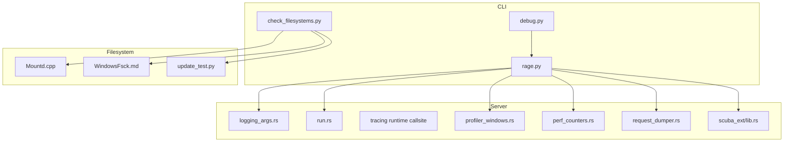
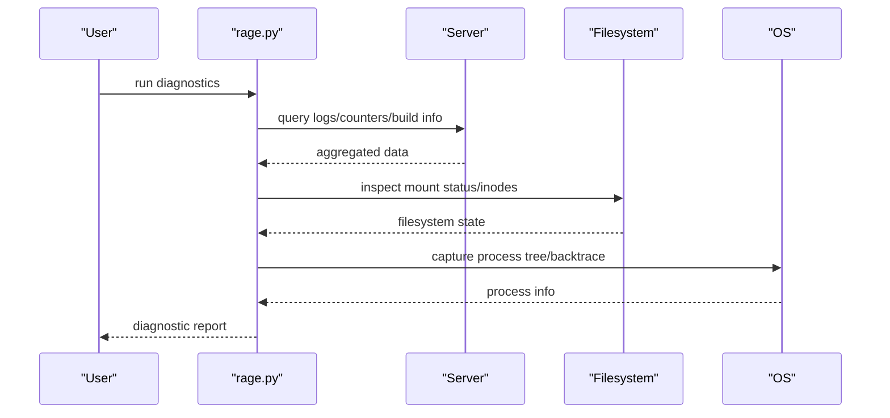
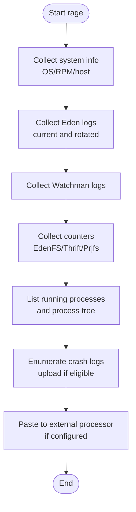
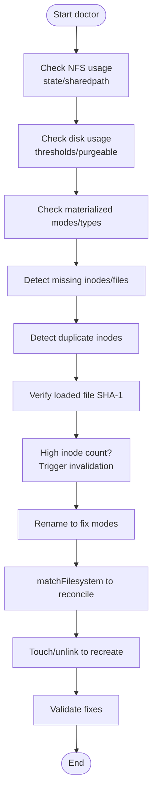
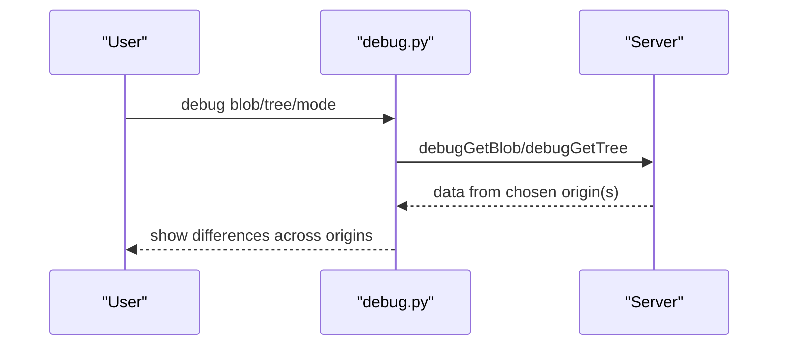
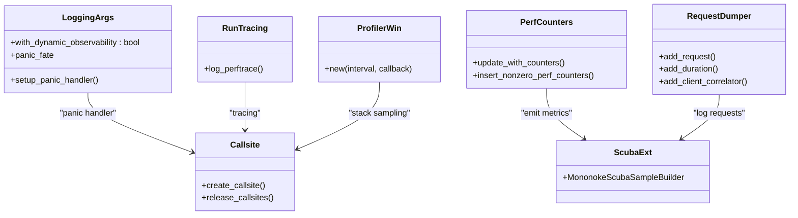
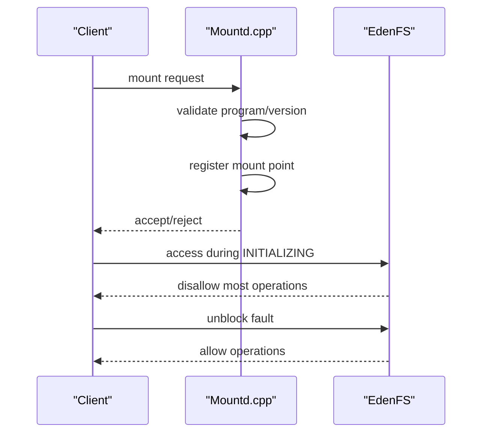
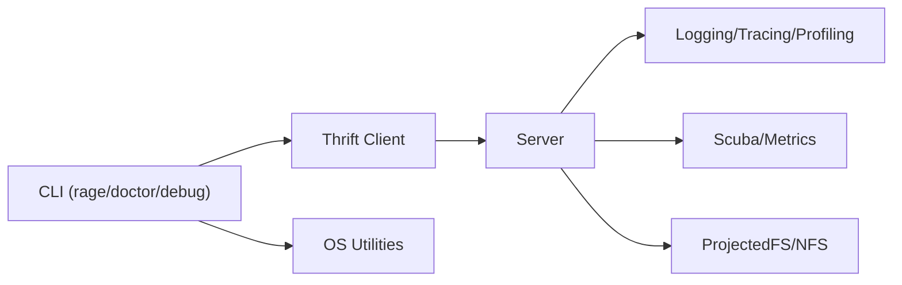

# Troubleshooting and Debugging

<cite>
**Referenced Files in This Document**
- [debug.py](file://eden/fs/cli/debug.py)
- [rage.py](file://eden/fs/cli/rage.py)
- [check_filesystems.py](file://eden/fs/cli/doctor/check_filesystems.py)
- [Mountd.cpp](file://eden/fs/nfs/Mountd.cpp)
- [mount_test.py](file://eden/integration/mount_test.py)
- [update_test.py](file://eden/integration/hg/update_test.py)
- [WindowsFsck.md](file://eden/fs/docs/WindowsFsck.md)
- [errors.rs](file://eden/scm/lib/indexedlog/src/errors.rs)
- [logging_args.rs](file://eden/mononoke/cmdlib/logging/logging_args.rs)
- [profiler_windows.rs](file://eden/scm/lib/sampling-profiler/src/profiler_windows.rs)
- [lib.rs (tracing runtime callsite)](file://eden/scm/lib/tracing-runtime-callsite/src/lib.rs)
- [run.rs (command perf tracing)](file://eden/scm/lib/commands/src/run.rs)
- [cmddebugargs/src/lib.rs](file://eden/scm/lib/commands/debugcommands/cmddebugargs/src/lib.rs)
- [cmddebugmetrics/src/lib.rs](file://eden/scm/lib/commands/debugcommands/cmddebugmetrics/src/lib.rs)
- [blackbox/event.rs](file://eden/scm/lib/blackbox/src/event.rs)
- [perf_counters.rs](file://eden/mononoke/servers/slapi/slapi_server/context/src/perf_counters.rs)
- [request_dumper.rs](file://eden/mononoke/servers/slapi/slapi_service/src/middleware/request_dumper.rs)
- [scuba_ext/lib.rs](file://eden/mononoke/common/scuba_ext/src/lib.rs)
- [memory_profiling/handler.rs](file://eden/mononoke/common/memory_profiling/src/handler.rs)
- [help.py](file://eden/scm/sapling/help.py)
- [subcmd.py](file://eden/fs/cli/subcmd.py)
</cite>

## Table of Contents
1. [Introduction](#introduction)
2. [Project Structure](#project-structure)
3. [Core Components](#core-components)
4. [Architecture Overview](#architecture-overview)
5. [Detailed Component Analysis](#detailed-component-analysis)
6. [Dependency Analysis](#dependency-analysis)
7. [Performance Considerations](#performance-considerations)
8. [Troubleshooting Guide](#troubleshooting-guide)
9. [Conclusion](#conclusion)
10. [Appendices](#appendices)

## Introduction
This document provides comprehensive troubleshooting and debugging guidance for SAPLING SCM across CLI, server, and filesystem components. It covers diagnosing mount failures, slow operations, repository integrity issues, and virtual filesystem (VFS) problems. It also documents logging configuration, error analysis, diagnostic command usage, debugging tools, crash analysis, and runtime inspection techniques. Step-by-step troubleshooting guides are included for typical scenarios such as mount initialization failures, performance degradation, and integration issues with ProjectedFS and NFS.

## Project Structure
The troubleshooting surface spans several subsystems:
- CLI diagnostics: rage, doctor, debug commands
- Server-side observability: logging configuration, metrics, profiling
- Filesystem integration: ProjectedFS (Windows), NFS mount handling
- Repository integrity: indexedlog error classification and fsck-related logic
- Platform-specific diagnostics: Windows crash tracing and sampling profiler

**Diagram sources**
- [debug.py](file://eden/fs/cli/debug.py)
- [rage.py](file://eden/fs/cli/rage.py)
- [check_filesystems.py](file://eden/fs/cli/doctor/check_filesystems.py)
- [logging_args.rs](file://eden/mononoke/cmdlib/logging/logging_args.rs)
- [run.rs](file://eden/scm/lib/commands/src/run.rs)
- [lib.rs (tracing runtime callsite)](file://eden/scm/lib/tracing-runtime-callsite/src/lib.rs)
- [profiler_windows.rs](file://eden/scm/lib/sampling-profiler/src/profiler_windows.rs)
- [perf_counters.rs](file://eden/mononoke/servers/slapi/slapi_server/context/src/perf_counters.rs)
- [request_dumper.rs](file://eden/mononoke/servers/slapi/slapi_service/src/middleware/request_dumper.rs)
- [scuba_ext/lib.rs](file://eden/mononoke/common/scuba_ext/src/lib.rs)
- [Mountd.cpp](file://eden/fs/nfs/Mountd.cpp)
- [WindowsFsck.md](file://eden/fs/docs/WindowsFsck.md)
- [update_test.py](file://eden/integration/hg/update_test.py)

**Section sources**
- [debug.py](file://eden/fs/cli/debug.py)
- [rage.py](file://eden/fs/cli/rage.py)
- [check_filesystems.py](file://eden/fs/cli/doctor/check_filesystems.py)
- [Mountd.cpp](file://eden/fs/nfs/Mountd.cpp)
- [logging_args.rs](file://eden/mononoke/cmdlib/logging/logging_args.rs)
- [profiler_windows.rs](file://eden/scm/lib/sampling-profiler/src/profiler_windows.rs)
- [run.rs](file://eden/scm/lib/commands/src/run.rs)
- [WindowsFsck.md](file://eden/fs/docs/WindowsFsck.md)
- [update_test.py](file://eden/integration/hg/update_test.py)

## Core Components
- CLI diagnostics and doctor:
  - rage: collects system info, logs, counters, and process traces; supports dry-run and external paste processors.
  - doctor: filesystem checks for mismatches, missing inodes/files, inode accessibility, and high inode counts; includes fixes for Windows/Darwin inode pressure.
  - debug: introspection commands for blobs/trees, process fetch counts, and local cache clearing; supports recording activities.
- Server observability:
  - logging_args: panic fate configuration and structured logging setup.
  - run.rs: command-level performance tracing and profiling summaries.
  - tracing runtime callsite: dynamic tracing callsite lifecycle.
  - perf_counters: server-side performance counters aggregation.
  - request_dumper: request/response logging with sampling and correlation.
  - scuba_ext: MononokeScubaSampleBuilder for observability sinks.
  - memory_profiling: ACL-checked flamegraph generation and jemalloc profiling checks.
- Filesystem integration:
  - Mountd.cpp: NFS mountd protocol handling and logging.
  - WindowsFsck.md: Windows-specific VFS correctness and rename/read behavior.
  - update_test.py: ProjectedFS read tearing scenario testing.
- Repository integrity:
  - indexedlog errors.rs: categorization of corruption vs. I/O errors.

**Section sources**
- [rage.py](file://eden/fs/cli/rage.py)
- [check_filesystems.py](file://eden/fs/cli/doctor/check_filesystems.py)
- [debug.py](file://eden/fs/cli/debug.py)
- [logging_args.rs](file://eden/mononoke/cmdlib/logging/logging_args.rs)
- [run.rs](file://eden/scm/lib/commands/src/run.rs)
- [lib.rs (tracing runtime callsite)](file://eden/scm/lib/tracing-runtime-callsite/src/lib.rs)
- [perf_counters.rs](file://eden/mononoke/servers/slapi/slapi_server/context/src/perf_counters.rs)
- [request_dumper.rs](file://eden/mononoke/servers/slapi/slapi_service/src/middleware/request_dumper.rs)
- [scuba_ext/lib.rs](file://eden/mononoke/common/scuba_ext/src/lib.rs)
- [memory_profiling/handler.rs](file://eden/mononoke/common/memory_profiling/src/handler.rs)
- [Mountd.cpp](file://eden/fs/nfs/Mountd.cpp)
- [WindowsFsck.md](file://eden/fs/docs/WindowsFsck.md)
- [update_test.py](file://eden/integration/hg/update_test.py)
- [errors.rs](file://eden/scm/lib/indexedlog/src/errors.rs)

## Architecture Overview
The diagnostic pipeline integrates CLI, server, and filesystem layers:
- CLI commands collect environment, logs, counters, and process trees.
- Server components expose metrics, tracing, and profiling hooks.
- Filesystem integration points (ProjectedFS/NFS) surface operational anomalies.
- Tests validate mount initialization and read consistency.

**Diagram sources**
- [rage.py](file://eden/fs/cli/rage.py)
- [Mountd.cpp](file://eden/fs/nfs/Mountd.cpp)
- [profiler_windows.rs](file://eden/scm/lib/sampling-profiler/src/profiler_windows.rs)

## Detailed Component Analysis

### CLI Diagnostics: rage
- Purpose: centralize diagnostic data collection and optional upload via paste processor.
- Key capabilities:
  - System info, OS version, RPM version, host dashboard links.
  - Eden logs (current and rotated), Watchman logs, upgrade/config logs.
  - Tail of latest log, running processes, process tree (Linux), counters, config, prefetch profiles.
  - Crash logs enumeration and upload with age/threshold gating.
  - Quickstack invocation and ulimit/system load reporting.
  - Doctor output and third-party VS Code extensions.
- Dry-run mode: suppresses external uploads and selectively skips heavy operations.

**Diagram sources**
- [rage.py](file://eden/fs/cli/rage.py)

**Section sources**
- [rage.py](file://eden/fs/cli/rage.py)

### CLI Diagnostics: doctor (filesystem checks)
- Purpose: detect and fix filesystem inconsistencies between on-disk state and EdenFS internal state.
- Key checks:
  - NFS-backed state directory and sharedpath Mercurial data directory.
  - Disk usage thresholds and purgeable space on macOS.
  - Materialized inode mode/type mismatches, inaccessible or missing files.
  - Duplicate inodes and SHA-1 mismatches for loaded files.
  - High inode count remediation (background invalidation) on Windows/Darwin.
- Fixes:
  - Rename to force re-evaluation for mode mismatches.
  - matchFilesystem to reconcile missing inodes.
  - Touch/unlink to recreate missing files.
  - Background invalidation for high inode counts.

**Diagram sources**
- [check_filesystems.py](file://eden/fs/cli/doctor/check_filesystems.py)

**Section sources**
- [check_filesystems.py](file://eden/fs/cli/doctor/check_filesystems.py)

### CLI Debug Commands
- Purpose: low-level introspection and lightweight fixes.
- Examples:
  - debug blob/tree: fetch from object cache/local store/hgcache/servers; compare origins.
  - debug processfetch: list recent processes and fetch counts; clear fetch counts.
  - debug clear_local_caches: placeholder for cache clearing.
  - debug start_recording/stop_recording: activity recording sessions.

**Diagram sources**
- [debug.py](file://eden/fs/cli/debug.py)

**Section sources**
- [debug.py](file://eden/fs/cli/debug.py)

### Server Observability and Profiling
- Logging configuration:
  - Panic fate controls abort/exit/continue behavior and integrates with coredumper expectations.
- Tracing and profiling:
  - Command-level performance tracing with configurable thresholds and ASCII summaries.
  - Native profiling summaries appended when thresholds are exceeded.
  - Runtime callsite creation and release to prevent leaks.
  - Sampling profiler for Windows to capture stacks and resolve symbols.
- Metrics and counters:
  - Server-side performance counters and insertion into observability sinks.
  - Request dumper middleware for request/response logging with sampling and correlation.

**Diagram sources**
- [logging_args.rs](file://eden/mononoke/cmdlib/logging/logging_args.rs)
- [run.rs](file://eden/scm/lib/commands/src/run.rs)
- [lib.rs (tracing runtime callsite)](file://eden/scm/lib/tracing-runtime-callsite/src/lib.rs)
- [profiler_windows.rs](file://eden/scm/lib/sampling-profiler/src/profiler_windows.rs)
- [perf_counters.rs](file://eden/mononoke/servers/slapi/slapi_server/context/src/perf_counters.rs)
- [request_dumper.rs](file://eden/mononoke/servers/slapi/slapi_service/src/middleware/request_dumper.rs)
- [scuba_ext/lib.rs](file://eden/mononoke/common/scuba_ext/src/lib.rs)

**Section sources**
- [logging_args.rs](file://eden/mononoke/cmdlib/logging/logging_args.rs)
- [run.rs](file://eden/scm/lib/commands/src/run.rs)
- [lib.rs (tracing runtime callsite)](file://eden/scm/lib/tracing-runtime-callsite/src/lib.rs)
- [profiler_windows.rs](file://eden/scm/lib/sampling-profiler/src/profiler_windows.rs)
- [perf_counters.rs](file://eden/mononoke/servers/slapi/slapi_server/context/src/perf_counters.rs)
- [request_dumper.rs](file://eden/mononoke/servers/slapi/slapi_service/src/middleware/request_dumper.rs)
- [scuba_ext/lib.rs](file://eden/mononoke/common/scuba_ext/src/lib.rs)

### Filesystem Integration: ProjectedFS and NFS
- NFS mountd protocol handling and logging for mount registration/unregistration.
- Windows-specific VFS correctness notes on renames and reads.
- Integration tests validating mount initialization and read consistency under faults.

**Diagram sources**
- [Mountd.cpp](file://eden/fs/nfs/Mountd.cpp)
- [mount_test.py](file://eden/integration/mount_test.py)

**Section sources**
- [Mountd.cpp](file://eden/fs/nfs/Mountd.cpp)
- [mount_test.py](file://eden/integration/mount_test.py)
- [WindowsFsck.md](file://eden/fs/docs/WindowsFsck.md)
- [update_test.py](file://eden/integration/hg/update_test.py)

### Repository Integrity and Corruption Classification
- Indexedlog error classification distinguishes corruption from I/O errors and programming mistakes.
- Guidance: only act on corruption-relevant errors when deciding to repair.

**Section sources**
- [errors.rs](file://eden/scm/lib/indexedlog/src/errors.rs)

## Dependency Analysis
- CLI depends on server Thrift APIs for diagnostics and on OS utilities for process and log inspection.
- Server components depend on logging and tracing infrastructure; observability sinks feed into Scuba.
- Filesystem integration depends on platform-specific APIs (ProjectedFS/NFS) and tests validate behavior.

**Diagram sources**
- [rage.py](file://eden/fs/cli/rage.py)
- [logging_args.rs](file://eden/mononoke/cmdlib/logging/logging_args.rs)
- [scuba_ext/lib.rs](file://eden/mononoke/common/scuba_ext/src/lib.rs)
- [Mountd.cpp](file://eden/fs/nfs/Mountd.cpp)

**Section sources**
- [rage.py](file://eden/fs/cli/rage.py)
- [logging_args.rs](file://eden/mononoke/cmdlib/logging/logging_args.rs)
- [scuba_ext/lib.rs](file://eden/mononoke/common/scuba_ext/src/lib.rs)
- [Mountd.cpp](file://eden/fs/nfs/Mountd.cpp)

## Performance Considerations
- Use rage with dry-run to avoid heavy operations when diagnosing performance issues.
- Review counters for EdenFS, Thrift, and Prjfs to identify hotspots.
- Enable command-level tracing and profiling summaries when thresholds are exceeded.
- On Windows/Darwin, address high inode counts via background invalidation to reduce pressure.
- For memory profiling, ensure jemalloc profiling is enabled and restrict flamegraph generation to authorized users.

[No sources needed since this section provides general guidance]

## Troubleshooting Guide

### Mount Initialization Failure
- Symptoms: most Thrift calls fail while mount is INITIALIZING; status shows INITIALIZING.
- Diagnosis steps:
  - Verify mount initialization phase using list/status APIs.
  - Confirm that blocking faults are removed and mount transitions to RUNNING.
- Resolution:
  - Unblock the mount fault and wait for RUNNING state.
  - If stuck, restart the mount or EdenFS service after reviewing logs.

**Section sources**
- [mount_test.py](file://eden/integration/mount_test.py)

### Slow Operations
- Symptoms: high latency, elevated fetch counts, degraded throughput.
- Diagnosis steps:
  - Run rage to collect counters and process trees.
  - Inspect Eden logs and rotated logs for repeated errors.
  - Use debug processfetch to identify high-fetch processes.
  - Check disk usage and purgeable space (macOS).
- Resolution:
  - Reduce inode pressure via background invalidation (Windows/Darwin).
  - Investigate and optimize high-fetch processes.
  - Free disk space to ensure lazy loading capacity.

**Section sources**
- [rage.py](file://eden/fs/cli/rage.py)
- [check_filesystems.py](file://eden/fs/cli/doctor/check_filesystems.py)
- [debug.py](file://eden/fs/cli/debug.py)

### Virtual Filesystem Problems (ProjectedFS/NFS)
- Symptoms: incorrect file types, missing files, inaccessible paths, read tearing.
- Diagnosis steps:
  - Use doctor to detect mode mismatches, missing inodes/files, and SHA-1 mismatches.
  - On Windows, review rename/read behavior and consider marking renamed files full.
  - Validate NFS usage for state/sharedpath and adjust to non-NFS filesystems.
- Resolution:
  - Rename to fix mode mismatches; run matchFilesystem to reconcile missing inodes.
  - Recreate missing files by touch/unlink; verify with SHA-1 checks.
  - Move Mercurial data off NFS; restart EdenFS.

**Section sources**
- [check_filesystems.py](file://eden/fs/cli/doctor/check_filesystems.py)
- [WindowsFsck.md](file://eden/fs/docs/WindowsFsck.md)
- [update_test.py](file://eden/integration/hg/update_test.py)
- [Mountd.cpp](file://eden/fs/nfs/Mountd.cpp)

### Repository Corruption
- Symptoms: checksum mismatches, unexpected file not found, inconsistent metadata.
- Diagnosis steps:
  - Review indexedlog error classification to distinguish corruption from I/O errors.
  - Use debug blob/tree to compare origins and locate divergences.
- Resolution:
  - Repair only when corruption is confirmed; avoid acting on I/O or programming errors.

**Section sources**
- [errors.rs](file://eden/scm/lib/indexedlog/src/errors.rs)
- [debug.py](file://eden/fs/cli/debug.py)

### Logging Configuration and Error Analysis
- Configure panic fate and dynamic observability for robust crash handling and log parsing.
- Use tracing thresholds to produce ASCII summaries and native profiling summaries.
- For server-side observability, leverage request dumper and Scuba builders to correlate requests and sample logs.

**Section sources**
- [logging_args.rs](file://eden/mononoke/cmdlib/logging/logging_args.rs)
- [run.rs](file://eden/scm/lib/commands/src/run.rs)
- [request_dumper.rs](file://eden/mononoke/servers/slapi/slapi_service/src/middleware/request_dumper.rs)
- [scuba_ext/lib.rs](file://eden/mononoke/common/scuba_ext/src/lib.rs)

### Diagnostic Command Usage
- rage:
  - Collect system info, logs, counters, and process trees.
  - Dry-run mode to preview without uploading.
- doctor:
  - Run filesystem checks and apply suggested fixes.
- debug:
  - Inspect blob/tree origins, process fetch counts, and start/stop activity recordings.

**Section sources**
- [rage.py](file://eden/fs/cli/rage.py)
- [check_filesystems.py](file://eden/fs/cli/doctor/check_filesystems.py)
- [debug.py](file://eden/fs/cli/debug.py)

### Debugging Tools and Crash Analysis
- Windows crash tracing and backtrace collection via rage.
- Sampling profiler to capture stacks and resolve symbols remotely.
- Memory profiling with ACL-checked flamegraph generation.

**Section sources**
- [rage.py](file://eden/fs/cli/rage.py)
- [profiler_windows.rs](file://eden/scm/lib/sampling-profiler/src/profiler_windows.rs)
- [memory_profiling/handler.rs](file://eden/mononoke/common/memory_profiling/src/handler.rs)

### Runtime Inspection Techniques
- Use debug commands to introspect object origins and fetch behavior.
- Inspect server-side performance counters and request logs.
- Validate command-line help and alias expansion for accurate command usage.

**Section sources**
- [debug.py](file://eden/fs/cli/debug.py)
- [perf_counters.rs](file://eden/mononoke/servers/slapi/slapi_server/context/src/perf_counters.rs)
- [request_dumper.rs](file://eden/mononoke/servers/slapi/slapi_service/src/middleware/request_dumper.rs)
- [help.py](file://eden/scm/sapling/help.py)
- [subcmd.py](file://eden/fs/cli/subcmd.py)

## Conclusion
This guide consolidates practical troubleshooting workflows across CLI, server, and filesystem layers for SAPLING SCM. By leveraging rage, doctor, and debug commands alongside server-side observability and platform-specific diagnostics, teams can quickly isolate mount failures, performance bottlenecks, VFS inconsistencies, and repository integrity issues. Adopt the step-by-step procedures and use the referenced components to collect actionable diagnostics and resolve incidents efficiently.

## Appendices

### Collecting Diagnostic Information
- Use rage with dry-run to gather system info, logs, counters, and process trees without uploading.
- Include paste processor configuration to share diagnostics externally when permitted.
- Capture crash logs and attach them to bug reports.

**Section sources**
- [rage.py](file://eden/fs/cli/rage.py)

### Reporting Issues Effectively
- Attach rage output, Eden logs, rotated logs, Watchman logs, and upgrade/config logs.
- Include process trees, counters, and recent events.
- For Windows, include crash backtraces and profiler samples when applicable.

**Section sources**
- [rage.py](file://eden/fs/cli/rage.py)
- [profiler_windows.rs](file://eden/scm/lib/sampling-profiler/src/profiler_windows.rs)