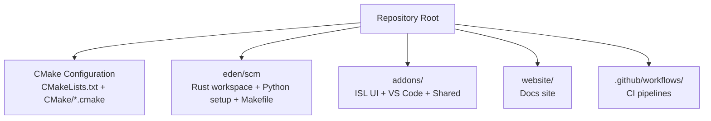
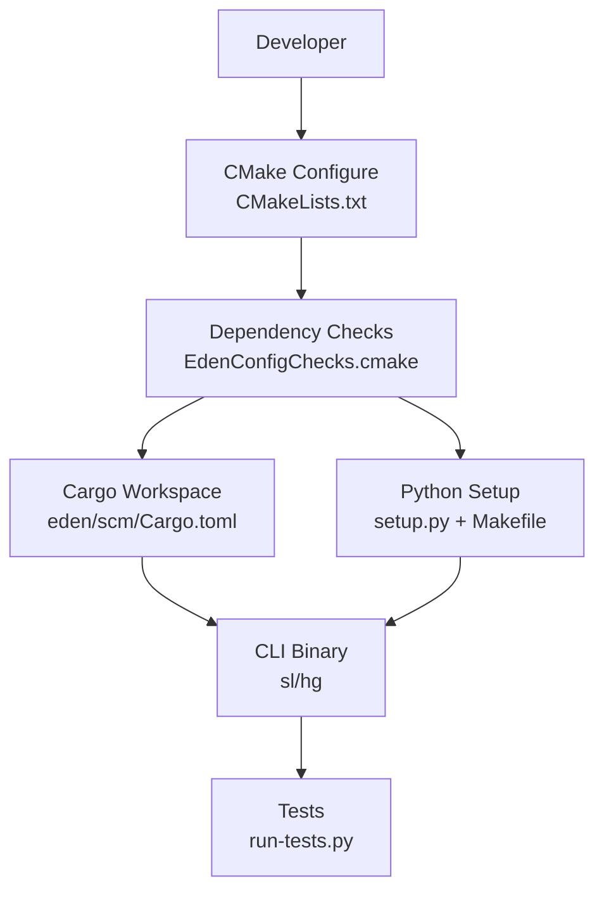
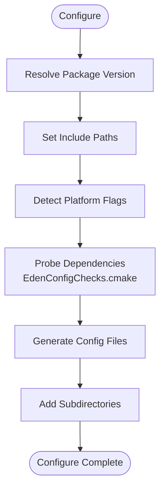
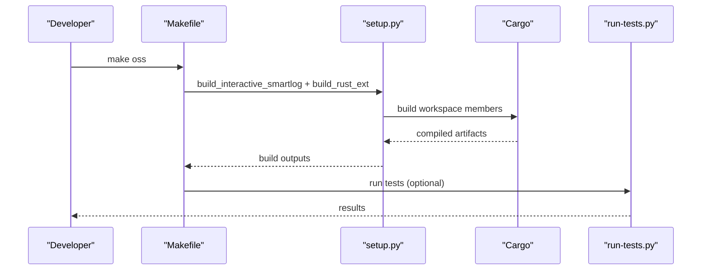
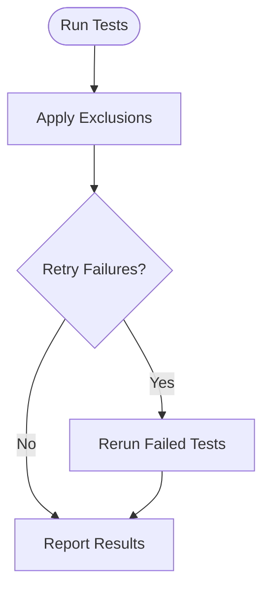
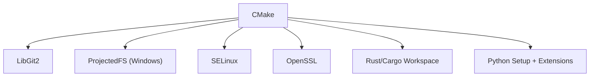

# Build System and Development

<cite>
**Referenced Files in This Document**
- [CMakeLists.txt](file://CMakeLists.txt)
- [EdenCompilerSettings.cmake](file://CMake/CMake/EdenCompilerSettings.cmake)
- [EdenConfigChecks.cmake](file://CMake/CMake/EdenConfigChecks.cmake)
- [FindLibGit2.cmake](file://CMake/CMake/FindLibGit2.cmake)
- [FindPrjfs.cmake](file://CMake/CMake/FindPrjfs.cmake)
- [FindSELinux.cmake](file://CMake/CMake/FindSELinux.cmake)
- [build.sh](file://build.sh)
- [build.bat](file://build.bat)
- [README.md](file://README.md)
- [CONTRIBUTING.md](file://CONTRIBUTING.md)
- [Cargo.toml](file://eden/scm/Cargo.toml)
- [setup.py](file://eden/scm/setup.py)
- [Makefile](file://eden/scm/Makefile)
- [requirements_ubuntu.txt](file://requirements_ubuntu.txt)
</cite>

## Table of Contents
1. [Introduction](#introduction)
2. [Project Structure](#project-structure)
3. [Core Components](#core-components)
4. [Architecture Overview](#architecture-overview)
5. [Detailed Component Analysis](#detailed-component-analysis)
6. [Dependency Analysis](#dependency-analysis)
7. [Performance Considerations](#performance-considerations)
8. [Troubleshooting Guide](#troubleshooting-guide)
9. [Conclusion](#conclusion)
10. [Appendices](#appendices)

## Introduction
This document explains the SAPLING SCM build system and development workflow. It covers the CMake-based build configuration, dependency management, platform-specific build processes, development environment setup, testing strategies, code organization, and contribution guidelines. It also documents the monorepo structure, inter-component dependencies, build optimization techniques, continuous integration processes, quality assurance measures, and release procedures.

## Project Structure
The repository is a monorepo with multiple top-level areas:
- Root build and configuration: CMake, build scripts, and top-level documentation
- eden: core SCM implementation, CLI, and related components
- addons: web UI (ISL), VS Code extension, and shared components
- website: Docusaurus-based documentation site
- Common libraries and utilities used across components
- CI workflows under .github/workflows

Key build-related directories and files:
- Root CMake configuration and platform checks
- eden/scm: Rust/Cargo workspace, Python setup, and Makefile-based build orchestration
- addons: TypeScript/Vite-based UI and server proxies
- CI workflows for Linux, macOS, Windows, and release automation

**Diagram sources**
- [CMakeLists.txt:1-198](file://CMakeLists.txt#L1-L198)
- [Cargo.toml:1-318](file://eden/scm/Cargo.toml#L1-L318)
- [Makefile:1-320](file://eden/scm/Makefile#L1-L320)

**Section sources**
- [README.md:1-80](file://README.md#L1-L80)
- [CMakeLists.txt:1-198](file://CMakeLists.txt#L1-L198)

## Core Components
- CMake-based build system orchestrating platform detection, compiler flags, and dependency discovery
- Rust/Cargo workspace for the CLI and core libraries
- Python setup.py and Makefile for packaging, Rust extension builds, and test orchestration
- Platform-specific modules for optional dependencies (e.g., LibGit2, PrjFS, SELinux)
- Addons monorepo for the web UI and VS Code extension

Key responsibilities:
- Build orchestration and versioning
- Dependency resolution and platform checks
- Cross-language integration (Rust, Python, C/C++)
- Test execution and packaging

**Section sources**
- [CMakeLists.txt:1-198](file://CMakeLists.txt#L1-L198)
- [EdenConfigChecks.cmake:1-145](file://CMake/CMake/EdenConfigChecks.cmake#L1-L145)
- [Cargo.toml:1-318](file://eden/scm/Cargo.toml#L1-L318)
- [setup.py:1-1007](file://eden/scm/setup.py#L1-L1007)
- [Makefile:1-320](file://eden/scm/Makefile#L1-L320)

## Architecture Overview
The build system integrates CMake, Rust/Cargo, and Python to produce a cross-platform CLI and supporting components. The flow begins with CMake discovering dependencies and configuring platform flags, followed by Rust/Cargo building native libraries and binaries, and Python setup.py coordinating packaging and tests.

**Diagram sources**
- [CMakeLists.txt:1-198](file://CMakeLists.txt#L1-L198)
- [EdenConfigChecks.cmake:1-145](file://CMake/CMake/EdenConfigChecks.cmake#L1-L145)
- [Cargo.toml:1-318](file://eden/scm/Cargo.toml#L1-L318)
- [setup.py:1-1007](file://eden/scm/setup.py#L1-L1007)
- [Makefile:1-320](file://eden/scm/Makefile#L1-L320)

## Detailed Component Analysis

### CMake Build Configuration
CMake sets minimum version, policies, and project metadata. It detects versioning from environment or Git, configures include paths, and discovers platform-specific dependencies. It includes compiler settings and configuration checks, then adds subdirectories for major components.

Highlights:
- Versioning from environment or Git log
- Platform-specific compiler flags and libraries
- Optional dependency probing (Git, SELinux, PrjFS)
- Configuration file generation for runtime

**Diagram sources**
- [CMakeLists.txt:1-198](file://CMakeLists.txt#L1-L198)
- [EdenCompilerSettings.cmake:1-19](file://CMake/CMake/EdenCompilerSettings.cmake#L1-L19)
- [EdenConfigChecks.cmake:1-145](file://CMake/CMake/EdenConfigChecks.cmake#L1-L145)

**Section sources**
- [CMakeLists.txt:1-198](file://CMakeLists.txt#L1-L198)
- [EdenCompilerSettings.cmake:1-19](file://CMake/CMake/EdenCompilerSettings.cmake#L1-L19)
- [EdenConfigChecks.cmake:1-145](file://CMake/CMake/EdenConfigChecks.cmake#L1-L145)

### Platform-Specific Modules
- FindLibGit2.cmake: wraps pkg-config for libgit2 and exposes a target alias
- FindPrjfs.cmake: locates Windows Projected File System library and exposes an interface target
- FindSELinux.cmake: finds SELinux headers and libraries

These modules standardize dependency discovery across platforms and integrate with CMake’s target system.

**Section sources**
- [FindLibGit2.cmake:1-20](file://CMake/CMake/FindLibGit2.cmake#L1-L20)
- [FindPrjfs.cmake:1-28](file://CMake/CMake/FindPrjfs.cmake#L1-L28)
- [FindSELinux.cmake:1-26](file://CMake/CMake/FindSELinux.cmake#L1-L26)

### Rust/Cargo Workspace
The Rust workspace defines members across lib/, exec/, and saplingnative bindings. It centralizes build configuration and dependency management for the CLI and core libraries.

Key aspects:
- Workspace members enumerate libraries and binaries
- Patch entries for specific crates
- Centralized resolver configuration

**Section sources**
- [Cargo.toml:1-318](file://eden/scm/Cargo.toml#L1-L318)

### Python Setup and Packaging
Python setup.py coordinates:
- Environment loading and relaunching with proper variables
- Rust extension builds via distutils_rust
- Interactive Smartlog packaging
- Script installation and shebang rewriting
- Version computation and hashing

Makefile complements setup.py with:
- OSS build targets and install routines
- Test orchestration and retries
- Wheel packaging and distribution targets
- Buck integration for fast builds

**Diagram sources**
- [Makefile:1-320](file://eden/scm/Makefile#L1-L320)
- [setup.py:1-1007](file://eden/scm/setup.py#L1-L1007)
- [Cargo.toml:1-318](file://eden/scm/Cargo.toml#L1-L318)

**Section sources**
- [setup.py:1-1007](file://eden/scm/setup.py#L1-L1007)
- [Makefile:1-320](file://eden/scm/Makefile#L1-L320)

### Development Environment Setup
Required tools:
- Python 3.8+, Rust, CMake, OpenSSL for the CLI
- Node and Yarn for the ISL web UI

Ubuntu prerequisites are listed in requirements_ubuntu.txt.

Build scripts:
- build.sh: invokes getdeps.py to build eden on Linux
- build.bat: invokes getdeps.py to build eden on Windows

**Section sources**
- [README.md:59-67](file://README.md#L59-L67)
- [requirements_ubuntu.txt:1-9](file://requirements_ubuntu.txt#L1-L9)
- [build.sh:1-24](file://build.sh#L1-L24)
- [build.bat:1-18](file://build.bat#L1-L18)

### Testing Strategies
- Automated test suites orchestrated by run-tests.py
- Makefile targets for running tests and managing retries
- Exclusion lists for known flaky or environment-dependent tests
- Integration tests across platforms

**Diagram sources**
- [Makefile:177-268](file://eden/scm/Makefile#L177-L268)

**Section sources**
- [Makefile:177-268](file://eden/scm/Makefile#L177-L268)

### Continuous Integration and Release Procedures
- GitHub Actions workflows for Linux, macOS, Windows, and release automation
- Release scripts and verification helpers under ci/
- Versioning and tagging handled by scripts and environment variables

Note: Workflow files were not included in the provided context; refer to .github/workflows for detailed pipeline definitions.

**Section sources**
- [README.md:1-80](file://README.md#L1-L80)

### Contribution Guidelines
- Fork and branch from main
- Add tests for new code
- Update documentation for API changes
- Ensure tests and linting pass
- Complete CLA

**Section sources**
- [CONTRIBUTING.md:1-41](file://CONTRIBUTING.md#L1-L41)

## Dependency Analysis
The build system resolves dependencies through CMake and Cargo:
- CMake probes for system libraries and optional components (Git, SELinux, PrjFS)
- Cargo manages Rust crate dependencies and workspace members
- Python setup.py coordinates Rust extension builds and packaging

**Diagram sources**
- [EdenConfigChecks.cmake:1-145](file://CMake/CMake/EdenConfigChecks.cmake#L1-L145)
- [FindLibGit2.cmake:1-20](file://CMake/CMake/FindLibGit2.cmake#L1-L20)
- [FindPrjfs.cmake:1-28](file://CMake/CMake/FindPrjfs.cmake#L1-L28)
- [FindSELinux.cmake:1-26](file://CMake/CMake/FindSELinux.cmake#L1-L26)
- [Cargo.toml:1-318](file://eden/scm/Cargo.toml#L1-L318)
- [setup.py:1-1007](file://eden/scm/setup.py#L1-L1007)

**Section sources**
- [EdenConfigChecks.cmake:1-145](file://CMake/CMake/EdenConfigChecks.cmake#L1-L145)
- [Cargo.toml:1-318](file://eden/scm/Cargo.toml#L1-L318)
- [setup.py:1-1007](file://eden/scm/setup.py#L1-L1007)

## Performance Considerations
- Use C++20 standard and platform-specific compiler flags for optimal performance
- Enable coroutines on GCC when targeting C++17
- Leverage Rust workspace builds for incremental compilation
- Utilize Makefile jobs detection for parallelism
- Prefer prebuilt artifacts and caching in CI environments

[No sources needed since this section provides general guidance]

## Troubleshooting Guide
Common issues and resolutions:
- Missing system dependencies: ensure OpenSSL, build-essential, pkg-config are installed (Ubuntu)
- Python environment mismatches: use setup.py environment relaunch mechanism
- Windows runtime dependencies: ensure Python DLL and runtime libraries are available
- Flaky tests: leverage Makefile’s retry logic and exclusion lists

**Section sources**
- [requirements_ubuntu.txt:1-9](file://requirements_ubuntu.txt#L1-L9)
- [setup.py:42-69](file://eden/scm/setup.py#L42-L69)
- [Makefile:177-268](file://eden/scm/Makefile#L177-L268)

## Conclusion
The SAPLING SCM build system combines CMake, Rust/Cargo, and Python to deliver a robust, cross-platform build and development workflow. The monorepo structure supports modular development, while CI and testing strategies ensure quality. Following the documented setup and contribution guidelines will streamline development and releases.

[No sources needed since this section summarizes without analyzing specific files]

## Appendices

### Appendix A: Build Targets Overview
- oss: build the CLI locally with sl naming
- local: build for in-place usage
- install-oss: install sl binary and ISL assets
- wheel: create a distributable wheel
- tests: run automated test suites
- clean/cleanbutpackages: cleanup build artifacts

**Section sources**
- [Makefile:88-176](file://eden/scm/Makefile#L88-L176)