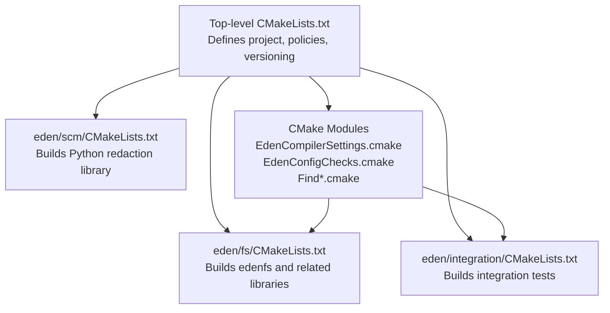
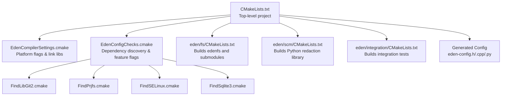
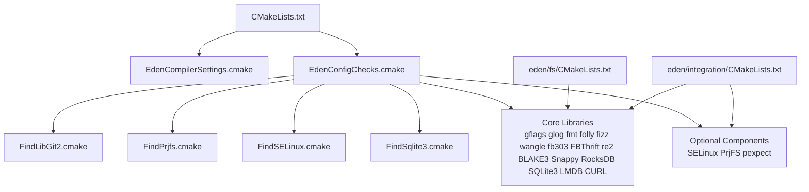

# CMake Build System

<cite>
**Referenced Files in This Document**
- [CMakeLists.txt](file://CMakeLists.txt)
- [EdenCompilerSettings.cmake](file://CMake/EdenCompilerSettings.cmake)
- [EdenConfigChecks.cmake](file://CMake/EdenConfigChecks.cmake)
- [FindLibGit2.cmake](file://CMake/FindLibGit2.cmake)
- [FindPrjfs.cmake](file://CMake/FindPrjfs.cmake)
- [FindSELinux.cmake](file://CMake/FindSELinux.cmake)
- [FindSqlite3.cmake](file://CMake/FindSqlite3.cmake)
- [eden-config.h.in](file://CMake/eden-config.h.in)
- [eden-config.cpp.in](file://CMake/eden-config.cpp.in)
- [build.sh](file://build.sh)
- [build.bat](file://build.bat)
- [eden/fs/CMakeLists.txt](file://eden/fs/CMakeLists.txt)
- [eden/scm/CMakeLists.txt](file://eden/scm/CMakeLists.txt)
- [eden/integration/CMakeLists.txt](file://eden/integration/CMakeLists.txt)
</cite>

## Table of Contents
1. [Introduction](#introduction)
2. [Project Structure](#project-structure)
3. [Core Components](#core-components)
4. [Architecture Overview](#architecture-overview)
5. [Detailed Component Analysis](#detailed-component-analysis)
6. [Dependency Analysis](#dependency-analysis)
7. [Performance Considerations](#performance-considerations)
8. [Troubleshooting Guide](#troubleshooting-guide)
9. [Conclusion](#conclusion)
10. [Appendices](#appendices)

## Introduction
This document describes the SAPLING SCM CMake build system used by the Eden project. It explains the top-level configuration, compiler settings, dependency discovery, and the modular build structure across eden/fs, eden/scm, and eden/integration. It also covers configuration options such as ENABLE_EDENSCM and ENABLE_GIT, cross-platform support for Linux, macOS, and Windows, custom CMake find modules, and practical build scenarios and troubleshooting tips.

## Project Structure
The build system centers around a single top-level CMake project that orchestrates subprojects for filesystem services, SCM integration, and integration tests. Key elements:
- Top-level CMake project defines policies, versioning, and global compile definitions.
- Includes custom compiler settings and configuration checks.
- Adds subdirectories for eden/fs, eden/scm, eden/integration, and related components.
- Generates configuration headers and Python configuration for runtime feature detection.

**Diagram sources**
- [CMakeLists.txt:113-139](file://CMakeLists.txt#L113-L139)
- [eden/fs/CMakeLists.txt:1-74](file://eden/fs/CMakeLists.txt#L1-L74)
- [eden/scm/CMakeLists.txt:1-13](file://eden/scm/CMakeLists.txt#L1-L13)
- [eden/integration/CMakeLists.txt:1-76](file://eden/integration/CMakeLists.txt#L1-L76)
- [EdenCompilerSettings.cmake:1-19](file://CMake/EdenCompilerSettings.cmake#L1-L19)
- [EdenConfigChecks.cmake:1-145](file://CMake/EdenConfigChecks.cmake#L1-L145)
- [FindLibGit2.cmake:1-20](file://CMake/FindLibGit2.cmake#L1-L20)
- [FindPrjfs.cmake:1-28](file://CMake/FindPrjfs.cmake#L1-L28)
- [FindSELinux.cmake:1-26](file://CMake/FindSELinux.cmake#L1-L26)
- [FindSqlite3.cmake:1-17](file://CMake/FindSqlite3.cmake#L1-L17)

**Section sources**
- [CMakeLists.txt:1-198](file://CMakeLists.txt#L1-L198)
- [eden/fs/CMakeLists.txt:1-74](file://eden/fs/CMakeLists.txt#L1-L74)
- [eden/scm/CMakeLists.txt:1-13](file://eden/scm/CMakeLists.txt#L1-L13)
- [eden/integration/CMakeLists.txt:1-76](file://eden/integration/CMakeLists.txt#L1-L76)

## Core Components
- Top-level project configuration and policies:
  - Minimum CMake version and policy settings for compatibility.
  - Version computation from environment or Git metadata.
  - Global include directories and compiler standard selection.
- Compiler settings:
  - Platform-specific flags and atomic linking on non-Windows, non-macOS systems.
  - C++ standard set to C++20 with coroutine support on GCC.
- Configuration checks:
  - Discovery of core libraries (gflags, glog, fmt, folly, fizz, wangle, fb303, FBThrift, re2, BLAKE3, Snappy, RocksDB, SQLite3, LMDB, CURL).
  - Optional SELinux, PrjFS, and pexpect detection.
  - Feature flags for Git, RocksDB, SQLite3, LMDB, SELinux, and usage service.
- Subdirectory orchestration:
  - Adds eden/fs, eden/integration, eden/scm, and related components.
  - Configures Python DLL installation on Windows and emits runtime dependency hints.
  - Generates eden-config.h, eden-config.cpp, and eden-config.py for runtime feature flags.

**Section sources**
- [CMakeLists.txt:6-105](file://CMakeLists.txt#L6-L105)
- [CMakeLists.txt:113-139](file://CMakeLists.txt#L113-L139)
- [CMakeLists.txt:143-169](file://CMakeLists.txt#L143-L169)
- [CMakeLists.txt:171-198](file://CMakeLists.txt#L171-L198)
- [EdenCompilerSettings.cmake:6-18](file://CMake/EdenCompilerSettings.cmake#L6-L18)
- [EdenConfigChecks.cmake:8-145](file://CMake/EdenConfigChecks.cmake#L8-L145)

## Architecture Overview
The build system composes a layered architecture:
- Top-level CMake project configures the environment and discovers dependencies.
- Platform-specific compiler flags and link libraries are applied globally.
- Subprojects define targets and link against discovered dependencies.
- Generated configuration files expose feature flags to C++ and Python code.

**Diagram sources**
- [CMakeLists.txt:113-139](file://CMakeLists.txt#L113-L139)
- [EdenCompilerSettings.cmake:1-19](file://CMake/EdenCompilerSettings.cmake#L1-L19)
- [EdenConfigChecks.cmake:1-145](file://CMake/EdenConfigChecks.cmake#L1-L145)
- [FindLibGit2.cmake:1-20](file://CMake/FindLibGit2.cmake#L1-L20)
- [FindPrjfs.cmake:1-28](file://CMake/FindPrjfs.cmake#L1-L28)
- [FindSELinux.cmake:1-26](file://CMake/FindSELinux.cmake#L1-L26)
- [FindSqlite3.cmake:1-17](file://CMake/FindSqlite3.cmake#L1-L17)
- [eden/fs/CMakeLists.txt:1-74](file://eden/fs/CMakeLists.txt#L1-L74)
- [eden/scm/CMakeLists.txt:1-13](file://eden/scm/CMakeLists.txt#L1-L13)
- [eden/integration/CMakeLists.txt:1-76](file://eden/integration/CMakeLists.txt#L1-L76)
- [eden-config.h.in:1-38](file://CMake/eden-config.h.in#L1-L38)
- [eden-config.cpp.in:1-16](file://CMake/eden-config.cpp.in#L1-L16)

## Detailed Component Analysis

### Top-Level CMake Project
Responsibilities:
- Enforces CMake minimum version and modern policies.
- Computes project version from environment or Git log.
- Sets C++ standard to C++20 and enables coroutines on GCC.
- Defines configuration options ENABLE_EDENSCM and ENABLE_GIT with AUTO/ON/OFF choices.
- Includes custom modules for compiler settings and dependency checks.
- Adds subdirectories for major components and generates configuration files.

Key behaviors:
- Version override via cache/environment variables.
- Prefix path for third-party dependencies under external/install.
- On Windows, optionally installs Python DLL and writes LIBRARY_DEP_DIRS.txt for runtime dependency resolution.

**Section sources**
- [CMakeLists.txt:6-105](file://CMakeLists.txt#L6-L105)
- [CMakeLists.txt:113-139](file://CMakeLists.txt#L113-L139)
- [CMakeLists.txt:143-169](file://CMakeLists.txt#L143-L169)
- [CMakeLists.txt:171-198](file://CMakeLists.txt#L171-L198)

### Compiler Settings Module
Responsibilities:
- Applies platform-specific compiler definitions and warnings.
- Links libatomic on non-Windows, non-macOS platforms.

Impact:
- Ensures consistent compilation flags across Linux/macOS/Windows.
- Reduces undefined reference errors on older toolchains.

**Section sources**
- [EdenCompilerSettings.cmake:6-18](file://CMake/EdenCompilerSettings.cmake#L6-L18)

### Dependency Checks and Feature Flags
Responsibilities:
- Discovers and links core libraries (gflags, glog, fmt, folly, fizz, wangle, fb303, FBThrift, re2, BLAKE3, Snappy, RocksDB, SQLite3, LMDB, CURL).
- Detects optional components (SELinux, PrjFS, pexpect).
- Produces feature flags such as EDEN_HAVE_GIT, EDEN_HAVE_ROCKSDB, EDEN_HAVE_SQLITE3, EDEN_HAVE_LMDB, EDEN_HAVE_SELINUX, EDEN_HAVE_USAGE_SERVICE.
- Handles ENABLE_GIT flag logic with AUTO/ON/OFF.

Implementation highlights:
- Uses pkg-config for libgit2 and synthesizes a libgit2 alias target.
- On Windows, requires PrjFS; on non-Windows, detects LMDB.
- Generates Python configuration flags for runtime feature detection.

**Section sources**
- [EdenConfigChecks.cmake:8-145](file://CMake/EdenConfigChecks.cmake#L8-L145)
- [FindLibGit2.cmake:1-20](file://CMake/FindLibGit2.cmake#L1-L20)
- [FindPrjfs.cmake:1-28](file://CMake/FindPrjfs.cmake#L1-L28)
- [FindSELinux.cmake:1-26](file://CMake/FindSELinux.cmake#L1-L26)
- [FindSqlite3.cmake:1-17](file://CMake/FindSqlite3.cmake#L1-L17)

### Generated Configuration Files
Responsibilities:
- eden-config.h.in exposes extern declarations and compile-time feature macros.
- eden-config.cpp.in provides runtime version and timestamp values.
- eden-config.py.in produces a Python module with feature flags for runtime checks.

Usage:
- C++ code includes eden/fs/eden-config.h to access build-time constants and feature flags.
- Python code consumes the generated config.py to adapt behavior at runtime.

**Section sources**
- [eden-config.h.in:1-38](file://CMake/eden-config.h.in#L1-L38)
- [eden-config.cpp.in:1-16](file://CMake/eden-config.cpp.in#L1-L16)
- [CMakeLists.txt:171-198](file://CMakeLists.txt#L171-L198)

### eden/fs: Filesystem Service and Utilities
Responsibilities:
- Builds the edenfs executable and, on non-Windows, the edenfs_privhelper.
- Creates a static library eden_build_config that embeds build metadata.
- Adds numerous subdirectories for CLI, configuration, digest, FUSE, inode management, journaling, LMDB, models, NFS, notifications, prjfs, Python bindings, service, SQLite, storage, takeover, telemetry, test harness, and utilities.

Cross-platform notes:
- Windows builds define Unicode preprocessor definitions.
- Privileged helper is omitted on Windows.

**Section sources**
- [eden/fs/CMakeLists.txt:6-74](file://eden/fs/CMakeLists.txt#L6-L74)

### eden/scm: SCM Integration Library
Responsibilities:
- Provides a Python library (namespace eden.scm) containing redaction utilities.
- Installed as part of the Python ecosystem managed by the build system.

**Section sources**
- [eden/scm/CMakeLists.txt:6-13](file://eden/scm/CMakeLists.txt#L6-L13)

### eden/integration: Integration Tests
Responsibilities:
- Gathers Python integration tests and conditionally excludes platform-specific ones.
- Requires pexpect for certain tests; if absent, those files are excluded.
- Declares a Python unit test package with dependencies on edenfsctl, integration libraries, and core libraries.

Platform filtering:
- Removes Linux-only tests on Windows/macOS.
- Removes Windows-only tests on non-Windows.
- Removes PrjFS stress tests on Windows.

**Section sources**
- [eden/integration/CMakeLists.txt:6-43](file://eden/integration/CMakeLists.txt#L6-L43)
- [eden/integration/CMakeLists.txt:47-66](file://eden/integration/CMakeLists.txt#L47-L66)

### Cross-Platform Build Support
- Linux/macOS:
  - Uses pkg-config for libgit2 and standard compiler flags.
  - Detects LMDB and other Unix-specific libraries.
- Windows:
  - Requires PrjFS and optionally installs the Python DLL into the binary directory.
  - Emits LIBRARY_DEP_DIRS.txt to aid runtime dependency resolution.
  - Defines Unicode preprocessor macros for Windows targets.

**Section sources**
- [EdenCompilerSettings.cmake:6-12](file://CMake/EdenCompilerSettings.cmake#L6-L12)
- [EdenConfigChecks.cmake:123-125](file://CMake/EdenConfigChecks.cmake#L123-L125)
- [EdenConfigChecks.cmake:105-109](file://CMake/EdenConfigChecks.cmake#L105-L109)
- [CMakeLists.txt:143-169](file://CMakeLists.txt#L143-L169)
- [eden/fs/CMakeLists.txt:49-51](file://eden/fs/CMakeLists.txt#L49-L51)

### Configuration Options
- ENABLE_EDENSCM: Controls support for Eden SCM repositories. Available as AUTO/ON/OFF.
- ENABLE_GIT: Controls support for Git repositories. Available as AUTO/ON/OFF.
- Behavior:
  - AUTO: Attempts to detect availability of dependencies (e.g., libgit2).
  - ON: Requires dependencies to be present.
  - OFF: Disables features regardless of availability.

**Section sources**
- [CMakeLists.txt:114-117](file://CMakeLists.txt#L114-L117)
- [EdenConfigChecks.cmake:52-60](file://CMake/EdenConfigChecks.cmake#L52-L60)

### Build Scripts
- build.sh: Invokes getdeps.py to build the eden project on Linux environments, ensuring proper toolchain paths.
- build.bat: Invokes getdeps.py on Windows to build the eden project.

These scripts delegate dependency installation and build orchestration to getdeps.py.

**Section sources**
- [build.sh:1-24](file://build.sh#L1-L24)
- [build.bat:1-18](file://build.bat#L1-L18)

## Dependency Analysis
The build system relies on a set of core libraries and optional platform-specific components. The dependency graph below reflects the primary relationships established by the configuration checks and subdirectory targets.

**Diagram sources**
- [CMakeLists.txt:113-139](file://CMakeLists.txt#L113-L139)
- [EdenConfigChecks.cmake:12-145](file://CMake/EdenConfigChecks.cmake#L12-L145)
- [FindLibGit2.cmake:1-20](file://CMake/FindLibGit2.cmake#L1-L20)
- [FindPrjfs.cmake:1-28](file://CMake/FindPrjfs.cmake#L1-L28)
- [FindSELinux.cmake:1-26](file://CMake/FindSELinux.cmake#L1-L26)
- [FindSqlite3.cmake:1-17](file://CMake/FindSqlite3.cmake#L1-L17)
- [eden/fs/CMakeLists.txt:19-23](file://eden/fs/CMakeLists.txt#L19-L23)
- [eden/integration/CMakeLists.txt:47-66](file://eden/integration/CMakeLists.txt#L47-L66)

**Section sources**
- [EdenConfigChecks.cmake:12-145](file://CMake/EdenConfigChecks.cmake#L12-L145)
- [eden/fs/CMakeLists.txt:19-23](file://eden/fs/CMakeLists.txt#L19-L23)
- [eden/integration/CMakeLists.txt:47-66](file://eden/integration/CMakeLists.txt#L47-L66)

## Performance Considerations
- Prefer RelWithDebInfo or Release builds for production to enable compiler optimizations.
- Keep ENABLE_GIT and ENABLE_EDENSCM at AUTO to allow the build system to detect optimal configurations.
- On Linux, ensure libatomic is available to avoid unresolved symbols during linking.
- Minimize rebuilds by avoiding frequent reruns of CMake unless configuration changes.

## Troubleshooting Guide
Common issues and resolutions:
- Missing libgit2:
  - Symptom: Git-related features disabled or link failures.
  - Resolution: Install libgit2 development headers or adjust pkg-config path; ensure FindLibGit2.cmake can locate the library.
- Missing PrjFS on Windows:
  - Symptom: Build fails due to missing PrjFS components.
  - Resolution: Install PrjFS SDK and ensure headers and libraries are discoverable.
- Missing SELinux libraries:
  - Symptom: SELinux features disabled despite presence of SELinux headers.
  - Resolution: Install libselinux and libsepol development packages; ensure FindSELinux.cmake can locate both libraries.
- Missing pexpect:
  - Symptom: Certain integration tests are excluded or fail to run.
  - Resolution: Install pexpect to enable those tests.
- Python DLL not found on Windows:
  - Symptom: Runtime failure to locate Python DLL.
  - Resolution: Enable INSTALL_PYTHON_LIB to copy the DLL into the binary directory; verify LIBRARY_DEP_DIRS.txt entries.

**Section sources**
- [EdenConfigChecks.cmake:49-121](file://CMake/EdenConfigChecks.cmake#L49-L121)
- [EdenConfigChecks.cmake:123-125](file://CMake/EdenConfigChecks.cmake#L123-L125)
- [EdenConfigChecks.cmake:117-117](file://CMake/EdenConfigChecks.cmake#L117-L117)
- [CMakeLists.txt:153-169](file://CMakeLists.txt#L153-L169)

## Conclusion
The SAPLING SCM CMake build system provides a robust, cross-platform foundation for building Eden components. It centralizes compiler settings, performs comprehensive dependency discovery, and exposes feature flags to both C++ and Python layers. The modular structure supports incremental development and testing across eden/fs, eden/scm, and eden/integration while accommodating platform-specific requirements.

## Appendices

### Configuration Options Reference
- ENABLE_EDENSCM: AUTO/ON/OFF; controls Eden SCM repository support.
- ENABLE_GIT: AUTO/ON/OFF; controls Git repository support.
- INSTALL_PYTHON_LIB: Boolean; copies Python DLL into the binary directory on Windows.
- EDEN_VERSION_OVERRIDE: Overrides computed package version.
- ETC_EDEN_DIR: Directory for system-wide configuration files.

**Section sources**
- [CMakeLists.txt:114-117](file://CMakeLists.txt#L114-L117)
- [CMakeLists.txt:52-56](file://CMakeLists.txt#L52-L56)
- [CMakeLists.txt:143-169](file://CMakeLists.txt#L143-L169)
- [CMakeLists.txt:141-144](file://CMakeLists.txt#L141-L144)

### Example Build Scenarios
- Linux (default):
  - Configure with defaults; libgit2 and LMDB auto-detected.
  - Build targets include edenfs and associated libraries.
- macOS (default):
  - Similar to Linux; applies macOS-specific compiler flags.
- Windows (default):
  - Requires PrjFS; optionally installs Python DLL; defines Unicode macros.
  - Privileged helper is not built on Windows.

**Section sources**
- [EdenCompilerSettings.cmake:8-12](file://CMake/EdenCompilerSettings.cmake#L8-L12)
- [EdenConfigChecks.cmake:123-125](file://CMake/EdenConfigChecks.cmake#L123-L125)
- [EdenConfigChecks.cmake:105-109](file://CMake/EdenConfigChecks.cmake#L105-L109)
- [eden/fs/CMakeLists.txt:25-42](file://eden/fs/CMakeLists.txt#L25-L42)

### Extending the Build System for New Components
- Add a new subdirectory under eden/ with its own CMakeLists.txt.
- Declare targets and link against discovered libraries from EdenConfigChecks.cmake.
- If the component depends on a new third-party library, create a FindModule.cmake and update EdenConfigChecks.cmake to detect and expose it.
- For platform-specific features, guard with WIN32/APPLE/LINUX conditions similar to existing patterns.

[No sources needed since this section provides general guidance]