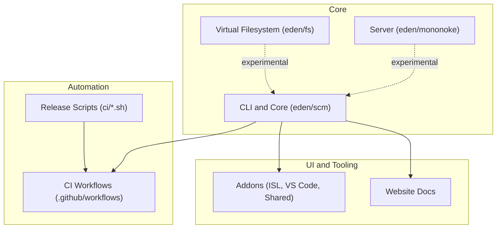
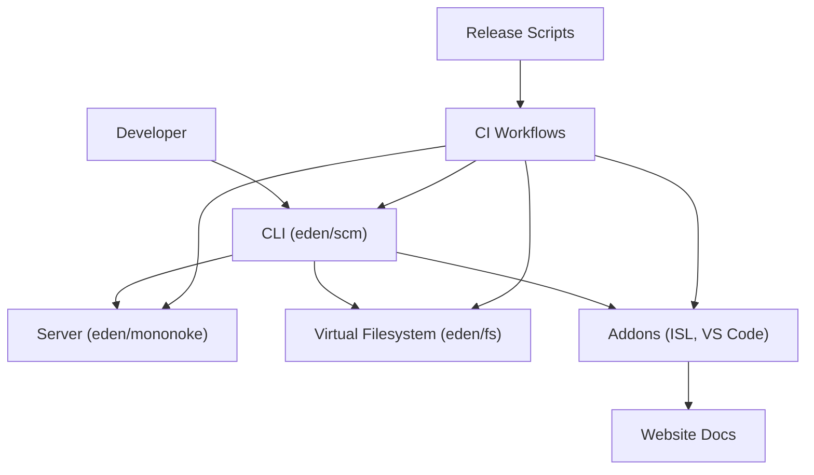
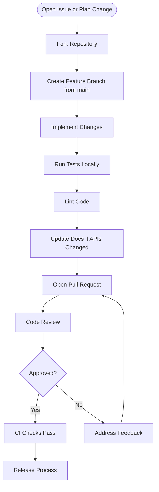
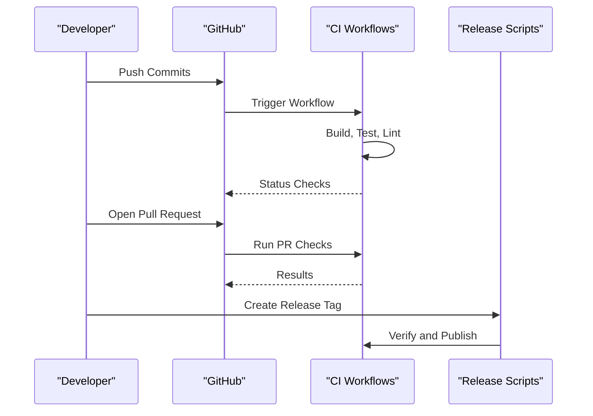
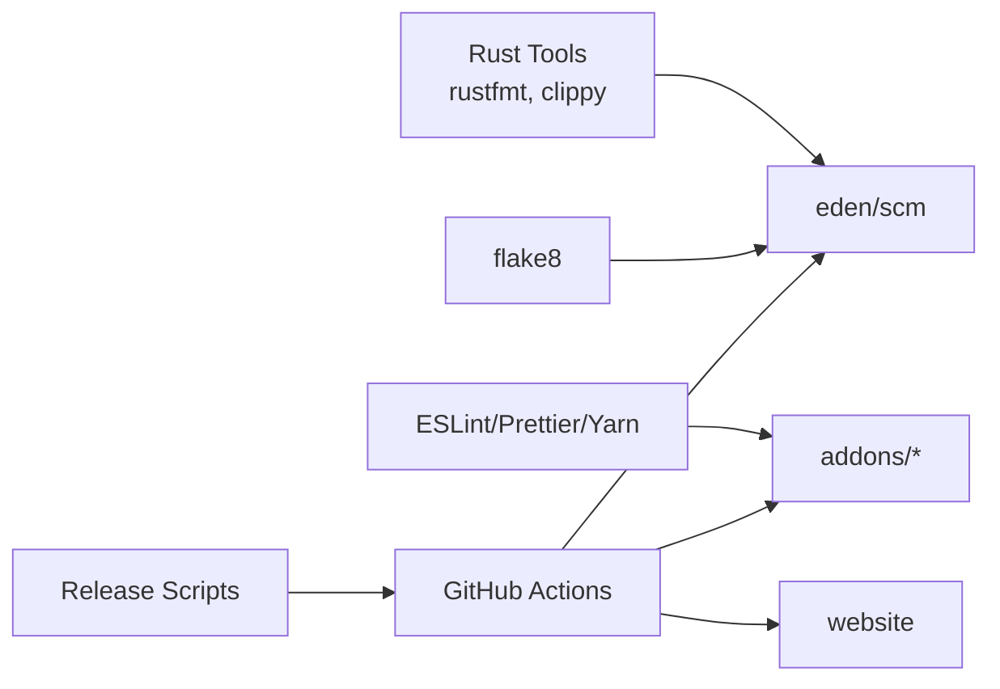

# Contribution Guidelines

<cite>
**Referenced Files in This Document**
- [CONTRIBUTING.md](file://CONTRIBUTING.md)
- [CODE_OF_CONDUCT.md](file://CODE_OF_CONDUCT.md)
- [README.md](file://README.md)
- [clippy.toml](file://clippy.toml)
- [rustfmt.toml](file://rustfmt.toml)
- [eden/scm/.rustfmt.toml](file://eden/scm/.rustfmt.toml)
- [eden/scm/.flake8](file://eden/scm/.flake8)
- [eden/scm/.editorconfig](file://eden/scm/.editorconfig)
- [addons/.eslintrc.js](file://addons/.eslintrc.js)
- [addons/package.json](file://addons/package.json)
- [website/.prettierrc](file://website/.prettierrc)
- [.github/workflows](file://.github/workflows)
- [ci/create-release.sh](file://ci/create-release.sh)
- [ci/tag-name.sh](file://ci/tag-name.sh)
- [ci/verify_release.sh](file://ci/verify_release.sh)
- [ci/retry.sh](file://ci/retry.sh)
- [ci/gen_workflows.py](file://ci/gen_workflows.py)
- [dependabot.yml](file://dependabot.yml)
</cite>

## Table of Contents
1. [Introduction](#introduction)
2. [Project Structure](#project-structure)
3. [Core Components](#core-components)
4. [Architecture Overview](#architecture-overview)
5. [Detailed Component Analysis](#detailed-component-analysis)
6. [Dependency Analysis](#dependency-analysis)
7. [Performance Considerations](#performance-considerations)
8. [Troubleshooting Guide](#troubleshooting-guide)
9. [Conclusion](#conclusion)
10. [Appendices](#appendices)

## Introduction
This document describes how to contribute to SAPLING SCM development. It covers the contribution process, code standards, commit message formats, pull request procedures, code review expectations, testing and continuous integration workflows, development best practices, coding standards for Rust, C++, and TypeScript, architectural guidelines, community and conduct expectations, communication channels, issue and feature request processes, release and versioning procedures, and licensing requirements.

## Project Structure
SAPLING SCM is a multi-language, multi-component project with distinct areas for CLI, server-side components, virtual filesystem, web UI, and supporting tooling. The repository includes:
- eden/scm: The main CLI and core Rust/C++ code
- eden/mononoke: Scalable server component (not generally supported externally)
- eden/fs: Virtual filesystem (EdenFS) component (not generally supported externally)
- addons: Web UI (ISL), VS Code extension, shared components, and related tooling
- website: Docusaurus-based documentation site
- ci: Release automation scripts
- .github/workflows: Continuous integration workflows

**Section sources**
- [README.md:30-80](file://README.md#L30-L80)

## Core Components
- CLI and Core (eden/scm): Contains the primary `sl` command-line tool and core logic. It includes Rust and C++ code, with build and linting configurations.
- Server (eden/mononoke): Distributed server component used internally; builds are available via CI for unsupported experimentation.
- Virtual Filesystem (eden/fs): Large-repository checkout acceleration; builds are available via CI for unsupported experimentation.
- Addons (ISL, VS Code, Shared): Web UI, VS Code extension, and shared libraries.
- Website: Documentation site built with Docusaurus.

**Section sources**
- [README.md:30-80](file://README.md#L30-L80)

## Architecture Overview
The project follows a layered architecture:
- CLI layer (eden/scm) provides user-facing commands and integrates with underlying systems.
- Server layer (eden/mononoke) handles backend operations for large-scale repositories.
- Virtual filesystem layer (eden/fs) accelerates working copy operations.
- UI layer (addons) provides web and editor integrations.
- CI layer automates testing, releases, and cross-platform builds.

[No sources needed since this diagram shows conceptual workflow, not actual code structure]

## Detailed Component Analysis

### Contribution Process and Pull Requests
- Fork the repository and create a branch from main.
- Add tests for new or changed functionality.
- Update documentation for API changes.
- Ensure the test suite passes and code lints.
- Complete the Contributor License Agreement (CLA) if not previously done.

**Section sources**
- [CONTRIBUTING.md:10-18](file://CONTRIBUTING.md#L10-L18)

### Coding Standards and Formatting

#### Rust
- Formatting: rustfmt with edition and import grouping rules.
- Linting: clippy with configured allowances for tracing spans and line counts.
- EditorConfig: Ensures consistent indentation and whitespace handling.

**Section sources**
- [rustfmt.toml:1-10](file://rustfmt.toml#L1-L10)
- [eden/scm/.rustfmt.toml:1-9](file://eden/scm/.rustfmt.toml#L1-L9)
- [clippy.toml:1-6](file://clippy.toml#L1-L6)
- [eden/scm/.editorconfig:1-14](file://eden/scm/.editorconfig#L1-L14)

#### C++
- EditorConfig enforces 2-space indentation for C/C++ files.
- Clang tidy is present in the repository; consult the repository’s build and linting setup for specific checks.

**Section sources**
- [eden/scm/.editorconfig:10-14](file://eden/scm/.editorconfig#L10-L14)

#### TypeScript and JavaScript
- ESLint configuration enforces strict rules for TypeScript, React Hooks, import ordering, and custom rules.
- Prettier formatting is configured in the website workspace; addons use Prettier via Yarn scripts.

**Section sources**
- [addons/.eslintrc.js:15-127](file://addons/.eslintrc.js#L15-L127)
- [addons/package.json:27-34](file://addons/package.json#L27-L34)
- [website/.prettierrc:1-10](file://website/.prettierrc#L1-L10)

#### Python
- Flake8 configuration enforces style rules and disables line-length checks to accommodate Black formatting.

**Section sources**
- [eden/scm/.flake8:1-83](file://eden/scm/.flake8#L1-L83)

### Commit Message Formats
- The repository includes a commit template file under addons; use it to structure commit messages consistently.

**Section sources**
- [addons/.committemplate](file://addons/.committemplate)

### Code Review Expectations
- Pull requests undergo review; feedback should be addressed iteratively.
- Ensure tests pass and code adheres to established style guides before merging.

**Section sources**
- [CONTRIBUTING.md:10-18](file://CONTRIBUTING.md#L10-L18)

### Testing Requirements
- Add tests for new functionality.
- Run the full test suite locally before submitting a pull request.
- For Rust, ensure clippy and rustfmt checks pass.
- For TypeScript/JavaScript, ensure ESLint and Prettier checks pass.
- For Python, ensure flake8 checks pass.

**Section sources**
- [CONTRIBUTING.md:14-17](file://CONTRIBUTING.md#L14-L17)
- [clippy.toml:1-6](file://clippy.toml#L1-L6)
- [rustfmt.toml:1-10](file://rustfmt.toml#L1-L10)
- [addons/.eslintrc.js:58-127](file://addons/.eslintrc.js#L58-L127)
- [addons/package.json:32-33](file://addons/package.json#L32-L33)
- [eden/scm/.flake8:1-83](file://eden/scm/.flake8#L1-L83)

### Continuous Integration Workflows
- CI workflows are defined under .github/workflows and cover Linux, macOS, Windows, and various integration scenarios.
- Release automation scripts manage tagging, verification, and release creation.

**Section sources**
- [.github/workflows](file://.github/workflows)
- [ci/create-release.sh](file://ci/create-release.sh)
- [ci/tag-name.sh](file://ci/tag-name.sh)
- [ci/verify_release.sh](file://ci/verify_release.sh)
- [ci/retry.sh](file://ci/retry.sh)
- [ci/gen_workflows.py](file://ci/gen_workflows.py)

### Development Best Practices
- Keep changes focused and scoped to a single feature or fix.
- Write clear commit messages and update documentation for API changes.
- Run all linters and tests locally before opening a pull request.
- Follow the project’s code style for each language.

**Section sources**
- [CONTRIBUTING.md:14-17](file://CONTRIBUTING.md#L14-L17)

### Community Guidelines and Code of Conduct
- The project follows a Code of Conduct that promotes an inclusive, harassment-free environment.
- Reporting procedures and enforcement details are documented.

**Section sources**
- [CODE_OF_CONDUCT.md:1-78](file://CODE_OF_CONDUCT.md#L1-L78)

### Communication Channels
- Report issues on GitHub.
- Join the Discord community for discussions.

**Section sources**
- [README.md:68-72](file://README.md#L68-L72)

### Issue Reporting, Feature Requests, and Bug Fixes
- Use GitHub Issues to report bugs with clear reproduction steps.
- Security bugs should be reported privately per the bounty program guidance.

**Section sources**
- [CONTRIBUTING.md:26-32](file://CONTRIBUTING.md#L26-L32)

### Release Process, Versioning Scheme, and Maintenance
- Release scripts handle tagging, verification, and publishing.
- Dependabot is configured for automated dependency updates.

**Section sources**
- [ci/create-release.sh](file://ci/create-release.sh)
- [ci/tag-name.sh](file://ci/tag-name.sh)
- [ci/verify_release.sh](file://ci/verify_release.sh)
- [dependabot.yml](file://dependabot.yml)

### Licensing Requirements and Contributor Agreements
- Contributions are licensed under GPLv2.
- A signed Contributor License Agreement (CLA) is required for acceptance of contributions.

**Section sources**
- [CONTRIBUTING.md:38-41](file://CONTRIBUTING.md#L38-L41)
- [CONTRIBUTING.md:20-24](file://CONTRIBUTING.md#L20-L24)

## Dependency Analysis
The project uses multiple language ecosystems with shared tooling:
- Rust: rustfmt, clippy
- TypeScript/JavaScript: ESLint, Prettier, Yarn workspaces
- Python: flake8
- CI: GitHub Actions workflows

**Section sources**
- [rustfmt.toml:1-10](file://rustfmt.toml#L1-L10)
- [clippy.toml:1-6](file://clippy.toml#L1-L6)
- [addons/.eslintrc.js:15-127](file://addons/.eslintrc.js#L15-L127)
- [addons/package.json:27-34](file://addons/package.json#L27-L34)
- [eden/scm/.flake8:1-83](file://eden/scm/.flake8#L1-L83)
- [.github/workflows](file://.github/workflows)
- [ci/create-release.sh](file://ci/create-release.sh)

## Performance Considerations
- Keep functions and modules reasonably sized; rustfmt and clippy configs encourage concise code.
- Prefer asynchronous patterns and avoid blocking operations in hot paths.
- Ensure tests cover performance-sensitive paths and regressions are caught by CI.

[No sources needed since this section provides general guidance]

## Troubleshooting Guide
- If CI fails, review logs for failing tests, lint errors, or formatting issues.
- Use local scripts to validate formatting and linting before pushing.
- For release failures, inspect the release scripts and tag generation logic.

**Section sources**
- [ci/retry.sh](file://ci/retry.sh)
- [ci/verify_release.sh](file://ci/verify_release.sh)

## Conclusion
Contributions to SAPLING SCM are welcome and encouraged. Follow the contribution process, adhere to language-specific coding standards, ensure tests and linters pass, and engage respectfully within the community. Use GitHub Issues for bugs and feature requests, and rely on CI and release scripts for automated workflows.

[No sources needed since this section summarizes without analyzing specific files]

## Appendices

### Appendix A: Quick Checklist
- Run tests locally
- Lint and format code
- Update documentation for API changes
- Open a pull request
- Complete CLA if required

**Section sources**
- [CONTRIBUTING.md:14-18](file://CONTRIBUTING.md#L14-L18)