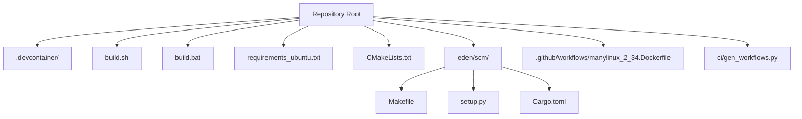
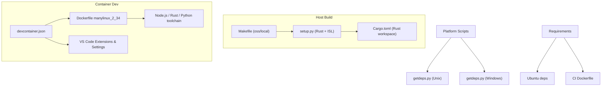
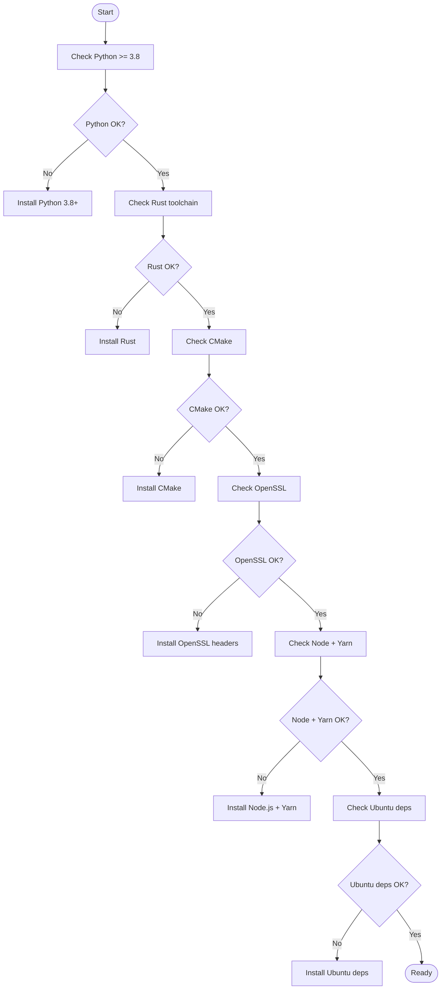
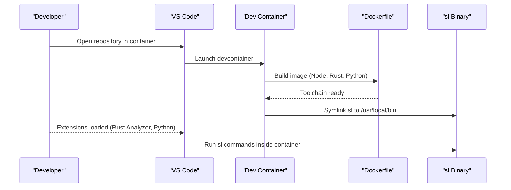
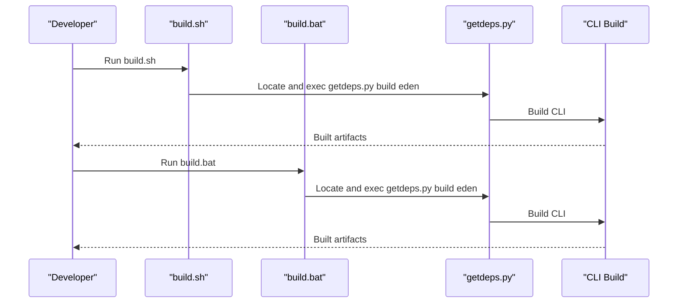
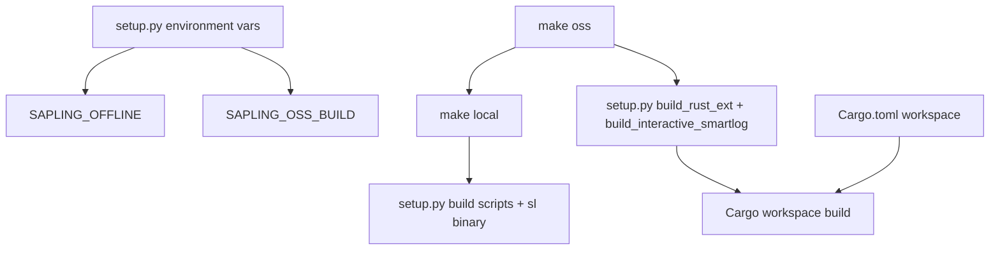
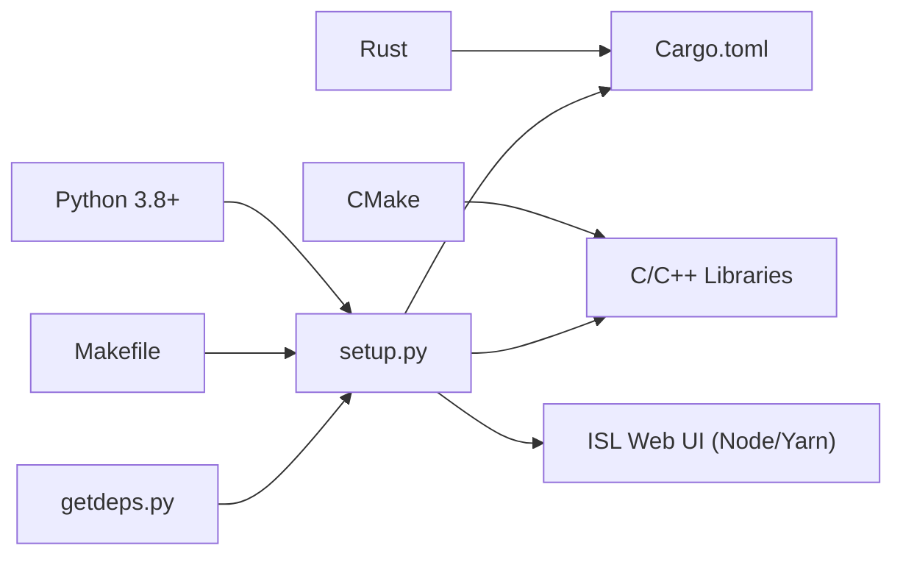

# Development Environment Setup

<cite>
**Referenced Files in This Document**
- [README.md](file://README.md)
- [.devcontainer/devcontainer.json](file://.devcontainer/devcontainer.json)
- [.devcontainer/README.md](file://.devcontainer/README.md)
- [build.sh](file://build.sh)
- [build.bat](file://build.bat)
- [requirements_ubuntu.txt](file://requirements_ubuntu.txt)
- [eden/scm/Makefile](file://eden/scm/Makefile)
- [eden/scm/setup.py](file://eden/scm/setup.py)
- [eden/scm/README.md](file://eden/scm/README.md)
- [CMakeLists.txt](file://CMakeLists.txt)
- [eden/scm/Cargo.toml](file://eden/scm/Cargo.toml)
- [.github/workflows/manylinux_2_34.Dockerfile](file://.github/workflows/manylinux_2_34.Dockerfile)
- [ci/gen_workflows.py](file://ci/gen_workflows.py)
</cite>

## Table of Contents
1. [Introduction](#introduction)
2. [Project Structure](#project-structure)
3. [Core Components](#core-components)
4. [Architecture Overview](#architecture-overview)
5. [Detailed Component Analysis](#detailed-component-analysis)
6. [Dependency Analysis](#dependency-analysis)
7. [Performance Considerations](#performance-considerations)
8. [Troubleshooting Guide](#troubleshooting-guide)
9. [Conclusion](#conclusion)
10. [Appendices](#appendices)

## Introduction
This document explains how to set up a complete development environment for SAPLING SCM. It covers prerequisites, containerized development with devcontainer.json, platform-specific build scripts, platform requirements, environment variables, and common workflows. It also includes verification steps and troubleshooting guidance to help you build and run the Sapling CLI locally across Linux, macOS, and Windows.

## Project Structure
The repository includes multiple complementary mechanisms for building and developing:
- Platform-agnostic build orchestration via Makefile and setup.py in the CLI source tree
- Containerized development using devcontainer.json
- Platform-specific build scripts (build.sh for Unix-like systems, build.bat for Windows)
- Platform requirements and Docker-based CI references
- Rust workspace configuration for the CLI’s Rust crates

**Diagram sources**
- [CMakeLists.txt:1-198](file://CMakeLists.txt#L1-L198)
- [eden/scm/Makefile:1-320](file://eden/scm/Makefile#L1-L320)
- [eden/scm/setup.py:1-800](file://eden/scm/setup.py#L1-L800)
- [eden/scm/Cargo.toml:1-318](file://eden/scm/Cargo.toml#L1-L318)
- [.devcontainer/devcontainer.json:1-23](file://.devcontainer/devcontainer.json#L1-L23)
- [build.sh:1-24](file://build.sh#L1-L24)
- [build.bat:1-18](file://build.bat#L1-L18)
- [requirements_ubuntu.txt:1-9](file://requirements_ubuntu.txt#L1-L9)
- [.github/workflows/manylinux_2_34.Dockerfile:1-34](file://.github/workflows/manylinux_2_34.Dockerfile#L1-L34)
- [ci/gen_workflows.py:101-133](file://ci/gen_workflows.py#L101-L133)

**Section sources**
- [README.md:59-67](file://README.md#L59-L67)
- [eden/scm/README.md:1-54](file://eden/scm/README.md#L1-L54)

## Core Components
- Prerequisites: Python 3.8+, Rust, CMake, OpenSSL, and Node/Yarn for the ISL web UI
- Containerized development: devcontainer.json defines a reproducible Ubuntu-based environment and links the built CLI into the container
- Platform scripts:
  - build.sh: Locates getdeps.py and invokes it to build the eden target on Unix-like systems
  - build.bat: Locates getdeps.py and invokes it to build the eden target on Windows
- Platform requirements:
  - Ubuntu dependencies are listed in requirements_ubuntu.txt
  - CI Dockerfile shows a modern toolchain including Node.js, Rust, and system packages
- Build orchestration:
  - Makefile in eden/scm provides targets for oss, local, install, and tests
  - setup.py integrates Rust extensions and ISL packaging
  - Cargo.toml defines the Rust workspace members

**Section sources**
- [README.md:65-66](file://README.md#L65-L66)
- [.devcontainer/devcontainer.json:1-23](file://.devcontainer/devcontainer.json#L1-L23)
- [build.sh:1-24](file://build.sh#L1-L24)
- [build.bat:1-18](file://build.bat#L1-L18)
- [requirements_ubuntu.txt:1-9](file://requirements_ubuntu.txt#L1-L9)
- [eden/scm/Makefile:88-120](file://eden/scm/Makefile#L88-L120)
- [eden/scm/setup.py:607-656](file://eden/scm/setup.py#L607-L656)
- [eden/scm/Cargo.toml:1-318](file://eden/scm/Cargo.toml#L1-L318)
- [.github/workflows/manylinux_2_34.Dockerfile:1-34](file://.github/workflows/manylinux_2_34.Dockerfile#L1-L34)

## Architecture Overview
The development environment supports two primary workflows:
- Host-based builds using Makefile and setup.py with Rust and Python toolchains
- Containerized builds using devcontainer.json with a preconfigured Ubuntu image

**Diagram sources**
- [eden/scm/Makefile:88-120](file://eden/scm/Makefile#L88-L120)
- [eden/scm/setup.py:607-656](file://eden/scm/setup.py#L607-L656)
- [eden/scm/Cargo.toml:1-318](file://eden/scm/Cargo.toml#L1-L318)
- [.devcontainer/devcontainer.json:1-23](file://.devcontainer/devcontainer.json#L1-L23)
- [.github/workflows/manylinux_2_34.Dockerfile:1-34](file://.github/workflows/manylinux_2_34.Dockerfile#L1-L34)
- [build.sh:1-24](file://build.sh#L1-L24)
- [build.bat:1-18](file://build.bat#L1-L18)
- [requirements_ubuntu.txt:1-9](file://requirements_ubuntu.txt#L1-L9)

## Detailed Component Analysis

### Prerequisite Tools and Platform Requirements
- Python 3.8+ is required for the CLI build
- Rust is required for Rust extensions
- CMake is required for C/C++ components
- OpenSSL is required for cryptographic libraries
- Node and Yarn are required for building the ISL web UI
- Ubuntu dependencies include cmake, g++, build-essential, libssl-dev, make, zlib1g-dev, python3-distutils, pkg-config

**Section sources**
- [README.md:65-66](file://README.md#L65-L66)
- [requirements_ubuntu.txt:1-9](file://requirements_ubuntu.txt#L1-L9)
- [.github/workflows/manylinux_2_34.Dockerfile:1-34](file://.github/workflows/manylinux_2_34.Dockerfile#L1-L34)

### Containerized Development Environment (.devcontainer)
- devcontainer.json builds from a Dockerfile that mirrors CI toolchains
- It sets up VS Code extensions and Rust Analyzer linked to the CLI Cargo.toml
- It symlinks the built sl binary into the container path for immediate use

**Diagram sources**
- [.devcontainer/devcontainer.json:1-23](file://.devcontainer/devcontainer.json#L1-L23)
- [.devcontainer/README.md:1-3](file://.devcontainer/README.md#L1-L3)
- [.github/workflows/manylinux_2_34.Dockerfile:1-34](file://.github/workflows/manylinux_2_34.Dockerfile#L1-L34)

**Section sources**
- [.devcontainer/devcontainer.json:1-23](file://.devcontainer/devcontainer.json#L1-L23)
- [.devcontainer/README.md:1-3](file://.devcontainer/README.md#L1-L3)

### Platform-Specific Build Scripts
- build.sh locates getdeps.py in known locations and executes it to build the eden target on Unix-like systems
- build.bat locates getdeps.py similarly on Windows and invokes it with python3.exe

**Diagram sources**
- [build.sh:1-24](file://build.sh#L1-L24)
- [build.bat:1-18](file://build.bat#L1-L18)

**Section sources**
- [build.sh:1-24](file://build.sh#L1-L24)
- [build.bat:1-18](file://build.bat#L1-L18)

### Platform Requirements Summary
- Ubuntu dependencies: cmake, g++, build-essential, libssl-dev, make, zlib1g-dev, python3-distutils, pkg-config
- CI Dockerfile shows a modern toolchain including Node.js, Rust, and system packages
- CI generation script demonstrates how Node.js is pinned and installed via a PPA

**Section sources**
- [requirements_ubuntu.txt:1-9](file://requirements_ubuntu.txt#L1-L9)
- [.github/workflows/manylinux_2_34.Dockerfile:1-34](file://.github/workflows/manylinux_2_34.Dockerfile#L1-L34)
- [ci/gen_workflows.py:101-133](file://ci/gen_workflows.py#L101-L133)

### Environment Variables and Build Targets
- Makefile targets:
  - oss: Builds the OSS CLI variant and aliases it to the sl binary name
  - local: Builds for in-place usage and prepares the sl binary
  - install: Installs the CLI and related assets
  - tests: Runs the test suite
- setup.py integrates Rust extensions and ISL packaging; it also respects environment variables like SAPLING_OSS_BUILD and SAPLING_OFFLINE
- Cargo.toml defines the Rust workspace and member crates

**Diagram sources**
- [eden/scm/Makefile:88-120](file://eden/scm/Makefile#L88-L120)
- [eden/scm/setup.py:607-656](file://eden/scm/setup.py#L607-L656)
- [eden/scm/Cargo.toml:1-318](file://eden/scm/Cargo.toml#L1-L318)

**Section sources**
- [eden/scm/Makefile:88-120](file://eden/scm/Makefile#L88-L120)
- [eden/scm/setup.py:42-47](file://eden/scm/setup.py#L42-L47)
- [eden/scm/Cargo.toml:1-318](file://eden/scm/Cargo.toml#L1-L318)

### Step-by-Step Setup Instructions
- Install prerequisites:
  - Python 3.8+
  - Rust
  - CMake
  - OpenSSL
  - Node and Yarn
  - On Ubuntu, install the dependencies listed in requirements_ubuntu.txt
- Option A: Use the containerized environment
  - Open the repository in VS Code with the Dev Containers extension
  - The devcontainer.json will build the image and launch the container with the required toolchain
  - The sl binary is symlinked for immediate use
- Option B: Host-based build
  - From the eden/scm directory:
    - Run the oss target to build the CLI
    - Optionally run the local target for in-place usage
    - Verify with the debuginstall target
- Option C: Platform scripts
  - On Unix-like systems, run build.sh to locate and invoke getdeps.py
  - On Windows, run build.bat to locate and invoke getdeps.py

**Section sources**
- [README.md:65-66](file://README.md#L65-L66)
- [requirements_ubuntu.txt:1-9](file://requirements_ubuntu.txt#L1-L9)
- [.devcontainer/devcontainer.json:1-23](file://.devcontainer/devcontainer.json#L1-L23)
- [eden/scm/Makefile:88-120](file://eden/scm/Makefile#L88-L120)
- [build.sh:1-24](file://build.sh#L1-L24)
- [build.bat:1-18](file://build.bat#L1-L18)

### Common Development Workflows
- Build the CLI in OSS mode and run sanity checks
- Iterate on Rust extensions and rebuild as needed
- Package and install the CLI for testing
- Run the test suite to validate changes
- Build the ISL web UI assets when modifying frontend components

**Section sources**
- [eden/scm/README.md:1-54](file://eden/scm/README.md#L1-L54)
- [eden/scm/Makefile:270-276](file://eden/scm/Makefile#L270-L276)
- [eden/scm/setup.py:607-656](file://eden/scm/setup.py#L607-L656)

## Dependency Analysis
The build system ties together Python, Rust, CMake, and platform toolchains. The diagram below shows how the CLI build orchestrator coordinates these components.

**Diagram sources**
- [eden/scm/Makefile:88-120](file://eden/scm/Makefile#L88-L120)
- [eden/scm/setup.py:607-656](file://eden/scm/setup.py#L607-L656)
- [eden/scm/Cargo.toml:1-318](file://eden/scm/Cargo.toml#L1-L318)
- [CMakeLists.txt:1-198](file://CMakeLists.txt#L1-L198)

**Section sources**
- [CMakeLists.txt:1-198](file://CMakeLists.txt#L1-L198)
- [eden/scm/Makefile:88-120](file://eden/scm/Makefile#L88-L120)
- [eden/scm/setup.py:607-656](file://eden/scm/setup.py#L607-L656)
- [eden/scm/Cargo.toml:1-318](file://eden/scm/Cargo.toml#L1-L318)

## Performance Considerations
- Use parallelism flags exposed by the build system (e.g., jobs detection in Makefile) to speed up compilation
- Prefer incremental builds during development by targeting specific components (Rust extensions, Python scripts)
- Keep the containerized environment warm for faster subsequent builds

[No sources needed since this section provides general guidance]

## Troubleshooting Guide
- Missing prerequisites:
  - Ensure Python 3.8+ is installed and on PATH
  - Ensure Rust toolchain is installed and up to date
  - Ensure CMake and OpenSSL are installed
  - On Ubuntu, install the dependencies listed in requirements_ubuntu.txt
- Container build issues:
  - Verify the devcontainer.json is correctly configured and the Docker image builds
  - Confirm VS Code Dev Containers extension is installed
- Platform scripts:
  - On Unix-like systems, ensure build.sh can locate getdeps.py in the expected paths
  - On Windows, ensure build.bat can locate getdeps.py and uses python3.exe
- Build failures:
  - Review the Makefile targets and ensure you are using the correct variant (oss vs local)
  - Check setup.py environment variables (SAPLING_OSS_BUILD, SAPLING_OFFLINE) if building in constrained environments
- Verification:
  - After building, run the debuginstall target to verify the CLI installation
  - Confirm the sl binary is executable and responds to --version

**Section sources**
- [README.md:65-66](file://README.md#L65-L66)
- [requirements_ubuntu.txt:1-9](file://requirements_ubuntu.txt#L1-L9)
- [.devcontainer/devcontainer.json:1-23](file://.devcontainer/devcontainer.json#L1-L23)
- [build.sh:1-24](file://build.sh#L1-L24)
- [build.bat:1-18](file://build.bat#L1-L18)
- [eden/scm/Makefile:88-120](file://eden/scm/Makefile#L88-L120)
- [eden/scm/setup.py:42-47](file://eden/scm/setup.py#L42-L47)

## Conclusion
You can develop SAPLING SCM effectively using either a containerized environment or a host-based setup. The prerequisites are standard for a modern cross-platform build: Python, Rust, CMake, OpenSSL, and Node/Yarn. The repository provides platform scripts and Makefile targets to streamline building the CLI and its Rust/Python components, along with a devcontainer.json for consistent local development.

[No sources needed since this section summarizes without analyzing specific files]

## Appendices

### Appendix A: Environment Variables Reference
- SAPLING_OSS_BUILD: Enables OSS-only build mode in setup.py
- SAPLING_OFFLINE: Skips downloading certain third-party dependencies in setup.py
- GETDEPS_BUILD_DIR / GETDEPS_INSTALL_DIR: Directories used by getdeps.py during builds
- HGNAME: Controls the binary name used for the CLI
- FB_HGEXT_CDEBUG: Compiles C extensions with debug flags for easier debugging

**Section sources**
- [eden/scm/setup.py:42-47](file://eden/scm/setup.py#L42-L47)
- [eden/scm/setup.py:92-107](file://eden/scm/setup.py#L92-L107)
- [eden/scm/Makefile:208-211](file://eden/scm/Makefile#L208-L211)
- [eden/scm/Makefile:123-125](file://eden/scm/Makefile#L123-L125)