# Integration Testing

<cite>
**Referenced Files in This Document**
- [README.md](file://eden/integration/README.md)
- [basic_test.py](file://eden/integration/basic_test.py)
- [clone_test.py](file://eden/integration/clone_test.py)
- [config_test.py](file://eden/integration/config_test.py)
- [help_test.py](file://eden/integration/help_test.py)
- [info_test.py](file://eden/integration/info_test.py)
- [stats_test.py](file://eden/integration/stats_test.py)
- [health_test.py](file://eden/integration/health_test.py)
- [debug_test.py](file://eden/integration/debug_test.py)
- [debug_getpath_test.py](file://eden/integration/debug_getpath_test.py)
- [debug_subscribe_test.py](file://eden/integration/debug_subscribe_test.py)
- [eden_cli_smoke_test.py](file://eden/integration/eden_cli_smoke_test.py)
- [edenclient_test.py](file://eden/integration/edenclient_test.py)
- [mount_test.py](file://eden/integration/mount_test.py)
- [unmount_test.py](file://eden/integration/unmount_test.py)
- [start_test.py](file://eden/integration/start_test.py)
- [stop_test.py](file://eden/integration/stop_test.py)
- [restart_test.py](file://eden/integration/restart_test.py)
- [invalidate_test.py](file://eden/integration/invalidate_test.py)
- [takeover_test.py](file://eden/integration/takeover_test.py)
- [remount_test.py](file://eden/integration/remount_test.py)
- [redirect_test.py](file://eden/integration/redirect_test.py)
- [long_path_test.py](file://eden/integration/long_path_test.py)
- [unicode_test.py](file://eden/integration/unicode_test.py)
- [glob_test.py](file://eden/integration/glob_test.py)
- [changes_test.py](file://eden/integration/changes_test.py)
- [patch_test.py](file://eden/integration/patch_test.py)
- [remove_test.py](file://eden/integration/remove_test.py)
- [rename_test.py](file://eden/integration/rename_test.py)
- [unlink_test.py](file://eden/integration/unlink_test.py)
- [mkdir_test.py](file://eden/integration/mkdir_test.py)
- [setattr_test.py](file://eden/integration/setattr_test.py)
- [chown_test.py](file://eden/integration/chown_test.py)
- [oexcl_test.py](file://eden/integration/oexcl_test.py)
- [xattr_test.py](file://eden/integration/xattr_test.py)
- [notify_test.py](file://eden/integration/notify_test.py)
- [rc_test.py](file://eden/integration/rc_test.py)
- [service_log_test.py](file://eden/integration/service_log_test.py)
- [unixsocket_test.py](file://eden/integration/unixsocket_test.py)
- [thrift_test.py](file://eden/integration/thrift_test.py)
- [fsck_test.py](file://eden/integration/fsck_test.py)
- [corrupt_overlay_test.py](file://eden/integration/corrupt_overlay_test.py)
- [legacyephemeral_cleanup_test.py](file://eden/integration/legacyephemeral_cleanup_test.py)
- [stale_test.py](file://eden/integration/stale_test.py)
- [stale_inode_test.py](file://eden/integration/stale_inode_test.py)
- [lock_test.py](file://eden/integration/lock_test.py)
- [eden_lock_test.py](file://eden/integration/eden_lock_test.py)
- [cancellation_test.py](file://eden/integration/cancellation_test.py)
- [rage_test.py](file://eden/integration/rage_test.py)
- [windows_fsck_test.py](file://eden/integration/windows_fsck_test.py)
- [materialized_query_test.py](file://eden/integration/materialized_query_test.py)
- [prjfs_match_fs.py](file://eden/integration/prjfs_match_fs.py)
- [prjfs_stress.py](file://eden/integration/prjfs_stress.py)
- [projfs_buffer.py](file://eden/integration/projfs_buffer.py)
- [projfs_enumeration.py](file://eden/integration/projfs_enumeration.py)
- [use_case_test.py](file://eden/integration/use_case_test.py)
- [userinfo_test.py](file://eden/integration/userinfo_test.py)
- [doteden_test.py](file://eden/integration/doteden_test.py)
- [sed_test.py](file://eden/integration/sed_test.py)
- [mmap_test.py](file://eden/integration/mmap_test.py)
- [readdir_test.py](file://eden/integration/readdir_test.py)
- [du_test.py](file://eden/integration/du_test.py)
- [casing_test.py](file://eden/integration/casing_test.py)
- [blobstore_sync_queue](file://eden/mononoke/blobstore_sync_queue)
- [blobstore](file://eden/mononoke/blobstore)
- [blobrepo](file://eden/mononoke/blobrepo)
- [blobrepo_utils](file://eden/mononoke/blobrepo_utils)
- [clients_scs](file://eden/mononoke/clients/scs)
- [cmdlib](file://eden/mononoke/cmdlib)
- [common](file://eden/mononoke/common)
- [derived_data](file://eden/mononoke/derived_data)
- [features](file://eden/mononoke/features)
- [git](file://eden/mononoke/git)
- [jobs](file://eden/mononoke/jobs)
- [lfs_import_lib](file://eden/mononoke/lfs_import_lib)
- [manifest](file://eden/mononoke/manifest)
- [megarepo_api](file://eden/mononoke/megarepo_api)
- [mercurial](file://eden/mononoke/mercurial)
- [metaconfig](file://eden/mononoke/metaconfig)
- [mononoke_api](file://eden/mononoke/mononoke_api)
- [mononoke_api_hg](file://eden/mononoke/mononoke_api_hg)
- [mononoke_types](file://eden/mononoke/mononoke_types)
- [repo_attributes](file://eden/mononoke/repo_attributes)
- [repo_authorization](file://eden/mononoke/repo_authorization)
- [repo_client](file://eden/mononoke/repo_client)
- [repo_factory](file://eden/mononoke/repo_factory)
- [scs_if](file://eden/mononoke/scs/if)
- [servers](file://eden/mononoke/servers)
- [tests](file://eden/mononoke/tests)
- [third_party](file://eden/mononoke/third_party)
- [tools](file://eden/mononoke/tools)
- [test_support](file://eden/test_support)
- [testharness](file://eden/fs/testharness)
- [environment_variable.py](file://eden/test_support/environment_variable.py)
- [temporary_directory.py](file://eden/test_support/temporary_directory.py)
- [testcase.py](file://eden/test_support/testcase.py)
- [setupTests.ts](file://addons/isl/src/__tests__/setupTests.ts)
- [jest.config.cjs](file://addons/isl/src/__tests__/integration.jest.config.ts)
- [setup.tsx](file://addons/isl/integrationTests/setup.tsx)
- [setupTests.ts](file://addons/isl/integrationTests/setupTests.ts)
- [README.md](file://addons/isl/integrationTests/README.md)
- [commits.test.tsx](file://addons/isl/integrationTests/commits.test.tsx)
- [mergeConflicts.test.tsx](file://addons/isl/integrationTests/mergeConflicts.test.tsx)
- [mergeConflictsMultiple.test.tsx](file://addons/isl/integrationTests/mergeConflictsMultiple.test.tsx)
- [uncommittedChanges.test.tsx](file://addons/isl/integrationTests/uncommittedChanges.test.tsx)
- [ejeca.test.tsx](file://addons/isl/integrationTests/ejeca.test.tsx)
</cite>

## Table of Contents
1. [Introduction](#introduction)
2. [Project Structure](#project-structure)
3. [Core Components](#core-components)
4. [Architecture Overview](#architecture-overview)
5. [Detailed Component Analysis](#detailed-component-analysis)
6. [Dependency Analysis](#dependency-analysis)
7. [Performance Considerations](#performance-considerations)
8. [Troubleshooting Guide](#troubleshooting-guide)
9. [Conclusion](#conclusion)
10. [Appendices](#appendices)

## Introduction
This document describes the integration testing framework for SAPLING SCM within the Eden ecosystem. It focuses on Python-based integration tests that validate end-to-end functionality across the CLI, server, and filesystem layers. The tests exercise repository operations, filesystem interactions, and server–client communication using a structured test harness, mock repositories, and utilities for environment management. Guidance is provided for writing, running, and debugging integration tests, along with examples of testing CLI commands, server responses, and filesystem operations.

## Project Structure
The integration tests are primarily organized under the Eden integration suite. The repository includes:
- A dedicated integration test suite for CLI and filesystem behaviors
- Supporting test harness and utilities for environment setup and lifecycle management
- Additional integration tests for frontend and server components in the addons module

Key areas:
- eden/integration: Python integration tests for CLI, filesystem, and server behaviors
- eden/test_support: Environment variable management, temporary directories, and base test case
- eden/fs/testharness: Filesystem-level test harness utilities
- addons/isl: Frontend and server-side integration tests for the ISL application
- eden/mononoke: Backend server and repository services used by integration tests

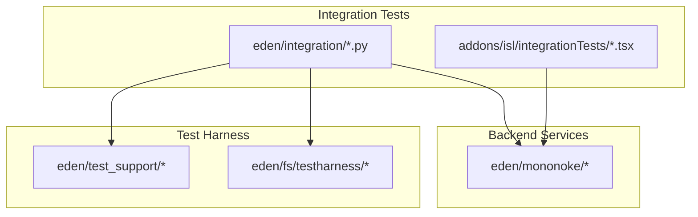

**Section sources**
- [README.md:1-87](file://eden/integration/README.md#L1-L87)

## Core Components
The integration testing framework comprises:
- Test harness and base classes for environment setup and lifecycle
- Utilities for managing temporary directories and environment variables
- CLI wrappers and helpers to invoke repository commands and validate outputs
- Mock repositories and backing repository population routines
- Server and client integration points for backend services

Key capabilities:
- Repository initialization via backing repository population
- CLI invocation with controlled environment and optional input
- Filesystem checks and validations for materialized and cached content
- Server logging configuration for diagnostics during test runs
- Cleanup and teardown procedures to ensure test isolation

**Section sources**
- [README.md:13-87](file://eden/integration/README.md#L13-L87)
- [test_support](file://eden/test_support)
- [testharness](file://eden/fs/testharness)

## Architecture Overview
The integration tests orchestrate interactions among the CLI, the Eden filesystem, and backend services. The typical flow involves:
- Preparing a backing repository with initial content
- Mounting the repository under test
- Executing CLI commands through the test harness
- Observing filesystem materialization and server responses
- Validating outcomes against expected states

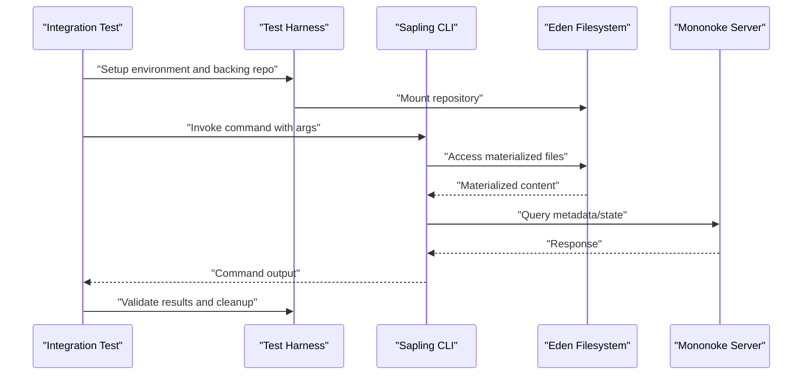

[No sources needed since this diagram shows conceptual workflow, not actual code structure]

## Detailed Component Analysis

### Test Harness and Environment Management
The test harness provides:
- Base test case classes for setting up and tearing down test environments
- Temporary directory management for isolated test runs
- Environment variable controls for configuring runtime behavior

Capabilities:
- Initialize and clean up temporary directories
- Configure environment variables for specific test scenarios
- Provide base classes for CLI and filesystem tests

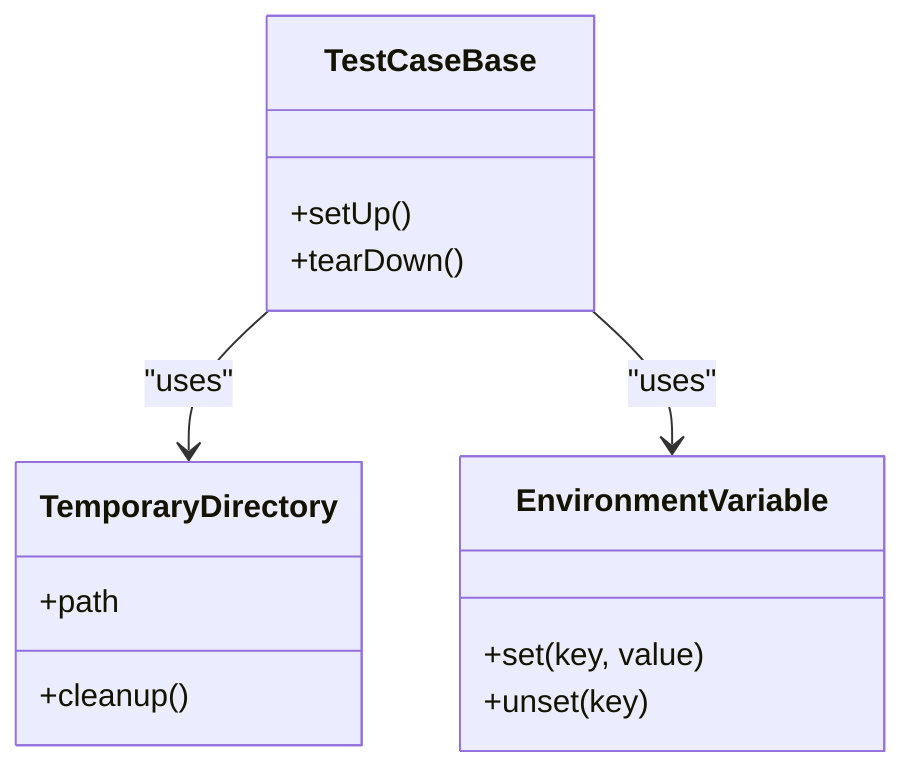

**Section sources**
- [testcase.py](file://eden/test_support/testcase.py)
- [temporary_directory.py](file://eden/test_support/temporary_directory.py)
- [environment_variable.py](file://eden/test_support/environment_variable.py)

### Backing Repository Population
Each integration test defines an initial repository state by implementing a population routine. This routine creates files and directories in a backing repository, which is later mounted for testing.

Typical steps:
- Create initial file hierarchy
- Stage and commit baseline content
- Prepare branches or special states as needed

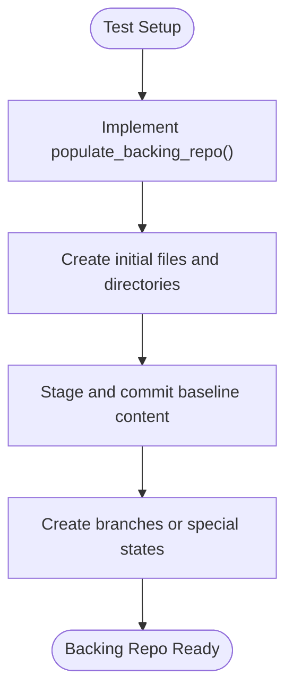

**Section sources**
- [README.md:26-40](file://eden/integration/README.md#L26-L40)

### CLI Invocation and Validation
Tests invoke the CLI through helper methods that:
- Accept arguments and optional input streams
- Set encoding and working directory
- Capture command output and exit status
- Optionally enforce error conditions

Common usage patterns:
- Run commands with controlled environment
- Validate stdout/stderr and return codes
- Inject editor or input prompts when required

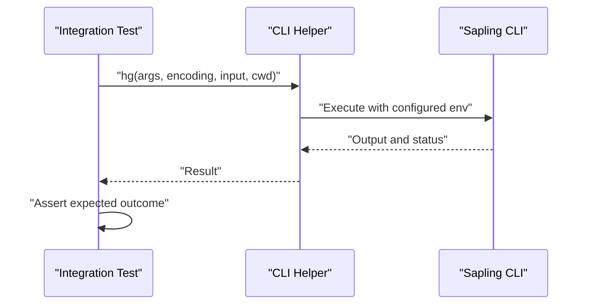

**Section sources**
- [README.md:36-50](file://eden/integration/README.md#L36-L50)

### Server Logging and Diagnostics
For diagnosing backend behavior, tests can override logging settings to increase verbosity for specific subsystems.

Typical approach:
- Override logging configuration in test class
- Enable detailed logs for filesystem and checkout actions

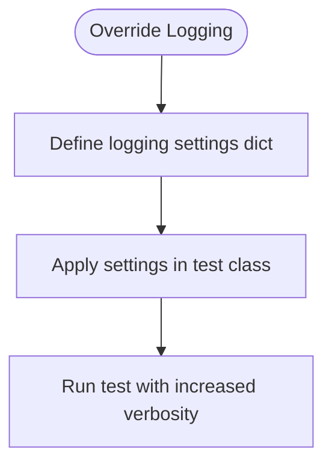

**Section sources**
- [README.md:73-87](file://eden/integration/README.md#L73-L87)

### Example Test Scenarios

#### Repository Operations
- Clone: Validates repository cloning and initial checkout
- Config: Verifies configuration retrieval and updates
- Help: Ensures help text is available and formatted correctly
- Info: Confirms repository metadata and status reporting
- Stats: Checks statistics and counters exposed by the repository
- Health: Validates repository health checks and consistency

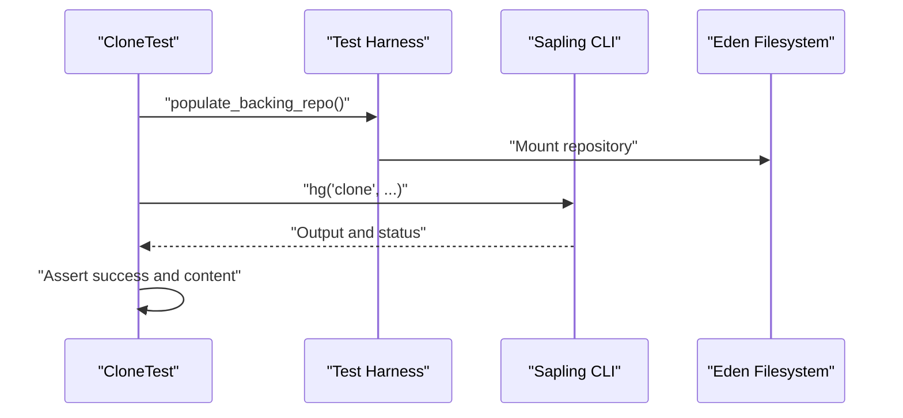

**Section sources**
- [clone_test.py](file://eden/integration/clone_test.py)
- [config_test.py](file://eden/integration/config_test.py)
- [help_test.py](file://eden/integration/help_test.py)
- [info_test.py](file://eden/integration/info_test.py)
- [stats_test.py](file://eden/integration/stats_test.py)
- [health_test.py](file://eden/integration/health_test.py)

#### Filesystem Interactions
- Mount/Unmount: Validates mount lifecycle and unmount behavior
- Start/Stop/Restart: Ensures service lifecycle operations
- Invalidate: Tests cache invalidation and refresh
- Takeover/Remount/Redirect: Exercises advanced mount management
- Long Path/Unicode/Globbing: Validates path handling and pattern matching
- Changes/Patch/Remove/Rename/Unlink: Tests file operations
- Mkdir/Setattr/Chown/OEXCL/XAttr: Validates metadata and permissions
- Notify/RC/Service Log/Unix Socket/Thrift: Verifies IPC and service integration
- FSCK/Corruption/Legacy Ephemeral/Cleanup/Stale/Lock: Validates integrity and cleanup

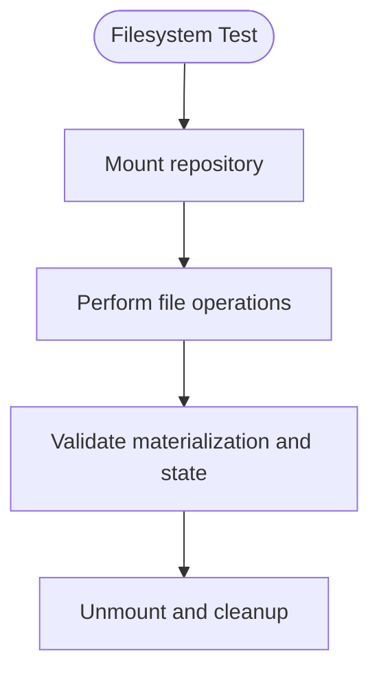

**Section sources**
- [mount_test.py](file://eden/integration/mount_test.py)
- [unmount_test.py](file://eden/integration/unmount_test.py)
- [start_test.py](file://eden/integration/start_test.py)
- [stop_test.py](file://eden/integration/stop_test.py)
- [restart_test.py](file://eden/integration/restart_test.py)
- [invalidate_test.py](file://eden/integration/invalidate_test.py)
- [takeover_test.py](file://eden/integration/takeover_test.py)
- [remount_test.py](file://eden/integration/remount_test.py)
- [redirect_test.py](file://eden/integration/redirect_test.py)
- [long_path_test.py](file://eden/integration/long_path_test.py)
- [unicode_test.py](file://eden/integration/unicode_test.py)
- [glob_test.py](file://eden/integration/glob_test.py)
- [changes_test.py](file://eden/integration/changes_test.py)
- [patch_test.py](file://eden/integration/patch_test.py)
- [remove_test.py](file://eden/integration/remove_test.py)
- [rename_test.py](file://eden/integration/rename_test.py)
- [unlink_test.py](file://eden/integration/unlink_test.py)
- [mkdir_test.py](file://eden/integration/mkdir_test.py)
- [setattr_test.py](file://eden/integration/setattr_test.py)
- [chown_test.py](file://eden/integration/chown_test.py)
- [oexcl_test.py](file://eden/integration/oexcl_test.py)
- [xattr_test.py](file://eden/integration/xattr_test.py)
- [notify_test.py](file://eden/integration/notify_test.py)
- [rc_test.py](file://eden/integration/rc_test.py)
- [service_log_test.py](file://eden/integration/service_log_test.py)
- [unixsocket_test.py](file://eden/integration/unixsocket_test.py)
- [thrift_test.py](file://eden/integration/thrift_test.py)
- [fsck_test.py](file://eden/integration/fsck_test.py)
- [corrupt_overlay_test.py](file://eden/integration/corrupt_overlay_test.py)
- [legacyephemeral_cleanup_test.py](file://eden/integration/legacyephemeral_cleanup_test.py)
- [stale_test.py](file://eden/integration/stale_test.py)
- [stale_inode_test.py](file://eden/integration/stale_inode_test.py)
- [lock_test.py](file://eden/integration/lock_test.py)
- [eden_lock_test.py](file://eden/integration/eden_lock_test.py)
- [cancellation_test.py](file://eden/integration/cancellation_test.py)
- [rage_test.py](file://eden/integration/rage_test.py)
- [windows_fsck_test.py](file://eden/integration/windows_fsck_test.py)
- [materialized_query_test.py](file://eden/integration/materialized_query_test.py)
- [prjfs_match_fs.py](file://eden/integration/prjfs_match_fs.py)
- [prjfs_stress.py](file://eden/integration/prjfs_stress.py)
- [projfs_buffer.py](file://eden/integration/projfs_buffer.py)
- [projfs_enumeration.py](file://eden/integration/projfs_enumeration.py)
- [use_case_test.py](file://eden/integration/use_case_test.py)
- [userinfo_test.py](file://eden/integration/userinfo_test.py)
- [doteden_test.py](file://eden/integration/doteden_test.py)
- [sed_test.py](file://eden/integration/sed_test.py)
- [mmap_test.py](file://eden/integration/mmap_test.py)
- [readdir_test.py](file://eden/integration/readdir_test.py)
- [du_test.py](file://eden/integration/du_test.py)
- [casing_test.py](file://eden/integration/casing_test.py)

#### Server–Client Communication
- Thrift APIs: Validates backend service connectivity and response correctness
- Unix socket communication: Ensures IPC channels operate as expected
- Service logs: Verifies log emission and filtering during operations

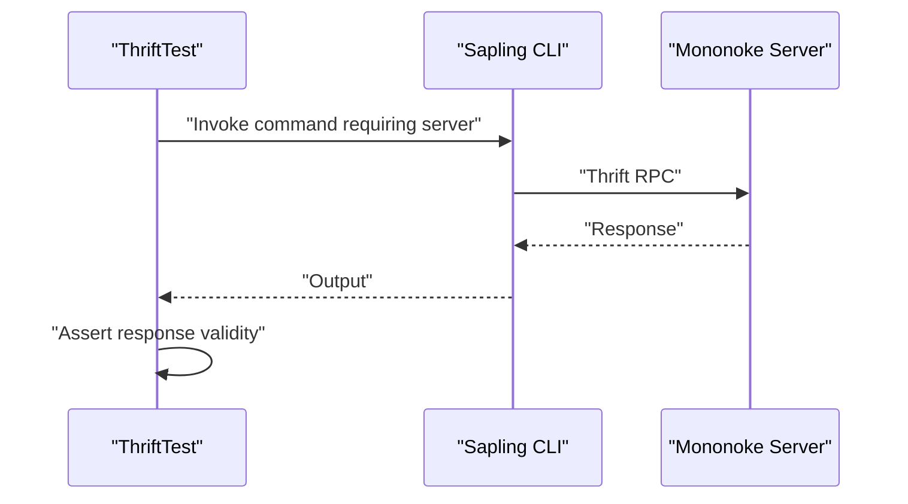

**Section sources**
- [thrift_test.py](file://eden/integration/thrift_test.py)
- [unixsocket_test.py](file://eden/integration/unixsocket_test.py)
- [service_log_test.py](file://eden/integration/service_log_test.py)

### Frontend and Server Integration (ISL)
The ISL integration tests validate end-to-end workflows in the browser/IDE environment, including:
- Commit history and diffs
- Merge conflict resolution
- Uncommitted changes detection
- EJECAs and related operations

These tests rely on Jest configuration and setup utilities to manage test environments and fixtures.

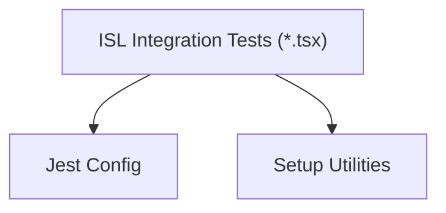

**Section sources**
- [README.md](file://addons/isl/integrationTests/README.md)
- [jest.config.cjs](file://addons/isl/src/__tests__/integration.jest.config.ts)
- [setup.tsx](file://addons/isl/integrationTests/setup.tsx)
- [setupTests.ts](file://addons/isl/integrationTests/setupTests.ts)
- [commits.test.tsx](file://addons/isl/integrationTests/commits.test.tsx)
- [mergeConflicts.test.tsx](file://addons/isl/integrationTests/mergeConflicts.test.tsx)
- [mergeConflictsMultiple.test.tsx](file://addons/isl/integrationTests/mergeConflictsMultiple.test.tsx)
- [uncommittedChanges.test.tsx](file://addons/isl/integrationTests/uncommittedChanges.test.tsx)
- [ejeca.test.tsx](file://addons/isl/integrationTests/ejeca.test.tsx)

## Dependency Analysis
Integration tests depend on:
- Test harness utilities for environment setup and cleanup
- Backend services for repository operations and metadata
- Filesystem layer for materialization and caching behavior
- CLI wrappers for invoking commands and capturing output

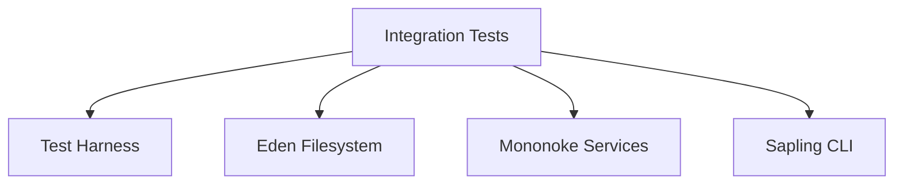

**Section sources**
- [README.md:1-87](file://eden/integration/README.md#L1-L87)
- [test_support](file://eden/test_support)
- [testharness](file://eden/fs/testharness)

## Performance Considerations
- Minimize repeated filesystem operations by reusing backing repositories where appropriate
- Use targeted logging to reduce overhead during normal runs
- Parallelize independent tests to improve throughput while ensuring isolation
- Profile server interactions to identify bottlenecks in IPC or RPC calls

[No sources needed since this section provides general guidance]

## Troubleshooting Guide
Common issues and resolutions:
- Excessive logging: Adjust logging settings in test classes to reduce noise
- Environment inconsistencies: Use temporary directories and environment variable helpers to isolate tests
- Backend service failures: Verify server availability and IPC channels (sockets, Thrift)
- Filesystem anomalies: Validate mount state and materialization behavior after operations

Debugging tips:
- Increase logging verbosity for specific subsystems
- Capture and compare command outputs and statuses
- Inspect repository state and metadata after operations

**Section sources**
- [README.md:73-87](file://eden/integration/README.md#L73-L87)
- [testcase.py](file://eden/test_support/testcase.py)
- [temporary_directory.py](file://eden/test_support/temporary_directory.py)
- [environment_variable.py](file://eden/test_support/environment_variable.py)

## Conclusion
The integration testing framework for SAPLING SCM provides a robust foundation for validating end-to-end behavior across CLI, filesystem, and server components. By leveraging a structured test harness, mock repositories, and comprehensive utilities, teams can reliably test repository operations, filesystem interactions, and server–client communication. The guidance and examples in this document support consistent test authoring, execution, and maintenance across the project.

## Appendices

### Running Integration Tests
- Use the documented commands to run specific tests or groups of tests
- Leverage regex matching to target individual test cases
- Combine variant-specific runs with exact test selection for reproducible results

**Section sources**
- [README.md:52-72](file://eden/integration/README.md#L52-L72)

### Test Data Management
- Populate backing repositories deterministically for reproducible outcomes
- Manage test data in temporary directories to avoid cross-test contamination
- Clean up artifacts after test completion to maintain a pristine environment

**Section sources**
- [README.md:26-40](file://eden/integration/README.md#L26-L40)
- [temporary_directory.py](file://eden/test_support/temporary_directory.py)

### Edge Cases and Error Conditions
- Validate error handling for corrupted overlays, stale mounts, and lock contention
- Exercise cancellation and interruption scenarios
- Test cleanup procedures for legacy ephemeral states

**Section sources**
- [corrupt_overlay_test.py](file://eden/integration/corrupt_overlay_test.py)
- [stale_test.py](file://eden/integration/stale_test.py)
- [stale_inode_test.py](file://eden/integration/stale_inode_test.py)
- [lock_test.py](file://eden/integration/lock_test.py)
- [eden_lock_test.py](file://eden/integration/eden_lock_test.py)
- [cancellation_test.py](file://eden/integration/cancellation_test.py)
- [legacyephemeral_cleanup_test.py](file://eden/integration/legacyephemeral_cleanup_test.py)