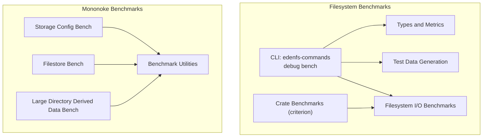
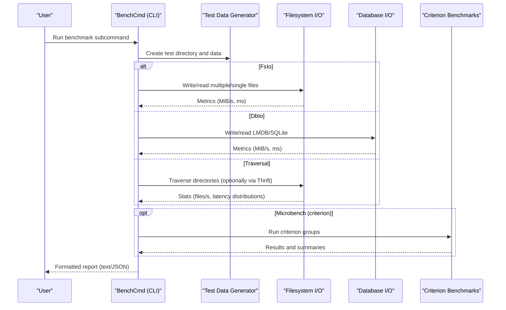
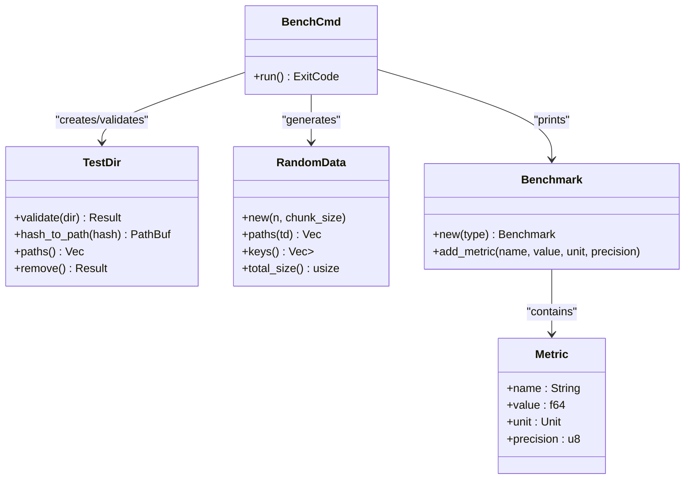
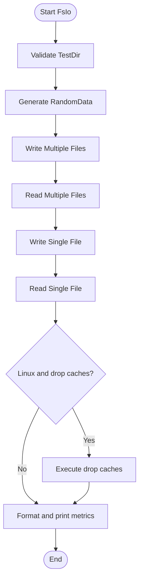
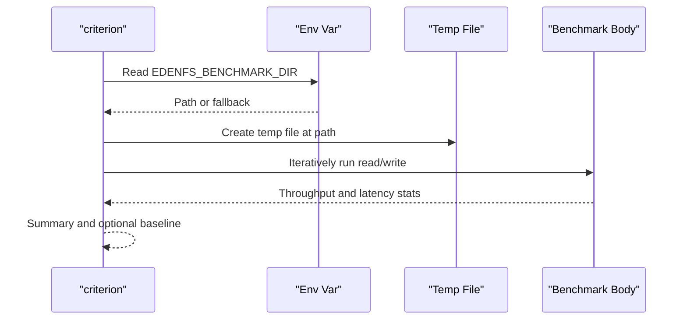
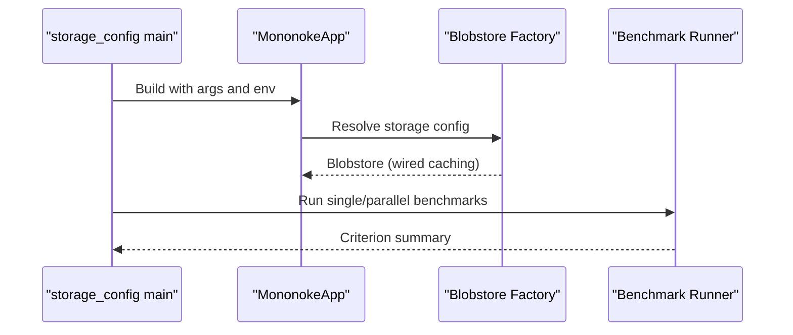
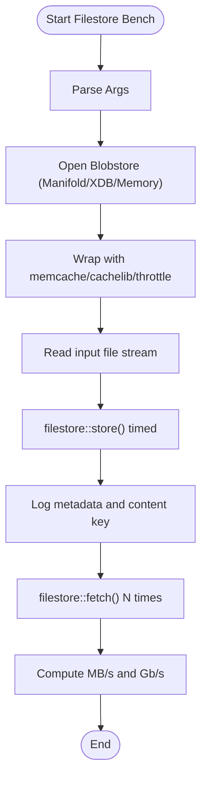
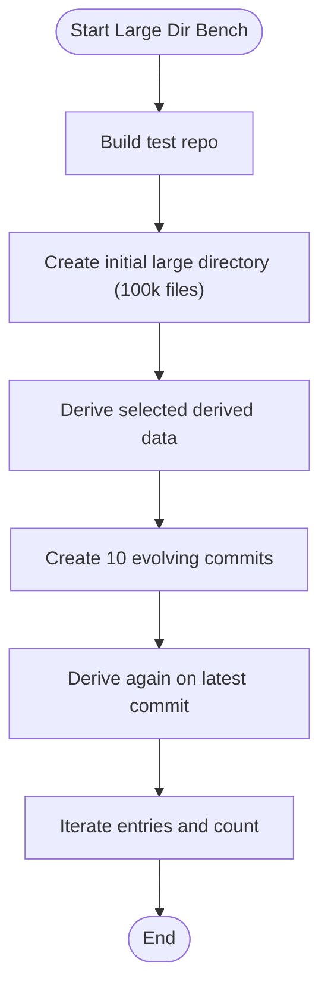
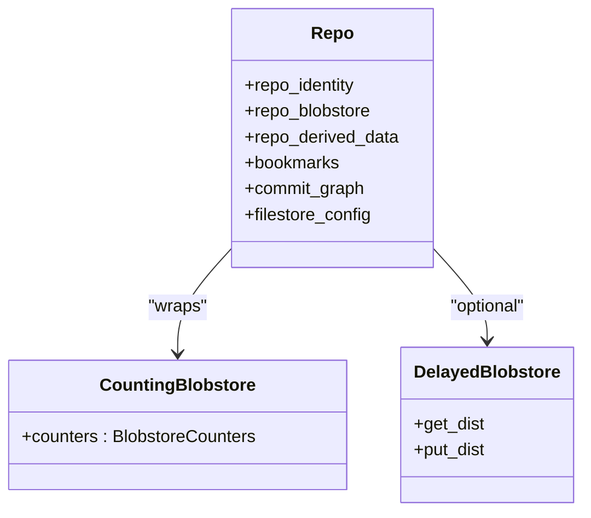
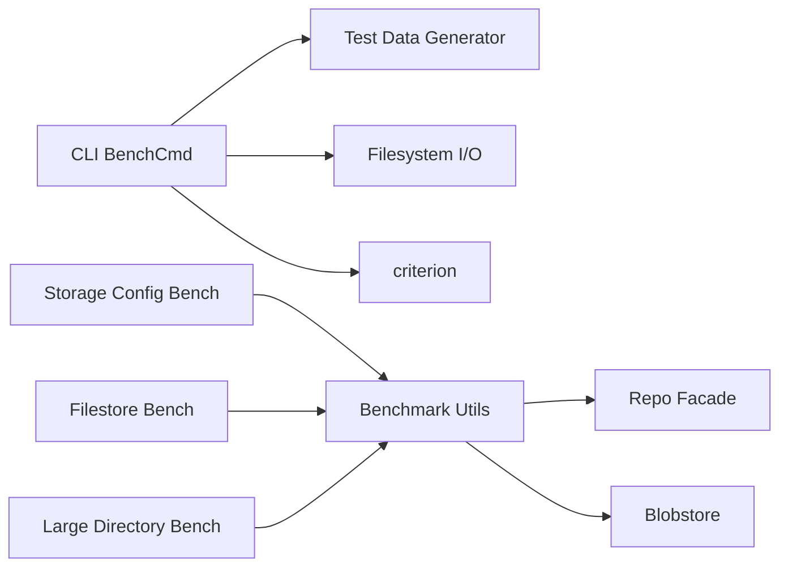

# Performance and Benchmark Testing

<cite>
**Referenced Files in This Document**
- [benchmarks.rs](file://eden/fs/benchmarks/benchmarks.rs)
- [fsio.rs](file://eden/fs/cli_rs/edenfs-commands/src/debug/bench/fsio.rs)
- [gen.rs](file://eden/fs/cli_rs/edenfs-commands/src/debug/bench/gen.rs)
- [cmd.rs](file://eden/fs/cli_rs/edenfs-commands/src/debug/bench/cmd.rs)
- [types.rs](file://eden/fs/cli_rs/edenfs-commands/src/debug/bench/types.rs)
- [benchmark_utils.rs](file://eden/mononoke/benchmarks/derived_data/benchmark_utils.rs)
- [main.rs (storage_config)](file://eden/mononoke/benchmarks/storage_config/src/main.rs)
- [main.rs (filestore)](file://eden/mononoke/benchmarks/filestore/benchmark_filestore.rs)
- [benchmark_large_directory.rs](file://eden/mononoke/benchmarks/derived_data/benchmark_large_directory.rs)
</cite>

## Table of Contents
1. [Introduction](#introduction)
2. [Project Structure](#project-structure)
3. [Core Components](#core-components)
4. [Architecture Overview](#architecture-overview)
5. [Detailed Component Analysis](#detailed-component-analysis)
6. [Dependency Analysis](#dependency-analysis)
7. [Performance Considerations](#performance-considerations)
8. [Troubleshooting Guide](#troubleshooting-guide)
9. [Conclusion](#conclusion)
10. [Appendices](#appendices)

## Introduction
This document describes the performance and benchmark testing capabilities in SAPLING SCM with a focus on the Rust-based suites that measure filesystem performance, caching efficiency, and system throughput. It explains benchmark methodologies, metrics collection, and comparison strategies. It also covers filesystem benchmarks (file operations, cache performance, and glob pattern matching), execution workflows, statistical analysis, regression detection, and practical guidance for measuring lazy loading performance, memory usage, and concurrent access patterns.

## Project Structure
The performance testing ecosystem spans two primary areas:
- Filesystem microbenchmarks and CLI-driven benchmarks for OS-native filesystems and database-backed stores
- Mononoke-derived-data and storage-config benchmarks for blobstore and filestore performance

**Diagram sources**
- [cmd.rs:22-145](file://eden/fs/cli_rs/edenfs-commands/src/debug/bench/cmd.rs#L22-L145)
- [types.rs:27-137](file://eden/fs/cli_rs/edenfs-commands/src/debug/bench/types.rs#L27-L137)
- [gen.rs:21-139](file://eden/fs/cli_rs/edenfs-commands/src/debug/bench/gen.rs#L21-L139)
- [fsio.rs:29-248](file://eden/fs/cli_rs/edenfs-commands/src/debug/bench/fsio.rs#L29-L248)
- [benchmarks.rs:140-240](file://eden/fs/benchmarks/benchmarks.rs#L140-L240)
- [main.rs (storage_config):55-149](file://eden/mononoke/benchmarks/storage_config/src/main.rs#L55-L149)
- [main.rs (filestore):56-396](file://eden/mononoke/benchmarks/filestore/benchmark_filestore.rs#L56-L396)
- [benchmark_utils.rs:47-106](file://eden/mononoke/benchmarks/derived_data/benchmark_utils.rs#L47-L106)
- [benchmark_large_directory.rs:89-364](file://eden/mononoke/benchmarks/derived_data/benchmark_large_directory.rs#L89-L364)

**Section sources**
- [cmd.rs:22-145](file://eden/fs/cli_rs/edenfs-commands/src/debug/bench/cmd.rs#L22-L145)
- [types.rs:27-137](file://eden/fs/cli_rs/edenfs-commands/src/debug/bench/types.rs#L27-L137)
- [gen.rs:21-139](file://eden/fs/cli_rs/edenfs-commands/src/debug/bench/gen.rs#L21-L139)
- [fsio.rs:29-248](file://eden/fs/cli_rs/edenfs-commands/src/debug/bench/fsio.rs#L29-L248)
- [benchmarks.rs:140-240](file://eden/fs/benchmarks/benchmarks.rs#L140-L240)
- [main.rs (storage_config):55-149](file://eden/mononoke/benchmarks/storage_config/src/main.rs#L55-L149)
- [main.rs (filestore):56-396](file://eden/mononoke/benchmarks/filestore/benchmark_filestore.rs#L56-L396)
- [benchmark_utils.rs:47-106](file://eden/mononoke/benchmarks/derived_data/benchmark_utils.rs#L47-L106)
- [benchmark_large_directory.rs:89-364](file://eden/mononoke/benchmarks/derived_data/benchmark_large_directory.rs#L89-L364)

## Core Components
- CLI-driven filesystem benchmarks: Provides subcommands to benchmark filesystem I/O, database I/O, and traversal. It generates synthetic test data, runs operations, and prints structured metrics.
- Criterion-based microbenchmarks: Measures low-level throughput and latency for direct I/O patterns with configurable bypasses and environment controls.
- Mononoke storage and derived-data benchmarks: Benchmarks blobstore/filestore performance and derived-data computation on large directory workloads.

Key capabilities:
- Throughput metrics (MiB/s, files/s)
- Latency metrics (ms)
- Optional kernel cache dropping on Linux
- Structured reporting and JSON output
- Baseline comparisons and filtering

**Section sources**
- [cmd.rs:22-145](file://eden/fs/cli_rs/edenfs-commands/src/debug/bench/cmd.rs#L22-L145)
- [types.rs:27-137](file://eden/fs/cli_rs/edenfs-commands/src/debug/bench/types.rs#L27-L137)
- [fsio.rs:29-248](file://eden/fs/cli_rs/edenfs-commands/src/debug/bench/fsio.rs#L29-L248)
- [benchmarks.rs:140-240](file://eden/fs/benchmarks/benchmarks.rs#L140-L240)
- [main.rs (storage_config):55-149](file://eden/mononoke/benchmarks/storage_config/src/main.rs#L55-L149)
- [main.rs (filestore):56-396](file://eden/mononoke/benchmarks/filestore/benchmark_filestore.rs#L56-L396)
- [benchmark_utils.rs:47-106](file://eden/mononoke/benchmarks/derived_data/benchmark_utils.rs#L47-L106)
- [benchmark_large_directory.rs:89-364](file://eden/mononoke/benchmarks/derived_data/benchmark_large_directory.rs#L89-L364)

## Architecture Overview
The benchmarking architecture separates concerns into CLI orchestration, data generation, measurement, and reporting. Mononoke benchmarks integrate with repository facades and blobstore factories to simulate realistic environments.

**Diagram sources**
- [cmd.rs:147-271](file://eden/fs/cli_rs/edenfs-commands/src/debug/bench/cmd.rs#L147-L271)
- [gen.rs:29-87](file://eden/fs/cli_rs/edenfs-commands/src/debug/bench/gen.rs#L29-L87)
- [fsio.rs:29-248](file://eden/fs/cli_rs/edenfs-commands/src/debug/bench/fsio.rs#L29-L248)
- [benchmarks.rs:140-240](file://eden/fs/benchmarks/benchmarks.rs#L140-L240)

## Detailed Component Analysis

### CLI Benchmark Suite (edenfs-commands)
The CLI exposes three subcommands:
- FsIo: Multiple-file and single-file write/read benchmarks with optional cache dropping
- DbIo: Multiple-file write/read for LMDB and SQLite
- Traversal: Directory traversal with optional Thrift I/O, resource monitoring, and detailed statistics

**Diagram sources**
- [cmd.rs:22-145](file://eden/fs/cli_rs/edenfs-commands/src/debug/bench/cmd.rs#L22-L145)
- [gen.rs:29-139](file://eden/fs/cli_rs/edenfs-commands/src/debug/bench/gen.rs#L29-L139)
- [types.rs:61-137](file://eden/fs/cli_rs/edenfs-commands/src/debug/bench/types.rs#L61-L137)

Key execution flow for FsIo:
- Validate test directory
- Generate random data and compute total size
- Run write benchmarks (MFMD/SFMD) and read benchmarks (MFMD/SFMD)
- Optionally drop kernel caches on Linux
- Print structured metrics

**Section sources**
- [cmd.rs:147-181](file://eden/fs/cli_rs/edenfs-commands/src/debug/bench/cmd.rs#L147-L181)
- [fsio.rs:29-248](file://eden/fs/cli_rs/edenfs-commands/src/debug/bench/fsio.rs#L29-L248)
- [gen.rs:29-139](file://eden/fs/cli_rs/edenfs-commands/src/debug/bench/gen.rs#L29-L139)
- [types.rs:61-137](file://eden/fs/cli_rs/edenfs-commands/src/debug/bench/types.rs#L61-L137)

### Filesystem I/O Benchmarks
Measures:
- Aggregate create/write/sync throughput
- Per-operation latencies (create, write, sync)
- Single-file read throughput

Methodology:
- Generate N chunks of fixed size
- Write to per-chunk paths hashed deterministically
- Record elapsed time per stage
- Convert bytes/time to MiB/s
- On Linux, optionally drop kernel caches post-write

**Diagram sources**
- [fsio.rs:29-248](file://eden/fs/cli_rs/edenfs-commands/src/debug/bench/fsio.rs#L29-L248)
- [gen.rs:89-139](file://eden/fs/cli_rs/edenfs-commands/src/debug/bench/gen.rs#L89-L139)

**Section sources**
- [fsio.rs:29-248](file://eden/fs/cli_rs/edenfs-commands/src/debug/bench/fsio.rs#L29-L248)

### Criterion Microbenchmarks
Focuses on:
- Random 4K direct reads (Linux O_DIRECT) and writes
- Optional pthread cancellation disablement for syscall cost reduction
- Environment-controlled temp file location via EDENFS_BENCHMARK_DIR

**Diagram sources**
- [benchmarks.rs:133-185](file://eden/fs/benchmarks/benchmarks.rs#L133-L185)
- [benchmarks.rs:220-240](file://eden/fs/benchmarks/benchmarks.rs#L220-L240)

**Section sources**
- [benchmarks.rs:140-240](file://eden/fs/benchmarks/benchmarks.rs#L140-L240)

### Mononoke Storage Config Benchmarks
Measures blobstore performance across:
- Single puts
- Single gets
- Parallel same-blob gets
- Parallel different-blob gets
- Parallel puts

Capabilities:
- Configure caching modes (disabled/local/enabled)
- Save and compare baselines
- Filter benchmarks by name
- Build blobstore from storage config

**Diagram sources**
- [main.rs (storage_config):55-149](file://eden/mononoke/benchmarks/storage_config/src/main.rs#L55-L149)

**Section sources**
- [main.rs (storage_config):55-149](file://eden/mononoke/benchmarks/storage_config/src/main.rs#L55-L149)

### Filestore Benchmarks
Measures:
- Throughput and latency for filestore store and fetch operations
- Optional memcache wrapping and cachelib integration
- Optional artificial delays and randomized input

**Diagram sources**
- [main.rs (filestore):56-396](file://eden/mononoke/benchmarks/filestore/benchmark_filestore.rs#L56-L396)

**Section sources**
- [main.rs (filestore):56-396](file://eden/mononoke/benchmarks/filestore/benchmark_filestore.rs#L56-L396)

### Derived Data Benchmarks (Large Directory)
Simulates:
- Initial commit adding 100k files to a single directory
- 10 subsequent commits modifying/add/remove files
- Derivation and iteration of multiple derived data types (fsnodes, skeletons, unodes, deleted manifests, content manifests)

**Diagram sources**
- [benchmark_large_directory.rs:89-364](file://eden/mononoke/benchmarks/derived_data/benchmark_large_directory.rs#L89-L364)

**Section sources**
- [benchmark_large_directory.rs:89-364](file://eden/mononoke/benchmarks/derived_data/benchmark_large_directory.rs#L89-L364)

### Benchmark Utilities (Mononoke)
Provides:
- Repo facet container with identity, blobstore, derived data, bookmarks, commit graph
- Counting blobstore wrapper for operation accounting
- Optional delayed blobstore for realistic latency simulation
- Helper to create production-like repos

**Diagram sources**
- [benchmark_utils.rs:47-106](file://eden/mononoke/benchmarks/derived_data/benchmark_utils.rs#L47-L106)

**Section sources**
- [benchmark_utils.rs:47-106](file://eden/mononoke/benchmarks/derived_data/benchmark_utils.rs#L47-L106)

## Dependency Analysis
- CLI depends on:
  - Test data generator for deterministic paths and hashing
  - Filesystem I/O module for measured operations
  - Criterion crate for microbenchmarks
- Mononoke benchmarks depend on:
  - Blobstore factories and caching wrappers
  - Repo facades and derived data managers
  - Timing utilities for statistics

**Diagram sources**
- [cmd.rs:147-271](file://eden/fs/cli_rs/edenfs-commands/src/debug/bench/cmd.rs#L147-L271)
- [gen.rs:29-139](file://eden/fs/cli_rs/edenfs-commands/src/debug/bench/gen.rs#L29-L139)
- [fsio.rs:29-248](file://eden/fs/cli_rs/edenfs-commands/src/debug/bench/fsio.rs#L29-L248)
- [benchmarks.rs:140-240](file://eden/fs/benchmarks/benchmarks.rs#L140-L240)
- [main.rs (storage_config):55-149](file://eden/mononoke/benchmarks/storage_config/src/main.rs#L55-L149)
- [main.rs (filestore):56-396](file://eden/mononoke/benchmarks/filestore/benchmark_filestore.rs#L56-L396)
- [benchmark_utils.rs:47-106](file://eden/mononoke/benchmarks/derived_data/benchmark_utils.rs#L47-L106)

**Section sources**
- [cmd.rs:147-271](file://eden/fs/cli_rs/edenfs-commands/src/debug/bench/cmd.rs#L147-L271)
- [gen.rs:29-139](file://eden/fs/cli_rs/edenfs-commands/src/debug/bench/gen.rs#L29-L139)
- [fsio.rs:29-248](file://eden/fs/cli_rs/edenfs-commands/src/debug/bench/fsio.rs#L29-L248)
- [benchmarks.rs:140-240](file://eden/fs/benchmarks/benchmarks.rs#L140-L240)
- [main.rs (storage_config):55-149](file://eden/mononoke/benchmarks/storage_config/src/main.rs#L55-L149)
- [main.rs (filestore):56-396](file://eden/mononoke/benchmarks/filestore/benchmark_filestore.rs#L56-L396)
- [benchmark_utils.rs:47-106](file://eden/mononoke/benchmarks/derived_data/benchmark_utils.rs#L47-L106)

## Performance Considerations
- Throughput and latency:
  - Use MiB/s for throughput and ms for latency
  - Prefer direct I/O on Linux (O_DIRECT) and Windows (no buffering) for unbiased measurements
- Cache isolation:
  - Drop kernel caches on Linux after write-heavy benchmarks to avoid warmed caches
- Statistical rigor:
  - Criterion’s measurement/warm-up time and sample size can be tuned
  - Use baselines to detect regressions
- Concurrency:
  - Adjust concurrency and chunk sizes to stress different layers
  - Evaluate contention and serialization bottlenecks
- Scalability:
  - Increase file counts and directory depths to reveal filesystem and derived-data scaling limits
- Realism:
  - Introduce artificial delays and memcache layers to emulate production conditions

[No sources needed since this section provides general guidance]

## Troubleshooting Guide
- Linux cache dropping requires root privileges; failures are reported and do not halt execution
- Ensure sufficient disk space for large test datasets and temporary files
- On Windows, disabling buffer flushing can increase I/O variability; consider repeated runs
- Criterion environment variable EDENFS_BENCHMARK_DIR controls temp file placement
- For Mononoke benchmarks, verify storage config names and required arguments (e.g., shardmap for XDB)

**Section sources**
- [fsio.rs:250-265](file://eden/fs/cli_rs/edenfs-commands/src/debug/bench/fsio.rs#L250-L265)
- [benchmarks.rs:133-138](file://eden/fs/benchmarks/benchmarks.rs#L133-L138)
- [main.rs (storage_config):37-53](file://eden/mononoke/benchmarks/storage_config/src/main.rs#L37-L53)

## Conclusion
SAPLING SCM provides a comprehensive, layered benchmarking framework:
- CLI-driven filesystem and database benchmarks for realistic I/O scenarios
- Criterion-based microbenchmarks for low-level performance
- Mononoke storage and derived-data benchmarks for higher-level system behavior

By combining structured metrics, baselining, and realistic configurations, teams can measure, compare, and optimize performance across filesystems, caches, and derived data pipelines.

[No sources needed since this section summarizes without analyzing specific files]

## Appendices

### Benchmark Execution Examples
- Filesystem I/O:
  - Run multiple-file write/read and single-file write/read with cache dropping on Linux
- Database I/O:
  - Benchmark LMDB and SQLite write/read for multiple files
- Traversal:
  - Measure traversal throughput and optionally enable detailed read/list statistics and resource monitoring
- Criterion:
  - Set EDENFS_BENCHMARK_DIR to control temp file location and run microbenchmarks for direct I/O patterns
- Mononoke storage:
  - Choose storage config, enable baselines, and filter benchmarks by name
- Filestore:
  - Configure concurrency, chunk size, memcache, cachelib, and delays; measure store/fetch throughput

**Section sources**
- [cmd.rs:147-271](file://eden/fs/cli_rs/edenfs-commands/src/debug/bench/cmd.rs#L147-L271)
- [fsio.rs:29-248](file://eden/fs/cli_rs/edenfs-commands/src/debug/bench/fsio.rs#L29-L248)
- [benchmarks.rs:140-240](file://eden/fs/benchmarks/benchmarks.rs#L140-L240)
- [main.rs (storage_config):55-149](file://eden/mononoke/benchmarks/storage_config/src/main.rs#L55-L149)
- [main.rs (filestore):56-396](file://eden/mononoke/benchmarks/filestore/benchmark_filestore.rs#L56-L396)

### Metrics and Reporting
- Units:
  - MiB/s for throughput, ms for latency, files/s for traversal, counts for file/dir/symlink totals
- Output:
  - Human-readable text and JSON for programmatic consumption
- Baselines:
  - Save and compare baselines to detect regressions

**Section sources**
- [types.rs:70-137](file://eden/fs/cli_rs/edenfs-commands/src/debug/bench/types.rs#L70-L137)
- [cmd.rs:259-265](file://eden/fs/cli_rs/edenfs-commands/src/debug/bench/cmd.rs#L259-L265)