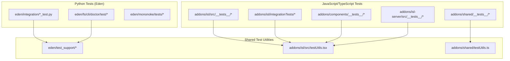
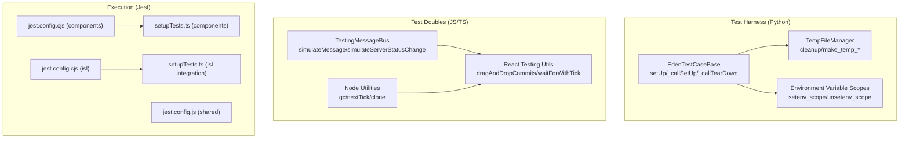
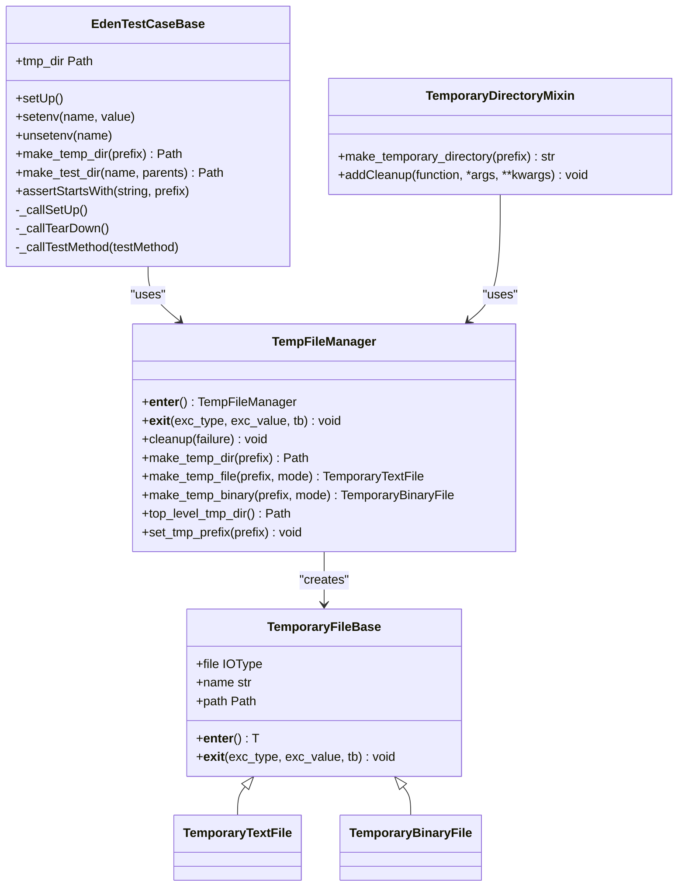
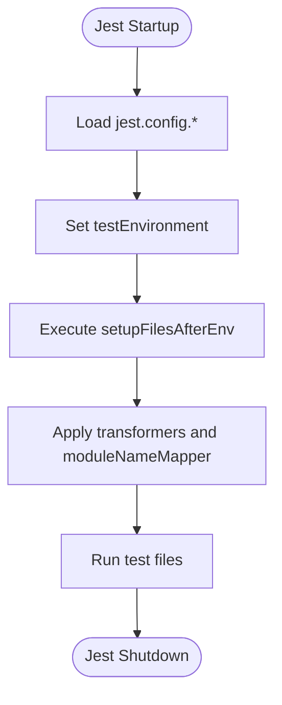
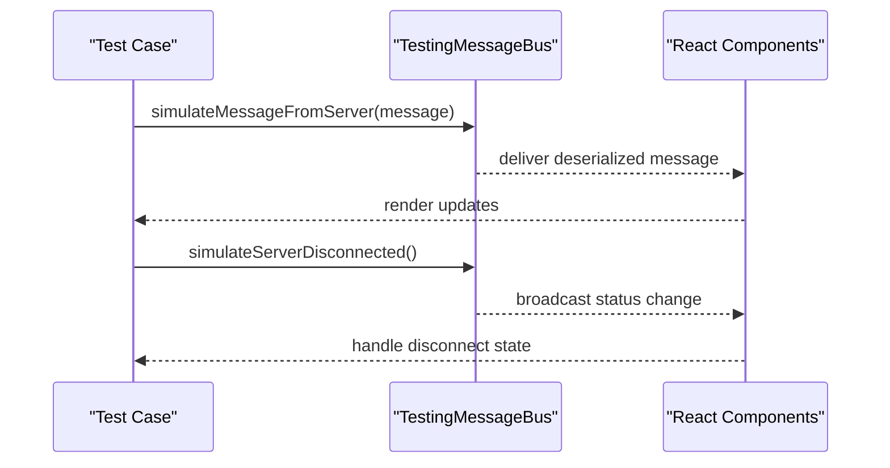
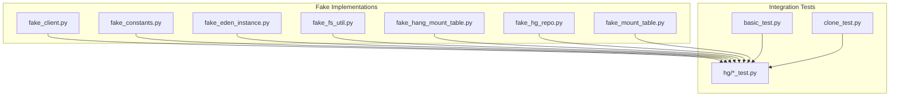
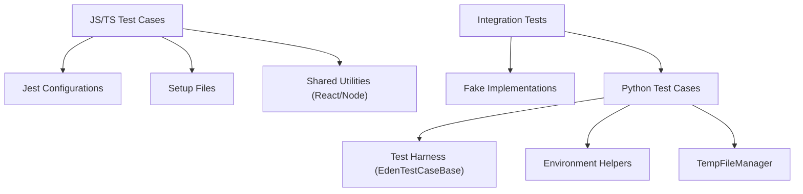

# Test Infrastructure and Utilities

<cite>
**Referenced Files in This Document**
- [testcase.py](file://eden/test_support/testcase.py)
- [temporary_directory.py](file://eden/test_support/temporary_directory.py)
- [environment_variable.py](file://eden/test_support/environment_variable.py)
- [testUtils.tsx](file://addons/isl/src/testUtils.tsx)
- [testUtils.ts](file://addons/shared/testUtils.ts)
- [jest.config.cjs (components)](file://addons/components/jest.config.cjs)
- [jest.config.cjs (isl)](file://addons/isl/jest.config.cjs)
- [jest.config.js (shared)](file://addons/shared/jest.config.js)
- [setupTests.ts (components)](file://addons/components/__tests__/setupTests.ts)
- [setupTests.ts (isl integration)](file://addons/isl/integrationTests/setupTests.ts)
- [README.md](file://addons/isl/integrationTests/README.md)
- [setup.tsx (isl integration)](file://addons/isl/integrationTests/setup.tsx)
- [setupTests.ts (isl)](file://addons/isl/src/setupTests.ts)
- [setupTests.ts (isl-server)](file://addons/isl-server/src/setupTests.ts)
- [README.md (isl-server)](file://addons/isl-server/README.md)
- [README.md (screenshot-tool)](file://addons/screenshot-tool/README.md)
- [testRepo.ts (screenshot-tool)](file://addons/screenshot-tool/src/testRepo.ts)
- [testBrowser.ts (screenshot-tool)](file://addons/screenshot-tool/src/testBrowser.ts)
- [utils.ts (screenshot-tool)](file://addons/screenshot-tool/src/utils.ts)
- [package.json (screenshot-tool)](file://addons/screenshot-tool/package.json)
- [README.md (eden fs integration)](file://eden/integration/README.md)
- [basic_test.py](file://eden/integration/basic_test.py)
- [clone_test.py](file://eden/integration/clone_test.py)
- [hg integration tests](file://eden/integration/hg/)
- [hg integration helpers](file://eden/integration/helpers/)
- [hg integration lib](file://eden/integration/lib/)
- [hg integration snapshot](file://eden/integration/snapshot/)
- [hg integration CMakeLists.txt](file://eden/integration/CMakeLists.txt)
- [hg integration README.md](file://eden/integration/README.md)
- [fs integration tests](file://eden/fs/cli/doctor/test/)
- [fs integration lib fake client](file://eden/fs/cli/doctor/test/lib/fake_client.py)
- [fs integration lib fake constants](file://eden/fs/cli/doctor/test/lib/fake_constants.py)
- [fs integration lib fake eden instance](file://eden/fs/cli/doctor/test/lib/fake_eden_instance.py)
- [fs integration lib fake fs util](file://eden/fs/cli/doctor/test/lib/fake_fs_util.py)
- [fs integration lib fake hang mount table](file://eden/fs/cli/doctor/test/lib/fake_hang_mount_table.py)
- [fs integration lib fake hg repo](file://eden/fs/cli/doctor/test/lib/fake_hg_repo.py)
- [fs integration lib fake mount table](file://eden/fs/cli/doctor/test/lib/fake_mount_table.py)
- [CMakeLists.txt (eden test_support)](file://eden/test_support/CMakeLists.txt)
- [environment_variable.py (eden test_support)](file://eden/test_support/environment_variable.py)
- [temporary_directory.py (eden test_support)](file://eden/test_support/temporary_directory.py)
- [testcase.py (eden test_support)](file://eden/test_support/testcase.py)
- [README.md (eden)](file://eden/README.md)
- [README.md (sapling scm)](file://README.md)
</cite>

## Table of Contents
1. [Introduction](#introduction)
2. [Project Structure](#project-structure)
3. [Core Components](#core-components)
4. [Architecture Overview](#architecture-overview)
5. [Detailed Component Analysis](#detailed-component-analysis)
6. [Dependency Analysis](#dependency-analysis)
7. [Performance Considerations](#performance-considerations)
8. [Troubleshooting Guide](#troubleshooting-guide)
9. [Conclusion](#conclusion)
10. [Appendices](#appendices)

## Introduction
This document describes the test infrastructure and utilities used across SAPLING SCM. It focuses on reusable testing utilities, test harness components, and helper functions that enable consistent test execution across platforms and frameworks. It covers environment setup, fixtures, test data preparation, repository simulation, mock objects, and test doubles. It also documents configuration for Jest and Node-based tests, Python unittest-based integration tests, cross-platform considerations, and best practices for maintainable test suites.

## Project Structure
The repository organizes tests and supporting infrastructure across several areas:
- Python-based integration tests for the EdenFS layer and related subsystems
- JavaScript/TypeScript-based unit and integration tests for frontend and shared packages
- Shared testing utilities for React, Node, and Python environments
- Platform-specific helpers and mock objects for simulating repositories and runtime conditions

**Diagram sources**
- [testcase.py](file://eden/test_support/testcase.py)
- [temporary_directory.py](file://eden/test_support/temporary_directory.py)
- [environment_variable.py](file://eden/test_support/environment_variable.py)
- [testUtils.tsx](file://addons/isl/src/testUtils.tsx)
- [testUtils.ts](file://addons/shared/testUtils.ts)
- [basic_test.py](file://eden/integration/basic_test.py)
- [clone_test.py](file://eden/integration/clone_test.py)
- [README.md (eden fs integration)](file://eden/integration/README.md)

**Section sources**
- [README.md (eden)](file://eden/README.md)
- [README.md (sapling scm)](file://README.md)

## Core Components
This section outlines the primary testing utilities and frameworks used across the repository.

- Python unittest-based test harness with shared helpers for temporary directories, environment variables, and warning suppression
- Jest-based TypeScript/React testing with standardized configuration and setup files
- Shared test utilities for React component testing, message bus simulation, and DOM interaction helpers
- Cross-language utilities for cloning and manipulating test repositories
- Platform-specific considerations for macOS, Linux, and Windows environments

Key capabilities:
- Safe temporary directory creation and cleanup with robust permission handling
- Scoped environment variable manipulation with automatic restoration
- React testing utilities for message simulation, drag-and-drop, and DOM assertions
- Node-based utilities for memory measurement and garbage collection control
- Integration test scaffolding for EdenFS and Mercurial interoperability

**Section sources**
- [testcase.py](file://eden/test_support/testcase.py)
- [temporary_directory.py](file://eden/test_support/temporary_directory.py)
- [environment_variable.py](file://eden/test_support/environment_variable.py)
- [testUtils.tsx](file://addons/isl/src/testUtils.tsx)
- [testUtils.ts](file://addons/shared/testUtils.ts)

## Architecture Overview
The testing architecture separates concerns across layers:
- Test harness: Python unittest base classes and environment helpers
- Fixture management: Temporary directories and scoped environment variables
- Test doubles: Mocks for UI, messaging, and filesystem interactions
- Test execution: Jest presets and Node/JS environments for frontend tests
- Integration scaffolding: Helpers for repository simulation and platform-specific behaviors

**Diagram sources**
- [testcase.py](file://eden/test_support/testcase.py)
- [temporary_directory.py](file://eden/test_support/temporary_directory.py)
- [environment_variable.py](file://eden/test_support/environment_variable.py)
- [testUtils.tsx](file://addons/isl/src/testUtils.tsx)
- [testUtils.ts](file://addons/shared/testUtils.ts)
- [jest.config.cjs (components)](file://addons/components/jest.config.cjs)
- [jest.config.cjs (isl)](file://addons/isl/jest.config.cjs)
- [jest.config.js (shared)](file://addons/shared.jest.config.js)
- [setupTests.ts (components)](file://addons/components/__tests__/setupTests.ts)
- [setupTests.ts (isl integration)](file://addons/isl/integrationTests/setupTests.ts)

## Detailed Component Analysis

### Python Test Harness and Environment Management
The Python test harness provides a base class for unittest-based tests with:
- Automatic temporary directory management via a top-level temporary directory
- Scoped environment variable manipulation with automatic restoration
- Warning suppression to filter out known benign deprecation warnings
- macOS-specific behavior adjustments for socket path length limits

**Diagram sources**
- [testcase.py](file://eden/test_support/testcase.py)
- [temporary_directory.py](file://eden/test_support/temporary_directory.py)

Key behaviors:
- Temporary directory lifecycle controlled by environment variable settings
- Robust cleanup that handles read-only files and permission errors
- Scoped environment changes automatically restored after test execution
- Warning filtering ensures test output remains focused on actionable issues

**Section sources**
- [testcase.py](file://eden/test_support/testcase.py)
- [temporary_directory.py](file://eden/test_support/temporary_directory.py)
- [environment_variable.py](file://eden/test_support/environment_variable.py)

### Jest Configuration and Setup
Jest configurations and setup files standardize test execution across packages:
- Components package: JSDOM environment, CSS mocking, and TS transformation
- ISL package: JSDOM environment, asset mocking, CI-aware timeouts, and custom transformer
- Shared package: Node environment with CSS mocking for pure Node utilities

**Diagram sources**
- [jest.config.cjs (components)](file://addons/components/jest.config.cjs)
- [jest.config.cjs (isl)](file://addons/isl/jest.config.cjs)
- [jest.config.js (shared)](file://addons/shared.jest.config.js)
- [setupTests.ts (components)](file://addons/components/__tests__/setupTests.ts)
- [setupTests.ts (isl integration)](file://addons/isl/integrationTests/setupTests.ts)

Configuration highlights:
- Components: CSS modules mocked, JSDOM environment, TS-Jest preset
- ISL: CI-aware test timeout, asset mocks, custom transformer for import.meta
- Shared: Node environment for pure backend utilities

**Section sources**
- [jest.config.cjs (components)](file://addons/components/jest.config.cjs)
- [jest.config.cjs (isl)](file://addons/isl.jest.config.cjs)
- [jest.config.js (shared)](file://addons/shared.jest.config.js)
- [setupTests.ts (components)](file://addons/components/__tests__/setupTests.ts)
- [setupTests.ts (isl integration)](file://addons/isl/integrationTests/setupTests.ts)

### React and UI Testing Utilities
The ISL package provides comprehensive utilities for React component testing:
- Message bus simulation for server/client communication
- DOM interaction helpers for drag-and-drop and commit navigation
- Assertion helpers for commit DAG state and UI elements
- Utility functions for memory control and asynchronous ticks

**Diagram sources**
- [testUtils.tsx](file://addons/isl/src/testUtils.tsx)

Key utilities:
- Message simulation and filtering for precise assertions
- Drag-and-drop helpers for commit reordering scenarios
- DOM queries and assertions for commit DAG and sidebar visibility
- Asynchronous helpers to avoid act warnings and stabilize tests

**Section sources**
- [testUtils.tsx](file://addons/isl/src/testUtils.tsx)

### Node Utilities for Memory and Timing
Shared Node utilities support deterministic testing:
- Garbage collection control via exposed GC or memory measurement
- Next-tick scheduling for async stabilization
- Deep cloning helpers for immutable test data

**Section sources**
- [testUtils.ts](file://addons/shared/testUtils.ts)

### Integration Test Scaffolding (EdenFS and Mercurial)
Integration tests leverage helpers to simulate real-world conditions:
- Fake implementations for client, constants, Eden instance, filesystem utilities, mount tables, and HG repositories
- Comprehensive integration test suite for basic operations, cloning, and platform-specific behaviors

**Diagram sources**
- [fs integration lib fake client](file://eden/fs/cli/doctor/test/lib/fake_client.py)
- [fs integration lib fake constants](file://eden/fs/cli/doctor/test/lib/fake_constants.py)
- [fs integration lib fake eden instance](file://eden/fs/cli/doctor/test/lib/fake_eden_instance.py)
- [fs integration lib fake fs util](file://eden/fs/cli/doctor/test/lib/fake_fs_util.py)
- [fs integration lib fake hang mount table](file://eden/fs/cli/doctor/test/lib/fake_hang_mount_table.py)
- [fs integration lib fake hg repo](file://eden/fs/cli/doctor/test/lib/fake_hg_repo.py)
- [fs integration lib fake mount table](file://eden/fs/cli/doctor/test/lib/fake_mount_table.py)
- [basic_test.py](file://eden/integration/basic_test.py)
- [clone_test.py](file://eden/integration/clone_test.py)
- [hg integration tests](file://eden/integration/hg/)

**Section sources**
- [README.md (eden fs integration)](file://eden/integration/README.md)
- [basic_test.py](file://eden/integration/basic_test.py)
- [clone_test.py](file://eden/integration/clone_test.py)
- [hg integration tests](file://eden/integration/hg/)

### Cross-Platform Considerations
- macOS-specific temporary directory override to avoid UNIX domain socket path length limitations
- Windows-friendly temporary file handling that avoids process-sharing restrictions
- CI-aware configuration for Jest timeouts and DOM error handling

**Section sources**
- [testcase.py](file://eden/test_support/testcase.py)
- [temporary_directory.py](file://eden/test_support/temporary_directory.py)
- [setupTests.ts (isl integration)](file://addons/isl/integrationTests/setupTests.ts)

### Test Data Preparation and Repository Simulation
- Use the temporary directory manager to create isolated repository roots
- Utilize fake implementations to simulate HG repositories and EdenFS mounts
- Prepare commit histories and UI states with helper factories

**Section sources**
- [temporary_directory.py](file://eden/test_support/temporary_directory.py)
- [testUtils.tsx](file://addons/isl/src/testUtils.tsx)
- [fs integration lib fake hg repo](file://eden/fs/cli/doctor/test/lib/fake_hg_repo.py)

### Test State Management and Cleanup
- Automatic cleanup of temporary directories controlled by environment variables
- Scoped environment changes that restore prior values after tests
- Exit stack management to coordinate cleanup across multiple resources

**Section sources**
- [temporary_directory.py](file://eden/test_support/temporary_directory.py)
- [environment_variable.py](file://eden/test_support/environment_variable.py)
- [testcase.py](file://eden/test_support/testcase.py)

### Test Configuration Management
- Centralized Jest configurations per package with consistent patterns
- Setup files for environment polyfills and global mocks
- CI detection and configuration toggles for timeouts and error handling

**Section sources**
- [jest.config.cjs (components)](file://addons/components/jest.config.cjs)
- [jest.config.cjs (isl)](file://addons/isl.jest.config.cjs)
- [jest.config.js (shared)](file://addons/shared.jest.config.js)
- [setupTests.ts (components)](file://addons/components/__tests__/setupTests.ts)
- [setupTests.ts (isl integration)](file://addons/isl/integrationTests/setupTests.ts)

### Parallel Test Execution and Reporting
- Jest supports concurrent test execution by default; configure workers and concurrency via Jest options
- Use CI-aware timeouts and reduced DOM error verbosity to improve stability on slower runners
- Report coverage and test results using Jest’s built-in reporters or CI integrations

[No sources needed since this section provides general guidance]

### Best Practices and Maintainable Approaches
- Prefer scoped environment changes and temporary directories for isolation
- Use message bus simulation for decoupled UI testing
- Keep setup files minimal and centralized for reuse across test suites
- Leverage fake implementations to isolate system dependencies
- Use deterministic utilities (nextTick, gc) sparingly and only when necessary

[No sources needed since this section provides general guidance]

## Dependency Analysis
The testing infrastructure exhibits clear separation of concerns:
- Python tests depend on the test harness and environment helpers
- JS/TS tests depend on Jest configurations and shared utilities
- Integration tests depend on fake implementations and platform-specific helpers

**Diagram sources**
- [testcase.py](file://eden/test_support/testcase.py)
- [temporary_directory.py](file://eden/test_support/temporary_directory.py)
- [environment_variable.py](file://eden/test_support/environment_variable.py)
- [jest.config.cjs (components)](file://addons/components/jest.config.cjs)
- [jest.config.cjs (isl)](file://addons/isl.jest.config.cjs)
- [jest.config.js (shared)](file://addons/shared.jest.config.js)
- [setupTests.ts (components)](file://addons/components/__tests__/setupTests.ts)
- [setupTests.ts (isl integration)](file://addons/isl/integrationTests/setupTests.ts)
- [fs integration lib fake client](file://eden/fs/cli/doctor/test/lib/fake_client.py)
- [fs integration lib fake hg repo](file://eden/fs/cli/doctor/test/lib/fake_hg_repo.py)

**Section sources**
- [testcase.py](file://eden/test_support/testcase.py)
- [temporary_directory.py](file://eden/test_support/temporary_directory.py)
- [environment_variable.py](file://eden/test_support/environment_variable.py)
- [jest.config.cjs (components)](file://addons/components/jest.config.cjs)
- [jest.config.cjs (isl)](file://addons/isl.jest.config.cjs)
- [jest.config.js (shared)](file://addons/shared.jest.config.js)
- [setupTests.ts (components)](file://addons/components/__tests__/setupTests.ts)
- [setupTests.ts (isl integration)](file://addons/isl/integrationTests/setupTests.ts)
- [fs integration lib fake client](file://eden/fs/cli/doctor/test/lib/fake_client.py)
- [fs integration lib fake hg repo](file://eden/fs/cli/doctor/test/lib/fake_hg_repo.py)

## Performance Considerations
- Minimize filesystem operations in tests; prefer in-memory or lightweight temporary directories
- Use deterministic timing utilities judiciously to avoid flakiness
- Avoid excessive global mocks that mask performance regressions
- Configure Jest worker pools appropriately for local and CI environments

[No sources needed since this section provides general guidance]

## Troubleshooting Guide
Common issues and resolutions:
- Temporary directory cleanup failures on Windows or read-only mounts: rely on the robust cleanup routine and ensure proper resource closure
- Excess warnings in test output: use the warning suppression mechanism to filter benign deprecations
- CI flakiness with DOM queries: increase async timeouts and suppress noisy DOM error stack traces when appropriate
- Jest transform errors for import.meta: apply the custom transformer configuration for TS files

**Section sources**
- [temporary_directory.py](file://eden/test_support/temporary_directory.py)
- [testcase.py](file://eden/test_support/testcase.py)
- [setupTests.ts (isl integration)](file://addons/isl/integrationTests/setupTests.ts)
- [jest.config.cjs (isl)](file://addons/isl.jest.config.cjs)

## Conclusion
The SAPLING SCM test infrastructure combines robust Python-based test harnesses with modern Jest-driven JavaScript/TypeScript testing. Shared utilities enable consistent, maintainable tests across platforms and frameworks. By leveraging scoped environment management, temporary directory handling, and comprehensive React/Node utilities, the project achieves reliable, isolated, and efficient test execution suitable for both local development and CI environments.

## Appendices

### Appendix A: Example Workflows

#### Creating a Test Repository (Python)
- Initialize a temporary directory via the test harness
- Use fake implementations to simulate HG repository state
- Execute operations and assert outcomes using scoped environment variables

**Section sources**
- [temporary_directory.py](file://eden/test_support/temporary_directory.py)
- [testcase.py](file://eden/test_support/testcase.py)
- [fs integration lib fake hg repo](file://eden/fs/cli/doctor/test/lib/fake_hg_repo.py)

#### Managing Test State (React)
- Simulate server messages and UI transitions
- Use drag-and-drop helpers to manipulate commit order
- Assert DAG state and sidebar visibility

**Section sources**
- [testUtils.tsx](file://addons/isl/src/testUtils.tsx)

#### Handling Test Cleanup (Node)
- Use memory control utilities to stabilize async tests
- Clone objects to avoid mutation side effects

**Section sources**
- [testUtils.ts](file://addons/shared/testUtils.ts)

### Appendix B: Configuration Reference
- Components Jest config: JSDOM, CSS mocking, TS-Jest preset
- ISL Jest config: CI-aware timeouts, asset mocks, custom transformer
- Shared Jest config: Node environment with CSS mocking

**Section sources**
- [jest.config.cjs (components)](file://addons/components/jest.config.cjs)
- [jest.config.cjs (isl)](file://addons/isl.jest.config.cjs)
- [jest.config.js (shared)](file://addons/shared.jest.config.js)