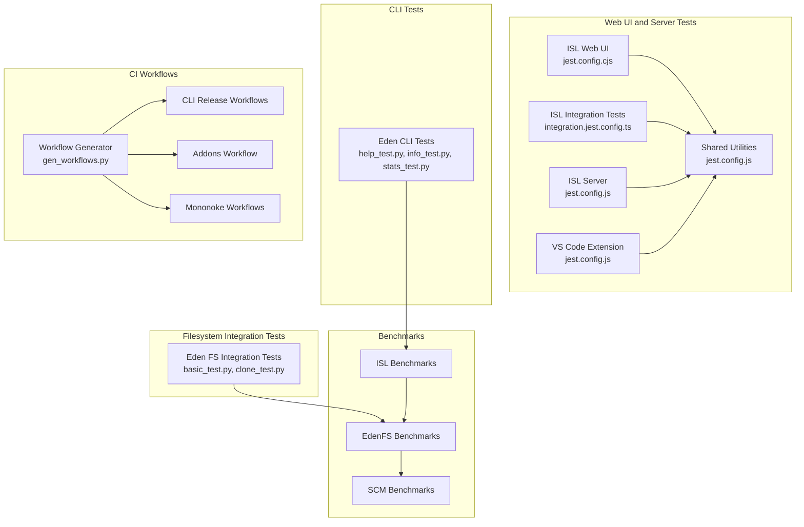
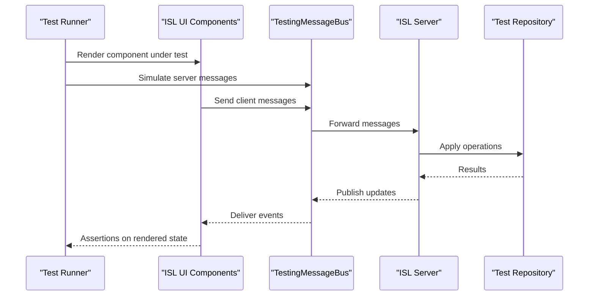
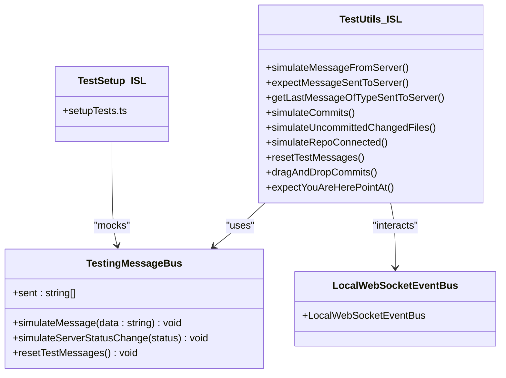
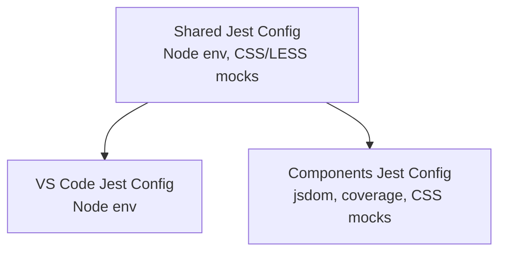
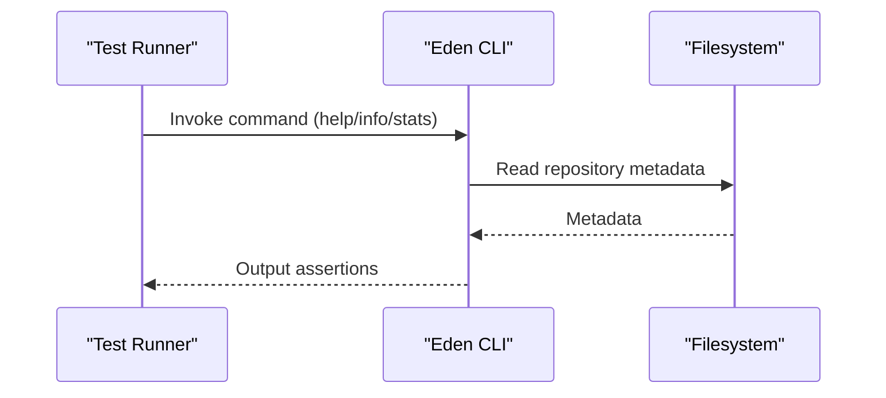
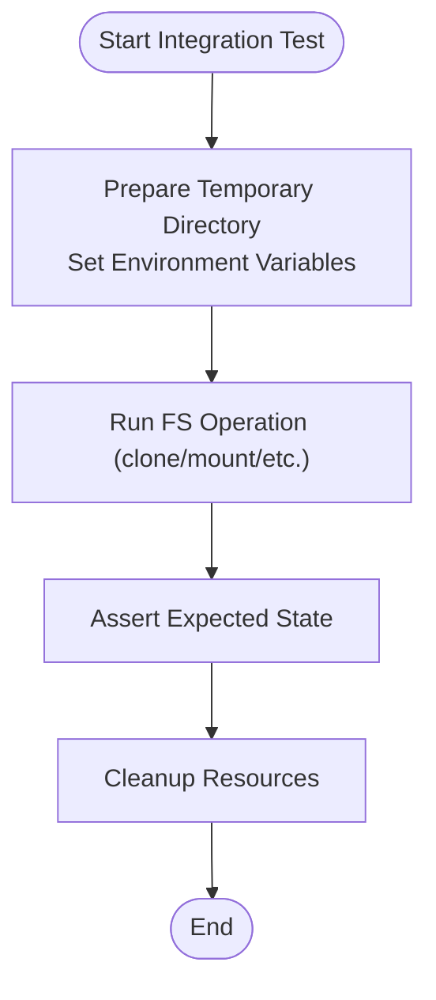
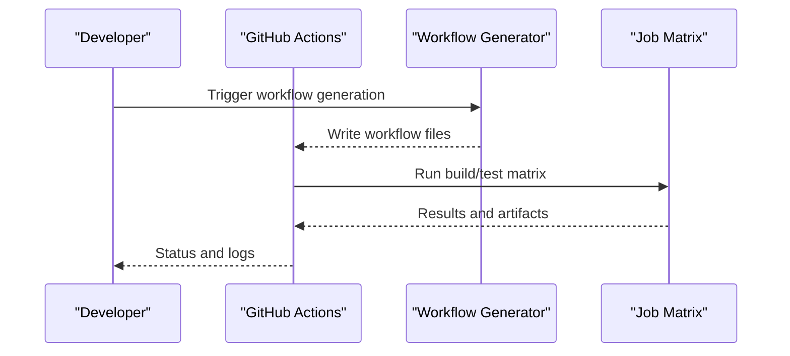
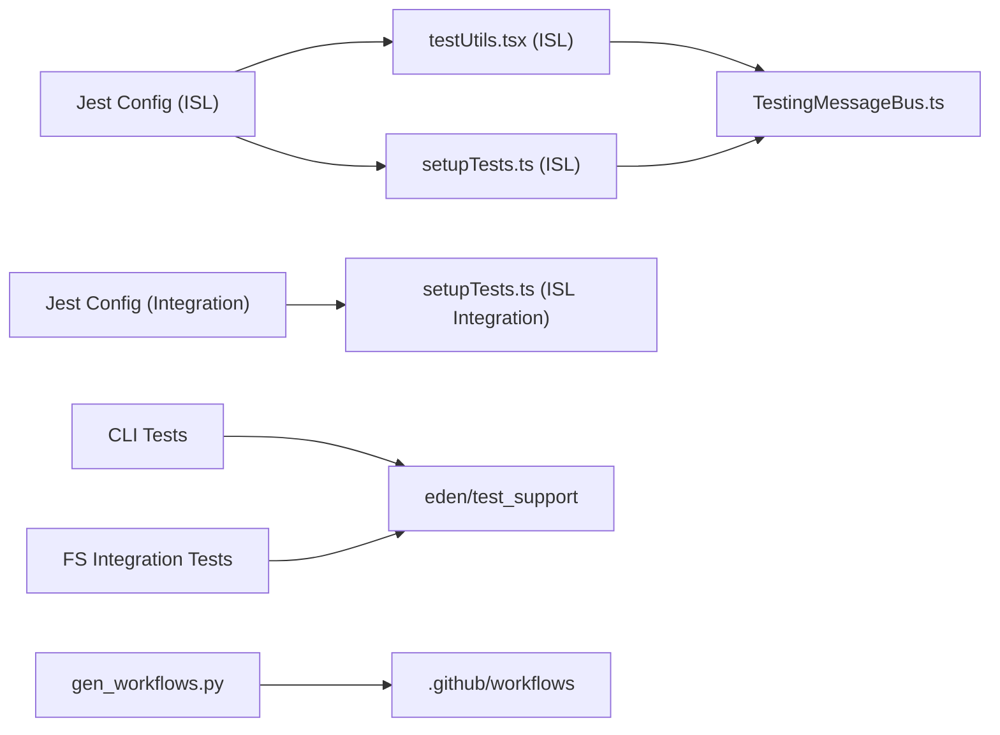

# Testing Strategy and Framework

<cite>
**Referenced Files in This Document**
- [README.md](file://README.md)
- [CONTRIBUTING.md](file://CONTRIBUTING.md)
- [gen_workflows.py](file://ci/gen_workflows.py)
- [sapling-cli-getdeps_linux.yml](file://.github/workflows/sapling-cli-getdeps_linux.yml)
- [sapling-cli-manylinux-release.yml](file://.github/workflows/sapling-cli-manylinux-release.yml)
- [sapling-cli-windows-amd64-release.yml](file://.github/workflows/sapling-cli-windows-amd64-release.yml)
- [sapling-cli-homebrew-macos-arm64-release.yml](file://.github/workflows/sapling-cli-homebrew-macos-arm64-release.yml)
- [edenfs_linux.yml](file://.github/workflows/edenfs_linux.yml)
- [mononoke_linux.yml](file://.github/workflows/mononoke_linux.yml)
- [mononoke-integration_linux.yml](file://.github/workflows/mononoke-integration_linux.yml)
- [sapling-addons.yml](file://.github/workflows/sapling-addons.yml)
- [manylinux_2_34.yml](file://.github/workflows/manylinux_2_34.yml)
- [manylinux_2_34.Dockerfile](file://.github/workflows/manylinux_2_34.Dockerfile)
- [edenfs_linux.yml](file://.github/workflows/edenfs_linux.yml)
- [mononoke_linux.yml](file://.github/workflows/mononoke_linux.yml)
- [mononoke-integration_linux.yml](file://.github/workflows/mononoke-integration_linux.yml)
- [sapling-addons.yml](file://.github/workflows/sapling-addons.yml)
- [integration.jest.config.ts](file://addons/isl/integrationTests/integration.jest.config.ts)
- [setupTests.ts (ISL)](file://addons/isl/src/setupTests.ts)
- [setupTests.ts (ISL integration)](file://addons/isl/integrationTests/setupTests.ts)
- [jest.config.cjs (ISL components)](file://addons/isl/jest.config.cjs)
- [jest.config.js (ISL shared)](file://addons/shared/jest.config.js)
- [jest.config.js (VS Code)](file://addons/vscode/jest.config.js)
- [jest.config.cjs (ISL components)](file://addons/components/jest.config.cjs)
- [testUtils.tsx (ISL)](file://addons/isl/src/testUtils.tsx)
- [setupTests.ts (ISL server)](file://addons/isl-server/src/setupTests.ts)
- [testUtils.ts (shared)](file://addons/shared/testUtils.ts)
- [testUtils.ts (eden contrib shared)](file://eden/contrib/shared/testUtils.ts)
- [testUtils.ts (eden contrib reviewstack)](file://eden/contrib/reviewstack/src/github/testUtils.ts)
- [testQueries.ts (ISL)](file://addons/isl/src/testQueries.ts)
- [TestingMessageBus.ts (ISL)](file://addons/isl/src/TestingMessageBus.ts)
- [LocalWebSocketEventBus.ts (ISL)](file://addons/isl/src/LocalWebSocketEventBus.ts)
- [styleMock.ts (ISL components)](file://addons/components/__tests__/styleMock.ts)
- [styleMock.ts (ISL)](file://addons/isl/src/__mocks__/styleMock.ts)
- [fileMock.js (ISL)](file://addons/isl/src/__mocks__/fileMock.js)
- [jest-transformer-import-meta.cjs (ISL)](file://addons/isl/jest-transformer-import-meta.cjs)
- [testSupport.py (eden test harness)](file://eden/test_support/testcase.py)
- [temporary_directory.py (eden test harness)](file://eden/test_support/temporary_directory.py)
- [environment_variable.py (eden test harness)](file://eden/test_support/environment_variable.py)
- [CMakeLists.txt (eden fs)](file://eden/fs/CMakeLists.txt)
- [README.md (eden integration tests)](file://eden/integration/README.md)
- [basic_test.py (eden integration)](file://eden/integration/basic_test.py)
- [clone_test.py (eden integration)](file://eden/integration/clone_test.py)
- [help_test.py (eden CLI tests)](file://eden/fs/cli/help_test.py)
- [info_test.py (eden CLI tests)](file://eden/fs/cli/info_test.py)
- [stats_test.py (eden CLI tests)](file://eden/fs/cli/stats_test.py)
- [test-harness (eden fs)](file://eden/fs/testharness/)
- [benchmarks (eden fs)](file://eden/fs/benchmarks/)
- [benchmarks (eden mononoke)](file://eden/mononoke/benchmarks/)
- [benchmarks (eden scm)](file://eden/scm/tests/benchmarks/)
</cite>

## Table of Contents
1. [Introduction](#introduction)
2. [Project Structure](#project-structure)
3. [Core Components](#core-components)
4. [Architecture Overview](#architecture-overview)
5. [Detailed Component Analysis](#detailed-component-analysis)
6. [Dependency Analysis](#dependency-analysis)
7. [Performance Considerations](#performance-considerations)
8. [Troubleshooting Guide](#troubleshooting-guide)
9. [Conclusion](#conclusion)
10. [Appendices](#appendices)

## Introduction
This document describes the SAPLING SCM testing strategy and framework across multiple layers and components. It covers unit tests, integration tests, and end-to-end tests; the testing infrastructure for CLI, web interface, server, and filesystem; test organization, execution workflows, and continuous integration. It also documents mocking strategies, test utilities, performance testing and benchmarking, quality assurance measures, guidelines for writing effective tests, test data management, debugging failures, coverage requirements, and best practices.

## Project Structure
The repository organizes tests across several subsystems:
- Web UI and server tests for the ISL (Interactive Smartlog) component and related server code
- Shared utilities and test helpers used across components
- CLI tests for the eden client
- Filesystem integration tests for eden
- Benchmarks for performance measurement
- Continuous integration workflows orchestrated via GitHub Actions

**Diagram sources**
- [integration.jest.config.ts:1-43](file://addons/isl/integrationTests/integration.jest.config.ts#L1-L43)
- [jest.config.cjs (ISL components):1-37](file://addons/isl/jest.config.cjs#L1-L37)
- [jest.config.js (ISL shared):1-17](file://addons/shared/jest.config.js#L1-L17)
- [jest.config.js (VS Code):1-14](file://addons/vscode/jest.config.js#L1-L14)
- [benchmarks (eden fs)](file://eden/fs/benchmarks/)
- [benchmarks (eden mononoke)](file://eden/mononoke/benchmarks/)
- [benchmarks (eden scm)](file://eden/scm/tests/benchmarks/)
- [gen_workflows.py:63-503](file://ci/gen_workflows.py#L63-L503)

**Section sources**
- [README.md](file://README.md)
- [CONTRIBUTING.md](file://CONTRIBUTING.md)
- [gen_workflows.py:63-503](file://ci/gen_workflows.py#L63-L503)

## Core Components
- Jest configurations define test environments, coverage collection, module name mapping, and transform rules for TypeScript/JSX and asset mocking.
- Setup files initialize testing libraries, global mocks, and polyfills.
- Test utilities encapsulate common UI interactions, message bus simulation, and helper assertions.
- CI workflows orchestrate builds, tests, and releases across platforms.

Key configuration highlights:
- ISL Jest configuration sets up jsdom, ts-jest, timeout adjustments, and asset mocks.
- Integration tests restrict concurrency and increase timeouts to handle heavier setups.
- Shared and VS Code jest configs standardize environment and module mapping.
- CI generation script produces Dockerfiles and workflow steps for releases and builds.

**Section sources**
- [jest.config.cjs (ISL components):1-37](file://addons/isl/jest.config.cjs#L1-L37)
- [integration.jest.config.ts:1-43](file://addons/isl/integrationTests/integration.jest.config.ts#L1-L43)
- [jest.config.js (ISL shared):1-17](file://addons/shared/jest.config.js#L1-L17)
- [jest.config.js (VS Code):1-14](file://addons/vscode/jest.config.js#L1-L14)
- [gen_workflows.py:63-503](file://ci/gen_workflows.py#L63-L503)

## Architecture Overview
The testing architecture spans unit, integration, and end-to-end layers:
- Unit tests validate isolated logic and components using Jest with mocked assets and message buses.
- Integration tests coordinate UI interactions and server communication via a test message bus and controlled repositories.
- End-to-end tests exercise real repository operations and server lifecycle using dedicated test harnesses and fixtures.

**Diagram sources**
- [testUtils.tsx (ISL):28-109](file://addons/isl/src/testUtils.tsx#L28-L109)
- [TestingMessageBus.ts (ISL)](file://addons/isl/src/TestingMessageBus.ts)
- [LocalWebSocketEventBus.ts (ISL)](file://addons/isl/src/LocalWebSocketEventBus.ts)
- [setupTests.ts (ISL):22-27](file://addons/isl/src/setupTests.ts#L22-L27)

## Detailed Component Analysis

### ISL Web UI and Server Testing
- Jest configuration: jsdom environment, ts-jest preset, asset mocks for images and CSS, and custom transformer for import.meta.
- Setup: initializes @testing-library/jest-dom, mocks @stylexjs/stylex, and replaces ResizeObserver with a polyfill.
- Test utilities: simulate server messages, assert sent messages, manage subscriptions, and helper functions for UI interactions (drag-and-drop, commit navigation, You Are Here checks).
- Integration tests: stricter Jest config with reduced concurrency, increased timeouts, and CI-specific configuration.

**Diagram sources**
- [setupTests.ts (ISL):22-27](file://addons/isl/src/setupTests.ts#L22-L27)
- [testUtils.tsx (ISL):28-109](file://addons/isl/src/testUtils.tsx#L28-L109)
- [TestingMessageBus.ts (ISL)](file://addons/isl/src/TestingMessageBus.ts)
- [LocalWebSocketEventBus.ts (ISL)](file://addons/isl/src/LocalWebSocketEventBus.ts)

**Section sources**
- [jest.config.cjs (ISL components):10-36](file://addons/isl/jest.config.cjs#L10-L36)
- [setupTests.ts (ISL):12-49](file://addons/isl/src/setupTests.ts#L12-L49)
- [testUtils.tsx (ISL):28-109](file://addons/isl/src/testUtils.tsx#L28-L109)
- [integration.jest.config.ts:10-42](file://addons/isl/integrationTests/integration.jest.config.ts#L10-L42)
- [setupTests.ts (ISL integration):12-40](file://addons/isl/integrationTests/setupTests.ts#L12-L40)

### Shared and VS Code Testing Infrastructure
- Shared jest config targets Node environment and maps CSS/LESS mocks.
- VS Code jest config targets Node environment for extension tests.
- Components jest config focuses on jsdom, coverage collection, and module mapping for CSS.

**Diagram sources**
- [jest.config.js (ISL shared):10-16](file://addons/shared/jest.config.js#L10-L16)
- [jest.config.js (VS Code):10-13](file://addons/vscode/jest.config.js#L10-L13)
- [jest.config.cjs (ISL components):10-25](file://addons/components/jest.config.cjs#L10-L25)

**Section sources**
- [jest.config.js (ISL shared):10-16](file://addons/shared/jest.config.js#L10-L16)
- [jest.config.js (VS Code):10-13](file://addons/vscode/jest.config.js#L10-L13)
- [jest.config.cjs (ISL components):10-25](file://addons/components/jest.config.cjs#L10-L25)

### CLI Testing (Eden)
- CLI tests reside under eden/fs/cli and validate command-line behavior for help, info, and stats.
- These tests are executed as part of broader integration and CI workflows.

**Diagram sources**
- [help_test.py (eden CLI tests)](file://eden/fs/cli/help_test.py)
- [info_test.py (eden CLI tests)](file://eden/fs/cli/info_test.py)
- [stats_test.py (eden CLI tests)](file://eden/fs/cli/stats_test.py)

**Section sources**
- [help_test.py (eden CLI tests)](file://eden/fs/cli/help_test.py)
- [info_test.py (eden CLI tests)](file://eden/fs/cli/info_test.py)
- [stats_test.py (eden CLI tests)](file://eden/fs/cli/stats_test.py)

### Filesystem Integration Testing (Eden)
- Integration tests under eden/integration validate filesystem behavior across platforms and operations like clone, mount, and service interactions.
- Test harness utilities provide temporary directories, environment variable management, and reusable test scaffolding.

**Diagram sources**
- [testSupport.py (eden test harness)](file://eden/test_support/testcase.py)
- [temporary_directory.py (eden test harness)](file://eden/test_support/temporary_directory.py)
- [environment_variable.py (eden test harness)](file://eden/test_support/environment_variable.py)
- [README.md (eden integration tests)](file://eden/integration/README.md)

**Section sources**
- [README.md (eden integration tests)](file://eden/integration/README.md)
- [basic_test.py (eden integration)](file://eden/integration/basic_test.py)
- [clone_test.py (eden integration)](file://eden/integration/clone_test.py)
- [testSupport.py (eden test harness)](file://eden/test_support/testcase.py)
- [temporary_directory.py (eden test harness)](file://eden/test_support/temporary_directory.py)
- [environment_variable.py (eden test harness)](file://eden/test_support/environment_variable.py)

### Continuous Integration Testing
- CI workflows are generated programmatically to produce Docker images and orchestrate Ubuntu, Windows, macOS, and Homebrew releases.
- Workflow files define steps for checkout, environment setup, building, testing, and publishing artifacts.

**Diagram sources**
- [gen_workflows.py:63-503](file://ci/gen_workflows.py#L63-L503)
- [sapling-cli-manylinux-release.yml](file://.github/workflows/sapling-cli-manylinux-release.yml)
- [sapling-cli-windows-amd64-release.yml](file://.github/workflows/sapling-cli-windows-amd64-release.yml)
- [sapling-cli-homebrew-macos-arm64-release.yml](file://.github/workflows/sapling-cli-homebrew-macos-arm64-release.yml)
- [sapling-addons.yml](file://.github/workflows/sapling-addons.yml)
- [mononoke_linux.yml](file://.github/workflows/mononoke_linux.yml)
- [mononoke-integration_linux.yml](file://.github/workflows/mononoke-integration_linux.yml)

**Section sources**
- [gen_workflows.py:63-503](file://ci/gen_workflows.py#L63-L503)
- [.github/workflows (selected)](file://.github/workflows/sapling-cli-manylinux-release.yml)

## Dependency Analysis
- ISL web UI tests depend on jest configurations, setup files, and test utilities.
- Integration tests rely on a controlled message bus and repository state simulation.
- CLI and filesystem tests depend on the eden test harness and repository fixtures.
- CI depends on workflow generation and platform-specific runners.

**Diagram sources**
- [jest.config.cjs (ISL components):10-36](file://addons/isl/jest.config.cjs#L10-L36)
- [setupTests.ts (ISL):12-49](file://addons/isl/src/setupTests.ts#L12-L49)
- [testUtils.tsx (ISL):28-109](file://addons/isl/src/testUtils.tsx#L28-L109)
- [integration.jest.config.ts:10-42](file://addons/isl/integrationTests/integration.jest.config.ts#L10-L42)
- [setupTests.ts (ISL integration):12-40](file://addons/isl/integrationTests/setupTests.ts#L12-L40)
- [TestingMessageBus.ts (ISL)](file://addons/isl/src/TestingMessageBus.ts)
- [testSupport.py (eden test harness)](file://eden/test_support/testcase.py)
- [gen_workflows.py:63-503](file://ci/gen_workflows.py#L63-L503)

**Section sources**
- [jest.config.cjs (ISL components):10-36](file://addons/isl/jest.config.cjs#L10-L36)
- [integration.jest.config.ts:10-42](file://addons/isl/integrationTests/integration.jest.config.ts#L10-L42)
- [setupTests.ts (ISL):12-49](file://addons/isl/src/setupTests.ts#L12-L49)
- [testUtils.tsx (ISL):28-109](file://addons/isl/src/testUtils.tsx#L28-L109)
- [testSupport.py (eden test harness)](file://eden/test_support/testcase.py)
- [gen_workflows.py:63-503](file://ci/gen_workflows.py#L63-L503)

## Performance Considerations
- Benchmarks are organized under eden/fs/benchmarks, eden/mononoke/benchmarks, and eden/scm/tests/benchmarks to measure performance across filesystem operations, server logic, and SCM features.
- Integration tests use increased timeouts and reduced concurrency to avoid flakiness and resource contention.
- CI jobs adjust timeouts and utilize CI-specific configuration to accommodate slower environments.

Recommendations:
- Prefer deterministic fixtures and controlled repository states for reproducible performance runs.
- Use consistent hardware and OS environments for cross-platform benchmarking.
- Isolate heavy integration tests and run them in dedicated CI jobs with appropriate resource allocation.

**Section sources**
- [benchmarks (eden fs)](file://eden/fs/benchmarks/)
- [benchmarks (eden mononoke)](file://eden/mononoke/benchmarks/)
- [benchmarks (eden scm)](file://eden/scm/tests/benchmarks/)
- [integration.jest.config.ts:18-27](file://addons/isl/integrationTests/integration.jest.config.ts#L18-L27)

## Troubleshooting Guide
Common issues and resolutions:
- Flaky tests due to timing: use waitFor variants and nextTick helpers; adjust asyncUtilTimeout in CI.
- Asset and CSS import errors: ensure moduleNameMapper matches image and CSS patterns; use styleMock.ts and fileMock.js.
- Message bus expectations: leverage testUtils helpers to simulate server messages and assert sent messages.
- Integration test failures: reduce maxWorkers and increase testTimeout; confirm proper setupFilesAfterEnv initialization.
- Console noise from error boundaries: suppress React error boundary messages selectively during targeted tests.

Helpful utilities:
- ISL test utilities for simulating server events, asserting messages, and UI interactions.
- Shared test utilities for equality checks, debouncing, and rate limiting.
- eden test harness for temporary directories and environment variables.

**Section sources**
- [setupTests.ts (ISL):29-45](file://addons/isl/src/setupTests.ts#L29-L45)
- [setupTests.ts (ISL integration):25-38](file://addons/isl/integrationTests/setupTests.ts#L25-L38)
- [testUtils.tsx (ISL):352-382](file://addons/isl/src/testUtils.tsx#L352-L382)
- [jest.config.cjs (ISL components):18-26](file://addons/isl/jest.config.cjs#L18-L26)
- [jest.config.js (ISL shared):13-15](file://addons/shared/jest.config.js#L13-L15)
- [styleMock.ts (ISL)](file://addons/isl/src/__mocks__/styleMock.ts)
- [fileMock.js (ISL)](file://addons/isl/src/__mocks__/fileMock.js)
- [testUtils.ts (shared)](file://addons/shared/testUtils.ts)
- [testUtils.ts (eden contrib shared)](file://eden/contrib/shared/testUtils.ts)
- [testUtils.ts (eden contrib reviewstack)](file://eden/contrib/reviewstack/src/github/testUtils.ts)

## Conclusion
The SAPLING SCM testing strategy combines robust unit, integration, and end-to-end layers with strong CI automation. Jest configurations, setup files, and comprehensive test utilities enable reliable testing across web UI, server, CLI, and filesystem components. Benchmarks and CI workflows ensure performance and stability across platforms. Adhering to the guidelines and best practices outlined here will improve test reliability, maintainability, and developer productivity.

## Appendices

### Test Organization and Execution
- Unit tests: component-focused, using jsdom or Node environments depending on the module.
- Integration tests: coordinated UI and server interactions with controlled repositories.
- End-to-end tests: real repository operations validated through eden integration tests and CLI tests.

Execution tips:
- Use platform-appropriate jest configs for each module.
- Initialize setup files to configure testing libraries and mocks.
- Leverage test utilities to simulate server behavior and assert UI state.

**Section sources**
- [jest.config.cjs (ISL components):10-36](file://addons/isl/jest.config.cjs#L10-L36)
- [jest.config.js (ISL shared):10-16](file://addons/shared/jest.config.js#L10-L16)
- [jest.config.js (VS Code):10-13](file://addons/vscode/jest.config.js#L10-L13)
- [integration.jest.config.ts:10-42](file://addons/isl/integrationTests/integration.jest.config.ts#L10-L42)

### Coverage and Quality Assurance
- Coverage collection is configured in jest configs to include source files while excluding type declarations.
- CI workflows enforce test execution across multiple platforms and architectures.
- Style and lint rules support code quality and consistency.

**Section sources**
- [jest.config.cjs (ISL components):15-15](file://addons/isl/jest.config.cjs#L15-L15)
- [jest.config.cjs (ISL components):27-30](file://addons/isl/jest.config.cjs#L27-L30)
- [gen_workflows.py:63-503](file://ci/gen_workflows.py#L63-L503)