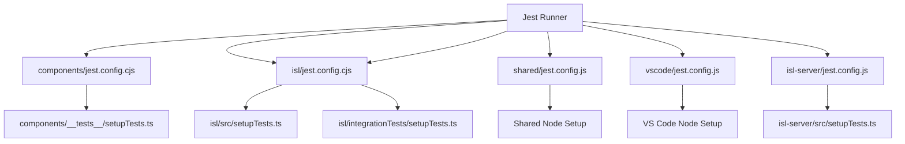
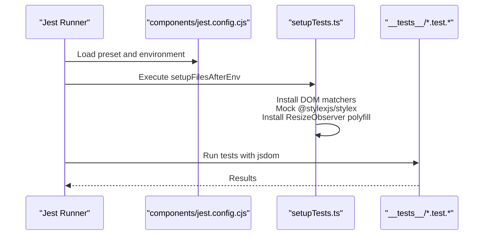
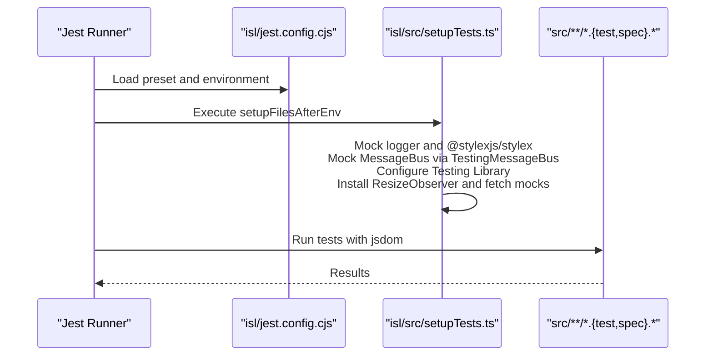
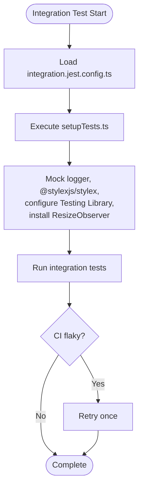
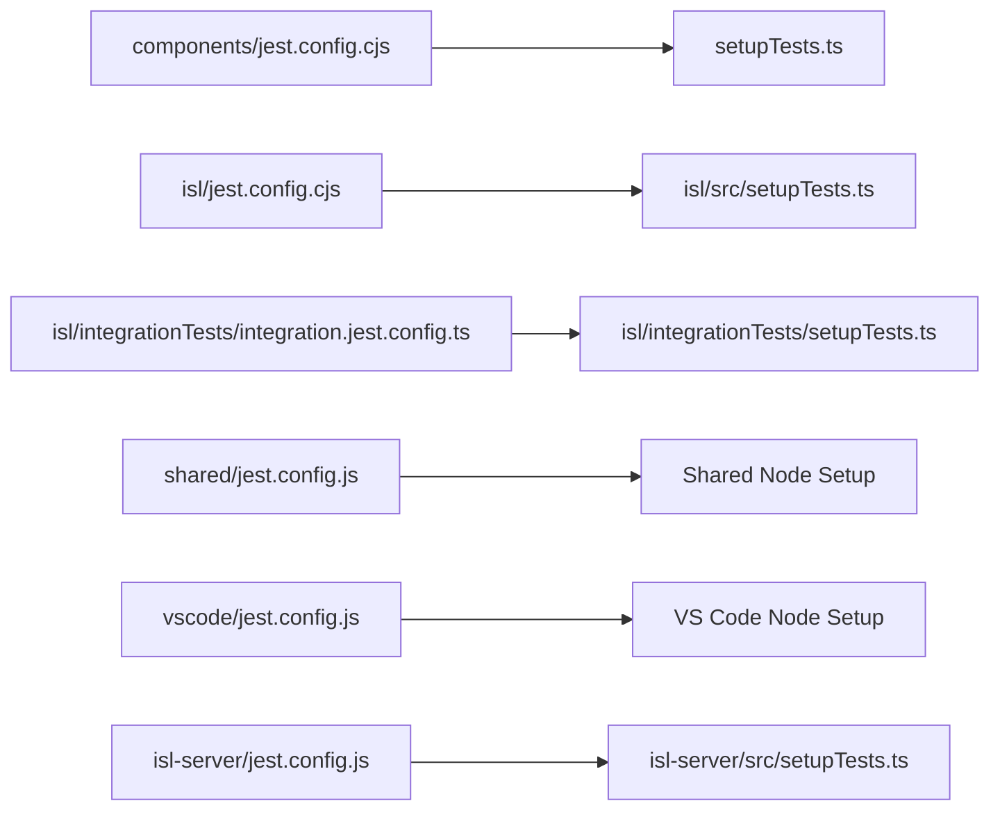

# Unit Testing Framework

<cite>
**Referenced Files in This Document**
- [components/jest.config.cjs](file://addons/components/jest.config.cjs)
- [components/__tests__/setupTests.ts](file://addons/components/__tests__/setupTests.ts)
- [components/__tests__/styleMock.ts](file://addons/components/__tests__/styleMock.ts)
- [isl/jest.config.cjs](file://addons/isl/jest.config.cjs)
- [isl/src/setupTests.ts](file://addons/isl/src/setupTests.ts)
- [isl/integrationTests/integration.jest.config.ts](file://addons/isl/integrationTests/integration.jest.config.ts)
- [isl/integrationTests/setupTests.ts](file://addons/isl/integrationTests/setupTests.ts)
- [shared/jest.config.js](file://addons/shared/jest.config.js)
- [vscode/jest.config.js](file://addons/vscode/jest.config.js)
- [isl-server/jest.config.js](file://addons/isl-server/jest.config.js)
- [isl-server/src/setupTests.ts](file://addons/isl-server/src/setupTests.ts)
</cite>

## Table of Contents
1. [Introduction](#introduction)
2. [Project Structure](#project-structure)
3. [Core Components](#core-components)
4. [Architecture Overview](#architecture-overview)
5. [Detailed Component Analysis](#detailed-component-analysis)
6. [Dependency Analysis](#dependency-analysis)
7. [Performance Considerations](#performance-considerations)
8. [Troubleshooting Guide](#troubleshooting-guide)
9. [Conclusion](#conclusion)

## Introduction
This document describes the unit testing framework used across SAPLING SCM’s testing modules. It focuses on the Jest-based setup for React components, TypeScript utilities, and shared libraries. It explains configuration, mocking strategies, test utilities, component testing patterns, state testing, asynchronous operation testing, and the testing infrastructure for ISL web components, server utilities, and shared modules. Guidance is provided for test setup, teardown, isolation, best practices, mock data management, and assertion patterns.

## Project Structure
The testing ecosystem is organized by functional areas:
- React components library: Jest configuration and DOM-focused setup
- ISL (Interactive Smartlog) web app: Jest configuration, DOM setup, and integration tests
- Shared utilities: Jest configuration for Node environment
- VS Code extension: Jest configuration for Node environment
- ISL server utilities: Jest configuration and Node setup

Key characteristics:
- React environments use jsdom with DOM matchers and polyfills
- ISL integrates Testing Library configuration and global mocks
- Shared and server modules run in Node with environment-specific mocks
- Module-specific setup files initialize globals and configure testing behavior

```mermaid
graph TB
subgraph "React Components"
CfgC["components/jest.config.cjs"]
SetupC["components/__tests__/setupTests.ts"]
StyleC["components/__tests__/styleMock.ts"]
end
subgraph "ISL Web App"
CfgI["isl/jest.config.cjs"]
SetupI["isl/src/setupTests.ts"]
IntCfg["isl/integrationTests/integration.jest.config.ts"]
IntSetup["isl/integrationTests/setupTests.ts"]
end
subgraph "Shared Utilities"
CfgS["shared/jest.config.js"]
end
subgraph "VS Code Extension"
CfgV["vscode/jest.config.js"]
end
subgraph "ISL Server"
CfgServer["isl-server/jest.config.js"]
SetupServer["isl-server/src/setupTests.ts"]
end
CfgC --> SetupC
SetupC --> StyleC
CfgI --> SetupI
CfgI --> IntCfg
IntCfg --> IntSetup
CfgS --> |"Node env"| CfgS
CfgV --> |"Node env"| CfgV
CfgServer --> SetupServer
```

**Diagram sources**
- [components/jest.config.cjs:1-26](file://addons/components/jest.config.cjs#L1-L26)
- [components/__tests__/setupTests.ts:1-34](file://addons/components/__tests__/setupTests.ts#L1-L34)
- [components/__tests__/styleMock.ts:1-10](file://addons/components/__tests__/styleMock.ts#L1-L10)
- [isl/jest.config.cjs:1-37](file://addons/isl/jest.config.cjs#L1-L37)
- [isl/src/setupTests.ts:1-50](file://addons/isl/src/setupTests.ts#L1-L50)
- [isl/integrationTests/integration.jest.config.ts](file://addons/isl/integrationTests/integration.jest.config.ts)
- [isl/integrationTests/setupTests.ts:1-41](file://addons/isl/integrationTests/setupTests.ts#L1-L41)
- [shared/jest.config.js:1-17](file://addons/shared/jest.config.js#L1-L17)
- [vscode/jest.config.js:1-14](file://addons/vscode/jest.config.js#L1-L14)
- [isl-server/jest.config.js:1-15](file://addons/isl-server/jest.config.js#L1-L15)
- [isl-server/src/setupTests.ts:1-14](file://addons/isl-server/src/setupTests.ts#L1-L14)

**Section sources**
- [components/jest.config.cjs:1-26](file://addons/components/jest.config.cjs#L1-L26)
- [isl/jest.config.cjs:1-37](file://addons/isl/jest.config.cjs#L1-L37)
- [shared/jest.config.js:1-17](file://addons/shared/jest.config.js#L1-L17)
- [vscode/jest.config.js:1-14](file://addons/vscode/jest.config.js#L1-L14)
- [isl-server/jest.config.js:1-15](file://addons/isl-server/jest.config.js#L1-L15)

## Core Components
- Jest presets and environments
  - React modules use ts-jest with jsdom test environment
  - Shared and server modules use ts-jest with Node test environment
- Global setup and polyfills
  - DOM matchers, ResizeObserver polyfill, and fetch mocks are initialized globally
- Module name mapping
  - CSS and asset files are mocked to avoid bundling overhead
- CI-aware timeouts and retries
  - CI detection adjusts wait timeouts and enables retry logic for integration tests

Key behaviors:
- Coverage collection scoped to source files per module
- Reset mocks enabled to maintain test isolation
- Transform pipeline configured for ISL to handle import.meta semantics

**Section sources**
- [components/jest.config.cjs:10-25](file://addons/components/jest.config.cjs#L10-L25)
- [components/__tests__/setupTests.ts:8-34](file://addons/components/__tests__/setupTests.ts#L8-L34)
- [isl/jest.config.cjs:12-36](file://addons/isl/jest.config.cjs#L12-L36)
- [isl/src/setupTests.ts:8-50](file://addons/isl/src/setupTests.ts#L8-L50)
- [isl/integrationTests/integration.jest.config.ts](file://addons/isl/integrationTests/integration.jest.config.ts)
- [isl/integrationTests/setupTests.ts:14-41](file://addons/isl/integrationTests/setupTests.ts#L14-L41)
- [shared/jest.config.js:8-17](file://addons/shared/jest.config.js#L8-L17)
- [vscode/jest.config.js:8-14](file://addons/vscode/jest.config.js#L8-L14)
- [isl-server/jest.config.js:8-15](file://addons/isl-server/jest.config.js#L8-L15)

## Architecture Overview
The testing architecture centers on Jest configuration per module, with shared global setup and module-specific mocks. React modules rely on jsdom and DOM matchers, while Node-based modules mock analytics and environment-sensitive APIs.

**Diagram sources**
- [components/jest.config.cjs:10-14](file://addons/components/jest.config.cjs#L10-L14)
- [components/__tests__/setupTests.ts:8-12](file://addons/components/__tests__/setupTests.ts#L8-L12)
- [isl/jest.config.cjs:12-16](file://addons/isl/jest.config.cjs#L12-L16)
- [isl/src/setupTests.ts:8-12](file://addons/isl/src/setupTests.ts#L8-L12)
- [isl/integrationTests/integration.jest.config.ts](file://addons/isl/integrationTests/integration.jest.config.ts)
- [isl/integrationTests/setupTests.ts:8-12](file://addons/isl/integrationTests/setupTests.ts#L8-L12)
- [shared/jest.config.js:8-12](file://addons/shared/jest.config.js#L8-L12)
- [vscode/jest.config.js:8-12](file://addons/vscode/jest.config.js#L8-L12)
- [isl-server/jest.config.js:8-12](file://addons/isl-server/jest.config.js#L8-L12)
- [isl-server/src/setupTests.ts:8-11](file://addons/isl-server/src/setupTests.ts#L8-L11)

## Detailed Component Analysis

### React Components Testing (addons/components)
- Configuration highlights
  - Uses ts-jest with jsdom
  - Coverage collected from source files excluding type declarations
  - Module name mapper for CSS files
  - Reset mocks enabled for isolation
- Global setup
  - DOM matchers installed
  - @stylexjs/stylex mocked to bypass compile-time transformations
  - ResizeObserver polyfill installed globally
- Test discovery
  - Matches files under __tests__ with .test.{js,jsx,ts,tsx}

**Diagram sources**
- [components/jest.config.cjs:10-25](file://addons/components/jest.config.cjs#L10-L25)
- [components/__tests__/setupTests.ts:8-34](file://addons/components/__tests__/setupTests.ts#L8-L34)

**Section sources**
- [components/jest.config.cjs:10-25](file://addons/components/jest.config.cjs#L10-L25)
- [components/__tests__/setupTests.ts:8-34](file://addons/components/__tests__/setupTests.ts#L8-L34)
- [components/__tests__/styleMock.ts:8-10](file://addons/components/__tests__/styleMock.ts#L8-L10)

### ISL Web App Testing (addons/isl)
- Configuration highlights
  - Uses ts-jest with jsdom
  - Coverage scoped to src directory
  - Asset and CSS mocks for images and styles
  - CI-aware test timeout
  - Transform pipeline for import.meta semantics
  - Reset mocks enabled
- Global setup
  - DOM matchers installed
  - Logger mocked to suppress logs during tests
  - @stylexjs/stylex mocked
  - MessageBus mocked via LocalWebSocketEventBus using TestingMessageBus
  - Testing Library configured with CI-adjusted timeouts and optional error suppression
  - ResizeObserver and fetch mocks installed globally
- Test discovery
  - Matches files under src/**/__tests__ and src/**/*.{spec,test}.{js,jsx,ts,tsx}

**Diagram sources**
- [isl/jest.config.cjs:12-36](file://addons/isl/jest.config.cjs#L12-L36)
- [isl/src/setupTests.ts:8-50](file://addons/isl/src/setupTests.ts#L8-L50)

**Section sources**
- [isl/jest.config.cjs:12-36](file://addons/isl/jest.config.cjs#L12-L36)
- [isl/src/setupTests.ts:8-50](file://addons/isl/src/setupTests.ts#L8-L50)

### ISL Integration Tests (addons/isl/integrationTests)
- Configuration highlights
  - Separate Jest config for integration tests
  - CI-aware extended timeouts for Testing Library
  - Retry logic enabled to reduce flakiness
  - Console restored to default behavior
- Global setup
  - DOM matchers installed
  - @stylexjs/stylex mocked
  - Testing Library configured with extended timeouts and optional error suppression
  - ResizeObserver polyfill installed globally

**Diagram sources**
- [isl/integrationTests/integration.jest.config.ts](file://addons/isl/integrationTests/integration.jest.config.ts)
- [isl/integrationTests/setupTests.ts:8-41](file://addons/isl/integrationTests/setupTests.ts#L8-L41)

**Section sources**
- [isl/integrationTests/integration.jest.config.ts](file://addons/isl/integrationTests/integration.jest.config.ts)
- [isl/integrationTests/setupTests.ts:8-41](file://addons/isl/integrationTests/setupTests.ts#L8-L41)

### Shared Utilities Testing (addons/shared)
- Configuration highlights
  - Uses ts-jest with Node test environment
  - CSS and LESS mocks for style assets
- Typical usage
  - Ideal for pure TypeScript utilities, hooks, and non-DOM utilities
  - No DOM setup required

**Section sources**
- [shared/jest.config.js:8-17](file://addons/shared/jest.config.js#L8-L17)

### VS Code Extension Testing (addons/vscode)
- Configuration highlights
  - Uses ts-jest with Node test environment
- Typical usage
  - Suitable for extension backend logic and Node-based utilities

**Section sources**
- [vscode/jest.config.js:8-14](file://addons/vscode/jest.config.js#L8-L14)

### ISL Server Utilities Testing (addons/isl-server)
- Configuration highlights
  - Uses ts-jest with Node test environment
  - Optional setup file for analytics mocking
- Global setup
  - Analytics mocking via Internal.mockAnalytics

**Section sources**
- [isl-server/jest.config.js:8-15](file://addons/isl-server/jest.config.js#L8-L15)
- [isl-server/src/setupTests.ts:8-13](file://addons/isl-server/src/setupTests.ts#L8-L13)

## Dependency Analysis
Testing dependencies are primarily configuration-driven:
- Jest presets and environments are centralized per module
- Global setup files establish shared mocks and polyfills
- Module-specific mocks isolate components and services
- CI detection influences runtime behavior (timeouts, retries)

**Diagram sources**
- [components/jest.config.cjs:10-14](file://addons/components/jest.config.cjs#L10-L14)
- [components/__tests__/setupTests.ts:8-12](file://addons/components/__tests__/setupTests.ts#L8-L12)
- [isl/jest.config.cjs:12-16](file://addons/isl/jest.config.cjs#L12-L16)
- [isl/src/setupTests.ts:8-12](file://addons/isl/src/setupTests.ts#L8-L12)
- [isl/integrationTests/integration.jest.config.ts](file://addons/isl/integrationTests/integration.jest.config.ts)
- [isl/integrationTests/setupTests.ts:8-12](file://addons/isl/integrationTests/setupTests.ts#L8-L12)
- [shared/jest.config.js:8-12](file://addons/shared/jest.config.js#L8-L12)
- [vscode/jest.config.js:8-12](file://addons/vscode/jest.config.js#L8-L12)
- [isl-server/jest.config.js:8-12](file://addons/isl-server/jest.config.js#L8-L12)
- [isl-server/src/setupTests.ts:8-11](file://addons/isl-server/src/setupTests.ts#L8-L11)

**Section sources**
- [components/jest.config.cjs:10-25](file://addons/components/jest.config.cjs#L10-L25)
- [isl/jest.config.cjs:12-36](file://addons/isl/jest.config.cjs#L12-L36)
- [shared/jest.config.js:8-17](file://addons/shared/jest.config.js#L8-L17)
- [vscode/jest.config.js:8-14](file://addons/vscode/jest.config.js#L8-L14)
- [isl-server/jest.config.js:8-15](file://addons/isl-server/jest.config.js#L8-L15)

## Performance Considerations
- CI-aware timeouts
  - ISL and integration tests increase wait timeouts in CI to account for slower environments
- Reduced flakiness
  - Integration tests enable retry logic to mitigate transient failures
- Coverage scoping
  - React components collect coverage from all source files; ISL scopes coverage to src to minimize noise
- Transform pipeline
  - ISL uses a dedicated transformer to support import.meta semantics, avoiding unnecessary transpilation overhead in tests

[No sources needed since this section provides general guidance]

## Troubleshooting Guide
Common issues and resolutions:
- DOM matcher errors
  - Ensure @testing-library/jest-dom is imported in setup files
- Missing ResizeObserver
  - Verify polyfill installation in setup files
- Fetch-related failures
  - Confirm global fetch is mocked appropriately in setup files
- Asset resolution errors
  - Use moduleNameMapper to mock CSS and image assets
- CI flakiness
  - Increase asyncUtilTimeout and enable retryTimes in integration tests
- Analytics noise
  - Mock analytics in server setup files to prevent noisy logs

**Section sources**
- [components/__tests__/setupTests.ts:8-34](file://addons/components/__tests__/setupTests.ts#L8-L34)
- [isl/src/setupTests.ts:8-50](file://addons/isl/src/setupTests.ts#L8-L50)
- [isl/integrationTests/setupTests.ts:8-41](file://addons/isl/integrationTests/setupTests.ts#L8-L41)
- [isl-server/src/setupTests.ts:8-13](file://addons/isl-server/src/setupTests.ts#L8-L13)

## Conclusion
The SAPLING SCM testing framework leverages Jest with module-specific configurations and global setup to ensure reliable, isolated, and CI-friendly tests. React components benefit from jsdom and DOM matchers, while Node-based modules mock environment-sensitive APIs. Integration tests include retry logic and extended timeouts to improve stability. Adhering to the established patterns and utilities ensures consistent test quality across the codebase.