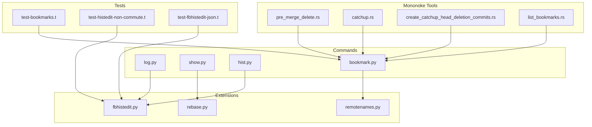
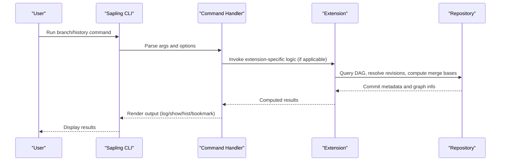
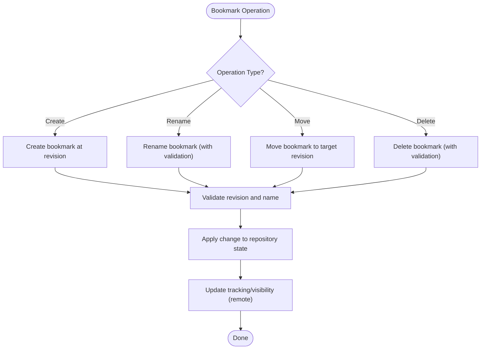
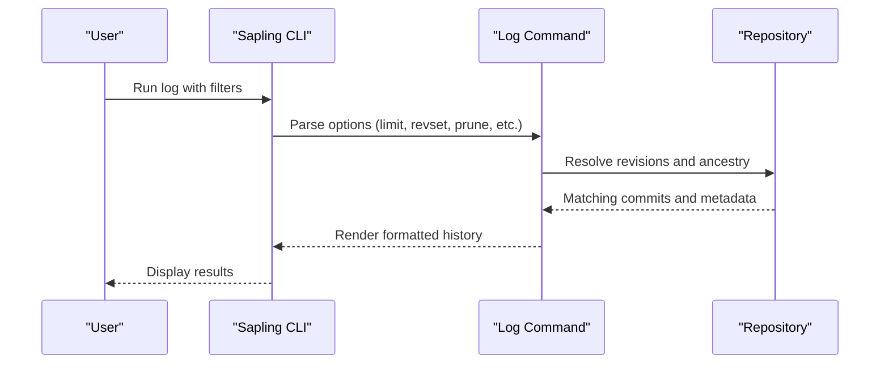
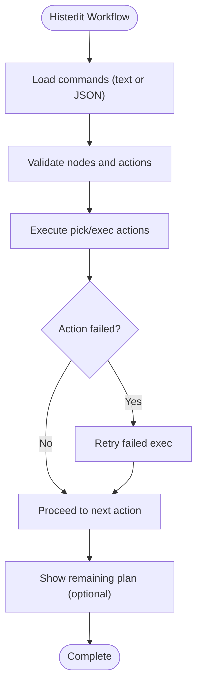
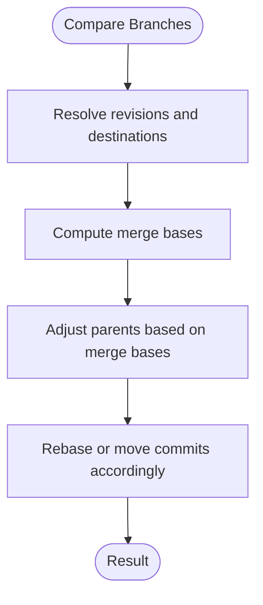
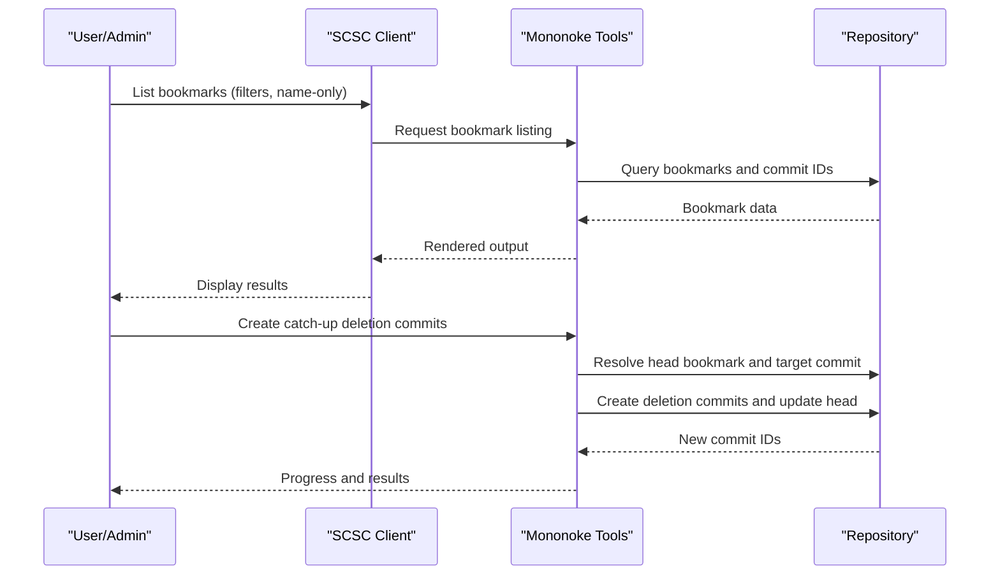
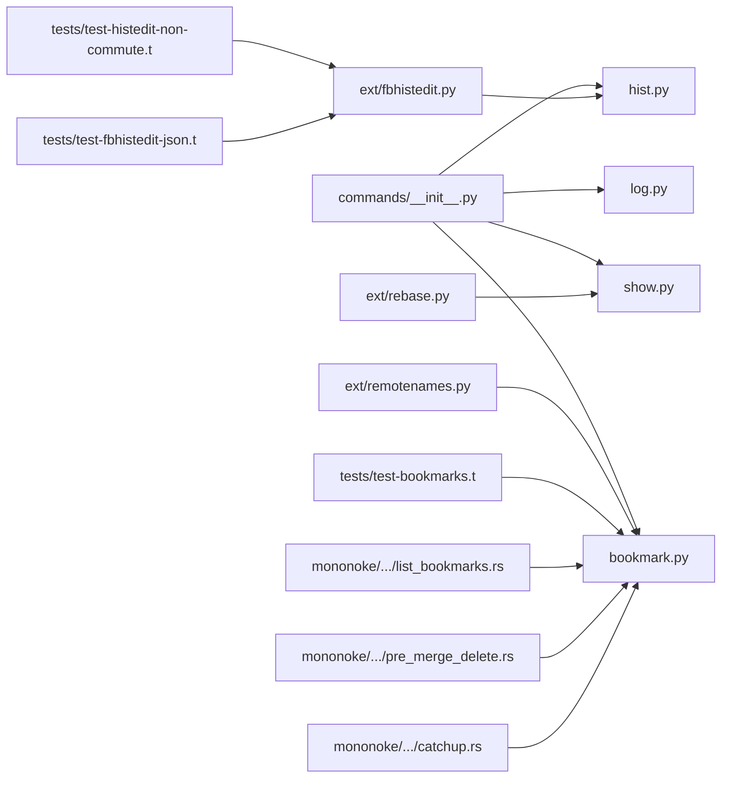

# Branch and History Operations

<cite>
**Referenced Files in This Document**
- [__init__.py](file://eden/scm/sapling/commands/__init__.py)
- [helptext.py](file://eden/scm/sapling/helptext.py)
- [fbhistedit.py](file://eden/scm/sapling/ext/fbhistedit.py)
- [test-bookmarks.t](file://eden/scm/tests/test-bookmarks.t)
- [test-histedit-non-commute.t](file://eden/scm/tests/test-histedit-non-commute.t)
- [test-fbhistedit-json.t](file://eden/scm/tests/test-fbhistedit-json.t)
- [remotenames.py](file://eden/scm/sapling/ext/remotenames.py)
- [list_bookmarks.rs](file://eden/mononoke/clients/scsc/src/commands/list_bookmarks.rs)
- [pre_merge_delete.rs](file://eden/mononoke/tools/admin/src/commands/megarepo/pre_merge_delete.rs)
- [catchup.rs](file://eden/mononoke/tools/admin/src/commands/megarepo/catchup.rs)
- [create_catchup_head_deletion_commits.rs](file://eden/mononoke/tools/admin/src/commands/megarepo/create_catchup_head_deletion_commits.rs)
- [rebase.py](file://eden/scm/sapling/ext/rebase.py)
- [log.py](file://eden/scm/sapling/commands/log.py)
- [show.py](file://eden/scm/sapling/commands/show.py)
- [hist.py](file://eden/scm/sapling/commands/hist.py)
- [bookmark.py](file://eden/scm/sapling/commands/bookmark.py)
</cite>

## Table of Contents
1. [Introduction](#introduction)
2. [Project Structure](#project-structure)
3. [Core Components](#core-components)
4. [Architecture Overview](#architecture-overview)
5. [Detailed Component Analysis](#detailed-component-analysis)
6. [Dependency Analysis](#dependency-analysis)
7. [Performance Considerations](#performance-considerations)
8. [Troubleshooting Guide](#troubleshooting-guide)
9. [Conclusion](#conclusion)

## Introduction
This document explains branch and history operations in SAPLING SCM, focusing on commands for creating, managing, and deleting branches; exploring repository history via log, show, and hist; traversing commits; and filtering history. It also covers branch visualization, branch comparison, merge base calculation, and bookmark management. Collaborative branching strategies and protection concepts are discussed conceptually to guide safe workflows.

## Project Structure
SAPLING SCM organizes commands and extensions under a dedicated commands module and supporting extensions. Key areas include:
- Command definitions and option sets for history exploration and branch/bookmark operations
- Extensions for advanced editing and rebase behavior
- Tests validating bookmark and history-editing workflows
- Administrative tools for bookmark-driven operations and merge-base-related workflows

**Diagram sources**
- [__init__.py](file://eden/scm/sapling/commands/__init__.py)
- [fbhistedit.py](file://eden/scm/sapling/ext/fbhistedit.py)
- [rebase.py](file://eden/scm/sapling/ext/rebase.py)
- [remotenames.py](file://eden/scm/sapling/ext/remotenames.py)
- [test-bookmarks.t](file://eden/scm/tests/test-bookmarks.t)
- [test-histedit-non-commute.t](file://eden/scm/tests/test-histedit-non-commute.t)
- [test-fbhistedit-json.t](file://eden/scm/tests/test-fbhistedit-json.t)
- [pre_merge_delete.rs](file://eden/mononoke/tools/admin/src/commands/megarepo/pre_merge_delete.rs)
- [catchup.rs](file://eden/mononoke/tools/admin/src/commands/megarepo/catchup.rs)
- [create_catchup_head_deletion_commits.rs](file://eden/mononoke/tools/admin/src/commands/megarepo/create_catchup_head_deletion_commits.rs)
- [list_bookmarks.rs](file://eden/mononoke/clients/scsc/src/commands/list_bookmarks.rs)

**Section sources**
- [__init__.py](file://eden/scm/sapling/commands/__init__.py)
- [helptext.py](file://eden/scm/sapling/helptext.py)

## Core Components
- Branch and bookmark management: creation, renaming, moving, and deletion are exposed via the bookmark command and related extension logic.
- History exploration: log, show, and hist commands provide different views and traversal modes for repository history.
- Advanced history editing: histedit-like workflows enable interactive rewrites and selective commit handling.
- Merge base and rebase support: rebase extension logic demonstrates merge base considerations during movement of commits.
- Bookmark visualization and remote tracking: remotenames extension and Mononoke bookmark listing tools surface bookmark states and remote associations.

**Section sources**
- [__init__.py](file://eden/scm/sapling/commands/__init__.py)
- [helptext.py](file://eden/scm/sapling/helptext.py)
- [remotenames.py](file://eden/scm/sapling/ext/remotenames.py)
- [list_bookmarks.rs](file://eden/mononoke/clients/scsc/src/commands/list_bookmarks.rs)

## Architecture Overview
The branch/history subsystem integrates command handlers, option sets, and extension logic. Commands expose flags for filtering and traversal, while extensions implement advanced behaviors such as history editing and rebase decisions. Tests validate expected outcomes for bookmarks and history edits. Administrative tools complement these capabilities for bookmark-driven workflows.

[No sources needed since this diagram shows conceptual workflow, not actual code structure]

## Detailed Component Analysis

### Branch and Bookmark Management
- Creation and modification: The bookmark command supports creating, renaming, moving, and deleting bookmarks. Tests demonstrate renaming and deletion semantics, including behavior with the active bookmark indicator.
- Remote tracking and visibility: The remotenames extension manages tracking files and sorts bookmark output to group remote bookmarks by remote name. Mononoke’s bookmark listing supports filtering and name-only output.
- Administrative workflows: Tools for pre-merge deletions and catch-up operations manipulate bookmarks and resulting commits, illustrating merge-base-aware workflows.

**Diagram sources**
- [test-bookmarks.t](file://eden/scm/tests/test-bookmarks.t)
- [remotenames.py](file://eden/scm/sapling/ext/remotenames.py)
- [list_bookmarks.rs](file://eden/mononoke/clients/scsc/src/commands/list_bookmarks.rs)

**Section sources**
- [__init__.py](file://eden/scm/sapling/commands/__init__.py)
- [test-bookmarks.t](file://eden/scm/tests/test-bookmarks.t)
- [remotenames.py](file://eden/scm/sapling/ext/remotenames.py)
- [list_bookmarks.rs](file://eden/mononoke/clients/scsc/src/commands/list_bookmarks.rs)

### History Exploration: log, show, hist
- log: Provides commit history with options for limiting, filtering by user/date/keywords, pruning ancestors, and revset selection. It also includes a legacy alias for history.
- show: Presents a single commit’s metadata and changes, commonly used for examining specific commits.
- hist: Offers a compact or graph-based history view, useful for understanding evolution and relationships among commits.

**Diagram sources**
- [__init__.py](file://eden/scm/sapling/commands/__init__.py)
- [log.py](file://eden/scm/sapling/commands/log.py)

**Section sources**
- [__init__.py](file://eden/scm/sapling/commands/__init__.py)
- [log.py](file://eden/scm/sapling/commands/log.py)
- [show.py](file://eden/scm/sapling/commands/show.py)
- [hist.py](file://eden/scm/sapling/commands/hist.py)

### Advanced History Editing and Traversal
- Histedit-like workflows: The fbhistedit extension adds features such as JSON-based command files, retry of failed exec actions, and plan display. Tests validate both invalid JSON and valid JSON command files.
- Non-commutative edits: A test demonstrates history edits where certain operations do not commute, highlighting the importance of careful ordering and verification.
- Rebase and merge bases: The rebase extension logic considers merge bases and parent adjustments when moving commits, ensuring correct placement relative to destinations.

**Diagram sources**
- [fbhistedit.py](file://eden/scm/sapling/ext/fbhistedit.py)
- [test-fbhistedit-json.t](file://eden/scm/tests/test-fbhistedit-json.t)
- [test-histedit-non-commute.t](file://eden/scm/tests/test-histedit-non-commute.t)

**Section sources**
- [fbhistedit.py](file://eden/scm/sapling/ext/fbhistedit.py)
- [test-fbhistedit-json.t](file://eden/scm/tests/test-fbhistedit-json.t)
- [test-histedit-non-commute.t](file://eden/scm/tests/test-histedit-non-commute.t)
- [rebase.py](file://eden/scm/sapling/ext/rebase.py)

### Merge Base Calculations and Branch Comparison
- Merge base awareness: The rebase extension logic documents considerations for determining which parents to move toward a destination and how special merge bases are recorded when not derivable from the DAG alone.
- Bookmark-driven workflows: Administrative tools illustrate merge-base-aware operations that create deletion commits and manage head bookmarks, aligning with merge-base semantics.

**Diagram sources**
- [rebase.py](file://eden/scm/sapling/ext/rebase.py)
- [pre_merge_delete.rs](file://eden/mononoke/tools/admin/src/commands/megarepo/pre_merge_delete.rs)
- [catchup.rs](file://eden/mononoke/tools/admin/src/commands/megarepo/catchup.rs)

**Section sources**
- [rebase.py](file://eden/scm/sapling/ext/rebase.py)
- [pre_merge_delete.rs](file://eden/mononoke/tools/admin/src/commands/megarepo/pre_merge_delete.rs)
- [catchup.rs](file://eden/mononoke/tools/admin/src/commands/megarepo/catchup.rs)

### Bookmark Management and Collaboration
- Listing and filtering: Mononoke’s bookmark listing supports name-only output, prefixes, limits, and inclusion of scratch bookmarks.
- Remote bookmarks: The remotenames extension groups remote bookmarks by remote name and maintains tracking files for cross-repository coordination.
- Administrative automation: Tools for catch-up and pre-merge deletions operate on bookmarks and resulting commits, enabling scalable collaborative workflows.

**Diagram sources**
- [list_bookmarks.rs](file://eden/mononoke/clients/scsc/src/commands/list_bookmarks.rs)
- [remotenames.py](file://eden/scm/sapling/ext/remotenames.py)
- [create_catchup_head_deletion_commits.rs](file://eden/mononoke/tools/admin/src/commands/megarepo/create_catchup_head_deletion_commits.rs)
- [catchup.rs](file://eden/mononoke/tools/admin/src/commands/megarepo/catchup.rs)

**Section sources**
- [list_bookmarks.rs](file://eden/mononoke/clients/scsc/src/commands/list_bookmarks.rs)
- [remotenames.py](file://eden/scm/sapling/ext/remotenames.py)
- [create_catchup_head_deletion_commits.rs](file://eden/mononoke/tools/admin/src/commands/megarepo/create_catchup_head_deletion_commits.rs)
- [catchup.rs](file://eden/mononoke/tools/admin/src/commands/megarepo/catchup.rs)

## Dependency Analysis
- Command-layer dependencies: The log command relies on shared option sets and revset resolution. The bookmark command depends on extension logic for remote tracking and sorting.
- Extension dependencies: The fbhistedit extension augments histedit behavior, while the rebase extension influences merge base computations and parent adjustments.
- Test dependencies: Tests exercise bookmark semantics and histedit workflows, validating expected behaviors across scenarios.

**Diagram sources**
- [__init__.py](file://eden/scm/sapling/commands/__init__.py)
- [fbhistedit.py](file://eden/scm/sapling/ext/fbhistedit.py)
- [rebase.py](file://eden/scm/sapling/ext/rebase.py)
- [remotenames.py](file://eden/scm/sapling/ext/remotenames.py)
- [test-bookmarks.t](file://eden/scm/tests/test-bookmarks.t)
- [test-histedit-non-commute.t](file://eden/scm/tests/test-histedit-non-commute.t)
- [test-fbhistedit-json.t](file://eden/scm/tests/test-fbhistedit-json.t)
- [list_bookmarks.rs](file://eden/mononoke/clients/scsc/src/commands/list_bookmarks.rs)
- [pre_merge_delete.rs](file://eden/mononoke/tools/admin/src/commands/megarepo/pre_merge_delete.rs)
- [catchup.rs](file://eden/mononoke/tools/admin/src/commands/megarepo/catchup.rs)

**Section sources**
- [__init__.py](file://eden/scm/sapling/commands/__init__.py)
- [fbhistedit.py](file://eden/scm/sapling/ext/fbhistedit.py)
- [rebase.py](file://eden/scm/sapling/ext/rebase.py)
- [remotenames.py](file://eden/scm/sapling/ext/remotenames.py)
- [test-bookmarks.t](file://eden/scm/tests/test-bookmarks.t)
- [test-histedit-non-commute.t](file://eden/scm/tests/test-histedit-non-commute.t)
- [test-fbhistedit-json.t](file://eden/scm/tests/test-fbhistedit-json.t)
- [list_bookmarks.rs](file://eden/mononoke/clients/scsc/src/commands/list_bookmarks.rs)
- [pre_merge_delete.rs](file://eden/mononoke/tools/admin/src/commands/megarepo/pre_merge_delete.rs)
- [catchup.rs](file://eden/mononoke/tools/admin/src/commands/megarepo/catchup.rs)

## Performance Considerations
- Prefer revsets and pruning to limit traversal breadth and depth for large repositories.
- Use name-only or filtered outputs for bookmark listing to reduce rendering overhead.
- Batch administrative operations (e.g., deletion chunks) to minimize repeated repository updates.

[No sources needed since this section provides general guidance]

## Troubleshooting Guide
- Bookmark conflicts or missing active bookmark: Tests demonstrate aborts when attempting to rename or delete using the active bookmark indicator without an active bookmark.
- Histedit failures: The fbhistedit extension supports retrying failed exec actions and displaying the remaining plan to diagnose issues.
- Merge base anomalies: When rebasing or editing history, ensure merge bases are correctly computed; non-commutative edits require careful ordering.

**Section sources**
- [test-bookmarks.t](file://eden/scm/tests/test-bookmarks.t)
- [fbhistedit.py](file://eden/scm/sapling/ext/fbhistedit.py)
- [test-histedit-non-commute.t](file://eden/scm/tests/test-histedit-non-commute.t)

## Conclusion
SAPLING SCM provides a robust set of branch and history operations centered around log, show, hist, and bookmark commands, with powerful extensions for history editing and rebase-aware workflows. Bookmark management integrates with remote tracking and administrative tools to support scalable collaboration. By leveraging revsets, pruning, and merge-base-aware operations, teams can safely navigate repository evolution and maintain clean, understandable histories.