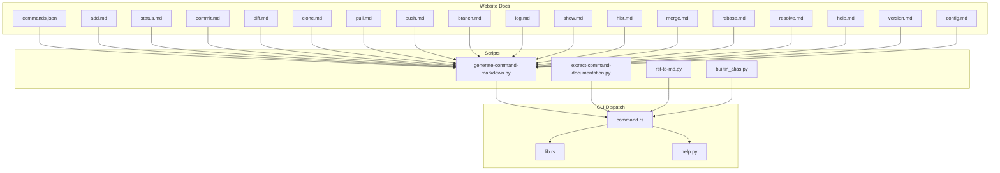
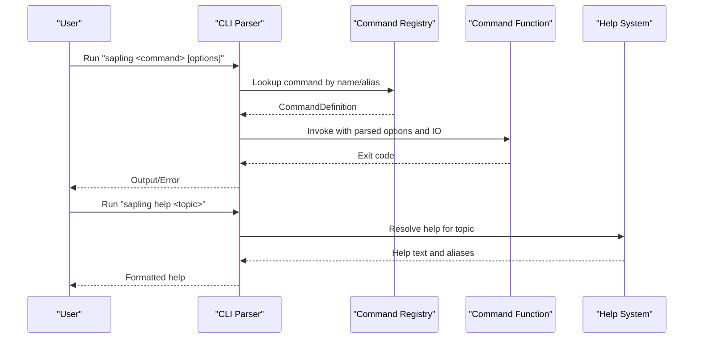
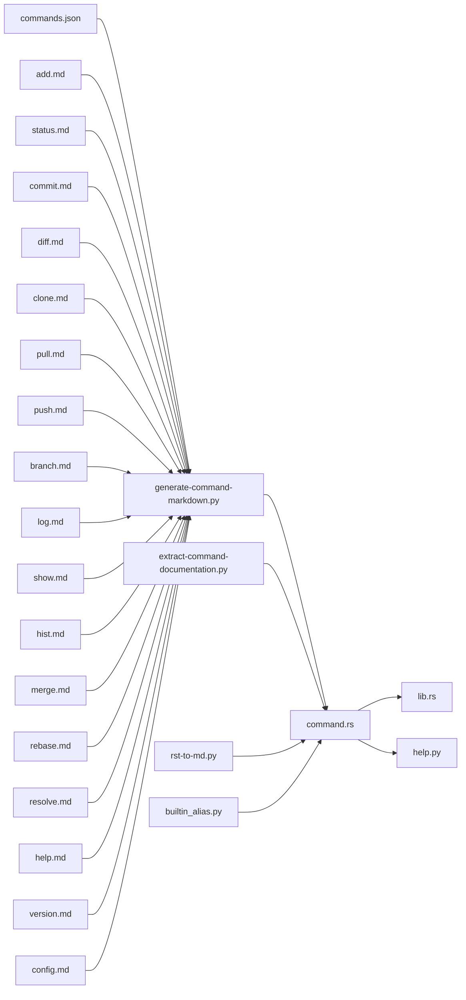

# CLI Commands Reference

<cite>
**Referenced Files in This Document**
- [commands.json](file://website/docs/commands/commands.json)
- [add.md](file://website/docs/commands/add.md)
- [status.md](file://website/docs/commands/status.md)
- [commit.md](file://website/docs/commands/commit.md)
- [diff.md](file://website/docs/commands/diff.md)
- [clone.md](file://website/docs/commands/clone.md)
- [pull.md](file://website/docs/commands/pull.md)
- [push.md](file://website/docs/commands/push.md)
- [branch.md](file://website/docs/commands/branch.md)
- [log.md](file://website/docs/commands/log.md)
- [show.md](file://website/docs/commands/show.md)
- [hist.md](file://website/docs/commands/hist.md)
- [merge.md](file://website/docs/commands/merge.md)
- [rebase.md](file://website/docs/commands/rebase.md)
- [resolve.md](file://website/docs/commands/resolve.md)
- [help.md](file://website/docs/commands/help.md)
- [version.md](file://website/docs/commands/version.md)
- [config.md](file://website/docs/commands/config.md)
- [builtin_alias.py](file://website/scripts/builtin_alias.py)
- [generate-command-markdown.py](file://website/scripts/generate-command-markdown.py)
- [extract-command-documentation.py](file://website/scripts/extract-command-documentation.py)
- [rst-to-md.py](file://website/scripts/rst-to-md.py)
- [command.rs](file://eden/scm/lib/clidispatch/src/command.rs)
- [lib.rs](file://eden/scm/lib/commands/cmdutil/src/lib.rs)
- [help.py](file://eden/scm/sapling/help.py)
- [test-help.t](file://eden/scm/tests/test-help.t)
</cite>

## Table of Contents
1. [Introduction](#introduction)
2. [Project Structure](#project-structure)
3. [Core Components](#core-components)
4. [Architecture Overview](#architecture-overview)
5. [Detailed Component Analysis](#detailed-component-analysis)
6. [Dependency Analysis](#dependency-analysis)
7. [Performance Considerations](#performance-considerations)
8. [Troubleshooting Guide](#troubleshooting-guide)
9. [Conclusion](#conclusion)
10. [Appendices](#appendices)

## Introduction
This document provides a comprehensive CLI commands reference for SAPLING SCM. It catalogs command categories, syntax, parameters, options, exit codes, examples, aliases, and common usage patterns. It also documents configuration options affecting command behavior and environment variables, along with error handling and troubleshooting guidance.

## Project Structure
The command documentation is maintained alongside the CLI implementation and dispatch layer:
- Website documentation: Markdown files under website/docs/commands define command syntax and usage.
- Scripts: Python scripts generate and normalize command documentation from source.
- CLI dispatch: Rust-based command registration and execution pipeline.
- Help system: Centralized help retrieval and alias resolution.

**Diagram sources**
- [commands.json](file://website/docs/commands/commands.json)
- [generate-command-markdown.py](file://website/scripts/generate-command-markdown.py)
- [extract-command-documentation.py](file://website/scripts/extract-command-documentation.py)
- [rst-to-md.py](file://website/scripts/rst-to-md.py)
- [builtin_alias.py](file://website/scripts/builtin_alias.py)
- [command.rs](file://eden/scm/lib/clidispatch/src/command.rs)
- [lib.rs](file://eden/scm/lib/commands/cmdutil/src/lib.rs)
- [help.py](file://eden/scm/sapling/help.py)

**Section sources**
- [commands.json](file://website/docs/commands/commands.json)
- [generate-command-markdown.py](file://website/scripts/generate-command-markdown.py)
- [command.rs](file://eden/scm/lib/clidispatch/src/command.rs)

## Core Components
- Command registry and dispatch: Defines command signatures, aliases, and execution functions.
- Help system: Resolves command help, aliases, and documentation presentation.
- Documentation generation: Converts structured command metadata and help text into Markdown.

Key responsibilities:
- CommandDefinition encapsulates aliases, flags, and function pointers for execution.
- Help retrieval supports alias expansion and concise summaries.
- Scripts orchestrate extraction and rendering of command documentation.

**Section sources**
- [command.rs:33-39](file://eden/scm/lib/clidispatch/src/command.rs#L33-L39)
- [command.rs:141-172](file://eden/scm/lib/clidispatch/src/command.rs#L141-L172)
- [help.py:598-624](file://eden/scm/sapling/help.py#L598-L624)
- [generate-command-markdown.py](file://website/scripts/generate-command-markdown.py)

## Architecture Overview
The CLI architecture separates command definition, parsing, and execution from documentation generation and help presentation.

**Diagram sources**
- [command.rs:25-31](file://eden/scm/lib/clidispatch/src/command.rs#L25-L31)
- [help.py:598-624](file://eden/scm/sapling/help.py#L598-L624)

## Detailed Component Analysis

### Repository Operations
- clone: Initialize a local repository from a remote source.
- pull: Fetch and integrate changes from a remote repository.
- push: Upload local changes to a remote repository.
- fetch: Retrieve changes from a remote without integrating.

Syntax and options are documented in dedicated Markdown files. Typical options include remote specification, branch targeting, and verbosity controls. Exit codes commonly include success (0) and various failure codes for network errors, authentication, or conflicts.

Common usage patterns:
- Clone a repository and immediately switch to a specific branch.
- Pull with rebase to maintain a linear history.
- Push with force-if-unsafe for fast-forward scenarios.

Aliases:
- pull: Often aliased to shorter forms via configuration.

Examples:
- Clone a repository with a specific destination path.
- Pull while specifying a remote and branch.
- Push with upstream tracking configured.

**Section sources**
- [clone.md](file://website/docs/commands/clone.md)
- [pull.md](file://website/docs/commands/pull.md)
- [push.md](file://website/docs/commands/push.md)
- [fetch.md](file://website/docs/commands/fetch.md)

### Working Directory Management
- status: Show modified, added, deleted, and untracked files.
- add: Stage files for commit.
- commit: Record changes to the repository with a message.
- diff: Show differences between commits, branches, or working directory.

Syntax and options are defined in the command documentation. Typical options include file filters, revision selectors, and output formats. Exit codes reflect success or conflict states.

Common usage patterns:
- Use status to review staged and unstaged changes.
- Add files incrementally before committing.
- Use diff to compare against parent or specific revisions.

Aliases:
- diff often has a short alias in configurations.

Examples:
- Status with verbose mode to show renames and copies.
- Add with pathspecs to stage specific files.
- Commit with amend to modify the last commit.

**Section sources**
- [status.md](file://website/docs/commands/status.md)
- [add.md](file://website/docs/commands/add.md)
- [commit.md](file://website/docs/commands/commit.md)
- [diff.md](file://website/docs/commands/diff.md)

### Branch and History Operations
- branch: List, create, or manage branches.
- log: Show commit history with customizable formatting.
- show: Display specific commits or file content at revisions.
- hist: Display a compact history view.

Syntax and options are documented per command. Options commonly include date ranges, author filters, and template customization. Exit codes indicate success or invalid arguments.

Common usage patterns:
- Log with templating to produce machine-readable output.
- Show a specific file at a previous revision.
- Hist for a quick topological view.

Aliases:
- branch may have short aliases configured.

Examples:
- Log with author and date range filters.
- Show a file’s content at a specific commit hash.
- Hist with limit and branch filtering.

**Section sources**
- [branch.md](file://website/docs/commands/branch.md)
- [log.md](file://website/docs/commands/log.md)
- [show.md](file://website/docs/commands/show.md)
- [hist.md](file://website/docs/commands/hist.md)

### Merge and Rebase Functionality
- merge: Combine changes from another branch or revision.
- rebase: Move commits onto a new base.
- resolve: Mark files as resolved after merge conflicts.

Syntax and options are documented per command. Options include merge tools, commit messages, and dry-run modes. Exit codes include success, conflicts, and user abort.

Common usage patterns:
- Merge with explicit merge commit or squash-and-merge.
- Rebase with interactive mode to reorder or edit commits.
- Use resolve after editing conflicted files.

Aliases:
- resolve may be aliased to shorter forms.

Examples:
- Merge a feature branch with a merge commit.
- Rebase current branch onto upstream/main.
- Resolve remaining conflicts after manual edits.

**Section sources**
- [merge.md](file://website/docs/commands/merge.md)
- [rebase.md](file://website/docs/commands/rebase.md)
- [resolve.md](file://website/docs/commands/resolve.md)

### Utility Commands
- help: Display help for commands, topics, or aliases.
- version: Show the installed version of SAPLING SCM.
- config: Read or write configuration settings.

Help:
- Supports keyword search, verbose output, and alias expansion.
- Exit codes include success and error for unknown topics.

Version:
- Typically prints version and exits with success.

Config:
- Reads/writes settings from repository or global configuration.
- Exit codes reflect success or invalid configuration keys.

Aliases:
- help commonly has a short alias.
- version may be aliased in some environments.

Examples:
- help with verbose mode to show all options.
- config set ui.color auto for colored output.
- version to confirm installed build.

**Section sources**
- [help.md](file://website/docs/commands/help.md)
- [version.md](file://website/docs/commands/version.md)
- [config.md](file://website/docs/commands/config.md)

## Dependency Analysis
Command documentation depends on:
- commands.json for command metadata.
- Individual command Markdown files for syntax and examples.
- Scripts for extracting and generating documentation.
- CLI dispatch for command registration and help resolution.

**Diagram sources**
- [commands.json](file://website/docs/commands/commands.json)
- [generate-command-markdown.py](file://website/scripts/generate-command-markdown.py)
- [extract-command-documentation.py](file://website/scripts/extract-command-documentation.py)
- [rst-to-md.py](file://website/scripts/rst-to-md.py)
- [builtin_alias.py](file://website/scripts/builtin_alias.py)
- [command.rs](file://eden/scm/lib/clidispatch/src/command.rs)
- [lib.rs](file://eden/scm/lib/commands/cmdutil/src/lib.rs)
- [help.py](file://eden/scm/sapling/help.py)

**Section sources**
- [commands.json](file://website/docs/commands/commands.json)
- [command.rs:33-39](file://eden/scm/lib/clidispatch/src/command.rs#L33-L39)
- [help.py:598-624](file://eden/scm/sapling/help.py#L598-L624)

## Performance Considerations
- Prefer incremental add and staged commits to reduce diff computation overhead.
- Use narrow pathspecs in diff and status to limit scanning scope.
- Limit log and hist output with filters to avoid large result sets.
- Configure color and verbose output judiciously to reduce I/O overhead.

## Troubleshooting Guide
Common command failures and resolutions:
- Authentication errors during clone/pull/push:
  - Verify credentials and SSH/Git protocol settings.
  - Check remote URL and network connectivity.
- Merge conflicts:
  - Use resolve to mark files as merged after manual edits.
  - Re-run merge with a merge tool configured.
- Permission errors:
  - Ensure write permissions in the working directory and repository.
- Ambiguous or unknown commands:
  - Use help to list available commands and aliases.
  - Check configuration for conflicting aliases.

Exit codes:
- Success: 0
- General error: Non-zero (specific values vary by command and failure type)
- Help invoked: 0 (when help exits successfully)

Help and alias behavior:
- The help system resolves aliases and provides concise summaries.
- Verbose help shows additional options and details.

**Section sources**
- [help.py:598-624](file://eden/scm/sapling/help.py#L598-L624)
- [test-help.t:507-832](file://eden/scm/tests/test-help.t#L507-L832)

## Conclusion
This reference consolidates SAPLING SCM CLI commands, their syntax, options, aliases, and usage patterns. It leverages structured documentation and automated generation to keep the reference accurate and up to date. Use the troubleshooting section to diagnose common failures and consult help for command-specific guidance.

## Appendices

### Command Categories and Examples Index
- Repository operations: clone, pull, push, fetch
- Working directory management: status, add, commit, diff
- Branch and history: branch, log, show, hist
- Merge and rebase: merge, rebase, resolve
- Utilities: help, version, config

Examples:
- Repository operations: initialize a new clone, update from remote, publish changes
- Working directory management: review changes, stage selectively, record changes
- Branch/history: inspect history with filters, show file content at a revision
- Merge/rebase: integrate changes with merge or rebase, resolve conflicts
- Utilities: get help, check version, adjust configuration

**Section sources**
- [commands.json](file://website/docs/commands/commands.json)
- [help.md](file://website/docs/commands/help.md)
- [version.md](file://website/docs/commands/version.md)
- [config.md](file://website/docs/commands/config.md)