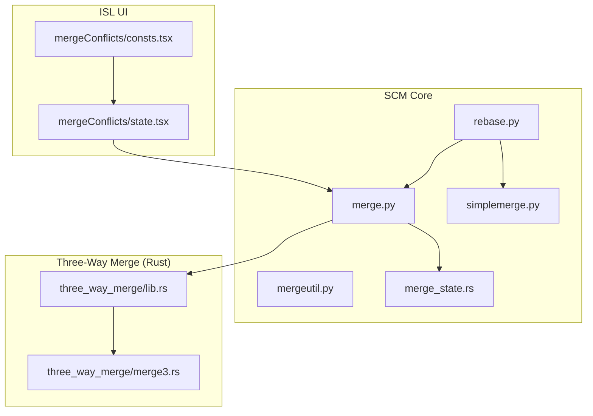
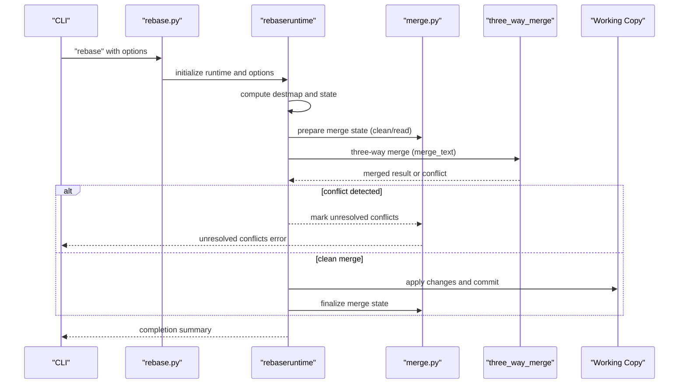
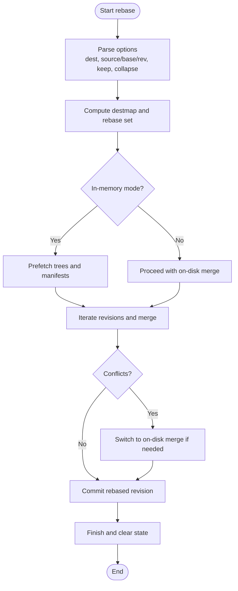
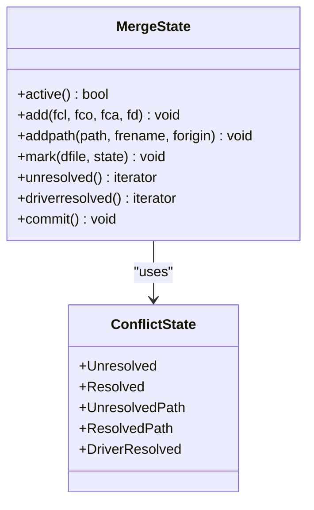
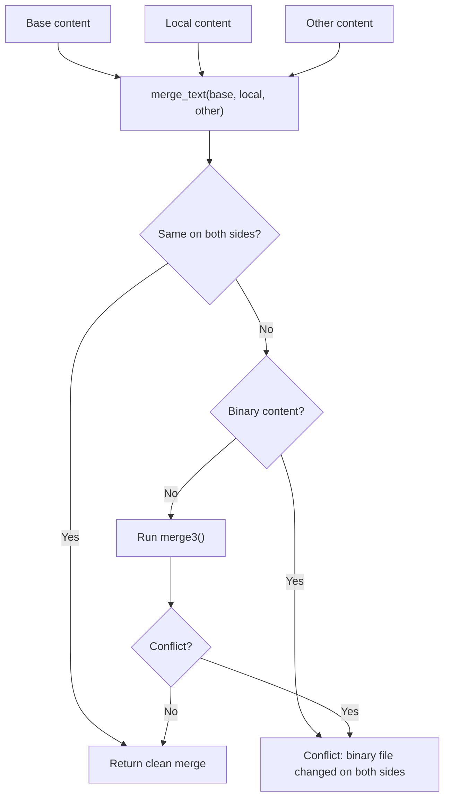
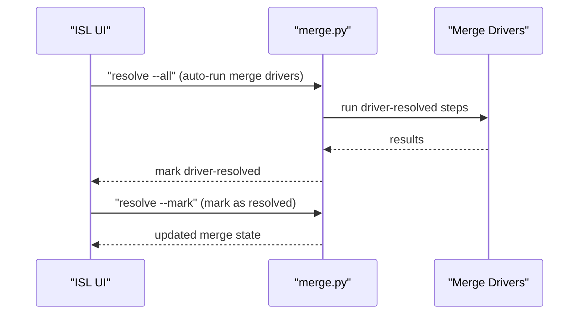
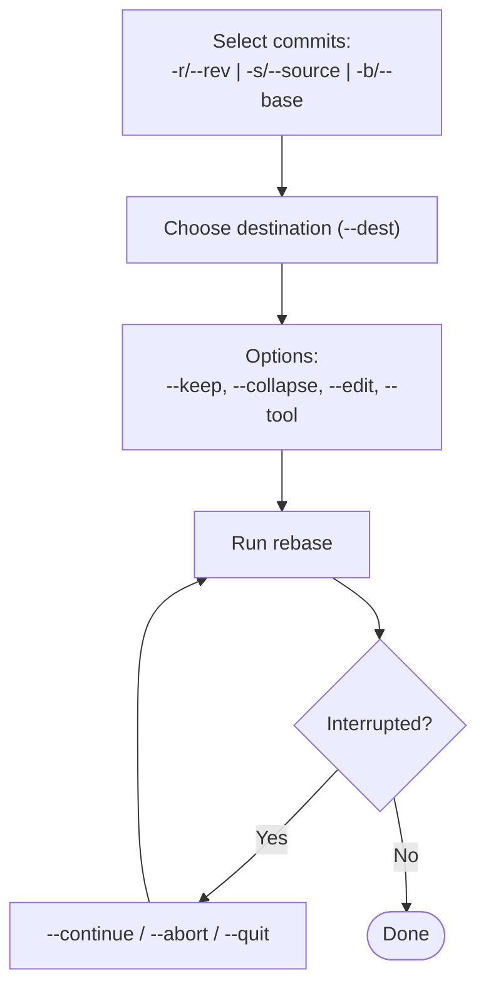
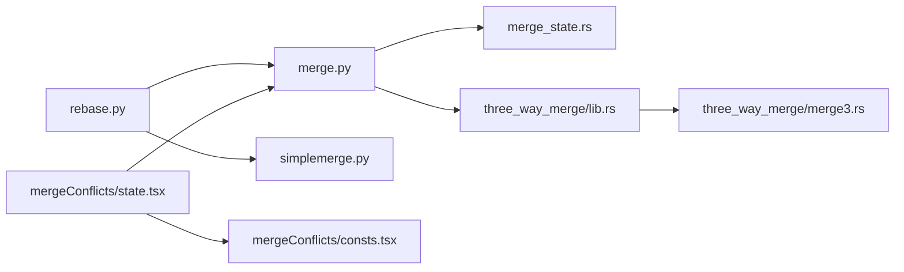
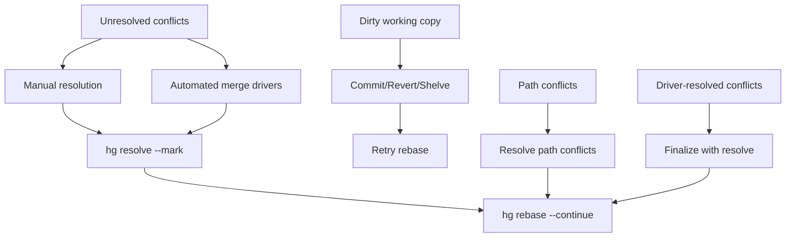

# Merge and Rebase Operations

<cite>
**Referenced Files in This Document**
- [rebase.py](file://eden/scm/sapling/ext/rebase.py)
- [merge.py](file://eden/scm/sapling/merge.py)
- [simplemerge.py](file://eden/scm/sapling/simplemerge.py)
- [mergeutil.py](file://eden/scm/sapling/mergeutil.py)
- [merge_state.rs](file://eden/scm/lib/workingcopy/repostate/src/merge_state.rs)
- [lib.rs (workingcopy repostate)](file://eden/scm/lib/workingcopy/repostate/src/lib.rs)
- [lib.rs (three_way_merge)](file://eden/mononoke/common/three_way_merge/src/lib.rs)
- [merge3.rs](file://eden/mononoke/common/three_way_merge/src/merge3.rs)
- [rebase.md](file://website/docs/commands/rebase.md)
- [rebase.md (overview)](file://website/docs/overview/rebase.md)
- [state.tsx (mergeConflicts)](file://addons/isl/src/mergeConflicts/state.tsx)
- [consts.tsx (mergeConflicts)](file://addons/isl/src/mergeConflicts/consts.tsx)
- [conflictinfo.py](file://eden/scm/sapling/ext/conflictinfo.py)
- [rebase.py (extension)](file://eden/scm/sapling/ext/rebase.py)
- [resolve.rs (pushrebase)](file://eden/mononoke/features/pushrebase/src/lib.rs)
</cite>

## Table of Contents
1. [Introduction](#introduction)
2. [Project Structure](#project-structure)
3. [Core Components](#core-components)
4. [Architecture Overview](#architecture-overview)
5. [Detailed Component Analysis](#detailed-component-analysis)
6. [Dependency Analysis](#dependency-analysis)
7. [Performance Considerations](#performance-considerations)
8. [Troubleshooting Guide](#troubleshooting-guide)
9. [Conclusion](#conclusion)
10. [Appendices](#appendices)

## Introduction
This document explains SAPLING SCM merge and rebase operations with a focus on practical workflows, conflict resolution strategies, and advanced options. It covers:
- Merge strategies and three-way merging
- Rebase workflows and history rewriting
- Conflict resolution techniques and automated tools
- Interactive rebase options and commit editing
- Practical examples for integrating feature branches and rebasing onto upstream changes
- Guidance for handling complex merge scenarios and maintaining a clean repository history

## Project Structure
The merge and rebase functionality spans both the core SCM layer and the web-based ISL (Interactive Smartlog) UI:
- Core SCM merge and rebase logic resides in the SCM extension modules
- Three-way merge algorithms are implemented in Rust for performance and correctness
- The ISL UI provides interactive conflict resolution and automation settings

**Diagram sources**
- [rebase.py:1096-1263](file://eden/scm/sapling/ext/rebase.py#L1096-L1263)
- [merge.py:69-300](file://eden/scm/sapling/merge.py#L69-L300)
- [simplemerge.py:667-711](file://eden/scm/sapling/simplemerge.py#L667-L711)
- [mergeutil.py:1-25](file://eden/scm/sapling/mergeutil.py#L1-L25)
- [merge_state.rs:645-685](file://eden/scm/lib/workingcopy/repostate/src/merge_state.rs#L645-L685)
- [lib.rs (three_way_merge):37-75](file://eden/mononoke/common/three_way_merge/src/lib.rs#L37-L75)
- [merge3.rs:450-565](file://eden/mononoke/common/three_way_merge/src/merge3.rs#L450-L565)
- [state.tsx (mergeConflicts):1-55](file://addons/isl/src/mergeConflicts/state.tsx#L1-L55)
- [consts.tsx (mergeConflicts):1-20](file://addons/isl/src/mergeConflicts/consts.tsx#L1-L20)

**Section sources**
- [rebase.py:1096-1263](file://eden/scm/sapling/ext/rebase.py#L1096-L1263)
- [merge.py:69-300](file://eden/scm/sapling/merge.py#L69-L300)
- [lib.rs (three_way_merge):37-75](file://eden/mononoke/common/three_way_merge/src/lib.rs#L37-L75)

## Core Components
- Rebase command and runtime: orchestrates commit selection, parent/destination computation, in-memory vs on-disk execution, and state persistence
- Merge state: tracks unresolved and resolved conflicts, path conflicts, and driver-resolved states
- Three-way merge engine: performs line-level merging and detects conflicts
- Simple merge helpers: minimize conflict regions and render conflict blocks
- ISL conflict UI: provides automated merge driver execution and settings for continuing with auto-resolution

Key responsibilities:
- Rebase: computes parents, merges manifests, optionally edits commit messages, and handles public vs draft commits
- Merge: manages per-file merge state, pre-merge and full merge passes, and applies actions to the working copy
- Conflict resolution: supports manual resolution, automated merge drivers, and conflict minimization

**Section sources**
- [rebase.py:216-526](file://eden/scm/sapling/ext/rebase.py#L216-L526)
- [merge.py:69-300](file://eden/scm/sapling/merge.py#L69-L300)
- [merge_state.rs:645-685](file://eden/scm/lib/workingcopy/repostate/src/merge_state.rs#L645-L685)
- [lib.rs (three_way_merge):37-75](file://eden/mononoke/common/three_way_merge/src/lib.rs#L37-L75)
- [simplemerge.py:667-711](file://eden/scm/sapling/simplemerge.py#L667-L711)
- [state.tsx (mergeConflicts):16-21](file://addons/isl/src/mergeConflicts/state.tsx#L16-L21)

## Architecture Overview
The rebase pipeline integrates with the working copy and merge state machine. It supports:
- In-memory rebase for speed and resilience to dirty working copies
- On-disk rebase for compatibility with complex conflicts and external tools
- Automatic conflict detection and fallback to on-disk mode
- Commit message editing and collapsing multiple commits into one

**Diagram sources**
- [rebase.py:1364-1471](file://eden/scm/sapling/ext/rebase.py#L1364-L1471)
- [merge.py:95-196](file://eden/scm/sapling/merge.py#L95-L196)
- [lib.rs (three_way_merge):37-75](file://eden/mononoke/common/three_way_merge/src/lib.rs#L37-L75)

## Detailed Component Analysis

### Rebase Command and Runtime
The rebase command supports selecting commits via revision range, source subtree, or base subtree. It can keep original commits visible, collapse commits, and edit commit messages. It also handles fast-forwarding bookmarks and switching between in-memory and on-disk modes.

**Diagram sources**
- [rebase.py:1096-1263](file://eden/scm/sapling/ext/rebase.py#L1096-L1263)
- [rebase.py:1364-1471](file://eden/scm/sapling/ext/rebase.py#L1364-L1471)

**Section sources**
- [rebase.py:1096-1263](file://eden/scm/sapling/ext/rebase.py#L1096-L1263)
- [rebase.py:1364-1471](file://eden/scm/sapling/ext/rebase.py#L1364-L1471)

### Merge State and Conflict Tracking
The merge state tracks per-file conflict states and path conflicts. It distinguishes unresolved, resolved, path conflicts, and driver-resolved states. It also persists merge state and supports driver-resolved files.

**Diagram sources**
- [merge.py:69-300](file://eden/scm/sapling/merge.py#L69-L300)
- [merge_state.rs:645-685](file://eden/scm/lib/workingcopy/repostate/src/merge_state.rs#L645-L685)

**Section sources**
- [merge.py:69-300](file://eden/scm/sapling/merge.py#L69-L300)
- [merge_state.rs:645-685](file://eden/scm/lib/workingcopy/repostate/src/merge_state.rs#L645-L685)

### Three-Way Merge Engine
The three-way merge engine performs line-level merging and detects conflicts for overlapping or incompatible changes. It returns clean merges or conflict indicators.

**Diagram sources**
- [lib.rs (three_way_merge):37-75](file://eden/mononoke/common/three_way_merge/src/lib.rs#L37-L75)
- [merge3.rs:450-565](file://eden/mononoke/common/three_way_merge/src/merge3.rs#L450-L565)

**Section sources**
- [lib.rs (three_way_merge):37-75](file://eden/mononoke/common/three_way_merge/src/lib.rs#L37-L75)
- [merge3.rs:450-565](file://eden/mononoke/common/three_way_merge/src/merge3.rs#L450-L565)

### Conflict Resolution Strategies
- Manual resolution: insert conflict markers and edit files to resolve differences
- Automated merge drivers: run merge drivers to regenerate files and reduce conflicts
- Pre-merge and full merge passes: separate pre-merge to handle flags and metadata, then full merge for content
- Minimizing conflict regions: trim common prefixes and suffixes to reduce conflict size

**Diagram sources**
- [state.tsx (mergeConflicts):16-21](file://addons/isl/src/mergeConflicts/state.tsx#L16-L21)
- [merge.py:377-505](file://eden/scm/sapling/merge.py#L377-L505)

**Section sources**
- [state.tsx (mergeConflicts):16-21](file://addons/isl/src/mergeConflicts/state.tsx#L16-L21)
- [merge.py:377-505](file://eden/scm/sapling/merge.py#L377-L505)

### Interactive Rebase and Commit Editing
- Select commits via revision range, source subtree, or base subtree
- Edit commit messages during rebase
- Collapse multiple commits into one
- Continue, abort, or quit interrupted rebases

**Diagram sources**
- [rebase.py:1096-1263](file://eden/scm/sapling/ext/rebase.py#L1096-L1263)
- [rebase.md:1-142](file://website/docs/commands/rebase.md#L1-L142)

**Section sources**
- [rebase.py:1096-1263](file://eden/scm/sapling/ext/rebase.py#L1096-L1263)
- [rebase.md:1-142](file://website/docs/commands/rebase.md#L1-L142)

### Practical Scenarios and Examples
- Integrating a feature branch: select the feature head and rebase onto the target branch
- Rebasing onto upstream changes: rebase current subtree onto the upstream branch
- Resolving merge conflicts: use manual resolution or automated merge drivers

Reference examples and guidance are documented in the command documentation and overview.

**Section sources**
- [rebase.md (overview):57-125](file://website/docs/overview/rebase.md#L57-L125)
- [rebase.md:1-142](file://website/docs/commands/rebase.md#L1-L142)

## Dependency Analysis
The rebase and merge subsystems depend on:
- Working copy and merge state persistence
- Three-way merge engine for conflict detection
- ISL UI for automated conflict resolution and settings

**Diagram sources**
- [rebase.py:1096-1263](file://eden/scm/sapling/ext/rebase.py#L1096-L1263)
- [merge.py:69-300](file://eden/scm/sapling/merge.py#L69-L300)
- [merge_state.rs:645-685](file://eden/scm/lib/workingcopy/repostate/src/merge_state.rs#L645-L685)
- [lib.rs (three_way_merge):37-75](file://eden/mononoke/common/three_way_merge/src/lib.rs#L37-L75)
- [merge3.rs:450-565](file://eden/mononoke/common/three_way_merge/src/merge3.rs#L450-L565)
- [state.tsx (mergeConflicts):1-55](file://addons/isl/src/mergeConflicts/state.tsx#L1-L55)
- [consts.tsx (mergeConflicts):1-20](file://addons/isl/src/mergeConflicts/consts.tsx#L1-L20)

**Section sources**
- [rebase.py:1096-1263](file://eden/scm/sapling/ext/rebase.py#L1096-L1263)
- [merge.py:69-300](file://eden/scm/sapling/merge.py#L69-L300)
- [lib.rs (three_way_merge):37-75](file://eden/mononoke/common/three_way_merge/src/lib.rs#L37-L75)

## Performance Considerations
- In-memory rebase reduces disk I/O and supports rebasing with dirty working copies
- Single-transaction mode batches commits for better throughput
- Prefetching trees and manifests accelerates rebase operations
- Automated merge drivers can speed up regeneration of generated files

Recommendations:
- Prefer in-memory rebase for speed when compatible
- Enable single-transaction mode for large rebases
- Use automated merge drivers to reduce manual intervention

**Section sources**
- [rebase.py:1017-1059](file://eden/scm/sapling/ext/rebase.py#L1017-L1059)
- [rebase.py:1297-1343](file://eden/scm/sapling/ext/rebase.py#L1297-L1343)
- [state.tsx (mergeConflicts):16-21](file://addons/isl/src/mergeConflicts/state.tsx#L16-L21)

## Troubleshooting Guide
Common issues and resolutions:
- Unresolved conflicts: use manual resolution or automated merge drivers; then continue or abort the operation
- Dirty working copy during in-memory rebase: commit, revert, or shelve changes before proceeding
- Path conflicts: resolve path conflicts before continuing
- Driver-resolved conflicts: run the appropriate resolve command to finalize

**Diagram sources**
- [mergeutil.py:18-25](file://eden/scm/sapling/mergeutil.py#L18-L25)
- [merge.py:377-505](file://eden/scm/sapling/merge.py#L377-L505)
- [rebase.py:617-694](file://eden/scm/sapling/ext/rebase.py#L617-L694)

**Section sources**
- [mergeutil.py:18-25](file://eden/scm/sapling/mergeutil.py#L18-L25)
- [merge.py:377-505](file://eden/scm/sapling/merge.py#L377-L505)
- [rebase.py:617-694](file://eden/scm/sapling/ext/rebase.py#L617-L694)

## Conclusion
SAPLING SCM provides robust merge and rebase capabilities with strong support for three-way merging, conflict resolution, and history rewriting. By leveraging in-memory rebase, automated merge drivers, and the ISL UI, teams can integrate feature branches efficiently, rebase onto upstream changes cleanly, and resolve conflicts quickly while maintaining a clear repository history.

## Appendices

### Additional Notes on Conflict Markers and Tools
- Conflict markers are inserted into affected files during rebase
- Custom merge tools can be configured and used to automate conflict resolution
- The internal dump-json tool can output conflict info for random-access resolution

**Section sources**
- [rebase.py:1188-1215](file://eden/scm/sapling/ext/rebase.py#L1188-L1215)
- [conflictinfo.py:1-39](file://eden/scm/sapling/ext/conflictinfo.py#L1-L39)

### Push Rebase and Automated Resolution Hooks
Push rebase includes automated conflict resolution checks and can attempt to merge changes before concluding.

**Section sources**
- [resolve.rs (pushrebase):703-739](file://eden/mononoke/features/pushrebase/src/lib.rs#L703-L739)