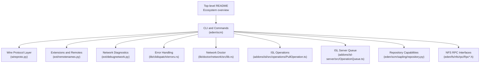
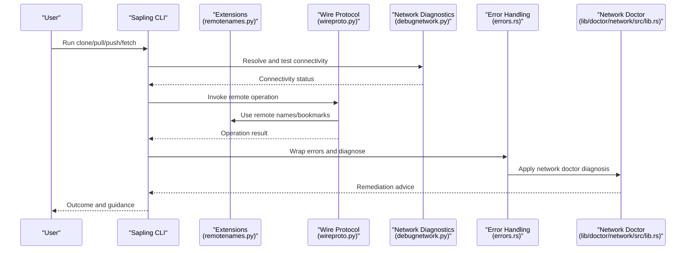
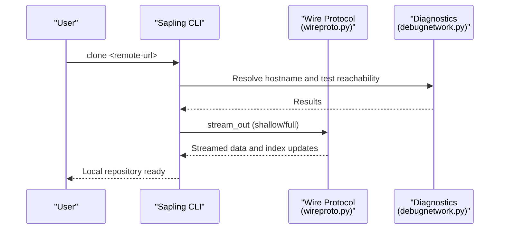
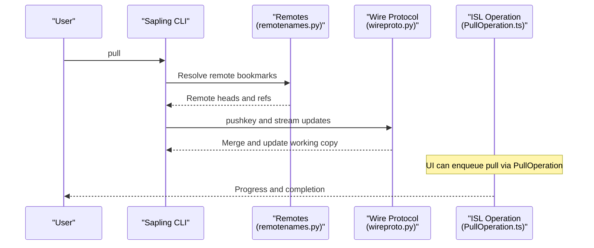
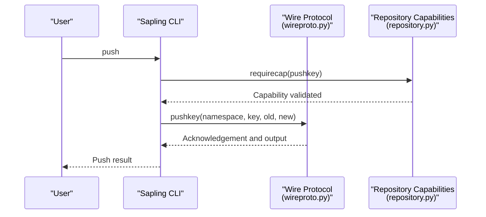
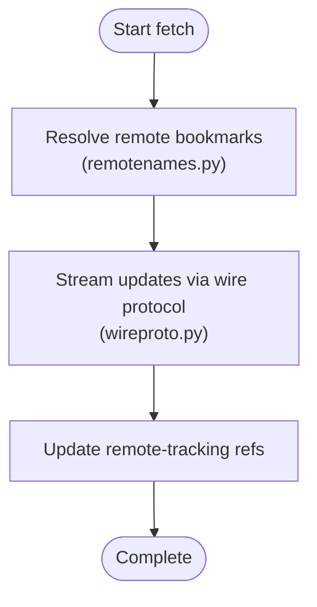
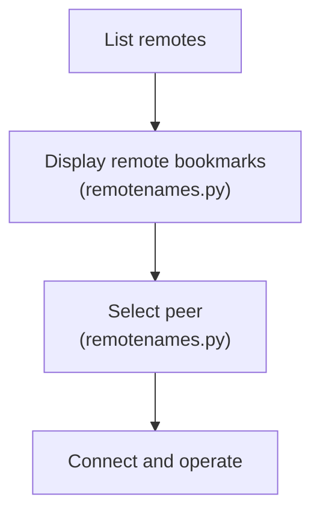
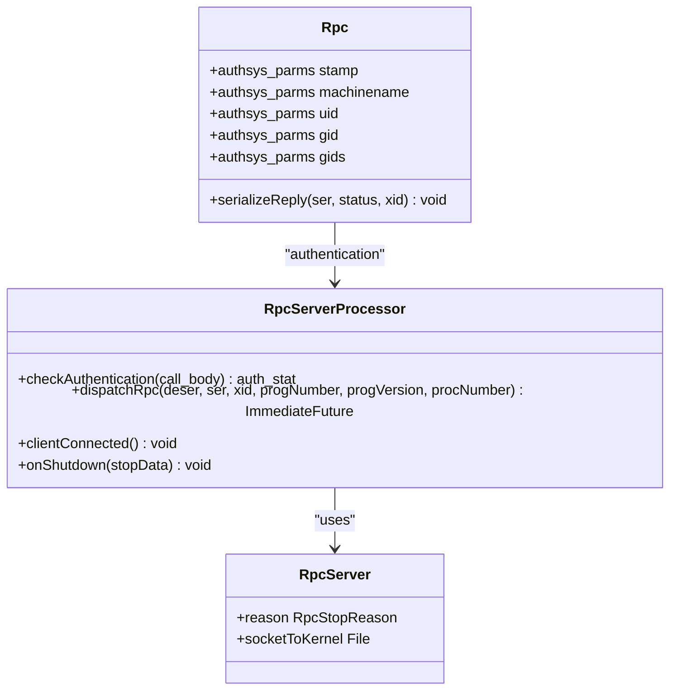
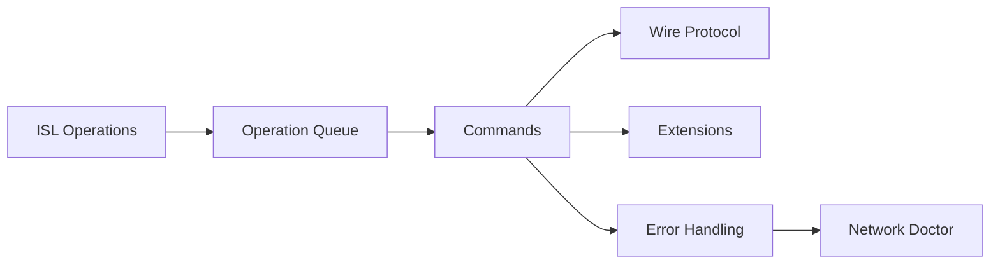

# Repository Operations

<cite>
**Referenced Files in This Document**
- [README.md](file://README.md)
- [wireproto.py](file://eden/scm/sapling/wireproto.py)
- [remotenames.py](file://eden/scm/sapling/ext/remotenames.py)
- [debugnetwork.py](file://eden/scm/sapling/ext/debugnetwork.py)
- [lib.rs (network doctor)](file://eden/scm/lib/doctor/network/src/lib.rs)
- [errors.rs](file://eden/scm/lib/clidispatch/src/errors.rs)
- [PullOperation.ts](file://addons/isl/src/operations/PullOperation.ts)
- [OperationQueue.ts](file://addons/isl-server/src/OperationQueue.ts)
- [repository.py](file://eden/scm/sapling/repository.py)
- [RpcServer.h](file://eden/fs/nfs/rpc/RpcServer.h)
- [Rpc.h](file://eden/fs/nfs/rpc/Rpc.h)
</cite>

## Table of Contents
1. [Introduction](#introduction)
2. [Project Structure](#project-structure)
3. [Core Components](#core-components)
4. [Architecture Overview](#architecture-overview)
5. [Detailed Component Analysis](#detailed-component-analysis)
6. [Dependency Analysis](#dependency-analysis)
7. [Performance Considerations](#performance-considerations)
8. [Troubleshooting Guide](#troubleshooting-guide)
9. [Conclusion](#conclusion)
10. [Appendices](#appendices)

## Introduction
This document explains repository operations in SAPLING SCM with a focus on clone, pull, push, and fetch workflows. It covers repository initialization, remote management, network operations, authentication considerations, proxy configuration, and troubleshooting for common issues such as connectivity problems, authentication failures, and repository conflicts. The content is grounded in the repository’s implementation and documentation artifacts.

## Project Structure
SAPLING SCM’s CLI and related components are primarily located under the eden/scm directory. The repository overview and ecosystem are described in the top-level README. The command-line interface is built around a wire protocol and extension modules that implement remote operations, diagnostics, and error handling.

**Section sources**
- [README.md:1–80:1-80](file://README.md#L1-L80)

## Core Components
- Wire Protocol: Implements low-level operations such as pushkey and streaming clone, and integrates with capabilities and configuration.
- Remote Names and Remotes: Manages remote bookmark display and peer selection for remote operations.
- Network Diagnostics: Provides hostname resolution and reachability checks for network troubleshooting.
- Error Handling: Centralizes error wrapping and network doctor diagnosis for actionable feedback.
- Network Doctor: Validates HTTP connectivity and detects proxy-related issues.
- ISL Operations and Server Queue: Orchestrates command execution and progress reporting for UI integrations.
- Repository Capabilities: Enforces capability checks for remote operations.
- NFS RPC Interfaces: Defines RPC structures and authentication mechanisms used by lower-level services.

**Section sources**
- [wireproto.py:346–387:346-387](file://eden/scm/sapling/wireproto.py#L346-L387)
- [remotenames.py:1296–1344:1296-1344](file://eden/scm/sapling/ext/remotenames.py#L1296-L1344)
- [debugnetwork.py:47–86:47-86](file://eden/scm/sapling/ext/debugnetwork.py#L47-L86)
- [errors.rs:146–188:146-188](file://eden/scm/lib/clidispatch/src/errors.rs#L146-L188)
- [lib.rs (network doctor):618–658:618-658](file://eden/scm/lib/doctor/network/src/lib.rs#L618-L658)
- [PullOperation.ts:10–20:10-20](file://addons/isl/src/operations/PullOperation.ts#L10-L20)
- [OperationQueue.ts:102–133:102-133](file://addons/isl-server/src/OperationQueue.ts#L102-L133)
- [repository.py:265–293:265-293](file://eden/scm/sapling/repository.py#L265-L293)
- [RpcServer.h:51–96:51-96](file://eden/fs/nfs/rpc/RpcServer.h#L51-L96)
- [Rpc.h:132–184:132-184](file://eden/fs/nfs/rpc/Rpc.h#L132-L184)

## Architecture Overview
The repository operations pipeline connects the CLI to remote servers via a wire protocol, with diagnostics and error handling layered beneath. UI integrations (ISL) enqueue operations and report progress. Capability checks and RPC structures underpin secure and reliable communication.

**Diagram sources**
- [wireproto.py:346–387:346-387](file://eden/scm/sapling/wireproto.py#L346-L387)
- [remotenames.py:1296–1344:1296-1344](file://eden/scm/sapling/ext/remotenames.py#L1296-L1344)
- [debugnetwork.py:47–86:47-86](file://eden/scm/sapling/ext/debugnetwork.py#L47-L86)
- [errors.rs:146–188:146-188](file://eden/scm/lib/clidispatch/src/errors.rs#L146-L188)
- [lib.rs (network doctor):618–658:618-658](file://eden/scm/lib/doctor/network/src/lib.rs#L618-L658)

## Detailed Component Analysis

### Clone Workflow
- Purpose: Initialize a local repository from a remote source and populate working files.
- Key behaviors:
  - Streaming clone support via wire protocol stream_out and capability checks.
  - Full clone vs shallow clone options controlled by configuration and capability.
- Practical steps:
  - Configure remote origin and branch mapping.
  - Execute clone; the wire protocol handles streaming and indexing.
  - Use diagnostics to verify DNS resolution and reachability.

**Diagram sources**
- [wireproto.py:380–387:380-387](file://eden/scm/sapling/wireproto.py#L380-L387)
- [debugnetwork.py:47–86:47-86](file://eden/scm/sapling/ext/debugnetwork.py#L47-L86)

**Section sources**
- [wireproto.py:380–387:380-387](file://eden/scm/sapling/wireproto.py#L380-L387)
- [debugnetwork.py:47–86:47-86](file://eden/scm/sapling/ext/debugnetwork.py#L47-L86)

### Pull Workflow
- Purpose: Update the local working copy by integrating changes from a remote branch.
- Key behaviors:
  - Uses wire protocol pushkey and remote bookmark management.
  - Supports capability checks to ensure remote compatibility.
- Practical steps:
  - Ensure the remote is configured and reachable.
  - Run pull; the system resolves remote names and applies changes.
  - Use ISL operations to trigger pull from the UI.

**Diagram sources**
- [remotenames.py:1296–1344:1296-1344](file://eden/scm/sapling/ext/remotenames.py#L1296-L1344)
- [wireproto.py:355–378:355-378](file://eden/scm/sapling/wireproto.py#L355-L378)
- [PullOperation.ts:10–20:10-20](file://addons/isl/src/operations/PullOperation.ts#L10-L20)

**Section sources**
- [remotenames.py:1296–1344:1296-1344](file://eden/scm/sapling/ext/remotenames.py#L1296-L1344)
- [wireproto.py:355–378:355-378](file://eden/scm/sapling/wireproto.py#L355-L378)
- [PullOperation.ts:10–20:10-20](file://addons/isl/src/operations/PullOperation.ts#L10-L20)

### Push Workflow
- Purpose: Share local changes with collaborators by uploading commits to a remote.
- Key behaviors:
  - pushkey operation for namespace-based updates.
  - Capability checks to ensure remote supports required operations.
- Practical steps:
  - Verify remote configuration and credentials.
  - Execute push; the wire protocol coordinates namespace updates.
  - Monitor for capability mismatches and adjust accordingly.

**Diagram sources**
- [wireproto.py:355–378:355-378](file://eden/scm/sapling/wireproto.py#L355-L378)
- [repository.py:278–293:278-293](file://eden/scm/sapling/repository.py#L278-L293)

**Section sources**
- [wireproto.py:355–378:355-378](file://eden/scm/sapling/wireproto.py#L355-L378)
- [repository.py:278–293:278-293](file://eden/scm/sapling/repository.py#L278-L293)

### Fetch Workflow
- Purpose: Retrieve changes from a remote without merging into the working copy.
- Key behaviors:
  - Uses remote bookmark and head resolution.
  - Integrates with wire protocol streaming for efficient transfer.
- Practical steps:
  - Configure remotes and branches.
  - Run fetch to update remote-tracking branches.
  - Use diagnostics to confirm connectivity if fetch fails.

**Diagram sources**
- [remotenames.py:1296–1344:1296-1344](file://eden/scm/sapling/ext/remotenames.py#L1296-L1344)
- [wireproto.py:346–387:346-387](file://eden/scm/sapling/wireproto.py#L346-L387)

**Section sources**
- [remotenames.py:1296–1344:1296-1344](file://eden/scm/sapling/ext/remotenames.py#L1296-L1344)
- [wireproto.py:346–387:346-387](file://eden/scm/sapling/wireproto.py#L346-L387)

### Remote Management
- Remote bookmark display and selection:
  - Lists remote bookmarks and associated nodes.
  - Supports formatted output and color labeling.
- Peer selection:
  - Resolves remote path and prepares peer connections.

**Diagram sources**
- [remotenames.py:1296–1344:1296-1344](file://eden/scm/sapling/ext/remotenames.py#L1296-L1344)

**Section sources**
- [remotenames.py:1296–1344:1296-1344](file://eden/scm/sapling/ext/remotenames.py#L1296-L1344)

### Authentication and Proxy Configuration
- Authentication:
  - RPC structures define authentication parameters and statuses.
  - RPC server processors validate credentials and manage connections.
- Proxy and connectivity:
  - Network doctor validates HTTP endpoints and detects proxy issues.
  - Configurable auth proxy settings and domain mappings.

**Diagram sources**
- [RpcServer.h:51–96:51-96](file://eden/fs/nfs/rpc/RpcServer.h#L51-L96)
- [Rpc.h:132–184:132-184](file://eden/fs/nfs/rpc/Rpc.h#L132-L184)

**Section sources**
- [RpcServer.h:51–96:51-96](file://eden/fs/nfs/rpc/RpcServer.h#L51-L96)
- [Rpc.h:132–184:132-184](file://eden/fs/nfs/rpc/Rpc.h#L132-L184)
- [lib.rs (network doctor):618–658:618-658](file://eden/scm/lib/doctor/network/src/lib.rs#L618-L658)

## Dependency Analysis
- CLI commands depend on wire protocol operations and extension modules for remote handling.
- Error handling wraps command failures and augments them with network doctor diagnoses.
- ISL operations enqueue commands and report progress; the server queue manages execution order and error propagation.

**Diagram sources**
- [wireproto.py:346–387:346-387](file://eden/scm/sapling/wireproto.py#L346-L387)
- [remotenames.py:1296–1344:1296-1344](file://eden/scm/sapling/ext/remotenames.py#L1296-L1344)
- [errors.rs:146–188:146-188](file://eden/scm/lib/clidispatch/src/errors.rs#L146-L188)
- [lib.rs (network doctor):618–658:618-658](file://eden/scm/lib/doctor/network/src/lib.rs#L618-L658)
- [PullOperation.ts:10–20:10-20](file://addons/isl/src/operations/PullOperation.ts#L10-L20)
- [OperationQueue.ts:102–133:102-133](file://addons/isl-server/src/OperationQueue.ts#L102-L133)

**Section sources**
- [wireproto.py:346–387:346-387](file://eden/scm/sapling/wireproto.py#L346-L387)
- [remotenames.py:1296–1344:1296-1344](file://eden/scm/sapling/ext/remotenames.py#L1296-L1344)
- [errors.rs:146–188:146-188](file://eden/scm/lib/clidispatch/src/errors.rs#L146-L188)
- [lib.rs (network doctor):618–658:618-658](file://eden/scm/lib/doctor/network/src/lib.rs#L618-L658)
- [PullOperation.ts:10–20:10-20](file://addons/isl/src/operations/PullOperation.ts#L10-L20)
- [OperationQueue.ts:102–133:102-133](file://addons/isl-server/src/OperationQueue.ts#L102-L133)

## Performance Considerations
- Streaming clone reduces initial checkout time by transferring changelog data incrementally.
- Capability checks prevent unnecessary operations on incompatible remotes.
- Batched wire protocol requests minimize overhead during fetch and pull.
- UI-driven operations are queued and executed sequentially to avoid contention.

[No sources needed since this section provides general guidance]

## Troubleshooting Guide
- Network connectivity:
  - Use hostname resolution and reachability checks to identify DNS or port issues.
  - Validate HTTP endpoints and proxy configurations with the network doctor.
- Authentication failures:
  - Review RPC authentication parameters and server processor responses.
  - Confirm auth proxy settings and domain mappings.
- Repository conflicts:
  - Ensure capability requirements are met before push.
  - Use diagnostics to detect and resolve connectivity anomalies.

**Section sources**
- [debugnetwork.py:47–86:47-86](file://eden/scm/sapling/ext/debugnetwork.py#L47-L86)
- [lib.rs (network doctor):618–658:618-658](file://eden/scm/lib/doctor/network/src/lib.rs#L618-L658)
- [RpcServer.h:51–96:51-96](file://eden/fs/nfs/rpc/RpcServer.h#L51-L96)
- [Rpc.h:132–184:132-184](file://eden/fs/nfs/rpc/Rpc.h#L132-L184)
- [repository.py:278–293:278-293](file://eden/scm/sapling/repository.py#L278-L293)
- [errors.rs:146–188:146-188](file://eden/scm/lib/clidispatch/src/errors.rs#L146-L188)

## Conclusion
SAPLING SCM’s repository operations are built on a robust wire protocol, comprehensive diagnostics, and capability-aware remote management. By leveraging streaming clone, capability checks, and network doctor insights, users can reliably clone, pull, push, and fetch while troubleshooting connectivity and authentication issues effectively.

[No sources needed since this section summarizes without analyzing specific files]

## Appendices
- Practical workflows:
  - Clone a remote repository and configure the default branch.
  - Update local copies by pulling from the configured remote.
  - Share changes with collaborators by pushing to the remote.
  - Manage multiple remotes by listing and selecting appropriate peers.
- Error handling:
  - Command failures are wrapped with network doctor diagnoses for actionable remediation.

[No sources needed since this section provides general guidance]