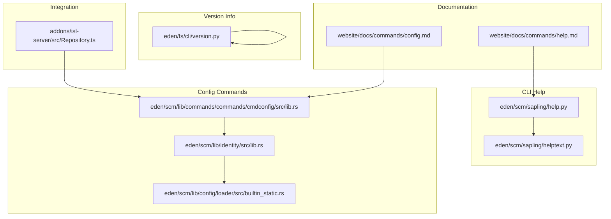
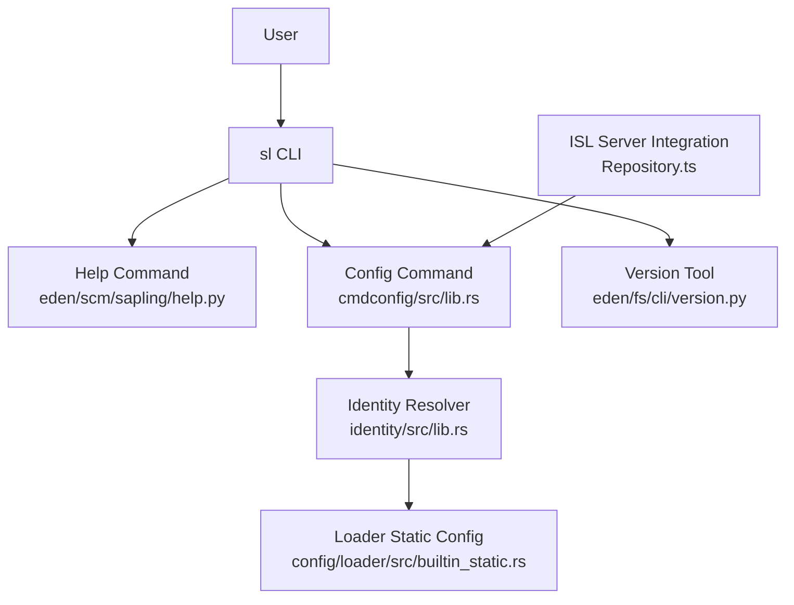
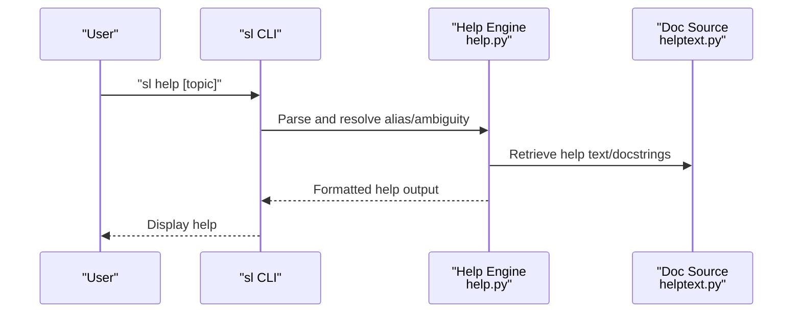
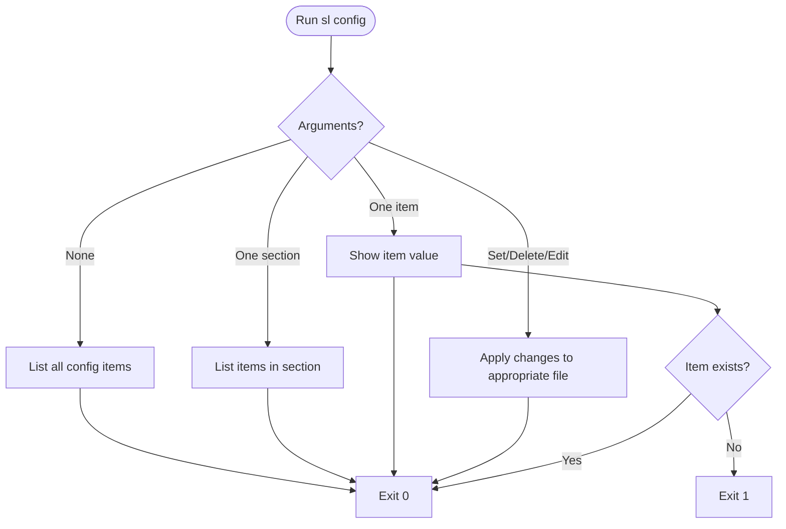
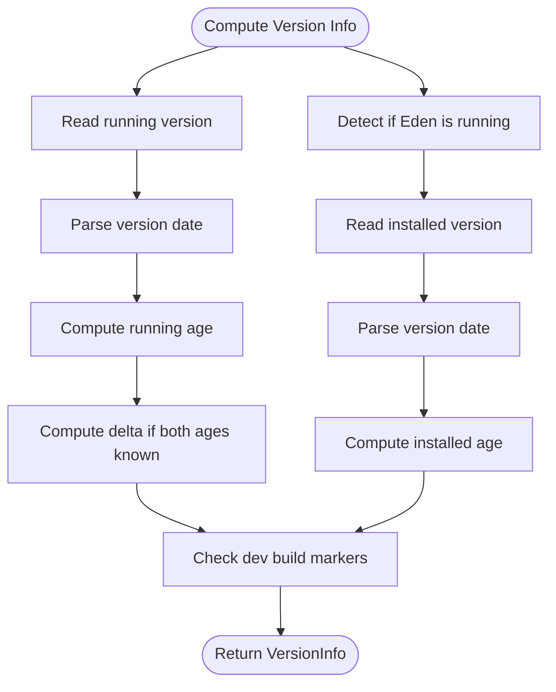
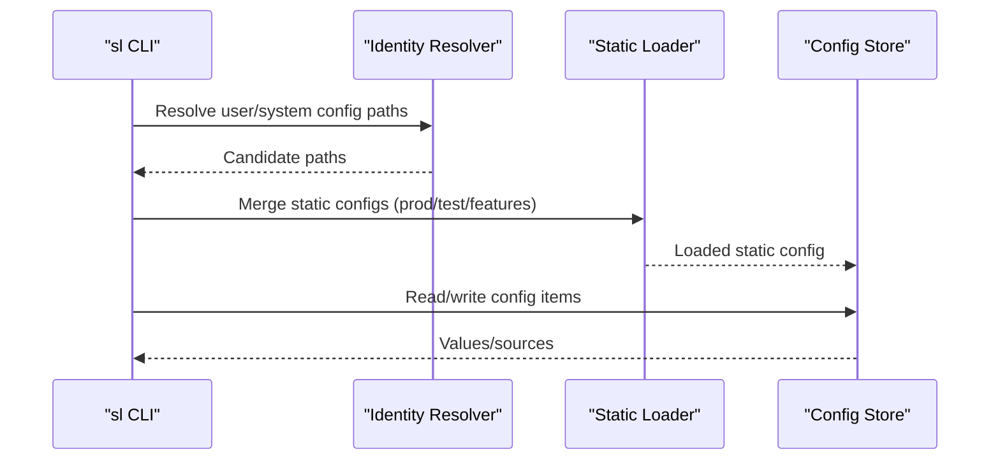
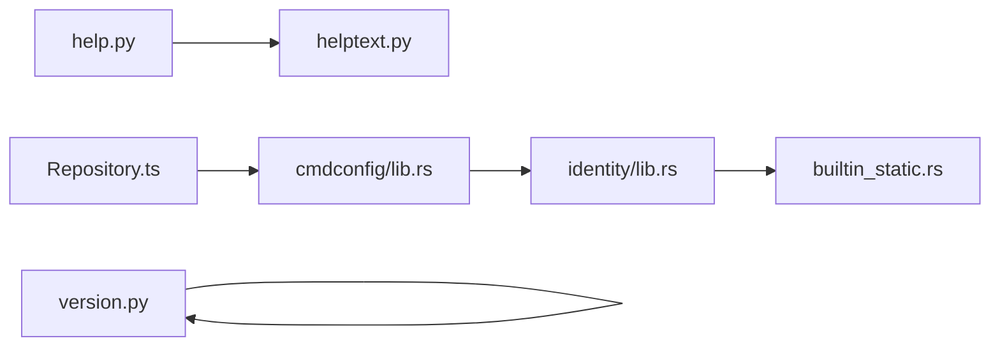

# Utility Commands

<cite>
**Referenced Files in This Document**
- [help.md](file://website/docs/commands/help.md)
- [config.md](file://website/docs/commands/config.md)
- [version.py](file://eden/fs/cli/version.py)
- [help.py](file://eden/scm/sapling/help.py)
- [helptext.py](file://eden/scm/sapling/helptext.py)
- [lib.rs (cmdconfig)](file://eden/scm/lib/commands/commands/cmdconfig/src/lib.rs)
- [lib.rs (identity)](file://eden/scm/lib/identity/src/lib.rs)
- [builtin_static.rs](file://eden/scm/lib/config/loader/src/builtin_static.rs)
- [Repository.ts](file://addons/isl-server/src/Repository.ts)
- [README.md](file://README.md)
</cite>

## Table of Contents
1. [Introduction](#introduction)
2. [Project Structure](#project-structure)
3. [Core Components](#core-components)
4. [Architecture Overview](#architecture-overview)
5. [Detailed Component Analysis](#detailed-component-analysis)
6. [Dependency Analysis](#dependency-analysis)
7. [Performance Considerations](#performance-considerations)
8. [Troubleshooting Guide](#troubleshooting-guide)
9. [Conclusion](#conclusion)

## Introduction
This document explains the SAPLING SCM utility commands focused on help, version, and configuration management. It covers command discovery, configuration file locations, environment variables, and system information retrieval. It also provides usage patterns, examples, troubleshooting tips, and guidance for customizing behavior and tuning performance through configuration.

## Project Structure
The relevant implementation spans documentation, CLI help, configuration loading, identity resolution, and runtime version reporting:
- Documentation for commands resides under website docs.
- CLI help and command discovery logic is implemented in the SAPLING SCM Python module.
- Configuration commands and loaders are implemented in Rust libraries.
- Runtime version information is computed in the CLI version module.
- An addon integrates with the CLI to read configuration values.

**Diagram sources**
- [help.md:1-28](file://website/docs/commands/help.md#L1-L28)
- [config.md:1-46](file://website/docs/commands/config.md#L1-L46)
- [help.py:417-624](file://eden/scm/sapling/help.py#L417-L624)
- [helptext.py:381-422](file://eden/scm/sapling/helptext.py#L381-L422)
- [lib.rs (cmdconfig):259-303](file://eden/scm/lib/commands/commands/cmdconfig/src/lib.rs#L259-L303)
- [lib.rs (identity):172-274](file://eden/scm/lib/identity/src/lib.rs#L172-L274)
- [builtin_static.rs:45-91](file://eden/scm/lib/config/loader/src/builtin_static.rs#L45-L91)
- [version.py:1-131](file://eden/fs/cli/version.py#L1-L131)
- [Repository.ts:1670-1696](file://addons/isl-server/src/Repository.ts#L1670-L1696)

**Section sources**
- [README.md:30-36](file://README.md#L30-L36)
- [help.md:1-28](file://website/docs/commands/help.md#L1-L28)
- [config.md:1-46](file://website/docs/commands/config.md#L1-L46)

## Core Components
- Help command: Lists commands and topics, supports filtering by extension, command, keyword, and platform.
- Config command: Reads and edits configuration across user, system, and local scopes; supports deletion and debug output.
- Version command: Reports current and installed versions, calculates ages, and detects development builds.
- Identity and loader: Resolve configuration file locations and merge sources (user/system/default).
- Integration: An addon reads configuration via the CLI to optimize server interactions.

**Section sources**
- [help.md:12-28](file://website/docs/commands/help.md#L12-L28)
- [config.md:12-46](file://website/docs/commands/config.md#L12-L46)
- [version.py:30-131](file://eden/fs/cli/version.py#L30-L131)
- [lib.rs (cmdconfig):259-303](file://eden/scm/lib/commands/commands/cmdconfig/src/lib.rs#L259-L303)
- [lib.rs (identity):172-274](file://eden/scm/lib/identity/src/lib.rs#L172-L274)
- [builtin_static.rs:45-91](file://eden/scm/lib/config/loader/src/builtin_static.rs#L45-L91)
- [Repository.ts:1670-1696](file://addons/isl-server/src/Repository.ts#L1670-L1696)

## Architecture Overview
The configuration subsystem merges multiple sources and exposes a unified view to commands and integrations. The help subsystem discovers commands and topics, while the version subsystem reports runtime and installed product information.

**Diagram sources**
- [help.py:417-624](file://eden/scm/sapling/help.py#L417-L624)
- [lib.rs (cmdconfig):259-303](file://eden/scm/lib/commands/commands/cmdconfig/src/lib.rs#L259-L303)
- [lib.rs (identity):172-274](file://eden/scm/lib/identity/src/lib.rs#L172-L274)
- [builtin_static.rs:45-91](file://eden/scm/lib/config/loader/src/builtin_static.rs#L45-L91)
- [version.py:30-131](file://eden/fs/cli/version.py#L30-L131)
- [Repository.ts:1670-1696](file://addons/isl-server/src/Repository.ts#L1670-L1696)

## Detailed Component Analysis

### Help Command
- Purpose: Show help for topics, commands, extensions, or a general overview. Supports filters for extension, command, keyword, and platform.
- Behavior:
  - Without arguments: List commands with short help.
  - With a topic/name: Show detailed help for that topic.
  - Aliases and ambiguous commands are resolved; alias documentation can be shown.
  - Verbose and quiet modes adjust output detail.
- Discovery:
  - Command index and alias documentation are consulted.
  - Unknown commands suggest using keyword search.

**Diagram sources**
- [help.py:430-596](file://eden/scm/sapling/help.py#L430-L596)
- [helptext.py:381-422](file://eden/scm/sapling/helptext.py#L381-L422)

**Section sources**
- [help.md:12-28](file://website/docs/commands/help.md#L12-L28)
- [help.py:417-624](file://eden/scm/sapling/help.py#L417-L624)
- [helptext.py:381-422](file://eden/scm/sapling/helptext.py#L381-L422)

### Config Command
- Purpose: Show and edit configuration across user, system, and local scopes. Supports deletion and debug output.
- Syntax patterns:
  - Show all: sl config
  - Show section: sl config section
  - Show item: sl config section.name
  - Edit user/system/local: sl config --user/--system/--local
  - Set/delete: sl config section.name=value or sl config --delete section.name
  - Debug: sl config --debug
- Implementation highlights:
  - Iterates over arguments to print selected items or sections.
  - Respects built-in vs user-visible items based on verbosity.
  - Returns non-zero exit when requested items are missing.

**Diagram sources**
- [lib.rs (cmdconfig):259-303](file://eden/scm/lib/commands/commands/cmdconfig/src/lib.rs#L259-L303)

**Section sources**
- [config.md:12-46](file://website/docs/commands/config.md#L12-L46)
- [lib.rs (cmdconfig):259-303](file://eden/scm/lib/commands/commands/cmdconfig/src/lib.rs#L259-L303)

### Version Command
- Purpose: Report current and installed versions, compute ages, and detect development builds.
- Key capabilities:
  - Compute installed version string and age.
  - Compute running version age and compare deltas.
  - Detect development builds by pattern.
- Output fields include running version, installed version, and calculated ages.

**Diagram sources**
- [version.py:30-131](file://eden/fs/cli/version.py#L30-L131)

**Section sources**
- [version.py:30-131](file://eden/fs/cli/version.py#L30-L131)

### Configuration Management and Discovery
- Identity and file resolution:
  - User and system configuration paths are resolved from environment variables or built-in defaults.
  - Multiple candidate paths are considered, selecting existing ones or falling back to defaults.
- Loader and static configuration:
  - Static configuration sets are merged depending on environment and features.
  - For the sl CLI, Sapling-specific static configuration is included when applicable.
- Integration with server-side components:
  - An addon can read configuration by invoking the CLI and caching results.

**Diagram sources**
- [lib.rs (identity):172-274](file://eden/scm/lib/identity/src/lib.rs#L172-L274)
- [builtin_static.rs:45-91](file://eden/scm/lib/config/loader/src/builtin_static.rs#L45-L91)
- [Repository.ts:1670-1696](file://addons/isl-server/src/Repository.ts#L1670-L1696)

**Section sources**
- [lib.rs (identity):172-274](file://eden/scm/lib/identity/src/lib.rs#L172-L274)
- [builtin_static.rs:45-91](file://eden/scm/lib/config/loader/src/builtin_static.rs#L45-L91)
- [Repository.ts:1670-1696](file://addons/isl-server/src/Repository.ts#L1670-L1696)

## Dependency Analysis
- Help depends on command indexing and documentation sources to render help text.
- Config command depends on identity resolution to locate correct files and on the loader to merge static configuration.
- Version command is standalone but interacts with environment and installed packages.
- Integration relies on the config command’s output to operate efficiently.

**Diagram sources**
- [help.py:417-624](file://eden/scm/sapling/help.py#L417-L624)
- [helptext.py:381-422](file://eden/scm/sapling/helptext.py#L381-L422)
- [lib.rs (cmdconfig):259-303](file://eden/scm/lib/commands/commands/cmdconfig/src/lib.rs#L259-L303)
- [lib.rs (identity):172-274](file://eden/scm/lib/identity/src/lib.rs#L172-L274)
- [builtin_static.rs:45-91](file://eden/scm/lib/config/loader/src/builtin_static.rs#L45-L91)
- [version.py:30-131](file://eden/fs/cli/version.py#L30-L131)
- [Repository.ts:1670-1696](file://addons/isl-server/src/Repository.ts#L1670-L1696)

**Section sources**
- [help.py:417-624](file://eden/scm/sapling/help.py#L417-L624)
- [lib.rs (cmdconfig):259-303](file://eden/scm/lib/commands/commands/cmdconfig/src/lib.rs#L259-L303)
- [lib.rs (identity):172-274](file://eden/scm/lib/identity/src/lib.rs#L172-L274)
- [builtin_static.rs:45-91](file://eden/scm/lib/config/loader/src/builtin_static.rs#L45-L91)
- [version.py:30-131](file://eden/fs/cli/version.py#L30-L131)
- [Repository.ts:1670-1696](file://addons/isl-server/src/Repository.ts#L1670-L1696)

## Performance Considerations
- Batch configuration reads: The integration caches configuration results to avoid repeated CLI invocations.
- Static configuration merging: Limiting included static configurations reduces startup overhead in controlled environments.
- Help verbosity: Use concise help output in automated contexts; verbose output increases rendering cost.

[No sources needed since this section provides general guidance]

## Troubleshooting Guide
- No help found for a topic:
  - Use keyword search to discover related topics.
  - Verify aliases and ambiguous command resolution.
- Config item not found:
  - Ensure the section.name exists; the command exits non-zero when missing.
  - Check effective source using debug mode to confirm file and line.
- Configuration file location issues:
  - Environment variable overrides can change user/system paths; verify the resolved candidates.
  - If none exist, the first candidate path is still returned for editing.
- Version reporting anomalies:
  - Development builds may have special markers; confirm version string format and date parsing.
  - Differences between running and installed versions indicate upgrades or rollback scenarios.
- Resetting settings:
  - Edit or delete specific items using the config command with appropriate scope (--user/--system/--local).
  - Remove problematic sections by deleting targeted keys.
- Migrating between versions:
  - Review static configuration inclusion and feature flags that may change behavior.
  - Validate environment variables affecting configuration resolution.

**Section sources**
- [help.py:420-428](file://eden/scm/sapling/help.py#L420-L428)
- [lib.rs (cmdconfig):292-298](file://eden/scm/lib/commands/commands/cmdconfig/src/lib.rs#L292-L298)
- [lib.rs (identity):246-256](file://eden/scm/lib/identity/src/lib.rs#L246-L256)
- [version.py:121-131](file://eden/fs/cli/version.py#L121-L131)

## Conclusion
The SAPLING SCM utility commands provide robust mechanisms for discovering help, inspecting and modifying configuration, and retrieving system/product information. By understanding configuration file locations, environment variable overrides, and command syntax, users can effectively manage settings, troubleshoot issues, and optimize performance through targeted configuration tuning.