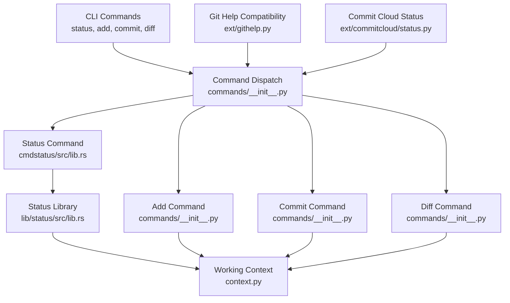
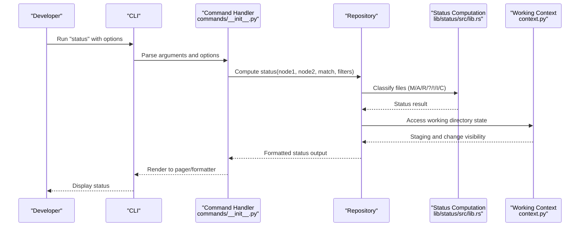
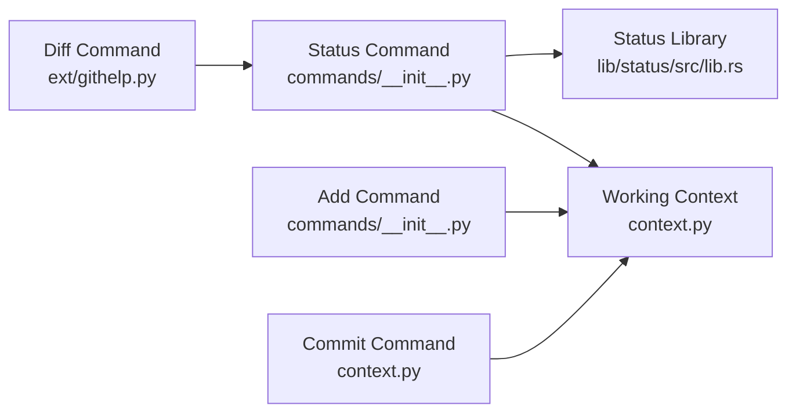

# Working Directory Management

<cite>
**Referenced Files in This Document**
- [context.py](file://eden/scm/sapling/context.py)
- [lib.rs](file://eden/scm/lib/status/src/lib.rs)
- [lib.rs](file://eden/scm/lib/commands/commands/cmdstatus/src/lib.rs)
- [__init__.py](file://eden/scm/sapling/commands/__init__.py)
- [status.py](file://eden/scm/sapling/ext/commitcloud/status.py)
- [status.py](file://eden/scm/sapling/ext/githelp.py)
- [test-help.t](file://eden/scm/tests/test-help.t)
- [test-alias.t](file://eden/scm/tests/test-alias.t)
</cite>

## Table of Contents
1. [Introduction](#introduction)
2. [Project Structure](#project-structure)
3. [Core Components](#core-components)
4. [Architecture Overview](#architecture-overview)
5. [Detailed Component Analysis](#detailed-component-analysis)
6. [Dependency Analysis](#dependency-analysis)
7. [Performance Considerations](#performance-considerations)
8. [Troubleshooting Guide](#troubleshooting-guide)
9. [Conclusion](#conclusion)

## Introduction
This document explains SAPLING SCM working directory management with a focus on status, add, commit, and diff commands. It covers staging workflow, file tracking, change detection, diff formats, patch generation, conflict resolution, working directory cleanup, ignored files, and sparse checkout configurations. The goal is to help developers efficiently manage changes in their working directory and integrate with repository history.

## Project Structure
SAPLING SCM organizes working directory management across several layers:
- Command definitions and dispatch live in the commands module.
- Working directory context and staging are modeled in the context layer.
- Status computation and file-state classification are implemented in Rust libraries.
- Extension modules provide compatibility and additional behaviors.

**Diagram sources**
- [__init__.py:5585-5698](file://eden/scm/sapling/commands/__init__.py#L5585-L5698)
- [lib.rs:1-364](file://eden/scm/lib/commands/commands/cmdstatus/src/lib.rs#L1-L364)
- [lib.rs:168-213](file://eden/scm/lib/status/src/lib.rs#L168-L213)
- [context.py:1815-2749](file://eden/scm/sapling/context.py#L1815-L2749)
- [status.py:975-1020](file://eden/scm/sapling/ext/githelp.py#L975-L1020)
- [status.py](file://eden/scm/sapling/ext/commitcloud/status.py)

**Section sources**
- [__init__.py:5585-5698](file://eden/scm/sapling/commands/__init__.py#L5585-L5698)
- [lib.rs:1-364](file://eden/scm/lib/commands/commands/cmdstatus/src/lib.rs#L1-L364)
- [lib.rs:168-213](file://eden/scm/lib/status/src/lib.rs#L168-L213)
- [context.py:1815-2749](file://eden/scm/sapling/context.py#L1815-L2749)
- [status.py:975-1020](file://eden/scm/sapling/ext/githelp.py#L975-L1020)
- [status.py](file://eden/scm/sapling/ext/commitcloud/status.py)

## Core Components
- Working directory context: encapsulates current working directory state, staging area, and change visibility during commits.
- Status computation: classifies files into Modified, Added, Removed, Deleted, Unknown, Ignored, and Clean states.
- Command dispatch: exposes status, add, commit, and diff commands with consistent options and behaviors.

Key responsibilities:
- Status: enumerates and filters working directory changes relative to a base revision or current state.
- Add: stages tracked and untracked files for inclusion in the next commit.
- Commit: records staged changes as a new revision with metadata and message.
- Diff: compares working directory against a base or previous state, supporting unified and other formats.

**Section sources**
- [context.py:1815-2749](file://eden/scm/sapling/context.py#L1815-L2749)
- [lib.rs:168-213](file://eden/scm/lib/status/src/lib.rs#L168-L213)
- [lib.rs:28-364](file://eden/scm/lib/commands/commands/cmdstatus/src/lib.rs#L28-L364)
- [__init__.py:5585-5698](file://eden/scm/sapling/commands/__init__.py#L5585-L5698)

## Architecture Overview
The working directory management pipeline connects CLI commands to status computation and working context:

**Diagram sources**
- [__init__.py:5585-5698](file://eden/scm/sapling/commands/__init__.py#L5585-L5698)
- [lib.rs:168-213](file://eden/scm/lib/status/src/lib.rs#L168-L213)
- [context.py:1815-2749](file://eden/scm/sapling/context.py#L1815-L2749)

## Detailed Component Analysis

### Status Command
Purpose: Enumerate and filter working directory changes relative to a base revision or current state.

Syntax and parameters:
- Flags to filter states: --all, --modified (-m), --added (-a), --removed (-r), --deleted (-d), --clean (-c), --unknown (-u), --ignored (-i).
- Formatting: --no-status, --terse, --copies (-C), --print0 (-0).
- Revision selection: --rev [REV], --change [REV].
- Path filtering: patterns and walkopts.
- Output control: formatter options inherited from cmdutil.

Processing logic:
- Validates incompatible combinations (e.g., --rev and --change, --terse with --rev).
- Determines base and target nodes (current working directory or specified revisions).
- Computes status with filters for ignored, clean, and unknown files.
- Optionally resolves copy traces for renamed/copied files.
- Renders output via formatter with optional status prefixes and copy information.

Common usage examples:
- Show all changes including copies: status --copies --change <rev>.
- Get NUL-separated added files for scripting: status -an0.
- Verbose terse output for abbreviated paths: status -v -t mardu.

Notes:
- Terse mode computes clean and unknown sets internally.
- Copy tracing is enabled when requested or configured.

**Section sources**
- [lib.rs:28-364](file://eden/scm/lib/commands/commands/cmdstatus/src/lib.rs#L28-L364)
- [__init__.py:5585-5698](file://eden/scm/sapling/commands/__init__.py#L5585-L5698)
- [test-help.t:651-679](file://eden/scm/tests/test-help.t#L651-L679)
- [test-alias.t:262-290](file://eden/scm/tests/test-alias.t#L262-L290)

### Add Command
Purpose: Stage tracked and untracked files for inclusion in the next commit.

Syntax and parameters:
- Accepts file patterns and directories.
- Supports include/exclude patterns and walkopts.
- Integrates with repository matchers and working copy policies.

Processing logic:
- Matches files against patterns and working copy state.
- Updates staging area to include selected files.
- Honors ignored files and sparse checkout configuration.

Common usage examples:
- Stage all new files: add .
- Stage specific files: add src/*.py.
- Stage with include/exclude: add --include="*.rs" --exclude="*_test.rs".

Notes:
- Add operates on the working directory and staging area.
- Respects .gitignore-like rules and sparse checkout settings.

**Section sources**
- [__init__.py:5585-5698](file://eden/scm/sapling/commands/__init__.py#L5585-L5698)

### Commit Command
Purpose: Record staged changes as a new revision with metadata and message.

Syntax and parameters:
- Message: -m/--message or interactive editor.
- Author/date: --user/--date.
- Extra metadata: --extra.
- Parents: defaults to current working directory parents; can override for merge commits.

Processing logic:
- Builds commit context from staging and working directory.
- Validates commit prerequisites (message, unresolved conflicts).
- Writes new revision to repository history.
- Updates working directory state and dirstate.

Common usage examples:
- Commit with message: commit -m "Fix bug".
- Commit with author: commit --user "Alice <alice@example.com>" -m "Update".
- Merge commit: commit --parents "<base> <branch>" -m "Merge branch".

Notes:
- Commit interacts with working context and staging area.
- Handles unresolved merge conflicts and aborts if not resolved.

**Section sources**
- [context.py:1815-2749](file://eden/scm/sapling/context.py#L1815-L2749)

### Diff Command
Purpose: Compare working directory against a base or previous state, generating unified diffs or other formats.

Syntax and parameters:
- Base/target selection: --rev [REV], --change [REV].
- Unified diff context: --unified N.
- Output control: --name-status, --stat, --no-color.
- Formatting: pretty formats and patch generation.

Processing logic:
- Determines base and target contexts (working directory or specified revisions).
- Generates unified diffs with configurable context lines.
- Supports name-status and stat summaries for quick reviews.
- Integrates with formatter and pager for output.

Common usage examples:
- Compare working directory to a specific revision: diff --rev <rev>.
- Show changed files only: diff --name-status.
- Generate patch for submission: diff --unified 8 > changes.patch.

Notes:
- Standard unified diff format does not report permission changes.
- For merges, diff reports changes relative to one merge parent.

**Section sources**
- [status.py:975-1020](file://eden/scm/sapling/ext/githelp.py#L975-L1020)
- [test-help.t:651-679](file://eden/scm/tests/test-help.t#L651-L679)
- [test-alias.t:262-290](file://eden/scm/tests/test-alias.t#L262-L290)

### Staging Workflow and File Tracking
Staging workflow:
- Working directory tracks uncommitted changes.
- Add stages files from working directory to staging area.
- Commit writes staged changes to repository history and updates working directory.
- Status enumerates changes across working directory, staging, and repository.

File tracking:
- Modified: file content differs from repository.
- Added: file present in working directory but not in repository.
- Removed: file present in repository but not in working directory.
- Deleted: file marked for removal in staging.
- Unknown: file present in working directory but not tracked by repository.
- Ignored: file present in working directory but excluded by ignore rules.
- Clean: file unchanged relative to repository.

Change detection:
- Status computation classifies files into states.
- Working context exposes staging and change visibility during commits.
- Copy tracing identifies renames/copies for accurate reporting.

**Section sources**
- [lib.rs:168-213](file://eden/scm/lib/status/src/lib.rs#L168-L213)
- [context.py:1815-2749](file://eden/scm/sapling/context.py#L1815-L2749)

### Diff Formats, Patch Generation, and Conflict Resolution
Diff formats:
- Unified diff: standard format with context lines.
- Name-status: concise listing of affected files.
- Stat: summary of changes per file.

Patch generation:
- Unified diff can be redirected to a file for patch submission.
- Pretty formats support structured output for automation.

Conflict resolution:
- Unresolved merge conflicts prevent commit.
- Status indicates unresolved files; resolve manually and stage fixes.
- Commit aborts if conflicts remain unresolved.

**Section sources**
- [status.py:975-1020](file://eden/scm/sapling/ext/githelp.py#L975-L1020)
- [test-help.t:651-679](file://eden/scm/tests/test-help.t#L651-L679)

### Working Directory Cleanup, Ignored Files, and Sparse Checkout
Cleanup:
- Remove untracked files and directories using repository utilities.
- Dry-run options to preview deletions before applying.

Ignored files:
- Ignored files are excluded from status and staging by default.
- --ignored flag displays ignored files when needed.
- Include/exclude patterns can refine ignored-file handling.

Sparse checkout:
- Pattern-based selection limits which files are materialized.
- Walkopts and matchers enforce sparse behavior during status and add.
- Combine with include/exclude patterns for precise control.

**Section sources**
- [lib.rs:28-364](file://eden/scm/lib/commands/commands/cmdstatus/src/lib.rs#L28-L364)
- [__init__.py:5585-5698](file://eden/scm/sapling/commands/__init__.py#L5585-L5698)
- [test-help.t:651-679](file://eden/scm/tests/test-help.t#L651-L679)

## Dependency Analysis
Command-layer dependencies:
- Status command depends on status computation library and working context.
- Add and commit commands depend on working context and repository state.
- Diff command integrates with formatter and pager for output.

**Diagram sources**
- [__init__.py:5585-5698](file://eden/scm/sapling/commands/__init__.py#L5585-L5698)
- [lib.rs:168-213](file://eden/scm/lib/status/src/lib.rs#L168-L213)
- [context.py:1815-2749](file://eden/scm/sapling/context.py#L1815-L2749)
- [status.py:975-1020](file://eden/scm/sapling/ext/githelp.py#L975-L1020)

**Section sources**
- [__init__.py:5585-5698](file://eden/scm/sapling/commands/__init__.py#L5585-L5698)
- [lib.rs:168-213](file://eden/scm/lib/status/src/lib.rs#L168-L213)
- [context.py:1815-2749](file://eden/scm/sapling/context.py#L1815-L2749)
- [status.py:975-1020](file://eden/scm/sapling/ext/githelp.py#L975-L1020)

## Performance Considerations
- Use --terse for compact status output when scanning many files.
- Limit scope with patterns and include/exclude to reduce traversal overhead.
- Avoid --all with large repositories; filter to specific states as needed.
- Leverage pager and formatter options to minimize memory overhead for large outputs.

## Troubleshooting Guide
Common issues and resolutions:
- Conflicting options: status does not allow --rev and --change together; use one or the other.
- Terse mode restrictions: --terse cannot be combined with --rev.
- Unresolved conflicts: commit fails if merge conflicts remain; resolve and stage fixes.
- Ignored files not appearing: use --ignored to include ignored files in output.
- Permission changes: unified diff does not report permission changes; use stat or verbose status for details.

**Section sources**
- [__init__.py:5585-5698](file://eden/scm/sapling/commands/__init__.py#L5585-L5698)
- [test-help.t:651-679](file://eden/scm/tests/test-help.t#L651-L679)
- [test-alias.t:262-290](file://eden/scm/tests/test-alias.t#L262-L290)

## Conclusion
SAPLING SCM provides a cohesive working directory management experience centered around status, add, commit, and diff. The status command offers flexible filtering and formatting, while add and commit implement a clear staging workflow. Diff supports unified and other formats for review and patch generation. Proper handling of ignored files, sparse checkout, and conflict resolution ensures reliable day-to-day development workflows.