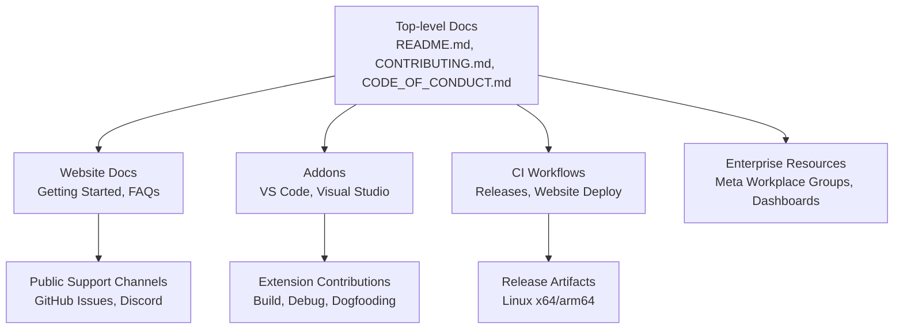
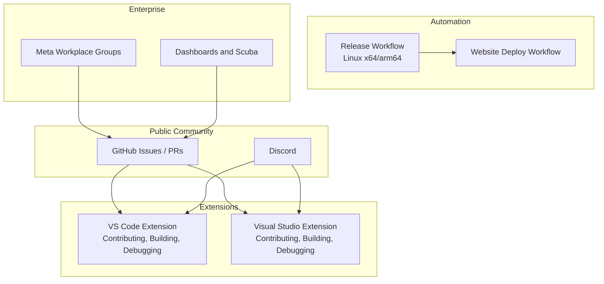
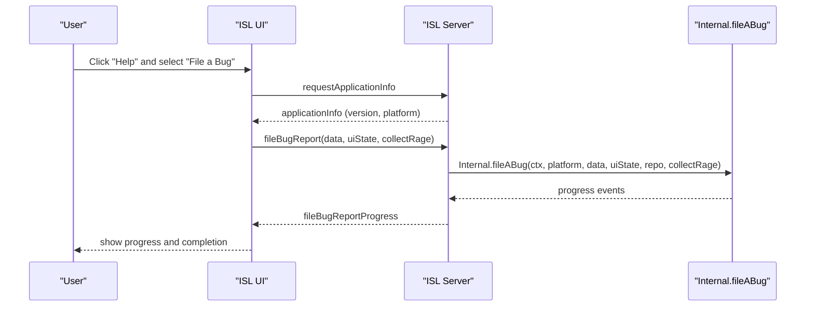
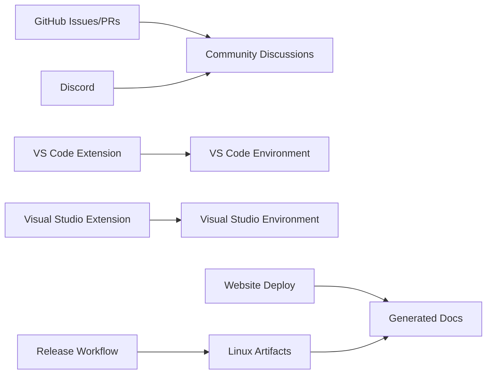

# Community and Support

<cite>
**Referenced Files in This Document**
- [README.md](file://README.md)
- [CONTRIBUTING.md](file://CONTRIBUTING.md)
- [CODE_OF_CONDUCT.md](file://CODE_OF_CONDUCT.md)
- [website/docs/introduction/getting-started.md](file://website/docs/introduction/getting-started.md)
- [website/docs/faqs.md](file://website/docs/faqs.md)
- [addons/vscode/CONTRIBUTING.md](file://addons/vscode/CONTRIBUTING.md)
- [addons/vscode/README.md](file://addons/vscode/README.md)
- [addons/vs/CONTRIBUTING.md](file://addons/vs/CONTRIBUTING.md)
- [addons/vs/README.md](file://addons/vs/README.md)
- [.github/workflows/sapling-cli-manylinux-release.yml](file://.github/workflows/sapling-cli-manylinux-release.yml)
- [.github/workflows/sapling-website-deploy.yml](file://.github/workflows/sapling-website-deploy.yml)
- [addons/isl/src/BugButton.tsx](file://addons/isl/src/BugButton.tsx)
- [addons/isl-server/src/ServerToClientAPI.ts](file://addons/isl-server/src/ServerToClientAPI.ts)
- [eden/docs/Engineering/Repo_Support_On_Remote_Execution/resources.md](file://eden/docs/Engineering/Repo_Support_On_Remote_Execution/resources.md)
</cite>

## Table of Contents
1. [Introduction](#introduction)
2. [Project Structure](#project-structure)
3. [Core Components](#core-components)
4. [Architecture Overview](#architecture-overview)
5. [Detailed Component Analysis](#detailed-component-analysis)
6. [Dependency Analysis](#dependency-analysis)
7. [Performance Considerations](#performance-considerations)
8. [Troubleshooting Guide](#troubleshooting-guide)
9. [Conclusion](#conclusion)
10. [Appendices](#appendices)

## Introduction
This document describes how to engage with the SAPLING SCM community, including contribution pathways, code of conduct expectations, development processes, and support channels. It consolidates official guidance from the repository’s contributing and conduct documents, extension-specific contribution notes, and the website’s getting started and FAQ materials. It also outlines the current public support channels and links to internal Meta resources for enterprise users.

## Project Structure
The repository includes:
- Top-level community and policy documents (contributing, conduct, readme)
- Website documentation with user and developer guidance
- Addons for VS Code and Visual Studio, each with their own contribution and usage notes
- GitHub workflows for releases and website publishing
- Internal engineering documentation pointing to Meta Workplace groups and dashboards for enterprise support

**Section sources**
- [README.md:68-72](file://README.md#L68-L72)
- [website/docs/introduction/getting-started.md:1-188](file://website/docs/introduction/getting-started.md#L1-L188)
- [addons/vscode/CONTRIBUTING.md:1-59](file://addons/vscode/CONTRIBUTING.md#L1-L59)
- [addons/vs/CONTRIBUTING.md:1-103](file://addons/vs/CONTRIBUTING.md#L1-L103)
- [.github/workflows/sapling-cli-manylinux-release.yml:1-66](file://.github/workflows/sapling-cli-manylinux-release.yml#L1-L66)
- [.github/workflows/sapling-website-deploy.yml:1-58](file://.github/workflows/sapling-website-deploy.yml#L1-L58)
- [eden/docs/Engineering/Repo_Support_On_Remote_Execution/resources.md:1-24](file://eden/docs/Engineering/Repo_Support_On_Remote_Execution/resources.md#L1-L24)

## Core Components
- Community and policy
  - Contributing guidelines and CLA requirement
  - Code of Conduct and reporting channels
- Support channels
  - Public: GitHub Issues and Discord
  - Enterprise/internal: Meta Workplace groups and dashboards
- Developer resources
  - VS Code and Visual Studio extension contribution notes
  - Website documentation for getting started and FAQs
- Release and publishing
  - Automated Linux release workflows
  - Website deployment pipeline

**Section sources**
- [CONTRIBUTING.md:10-41](file://CONTRIBUTING.md#L10-L41)
- [CODE_OF_CONDUCT.md:55-66](file://CODE_OF_CONDUCT.md#L55-L66)
- [README.md:68-72](file://README.md#L68-L72)
- [website/docs/introduction/getting-started.md:1-188](file://website/docs/introduction/getting-started.md#L1-L188)
- [addons/vscode/CONTRIBUTING.md:20-59](file://addons/vscode/CONTRIBUTING.md#L20-L59)
- [addons/vs/CONTRIBUTING.md:19-103](file://addons/vs/CONTRIBUTING.md#L19-L103)
- [.github/workflows/sapling-cli-manylinux-release.yml:1-66](file://.github/workflows/sapling-cli-manylinux-release.yml#L1-L66)
- [.github/workflows/sapling-website-deploy.yml:1-58](file://.github/workflows/sapling-website-deploy.yml#L1-L58)

## Architecture Overview
The community and support architecture centers on:
- Public collaboration via GitHub (issues, pull requests) and Discord
- Extension ecosystems (VS Code and Visual Studio) with dedicated contribution notes
- Automated release and documentation publishing pipelines
- Internal Meta resources for enterprise users

**Diagram sources**
- [README.md:68-72](file://README.md#L68-L72)
- [addons/vscode/CONTRIBUTING.md:1-59](file://addons/vscode/CONTRIBUTING.md#L1-L59)
- [addons/vs/CONTRIBUTING.md:1-103](file://addons/vs/CONTRIBUTING.md#L1-L103)
- [.github/workflows/sapling-cli-manylinux-release.yml:1-66](file://.github/workflows/sapling-cli-manylinux-release.yml#L1-L66)
- [.github/workflows/sapling-website-deploy.yml:1-58](file://.github/workflows/sapling-website-deploy.yml#L1-L58)
- [eden/docs/Engineering/Repo_Support_On_Remote_Execution/resources.md:1-24](file://eden/docs/Engineering/Repo_Support_On_Remote_Execution/resources.md#L1-L24)

## Detailed Component Analysis

### Contributing Guidelines
- Pull requests: fork, branch from main, add tests, update docs, pass tests and lint, ensure CLA is completed, and note licensing under GPLv2.
- Issues: use GitHub Issues for public bugs; security bugs follow Facebook’s whitehat process privately.

**Section sources**
- [CONTRIBUTING.md:10-41](file://CONTRIBUTING.md#L10-L41)

### Code of Conduct
- Pledge to a harassment-free environment; standards for positive behavior; unacceptable behaviors; responsibilities of maintainers; scope; enforcement via a dedicated email; attribution to Contributor Covenant.

**Section sources**
- [CODE_OF_CONDUCT.md:3-78](file://CODE_OF_CONDUCT.md#L3-L78)

### Public Support Channels
- Report issues on GitHub and join the Discord community.
- Website documentation provides getting started guidance and FAQs.

**Section sources**
- [README.md:68-72](file://README.md#L68-L72)
- [website/docs/introduction/getting-started.md:1-188](file://website/docs/introduction/getting-started.md#L1-L188)
- [website/docs/faqs.md:1-12](file://website/docs/faqs.md#L1-L12)

### Enterprise/Internal Support
- Meta employees can use internal Workplace groups and dashboards for SCM and Remote Execution support.
- Includes dashboards, SLOs, and telemetry links.

**Section sources**
- [eden/docs/Engineering/Repo_Support_On_Remote_Execution/resources.md:1-24](file://eden/docs/Engineering/Repo_Support_On_Remote_Execution/resources.md#L1-L24)

### VS Code Extension Contribution and Usage
- Two forms of JavaScript: extension host and webview; separate builds communicating via VS Code’s message passing.
- Build/run: watch/build tasks; production builds; symlink-based dogfooding.
- Debugging tips for webview source maps.

**Section sources**
- [addons/vscode/CONTRIBUTING.md:1-59](file://addons/vscode/CONTRIBUTING.md#L1-L59)
- [addons/vscode/README.md:1-16](file://addons/vscode/README.md#L1-L16)

### Visual Studio Extension Contribution and Usage
- Prerequisites, building, compiling, testing, debugging, and logging guidance.
- Tool window access and reloading.

**Section sources**
- [addons/vs/CONTRIBUTING.md:1-103](file://addons/vs/CONTRIBUTING.md#L1-L103)
- [addons/vs/README.md:1-16](file://addons/vs/README.md#L1-L16)

### Release and Website Automation
- Linux release workflow builds x64 and arm64 artifacts and publishes releases.
- Website deploy workflow installs the latest release, generates docs, builds the site, and deploys to GitHub Pages.

**Section sources**
- [.github/workflows/sapling-cli-manylinux-release.yml:1-66](file://.github/workflows/sapling-cli-manylinux-release.yml#L1-L66)
- [.github/workflows/sapling-website-deploy.yml:1-58](file://.github/workflows/sapling-website-deploy.yml#L1-L58)

### Bug Reporting and Feature Requests
- Public bug reports via GitHub Issues.
- Security disclosures via Facebook’s whitehat program.
- ISL includes a “Help” dropdown with version info and heartbeat warnings, and a “File a Bug” action that communicates with the server to collect diagnostics and progress updates.

**Diagram sources**
- [addons/isl/src/BugButton.tsx:32-91](file://addons/isl/src/BugButton.tsx#L32-L91)
- [addons/isl-server/src/ServerToClientAPI.ts:303-338](file://addons/isl-server/src/ServerToClientAPI.ts#L303-L338)

**Section sources**
- [CONTRIBUTING.md:26-32](file://CONTRIBUTING.md#L26-L32)
- [addons/isl/src/BugButton.tsx:32-91](file://addons/isl/src/BugButton.tsx#L32-L91)
- [addons/isl-server/src/ServerToClientAPI.ts:303-338](file://addons/isl-server/src/ServerToClientAPI.ts#L303-L338)

### Feature Requests and Triage
- Feature requests should be discussed on GitHub Issues; maintainers triage based on project scope and community feedback.
- Security-sensitive features should follow the whitehat process.

**Section sources**
- [CONTRIBUTING.md:26-32](file://CONTRIBUTING.md#L26-L32)

### Community Projects and Ecosystem
- Interactive Smartlog (ISL) is available as a web UI and in VS Code and Visual Studio.
- Website documentation covers ISL usage and integration with GitHub PRs and ReviewStack.

**Section sources**
- [README.md:12-12](file://README.md#L12-L12)
- [website/docs/introduction/getting-started.md:106-147](file://website/docs/introduction/getting-started.md#L106-L147)

### Collaborative Development Practices
- Follow the Code of Conduct in all interactions.
- Use GitHub Issues for bug reports and feature requests.
- For extensions, follow the addon-specific contributing notes for building, testing, and debugging.

**Section sources**
- [CODE_OF_CONDUCT.md:3-78](file://CODE_OF_CONDUCT.md#L3-L78)
- [CONTRIBUTING.md:10-41](file://CONTRIBUTING.md#L10-L41)
- [addons/vscode/CONTRIBUTING.md:20-59](file://addons/vscode/CONTRIBUTING.md#L20-L59)
- [addons/vs/CONTRIBUTING.md:19-103](file://addons/vs/CONTRIBUTING.md#L19-L103)

## Dependency Analysis
- Public collaboration depends on GitHub for issues and pull requests.
- Extensions depend on their respective IDE environments and build systems.
- Release automation depends on CI workflows and artifact storage.
- Website documentation depends on the latest release binary for generating command docs.

**Diagram sources**
- [README.md:68-72](file://README.md#L68-L72)
- [addons/vscode/CONTRIBUTING.md:1-59](file://addons/vscode/CONTRIBUTING.md#L1-L59)
- [addons/vs/CONTRIBUTING.md:1-103](file://addons/vs/CONTRIBUTING.md#L1-L103)
- [.github/workflows/sapling-cli-manylinux-release.yml:1-66](file://.github/workflows/sapling-cli-manylinux-release.yml#L1-L66)
- [.github/workflows/sapling-website-deploy.yml:1-58](file://.github/workflows/sapling-website-deploy.yml#L1-L58)

**Section sources**
- [README.md:68-72](file://README.md#L68-L72)
- [addons/vscode/CONTRIBUTING.md:1-59](file://addons/vscode/CONTRIBUTING.md#L1-L59)
- [addons/vs/CONTRIBUTING.md:1-103](file://addons/vs/CONTRIBUTING.md#L1-L103)
- [.github/workflows/sapling-cli-manylinux-release.yml:1-66](file://.github/workflows/sapling-cli-manylinux-release.yml#L1-L66)
- [.github/workflows/sapling-website-deploy.yml:1-58](file://.github/workflows/sapling-website-deploy.yml#L1-L58)

## Performance Considerations
- Use the latest release binary for website generation to ensure accurate command documentation.
- For extension development, leverage watch tasks to iterate quickly and minimize rebuild times.

[No sources needed since this section provides general guidance]

## Troubleshooting Guide
- ISL heartbeat timeout: the UI displays a warning and suggests restarting the ISL server; version and platform info are included in the bug report flow.
- Collect diagnostic information: the bug reporting flow gathers UI state and optionally rage logs, emitting progress updates to the UI.

**Section sources**
- [addons/isl/src/BugButton.tsx:77-91](file://addons/isl/src/BugButton.tsx#L77-L91)
- [addons/isl-server/src/ServerToClientAPI.ts:303-338](file://addons/isl-server/src/ServerToClientAPI.ts#L303-L338)

## Conclusion
The SAPLING SCM community relies on GitHub for collaboration and Discord for real-time discussion. Contributors must adhere to the Code of Conduct, complete a CLA for contributions, and follow the documented development processes. The VS Code and Visual Studio extensions provide rich development experiences with dedicated contribution notes. Enterprise users can leverage internal Meta resources for support and dashboards. Automated workflows publish releases and keep the website documentation current.

[No sources needed since this section summarizes without analyzing specific files]

## Appendices
- Getting started and FAQs are available in the website documentation.
- Extension usage instructions are provided alongside their contribution notes.

**Section sources**
- [website/docs/introduction/getting-started.md:1-188](file://website/docs/introduction/getting-started.md#L1-L188)
- [website/docs/faqs.md:1-12](file://website/docs/faqs.md#L1-L12)
- [addons/vscode/README.md:1-16](file://addons/vscode/README.md#L1-L16)
- [addons/vs/README.md:1-16](file://addons/vs/README.md#L1-L16)